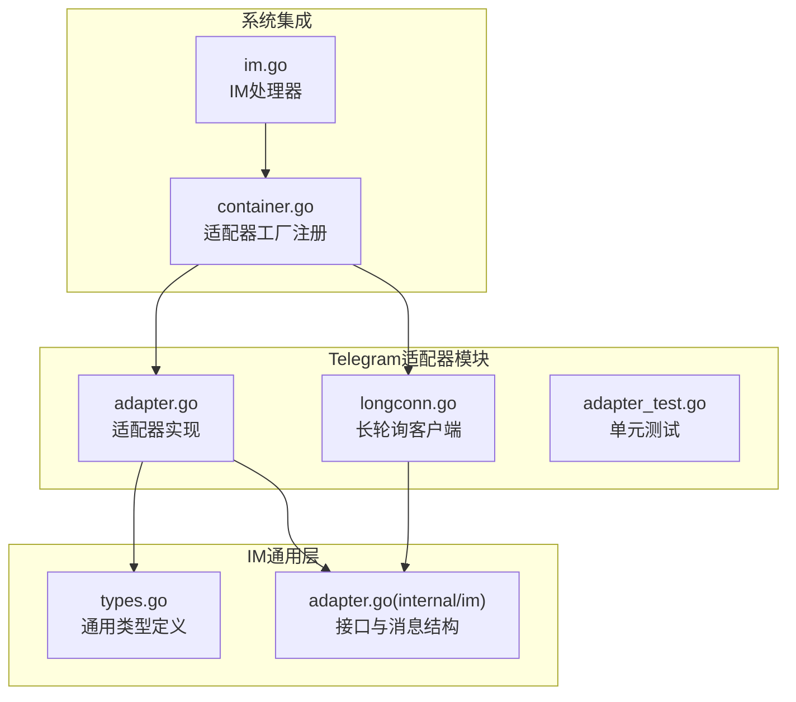
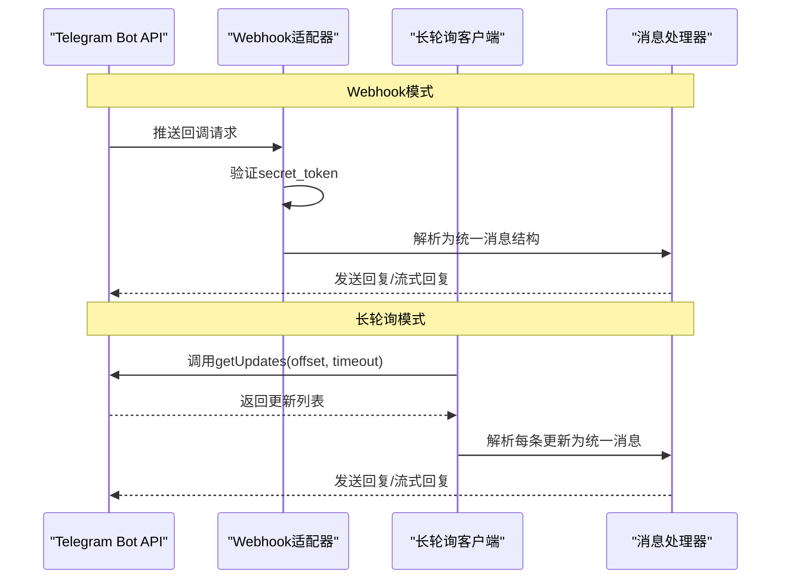
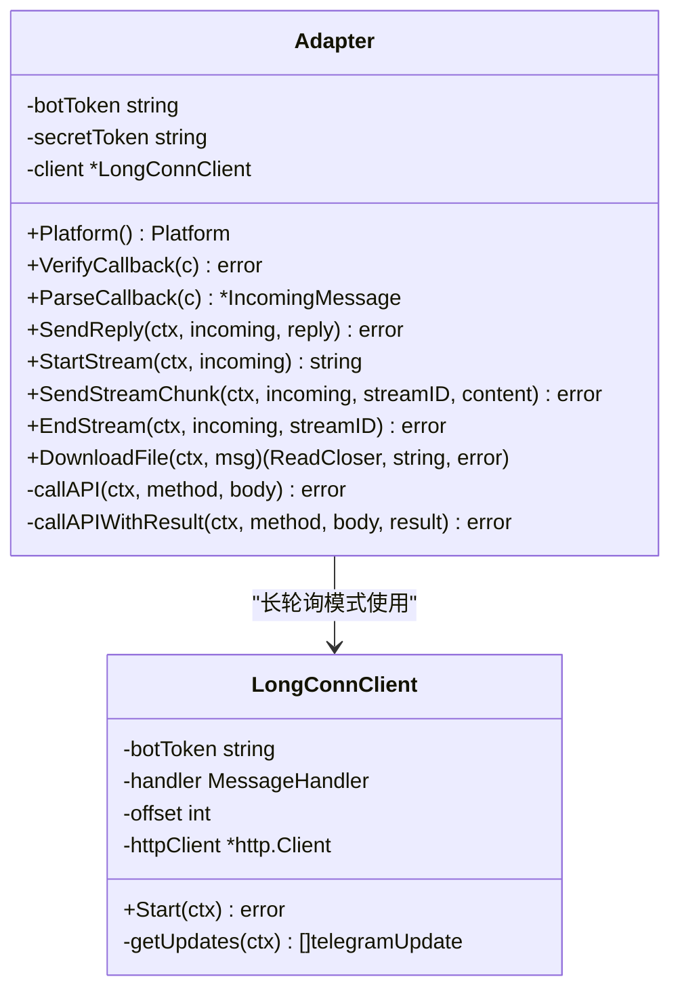
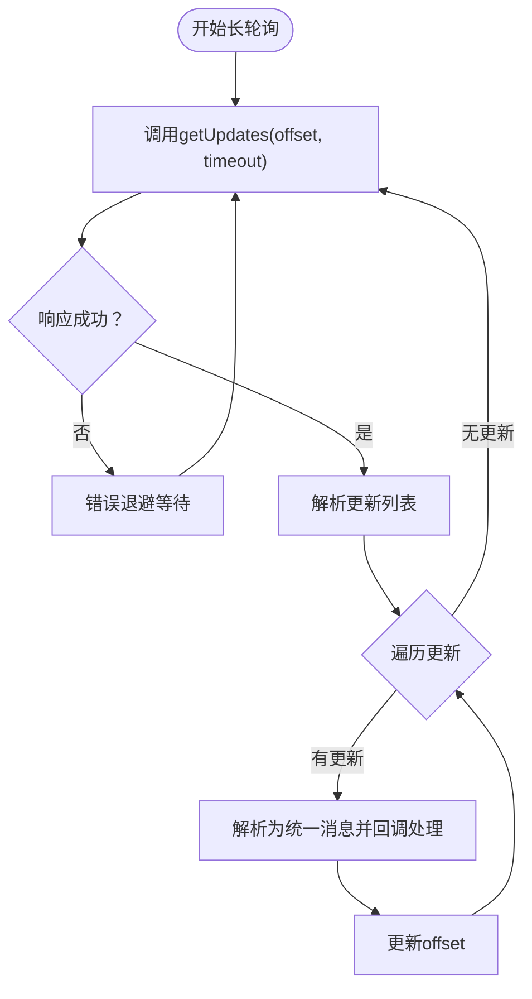
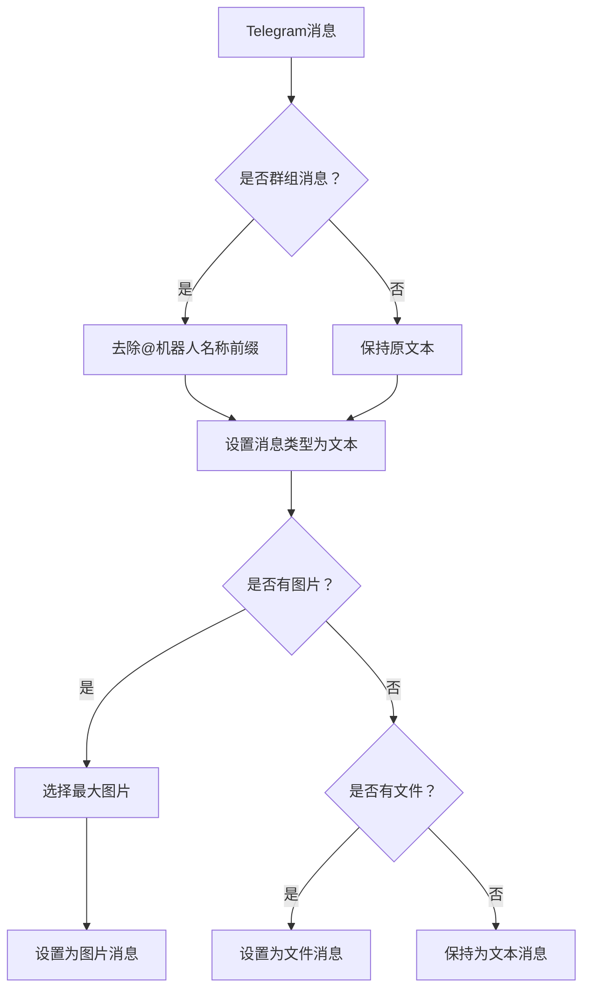
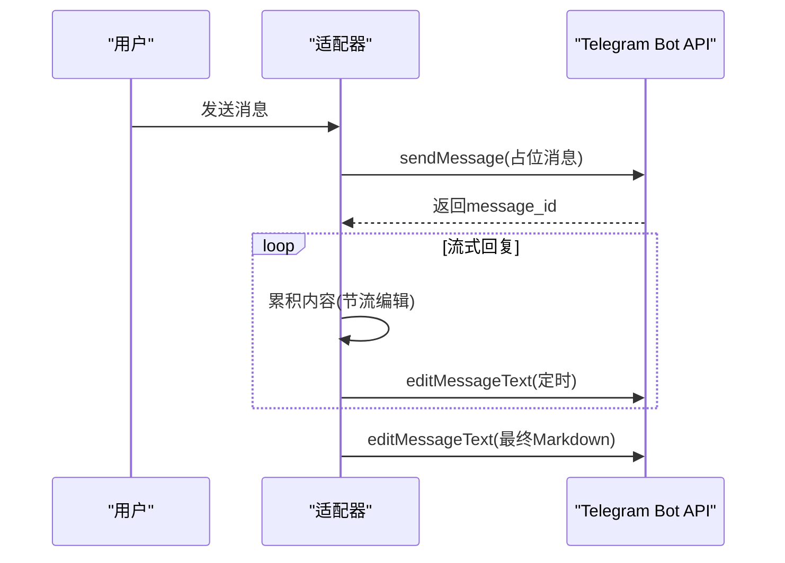
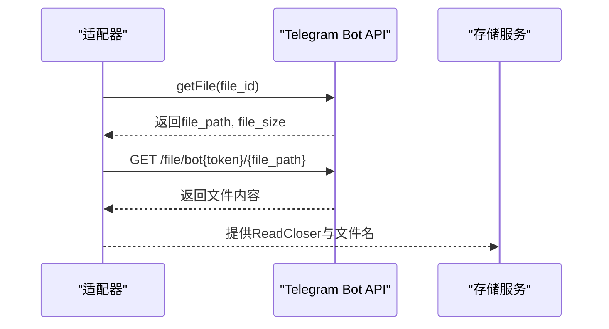
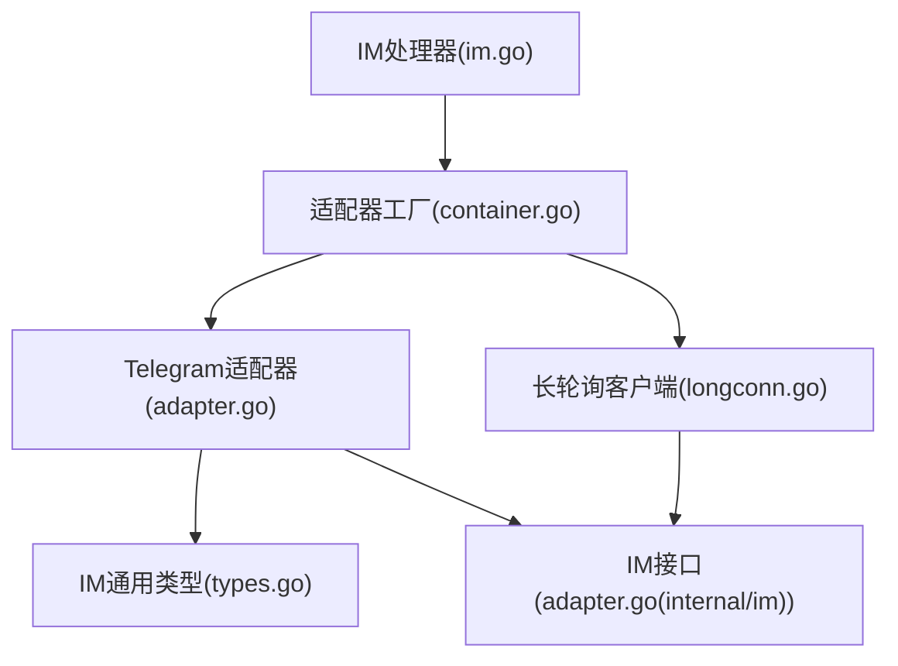

# Telegram适配器

<cite>
**本文档引用的文件**
- [adapter.go](file://internal/im/telegram/adapter.go)
- [longconn.go](file://internal/im/telegram/longconn.go)
- [adapter_test.go](file://internal/im/telegram/adapter_test.go)
- [types.go](file://internal/im/types.go)
- [adapter.go](file://internal/im/adapter.go)
- [container.go](file://internal/container/container.go)
- [im.go](file://internal/handler/im.go)
</cite>

## 目录
1. [简介](#简介)
2. [项目结构](#项目结构)
3. [核心组件](#核心组件)
4. [架构总览](#架构总览)
5. [详细组件分析](#详细组件分析)
6. [依赖关系分析](#依赖关系分析)
7. [性能考虑](#性能考虑)
8. [故障排除指南](#故障排除指南)
9. [结论](#结论)
10. [附录](#附录)

## 简介
本文件为WeKnora项目的Telegram适配器提供全面的技术文档。内容涵盖Telegram平台的消息处理机制（普通聊天、群组对话、频道订阅与论坛主题）、Bot API使用方法、Token获取与Webhook配置、长轮询机制与消息更新处理流程，以及对多种消息类型的处理（文本、图片、文件等），并包含平台特有的消息格式处理、@用户名解析与用户隐私保护机制。

## 项目结构
Telegram适配器位于内部模块`internal/im/telegram`中，主要由以下文件组成：
- adapter.go：实现Telegram适配器的核心逻辑，支持Webhook与长轮询两种模式
- longconn.go：实现Telegram长轮询客户端，持续拉取消息更新
- adapter_test.go：针对消息解析与线程ID处理的单元测试
- types.go：IM通用类型定义，包含IncomingMessage、ChatType、MessageType等
- adapter.go（internal/im）：IM接口与统一消息结构定义
- container.go：适配器工厂注册与通道启动逻辑
- im.go：IM处理器，包含平台校验与通道CRUD

**图表来源**
- [adapter.go:1-486](file://internal/im/telegram/adapter.go#L1-L486)
- [longconn.go:1-117](file://internal/im/telegram/longconn.go#L1-L117)
- [types.go:1-179](file://internal/im/types.go#L1-L179)
- [adapter.go:1-165](file://internal/im/adapter.go#L1-L165)
- [container.go:1313-1349](file://internal/container/container.go#L1313-L1349)
- [im.go:1-200](file://internal/handler/im.go#L1-L200)

**章节来源**
- [adapter.go:1-486](file://internal/im/telegram/adapter.go#L1-L486)
- [longconn.go:1-117](file://internal/im/telegram/longconn.go#L1-L117)
- [types.go:1-179](file://internal/im/types.go#L1-L179)
- [adapter.go:1-165](file://internal/im/adapter.go#L1-L165)
- [container.go:1313-1349](file://internal/container/container.go#L1313-L1349)
- [im.go:1-200](file://internal/handler/im.go#L1-L200)

## 核心组件
- 适配器（Adapter）：实现IM接口，负责回调验证、消息解析、发送回复、流式回复与文件下载
- 长连接客户端（LongConnClient）：基于Telegram Bot API的长轮询客户端，持续拉取消息更新
- 统一消息结构（IncomingMessage/ReplyMessage）：跨平台的消息抽象，包含用户、聊天、消息类型、附件等字段
- 适配器工厂：在容器中根据通道配置选择Webhook或长轮询模式

关键特性：
- 支持Webhook与长轮询两种接入模式
- 解析文本、图片、文件等多种消息类型
- 处理群组@机器人名称前缀与论坛主题线程ID
- 流式回复与定时编辑，避免频繁API调用
- 文件下载通过Telegram文件API获取真实路径并下载

**章节来源**
- [adapter.go:29-71](file://internal/im/telegram/adapter.go#L29-L71)
- [longconn.go:18-33](file://internal/im/telegram/longconn.go#L18-L33)
- [adapter.go:42-118](file://internal/im/adapter.go#L42-L118)
- [container.go:1313-1349](file://internal/container/container.go#L1313-L1349)

## 架构总览
Telegram适配器通过两种方式接入：
- Webhook模式：由Telegram服务器主动推送消息到配置的URL，适配器进行回调验证后解析消息
- 长轮询模式：适配器主动调用Telegram的getUpdates接口，循环拉取消息更新

**图表来源**
- [adapter.go:58-71](file://internal/im/telegram/adapter.go#L58-L71)
- [adapter.go:216-231](file://internal/im/telegram/adapter.go#L216-L231)
- [longconn.go:35-76](file://internal/im/telegram/longconn.go#L35-L76)
- [longconn.go:78-116](file://internal/im/telegram/longconn.go#L78-L116)

## 详细组件分析

### 适配器（Adapter）
- 平台标识：返回PlatformTelegram
- 回调验证：当配置了secret_token时，检查请求头X-Telegram-Bot-Api-Secret-Token
- 消息解析：将Telegram更新转换为统一IncomingMessage，处理群组@机器人名称前缀与论坛主题线程ID
- 发送回复：调用sendMessage，支持Markdown解析与回复到指定消息
- 流式回复：通过editMessageText定时编辑消息，避免频繁发送
- 文件下载：通过getFile获取文件路径后下载

**图表来源**
- [adapter.go:29-52](file://internal/im/telegram/adapter.go#L29-L52)
- [adapter.go:216-303](file://internal/im/telegram/adapter.go#L216-L303)
- [adapter.go:452-485](file://internal/im/telegram/adapter.go#L452-L485)
- [longconn.go:18-33](file://internal/im/telegram/longconn.go#L18-L33)

**章节来源**
- [adapter.go:54-71](file://internal/im/telegram/adapter.go#L54-L71)
- [adapter.go:115-204](file://internal/im/telegram/adapter.go#L115-L204)
- [adapter.go:216-231](file://internal/im/telegram/adapter.go#L216-L231)
- [adapter.go:359-446](file://internal/im/telegram/adapter.go#L359-L446)
- [adapter.go:454-485](file://internal/im/telegram/adapter.go#L454-L485)

### 长连接客户端（LongConnClient）
- 循环拉取：使用offset参数避免重复接收消息
- 超时控制：请求超时35秒，响应解析失败时退避重试
- 更新处理：遍历返回的更新列表，解析为统一消息并回调处理函数

**图表来源**
- [longconn.go:35-76](file://internal/im/telegram/longconn.go#L35-L76)
- [longconn.go:78-116](file://internal/im/telegram/longconn.go#L78-L116)

**章节来源**
- [longconn.go:35-76](file://internal/im/telegram/longconn.go#L35-L76)
- [longconn.go:78-116](file://internal/im/telegram/longconn.go#L78-L116)

### 消息解析与类型处理
- 文本消息：直接映射为统一消息结构
- 群组消息：去除@机器人名称前缀，保留纯文本内容
- 论坛主题：提取message_thread_id作为ThreadID
- 图片消息：选择最大分辨率的图片，映射为图片消息
- 文件消息：映射为文件消息，包含文件名与大小

**图表来源**
- [adapter.go:176-204](file://internal/im/telegram/adapter.go#L176-L204)

**章节来源**
- [adapter.go:137-204](file://internal/im/telegram/adapter.go#L137-L204)
- [adapter_test.go:9-46](file://internal/im/telegram/adapter_test.go#L9-L46)

### 流式回复机制
- 初始消息：发送“正在思考...”作为占位消息
- 定时编辑：限制编辑频率（最小间隔约500ms），避免触发速率限制
- 内容合并：累积流式内容，最终以Markdown格式结束

**图表来源**
- [adapter.go:359-392](file://internal/im/telegram/adapter.go#L359-L392)
- [adapter.go:394-446](file://internal/im/telegram/adapter.go#L394-L446)

**章节来源**
- [adapter.go:307-357](file://internal/im/telegram/adapter.go#L307-L357)
- [adapter.go:359-446](file://internal/im/telegram/adapter.go#L359-L446)

### 文件下载流程
- 获取文件信息：调用getFile获取文件路径与大小
- 下载文件：拼接文件下载URL并发起HTTP GET请求
- 返回读取器：返回可读的文件流与原始文件名

**图表来源**
- [adapter.go:454-485](file://internal/im/telegram/adapter.go#L454-L485)

**章节来源**
- [adapter.go:454-485](file://internal/im/telegram/adapter.go#L454-L485)

## 依赖关系分析
- 适配器依赖IM通用类型（IncomingMessage、ReplyMessage、ChatType、MessageType等）
- 长连接客户端依赖IM接口定义与日志记录
- 容器注册适配器工厂，根据通道配置选择Webhook或长轮询模式
- IM处理器校验平台有效性并创建/更新通道

**图表来源**
- [adapter.go:18-20](file://internal/im/telegram/adapter.go#L18-L20)
- [types.go:1-179](file://internal/im/types.go#L1-L179)
- [adapter.go:1-165](file://internal/im/adapter.go#L1-L165)
- [container.go:1313-1349](file://internal/container/container.go#L1313-L1349)
- [im.go:14-18](file://internal/handler/im.go#L14-L18)

**章节来源**
- [adapter.go:18-20](file://internal/im/telegram/adapter.go#L18-L20)
- [types.go:1-179](file://internal/im/types.go#L1-L179)
- [adapter.go:1-165](file://internal/im/adapter.go#L1-L165)
- [container.go:1313-1349](file://internal/container/container.go#L1313-L1349)
- [im.go:14-18](file://internal/handler/im.go#L14-L18)

## 性能考虑
- 编辑节流：流式回复最小编辑间隔约500ms，避免频繁调用editMessageText
- 轮询超时：长轮询timeout=30秒，HTTP客户端超时35秒，减少资源占用
- 偏移量管理：长轮询使用offset避免重复处理消息
- 内存清理：流式会话采用后台清理器，防止内存泄漏

[本节为通用性能建议，不直接分析具体文件]

## 故障排除指南
- Webhook验证失败：检查secret_token是否正确配置，确保请求头X-Telegram-Bot-Api-Secret-Token匹配
- 长轮询错误：关注日志中的getUpdates错误，系统会在错误后进行退避重试
- 流式回复异常：检查编辑频率是否过快，确保最小编辑间隔生效
- 文件下载失败：确认file_id有效且未过期，检查HTTP状态码

**章节来源**
- [adapter.go:62-71](file://internal/im/telegram/adapter.go#L62-L71)
- [longconn.go:46-58](file://internal/im/telegram/longconn.go#L46-L58)
- [adapter.go:419-421](file://internal/im/telegram/adapter.go#L419-L421)

## 结论
Telegram适配器提供了完整的消息处理能力，支持Webhook与长轮询两种接入方式，并针对Telegram平台特性实现了消息解析、流式回复与文件下载等功能。通过统一的消息结构与严格的错误处理，适配器能够稳定地集成到WeKnora系统中，满足不同场景下的IM需求。

## 附录

### Telegram Bot API使用要点
- Token获取：通过BotFather创建机器人并获取bot_token
- Webhook配置：在通道配置中设置mode为webhook，并提供secret_token（可选）
- 长轮询：默认使用长轮询模式，无需额外配置

**章节来源**
- [container.go:1327-1344](file://internal/container/container.go#L1327-L1344)
- [im.go:62-65](file://internal/handler/im.go#L62-L65)

### 消息类型与处理
- 文本消息：直接解析为统一消息结构
- 图片消息：选择最大分辨率图片，映射为图片消息
- 文件消息：映射为文件消息，包含文件名与大小
- 群组消息：去除@机器人名称前缀，保留纯文本

**章节来源**
- [adapter.go:176-204](file://internal/im/telegram/adapter.go#L176-L204)
- [adapter_test.go:76-100](file://internal/im/telegram/adapter_test.go#L76-L100)

### 用户隐私保护
- 用户名优先级：优先使用first_name与last_name组合，若为空则使用username
- 私聊场景：ChatID为空时回退到UserID作为会话标识

**章节来源**
- [adapter.go:149-157](file://internal/im/telegram/adapter.go#L149-L157)
- [adapter.go:206-212](file://internal/im/telegram/adapter.go#L206-L212)