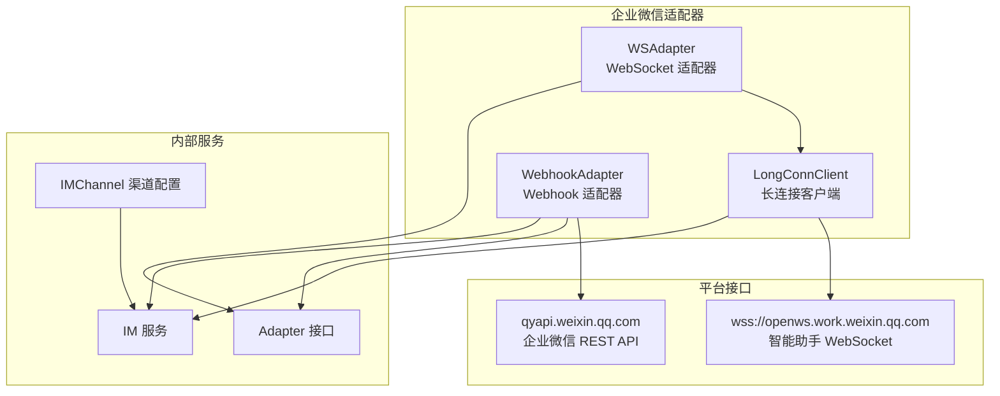
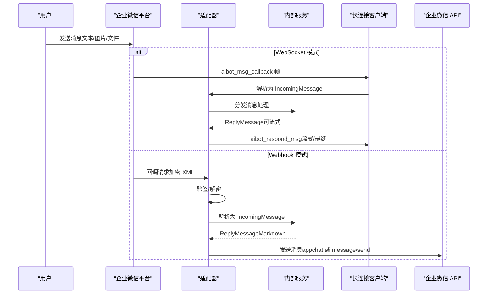
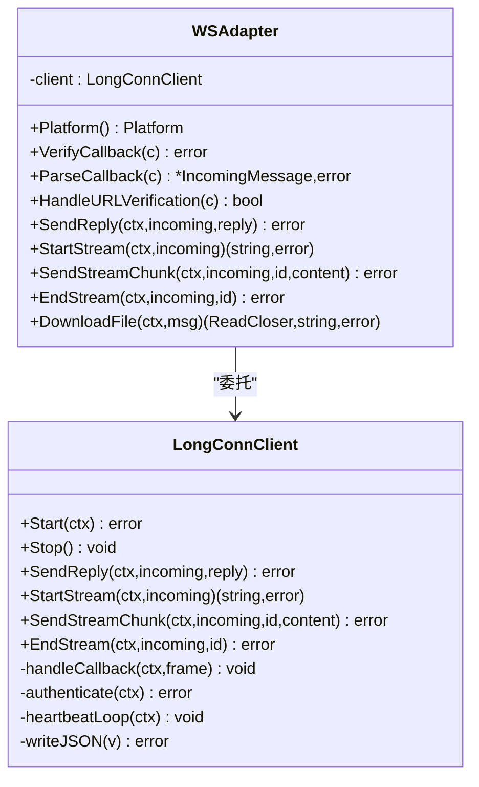
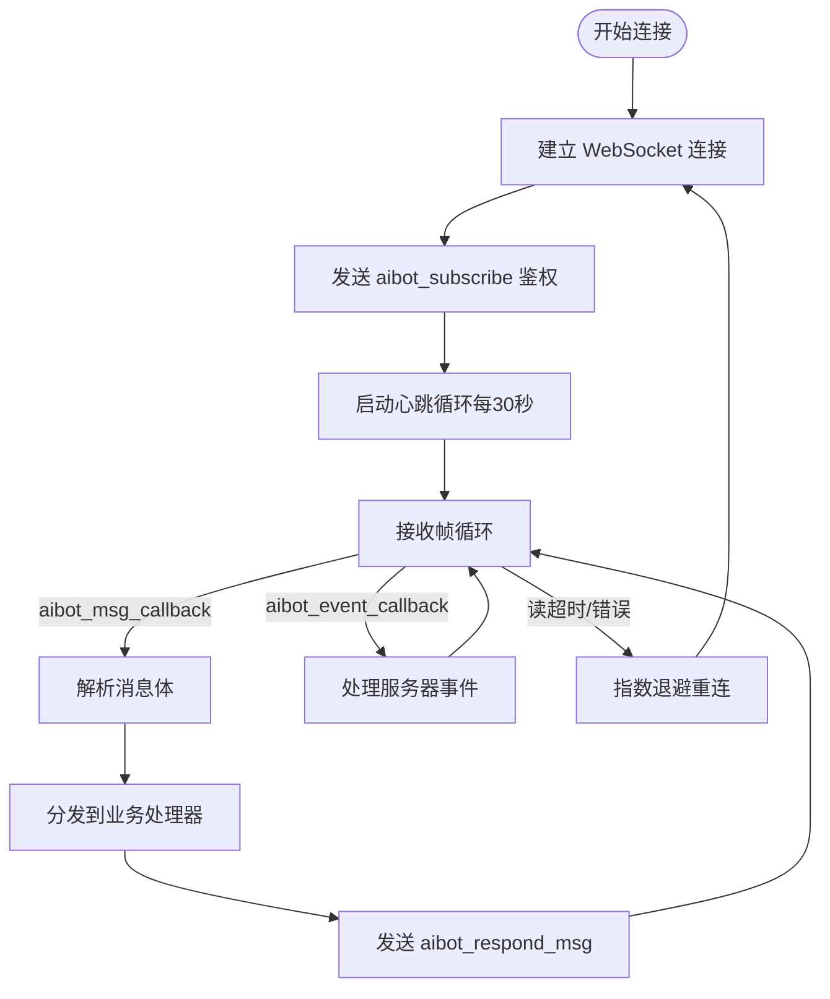
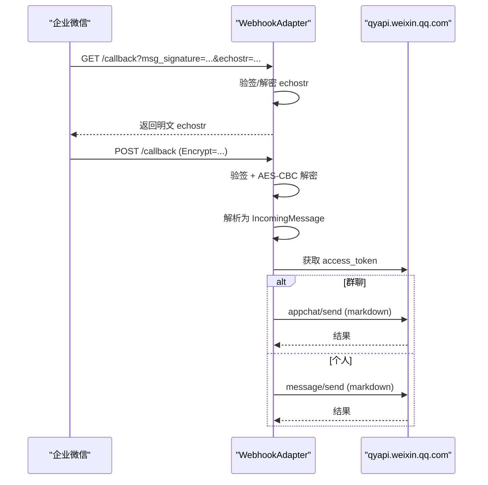
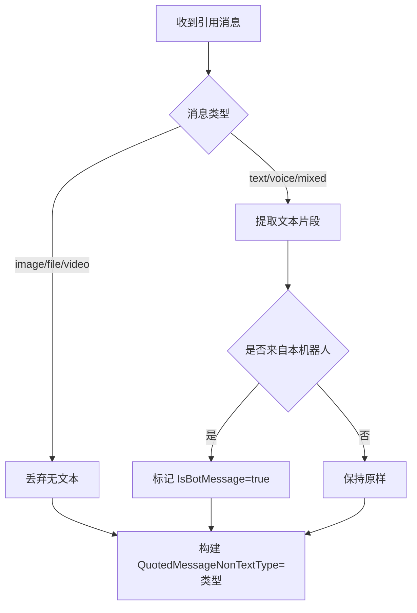
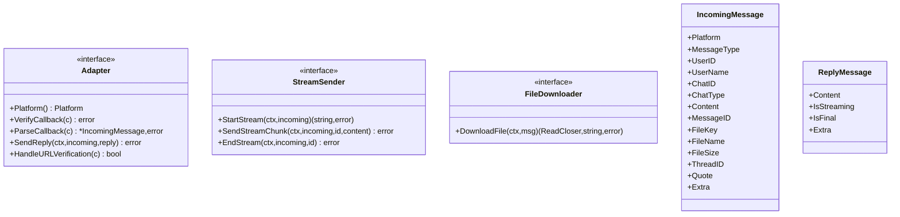
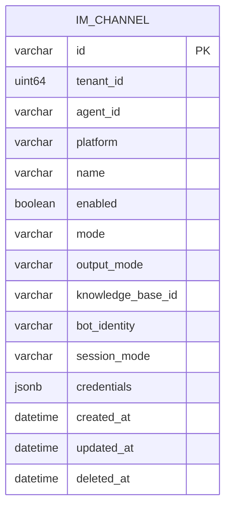
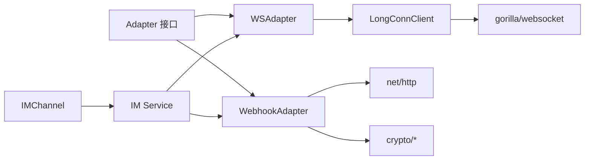

# 企业微信适配器

<cite>
**本文档引用的文件**
- [ws_adapter.go](file://internal/im/wecom/ws_adapter.go)
- [longconn.go](file://internal/im/wecom/longconn.go)
- [webhook_adapter.go](file://internal/im/wecom/webhook_adapter.go)
- [adapter.go](file://internal/im/adapter.go)
- [types.go](file://internal/im/types.go)
- [service.go](file://internal/im/service.go)
- [quote.go](file://internal/im/wecom/quote.go)
- [mention_test.go](file://internal/im/wecom/mention_test.go)
- [IMChannelPanel.vue](file://frontend/src/components/IMChannelPanel.vue)
</cite>

## 目录
1. [简介](#简介)
2. [项目结构](#项目结构)
3. [核心组件](#核心组件)
4. [架构总览](#架构总览)
5. [详细组件分析](#详细组件分析)
6. [依赖关系分析](#依赖关系分析)
7. [性能考虑](#性能考虑)
8. [故障排除指南](#故障排除指南)
9. [结论](#结论)
10. [附录](#附录)

## 简介
本文件面向企业微信（WeCom）适配器的技术与非技术读者，系统性阐述 WeKnora 在企业微信平台上的消息处理机制，涵盖消息接收、发送、文件下载、群组管理、OAuth 认证流程、应用配置与 API 调用限制、长连接机制与心跳策略、回调 URL 设置、消息类型处理与错误重试、消息格式转换与用户权限验证等关键主题。文档以代码为依据，配合可视化图表帮助快速理解。

## 项目结构
企业微信适配器位于内部模块 `internal/im/wecom`，包含两种接入模式：
- WebSocket 长连接模式：通过智能助手 WebSocket 接口实时收发消息，支持流式回复与文件解密下载。
- Webhook 模式：通过回调 URL 接收加密消息，解析后立即或流式响应，并通过 REST API 下发消息。

**图表来源**
- [ws_adapter.go:24-35](file://internal/im/wecom/ws_adapter.go#L24-L35)
- [longconn.go:29-47](file://internal/im/wecom/longconn.go#L29-L47)
- [webhook_adapter.go:42](file://internal/im/wecom/webhook_adapter.go#L42)
- [adapter.go:120-139](file://internal/im/adapter.go#L120-L139)
- [types.go:14-32](file://internal/im/types.go#L14-L32)

**章节来源**
- [ws_adapter.go:1-174](file://internal/im/wecom/ws_adapter.go#L1-L174)
- [longconn.go:1-781](file://internal/im/wecom/longconn.go#L1-L781)
- [webhook_adapter.go:1-697](file://internal/im/wecom/webhook_adapter.go#L1-L697)
- [adapter.go:1-165](file://internal/im/adapter.go#L1-L165)
- [types.go:1-179](file://internal/im/types.go#L1-L179)

## 核心组件
- 适配器接口（Adapter）：统一平台能力抽象，定义签名验证、回调解析、消息发送与 URL 验证等方法。
- WebSocket 适配器（WSAdapter）：基于长连接客户端，实现流式回复与文件下载。
- 长连接客户端（LongConnClient）：维护 WebSocket 连接、鉴权、心跳、消息分发与流式累积。
- Webhook 适配器（WebhookAdapter）：处理回调签名验证、消息解密解析、访问令牌缓存与 REST API 发送。
- 统一消息模型（IncomingMessage/ReplyMessage）：跨平台消息格式标准化。
- 渠道配置（IMChannel）：存储企业微信应用 ID、Secret、回调参数与输出模式等。

**章节来源**
- [adapter.go:120-165](file://internal/im/adapter.go#L120-L165)
- [ws_adapter.go:24-118](file://internal/im/wecom/ws_adapter.go#L24-L118)
- [longconn.go:123-145](file://internal/im/wecom/longconn.go#L123-L145)
- [webhook_adapter.go:77-96](file://internal/im/wecom/webhook_adapter.go#L77-L96)
- [types.go:14-32](file://internal/im/types.go#L14-L32)

## 架构总览
企业微信适配器在 WeKnora 中的职责是将企业微信平台的消息与 WeKnora 的对话引擎对接，同时负责平台侧的认证、消息格式转换与文件下载。

**图表来源**
- [longconn.go:410-417](file://internal/im/wecom/longconn.go#L410-L417)
- [webhook_adapter.go:187-269](file://internal/im/wecom/webhook_adapter.go#L187-L269)
- [webhook_adapter.go:271-378](file://internal/im/wecom/webhook_adapter.go#L271-L378)

## 详细组件分析

### WebSocket 适配器（WSAdapter）
- 角色：封装长连接客户端，实现 Adapter/StreamSender/FileDownloader 接口。
- 关键点：
  - 不支持 Webhook 回调（VerifyCallback/ParseCallback/HANDLEURLVerification 返回空实现或错误）。
  - 文件下载：对每条消息携带的 per-message AES Key 执行 AES-256-CBC 解密；若无加密则直接返回原始内容。
  - 流式回复：通过 StartStream/SendStreamChunk/EndStream 管理替换式流式显示。

**图表来源**
- [ws_adapter.go:24-118](file://internal/im/wecom/ws_adapter.go#L24-L118)
- [longconn.go:123-145](file://internal/im/wecom/longconn.go#L123-L145)

**章节来源**
- [ws_adapter.go:24-118](file://internal/im/wecom/ws_adapter.go#L24-L118)
- [longconn.go:223-357](file://internal/im/wecom/longconn.go#L223-L357)

### 长连接客户端（LongConnClient）
- 连接与鉴权：建立 wss://openws.work.weixin.qq.com 连接，发送 aibot_subscribe 进行 bot_id/secret 鉴权。
- 心跳与断线重连：每 30 秒发送 ping，读超时设为 3 倍心跳间隔；指数退避重连，最大延迟 30 秒。
- 消息处理：解析 aibot_msg_callback/aibot_event_callback，区分文本、语音、图片、文件、混合消息与事件；支持 @ 提及去除与引用消息构建。
- 流式回复：采用 replace-based 协议，累积完整文本后发送，结束时清理缓冲。

**图表来源**
- [longconn.go:359-418](file://internal/im/wecom/longconn.go#L359-L418)
- [longconn.go:420-462](file://internal/im/wecom/longconn.go#L420-L462)
- [longconn.go:464-485](file://internal/im/wecom/longconn.go#L464-L485)

**章节来源**
- [longconn.go:29-47](file://internal/im/wecom/longconn.go#L29-L47)
- [longconn.go:359-485](file://internal/im/wecom/longconn.go#L359-L485)
- [longconn.go:529-631](file://internal/im/wecom/longconn.go#L529-L631)

### Webhook 适配器（WebhookAdapter）
- 回调验证：使用 token、timestamp、nonce、encrypt 进行 SHA-1 HMAC 验签；GET 请求支持 URL 验证（echostr）。
- 消息解密：对回调中的 Encrypt 字段进行 AES-CBC 解密，剥离随机头、长度字段与企业 ID 尾部校验。
- 消息发送：优先尝试 appchat API 向群组发送（markdown），失败回退至 touser 直发；访问令牌缓存，过期前安全窗口内复用。
- 文件下载：支持从临时媒体 API 或直接 URL 下载，自动推断文件名与扩展名。

**图表来源**
- [webhook_adapter.go:133-185](file://internal/im/wecom/webhook_adapter.go#L133-L185)
- [webhook_adapter.go:187-269](file://internal/im/wecom/webhook_adapter.go#L187-L269)
- [webhook_adapter.go:271-378](file://internal/im/wecom/webhook_adapter.go#L271-L378)
- [webhook_adapter.go:380-426](file://internal/im/wecom/webhook_adapter.go#L380-L426)

**章节来源**
- [webhook_adapter.go:133-185](file://internal/im/wecom/webhook_adapter.go#L133-L185)
- [webhook_adapter.go:187-269](file://internal/im/wecom/webhook_adapter.go#L187-L269)
- [webhook_adapter.go:271-378](file://internal/im/wecom/webhook_adapter.go#L271-L378)
- [webhook_adapter.go:380-426](file://internal/im/wecom/webhook_adapter.go#L380-L426)

### 消息格式转换与引用消息
- 引用消息提取：仅保留文本类引用内容，非文本类型（图片/文件/视频）不注入占位符，避免 LLM 幻觉。
- 机器人身份识别：通过 From.UserID 或 AiBotID 判断是否来自本机器人。
- @ 提及去除：支持双空格分隔学习与配置名称匹配，冷启动下使用启发式扫描与首词剔除。

**图表来源**
- [quote.go:9-71](file://internal/im/wecom/quote.go#L9-L71)
- [longconn.go:616-626](file://internal/im/wecom/longconn.go#L616-L626)

**章节来源**
- [quote.go:9-71](file://internal/im/wecom/quote.go#L9-L71)
- [longconn.go:529-631](file://internal/im/wecom/longconn.go#L529-L631)
- [mention_test.go:7-157](file://internal/im/wecom/mention_test.go#L7-L157)

### 适配器接口与统一消息模型
- Adapter 接口：统一平台能力，支持签名验证、回调解析、消息发送与 URL 验证。
- StreamSender 接口：可选的流式回复能力。
- FileDownloader 接口：可选的文件下载能力。
- IncomingMessage/ReplyMessage：标准化消息结构，含平台标识、消息类型、聊天类型、引用消息、额外字段等。

**图表来源**
- [adapter.go:120-165](file://internal/im/adapter.go#L120-L165)
- [adapter.go:42-118](file://internal/im/adapter.go#L42-L118)

**章节来源**
- [adapter.go:120-165](file://internal/im/adapter.go#L120-L165)
- [adapter.go:42-118](file://internal/im/adapter.go#L42-L118)

### 渠道配置与身份唯一性
- IMChannel 存储每个渠道的平台、模式、输出模式、知识库绑定、会话模式与凭证。
- computeBotIdentity：根据平台与模式从凭证中提取唯一身份标识，用于去重与一致性校验。

**图表来源**
- [types.go:14-32](file://internal/im/types.go#L14-L32)
- [types.go:85-145](file://internal/im/types.go#L85-L145)

**章节来源**
- [types.go:14-32](file://internal/im/types.go#L14-L32)
- [types.go:85-145](file://internal/im/types.go#L85-L145)

## 依赖关系分析
- 适配器依赖统一接口（Adapter/StreamSender/FileDownloader）实现跨平台一致性。
- 长连接客户端依赖 gorilla/websocket 实现 WebSocket 通信与心跳。
- Webhook 适配器依赖标准库 net/http、crypto/* 进行签名验证与 AES 解密。
- 渠道配置与服务层协作，负责实例化适配器、处理重复机器人身份与领导者选举。

**图表来源**
- [adapter.go:120-165](file://internal/im/adapter.go#L120-L165)
- [ws_adapter.go:18-22](file://internal/im/wecom/ws_adapter.go#L18-L22)
- [longconn.go:24-26](file://internal/im/wecom/longconn.go#L24-L26)
- [webhook_adapter.go:12-37](file://internal/im/wecom/webhook_adapter.go#L12-L37)
- [service.go:412-451](file://internal/im/service.go#L412-L451)

**章节来源**
- [service.go:412-451](file://internal/im/service.go#L412-L451)

## 性能考虑
- 长连接模式
  - 心跳周期 30 秒，读超时 90 秒，确保偶发延迟不误判断开。
  - 指数退避重连，最大延迟 30 秒，避免雪崩效应。
  - 流式回复采用 replace-based 协议，累积完整文本再发送，减少渲染抖动。
- Webhook 模式
  - 访问令牌缓存带安全余量，降低 API 调用频率。
  - 文件下载支持从临时媒体 API 或直链下载，自动推断文件名与扩展名，减少二次请求。

[本节为通用性能建议，无需特定文件来源]

## 故障排除指南
- WebSocket 断线重连
  - 现象：连接中断后自动重连。
  - 处理：检查网络连通性与鉴权信息；关注日志中的“连接丢失”与“重新连接”提示。
- 心跳失败
  - 现象：心跳发送失败触发连接关闭。
  - 处理：确认服务器时间同步、防火墙放行 wss 端口。
- Webhook 验签失败
  - 现象：回调被拒绝。
  - 处理：核对 token、EncodingAESKey 与企业微信后台配置一致；检查回调 URL 是否正确暴露。
- 访问令牌获取失败
  - 现象：消息发送失败返回 API 错误。
  - 处理：确认 Corp ID/Agent Secret 正确；检查企业微信后台应用权限与域名白名单。
- 文件下载异常
  - 现象：图片/文件无法下载或解密失败。
  - 处理：确认 AES Key 来源与 URL 有效性；检查 SSRF 白名单与允许主机。

**章节来源**
- [longconn.go:464-485](file://internal/im/wecom/longconn.go#L464-L485)
- [webhook_adapter.go:428-439](file://internal/im/wecom/webhook_adapter.go#L428-L439)
- [webhook_adapter.go:380-426](file://internal/im/wecom/webhook_adapter.go#L380-L426)
- [webhook_adapter.go:525-552](file://internal/im/wecom/webhook_adapter.go#L525-L552)

## 结论
企业微信适配器通过统一接口与标准化消息模型，实现了对 WebSocket 与 Webhook 两种接入方式的无缝支持。长连接模式具备稳定的实时交互与流式体验，Webhook 模式满足回调场景下的低耦合集成需求。结合引用消息处理、@ 提及去除与文件下载能力，适配器能够高效完成企业微信平台的消息处理闭环。

[本节为总结性内容，无需特定文件来源]

## 附录

### 企业微信 OAuth 认证与应用配置
- Webhook 模式
  - Corp ID：企业 ID。
  - Agent Secret：应用密钥。
  - Token：回调签名验证使用的 Token。
  - EncodingAESKey：回调消息加解密密钥。
  - Corp Agent ID：应用 ID。
  - API Base URL：企业微信 API 基础地址，默认为官方云地址。
- WebSocket 模式
  - Bot ID：机器人 ID。
  - Bot Secret：机器人密钥。
  - WebSocket Endpoint：默认为官方云地址，可配置私有部署端点。

**章节来源**
- [webhook_adapter.go:98-126](file://internal/im/wecom/webhook_adapter.go#L98-L126)
- [webhook_adapter.go:42](file://internal/im/wecom/webhook_adapter.go#L42)
- [longconn.go:147-169](file://internal/im/wecom/longconn.go#L147-L169)
- [IMChannelPanel.vue:167-210](file://frontend/src/components/IMChannelPanel.vue#L167-L210)

### 回调 URL 设置步骤
- Webhook 模式在企业微信后台配置回调 URL 与 Token、EncodingAESKey。
- 首次验证：平台会发起 GET 请求携带 echostr，适配器需完成解密并原样返回。
- 正式回调：平台以 POST 方式推送加密 XML，适配器完成验签与解密后解析消息。

**章节来源**
- [webhook_adapter.go:133-185](file://internal/im/wecom/webhook_adapter.go#L133-L185)
- [webhook_adapter.go:187-269](file://internal/im/wecom/webhook_adapter.go#L187-L269)

### 消息类型处理与错误重试
- 文本：支持 @ 提及去除（群聊）与引用消息解析。
- 图片/文件：支持 AES-256-CBC 解密（长连接）或临时媒体下载（Webhook）。
- 语音：转为文本内容（来自 STT）。
- 错误重试：长连接流式结束阶段在短暂窗口内最多重试 3 次，以应对断线重连。

**章节来源**
- [longconn.go:529-631](file://internal/im/wecom/longconn.go#L529-L631)
- [webhook_adapter.go:225-269](file://internal/im/wecom/webhook_adapter.go#L225-L269)
- [ws_adapter.go:71-118](file://internal/im/wecom/ws_adapter.go#L71-L118)
- [longconn.go:300-329](file://internal/im/wecom/longconn.go#L300-L329)

### 用户权限验证与身份识别
- 引用消息身份判断：通过 From.UserID 或 AiBotID 与当前机器人 ID 对比，确定是否来自本机器人。
- 重复机器人检测：IMChannel.computeBotIdentity 基于凭证生成唯一身份，服务层用于避免重复绑定。

**章节来源**
- [quote.go:37-50](file://internal/im/wecom/quote.go#L37-L50)
- [types.go:85-145](file://internal/im/types.go#L85-L145)
- [service.go:1926-1942](file://internal/im/service.go#L1926-L1942)