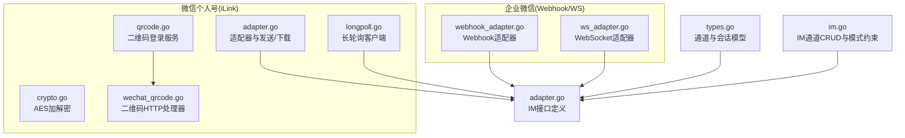
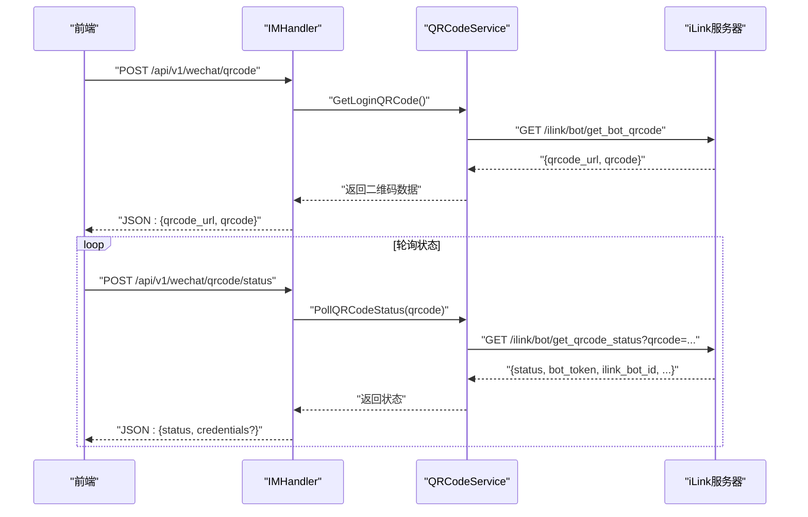
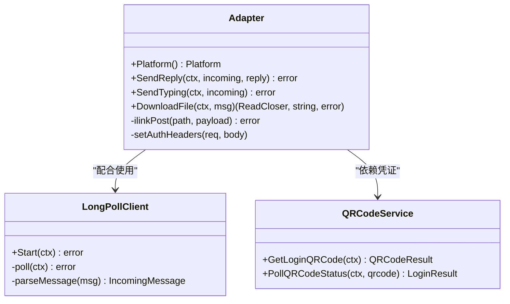
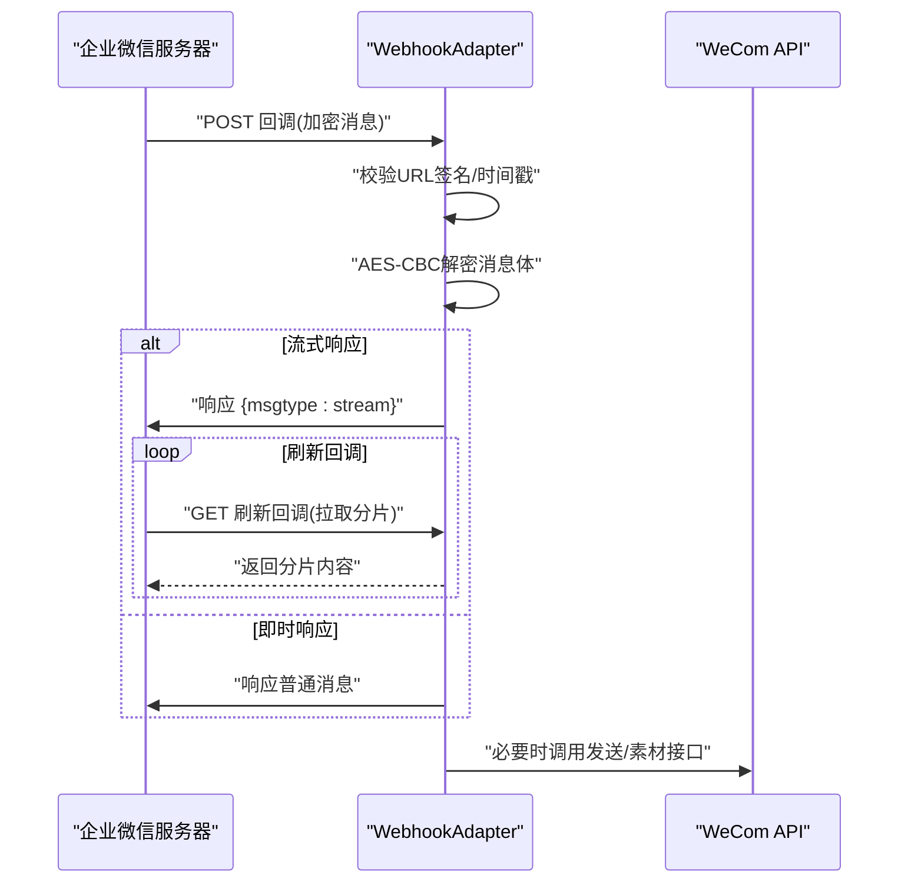
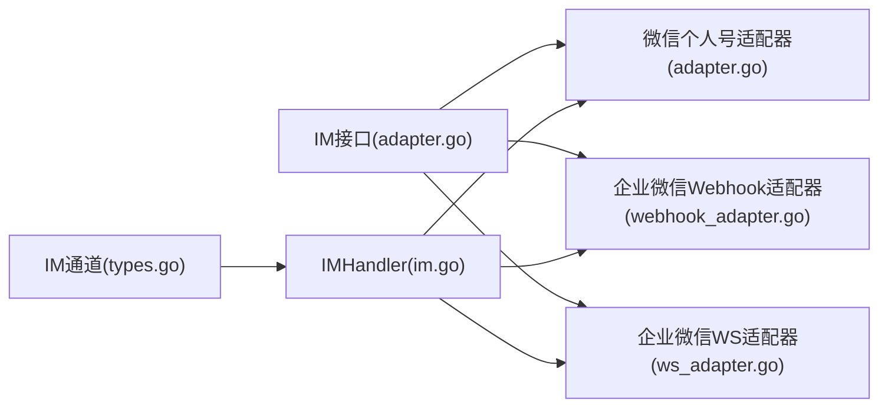

# 微信适配器

<cite>
**本文引用的文件**
- [adapter.go](file://internal/im/wechat/adapter.go)
- [crypto.go](file://internal/im/wechat/crypto.go)
- [longpoll.go](file://internal/im/wechat/longpoll.go)
- [qrcode.go](file://internal/im/wechat/qrcode.go)
- [wechat_qrcode.go](file://internal/handler/wechat_qrcode.go)
- [adapter.go](file://internal/im/adapter.go)
- [types.go](file://internal/im/types.go)
- [im.go](file://internal/handler/im.go)
- [webhook_adapter.go](file://internal/im/wecom/webhook_adapter.go)
- [ws_adapter.go](file://internal/im/wecom/ws_adapter.go)
- [container.go](file://internal/container/container.go)
</cite>

## 目录
1. [简介](#简介)
2. [项目结构](#项目结构)
3. [核心组件](#核心组件)
4. [架构总览](#架构总览)
5. [详细组件分析](#详细组件分析)
6. [依赖关系分析](#依赖关系分析)
7. [性能考量](#性能考量)
8. [故障排查指南](#故障排查指南)
9. [结论](#结论)
10. [附录](#附录)

## 简介
本文件面向微信适配器的实现与使用，重点覆盖以下方面：
- 微信公众号与企业微信适配器的差异与共性
- 微信个人号（iLink）的消息接收（长轮询）、发送、文件下载与加解密
- 二维码登录流程与凭证获取
- 企业微信 Webhook/WS 模式的消息加解密、URL 验证与消息处理
- 微信平台特有的消息类型（文本、图片、语音、文件等）与事件推送处理
- OAuth 认证流程、JS-SDK 配置与微信支付集成的对接建议

## 项目结构
微信适配器相关代码主要位于 internal/im/wechat 与 internal/im/wecom 下，并通过内部 IM 接口进行统一抽象。前端通过 IMHandler 提供的 API 与后端交互，完成二维码登录与状态轮询。

图表来源
- [adapter.go:1-323](file://internal/im/wechat/adapter.go#L1-L323)
- [longpoll.go:1-364](file://internal/im/wechat/longpoll.go#L1-L364)
- [crypto.go:1-73](file://internal/im/wechat/crypto.go#L1-L73)
- [qrcode.go:1-160](file://internal/im/wechat/qrcode.go#L1-L160)
- [wechat_qrcode.go:1-73](file://internal/handler/wechat_qrcode.go#L1-L73)
- [adapter.go:1-165](file://internal/im/adapter.go#L1-L165)
- [types.go:1-179](file://internal/im/types.go#L1-L179)
- [im.go:1-200](file://internal/handler/im.go#L1-L200)
- [webhook_adapter.go:1-398](file://internal/im/wecom/webhook_adapter.go#L1-L398)
- [ws_adapter.go:1-48](file://internal/im/wecom/ws_adapter.go#L1-L48)

章节来源
- [adapter.go:1-323](file://internal/im/wechat/adapter.go#L1-L323)
- [longpoll.go:1-364](file://internal/im/wechat/longpoll.go#L1-L364)
- [crypto.go:1-73](file://internal/im/wechat/crypto.go#L1-L73)
- [qrcode.go:1-160](file://internal/im/wechat/qrcode.go#L1-L160)
- [wechat_qrcode.go:1-73](file://internal/handler/wechat_qrcode.go#L1-L73)
- [adapter.go:1-165](file://internal/im/adapter.go#L1-L165)
- [types.go:1-179](file://internal/im/types.go#L1-L179)
- [im.go:1-200](file://internal/handler/im.go#L1-L200)
- [webhook_adapter.go:1-398](file://internal/im/wecom/webhook_adapter.go#L1-L398)
- [ws_adapter.go:1-48](file://internal/im/wecom/ws_adapter.go#L1-L48)

## 核心组件
- 微信个人号适配器（iLink）
  - Adapter：封装发送文本回复、输入态、文件下载与 AES 解密
  - LongPollClient：基于 HTTP 长轮询接收消息，自动重连与游标更新
  - QRCodeService：二维码登录流程（获取二维码、轮询状态）
  - IMHandler 二维码接口：对外暴露二维码生成与状态查询 API
- 企业微信适配器
  - WebhookAdapter：处理回调消息的解密、解析与即时响应/流式响应
  - WSAdapter：WebSocket 长连接模式的消息处理（无 Webhook 方法）

章节来源
- [adapter.go:62-323](file://internal/im/wechat/adapter.go#L62-L323)
- [longpoll.go:39-178](file://internal/im/wechat/longpoll.go#L39-L178)
- [qrcode.go:41-160](file://internal/im/wechat/qrcode.go#L41-L160)
- [wechat_qrcode.go:14-73](file://internal/handler/wechat_qrcode.go#L14-L73)
- [webhook_adapter.go:79-398](file://internal/im/wecom/webhook_adapter.go#L79-L398)
- [ws_adapter.go:24-48](file://internal/im/wecom/ws_adapter.go#L24-L48)

## 架构总览
微信个人号与企业微信在接入方式上存在显著差异：
- 个人号：仅支持长轮询接收消息，REST API 发送消息与文件下载，媒体文件采用 AES-128-ECB 加密
- 企业微信：支持 Webhook/WS 两种模式，回调消息需进行消息体解密与 URL 验证，支持流式响应

图表来源
- [wechat_qrcode.go:14-73](file://internal/handler/wechat_qrcode.go#L14-L73)
- [qrcode.go:53-160](file://internal/im/wechat/qrcode.go#L53-L160)

章节来源
- [wechat_qrcode.go:1-73](file://internal/handler/wechat_qrcode.go#L1-L73)
- [qrcode.go:1-160](file://internal/im/wechat/qrcode.go#L1-L160)

## 详细组件分析

### 微信个人号适配器（iLink）
- 平台标识与接口实现
  - 实现 Adapter 接口，不支持 Webhook 验证与回调解析（使用长轮询）
  - 支持发送文本回复、输入态、文件下载与 AES 解密
- 发送与下载
  - 文本回复：构造 iLink 协议请求体，设置鉴权头，调用 /ilink/bot/sendmessage
  - 输入态：调用 /ilink/bot/sendtyping
  - 文件下载：从消息 Extra 中提取 CDN 加密参数与 AES Key，下载后按格式解析 Key 并 AES-128-ECB 解密
- 长轮询接收
  - 定期 POST /ilink/bot/getupdates，解析返回的 msgs[] 为统一 IncomingMessage
  - 支持文本、图片、语音（ASR）、文件等消息类型映射
  - 游标 get_updates_buf 用于分页续拉
- 加解密
  - AES-128-ECB 解密：支持 PKCS#7 去填充
  - AES Key 解析：兼容 base64(raw 16B)、base64(hex 32)、raw hex 32 等格式

图表来源
- [adapter.go:62-323](file://internal/im/wechat/adapter.go#L62-L323)
- [longpoll.go:39-178](file://internal/im/wechat/longpoll.go#L39-L178)
- [qrcode.go:41-160](file://internal/im/wechat/qrcode.go#L41-L160)

章节来源
- [adapter.go:62-323](file://internal/im/wechat/adapter.go#L62-L323)
- [longpoll.go:180-297](file://internal/im/wechat/longpoll.go#L180-L297)
- [crypto.go:10-73](file://internal/im/wechat/crypto.go#L10-L73)
- [qrcode.go:41-160](file://internal/im/wechat/qrcode.go#L41-L160)

### 企业微信适配器（Webhook/WS）
- Webhook 模式
  - 回调 URL 验证：校验签名与时间戳/随机串
  - 消息解密：对加密消息体进行 AES-CBC 解密，解析 XML/JSON
  - 响应策略：即时响应或流式响应（msgtype="stream"），后续通过刷新回调拉取分片
  - 访问令牌缓存：gettoken 接口结果带过期时间，带安全余量缓存复用
- WebSocket 模式
  - 适配器不支持 Webhook 方法（回调由 WS 客户端处理）
  - 通过长连接客户端接收消息并派发给业务处理器

图表来源
- [webhook_adapter.go:79-398](file://internal/im/wecom/webhook_adapter.go#L79-L398)

章节来源
- [webhook_adapter.go:1-398](file://internal/im/wecom/webhook_adapter.go#L1-L398)
- [ws_adapter.go:1-48](file://internal/im/wecom/ws_adapter.go#L1-L48)

### 消息类型与事件处理
- 微信个人号（iLink）
  - 文本：去除空白后作为 Content
  - 图片：构建 CDN 下载 URL，优先使用 image_item.aeskey（hex），否则使用 media.aes_key（base64）
  - 语音：以 ASR 文本作为 Content
  - 文件：构建 CDN 下载 URL，记录文件名与大小
- 企业微信
  - Webhook/WS 模式均需先进行消息体解密，再根据 msgtype/事件类型解析为统一 IncomingMessage

章节来源
- [longpoll.go:196-297](file://internal/im/wechat/longpoll.go#L196-L297)
- [adapter.go:202-271](file://internal/im/wechat/adapter.go#L202-L271)
- [webhook_adapter.go:1-398](file://internal/im/wecom/webhook_adapter.go#L1-L398)

### OAuth 认证流程、JS-SDK 配置与微信支付集成
- OAuth 认证流程
  - 企业微信 OAuth 通常采用授权码模式，后端通过 corp_id/agent_secret 获取 access_token，再用 code 换取成员信息
  - 与项目现有 OIDC 流程类似，后端负责换取 token 并签发本地 JWT
- JS-SDK 配置
  - 通过后端统一下发 jsapi_ticket（或使用 access_token 间接获取），前端注入配置
  - 注意签名算法与 noncestr/timestamp 的生成
- 微信支付集成
  - 建议在后端集中处理支付订单创建、签名与回调校验，前端仅做展示与跳转
  - 与企业微信 Webhook/WS 的消息处理解耦，避免在回调中执行耗时操作

[本节为通用实践说明，不直接分析具体文件，故无章节来源]

## 依赖关系分析
- IM 接口与类型
  - Adapter/StreamSender/FileDownloader 统一各平台适配器行为
  - IMChannel 与 ChannelSession 描述通道与会话映射
- 通道模式约束
  - 微信个人号强制 longpoll + full 输出
  - 企业微信默认 websocket + stream 输出（可配置）

图表来源
- [adapter.go:120-165](file://internal/im/adapter.go#L120-L165)
- [types.go:14-179](file://internal/im/types.go#L14-L179)
- [im.go:81-96](file://internal/handler/im.go#L81-L96)
- [adapter.go:62-78](file://internal/im/wechat/adapter.go#L62-L78)
- [webhook_adapter.go:79-116](file://internal/im/wecom/webhook_adapter.go#L79-L116)
- [ws_adapter.go:24-39](file://internal/im/wecom/ws_adapter.go#L24-L39)

章节来源
- [adapter.go:1-165](file://internal/im/adapter.go#L1-L165)
- [types.go:1-179](file://internal/im/types.go#L1-L179)
- [im.go:81-96](file://internal/handler/im.go#L81-L96)
- [adapter.go:62-78](file://internal/im/wechat/adapter.go#L62-L78)
- [webhook_adapter.go:79-116](file://internal/im/wecom/webhook_adapter.go#L79-L116)
- [ws_adapter.go:24-39](file://internal/im/wecom/ws_adapter.go#L24-L39)

## 性能考量
- 长轮询
  - 轮询超时与 HTTP 超时略作区分，避免误判
  - 断线重连采用指数退避，最大延迟限制，成功后重置尝试次数
- 加解密
  - AES-128-ECB 解密按块处理，注意输入长度必须为块大小整数倍
  - Key 解析兼容多种格式，减少上游数据差异带来的失败
- Webhook/WS
  - access_token 缓存与过期时间控制，降低频繁获取 token 的开销
  - 流式响应采用刷新回调拉取分片，避免一次性大响应阻塞

[本节为通用性能讨论，不直接分析具体文件，故无章节来源]

## 故障排查指南
- 二维码登录
  - 若轮询返回 wait，属正常长等待；确认前端使用独立上下文与足够超时
  - confirmed 后才返回 bot_token 与 ilink_bot_id
- 长轮询
  - 返回 errcode -14 表示 bot token 过期，需重新扫码登录
  - HTTP 状态非 200 或解码失败时检查鉴权头与 body 长度
- 文件下载
  - 若 aes_key 缺失，直接返回原始内容；若解析失败，检查 Key 格式（base64/raw hex）
- Webhook
  - URL 验证失败：核对 token、timestamp、nonce 与签名算法
  - 解密失败：核对 EncodingAESKey 与消息体编码

章节来源
- [qrcode.go:102-160](file://internal/im/wechat/qrcode.go#L102-L160)
- [longpoll.go:58-105](file://internal/im/wechat/longpoll.go#L58-L105)
- [adapter.go:142-200](file://internal/im/wechat/adapter.go#L142-L200)
- [webhook_adapter.go:79-116](file://internal/im/wecom/webhook_adapter.go#L79-L116)

## 结论
- 微信个人号通过长轮询与 REST API 实现消息收发与文件下载，媒体文件采用 AES-128-ECB 加密，适配器提供完善的解密与下载流程
- 企业微信提供 Webhook/WS 两种模式，回调消息需进行签名验证与消息体解密，支持流式响应以提升用户体验
- 项目通过统一的 IM 接口与通道模型，屏蔽平台差异，便于扩展更多 IM 平台

[本节为总结性内容，不直接分析具体文件，故无章节来源]

## 附录

### 微信个人号配置要点
- 通道模式
  - 平台：wechat
  - Mode：longpoll（强制）
  - OutputMode：full（强制）
- 凭证字段
  - ilink_bot_id：iLink 机器人 ID
  - bot_token：Bearer 令牌（通过二维码登录获取）
- 二维码登录流程
  - 后端生成二维码并返回 qrcode 与 qrcode_url
  - 前端轮询 /api/v1/wechat/qrcode/status，直到状态为 confirmed
  - confirmed 后获取 bot_token 与 ilink_bot_id

章节来源
- [im.go:81-96](file://internal/handler/im.go#L81-L96)
- [wechat_qrcode.go:14-73](file://internal/handler/wechat_qrcode.go#L14-L73)
- [qrcode.go:53-160](file://internal/im/wechat/qrcode.go#L53-L160)

### 企业微信配置要点
- Webhook 模式
  - corp_id、agent_secret、token、encoding_aes_key、corp_agent_id
  - 回调 URL 需配置为公网可达地址，确保签名验证通过
- WebSocket 模式
  - bot_id、bot_secret、ws_endpoint、bot_name
  - 适配器不支持 Webhook 方法，回调由 WS 客户端处理

章节来源
- [webhook_adapter.go:98-116](file://internal/im/wecom/webhook_adapter.go#L98-L116)
- [ws_adapter.go:24-39](file://internal/im/wecom/ws_adapter.go#L24-L39)
- [container.go:1204-1224](file://internal/container/container.go#L1204-L1224)