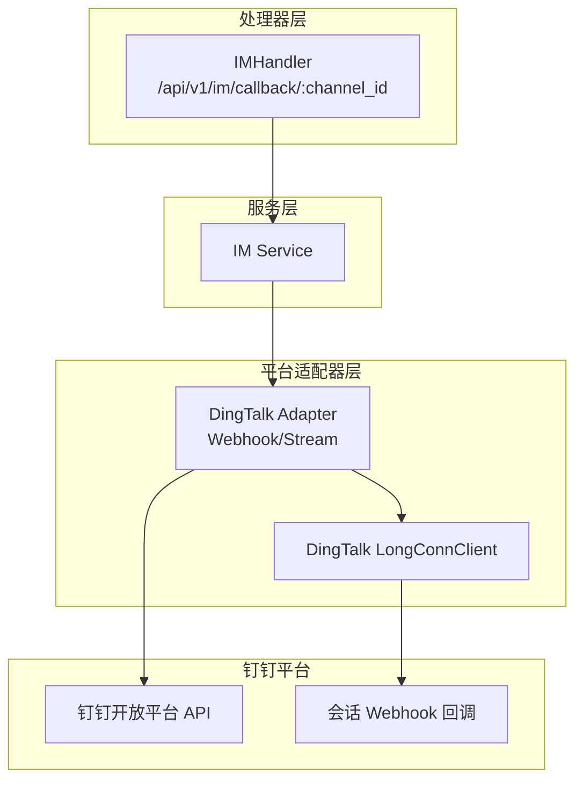
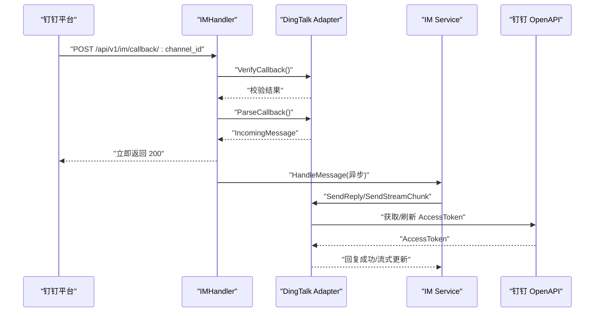
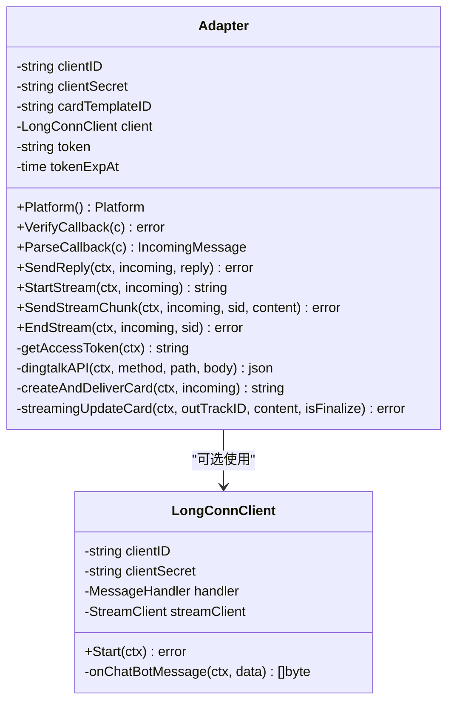
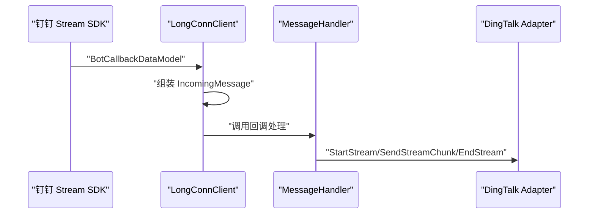
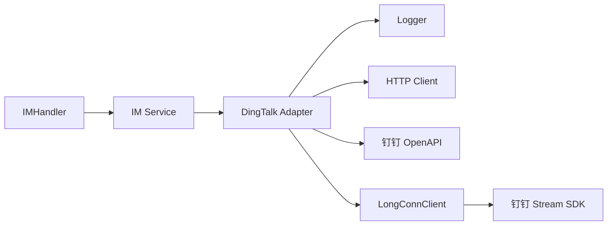

# 钉钉适配器

<cite>
**本文档引用的文件**
- [adapter.go](file://internal/im/dingtalk/adapter.go)
- [longconn.go](file://internal/im/dingtalk/longconn.go)
- [adapter.go](file://internal/im/adapter.go)
- [types.go](file://internal/im/types.go)
- [im.go](file://internal/handler/im.go)
- [IMChannelPanel.vue](file://frontend/src/components/IMChannelPanel.vue)
</cite>

## 目录
1. [简介](#简介)
2. [项目结构](#项目结构)
3. [核心组件](#核心组件)
4. [架构总览](#架构总览)
5. [详细组件分析](#详细组件分析)
6. [依赖关系分析](#依赖关系分析)
7. [性能考虑](#性能考虑)
8. [故障排除指南](#故障排除指南)
9. [结论](#结论)
10. [附录](#附录)

## 简介
本文件面向钉钉适配器的技术与非技术读者，系统性阐述 WeKnora 在钉钉平台的消息处理机制，涵盖以下关键主题：
- 企业内部消息与群聊管理：支持单聊与群聊场景，自动识别会话类型并路由到相应通道。
- 机器人集成：支持两种模式——HTTP 回调（Webhook）与长连接（Stream），并可选启用 AI 卡流式渲染。
- 认证与安全：提供基于时间戳与密钥的签名验证，确保回调请求来源可信。
- 消息格式与类型：统一解析文本消息，支持 Markdown 回复；在具备能力时支持文件/图片等富媒体内容。
- JSAPI 权限与应用配置：结合前端表单字段说明，指导在钉钉开放平台创建应用与配置回调地址。

## 项目结构
钉钉适配器位于内部 IM 子系统中，采用“平台适配器 + 服务层 + 处理器”的分层设计：
- 平台适配器层：负责对接钉钉平台的回调、签名验证、消息解析与回复发送。
- 服务层：统一调度各平台适配器，维护通道状态与会话上下文。
- 处理器层：对外暴露 HTTP 接口，接收钉钉回调，完成鉴权与消息派发。

图表来源
- [im.go:249-327](file://internal/handler/im.go#L249-L327)
- [adapter.go:40-76](file://internal/im/dingtalk/adapter.go#L40-L76)
- [longconn.go:17-44](file://internal/im/dingtalk/longconn.go#L17-L44)

章节来源
- [im.go:14-327](file://internal/handler/im.go#L14-L327)
- [adapter.go:1-113](file://internal/im/dingtalk/adapter.go#L1-L113)
- [longconn.go:1-98](file://internal/im/dingtalk/longconn.go#L1-L98)

## 核心组件
- 平台适配器（DingTalk Adapter）
  - 支持两种模式：Webhook（HTTP 回调）与 Stream（长连接）。
  - 提供签名验证、消息解析、统一回复发送与流式回复能力。
  - 可选启用 AI 卡流式渲染，提升交互体验。
- 长连接客户端（LongConnClient）
  - 基于官方 SDK 维护与钉钉的长连接，实时推送消息事件。
- 通用接口与数据模型
  - Adapter 接口与 IncomingMessage/ReplyMessage 统一消息抽象。
  - IMChannel/ChannelSession 等数据库模型支撑通道与会话管理。

章节来源
- [adapter.go:40-76](file://internal/im/dingtalk/adapter.go#L40-L76)
- [longconn.go:17-44](file://internal/im/dingtalk/longconn.go#L17-L44)
- [adapter.go:120-165](file://internal/im/adapter.go#L120-L165)
- [types.go:14-179](file://internal/im/types.go#L14-L179)

## 架构总览
钉钉适配器的端到端流程如下：
- Webhook 模式：钉钉通过会话 Webhook 或 OpenAPI 发送回调，WeKnora 校验签名后解析消息并异步处理。
- Stream 模式：通过长连接实时接收消息，直接交由业务处理。
- 流式回复：若配置了 AI 卡模板，则优先创建卡片并增量更新；否则回退至会话 Webhook 或 OpenAPI。

图表来源
- [im.go:249-327](file://internal/handler/im.go#L249-L327)
- [adapter.go:82-113](file://internal/im/dingtalk/adapter.go#L82-L113)
- [adapter.go:141-154](file://internal/im/dingtalk/adapter.go#L141-L154)
- [adapter.go:191-287](file://internal/im/dingtalk/adapter.go#L191-L287)
- [adapter.go:289-346](file://internal/im/dingtalk/adapter.go#L289-L346)

## 详细组件分析

### 钉钉适配器（Adapter）
- 身份与能力
  - 实现 Adapter 接口，标识平台为钉钉。
  - 同时实现 StreamSender，支持流式回复与 AI 卡增量渲染。
- 签名验证（Webhook）
  - 从请求头读取时间戳与签名，校验时间窗口与 HMAC-SHA256 签名。
  - 未配置密钥时跳过校验。
- 消息解析
  - 解析回调体中的会话信息、发送者信息、消息类型与内容。
  - 自动区分单聊与群聊，并提取会话 Webhook 地址用于后续回复。
- 回复策略
  - 若存在会话 Webhook：优先使用会话 Webhook 发送 Markdown。
  - 否则：调用 OpenAPI 发送机器人消息（群聊/单聊分别使用不同接口）。
- 认证与缓存
  - 缓存 AccessToken，过期前自动续期，减少重复请求。
- AI 卡流式渲染
  - 创建并投递 AI 卡实例，按最小更新间隔推送增量内容，结束时进行最终化。

图表来源
- [adapter.go:40-76](file://internal/im/dingtalk/adapter.go#L40-L76)
- [adapter.go:289-346](file://internal/im/dingtalk/adapter.go#L289-L346)
- [adapter.go:382-440](file://internal/im/dingtalk/adapter.go#L382-L440)
- [longconn.go:17-44](file://internal/im/dingtalk/longconn.go#L17-L44)

章节来源
- [adapter.go:82-113](file://internal/im/dingtalk/adapter.go#L82-L113)
- [adapter.go:141-187](file://internal/im/dingtalk/adapter.go#L141-L187)
- [adapter.go:191-287](file://internal/im/dingtalk/adapter.go#L191-L287)
- [adapter.go:289-346](file://internal/im/dingtalk/adapter.go#L289-L346)
- [adapter.go:382-440](file://internal/im/dingtalk/adapter.go#L382-L440)
- [adapter.go:492-594](file://internal/im/dingtalk/adapter.go#L492-L594)

### 钉钉长连接客户端（LongConnClient）
- 基于官方 SDK 建立与钉钉的长连接，注册聊天机器人回调路由。
- 将收到的消息转换为统一 IncomingMessage 结构，交由上层处理函数处理。

图表来源
- [longconn.go:47-97](file://internal/im/dingtalk/longconn.go#L47-L97)
- [adapter.go:492-594](file://internal/im/dingtalk/adapter.go#L492-L594)

章节来源
- [longconn.go:25-61](file://internal/im/dingtalk/longconn.go#L25-L61)
- [longconn.go:63-97](file://internal/im/dingtalk/longconn.go#L63-L97)

### 通用接口与数据模型
- Adapter 接口
  - 平台标识、回调验证、消息解析、回复发送、URL 验证等方法。
- IncomingMessage/ReplyMessage
  - 统一消息结构，支持文本、文件、图片等类型；流式回复标记。
- IMChannel/ChannelSession
  - 通道配置与会话映射，支持多平台、多模式与会话模式（用户/线程）。

章节来源
- [adapter.go:120-165](file://internal/im/adapter.go#L120-L165)
- [types.go:14-179](file://internal/im/types.go#L14-L179)

### 处理器与通道管理
- IMHandler
  - 对外提供创建/查询/更新/删除通道的接口，支持钉钉平台。
  - 回调入口：/api/v1/im/callback/:channel_id，负责鉴权、解析与异步处理。
- 通道配置
  - 支持模式（webhook/websocket/longpoll）、输出模式（stream/full）、会话模式（user/thread）等。
  - 钉钉通道凭据包含 AppKey/AppSecret 与可选卡模板 ID。

章节来源
- [im.go:34-112](file://internal/handler/im.go#L34-L112)
- [im.go:137-200](file://internal/handler/im.go#L137-L200)
- [im.go:249-327](file://internal/handler/im.go#L249-L327)
- [types.go:14-145](file://internal/im/types.go#L14-L145)

### 前端配置与应用创建指引
- 前端表单字段
  - AppKey（client_id）、AppSecret（client_secret）、AI 卡模板 ID（card_template_id）。
  - 提供跳转到钉钉开放平台控制台的链接与提示。
- 应用创建与回调地址设置
  - 在钉钉开放平台创建企业内部应用，获取 AppKey/AppSecret。
  - 配置回调地址为 WeKnora 的 /api/v1/im/callback/{channel_id}。
  - 如需 AI 卡流式渲染，需在开放平台创建卡片模板并填写模板 ID。

章节来源
- [IMChannelPanel.vue:293-315](file://frontend/src/components/IMChannelPanel.vue#L293-L315)

## 依赖关系分析
- 组件耦合
  - Adapter 依赖 IM 接口与日志库；可选依赖 LongConnClient。
  - IMHandler 依赖 IMService 与 Gin 路由框架。
- 外部依赖
  - 钉钉开放平台 API（OAuth2 获取 Token、机器人消息发送、AI 卡相关接口）。
  - 钉钉 Stream SDK（长连接模式）。
- 循环依赖
  - 未发现循环依赖；模块边界清晰。

图表来源
- [im.go:249-327](file://internal/handler/im.go#L249-L327)
- [adapter.go:25-38](file://internal/im/dingtalk/adapter.go#L25-L38)
- [longconn.go:3-12](file://internal/im/dingtalk/longconn.go#L3-L12)

章节来源
- [adapter.go:25-38](file://internal/im/dingtalk/adapter.go#L25-L38)
- [longconn.go:3-12](file://internal/im/dingtalk/longconn.go#L3-L12)

## 性能考虑
- 访问令牌缓存
  - 通过过期时间提前续期，降低频繁请求 OpenAPI 的开销。
- 流式更新节流
  - AI 卡更新存在最小间隔限制，避免过度推送导致平台限流或性能下降。
- 异步处理
  - 回调立即响应，实际消息处理在后台协程执行，缩短首字节延迟。
- 资源清理
  - 流式会话存在孤儿回收机制，防止异常退出导致内存泄漏。

章节来源
- [adapter.go:289-346](file://internal/im/dingtalk/adapter.go#L289-L346)
- [adapter.go:28-30](file://internal/im/dingtalk/adapter.go#L28-L30)
- [adapter.go:465-490](file://internal/im/dingtalk/adapter.go#L465-L490)
- [adapter.go:523-594](file://internal/im/dingtalk/adapter.go#L523-L594)

## 故障排除指南
- 回调被拒绝（签名/时间戳错误）
  - 检查是否正确配置 AppSecret；确认请求头包含时间戳与签名；核对时间偏差是否超过允许范围。
- 无法获取 AccessToken
  - 核对 AppKey/AppSecret 是否正确；检查网络连通性；关注返回状态码与错误信息。
- 会话 Webhook 发送失败
  - 确认回调消息中携带有效的会话 Webhook 地址；检查目标地址可达性与权限。
- 长连接无法建立
  - 检查网络环境与防火墙；确认凭证有效；查看日志中的错误信息。
- 流式回复无更新
  - 确认已配置 AI 卡模板 ID；检查最小更新间隔与最终化逻辑；观察日志告警。

章节来源
- [adapter.go:82-113](file://internal/im/dingtalk/adapter.go#L82-L113)
- [adapter.go:289-346](file://internal/im/dingtalk/adapter.go#L289-L346)
- [adapter.go:205-236](file://internal/im/dingtalk/adapter.go#L205-L236)
- [adapter.go:465-490](file://internal/im/dingtalk/adapter.go#L465-L490)

## 结论
钉钉适配器通过统一的 Adapter 接口与服务层解耦，实现了对 Webhook 与长连接两种模式的支持，并提供了签名验证、消息解析、统一回复与流式渲染等能力。结合前端表单与开放平台配置，用户可以快速完成应用创建、回调地址设置与 AI 卡流式体验的启用。建议在生产环境中开启签名验证与访问令牌缓存，并合理设置流式更新节流与孤儿回收策略，以获得稳定高效的交互体验。

## 附录

### 钉钉平台特性与消息类型
- 消息类型
  - 文本消息：统一解析为文本内容。
  - 文件/图片：当前适配器以文本为主，如需处理文件/图片，请结合知识库与附件下载能力扩展。
- 会话类型
  - 单聊与群聊：自动识别并选择对应发送路径。
- 用户身份
  - 优先使用员工 ID，其次使用用户 ID。

章节来源
- [adapter.go:33-40](file://internal/im/adapter.go#L33-L40)
- [adapter.go:156-187](file://internal/im/dingtalk/adapter.go#L156-L187)

### JSAPI 权限与应用配置要点
- JSAPI 权限
  - 若需在网页内调用钉钉 JSAPI，需在应用配置中申请相应权限并在开放平台审核通过。
- 应用配置
  - AppKey/AppSecret：用于获取 AccessToken 与调用 OpenAPI。
  - 卡片模板 ID：用于启用 AI 卡流式渲染。
  - 回调地址：指向 WeKnora 的回调接口，确保可被钉钉平台访问。

章节来源
- [IMChannelPanel.vue:293-315](file://frontend/src/components/IMChannelPanel.vue#L293-L315)
- [adapter.go:289-346](file://internal/im/dingtalk/adapter.go#L289-L346)