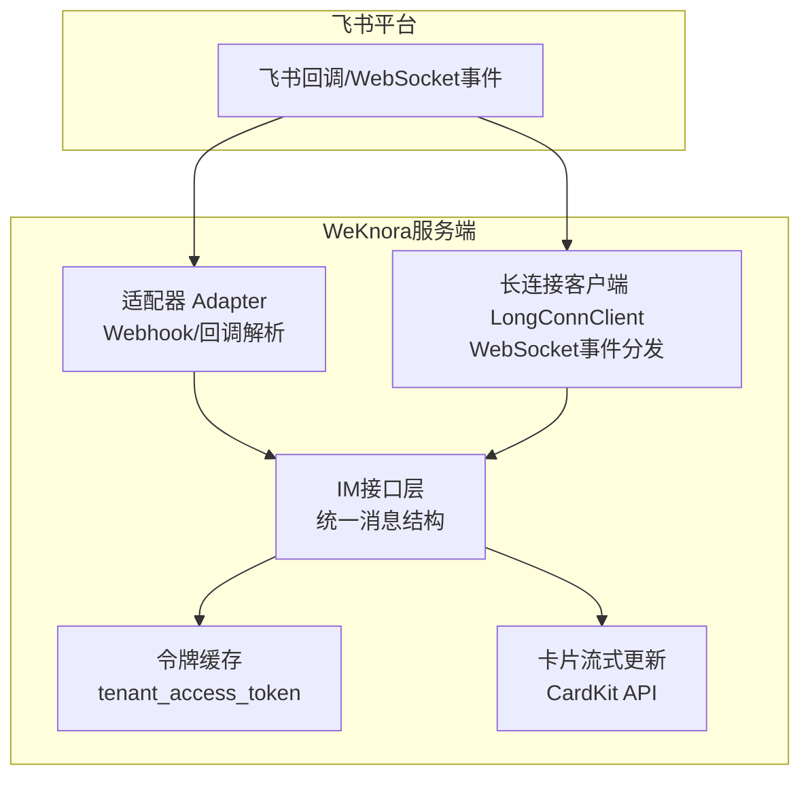
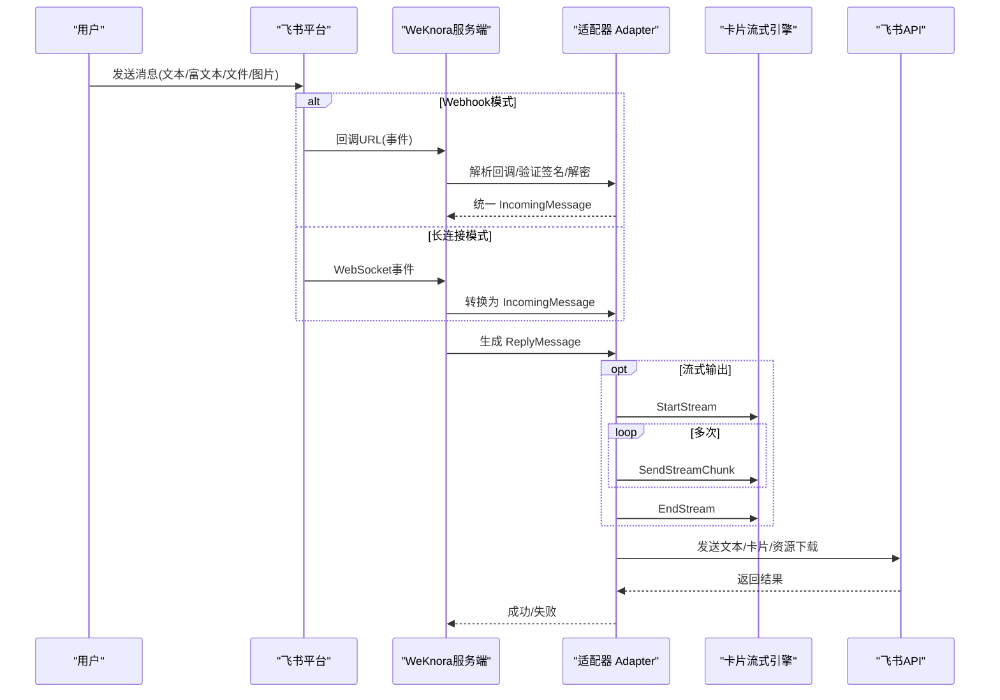
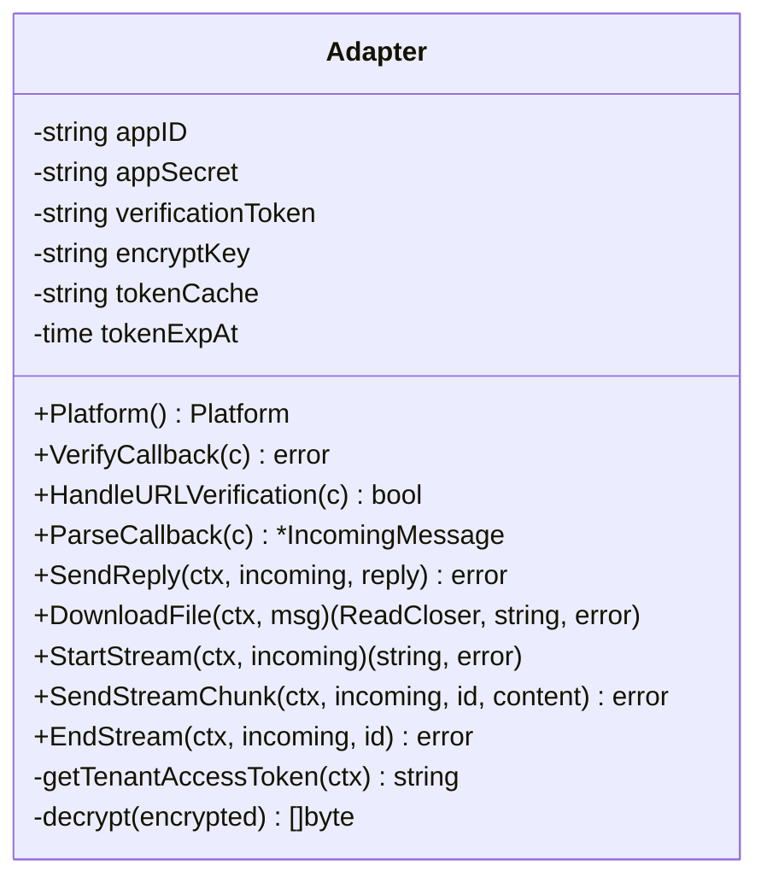
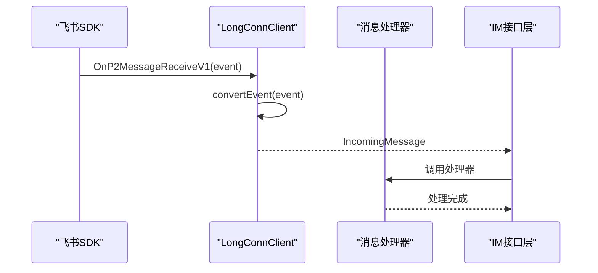
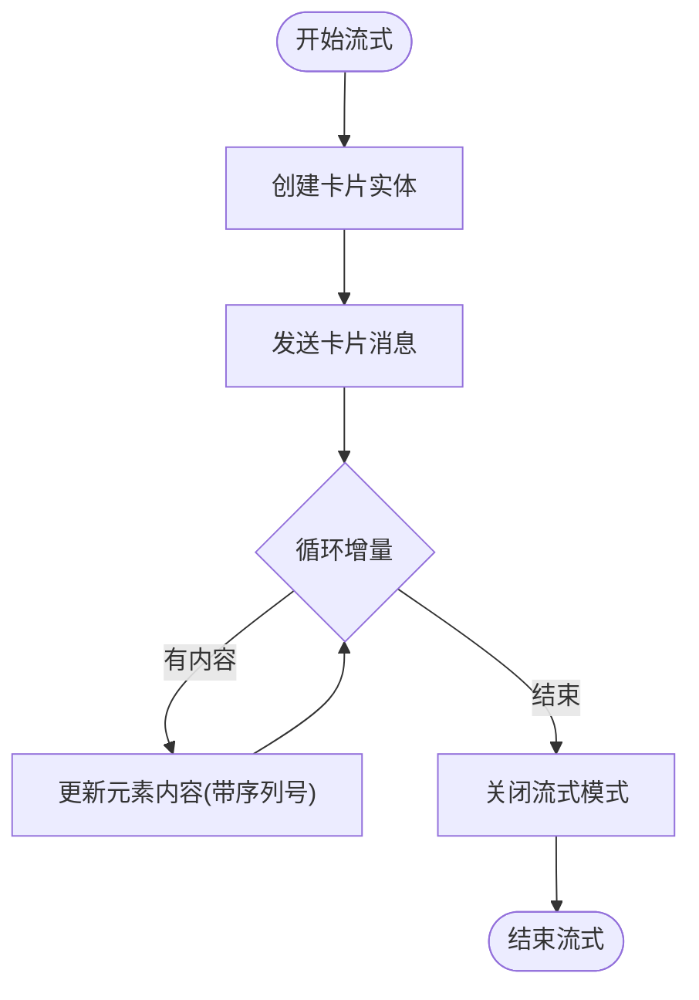
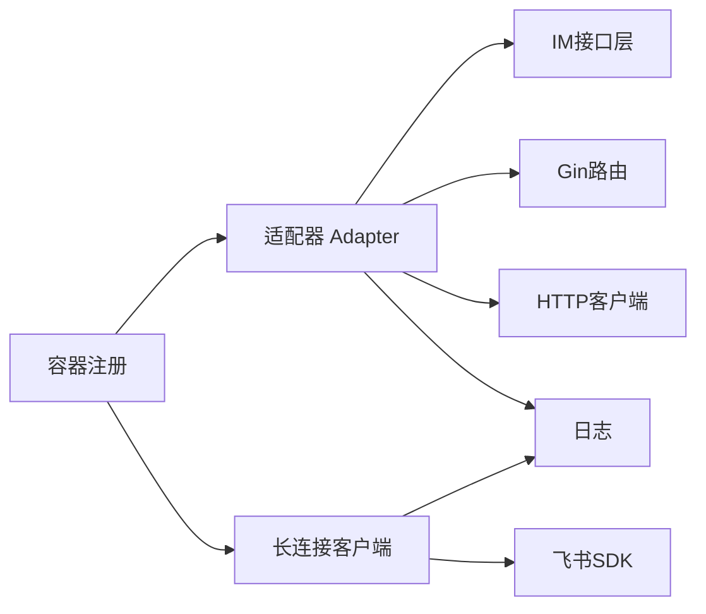

# 飞书适配器

<cite>
**本文引用的文件**
- [adapter.go](file://internal/im/feishu/adapter.go)
- [longconn.go](file://internal/im/feishu/longconn.go)
- [adapter_test.go](file://internal/im/feishu/adapter_test.go)
- [types.go](file://internal/im/types.go)
- [adapter.go](file://internal/im/adapter.go)
- [container.go](file://internal/container/container.go)
- [IMChannelPanel.vue](file://frontend/src/components/IMChannelPanel.vue)
- [client.go](file://internal/datasource/connector/feishu/client.go)
- [types.go](file://internal/datasource/connector/feishu/types.go)
</cite>

## 目录
1. [简介](#简介)
2. [项目结构](#项目结构)
3. [核心组件](#核心组件)
4. [架构总览](#架构总览)
5. [详细组件分析](#详细组件分析)
6. [依赖关系分析](#依赖关系分析)
7. [性能考量](#性能考量)
8. [故障排查指南](#故障排查指南)
9. [结论](#结论)
10. [附录](#附录)

## 简介
本文件面向飞书适配器的实现与使用，覆盖消息接收与发送、富文本与卡片流式渲染、文件下载、OAuth与令牌缓存、Webhook与长连接两种接入模式、@提及处理、权限校验与加密解密等关键能力。文档同时给出飞书应用配置与Webhook设置的实操步骤，帮助快速完成对接。

## 项目结构
飞书适配器位于内部IM模块中，采用“适配器+长连接客户端”的双模式设计：
- Webhook模式：通过回调URL接收事件，解析后统一为内部消息结构，再调用飞书API发送回复或卡片流式更新。
- 长连接模式：基于官方SDK建立WebSocket长连接，自动重连，事件到达时直接转为内部消息并交由处理器。

图表来源
- [adapter.go:1-1006](file://internal/im/feishu/adapter.go#L1-L1006)
- [longconn.go:1-294](file://internal/im/feishu/longconn.go#L1-L294)
- [adapter.go:120-165](file://internal/im/adapter.go#L120-L165)

章节来源
- [adapter.go:1-1006](file://internal/im/feishu/adapter.go#L1-L1006)
- [longconn.go:1-294](file://internal/im/feishu/longconn.go#L1-L294)
- [adapter.go:120-165](file://internal/im/adapter.go#L120-L165)

## 核心组件
- 适配器 Adapter：负责Webhook回调解析、URL验证、消息类型识别、@提及清理、文本/文件/图片/富文本(post)解析、普通文本回复、卡片流式渲染、文件下载、令牌获取与缓存、事件体解密。
- 长连接客户端 LongConnClient：封装官方SDK，自动重连，事件到内部消息的转换。
- 统一消息结构：IncomingMessage/ReplyMessage，屏蔽平台差异。
- 令牌缓存：tenant_access_token缓存与过期控制。
- 卡片流式渲染：CardKit v1三步法，支持流式增量更新与结束清理。

章节来源
- [adapter.go:38-99](file://internal/im/feishu/adapter.go#L38-L99)
- [longconn.go:19-48](file://internal/im/feishu/longconn.go#L19-L48)
- [adapter.go:42-118](file://internal/im/adapter.go#L42-L118)
- [adapter.go:908-959](file://internal/im/feishu/adapter.go#L908-L959)

## 架构总览
飞书适配器支持两种接入模式，均通过统一的IM接口对外提供能力。

图表来源
- [adapter.go:105-147](file://internal/im/feishu/adapter.go#L105-L147)
- [adapter.go:224-432](file://internal/im/feishu/adapter.go#L224-L432)
- [adapter.go:636-728](file://internal/im/feishu/adapter.go#L636-L728)
- [adapter.go:434-485](file://internal/im/feishu/adapter.go#L434-L485)
- [adapter.go:503-559](file://internal/im/feishu/adapter.go#L503-L559)

## 详细组件分析

### 适配器 Adapter
- 平台标识与初始化：记录App ID/Secret/Verification Token/Encrypt Key，启动流式回收器。
- 回调验证与URL验证：支持Verification Token校验与挑战响应；对加密事件进行AES解密。
- 消息解析：支持text、file、image、post四种消息类型；群聊中剥离@bot前缀；计算ThreadID优先使用root_id。
- 文本回复：根据聊天类型选择receive_id_type(open_id/chat_id)，构造文本内容并调用飞书IM API。
- 文件下载：通过GetMessageResource API按message_id与file_key下载文件或图片，带安全参数校验与文件名推断。
- 卡片流式渲染：CardKit v1三步法，先创建卡片实体，再发送卡片消息，随后多次增量更新元素内容，最后关闭流式模式。
- 令牌管理：tenant_access_token缓存，过期前刷新，避免频繁请求。
- 加密解密：基于SHA-256(EncryptKey)作为AES-256-CBC密钥，PKCS#7填充校验。

图表来源
- [adapter.go:38-99](file://internal/im/feishu/adapter.go#L38-L99)
- [adapter.go:105-147](file://internal/im/feishu/adapter.go#L105-L147)
- [adapter.go:224-432](file://internal/im/feishu/adapter.go#L224-L432)
- [adapter.go:434-559](file://internal/im/feishu/adapter.go#L434-L559)
- [adapter.go:636-728](file://internal/im/feishu/adapter.go#L636-L728)
- [adapter.go:908-1005](file://internal/im/feishu/adapter.go#L908-L1005)

章节来源
- [adapter.go:105-147](file://internal/im/feishu/adapter.go#L105-L147)
- [adapter.go:224-432](file://internal/im/feishu/adapter.go#L224-L432)
- [adapter.go:434-559](file://internal/im/feishu/adapter.go#L434-L559)
- [adapter.go:636-728](file://internal/im/feishu/adapter.go#L636-L728)
- [adapter.go:908-1005](file://internal/im/feishu/adapter.go#L908-L1005)

### 长连接客户端 LongConnClient
- 基于官方SDK建立WebSocket连接，自动重连。
- 事件分发：将P2MessageReceiveV1事件转换为统一IncomingMessage，支持text/file/image/post。
- 日志桥接：将SDK日志映射为统一日志格式，便于监控。

图表来源
- [longconn.go:25-54](file://internal/im/feishu/longconn.go#L25-L54)
- [longconn.go:83-131](file://internal/im/feishu/longconn.go#L83-L131)
- [longconn.go:133-293](file://internal/im/feishu/longconn.go#L133-L293)

章节来源
- [longconn.go:19-82](file://internal/im/feishu/longconn.go#L19-L82)
- [longconn.go:83-131](file://internal/im/feishu/longconn.go#L83-L131)
- [longconn.go:133-293](file://internal/im/feishu/longconn.go#L133-L293)

### 统一消息结构与会话
- IncomingMessage：包含平台、消息类型、用户/群组标识、内容、消息ID、ThreadID、文件键与名称等字段。
- ReplyMessage：包含文本内容、是否流式、是否最终块等。
- 会话模式：支持按用户或按Thread区分会话，ThreadID在不同平台有不同语义。

章节来源
- [adapter.go:42-118](file://internal/im/adapter.go#L42-L118)
- [types.go:14-83](file://internal/im/types.go#L14-L83)

### 令牌缓存与OAuth
- 令牌获取：调用飞书tenant_access_token接口，缓存至tokenExpAt，过期前刷新。
- 缓存策略：安全余量（默认5分钟）避免临界点失效。

章节来源
- [adapter.go:908-959](file://internal/im/feishu/adapter.go#L908-L959)

### 卡片流式渲染（CardKit）
- 三步法：创建卡片实体 → 发送卡片消息 → 增量更新元素内容 → 关闭流式模式。
- 流式状态：每张卡片维护序列号、累计内容、创建时间，后台定时清理孤儿流条目。

图表来源
- [adapter.go:636-662](file://internal/im/feishu/adapter.go#L636-L662)
- [adapter.go:664-696](file://internal/im/feishu/adapter.go#L664-L696)
- [adapter.go:702-728](file://internal/im/feishu/adapter.go#L702-L728)

章节来源
- [adapter.go:574-607](file://internal/im/feishu/adapter.go#L574-L607)
- [adapter.go:636-728](file://internal/im/feishu/adapter.go#L636-L728)

### 文件下载与预览
- 下载入口：DownloadFile，支持文件与图片两类资源。
- 参数校验：对message_id与file_key进行安全字符检查，防止路径穿越。
- 名称推断：优先使用消息中的FileName，否则从Content-Disposition提取。

章节来源
- [adapter.go:503-559](file://internal/im/feishu/adapter.go#L503-L559)

### OAuth与权限验证
- Webhook模式：回调URL需配置Verification Token；可选Encrypt Key用于事件体解密。
- 长连接模式：无需Verification Token/Encrypt Key，但需要App ID/Secret。
- 令牌：tenant_access_token用于调用飞书API。

章节来源
- [adapter.go:105-147](file://internal/im/feishu/adapter.go#L105-L147)
- [adapter.go:149-188](file://internal/im/feishu/adapter.go#L149-L188)
- [adapter.go:908-959](file://internal/im/feishu/adapter.go#L908-L959)

## 依赖关系分析
- 适配器依赖IM接口层（统一消息结构）、Gin路由框架、HTTP客户端、日志库。
- 长连接客户端依赖官方SDK（事件分发、自动重连、日志桥接）。
- 容器注册：在运行时根据通道配置选择webhook或websocket模式，注入处理器。

图表来源
- [adapter.go:12-30](file://internal/im/feishu/adapter.go#L12-L30)
- [longconn.go:3-14](file://internal/im/feishu/longconn.go#L3-L14)
- [container.go:1231-1270](file://internal/container/container.go#L1231-L1270)

章节来源
- [container.go:1231-1270](file://internal/container/container.go#L1231-L1270)

## 性能考量
- 令牌缓存：减少频繁获取token带来的延迟与限流风险。
- 流式回收：定期清理孤儿流条目，避免内存泄漏。
- 超时控制：HTTP客户端超时设置，避免阻塞。
- 批量增量：卡片流式更新仅推送必要增量，降低网络开销。

章节来源
- [adapter.go:62-87](file://internal/im/feishu/adapter.go#L62-L87)
- [adapter.go:908-959](file://internal/im/feishu/adapter.go#L908-L959)

## 故障排查指南
- 回调验证失败
  - 检查Verification Token是否正确配置。
  - 若启用加密，确认Encrypt Key与飞书后台一致。
- 事件解密失败
  - Encrypt Key必须与飞书后台配置一致。
  - 确认事件体为加密格式且Base64有效。
- 令牌获取失败
  - 检查App ID/Secret是否正确。
  - 确认网络可达飞书API域名。
- 卡片流式异常
  - 确保StartStream返回的card_id有效。
  - 检查SendStreamChunk的序列号递增。
  - EndStream确保关闭流式模式。
- 文件下载失败
  - 确认message_id与file_key非空且安全字符。
  - 检查权限与资源是否存在。

章节来源
- [adapter.go:105-147](file://internal/im/feishu/adapter.go#L105-L147)
- [adapter.go:961-1005](file://internal/im/feishu/adapter.go#L961-L1005)
- [adapter.go:908-959](file://internal/im/feishu/adapter.go#L908-L959)
- [adapter.go:636-728](file://internal/im/feishu/adapter.go#L636-L728)
- [adapter.go:503-559](file://internal/im/feishu/adapter.go#L503-L559)

## 结论
飞书适配器以统一接口屏蔽平台差异，提供Webhook与长连接两种接入方式，支持文本、富文本、文件、图片等多种消息类型，具备完善的卡片流式渲染、文件下载、令牌缓存与事件解密能力。结合容器注册逻辑，可在运行时灵活切换模式并注入消息处理器，满足多样化的IM集成需求。

## 附录

### 飞书应用配置与Webhook设置步骤
- 在飞书开发者后台创建企业自建应用，获取App ID与App Secret。
- 在应用设置中开启“机器人”能力，获取机器人身份标识。
- 在“事件订阅”中添加“接收消息”事件，配置回调URL与Verification Token。
- 如需事件体加密，生成Encrypt Key并在WeKnora侧配置。
- 在WeKnora前端“IM通道面板”中填写：
  - App ID、App Secret
  - Verification Token（Webhook模式）
  - Encrypt Key（Webhook模式）
  - 选择模式：webhook 或 websocket
- 保存后，容器将根据模式创建适配器与长连接客户端。

章节来源
- [IMChannelPanel.vue:212-239](file://frontend/src/components/IMChannelPanel.vue#L212-L239)
- [container.go:1231-1270](file://internal/container/container.go#L1231-L1270)

### 飞书消息类型与处理要点
- 文本消息：剥离群聊@bot前缀，保留纯文本内容。
- 富文本(post)：抽取标题与正文文本，拼接为QA输入。
- 文件/图片：解析file_key/image_key，支持下载与预览。
- 群聊ThreadID：优先使用root_id，未设置则回退message_id。

章节来源
- [adapter.go:288-432](file://internal/im/feishu/adapter.go#L288-L432)
- [adapter_test.go:5-39](file://internal/im/feishu/adapter_test.go#L5-L39)

### 飞书数据源连接器（补充）
- 飞书数据源连接器同样使用tenant_access_token进行鉴权，支持文档/知识库同步。
- 适用于需要将飞书Wiki/云文档导入知识库的场景。

章节来源
- [client.go:40-90](file://internal/datasource/connector/feishu/client.go#L40-L90)
- [types.go:15-27](file://internal/datasource/connector/feishu/types.go#L15-L27)