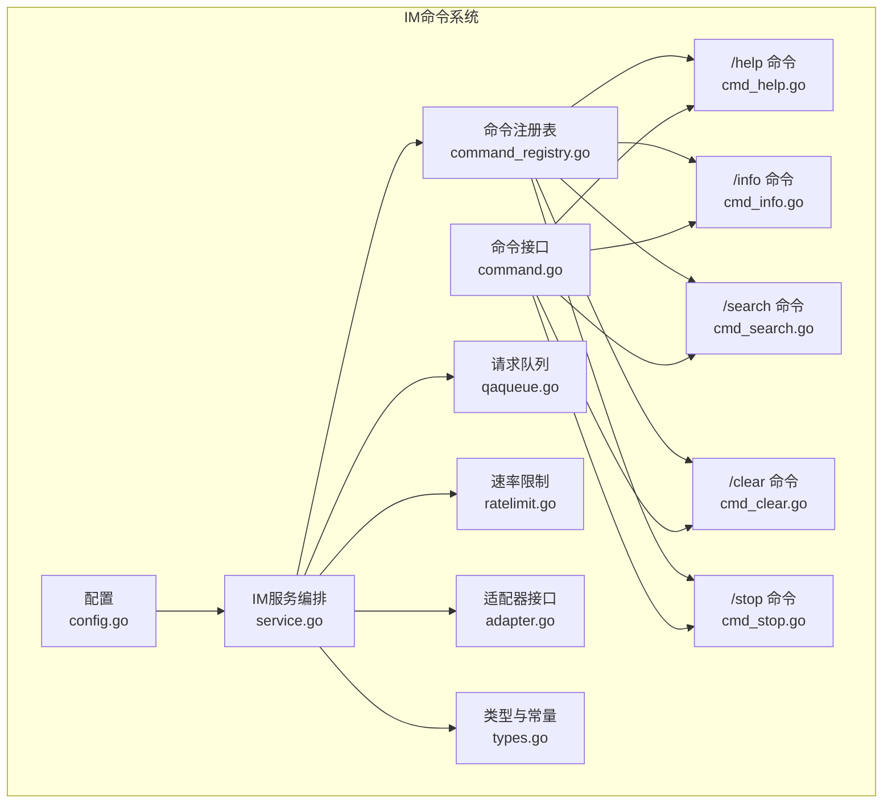
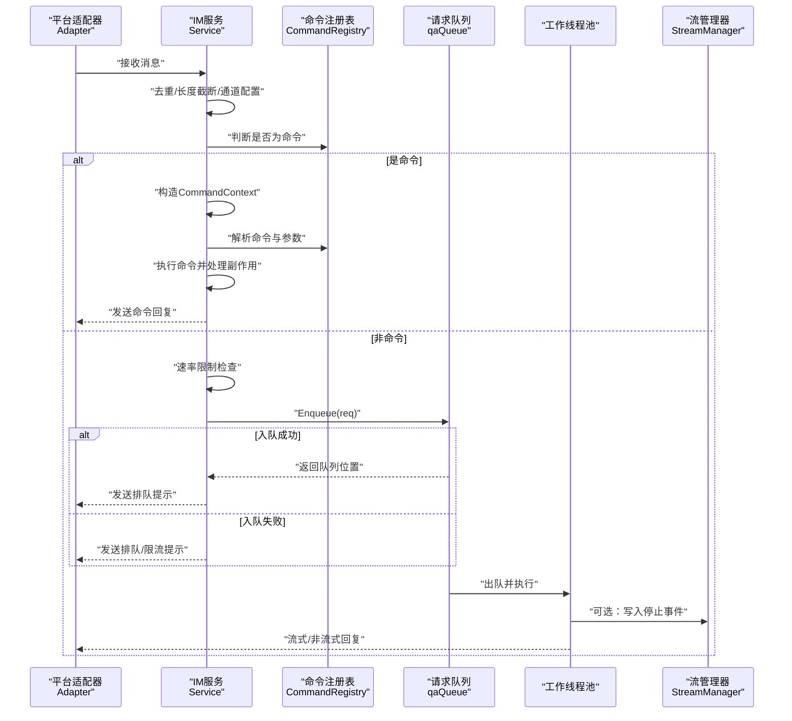
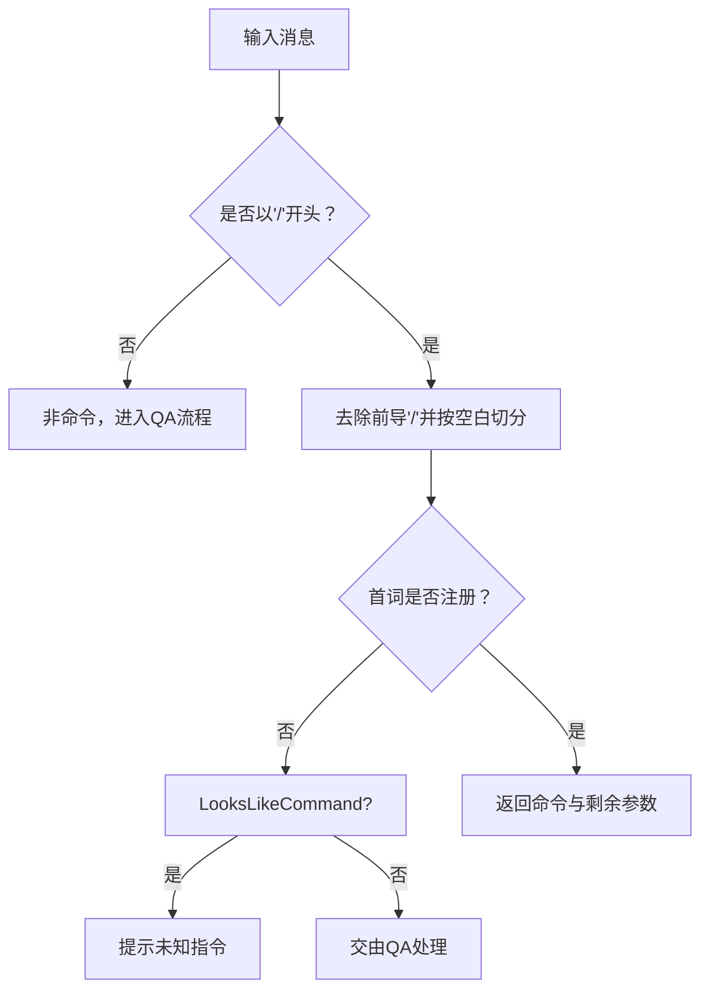
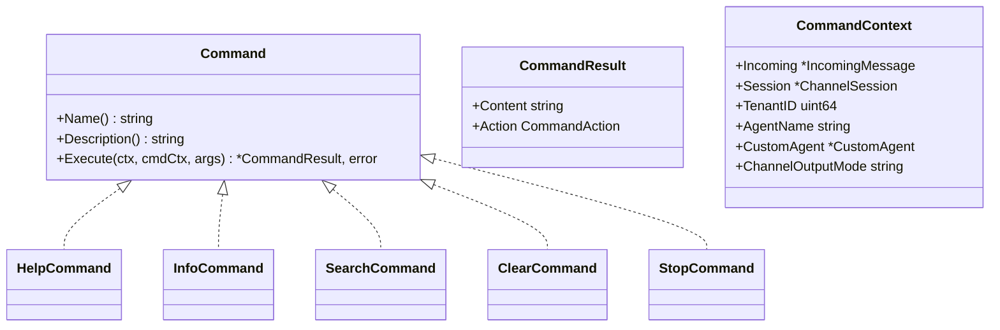
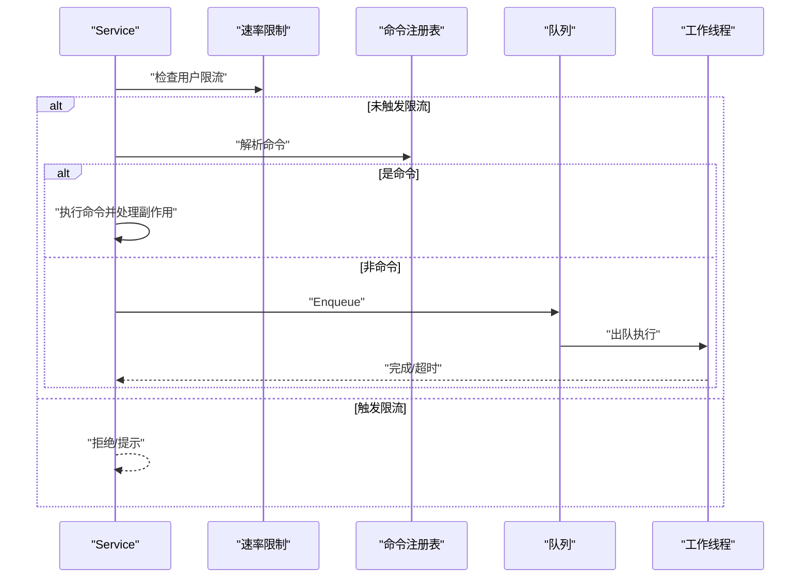
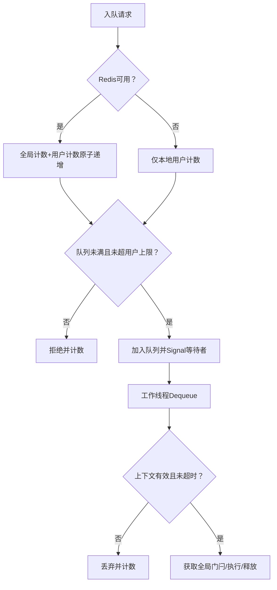
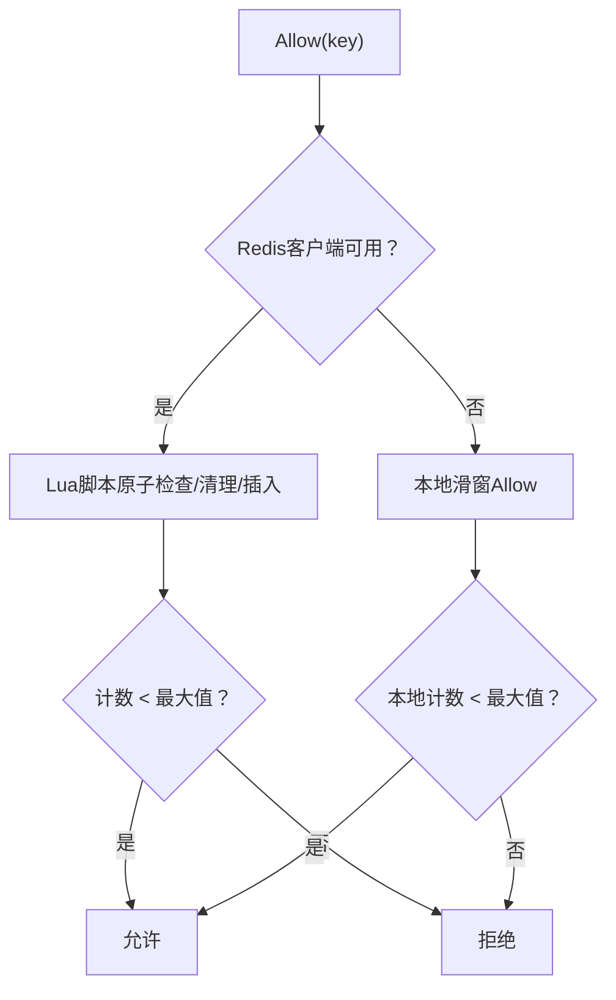
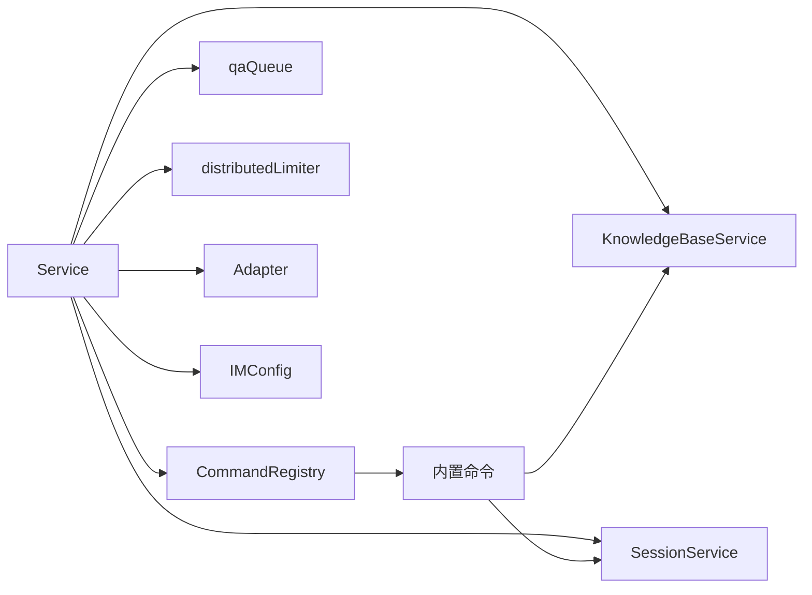

# Slash命令系统

<cite>
**本文档引用的文件**
- [command.go](file://internal/im/command.go)
- [command_registry.go](file://internal/im/command_registry.go)
- [cmd_help.go](file://internal/im/cmd_help.go)
- [cmd_info.go](file://internal/im/cmd_info.go)
- [cmd_search.go](file://internal/im/cmd_search.go)
- [cmd_clear.go](file://internal/im/cmd_clear.go)
- [cmd_stop.go](file://internal/im/cmd_stop.go)
- [service.go](file://internal/im/service.go)
- [qaqueue.go](file://internal/im/qaqueue.go)
- [ratelimit.go](file://internal/im/ratelimit.go)
- [types.go](file://internal/im/types.go)
- [adapter.go](file://internal/im/adapter.go)
- [config.go](file://internal/config/config.go)
</cite>

## 目录
1. [简介](#简介)
2. [项目结构](#项目结构)
3. [核心组件](#核心组件)
4. [架构总览](#架构总览)
5. [详细组件分析](#详细组件分析)
6. [依赖关系分析](#依赖关系分析)
7. [性能考量](#性能考量)
8. [故障排查指南](#故障排查指南)
9. [结论](#结论)
10. [附录](#附录)

## 简介
本文件系统性阐述 WeKnora 的 IM Slash 命令体系，覆盖命令注册机制、参数解析、权限与安全控制、执行队列与速率限制、内置命令功能与使用方式、以及扩展开发指南。文档同时解释命令执行的异步处理与状态反馈机制，并总结安全考虑与最佳实践。

## 项目结构
IM Slash 命令系统位于 internal/im 子模块，围绕以下关键文件组织：
- 命令接口与上下文：command.go
- 命令注册表：command_registry.go
- 内置命令实现：cmd_help.go、cmd_info.go、cmd_search.go、cmd_clear.go、cmd_stop.go
- 服务编排与执行：service.go
- 请求队列与并发控制：qaqueue.go
- 速率限制：ratelimit.go
- 类型与适配器接口：types.go、adapter.go
- 配置项：config.go

图表来源
- [command_registry.go:1-93](file://internal/im/command_registry.go#L1-L93)
- [command.go:1-67](file://internal/im/command.go#L1-L67)
- [cmd_help.go:1-51](file://internal/im/cmd_help.go#L1-L51)
- [cmd_info.go:1-133](file://internal/im/cmd_info.go#L1-L133)
- [cmd_search.go:1-133](file://internal/im/cmd_search.go#L1-L133)
- [cmd_clear.go:1-23](file://internal/im/cmd_clear.go#L1-L23)
- [cmd_stop.go:1-22](file://internal/im/cmd_stop.go#L1-L22)
- [service.go:1-2532](file://internal/im/service.go#L1-L2532)
- [qaqueue.go:1-407](file://internal/im/qaqueue.go#L1-L407)
- [ratelimit.go:1-200](file://internal/im/ratelimit.go#L1-L200)
- [types.go:1-179](file://internal/im/types.go#L1-L179)
- [adapter.go:1-165](file://internal/im/adapter.go#L1-L165)
- [config.go:1-758](file://internal/config/config.go#L1-L758)

章节来源
- [command_registry.go:1-93](file://internal/im/command_registry.go#L1-L93)
- [service.go:297-304](file://internal/im/service.go#L297-L304)

## 核心组件
- 命令接口与上下文
  - Command 接口定义命令名称、描述与执行方法；CommandContext 提供执行所需的上下文数据（输入消息、会话、租户、代理、通道输出模式等）。
- 命令注册表
  - CommandRegistry 提供命令注册、解析、存在性检查与列举能力，支持大小写不敏感的命令名映射。
- 内置命令
  - /help：列出或查询单个命令详情。
  - /info：展示当前智能体信息、知识库选择策略、技能与MCP接入情况、网络搜索开关与输出模式。
  - /search：在选定知识库上进行混合检索，返回原始片段。
  - /clear：清空会话上下文，使下一条消息开启全新会话。
  - /stop：取消当前用户×聊天的在途问答请求。
- 服务编排
  - Service 负责消息去重、速率限制、会话解析、命令分派、队列入队与执行、流式/非流式回复、跨实例停止信号与清理。
- 请求队列与并发控制
  - qaQueue 实现有界队列、每用户限流、全局并发门闩、超时丢弃与指标统计。
- 速率限制
  - distributedLimiter 基于 Redis ZSET 实现滑动窗口限流，降级为本地滑动窗口。
- 类型与适配器
  - IMChannel、ChannelSession 等类型定义通道与会话模型；Adapter/StreamSender/FileDownloader 接口抽象平台差异。

章节来源
- [command.go:1-67](file://internal/im/command.go#L1-L67)
- [command_registry.go:1-93](file://internal/im/command_registry.go#L1-L93)
- [cmd_help.go:1-51](file://internal/im/cmd_help.go#L1-L51)
- [cmd_info.go:1-133](file://internal/im/cmd_info.go#L1-L133)
- [cmd_search.go:1-133](file://internal/im/cmd_search.go#L1-L133)
- [cmd_clear.go:1-23](file://internal/im/cmd_clear.go#L1-L23)
- [cmd_stop.go:1-22](file://internal/im/cmd_stop.go#L1-L22)
- [service.go:101-163](file://internal/im/service.go#L101-L163)
- [qaqueue.go:67-114](file://internal/im/qaqueue.go#L67-L114)
- [ratelimit.go:22-104](file://internal/im/ratelimit.go#L22-L104)
- [types.go:14-179](file://internal/im/types.go#L14-L179)
- [adapter.go:120-165](file://internal/im/adapter.go#L120-L165)

## 架构总览
下图展示从消息到达至命令执行与队列处理的整体流程，包括速率限制、命令解析、队列入队与执行、以及跨实例停止信号。

图表来源
- [service.go:843-977](file://internal/im/service.go#L843-L977)
- [service.go:1047-1168](file://internal/im/service.go#L1047-L1168)
- [qaqueue.go:134-175](file://internal/im/qaqueue.go#L134-L175)
- [command_registry.go:36-51](file://internal/im/command_registry.go#L36-L51)

## 详细组件分析

### 命令注册与解析
- 注册机制
  - 在服务初始化时构建 CommandRegistry 并注册所有内置命令，注册名统一转小写，重复注册会触发启动期 panic，确保配置正确。
- 解析逻辑
  - Parse 识别以“/”开头的消息，按空白分割首词作为命令名，若未注册则判定为普通消息或未知命令提示。
  - IsRegistered 与 LooksLikeCommand 支持快速判断与区分“疑似命令”（避免将路径类字符串误判为命令）。
- 参数与上下文
  - Execute 接收 args 切片与 CommandContext，命令实现应自行校验参数有效性并返回可读的 Markdown 回复。

图表来源
- [command_registry.go:36-92](file://internal/im/command_registry.go#L36-L92)
- [service.go:913-923](file://internal/im/service.go#L913-L923)

章节来源
- [command_registry.go:15-23](file://internal/im/command_registry.go#L15-L23)
- [command_registry.go:36-51](file://internal/im/command_registry.go#L36-L51)
- [command_registry.go:53-66](file://internal/im/command_registry.go#L53-L66)
- [command_registry.go:77-92](file://internal/im/command_registry.go#L77-L92)
- [service.go:913-923](file://internal/im/service.go#L913-L923)

### 命令接口与上下文
- Command 接口
  - Name()/Description() 提供元数据；Execute(ctx, cmdCtx, args) 返回 CommandResult 或基础设施错误。
- CommandResult
  - Content 为 Markdown 文本；Action 可请求服务层副作用（清空会话、中止请求）。
- CommandContext
  - 携带 IncomingMessage、ChannelSession、TenantID、AgentName、CustomAgent、ChannelOutputMode 等上下文信息。

图表来源
- [command.go:52-67](file://internal/im/command.go#L52-L67)
- [command.go:24-30](file://internal/im/command.go#L24-L30)
- [command.go:32-50](file://internal/im/command.go#L32-L50)

章节来源
- [command.go:9-30](file://internal/im/command.go#L9-L30)
- [command.go:52-67](file://internal/im/command.go#L52-L67)

### 内置命令详解

#### /help 命令
- 功能
  - 无参数：列出所有命令及其简述。
  - 有参数：显示指定命令的名称与描述。
- 行为要点
  - 未知命令时返回友好提示，引导用户查看帮助列表。

章节来源
- [cmd_help.go:10-51](file://internal/im/cmd_help.go#L10-L51)

#### /info 命令
- 功能
  - 展示当前智能体名称、描述、模式（Agent/RAG）、知识库选择策略（全部/已选/禁用）、技能选择策略、MCP 服务接入情况、网络搜索开关与输出模式。
- 交互细节
  - 未绑定智能体时提示未绑定并引导查看帮助。
  - 知识库列表根据租户维度与工具能力过滤展示。

章节来源
- [cmd_info.go:11-133](file://internal/im/cmd_info.go#L11-L133)

#### /search 命令
- 功能
  - 在选定知识库集合上执行混合检索，返回原始片段与匹配度，限制最大结果数量。
- 关键点
  - 知识库范围解析与工具能力过滤与 QA 管道一致，保证一致性。
  - 结果截断与来源标签（标题/文件名）增强可读性。

章节来源
- [cmd_search.go:18-133](file://internal/im/cmd_search.go#L18-L133)

#### /clear 命令
- 功能
  - 请求服务层软删除当前 ChannelSession 并清空会话上下文，使下一条消息开启全新会话。
- 副作用
  - 返回 ActionClear，服务在 handleCommand 中执行软删除与上下文清理。

章节来源
- [cmd_clear.go:5-23](file://internal/im/cmd_clear.go#L5-L23)
- [service.go:1094-1101](file://internal/im/service.go#L1094-L1101)

#### /stop 命令
- 功能
  - 请求服务层中止当前用户×聊天的在途问答请求。
- 副作用与跨实例停止
  - 返回 ActionStop，服务在 handleCommand 中尝试本地移除/取消，在无本地命中时通过 Redis inflight 映射查找会话ID并写入 StreamManager 停止事件，同时设置预执行标记以覆盖尚未创建助手消息的请求。

章节来源
- [cmd_stop.go:5-22](file://internal/im/cmd_stop.go#L5-L22)
- [service.go:1102-1145](file://internal/im/service.go#L1102-L1145)

### 服务编排与执行流程
- 去重与预处理
  - 使用 Redis SetNX 或本地 sync.Map 去重，超长消息截断，动态加载通道配置。
- 速率限制
  - 非命令消息按用户×聊天×线程键进行滑动窗口限流，命令消息绕过限流。
- 命令分派
  - 若为命令，构造 CommandContext 并调用命令 Execute，随后处理副作用（清空/中止）并发送回复。
- 队列入队与执行
  - 非命令消息入队，工作线程执行 QA 管道，支持流式/非流式回复与超时丢弃。

图表来源
- [service.go:840-854](file://internal/im/service.go#L840-L854)
- [service.go:913-915](file://internal/im/service.go#L913-L915)
- [service.go:948-958](file://internal/im/service.go#L948-L958)
- [service.go:981-1043](file://internal/im/service.go#L981-L1043)

章节来源
- [service.go:784-977](file://internal/im/service.go#L784-L977)
- [service.go:1047-1168](file://internal/im/service.go#L1047-L1168)

### 请求队列与并发控制
- 有界队列与每用户限流
  - 支持本地与 Redis 全局两种计数方式；当 Redis 可用时优先使用全局计数。
- 全局并发门闩
  - 通过 Redis INCR/DECR 计数器实现跨实例并发上限，失败时降级等待。
- 超时与指标
  - 请求在队列中等待超时自动丢弃并通知用户；周期性记录深度、活跃工作者、拒绝与超时计数。

图表来源
- [qaqueue.go:134-175](file://internal/im/qaqueue.go#L134-L175)
- [qaqueue.go:216-263](file://internal/im/qaqueue.go#L216-L263)
- [qaqueue.go:290-350](file://internal/im/qaqueue.go#L290-L350)
- [qaqueue.go:388-406](file://internal/im/qaqueue.go#L388-L406)

章节来源
- [qaqueue.go:67-114](file://internal/im/qaqueue.go#L67-L114)
- [qaqueue.go:134-175](file://internal/im/qaqueue.go#L134-L175)
- [qaqueue.go:216-263](file://internal/im/qaqueue.go#L216-L263)
- [qaqueue.go:290-350](file://internal/im/qaqueue.go#L290-L350)
- [qaqueue.go:388-406](file://internal/im/qaqueue.go#L388-L406)

### 速率限制实现
- 分布式滑动窗口
  - 使用 Redis ZSET 存储请求时间戳，Lua 脚本原子清理过期、计数与插入，支持过期自动回收。
- 本地降级
  - Redis 不可用时回退到本地内存滑动窗口，定期清理过期时间戳。
- 配置化
  - 窗口时长与最大请求数可通过配置覆盖，默认 60s 窗口内最多 10 次请求。

图表来源
- [ratelimit.go:74-104](file://internal/im/ratelimit.go#L74-L104)
- [ratelimit.go:133-167](file://internal/im/ratelimit.go#L133-L167)

章节来源
- [ratelimit.go:22-51](file://internal/im/ratelimit.go#L22-L51)
- [ratelimit.go:53-104](file://internal/im/ratelimit.go#L53-L104)
- [ratelimit.go:106-199](file://internal/im/ratelimit.go#L106-L199)

### 自定义命令开发指南
- 实现步骤
  - 实现 Command 接口：Name()/Description()/Execute(...)。
  - 在服务初始化处注册：registry.Register(newYourCommand(...))。
  - 如需访问服务层能力，通过构造函数注入所需依赖（如知识库服务、会话服务等）。
- 参数解析与校验
  - Execute 的 args 由空格分隔的令牌组成；命令内部负责参数合法性校验与错误友好提示。
- 副作用与安全性
  - 使用 CommandResult.Action 请求服务层副作用；避免在命令中直接操作数据库或外部资源。
- 输出与流式
  - 优先返回 Markdown 内容；若通道输出模式为流式且适配器支持，服务会自动流式发送。

章节来源
- [command.go:52-67](file://internal/im/command.go#L52-L67)
- [service.go:297-304](file://internal/im/service.go#L297-L304)

### 异步处理与状态反馈
- 队列与工作线程
  - 非命令消息进入队列，工作线程池并发执行，避免阻塞适配器回调。
- 流式与非流式
  - 若适配器支持 StreamSender 且通道输出模式非“完整”，服务将流式推送答案块；否则一次性发送完整答案。
- 超时与拒绝
  - 超时请求被丢弃并提示用户；队列满或用户超限时拒绝入队并提示。

章节来源
- [service.go:1014-1043](file://internal/im/service.go#L1014-L1043)
- [service.go:948-977](file://internal/im/service.go#L948-L977)
- [qaqueue.go:230-241](file://internal/im/qaqueue.go#L230-L241)

### 安全与权限
- 去重与防抖
  - 使用 Redis SetNX 或本地 Map 去重，防止重复处理与资源浪费。
- 速率限制
  - 默认每用户每 60s 最多 10 次请求，命令消息绕过限流，保障用户控制权。
- 跨实例一致性
  - Redis 用于全局去重、限流、领导者选举、停止标记与全局并发门闩，确保多实例行为一致。
- 输入长度限制
  - 超长消息自动截断，保护下游 QA 管道。

章节来源
- [service.go:767-782](file://internal/im/service.go#L767-L782)
- [service.go:806-811](file://internal/im/service.go#L806-L811)
- [service.go:840-854](file://internal/im/service.go#L840-L854)
- [ratelimit.go:13-19](file://internal/im/ratelimit.go#L13-L19)

## 依赖关系分析
- 组件耦合
  - Service 依赖 CommandRegistry、qaQueue、distributedLimiter、适配器与各类服务接口。
  - 内置命令依赖 kbService、sessionService 等服务接口。
- 外部依赖
  - Redis 用于分布式去重、限流、领导者选举、停止标记与全局并发门闩。
- 配置驱动
  - IMConfig 控制工作线程数、队列容量、每用户上限、全局并发上限与速率限制参数。

图表来源
- [service.go:107-163](file://internal/im/service.go#L107-L163)
- [service.go:297-304](file://internal/im/service.go#L297-L304)
- [config.go:42-67](file://internal/config/config.go#L42-L67)

章节来源
- [service.go:107-163](file://internal/im/service.go#L107-L163)
- [config.go:42-67](file://internal/config/config.go#L42-L67)

## 性能考量
- 队列与并发
  - 合理设置 workers、max_queue_size、max_per_user 与 global_max_workers，避免下游 LLM 资源耗尽。
- 流式输出
  - 在支持的适配器上启用流式输出，降低感知延迟。
- 速率限制
  - 根据业务峰值调整窗口与最大请求数，平衡用户体验与系统负载。
- Redis 优化
  - 使用合适的 TTL 与键前缀，避免键膨胀；Lua 脚本减少往返开销。

## 故障排查指南
- 常见问题
  - 命令未生效：确认消息以“/”开头且命令名正确；使用 /help 检查命令列表。
  - 频繁被限流：检查速率限制配置与用户键构建规则（含线程ID）。
  - 队列积压：查看队列指标（深度、拒绝数、超时数），调整 workers 与队列容量。
  - /stop 无效：确认请求已在执行阶段或通过 Redis inflight 映射定位会话ID。
- 日志与监控
  - 服务会周期性记录队列指标；关注限流与去重失败日志。

章节来源
- [service.go:917-923](file://internal/im/service.go#L917-L923)
- [service.go:840-854](file://internal/im/service.go#L840-L854)
- [qaqueue.go:388-406](file://internal/im/qaqueue.go#L388-L406)
- [service.go:1123-1145](file://internal/im/service.go#L1123-L1145)

## 结论
WeKnora 的 IM Slash 命令系统通过清晰的接口设计、完善的注册与解析机制、稳健的队列与限流策略，实现了高可用、可扩展的命令执行框架。内置命令覆盖帮助、信息、检索、会话清空与中止等核心场景；服务层提供去重、流式输出、跨实例一致性与可观测性。开发者可基于现有接口快速扩展自定义命令，并结合配置与 Redis 能力实现弹性与可靠性。

## 附录
- 关键配置项（IMConfig）
  - workers：每实例并发工作线程数
  - global_max_workers：跨实例并发上限
  - max_queue_size：每实例队列容量
  - max_per_user：每用户最大排队数
  - rate_limit_window：速率限制窗口时长
  - rate_limit_max：窗口内最大请求数

章节来源
- [config.go:42-67](file://internal/config/config.go#L42-L67)