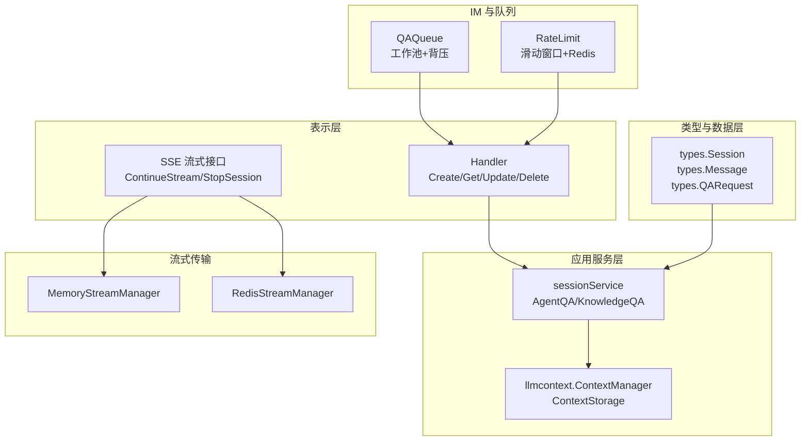
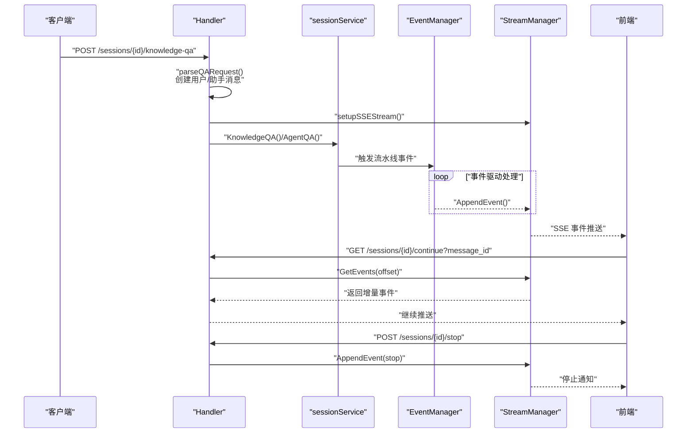
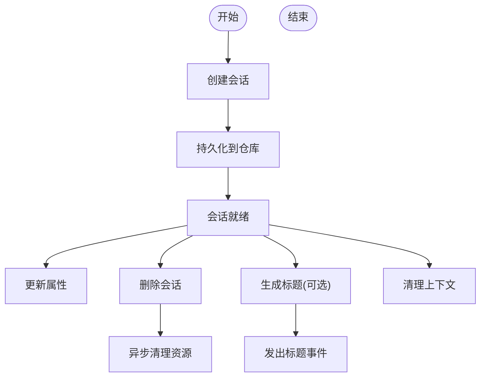
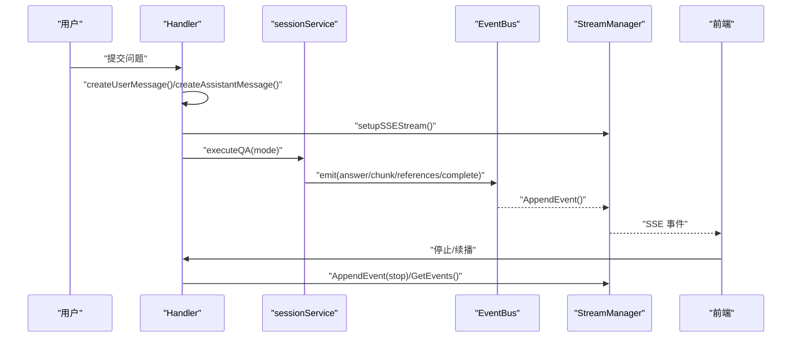
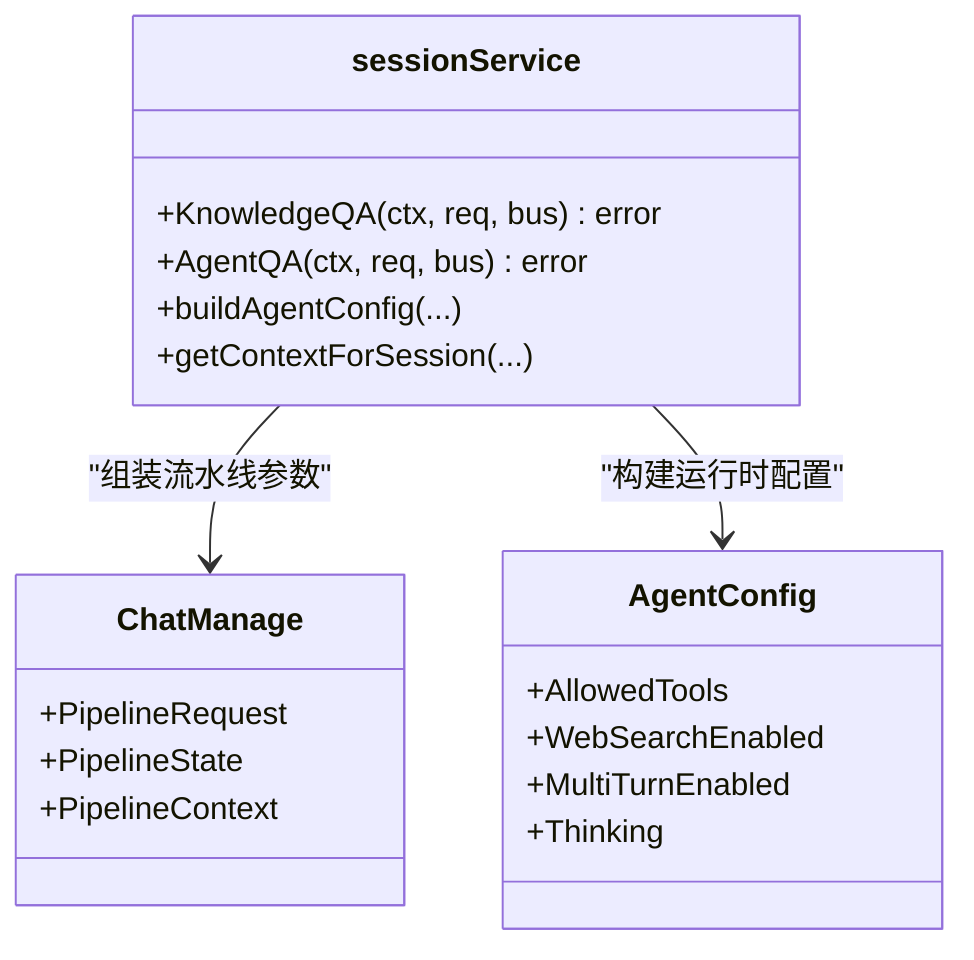
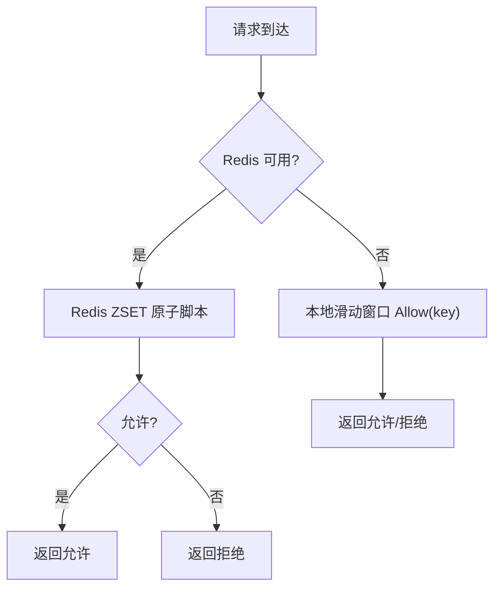
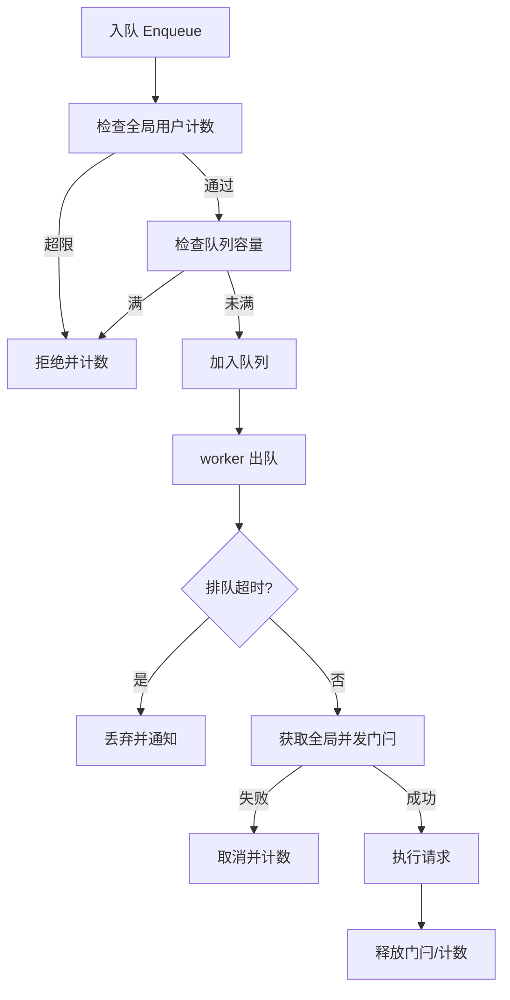
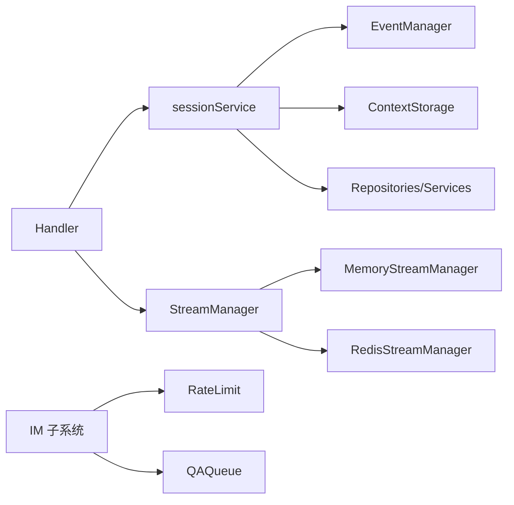

# 会话管理机制

<cite>
**本文档引用的文件**
- [session.go](file://internal/types/session.go)
- [session.go](file://internal/application/service/session.go)
- [handler.go](file://internal/handler/session/handler.go)
- [qa.go](file://internal/handler/session/qa.go)
- [stream.go](file://internal/handler/session/stream.go)
- [session_agent_qa.go](file://internal/application/service/session_agent_qa.go)
- [session_knowledge_qa.go](file://internal/application/service/session_knowledge_qa.go)
- [session_qa_helpers.go](file://internal/application/service/session_qa_helpers.go)
- [memory_manager.go](file://internal/stream/memory_manager.go)
- [redis_manager.go](file://internal/stream/redis_manager.go)
- [ratelimit.go](file://internal/im/ratelimit.go)
- [qaqueue.go](file://internal/im/qaqueue.go)
- [qa_request.go](file://internal/times/qa_request.go)
</cite>

## 目录
1. [简介](#简介)
2. [项目结构](#项目结构)
3. [核心组件](#核心组件)
4. [架构总览](#架构总览)
5. [详细组件分析](#详细组件分析)
6. [依赖关系分析](#依赖关系分析)
7. [性能考虑](#性能考虑)
8. [故障排查指南](#故障排查指南)
9. [结论](#结论)

## 简介
本文件系统性阐述 WeKnora 的会话管理机制，覆盖会话状态维护、消息路由与线程处理策略；解释用户键值构建规则、会话模式（普通模式与 Agent 模式）差异；文档化速率限制机制（滑动窗口算法与 Redis 分布式限流）；详解 QA 请求队列管理（工作池配置、队列长度控制与背压机制）；说明会话超时处理、消息去重与异常恢复策略，并提供会话生命周期管理与性能优化建议。

## 项目结构
WeKnora 的会话管理由三层协作完成：
- 类型与数据层：定义会话、消息、QA 请求等核心数据结构与序列化规则
- 应用服务层：封装会话生命周期、上下文管理、事件驱动的问答流水线
- 表示层与流式传输层：HTTP 接口解析请求、触发服务、通过 SSE/Redis 流式传输事件

**图表来源**
- [session.go:74-108](file://internal/types/session.go#L74-L108)
- [session.go:26-79](file://internal/application/service/session.go#L26-L79)
- [handler.go:16-64](file://internal/handler/session/handler.go#L16-L64)
- [stream.go:18-176](file://internal/handler/session/stream.go#L18-L176)
- [memory_manager.go:18-30](file://internal/stream/memory_manager.go#L18-L30)
- [redis_manager.go:13-50](file://internal/stream/redis_manager.go#L13-L50)
- [ratelimit.go:24-71](file://internal/im/ratelimit.go#L24-L71)
- [qaqueue.go:67-114](file://internal/im/qaqueue.go#L67-L114)

**章节来源**
- [session.go:1-168](file://internal/types/session.go#L1-L168)
- [session.go:1-527](file://internal/application/service/session.go#L1-L527)
- [handler.go:1-444](file://internal/handler/session/handler.go#L1-L444)
- [stream.go:1-441](file://internal/handler/session/stream.go#L1-L441)
- [memory_manager.go:1-119](file://internal/stream/memory_manager.go#L1-L119)
- [redis_manager.go:1-138](file://internal/stream/redis_manager.go#L1-L138)
- [ratelimit.go:1-200](file://internal/im/ratelimit.go#L1-L200)
- [qaqueue.go:1-407](file://internal/im/qaqueue.go#L1-L407)

## 核心组件
- 会话与消息模型：会话包含基础元数据与时间戳，消息通过外键关联会话；支持 JSON 字段与自定义数组字段的数据库映射。
- 会话服务：负责会话 CRUD、标题生成、上下文清理、异步标题生成、事件驱动的问答执行。
- HTTP 处理器：统一解析请求、校验参数、创建用户/助手消息、建立 SSE 流、处理停止与续播。
- 流式传输：内存与 Redis 两种实现，支持偏移拉取、事件追加、TTL 自动过期。
- 速率限制：滑动窗口本地限流 + Redis ZSET 原子脚本，支持实例级成员区分与回退。
- IM 队列：有界队列 + 工作池，支持全局并发门闩、用户级配额、超时丢弃与指标统计。

**章节来源**
- [session.go:74-168](file://internal/types/session.go#L74-L168)
- [session.go:26-527](file://internal/application/service/session.go#L26-L527)
- [handler.go:16-444](file://internal/handler/session/handler.go#L16-L444)
- [stream.go:18-441](file://internal/handler/session/stream.go#L18-L441)
- [memory_manager.go:18-119](file://internal/stream/memory_manager.go#L18-L119)
- [redis_manager.go:13-138](file://internal/stream/redis_manager.go#L13-L138)
- [ratelimit.go:24-200](file://internal/im/ratelimit.go#L24-L200)
- [qaqueue.go:67-407](file://internal/im/qaqueue.go#L67-L407)

## 架构总览
WeKnora 的会话管理采用“事件驱动 + 流式传输”的架构：
- Handler 解析请求，创建消息，初始化 SSE 事件总线与异步上下文
- 服务层根据模式选择 AgentQA 或 KnowledgeQA 路径，组装流水线事件并触发
- 流式传输层以事件形式推送增量输出，前端通过 SSE 或续播接口消费
- IM 子系统在长连接场景下引入队列与速率限制，保障稳定性与公平性

**图表来源**
- [qa.go:463-658](file://internal/handler/session/qa.go#L463-L658)
- [session_knowledge_qa.go:18-224](file://internal/application/service/session_knowledge_qa.go#L18-L224)
- [session_agent_qa.go:20-206](file://internal/application/service/session_agent_qa.go#L20-L206)
- [stream.go:31-176](file://internal/handler/session/stream.go#L31-L176)
- [memory_manager.go:62-115](file://internal/stream/memory_manager.go#L62-L115)
- [redis_manager.go:57-129](file://internal/stream/redis_manager.go#L57-L129)

## 详细组件分析

### 会话状态维护与生命周期
- 创建：校验租户 ID，持久化会话，记录创建/更新时间
- 查询：按 ID 与租户维度查询，支持分页与总数
- 更新/删除：更新属性；删除时异步清理聊天历史知识、临时 KB、会话上下文
- 标题生成：基于首条用户消息与可用模型生成标题，支持异步事件通知
- 上下文清理：按会话维度删除 LLM 上下文，避免跨会话污染

**图表来源**
- [session.go:81-334](file://internal/application/service/session.go#L81-L334)
- [session.go:336-526](file://internal/application/service/session.go#L336-L526)

**章节来源**
- [session.go:81-334](file://internal/application/service/session.go#L81-L334)
- [session.go:336-526](file://internal/application/service/session.go#L336-L526)

### 消息路由与线程处理策略
- 用户消息与助手消息：分别创建并关联会话；助手消息标记完成态后异步索引到知识库
- SSE 流式路由：Handler 建立 EventBus 与可取消上下文，事件通过 StreamManager 追加，前端轮询或 SSE 接收
- 续播与停止：续播接口按偏移增量拉取；停止接口写入 stop 事件，触发取消与前端通知
- 线程处理：AgentQA 支持工具调用与迭代；Normal 模式按流水线阶段推进

**图表来源**
- [qa.go:522-658](file://internal/handler/session/qa.go#L522-L658)
- [stream.go:18-294](file://internal/handler/session/stream.go#L18-L294)
- [memory_manager.go:62-115](file://internal/stream/memory_manager.go#L62-L115)
- [redis_manager.go:57-129](file://internal/stream/redis_manager.go#L57-L129)

**章节来源**
- [qa.go:463-741](file://internal/handler/session/qa.go#L463-L741)
- [stream.go:18-441](file://internal/handler/session/stream.go#L18-L441)

### 会话模式：普通模式与 Agent 模式
- 普通模式（KnowledgeQA）：基于检索增强（RAG）或纯聊天路径，动态装配流水线事件，支持记忆检索/存储、网络抓取、引用事件等
- Agent 模式（AgentQA）：构建 Agent 配置，注入系统提示，按工具能力与权限进行检索与工具调用，支持多轮与思考模式

**图表来源**
- [session_knowledge_qa.go:18-224](file://internal/application/service/session_knowledge_qa.go#L18-L224)
- [session_agent_qa.go:20-298](file://internal/application/service/session_agent_qa.go#L20-L298)
- [session_qa_helpers.go:101-202](file://internal/application/service/session_qa_helpers.go#L101-L202)

**章节来源**
- [session_knowledge_qa.go:18-224](file://internal/application/service/session_knowledge_qa.go#L18-L224)
- [session_agent_qa.go:20-298](file://internal/application/service/session_agent_qa.go#L20-L298)
- [session_qa_helpers.go:101-202](file://internal/application/service/session_qa_helpers.go#L101-L202)

### 速率限制机制：滑动窗口与 Redis 分布式限流
- 滑动窗口：本地内存结构记录每个键的时间戳，定期清理过期项
- Redis 原子脚本：使用 ZSET 存储请求时间戳，Lua 脚本一次性清理过期、计数与插入，保证原子性
- 回退策略：Redis 不可用时自动回退到本地滑动窗口
- 实例区分：ZSET 成员包含实例 ID，避免多实例冲突

**图表来源**
- [ratelimit.go:73-104](file://internal/im/ratelimit.go#L73-L104)
- [ratelimit.go:85-99](file://internal/im/ratelimit.go#L85-L99)
- [ratelimit.go:131-167](file://internal/im/ratelimit.go#L131-L167)

**章节来源**
- [ratelimit.go:1-200](file://internal/im/ratelimit.go#L1-L200)

### QA 请求队列管理：工作池、队列长度与背压
- 有界队列：最大队列长度、单用户最大排队数、全局并发上限
- 工作池：固定数量 worker 并发执行请求
- 背压与超时：队列满/用户超限直接拒绝；排队超时自动丢弃并通知用户
- 全局门闩：Redis INCR/DECR 实现跨实例并发门闩，失败时降级
- 指标统计：深度、活跃 worker、累计入队/处理/拒绝/超时

**图表来源**
- [qaqueue.go:132-175](file://internal/im/qaqueue.go#L132-L175)
- [qaqueue.go:216-263](file://internal/im/qaqueue.go#L216-L263)
- [qaqueue.go:312-341](file://internal/im/qaqueue.go#L312-L341)
- [qaqueue.go:351-381](file://internal/im/qaqueue.go#L351-L381)

**章节来源**
- [qaqueue.go:1-407](file://internal/im/qaqueue.go#L1-L407)

### 会话超时处理、消息去重与异常恢复
- 会话超时：续播接口检测流完成事件；前端在等待标题时最多等待 3 秒
- 消息去重：SSE 事件按偏移增量拉取，避免重复推送
- 异常恢复：Handler 层捕获 panic 并上报；服务层在流水线阶段失败时返回错误事件；停止接口写入 stop 事件触发取消

**章节来源**
- [stream.go:296-441](file://internal/handler/session/stream.go#L296-L441)
- [qa.go:602-658](file://internal/handler/session/qa.go#L602-L658)

## 依赖关系分析
- Handler 依赖 sessionService、StreamManager、附件处理器、模型/知识库服务
- sessionService 依赖事件管理器、上下文存储、消息/知识库/模型/租户服务
- 流式传输支持内存与 Redis 两种实现，满足单机与分布式场景
- IM 速率限制与队列独立于主问答链路，确保长连接稳定性

**图表来源**
- [handler.go:16-64](file://internal/handler/session/handler.go#L16-L64)
- [session.go:26-79](file://internal/application/service/session.go#L26-L79)
- [memory_manager.go:18-30](file://internal/stream/memory_manager.go#L18-L30)
- [redis_manager.go:13-50](file://internal/stream/redis_manager.go#L13-L50)
- [ratelimit.go:24-71](file://internal/im/ratelimit.go#L24-L71)
- [qaqueue.go:67-114](file://internal/im/qaqueue.go#L67-L114)

**章节来源**
- [handler.go:16-64](file://internal/handler/session/handler.go#L16-L64)
- [session.go:26-79](file://internal/application/service/session.go#L26-L79)

## 性能考虑
- 上下文压缩：支持滑动窗口与智能压缩策略，减少 Token 占用
- 流式传输：SSE/Redis 列表 O(1) 追加，LRange 增量拉取，降低延迟
- 队列背压：通过全局门闩与用户配额限制瞬时并发，避免雪崩
- 本地回退：Redis 不可用时自动回退本地滑窗，保障可用性
- 指标可观测：队列深度、活跃 worker、累计指标周期日志，便于容量规划

## 故障排查指南
- 会话创建失败：检查租户 ID 是否为空，查看服务端日志定位错误
- 会话查询 404：确认会话 ID 与租户匹配，检查软删除索引
- 删除会话异常：关注异步清理知识库/临时 KB/上下文的告警
- SSE 无输出：确认事件总线订阅、StreamManager 是否正常、前端是否正确续播
- 停止无效：检查 stop 事件是否写入、前端是否收到 stop 事件
- 速率限制频繁拒绝：调整 Redis 配置或放宽阈值；观察本地回退是否生效
- 队列积压：查看队列指标，评估 workers 数量与全局门闩设置

**章节来源**
- [session.go:81-334](file://internal/application/service/session.go#L81-L334)
- [stream.go:18-294](file://internal/handler/session/stream.go#L18-L294)
- [ratelimit.go:73-104](file://internal/im/ratelimit.go#L73-L104)
- [qaqueue.go:387-407](file://internal/im/qaqueue.go#L387-L407)

## 结论
WeKnora 的会话管理以事件驱动与流式传输为核心，结合本地与 Redis 的分布式限流与队列机制，在保证高可用的同时提供了灵活的会话模式与强大的扩展能力。通过合理的上下文压缩、背压与指标监控，可在大规模场景下稳定运行并持续优化性能。