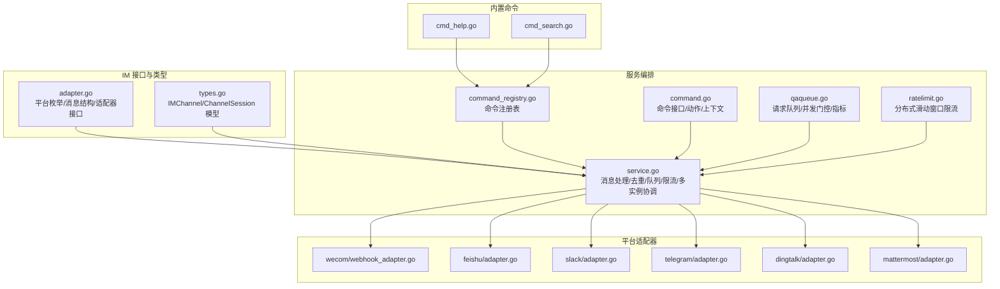
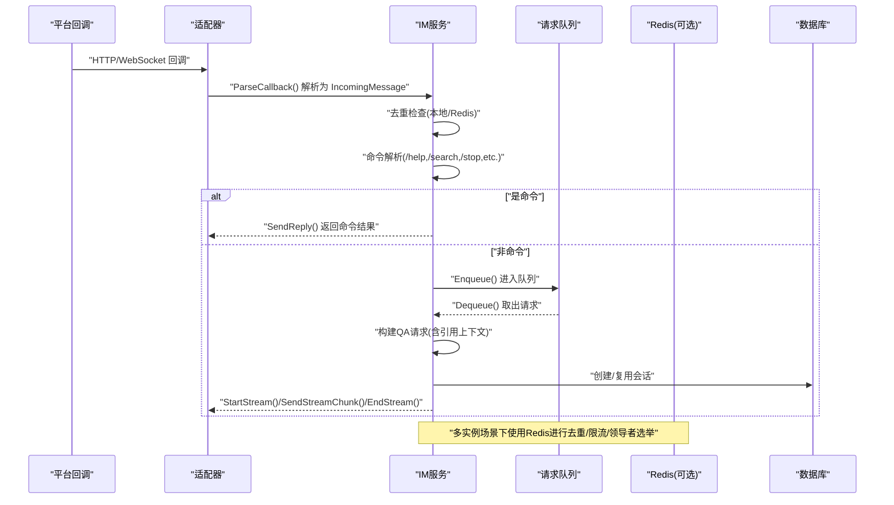
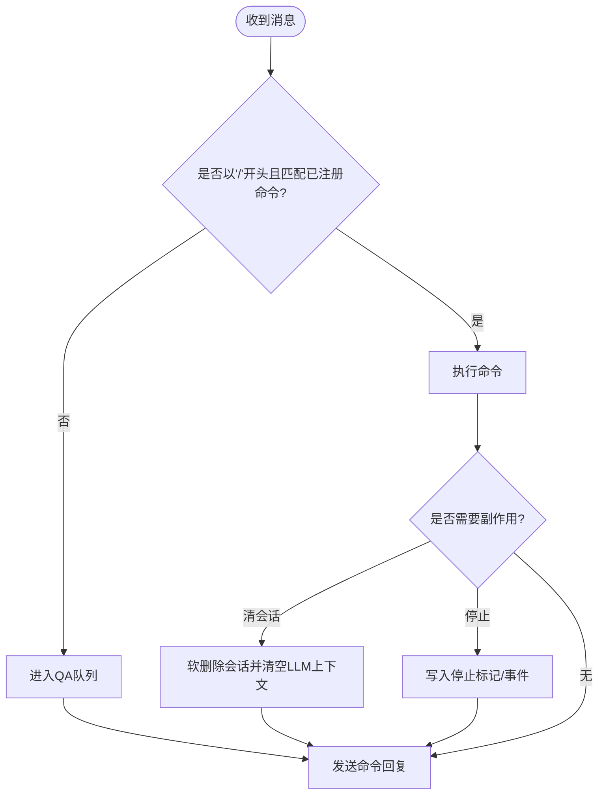
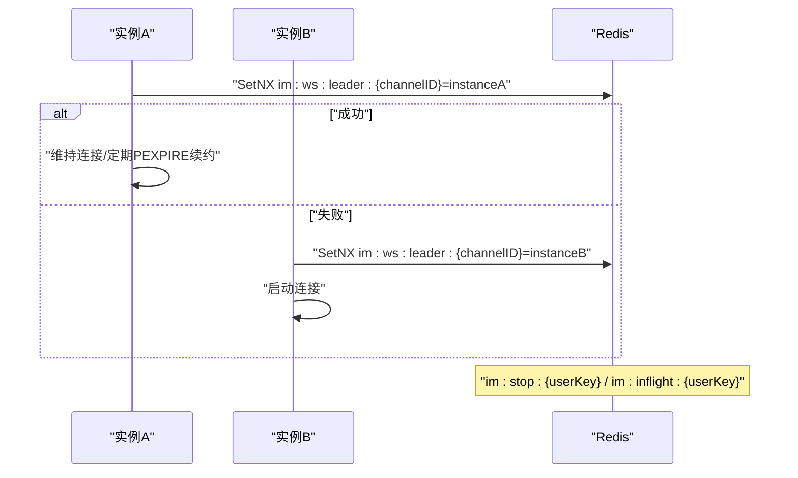
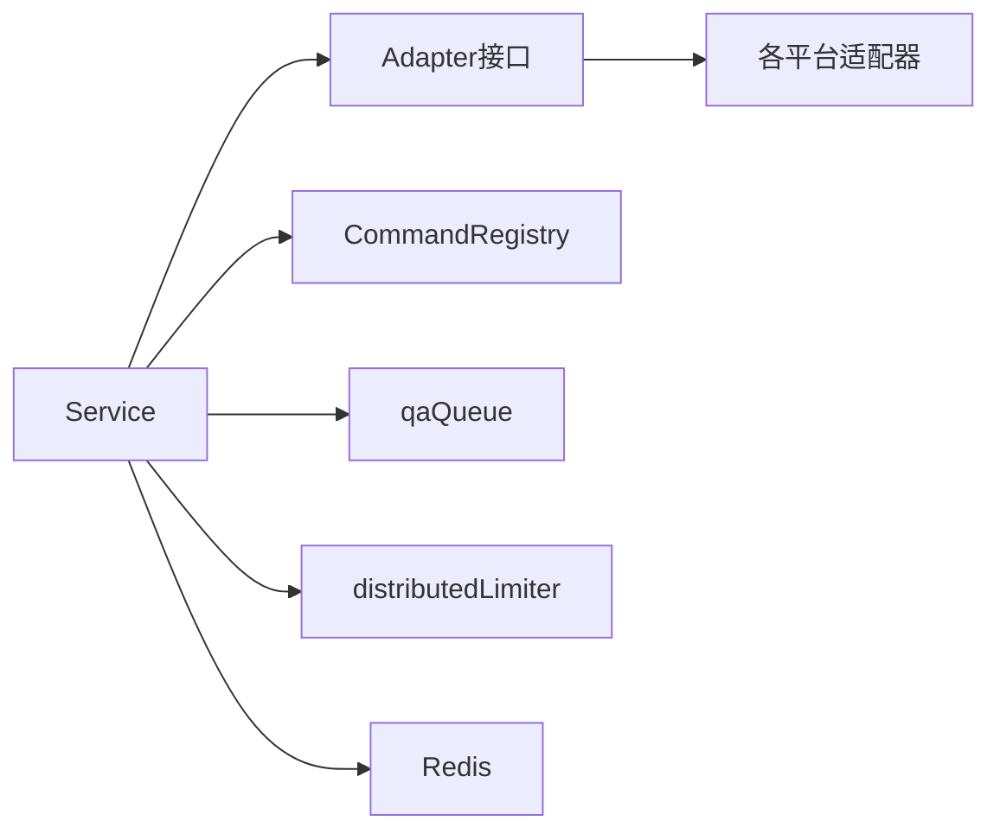

# 即时通讯集成

<cite>
**本文档引用的文件**
- [adapter.go](file://internal/im/adapter.go)
- [service.go](file://internal/im/service.go)
- [types.go](file://internal/im/types.go)
- [ratelimit.go](file://internal/im/ratelimit.go)
- [command.go](file://internal/im/command.go)
- [command_registry.go](file://internal/im/command_registry.go)
- [qaqueue.go](file://internal/im/qaqueue.go)
- [wecom/webhook_adapter.go](file://internal/im/wecom/webhook_adapter.go)
- [feishu/adapter.go](file://internal/im/feishu/adapter.go)
- [slack/adapter.go](file://internal/im/slack/adapter.go)
- [telegram/adapter.go](file://internal/im/telegram/adapter.go)
- [dingtalk/adapter.go](file://internal/im/dingtalk/adapter.go)
- [mattermost/adapter.go](file://internal/im/mattermost/adapter.go)
- [cmd_help.go](file://internal/im/cmd_help.go)
- [cmd_search.go](file://internal/im/cmd_search.go)
</cite>

## 目录
1. [简介](#简介)
2. [项目结构](#项目结构)
3. [核心组件](#核心组件)
4. [架构总览](#架构总览)
5. [详细组件分析](#详细组件分析)
6. [依赖分析](#依赖分析)
7. [性能考虑](#性能考虑)
8. [故障排除指南](#故障排除指南)
9. [结论](#结论)
10. [附录](#附录)

## 简介
本文件系统性阐述 WeKnora 的即时通讯（IM）集成能力，覆盖企业微信、飞书、Slack、Telegram、钉钉、Mattermost 等主流平台的适配器实现；详解会话管理机制（会话状态维护、消息路由、线程处理策略）；文档化 Slash 命令系统（命令注册、执行队列、速率限制）；说明引用回复上下文的提取与注入，以及反幻觉处理；提供配置指南与故障排除方法；解释多实例协调与 Redis 集成；最后给出 IM 通道扩展与自定义适配器开发指南。

## 项目结构
IM 子系统位于 internal/im 目录，采用“统一接口 + 平台适配器”的分层设计：
- 接口与类型：统一的消息结构、适配器接口、通道与会话模型
- 服务编排：消息入口、去重、命令解析、队列与限流、跨实例协调、流式输出
- 平台适配器：各 IM 平台的回调验证、消息解析、回复发送、文件下载、长连接/轮询
- Slash 命令：内置命令注册与执行，支持查询、帮助、停止、清会话等

图表来源
- [adapter.go:10-165](file://internal/im/adapter.go#L10-L165)
- [types.go:14-179](file://internal/im/types.go#L14-L179)
- [service.go:101-350](file://internal/im/service.go#L101-L350)
- [command_registry.go:5-93](file://internal/im/command_registry.go#L5-L93)
- [command.go:9-67](file://internal/im/command.go#L9-L67)
- [qaqueue.go:67-114](file://internal/im/qaqueue.go#L67-L114)
- [ratelimit.go:21-104](file://internal/im/ratelimit.go#L21-L104)
- [wecom/webhook_adapter.go:77-126](file://internal/im/wecom/webhook_adapter.go#L77-L126)
- [feishu/adapter.go:38-60](file://internal/im/feishu/adapter.go#L38-L60)
- [slack/adapter.go:28-50](file://internal/im/slack/adapter.go#L28-L50)
- [telegram/adapter.go:29-52](file://internal/im/telegram/adapter.go#L29-L52)
- [dingtalk/adapter.go:40-72](file://internal/im/dingtalk/adapter.go#L40-L72)
- [mattermost/adapter.go:30-48](file://internal/im/mattermost/adapter.go#L30-L48)
- [cmd_help.go:10-51](file://internal/im/cmd_help.go#L10-L51)
- [cmd_search.go:18-133](file://internal/im/cmd_search.go#L18-L133)

章节来源
- [adapter.go:10-165](file://internal/im/adapter.go#L10-L165)
- [types.go:14-179](file://internal/im/types.go#L14-L179)
- [service.go:101-350](file://internal/im/service.go#L101-L350)

## 核心组件
- 统一消息与适配器接口
  - 平台枚举、消息类型、聊天类型、消息结构体、适配器接口、可选的流式发送与文件下载接口
- 服务编排
  - 消息入口、去重、命令解析、队列与限流、跨实例协调（Redis）、流式输出
- 通道与会话
  - IMChannel（通道配置）、ChannelSession（用户×聊天×线程到会话映射）
- Slash 命令
  - 命令注册表、命令接口、动作语义、内置命令（帮助、搜索）

章节来源
- [adapter.go:10-165](file://internal/im/adapter.go#L10-L165)
- [service.go:101-350](file://internal/im/service.go#L101-L350)
- [types.go:14-179](file://internal/im/types.go#L14-L179)
- [command.go:9-67](file://internal/im/command.go#L9-L67)
- [command_registry.go:5-93](file://internal/im/command_registry.go#L5-L93)

## 架构总览
IM 集成以“服务编排 + 适配器 + 命令系统 + 队列/限流/Redis”为核心，形成高内聚、低耦合的模块化架构。消息从各平台回调进入，经统一适配器解析为 IncomingMessage，再由 Service 处理：先进行去重与命令解析，若非命令则进入 QA 请求队列，最终通过适配器回推给平台。

图表来源
- [service.go:784-800](file://internal/im/service.go#L784-L800)
- [service.go:390-451](file://internal/im/service.go#L390-L451)
- [qaqueue.go:132-175](file://internal/im/qaqueue.go#L132-L175)
- [adapter.go:120-165](file://internal/im/adapter.go#L120-L165)

## 详细组件分析

### 适配器接口与平台支持
- 适配器接口
  - 平台标识、回调签名验证、回调解析、回复发送、URL 验证处理
  - 可选：StartStream/SendStreamChunk/EndStream（流式输出）、DownloadFile（文件下载）
- 支持平台
  - 企业微信（Webhook 模式）、飞书（事件订阅/卡片流式）、Slack（事件 API/长连接）、Telegram（Webhook/长轮询）、钉钉（Webhook/卡片流式）、Mattermost（Outgoing Webhook）

章节来源
- [adapter.go:120-165](file://internal/im/adapter.go#L120-L165)
- [wecom/webhook_adapter.go:77-126](file://internal/im/wecom/webhook_adapter.go#L77-L126)
- [feishu/adapter.go:38-60](file://internal/im/feishu/adapter.go#L38-L60)
- [slack/adapter.go:28-50](file://internal/im/slack/adapter.go#L28-L50)
- [telegram/adapter.go:29-52](file://internal/im/telegram/adapter.go#L29-L52)
- [dingtalk/adapter.go:40-72](file://internal/im/dingtalk/adapter.go#L40-L72)
- [mattermost/adapter.go:30-48](file://internal/im/mattermost/adapter.go#L30-L48)

### 会话管理与线程处理
- 会话模式
  - 用户模式：按 (平台, 用户ID, 聊天ID, 租户ID) 解析会话
  - 线程模式：按 (平台, 线程ID, 聊天ID, 租户ID) 解析会话，顶级消息使用自身消息ID作为线程ID，从而为每个顶级消息创建新会话
- 会话映射
  - ChannelSession 将 IM 会话与 WeKnora Session 关联，支持状态与元数据存储
- 线程处理策略
  - 各平台线程ID来源不同：Slack 使用 thread_ts；Mattermost 使用 root_id 或 post_id；飞书使用 root_id；Telegram 使用 message_thread_id；钉钉使用会话Webhook或群ID；企业微信在 Webhook 模式下不支持线程，使用用户×聊天×租户键

章节来源
- [adapter.go:23-80](file://internal/im/adapter.go#L23-L80)
- [types.go:147-179](file://internal/im/types.go#L147-L179)
- [service.go:165-174](file://internal/im/service.go#L165-L174)

### 引用回复上下文与反幻觉
- 引用上下文提取
  - QuotedMessage 记录被引用消息的文本、发送者、是否机器人、非文本类型
  - formatQuotedContext 将引用内容格式化为 LLM 上下文字符串，或针对非文本类型生成明确提示
- 反幻觉处理
  - 对于非文本类型（图片/文件/视频/语音），不注入占位文本，而是生成明确指令，避免 LLM 产生幻觉
- 输出清理
  - stripIMCitationTags 在发送前移除 IM 平台无意义的内联引用标签

章节来源
- [adapter.go:82-98](file://internal/im/adapter.go#L82-L98)
- [service.go:184-215](file://internal/im/service.go#L184-L215)
- [service.go:51-54](file://internal/im/service.go#L51-L54)

### Slash 命令系统
- 命令注册与解析
  - CommandRegistry 提供注册、解析、存在性判断、外观判定
  - Command 接口定义命令名称、描述与执行
- 内置命令
  - /help：列出或查询命令详情
  - /search：在知识库中检索原文（受工具能力过滤）
- 执行队列与限流
  - 命令执行不进入 QA 队列，但会遵循全局限流与速率控制
- 动作语义
  - CommandResult 包含回复内容与服务级副作用（清会话、停止）

图表来源
- [command_registry.go:25-51](file://internal/im/command_registry.go#L25-L51)
- [command.go:24-30](file://internal/im/command.go#L24-L30)
- [cmd_help.go:19-50](file://internal/im/cmd_help.go#L19-L50)
- [cmd_search.go:38-133](file://internal/im/cmd_search.go#L38-L133)

章节来源
- [command_registry.go:5-93](file://internal/im/command_registry.go#L5-L93)
- [command.go:9-67](file://internal/im/command.go#L9-L67)
- [cmd_help.go:10-51](file://internal/im/cmd_help.go#L10-L51)
- [cmd_search.go:18-133](file://internal/im/cmd_search.go#L18-L133)

### 请求队列与并发控制
- 队列特性
  - 有界队列、每用户限流、工作池、全局并发门控（Redis INCR/DECR）
- 指标与可观测性
  - 深度、活跃工作者、累计入队/处理/拒绝/超时
- 超时与拒绝
  - 入队后超时丢弃并提示用户重新发送
- 全局并发门控
  - 通过 Redis 计数器限制跨实例并发，失败时退避重试

章节来源
- [qaqueue.go:67-114](file://internal/im/qaqueue.go#L67-L114)
- [qaqueue.go:132-175](file://internal/im/qaqueue.go#L132-L175)
- [qaqueue.go:216-263](file://internal/im/qaqueue.go#L216-L263)
- [qaqueue.go:289-341](file://internal/im/qaqueue.go#L289-L341)
- [qaqueue.go:351-381](file://internal/im/qaqueue.go#L351-L381)
- [qaqueue.go:387-407](file://internal/im/qaqueue.go#L387-L407)

### 速率限制与分布式一致性
- 分布式滑动窗口
  - Redis ZSET + Lua 脚本原子实现，成员包含实例ID与时间戳，避免跨实例冲突
  - 本地降级：Redis 不可用时回退到内存滑动窗口
- 清理循环
  - 定期清理过期条目，避免内存膨胀

章节来源
- [ratelimit.go:21-104](file://internal/im/ratelimit.go#L21-L104)
- [ratelimit.go:106-200](file://internal/im/ratelimit.go#L106-L200)

### 多实例协调与 Redis 集成
- 领导者选举（WebSocket/长连接）
  - Redis SetNX + TTL + Lua 比较删除，保障同一通道只有一实例维持连接
  - 定期续约与丢失检测，自动切换领导者
- 去重
  - Redis SetNX + TTL，跨实例去重，失败时保守处理（丢弃）
- 全局并发门控
  - INCR/DECR + TTL，跨实例安全控制并发
- 停止信号
  - Redis 前置标记 + inflight 映射 + StreamManager 事件，实现跨实例停止

图表来源
- [service.go:520-583](file://internal/im/service.go#L520-L583)
- [service.go:585-617](file://internal/im/service.go#L585-L617)
- [service.go:758-782](file://internal/im/service.go#L758-L782)
- [service.go:619-727](file://internal/im/service.go#L619-L727)

章节来源
- [service.go:520-583](file://internal/im/service.go#L520-L583)
- [service.go:585-617](file://internal/im/service.go#L585-L617)
- [service.go:619-727](file://internal/im/service.go#L619-L727)
- [service.go:758-782](file://internal/im/service.go#L758-L782)

### 平台适配器实现要点

#### 企业微信（Webhook）
- 回调签名验证（Token/HMAC）
- 解密回调（AES-CBC + PKCS#7）
- 发送消息（应用号消息/群聊）
- 文件下载（临时媒体/直链）

章节来源
- [wecom/webhook_adapter.go:133-185](file://internal/im/wecom/webhook_adapter.go#L133-L185)
- [wecom/webhook_adapter.go:187-269](file://internal/im/wecom/webhook_adapter.go#L187-L269)
- [wecom/webhook_adapter.go:271-378](file://internal/im/wecom/webhook_adapter.go#L271-L378)
- [wecom/webhook_adapter.go:525-552](file://internal/im/wecom/webhook_adapter.go#L525-L552)

#### 飞书（事件订阅/卡片流式）
- 回调签名验证（Verification Token/加密事件）
- 事件解析（消息类型、@去除、线程ID）
- 文本/富文本/文件/图片解析
- 卡片流式更新（CardKit v1）

章节来源
- [feishu/adapter.go:105-147](file://internal/im/feishu/adapter.go#L105-L147)
- [feishu/adapter.go:224-432](file://internal/im/feishu/adapter.go#L224-L432)
- [feishu/adapter.go:434-485](file://internal/im/feishu/adapter.go#L434-L485)
- [feishu/adapter.go:561-728](file://internal/im/feishu/adapter.go#L561-L728)

#### Slack（事件 API/长连接）
- 回调签名验证（Secrets Verifier）
- 事件解析（提及去除、线程ID=ts）
- 流式更新（编辑消息）
- 文件下载（GetFile/私有下载链接）

章节来源
- [slack/adapter.go:100-123](file://internal/im/slack/adapter.go#L100-L123)
- [slack/adapter.go:125-171](file://internal/im/slack/adapter.go#L125-L171)
- [slack/adapter.go:196-212](file://internal/im/slack/adapter.go#L196-L212)
- [slack/adapter.go:227-307](file://internal/im/slack/adapter.go#L227-L307)
- [slack/adapter.go:309-339](file://internal/im/slack/adapter.go#L309-L339)

#### Telegram（Webhook/长轮询）
- 回调签名验证（X-Telegram-Bot-Api-Secret-Token）
- 更新解析（@bot 去除、thread_id）
- 流式更新（编辑消息，带节流）
- 文件下载（getFile + file_path）

章节来源
- [telegram/adapter.go:62-71](file://internal/im/telegram/adapter.go#L62-L71)
- [telegram/adapter.go:115-204](file://internal/im/telegram/adapter.go#L115-L204)
- [telegram/adapter.go:216-231](file://internal/im/telegram/adapter.go#L216-L231)
- [telegram/adapter.go:359-392](file://internal/im/telegram/adapter.go#L359-L392)
- [telegram/adapter.go:426-446](file://internal/im/telegram/adapter.go#L426-L446)
- [telegram/adapter.go:454-485](file://internal/im/telegram/adapter.go#L454-L485)

#### 钉钉（Webhook/卡片流式）
- 回调签名验证（HMAC-SHA256 + 时间戳校验）
- 回调解析（群/单聊、@去除）
- 两种回复路径：SessionWebhook 或 OpenAPI
- AI 卡片流式更新（OUT_TRACK_ID + STREAMING）

章节来源
- [dingtalk/adapter.go:82-113](file://internal/im/dingtalk/adapter.go#L82-L113)
- [dingtalk/adapter.go:141-187](file://internal/im/dingtalk/adapter.go#L141-L187)
- [dingtalk/adapter.go:191-287](file://internal/im/dingtalk/adapter.go#L191-L287)
- [dingtalk/adapter.go:382-440](file://internal/im/dingtalk/adapter.go#L382-L440)
- [dingtalk/adapter.go:492-521](file://internal/im/dingtalk/adapter.go#L492-L521)
- [dingtalk/adapter.go:562-594](file://internal/im/dingtalk/adapter.go#L562-L594)

#### Mattermost（Outgoing Webhook）
- 回调解析（token 校验、文件IDs、thread_root）
- 回复发送（CreatePost/PatchPostMessage）
- 流式更新（PatchPostMessage）

章节来源
- [mattermost/adapter.go:70-87](file://internal/im/mattermost/adapter.go#L70-L87)
- [mattermost/adapter.go:89-155](file://internal/im/mattermost/adapter.go#L89-L155)
- [mattermost/adapter.go:225-241](file://internal/im/mattermost/adapter.go#L225-L241)
- [mattermost/adapter.go:255-323](file://internal/im/mattermost/adapter.go#L255-L323)
- [mattermost/adapter.go:325-349](file://internal/im/mattermost/adapter.go#L325-L349)

## 依赖分析
- 组件耦合
  - Service 依赖 Adapter 接口，面向抽象编程，便于扩展新平台
  - CommandRegistry 与 Command 解耦命令实现与执行
  - Redis 用于去重、限流、领导者选举、停止信号，提升多实例一致性
- 外部依赖
  - 各平台 SDK/HTTP 客户端（如 Slack、Telegram、DingTalk）
  - Redis 客户端（go-redis）

图表来源
- [service.go:101-164](file://internal/im/service.go#L101-L164)
- [adapter.go:120-165](file://internal/im/adapter.go#L120-L165)
- [command_registry.go:5-93](file://internal/im/command_registry.go#L5-L93)
- [qaqueue.go:67-114](file://internal/im/qaqueue.go#L67-L114)
- [ratelimit.go:53-71](file://internal/im/ratelimit.go#L53-L71)

章节来源
- [service.go:101-164](file://internal/im/service.go#L101-L164)
- [adapter.go:120-165](file://internal/im/adapter.go#L120-L165)
- [command_registry.go:5-93](file://internal/im/command_registry.go#L5-L93)
- [qaqueue.go:67-114](file://internal/im/qaqueue.go#L67-L114)
- [ratelimit.go:53-71](file://internal/im/ratelimit.go#L53-L71)

## 性能考虑
- 流式输出
  - 各平台均支持 StartStream/SendStreamChunk/EndStream，降低首字延迟
  - Telegram/Slack/Mattermost 采用编辑消息方式，减少消息数量
- 队列与并发
  - 有界队列 + 每用户限流 + 全局并发门控，防止下游资源耗尽
  - 超时丢弃与重试友好提示，避免阻塞
- 限流
  - 分布式滑动窗口 + 本地降级，兼顾一致性与可用性
- 去重
  - Redis SetNX + TTL，避免重复处理与资源浪费

## 故障排除指南
- 回调验证失败
  - 企业微信：确认 Token、EncodingAESKey、CorpAgentID 配置正确，检查加密/解密流程
  - 飞书：确认 Verification Token 或加密事件解密正确
  - Slack：确认 Signing Secret 有效
  - Telegram：确认 X-Telegram-Bot-Api-Secret-Token 一致
  - 钉钉：确认 Timestamp 未过期、签名计算正确
- 消息未到达
  - 检查 URL 验证是否完成（部分平台要求）
  - 确认回调地址可达、证书有效
- 流式输出异常
  - 平台速率限制：Telegram/Slack/Mattermost 有编辑频率限制，需节流
  - 钉钉卡片流式：确保 cardTemplateID 配置正确
- 多实例冲突
  - 检查 Redis 连接与权限，确认领导者选举正常
  - 观察 im:ws:leader 键是否存在、TTL 是否刷新
- 停止无效
  - 确认 /stop 前置标记与 inflight 映射写入成功
  - 检查 StreamManager 事件推送是否正常

章节来源
- [wecom/webhook_adapter.go:133-185](file://internal/im/wecom/webhook_adapter.go#L133-L185)
- [feishu/adapter.go:105-147](file://internal/im/feishu/adapter.go#L105-L147)
- [slack/adapter.go:100-123](file://internal/im/slack/adapter.go#L100-L123)
- [telegram/adapter.go:62-71](file://internal/im/telegram/adapter.go#L62-L71)
- [dingtalk/adapter.go:82-113](file://internal/im/dingtalk/adapter.go#L82-L113)
- [service.go:520-583](file://internal/im/service.go#L520-L583)
- [service.go:619-727](file://internal/im/service.go#L619-L727)

## 结论
WeKnora 的 IM 集成以统一接口与服务编排为核心，结合队列、限流与 Redis 多实例协调，实现了对主流 IM 平台的稳定接入与高效扩展。通过严格的去重、命令优先处理、流式输出与反幻觉上下文注入，既保证了用户体验，也提升了系统的可靠性与可运维性。内置命令体系与可插拔适配器设计，使得二次开发与定制化扩展具备良好基础。

## 附录

### 配置指南
- 通道配置（IMChannel）
  - 平台、模式（websocket/webhook/longpoll）、输出模式（stream/full）、会话模式（user/thread）、机器人身份、凭据、绑定代理
- 速率与队列参数（应用配置）
  - 工作线程数、最大队列长度、每用户最大排队数、全局最大并发、限流窗口与阈值
- Redis（可选）
  - 用于领导者选举、去重、限流、停止信号与全局并发门控

章节来源
- [types.go:14-60](file://internal/im/types.go#L14-L60)
- [types.go:75-83](file://internal/im/types.go#L75-L83)
- [service.go:243-275](file://internal/im/service.go#L243-L275)
- [service.go:69-81](file://internal/im/service.go#L69-L81)

### 自定义适配器开发步骤
- 实现 Adapter 接口（至少 Platform/VerifyCallback/ParseCallback/SendReply）
- 如需流式输出，实现 StreamSender 接口
- 如需文件下载，实现 FileDownloader 接口
- 在 Service 中注册适配器工厂函数
- 在数据库中创建 IMChannel 记录，填写凭据与模式
- 部署回调/长连接/轮询服务，确保 URL 验证与签名验证通过

章节来源
- [adapter.go:120-165](file://internal/im/adapter.go#L120-L165)
- [service.go:352-357](file://internal/im/service.go#L352-L357)