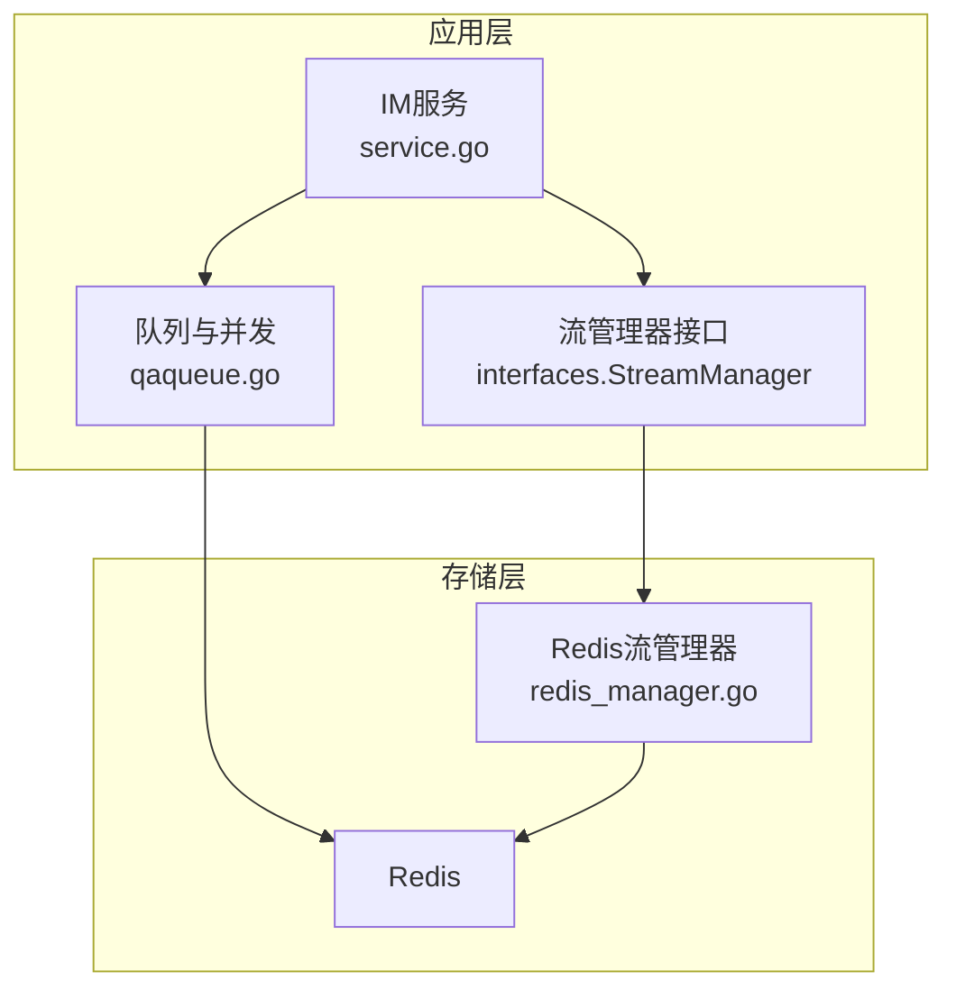
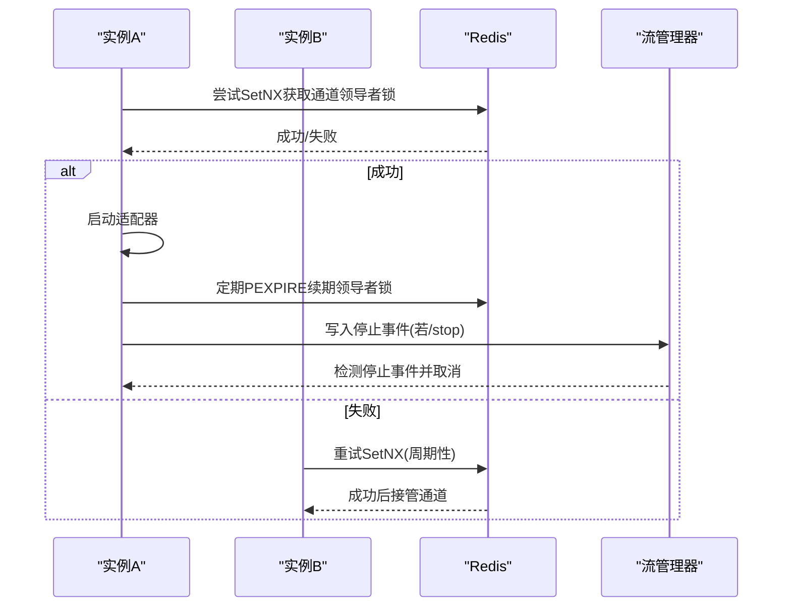
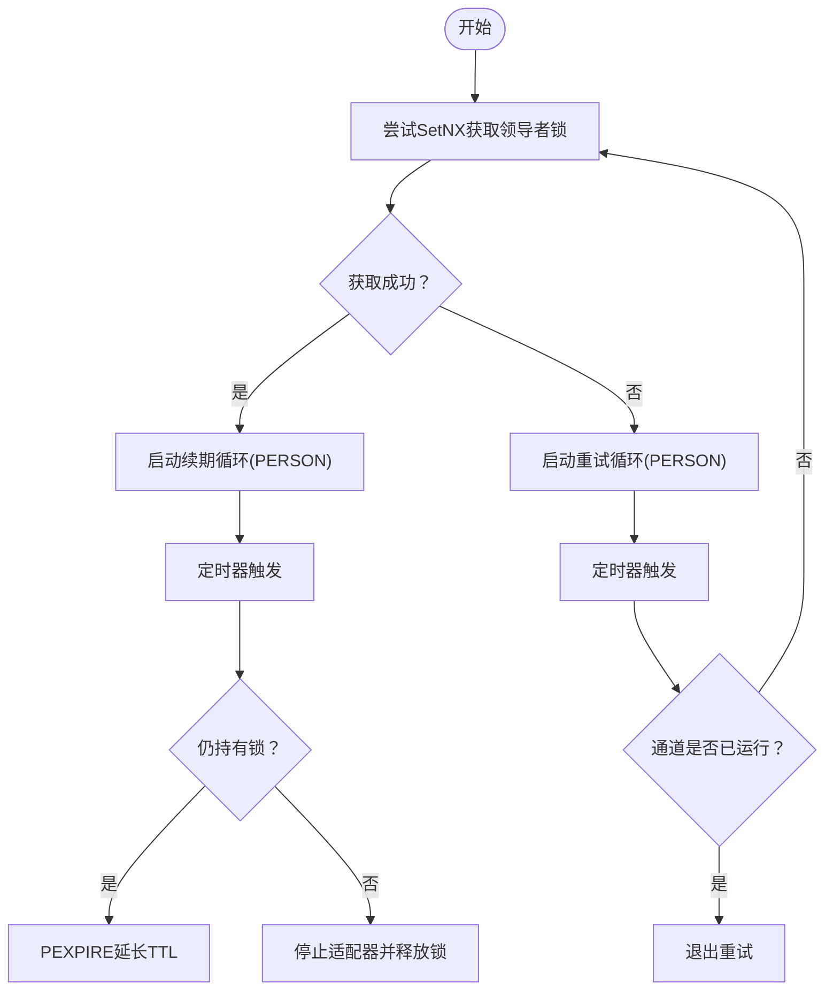
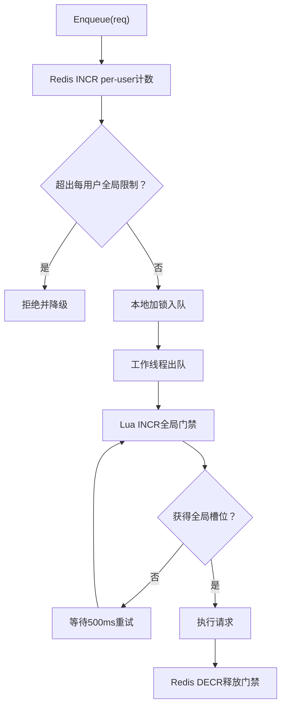
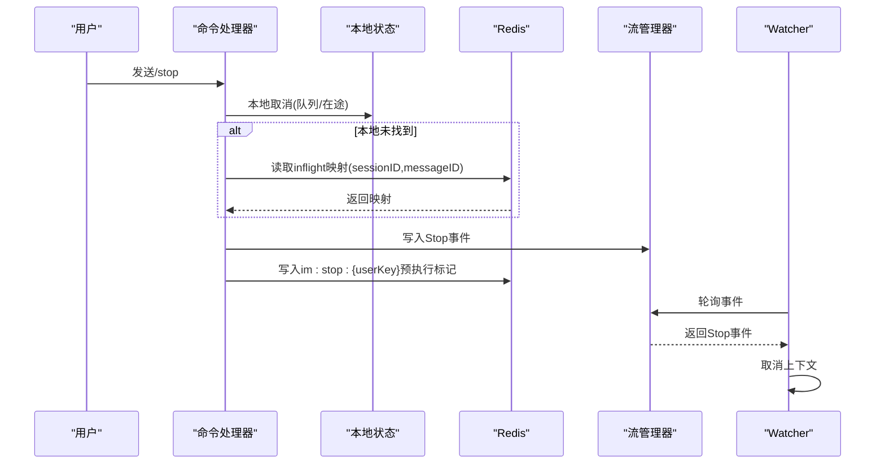
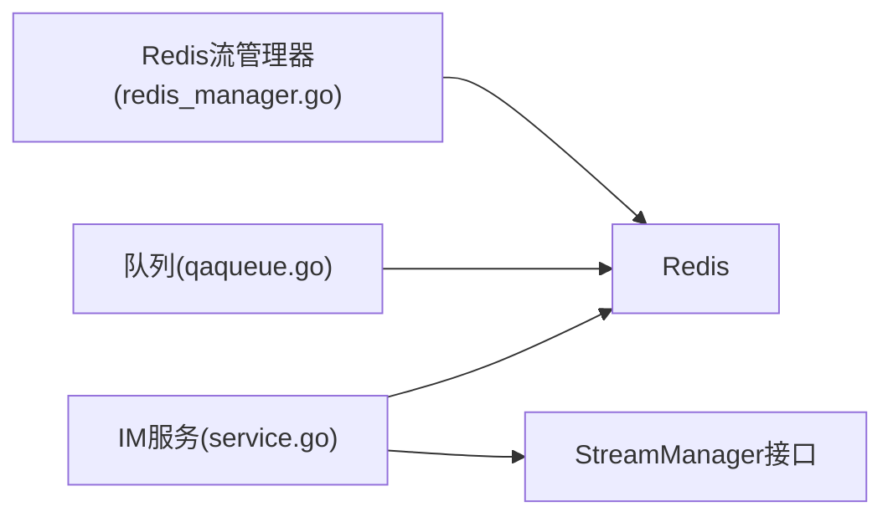

# 多实例协调机制

<cite>
**本文档引用的文件**
- [service.go](file://internal/im/service.go)
- [qaqueue.go](file://internal/im/qaqueue.go)
- [redis_manager.go](file://internal/stream/redis_manager.go)
- [config.go](file://internal/config/config.go)
- [redis.yaml](file://helm/templates/redis.yaml)
- [app.yaml](file://helm/templates/app.yaml)
- [debug.go](file://internal/utils/debug.go)
</cite>

## 目录
1. [简介](#简介)
2. [项目结构](#项目结构)
3. [核心组件](#核心组件)
4. [架构总览](#架构总览)
5. [详细组件分析](#详细组件分析)
6. [依赖关系分析](#依赖关系分析)
7. [性能考虑](#性能考虑)
8. [故障排查指南](#故障排查指南)
9. [结论](#结论)
10. [附录](#附录)

## 简介
本文件系统性阐述WeKnora的多实例协调机制，涵盖WebSocket领导者选举、跨实例停止信号传递、全局并发控制等关键能力。文档重点说明Redis键空间设计、Lua脚本原子操作与实例标识管理，解释领导者续期循环、重试机制与故障转移策略；并结合流管理器集成，完整呈现跨实例停止标记、在途请求映射与队列并发控制的工作原理。最后提供多实例部署最佳实践、性能调优与故障排查指南，并对比单实例与多实例模式的差异与选择策略。

## 项目结构
WeKnora的多实例协调主要分布在以下模块：
- IM服务层：负责通道启动、领导者选举、停止信号处理与队列执行
- 队列与并发控制：基于Redis的全局并发门禁与每用户队列计数
- 流管理器：基于Redis的事件流，支持跨实例停止检测
- 配置与部署：通过配置项启用全局并发限制，通过Helm模板部署Redis

**图表来源**
- [service.go:281-350](file://internal/im/service.go#L281-L350)
- [qaqueue.go:101-114](file://internal/im/qaqueue.go#L101-L114)
- [redis_manager.go:14-50](file://internal/stream/redis_manager.go#L14-L50)

**章节来源**
- [service.go:281-350](file://internal/im/service.go#L281-L350)
- [qaqueue.go:101-114](file://internal/im/qaqueue.go#L101-L114)
- [redis_manager.go:14-50](file://internal/stream/redis_manager.go#L14-L50)

## 核心组件
- WebSocket领导者选举与续期：通过Redis SetNX实现互斥锁，配合Lua脚本进行条件删除与续期，保障同一时刻仅有一个实例维持WebSocket/长轮询连接。
- 全局并发控制：通过Redis INCR/DECR实现跨实例的全局活跃工作线程计数，确保下游LLM资源不被过度占用。
- 跨实例停止信号：结合Redis预执行标记与流管理器事件，实现任意实例发起的停止命令能被所有实例感知并取消在途请求。
- 实例标识管理：每个服务实例生成唯一instanceID，用于领导者选举比较、速率限制成员去重与全局计数隔离。

**章节来源**
- [service.go:524-583](file://internal/im/service.go#L524-L583)
- [qaqueue.go:298-349](file://internal/im/qaqueue.go#L298-L349)
- [service.go:628-727](file://internal/im/service.go#L628-L727)

## 架构总览
下图展示了多实例协调的关键交互：IM服务在启动通道时尝试获取领导者锁；成功后启动适配器并定期续期；失败则进入重试循环；全局并发通过Redis门禁控制；停止命令通过Redis预执行标记与流管理器事件传播至所有实例。

**图表来源**
- [service.go:440-451](file://internal/im/service.go#L440-L451)
- [service.go:556-583](file://internal/im/service.go#L556-L583)
- [service.go:587-617](file://internal/im/service.go#L587-L617)
- [service.go:678-727](file://internal/im/service.go#L678-L727)

## 详细组件分析

### WebSocket领导者选举与续期
- 领导者选举：使用Redis SetNX在键“im:ws:leader:<channelID>”上写入本实例ID，TTL为15秒；若失败则进入重试循环。
- 续期循环：每5秒检查一次，若仍持有锁则PEXPIRE延长TTL；若检测到丢失或Redis错误，则停止适配器并释放锁。
- 重试机制：非领导者实例每10秒尝试一次，若通道已由其他实例接管则不再重试。
- 长轮询特殊处理：停止长轮询通道时不立即释放锁，而是等待TTL自然过期，避免新旧实例同时写入造成短暂双写窗口。

**图表来源**
- [service.go:524-583](file://internal/im/service.go#L524-L583)
- [service.go:587-617](file://internal/im/service.go#L587-L617)

**章节来源**
- [service.go:524-583](file://internal/im/service.go#L524-L583)
- [service.go:587-617](file://internal/im/service.go#L587-L617)

### 全局并发控制与队列限流
- 全局并发门禁：通过Lua脚本原子地INCR全局活跃工作线程计数，超过阈值则拒绝；TTL为5分钟作为安全网。
- 每用户全局计数：Enqueue前通过Redis INCR对userKey进行全局计数，超过阈值则拒绝；TTL为5分钟。
- 工作线程行为：当达到全局上限时，worker以500ms间隔重试直至获得槽位或上下文取消。
- 单实例回退：当Redis不可用时，仅使用本地队列与每用户计数，保证基本限流能力。

**图表来源**
- [qaqueue.go:134-175](file://internal/im/qaqueue.go#L134-L175)
- [qaqueue.go:298-349](file://internal/im/qaqueue.go#L298-L349)
- [qaqueue.go:356-381](file://internal/im/qaqueue.go#L356-L381)

**章节来源**
- [qaqueue.go:134-175](file://internal/im/qaqueue.go#L134-L175)
- [qaqueue.go:298-349](file://internal/im/qaqueue.go#L298-L349)
- [qaqueue.go:356-381](file://internal/im/qaqueue.go#L356-L381)

### 跨实例停止信号传递与流管理器集成
- 预执行标记：/stop在请求尚未创建助手消息时，写入Redis键“im:stop:{userKey}”，TTL为30秒，用于快速检测并取消。
- 在途映射：一旦创建助手消息，将(sessionID, messageID)映射写入Redis键“im:inflight:{userKey}”，TTL与QA超时一致，供跨实例查询。
- 流管理器事件：写入Stop事件到StreamManager，所有实例的watcher goroutine周期性轮询并取消对应上下文。
- 命令处理：/stop先尝试本地取消（队列移除或inflight取消），再写入跨实例停止事件，最后写入Redis预执行标记。

**图表来源**
- [service.go:1102-1145](file://internal/im/service.go#L1102-L1145)
- [service.go:628-727](file://internal/im/service.go#L628-L727)

**章节来源**
- [service.go:1102-1145](file://internal/im/service.go#L1102-L1145)
- [service.go:628-727](file://internal/im/service.go#L628-L727)

### Redis键空间设计与Lua脚本原子操作
- 键空间前缀统一定义于常量区，便于集中管理与避免散落字符串：
  - im:ws:leader: 通道领导者锁
  - im:dedup: 消息去重
  - im:stop: 预执行停止标记
  - im:inflight: 在途请求映射
  - im:queue:user: 全局每用户队列计数
  - im:ratelimit: 速率限制滑动窗口
  - im:global:active: 全局活跃工作线程计数
- Lua脚本确保原子性：
  - 领导者续期：仅当GET==instanceID时PEXPIRE
  - 领导者释放：仅当GET==instanceID时DEL
  - 全局门禁：INCR后若超限则DECR回滚
  - 速率限制：ZREM过期元素后ZADD新元素并设置TTL

**章节来源**
- [service.go:72-80](file://internal/im/service.go#L72-L80)
- [service.go:545-551](file://internal/im/service.go#L545-L551)
- [service.go:565-571](file://internal/im/service.go#L565-L571)
- [qaqueue.go:298-310](file://internal/im/qaqueue.go#L298-L310)

### 实例标识管理与配置
- 实例标识：服务启动时生成UUID作为instanceID，用于领导者选举比较、速率限制成员去重与全局计数隔离。
- 配置项：
  - im.global_max_workers：全局最大并发数（0表示不限制）
  - im.workers：每实例并发工作线程数
  - im.max_queue_size：每实例队列大小
  - im.max_per_user：每用户全局队列上限
  - im.rate_limit_window/max：每用户速率限制窗口与次数
- 部署：Helm模板默认启用Redis并注入环境变量，支持Redis认证与键前缀配置。

**章节来源**
- [service.go:305](file://internal/im/service.go#L305)
- [config.go:45-67](file://internal/config/config.go#L45-L67)
- [app.yaml:77-95](file://helm/templates/app.yaml#L77-L95)

## 依赖关系分析
- IM服务依赖Redis进行领导者选举、去重、速率限制、全局并发与停止标记；依赖流管理器进行跨实例停止检测。
- 队列组件依赖Redis进行全局并发门禁与每用户计数；在Redis不可用时回退到本地限流。
- 流管理器实现基于Redis列表，提供AppendEvent与GetEvents接口，支持TTL自动清理。

**图表来源**
- [service.go:291-321](file://internal/im/service.go#L291-L321)
- [qaqueue.go:109](file://internal/im/qaqueue.go#L109)
- [redis_manager.go:14-50](file://internal/stream/redis_manager.go#L14-L50)

**章节来源**
- [service.go:291-321](file://internal/im/service.go#L291-L321)
- [qaqueue.go:109](file://internal/im/qaqueue.go#L109)
- [redis_manager.go:14-50](file://internal/stream/redis_manager.go#L14-L50)

## 性能考虑
- 领导者锁TTL与续期间隔平衡：TTL过短导致频繁续期开销，过长导致故障恢复慢；当前配置为15秒TTL、5秒续期，适合大多数场景。
- 全局并发门禁重试间隔：500ms在延迟与CPU占用间折中；可根据实例数量与下游SLA调整。
- 速率限制滑动窗口：Redis ZSET清理过期元素，窗口越大越平滑但内存占用越高；建议按QPS与峰值合理设置。
- 队列深度与每用户上限：过深队列增加内存与延迟，过小导致丢弃率上升；需结合业务峰值与下游能力调优。
- Redis连接与命令批量化：尽量减少网络往返，使用Pipeline与Lua脚本合并操作。

[本节为通用指导，无需特定文件引用]

## 故障排查指南
- 领导者丢失与通道中断：
  - 现象：日志显示“Lost leadership for channel …, stopping adapter”
  - 排查：检查Redis连通性、网络抖动、实例负载过高导致续期延迟
  - 处理：确认Redis可用后，重试循环会自动接管；必要时缩短wsLeaderRetryInterval
- 全局并发阻塞：
  - 现象：工作线程长时间等待，队列深度持续增长
  - 排查：检查global_max_workers配置、Redis门禁计数是否异常递增
  - 处理：提升global_max_workers或扩容实例；使用调试工具清理过期计数
- 停止命令无效：
  - 现象：/stop未生效
  - 排查：确认Redis预执行标记与inflight映射存在；检查流管理器事件写入与轮询
  - 处理：手动清理过期键；验证流管理器TTL与轮询间隔
- 调试工具：
  - 清理过期任务键：CleanupStaleRunningTasks
  - 检查任务状态：CheckRunningTaskStatus

**章节来源**
- [service.go:574-578](file://internal/im/service.go#L574-L578)
- [debug.go:13-90](file://internal/utils/debug.go#L13-L90)

## 结论
WeKnora通过Redis与Lua脚本实现了高可靠的多实例协调：领导者选举确保通道唯一性，全局并发门禁保护下游资源，跨实例停止信号通过预执行标记与流管理器事件实现一致的取消语义。合理的键空间设计与实例标识管理使得多实例部署具备良好的可扩展性与容错能力。结合配置项与Helm模板，用户可在不同规模与可靠性需求下灵活选择单实例或多实例模式。

[本节为总结，无需特定文件引用]

## 附录

### 单实例 vs 多实例模式差异与选择策略
- 单实例模式
  - 特点：无Redis依赖，领导者选举与全局并发控制回退到本地；适合开发测试与低并发场景
  - 优势：部署简单、运维成本低
  - 风险：无法水平扩展、单点故障风险高
- 多实例模式
  - 特点：启用Redis，实现领导者选举、全局并发控制、跨实例停止检测
  - 优势：高可用、可水平扩展、资源利用更均衡
  - 风险：运维复杂度提升，需关注Redis可用性与网络稳定性
- 选择策略
  - 业务峰值较低且对可用性要求不高：优先单实例
  - 需要高可用与弹性伸缩：采用多实例并配置合理的global_max_workers与队列参数
  - 混合策略：热点通道使用多实例，冷门通道保留单实例

**章节来源**
- [service.go:337-347](file://internal/im/service.go#L337-L347)
- [config.go:45-67](file://internal/config/config.go#L45-L67)