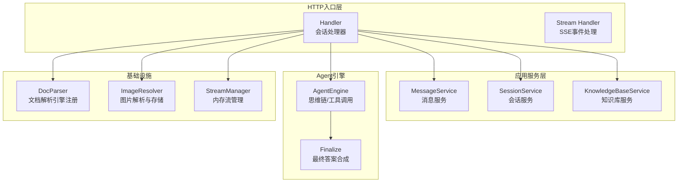
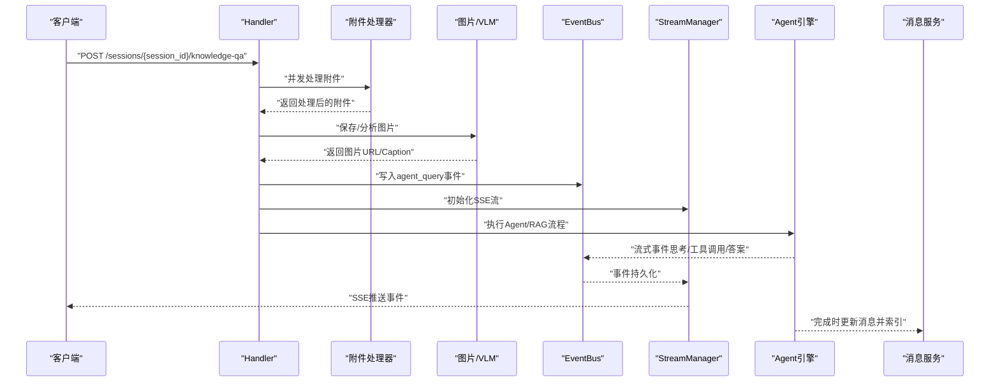
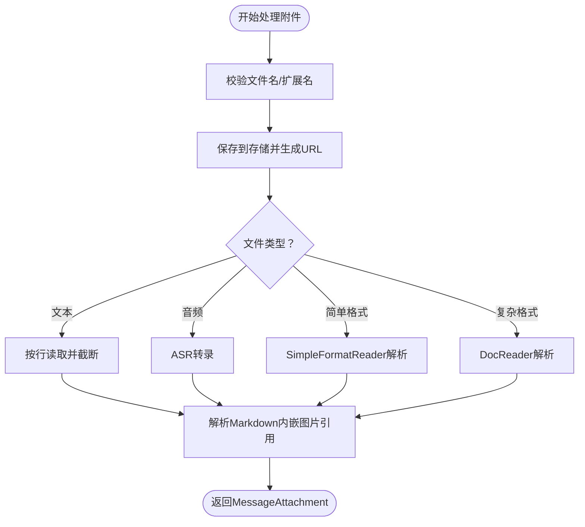
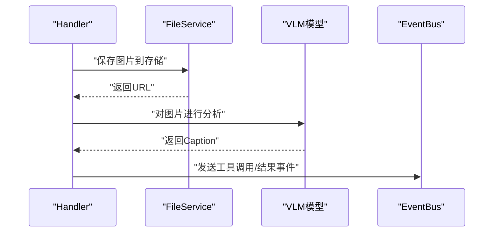
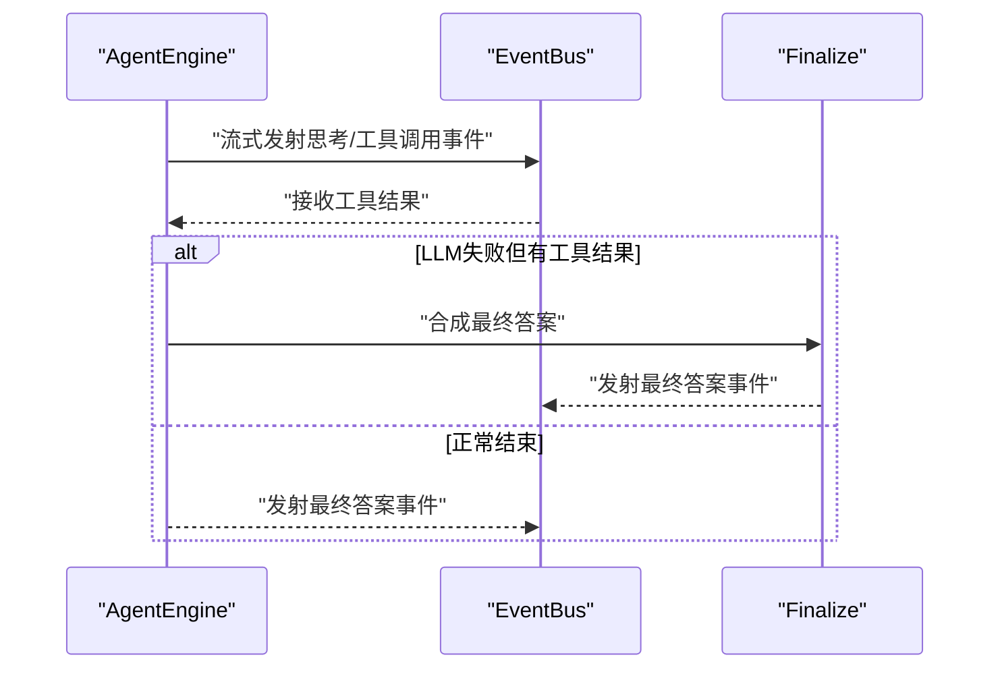
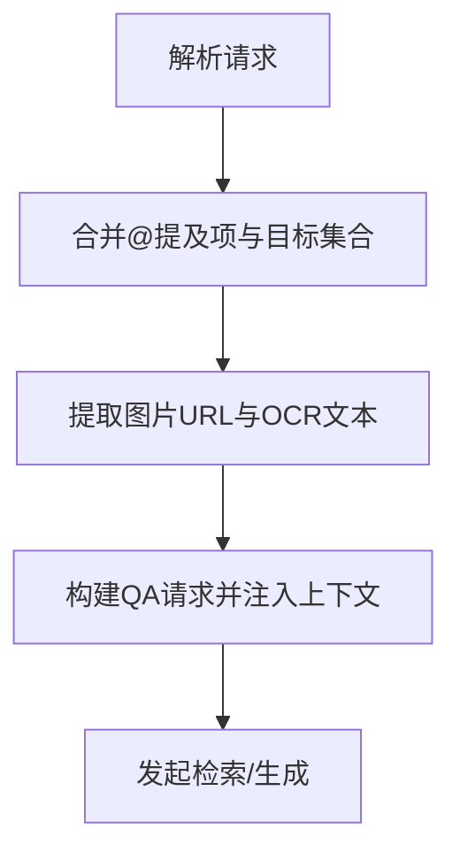
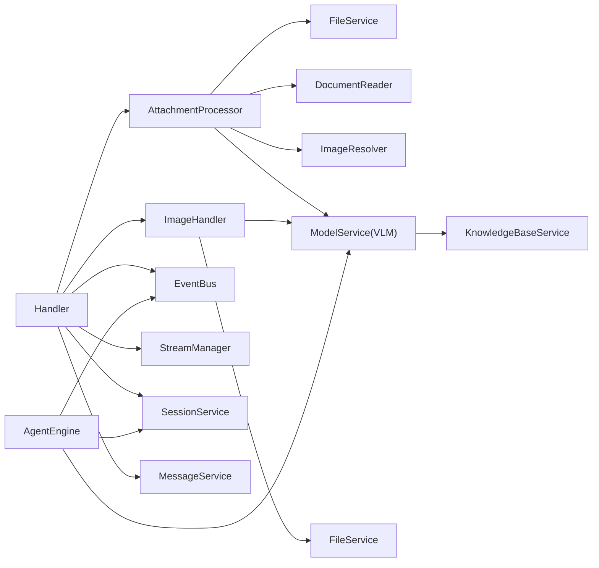

# 消息路由与处理

<cite>
**本文档引用的文件**
- [attachment_processor.go](file://internal/handler/session/attachment_processor.go)
- [image_upload.go](file://internal/handler/session/image_upload.go)
- [qa.go](file://internal/handler/session/qa.go)
- [stream.go](file://internal/handler/session/stream.go)
- [handler.go](file://internal/handler/session/handler.go)
- [helpers.go](file://internal/handler/session/helpers.go)
- [message.go](file://internal/application/service/message.go)
- [think.go](file://internal/agent/think.go)
- [finalize.go](file://internal/agent/finalize.go)
- [engine_registry.go](file://internal/infrastructure/docparser/engine_registry.go)
- [image_resolver.go](file://internal/infrastructure/docparser/image_resolver.go)
- [chat_pipeline.go](file://internal/application/service/chat_pipeline/chat_pipeline.go)
- [memory_manager.go](file://internal/stream/memory_manager.go)
- [service.go](file://internal/im/service.go)
</cite>

## 目录
1. [简介](#简介)
2. [项目结构](#项目结构)
3. [核心组件](#核心组件)
4. [架构总览](#架构总览)
5. [详细组件分析](#详细组件分析)
6. [依赖关系分析](#依赖关系分析)
7. [性能考虑](#性能考虑)
8. [故障排查指南](#故障排查指南)
9. [结论](#结论)
10. [附录](#附录)

## 简介
本文件面向WeKnora的消息路由与处理机制，系统性阐述从消息接收、附件与图片处理、思维链与反幻觉策略、引用回复上下文提取与注入、到并发与去重、错误恢复与性能优化的完整流程。文档同时提供扩展点与自定义处理器开发指南，帮助开发者在现有框架上进行二次开发。

## 项目结构
WeKnora采用分层架构：HTTP入口层（Handler）、业务服务层（Service）、应用服务层（Application Service）、基础设施层（Infrastructure）。消息路由主要集中在会话处理模块（internal/handler/session），结合应用服务（internal/application/service）完成消息持久化、索引与检索，以及Agent引擎的思维链与最终答案生成。

**图表来源**
- [handler.go:16-64](file://internal/handler/session/handler.go#L16-L64)
- [message.go:20-49](file://internal/application/service/message.go#L20-L49)
- [think.go:92-230](file://internal/agent/think.go#L92-L230)
- [finalize.go:15-126](file://internal/agent/finalize.go#L15-L126)
- [engine_registry.go:19-33](file://internal/infrastructure/docparser/engine_registry.go#L19-L33)
- [image_resolver.go:60-80](file://internal/infrastructure/docparser/image_resolver.go#L60-L80)
- [memory_manager.go:18-30](file://internal/stream/memory_manager.go#L18-L30)

**章节来源**
- [handler.go:16-64](file://internal/handler/session/handler.go#L16-L64)
- [message.go:20-49](file://internal/application/service/message.go#L20-L49)

## 核心组件
- 会话处理器（Handler）：负责HTTP请求解析、并发附件处理、图片上传与VLM分析、SSE事件推送、停止与继续流控制。
- 附件处理器（AttachmentProcessor）：统一处理各类文件类型（文本、文档、音频、图片等），提取内容并进行行数截断。
- 图片上传与VLM分析：支持data URI解码、大小限制、存储路径命名、VLM模型分析与Caption生成。
- 消息服务（MessageService）：负责消息创建、更新、索引到聊天历史知识库、清理与统计。
- Agent引擎：思维链（Chain of Thought）流式生成、工具调用、最终答案合成与完成事件。
- 文档解析与图片解析：本地/远程引擎注册、简单格式解析、图片数据URI/远程图片解析与存储。
- 流管理（StreamManager）：内存/Redis分布式事件存储，支持SSE事件拉取与继续流。

**章节来源**
- [attachment_processor.go:27-49](file://internal/handler/session/attachment_processor.go#L27-L49)
- [image_upload.go:21-59](file://internal/handler/session/image_upload.go#L21-L59)
- [message.go:20-49](file://internal/application/service/message.go#L20-L49)
- [think.go:92-230](file://internal/agent/think.go#L92-L230)
- [finalize.go:15-126](file://internal/agent/finalize.go#L15-L126)
- [engine_registry.go:19-33](file://internal/infrastructure/docparser/engine_registry.go#L19-L33)
- [image_resolver.go:60-80](file://internal/infrastructure/docparser/image_resolver.go#L60-L80)
- [memory_manager.go:18-30](file://internal/stream/memory_manager.go#L18-L30)

## 架构总览
消息从HTTP入口进入后，经过Handler解析与校验，分别触发附件与图片处理、Agent引擎或RAG流程，期间通过EventBus与StreamManager进行事件驱动与SSE推送。最终答案生成后写入消息并异步索引到聊天历史知识库。

**图表来源**
- [qa.go:463-658](file://internal/handler/session/qa.go#L463-L658)
- [stream.go:296-440](file://internal/handler/session/stream.go#L296-L440)
- [think.go:92-230](file://internal/agent/think.go#L92-L230)
- [finalize.go:15-126](file://internal/agent/finalize.go#L15-L126)
- [message.go:349-390](file://internal/application/service/message.go#L349-L390)

## 详细组件分析

### 附件处理器（AttachmentProcessor）
- 功能职责
  - 文件名安全校验与扩展名识别
  - 保存到存储并生成URL
  - 多格式内容提取：文本按行截断、复杂文档通过DocParser、音频通过ASR、简单格式（Markdown/CSV/JSON/图片）直接解析
  - 图片内联引用解析与替换为存储URL
- 关键策略
  - 行数截断：默认最多保留固定行数，超限标记截断
  - 错误非致命：单个文件失败不影响整体流程，记录警告并保留元数据
  - 支持多种编码：Base64多种变体自动识别
- 复杂度与性能
  - 文本逐行扫描，时间复杂度O(N)，空间O(N)
  - 并发处理多个附件时，使用WaitGroup与错误通道聚合错误
- 安全性
  - 文件名校验防止路径穿越
  - 图片解析过滤小图标/装饰性图片

**图表来源**
- [attachment_processor.go:51-124](file://internal/handler/session/attachment_processor.go#L51-L124)
- [attachment_processor.go:126-272](file://internal/handler/session/attachment_processor.go#L126-L272)
- [image_resolver.go:72-164](file://internal/infrastructure/docparser/image_resolver.go#L72-L164)

**章节来源**
- [attachment_processor.go:27-124](file://internal/handler/session/attachment_processor.go#L27-L124)
- [attachment_processor.go:126-272](file://internal/handler/session/attachment_processor.go#L126-L272)
- [image_resolver.go:60-164](file://internal/infrastructure/docparser/image_resolver.go#L60-L164)

### 图片上传与VLM分析
- 图片上传
  - 限制数量与大小，data URI解码，UUID命名，存储到指定提供方
  - 支持按代理配置选择不同存储提供方
- VLM分析
  - 纯聊天路径：在SSE建立后异步分析，减少首屏延迟
  - RAG路径：由管道重写阶段统一处理
  - 生成针对用户问题的提示词，提升相关性
- 安全与容错
  - SSRF防护：仅允许受控的HTTP下载与URL白名单
  - 失败降级：VLM不可用时跳过分析，保留占位信息

**图表来源**
- [image_upload.go:21-93](file://internal/handler/session/image_upload.go#L21-L93)
- [image_upload.go:95-141](file://internal/handler/session/image_upload.go#L95-L141)

**章节来源**
- [image_upload.go:21-93](file://internal/handler/session/image_upload.go#L21-L93)
- [image_upload.go:95-141](file://internal/handler/session/image_upload.go#L95-L141)

### 思维链与反幻觉处理
- 思维链（Chain of Thought）
  - 通过专用工具流式输出思考内容，避免直接在“thought”中暴露工具名称
  - 支持并行工具调用，事件ID与迭代号用于前端渲染与状态管理
  - 最终答案通过独立工具生成，确保答案与思考分离
- 反幻觉策略
  - 对聊天历史知识库索引时，剥离<think>块，避免中间推理污染检索
  - 最终答案合成时基于实际工具结果，要求明确引用来源
- 错误恢复
  - LLM流式调用失败时，尝试有限次重试
  - 若仍失败且存在历史工具结果，进行优雅降级：基于已有工具结果合成最终答案

**图表来源**
- [think.go:92-230](file://internal/agent/think.go#L92-L230)
- [finalize.go:15-126](file://internal/agent/finalize.go#L15-L126)
- [message.go:349-390](file://internal/application/service/message.go#L349-L390)

**章节来源**
- [think.go:92-230](file://internal/agent/think.go#L92-L230)
- [finalize.go:15-126](file://internal/agent/finalize.go#L15-L126)
- [message.go:349-390](file://internal/application/service/message.go#L349-L390)

### 引用回复上下文的提取与注入
- 提取
  - 从请求中合并@提及项（知识库/文件）与显式传入的目标集合，去重后作为检索范围
  - 从图片中抽取OCR Caption，拼接为LLM可消费的上下文
- 注入
  - 将图片URL与OCR文本注入到QA请求中，供检索与生成阶段使用
  - 通过事件总线与SSE流向前端实时反馈进度

**图表来源**
- [qa.go:277-315](file://internal/handler/session/qa.go#L277-L315)
- [helpers.go:31-55](file://internal/handler/session/helpers.go#L31-L55)

**章节来源**
- [qa.go:277-315](file://internal/handler/session/qa.go#L277-L315)
- [helpers.go:31-55](file://internal/handler/session/helpers.go#L31-L55)

### 消息去重机制、并发处理与错误恢复
- 去重
  - 多实例：Redis SetNX跨实例去重，失败时（fail-closed）丢弃以避免重复处理
  - 单实例：本地sync.Map去重
- 并发
  - 附件处理使用goroutine+WaitGroup+错误通道，提升吞吐
  - 图片VLM分析在SSE建立后异步执行，避免阻塞首屏
- 错误恢复
  - SSE连接断开自动重连，从上次偏移继续拉取事件
  - 用户主动停止：写入停止事件，取消上下文并完成消息更新
  - LLM调用失败：重试+优雅降级（基于历史工具结果合成答案）

**章节来源**
- [service.go:758-782](file://internal/im/service.go#L758-L782)
- [qa.go:162-197](file://internal/handler/session/qa.go#L162-L197)
- [stream.go:178-294](file://internal/handler/session/stream.go#L178-L294)
- [think.go:282-323](file://internal/agent/think.go#L282-L323)

### 消息路由的性能优化与监控
- 性能优化
  - 附件并发处理与行数截断，降低LLM上下文长度
  - 图片VLM异步化，减少首屏等待
  - 聊天历史知识库索引前剥离<think>块，提升检索质量
  - SSE事件按需拉取，避免一次性推送大量事件
- 监控
  - 事件计数与首次块耗时统计，辅助识别非流式回退
  - Pipeline日志记录思维链/最终答案阶段的耗时与工具调用数
  - 聊天历史KB统计接口，便于容量规划

**章节来源**
- [think.go:24-90](file://internal/agent/think.go#L24-L90)
- [message.go:424-459](file://internal/application/service/message.go#L424-L459)

### 扩展点与自定义处理器开发指南
- 自定义文档解析引擎
  - 实现EngineRegistration接口，注册到本地引擎表
  - 通过ListAllEngines合并本地与远程引擎能力
- 自定义图片解析
  - 基于ImageResolver扩展支持新的图片来源（如云存储直链）
- 自定义附件处理器
  - 在现有附件处理流程中插入新类型支持，保持错误非致命与截断策略一致
- 自定义Agent思维链
  - 通过插件化事件管理器（chat_pipeline）注册事件监听器，扩展特定阶段的处理逻辑

**章节来源**
- [engine_registry.go:9-33](file://internal/infrastructure/docparser/engine_registry.go#L9-L33)
- [chat_pipeline.go:9-78](file://internal/application/service/chat_pipeline/chat_pipeline.go#L9-L78)

## 依赖关系分析

**图表来源**
- [attachment_processor.go:27-49](file://internal/handler/session/attachment_processor.go#L27-L49)
- [image_upload.go:21-69](file://internal/handler/session/image_upload.go#L21-L69)
- [handler.go:16-64](file://internal/handler/session/handler.go#L16-L64)
- [think.go:92-230](file://internal/agent/think.go#L92-L230)

**章节来源**
- [attachment_processor.go:27-49](file://internal/handler/session/attachment_processor.go#L27-L49)
- [image_upload.go:21-69](file://internal/handler/session/image_upload.go#L21-L69)
- [handler.go:16-64](file://internal/handler/session/handler.go#L16-L64)

## 性能考虑
- I/O密集型优化
  - 附件与图片处理并发化，避免阻塞主线程
  - 图片VLM分析异步化，减少首屏等待
- 上下文长度控制
  - 文本行数截断与<think>块剥离，降低Token消耗
- 缓存与索引
  - 聊天历史知识库异步索引，避免阻塞响应
- 流式传输
  - SSE事件按序拉取，前端增量渲染，降低内存压力

## 故障排查指南
- 附件处理失败
  - 检查文件名是否包含非法字符或扩展名不受支持
  - 查看日志中的错误详情，确认是否为非致命错误
- 图片上传失败
  - 确认大小限制与数量限制
  - 检查VLM模型配置与可用性
- SSE流中断
  - 使用继续流接口重新拉取事件
  - 检查StreamManager状态与EventBus订阅情况
- 去重导致消息丢失
  - 多实例模式下检查Redis可用性
  - 单实例模式下确认本地去重表状态

**章节来源**
- [attachment_processor.go:61-124](file://internal/handler/session/attachment_processor.go#L61-L124)
- [image_upload.go:42-58](file://internal/handler/session/image_upload.go#L42-L58)
- [stream.go:31-176](file://internal/handler/session/stream.go#L31-L176)
- [service.go:758-782](file://internal/im/service.go#L758-L782)

## 结论
WeKnora的消息路由与处理机制通过Handler统一入口、AttachmentProcessor与ImageResolver标准化处理、Agent引擎的思维链与最终答案合成、以及EventBus与StreamManager的事件驱动，实现了高并发、可扩展、可观测的消息处理流水线。结合去重、并发与错误恢复策略，系统在保证稳定性的同时兼顾性能与用户体验。开发者可在现有扩展点上快速定制文档解析、图片处理与Agent行为，满足多样化的业务需求。

## 附录
- 事件类型与SSE响应
  - agent_query、tool_call、tool_result、thinking、answer、complete等
- 聊天历史知识库
  - 索引策略与统计接口，支持混合检索与重排

**章节来源**
- [helpers.go:82-140](file://internal/handler/session/helpers.go#L82-L140)
- [message.go:424-459](file://internal/application/service/message.go#L424-L459)