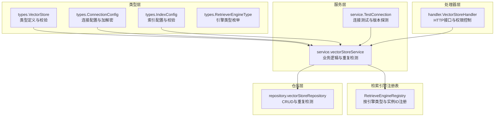
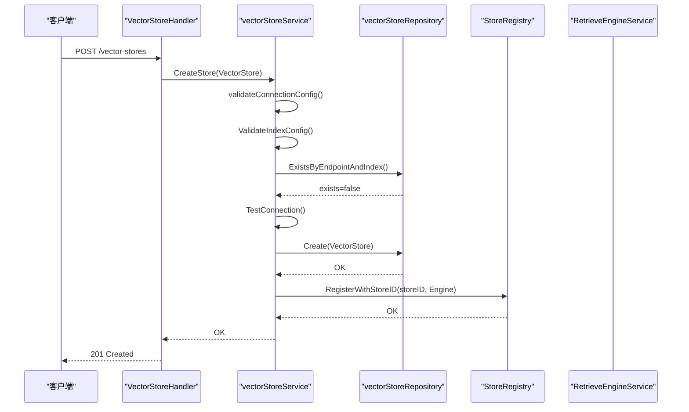
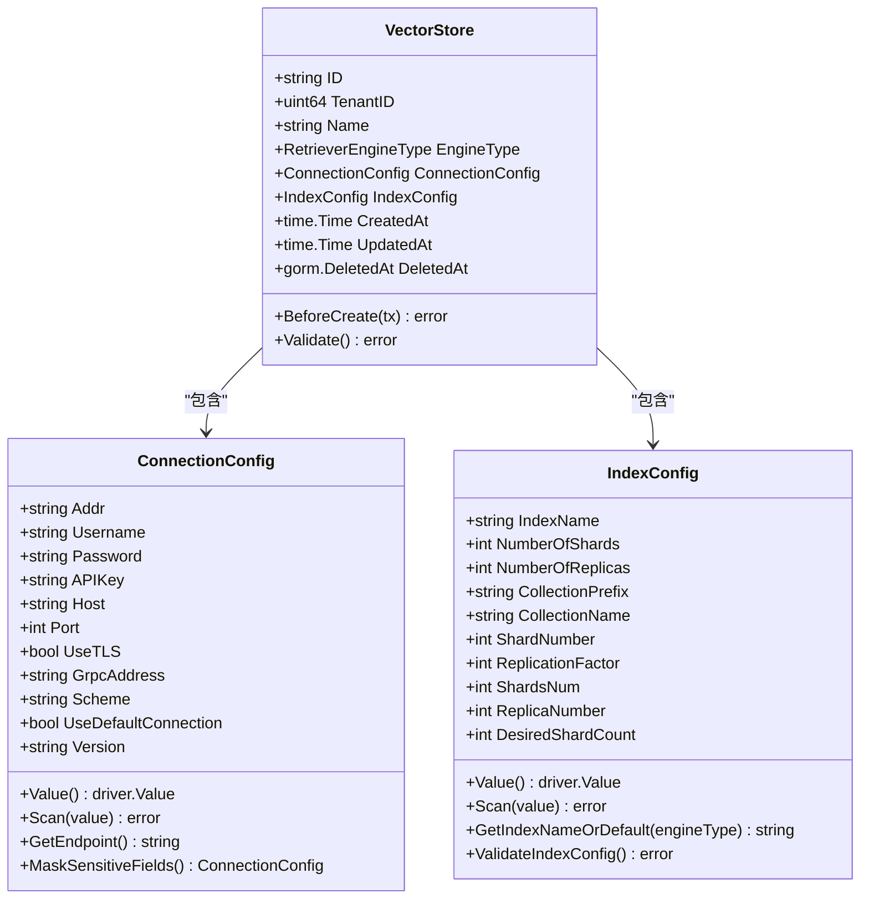
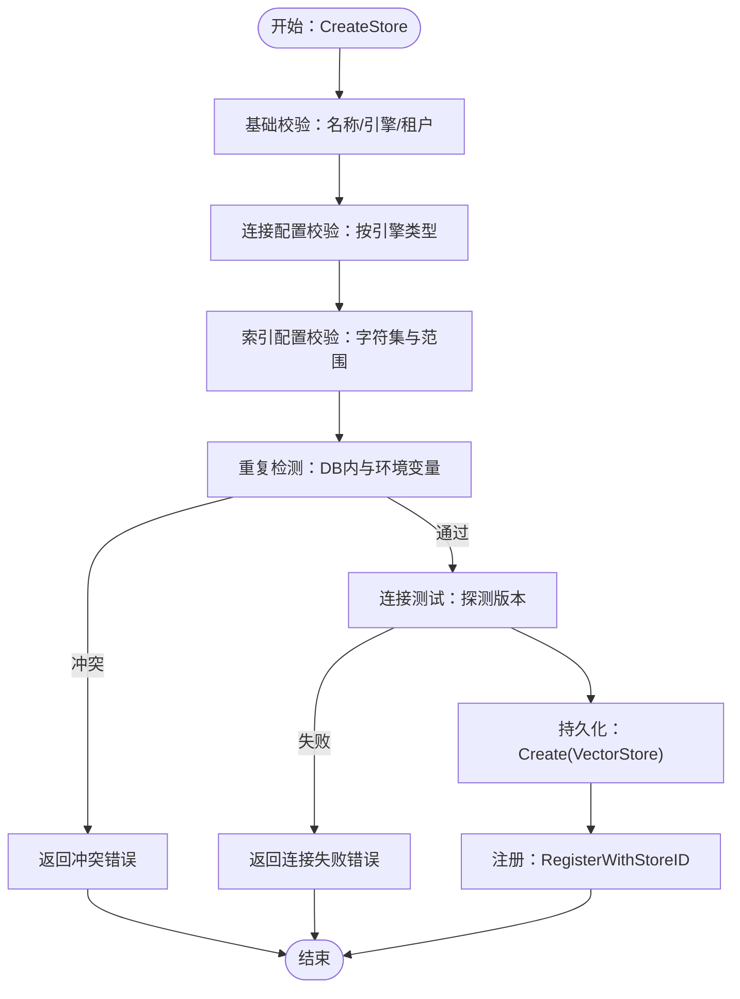
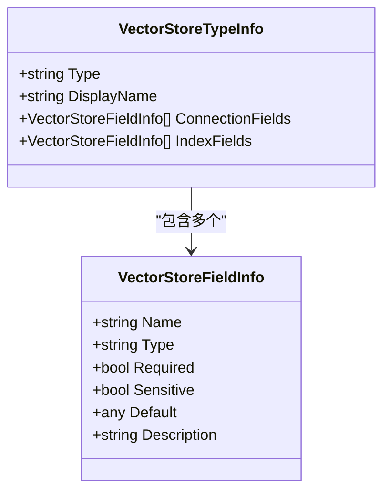
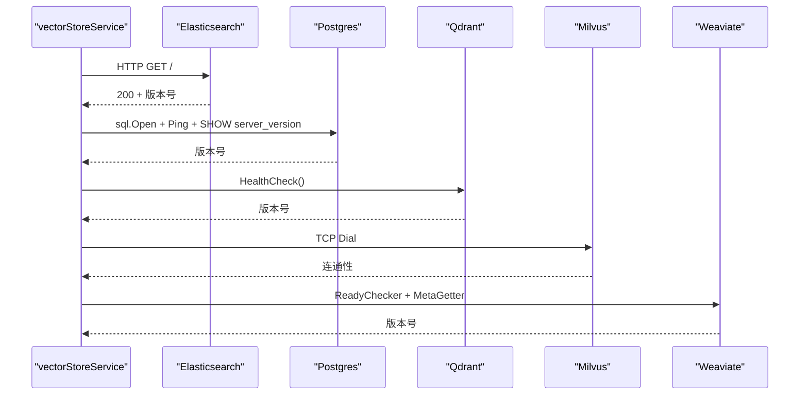
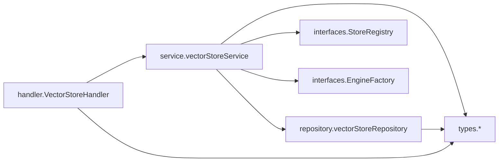

# 向量存储抽象接口

<cite>
**本文档引用的文件**
- [internal/types/vectorstore.go](file://internal/types/vectorstore.go)
- [internal/types/interfaces/vectorstore.go](file://internal/types/interfaces/vectorstore.go)
- [internal/application/service/vectorstore.go](file://internal/application/service/vectorstore.go)
- [internal/application/repository/vectorstore.go](file://internal/application/repository/vectorstore.go)
- [internal/handler/vectorstore.go](file://internal/handler/vectorstore.go)
- [internal/application/service/vectorstore_healthcheck.go](file://internal/application/service/vectorstore_healthcheck.go)
- [internal/types/retriever.go](file://internal/types/retriever.go)
- [frontend/src/api/vector-store.ts](file://frontend/src/api/vector-store.ts)
- [internal/application/service/retriever/registry.go](file://internal/application/service/retriever/registry.go)
</cite>

## 目录
1. [简介](#简介)
2. [项目结构](#项目结构)
3. [核心组件](#核心组件)
4. [架构总览](#架构总览)
5. [详细组件分析](#详细组件分析)
6. [依赖关系分析](#依赖关系分析)
7. [性能考量](#性能考量)
8. [故障排查指南](#故障排查指南)
9. [结论](#结论)
10. [附录](#附录)

## 简介
本文件系统性阐述WeKnora的向量存储抽象接口设计与实现，覆盖以下关键主题：
- 核心数据模型：租户隔离、多后端支持、配置管理
- 配置模型：ConnectionConfig与IndexConfig的字段定义、数据加密机制与验证规则
- 生命周期管理：创建、更新、删除、查询与连接测试
- 类型系统：引擎类型枚举与配置元数据
- 环境变量驱动的虚拟存储实现与默认连接机制
- 在知识库检索中的集成方式与性能优化策略
- 最佳实践与安全考虑

## 项目结构
向量存储抽象接口由类型层、服务层、仓库层与处理器层协同实现，配合检索引擎注册表完成运行时装配。

**图表来源**
- [internal/types/vectorstore.go:30-50](file://internal/types/vectorstore.go#L30-L50)
- [internal/application/service/vectorstore.go:36-99](file://internal/application/service/vectorstore.go#L36-L99)
- [internal/application/repository/vectorstore.go:22-101](file://internal/application/repository/vectorstore.go#L22-L101)
- [internal/handler/vectorstore.go:94-128](file://internal/handler/vectorstore.go#L94-L128)
- [internal/application/service/retriever/registry.go:17-29](file://internal/application/service/retriever/registry.go#L17-L29)

**章节来源**
- [internal/types/vectorstore.go:30-50](file://internal/types/vectorstore.go#L30-L50)
- [internal/application/service/vectorstore.go:36-99](file://internal/application/service/vectorstore.go#L36-L99)
- [internal/application/repository/vectorstore.go:22-101](file://internal/application/repository/vectorstore.go#L22-L101)
- [internal/handler/vectorstore.go:94-128](file://internal/handler/vectorstore.go#L94-L128)
- [internal/application/service/retriever/registry.go:17-29](file://internal/application/service/retriever/registry.go#L17-L29)

## 核心组件
- VectorStore：向量数据库实例的完整配置，包含租户ID、名称、引擎类型、连接配置与索引配置，以及GORM钩子与校验逻辑。
- ConnectionConfig：驱动特定的连接参数，敏感字段（密码、API Key）采用AES-GCM加密持久化；提供标准化端点解析与敏感字段掩码。
- IndexConfig：索引/集合配置，支持各引擎特有字段与可选的规模参数；提供默认值推导与严格校验。
- 引擎类型枚举：统一的引擎类型标识，限定可注册的向量存储类型。
- 服务接口：定义向量存储的业务能力边界，包括创建、更新、删除、连接测试与版本保存。
- 仓库接口：定义向量存储的CRUD与重复检测能力，确保同一租户下端点+索引唯一。
- 处理器接口：提供REST API端点，执行租户上下文校验、所有权校验与只读保护。

**章节来源**
- [internal/types/vectorstore.go:30-95](file://internal/types/vectorstore.go#L30-L95)
- [internal/types/vectorstore.go:101-197](file://internal/types/vectorstore.go#L101-L197)
- [internal/types/vectorstore.go:203-434](file://internal/types/vectorstore.go#L203-L434)
- [internal/types/interfaces/vectorstore.go:26-58](file://internal/types/interfaces/vectorstore.go#L26-L58)
- [internal/application/repository/vectorstore.go:22-101](file://internal/application/repository/vectorstore.go#L22-L101)
- [internal/handler/vectorstore.go:94-128](file://internal/handler/vectorstore.go#L94-L128)

## 架构总览
向量存储抽象接口通过“类型定义 + 服务编排 + 仓库持久化 + 处理器暴露”的分层设计，实现租户隔离、多后端支持与配置管理的统一入口。连接测试贯穿创建流程，确保引擎版本兼容性；注册表负责运行时装配，支持按引擎类型与实例ID两种维度。

**图表来源**
- [internal/handler/vectorstore.go:94-128](file://internal/handler/vectorstore.go#L94-L128)
- [internal/application/service/vectorstore.go:36-99](file://internal/application/service/vectorstore.go#L36-L99)
- [internal/application/repository/vectorstore.go:78-101](file://internal/application/repository/vectorstore.go#L78-L101)
- [internal/application/service/vectorstore_healthcheck.go:25-50](file://internal/application/service/vectorstore_healthcheck.go#L25-L50)

## 详细组件分析

### 数据模型与配置管理
- VectorStore
  - 字段：ID（UUID自动生成）、TenantID（租户隔离）、Name、EngineType（受控枚举）、ConnectionConfig、IndexConfig、时间戳。
  - 校验：名称、引擎类型有效性、租户ID必填。
  - GORM钩子：BeforeCreate自动生成ID。
- ConnectionConfig
  - 敏感字段：Password、APIKey，持久化前加密，加载后解密。
  - 标准化端点：Addr优先于Host:Port；特殊处理UseDefaultConnection。
  - 掩码输出：MaskSensitiveFields用于日志与响应脱敏。
- IndexConfig
  - 引擎特有字段：ES/OpenSearch的index_name、shards/replicas；Qdrant的collection_prefix与shard/replication_factor；Milvus的collection_name、shards_num、replica_number；Weaviate的collection_prefix、desired_shard_count、replication_factor。
  - 默认值推导：GetIndexNameOrDefault按引擎类型返回默认索引名。
  - 严格校验：名称字符集限制与数值范围限制，避免注入与越界。

**图表来源**
- [internal/types/vectorstore.go:30-95](file://internal/types/vectorstore.go#L30-L95)
- [internal/types/vectorstore.go:101-197](file://internal/types/vectorstore.go#L101-L197)
- [internal/types/vectorstore.go:203-434](file://internal/types/vectorstore.go#L203-L434)

**章节来源**
- [internal/types/vectorstore.go:30-95](file://internal/types/vectorstore.go#L30-L95)
- [internal/types/vectorstore.go:101-197](file://internal/types/vectorstore.go#L101-L197)
- [internal/types/vectorstore.go:203-434](file://internal/types/vectorstore.go#L203-L434)

### 生命周期管理
- 创建（CreateStore）
  - 基础校验：名称、引擎类型、租户ID。
  - 连接配置校验：按引擎类型要求检查必要字段。
  - 索引配置校验：名称字符集与数值范围。
  - 重复检测：DB内与环境变量配置双重检测。
  - 连接测试：自动探测服务器版本并写回ConnectionConfig。
  - 注册：将引擎服务注册到StoreRegistry（最佳努力，失败不影响DB持久化）。
- 更新（UpdateStore）
  - 当前仅允许更新名称；引擎类型、连接配置、索引配置不可变。
- 删除（DeleteStore）
  - 软删除；同时从StoreRegistry卸载。
- 查询（List/Get）
  - 支持DB存储与环境变量虚拟存储合并展示；环境存储只读。

**图表来源**
- [internal/application/service/vectorstore.go:36-99](file://internal/application/service/vectorstore.go#L36-L99)
- [internal/application/repository/vectorstore.go:78-101](file://internal/application/repository/vectorstore.go#L78-L101)
- [internal/application/service/vectorstore_healthcheck.go:25-50](file://internal/application/service/vectorstore_healthcheck.go#L25-L50)

**章节来源**
- [internal/application/service/vectorstore.go:36-130](file://internal/application/service/vectorstore.go#L36-L130)
- [internal/application/repository/vectorstore.go:22-101](file://internal/application/repository/vectorstore.go#L22-L101)
- [internal/handler/vectorstore.go:130-173](file://internal/handler/vectorstore.go#L130-L173)

### 类型系统与配置元数据
- 引擎类型枚举：postgres、elasticsearch、qdrant、milvus、weaviate、sqlite等。
- 类型元数据：GetVectorStoreTypes返回每种引擎的连接字段与索引字段Schema，用于前端表单生成与校验提示。
- 环境变量驱动的虚拟存储：BuildEnvVectorStores根据RETRIEVE_DRIVER构建虚拟VectorStore，支持只读展示与连接测试。

**图表来源**
- [internal/types/vectorstore.go:464-547](file://internal/types/vectorstore.go#L464-L547)

**章节来源**
- [internal/types/vectorstore.go:464-547](file://internal/types/vectorstore.go#L464-L547)
- [internal/types/vectorstore.go:553-676](file://internal/types/vectorstore.go#L553-L676)

### 连接测试与版本探测
- 测试策略：针对不同引擎采用专用客户端或原生HTTP/网络探测，超时控制为10秒。
- 版本探测：Elasticsearch解析根响应中的版本号；Postgres通过SHOW server_version；Qdrant通过HealthCheck；Weaviate通过ReadyChecker与/v1/meta。
- 返回值：成功返回版本字符串，失败返回空串或错误。

**图表来源**
- [internal/application/service/vectorstore_healthcheck.go:25-228](file://internal/application/service/vectorstore_healthcheck.go#L25-L228)

**章节来源**
- [internal/application/service/vectorstore_healthcheck.go:25-228](file://internal/application/service/vectorstore_healthcheck.go#L25-L228)

### 环境变量驱动的虚拟存储与默认连接
- RETRIEVE_DRIVER：逗号分隔的引擎列表，支持postgres、sqlite、elasticsearch_v8、elasticsearch_v7、qdrant、milvus、weaviate。
- 环境变量映射：ES使用ELASTICSEARCH_ADDR/USERNAME/PASSWORD/INDEX；Qdrant使用QDRANT_HOST/API_KEY；Milvus使用MILVUS_ADDRESS/USERNAME/PASSWORD；Weaviate使用WEAVIATE_HOST/GRPC_ADDRESS/SCHEME/API_KEY。
- 默认连接：Postgres支持UseDefaultConnection=true，使用应用默认数据库连接，无需远程可达。
- 只读特性：虚拟存储不可通过API修改或删除，仅用于展示与连接测试。

**章节来源**
- [internal/types/vectorstore.go:553-676](file://internal/types/vectorstore.go#L553-L676)
- [internal/handler/vectorstore.go:198-223](file://internal/handler/vectorstore.go#L198-L223)
- [internal/handler/vectorstore.go:320-339](file://internal/handler/vectorstore.go#L320-L339)

### 在知识库检索中的集成与性能优化
- 注册表集成：CreateStore成功后将引擎服务注册到StoreRegistry，支持按StoreID快速查找；删除时卸载。
- 运行时装配：RetrieveEngineRegistry同时维护按引擎类型与按实例ID的映射，便于检索服务选择合适的向量存储。
- 性能优化建议：
  - 连接测试超时控制：避免阻塞启动与创建流程。
  - 最佳努力注册：注册失败不影响DB持久化，系统自愈重启后恢复。
  - 索引配置合理化：依据引擎特性设置shards/replicas，避免过度分区导致写放大。
  - 环境变量优先：通过RETRIEVE_DRIVER与对应环境变量快速启用内置后端，减少配置成本。

**章节来源**
- [internal/application/service/vectorstore.go:140-160](file://internal/application/service/vectorstore.go#L140-L160)
- [internal/application/service/retriever/registry.go:17-29](file://internal/application/service/retriever/registry.go#L17-L29)

## 依赖关系分析

**图表来源**
- [internal/handler/vectorstore.go:16-27](file://internal/handler/vectorstore.go#L16-L27)
- [internal/application/service/vectorstore.go:17-34](file://internal/application/service/vectorstore.go#L17-L34)
- [internal/application/repository/vectorstore.go:13-20](file://internal/application/repository/vectorstore.go#L13-L20)

**章节来源**
- [internal/handler/vectorstore.go:16-27](file://internal/handler/vectorstore.go#L16-L27)
- [internal/application/service/vectorstore.go:17-34](file://internal/application/service/vectorstore.go#L17-L34)
- [internal/application/repository/vectorstore.go:13-20](file://internal/application/repository/vectorstore.go#L13-L20)

## 性能考量
- 连接测试超时：统一10秒超时，避免长时间阻塞。
- 注册失败自愈：注册失败不影响DB持久化，应用重启后恢复。
- 重复检测：DB层遍历同租户同类引擎记录进行比较，数量较小场景下可接受。
- 加密开销：ConnectionConfig在持久化前后进行AES-GCM加解密，建议在批量操作中复用已解密对象以减少重复解密。

## 故障排查指南
- 创建失败（重复端点+索引）
  - 现象：返回冲突错误。
  - 排查：确认DB内是否存在相同endpoint与indexName；检查RETRIEVE_DRIVER是否与当前配置冲突。
- 创建失败（连接测试失败）
  - 现象：返回连接失败错误，提示无法连通或认证失败。
  - 排查：核对地址、凭据、网络连通性；确认引擎版本兼容性（如ES v7/v8差异）。
- 更新失败（环境变量存储只读）
  - 现象：尝试更新或删除虚拟存储返回错误。
  - 排查：确认ID是否以__env_开头；虚拟存储仅支持只读访问。
- 注册失败（引擎服务未就绪）
  - 现象：创建成功但注册失败，日志警告。
  - 排查：检查引擎客户端初始化超时与网络；等待应用重启后自愈。

**章节来源**
- [internal/application/service/vectorstore.go:53-73](file://internal/application/service/vectorstore.go#L53-L73)
- [internal/handler/vectorstore.go:251-255](file://internal/handler/vectorstore.go#L251-L255)
- [internal/handler/vectorstore.go:320-324](file://internal/handler/vectorstore.go#L320-L324)
- [internal/application/service/vectorstore.go:143-160](file://internal/application/service/vectorstore.go#L143-L160)

## 结论
WeKnora的向量存储抽象接口通过严谨的数据模型、严格的配置校验与完善的生命周期管理，实现了租户隔离、多后端支持与安全可控的配置管理。结合环境变量驱动的虚拟存储与连接测试机制，系统在易用性与可靠性之间取得平衡；通过注册表与检索引擎的解耦设计，为后续扩展与性能优化提供了清晰路径。

## 附录

### API参考（前端对接）
- 列出引擎类型与Schema：GET /api/v1/vector-stores/types
- 列出所有向量存储：GET /api/v1/vector-stores
- 获取单个向量存储：GET /api/v1/vector-stores/:id
- 创建向量存储：POST /api/v1/vector-stores
- 更新向量存储：PUT /api/v1/vector-stores/:id
- 删除向量存储：DELETE /api/v1/vector-stores/:id
- 测试连接（原始凭据）：POST /api/v1/vector-stores/test
- 测试连接（已有或环境存储）：POST /api/v1/vector-stores/:id/test

**章节来源**
- [frontend/src/api/vector-store.ts:36-64](file://frontend/src/api/vector-store.ts#L36-L64)
- [internal/handler/vectorstore.go:341-455](file://internal/handler/vectorstore.go#L341-L455)