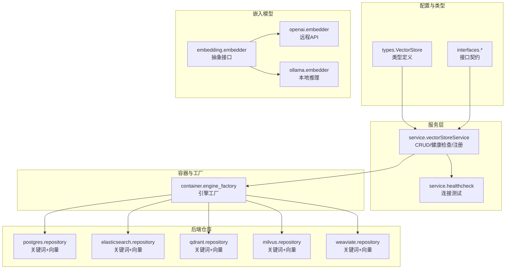
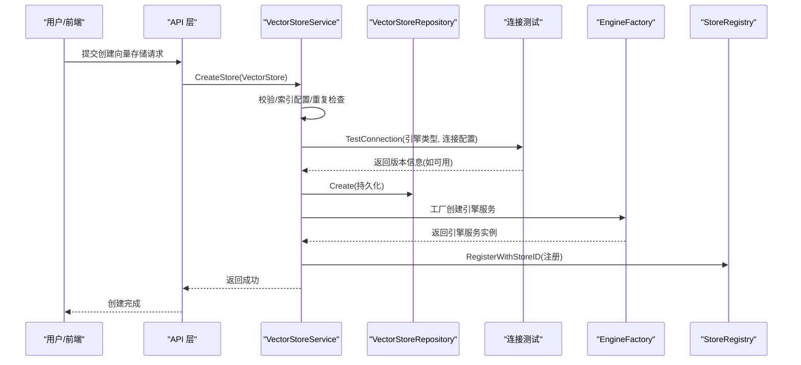
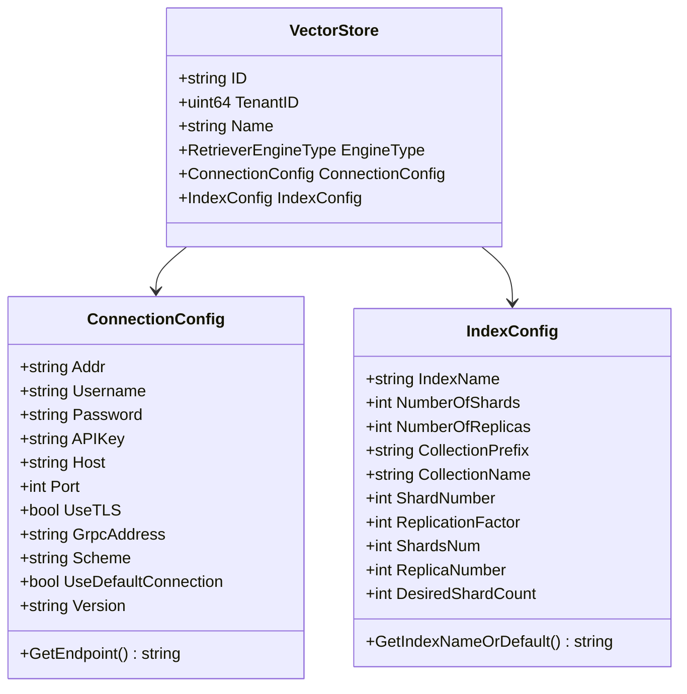
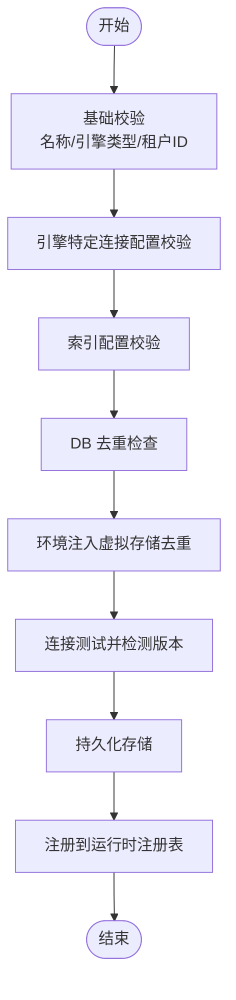
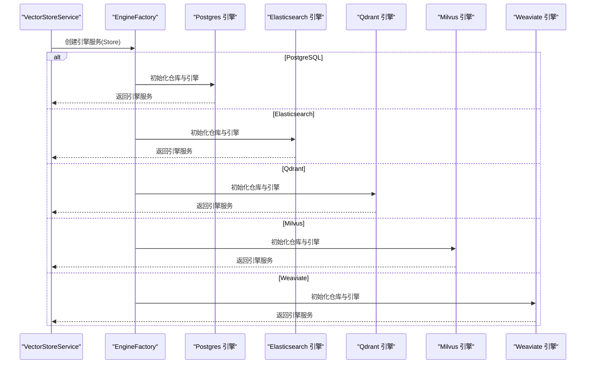
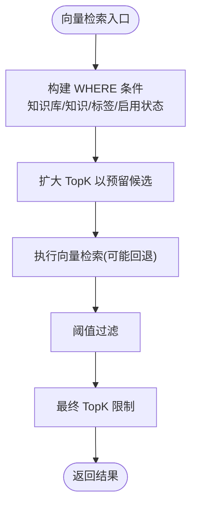
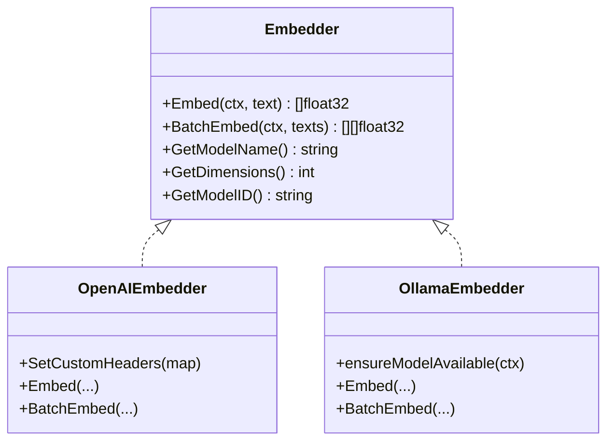
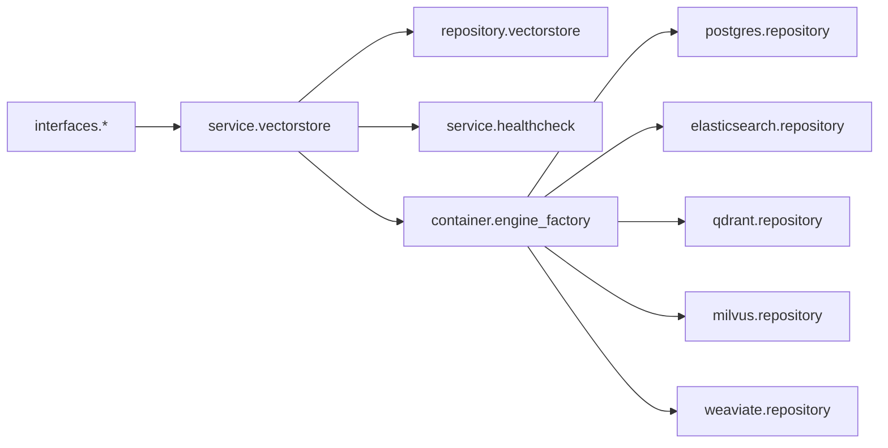

# 向量数据库支持

<cite>
**本文引用的文件**
- [vectorstore.go](file://internal/types/vectorstore.go)
- [interfaces/vectorstore.go](file://internal/types/interfaces/vectorstore.go)
- [vectorstore.go](file://internal/application/service/vectorstore.go)
- [vectorstore_healthcheck.go](file://internal/application/service/vectorstore_healthcheck.go)
- [vectorstore.go](file://internal/application/repository/vectorstore.go)
- [engine_factory.go](file://internal/container/engine_factory.go)
- [embedder.go](file://internal/models/embedding/embedder.go)
- [openai.go](file://internal/models/embedding/openai.go)
- [ollama.go](file://internal/models/embedding/ollama.go)
- [repository.go](file://internal/application/repository/retriever/postgres/repository.go)
- [repository.go](file://internal/application/repository/retriever/qdrant/repository.go)
- [repository.go](file://internal/application/repository/retriever/milvus/repository.go)
- [repository.go](file://internal/application/repository/retriever/weaviate/repository.go)
- [vector-store.md](file://docs/api/vector-store.md)
- [vector-store.ts](file://frontend/src/api/vector-store.ts)
</cite>

## 目录
1. [简介](#简介)
2. [项目结构](#项目结构)
3. [核心组件](#核心组件)
4. [架构总览](#架构总览)
5. [详细组件分析](#详细组件分析)
6. [依赖关系分析](#依赖关系分析)
7. [性能考量](#性能考量)
8. [故障排查指南](#故障排查指南)
9. [结论](#结论)
10. [附录](#附录)

## 简介
本文件系统性阐述 WeKnora 的向量数据库支持能力，覆盖向量存储抽象接口设计、多后端集成（PostgreSQL pgvector、Elasticsearch、Milvus、Weaviate、Qdrant）、查询优化与索引管理、嵌入模型配置与性能优化、配置与最佳实践、性能调优与大规模数据处理、扩展与自定义后端开发、以及备份恢复与迁移策略。目标是帮助开发者与运维人员在不同场景下高效、稳定地使用与扩展向量检索能力。

## 项目结构
WeKnora 将“向量存储”抽象为统一的配置实体，通过服务层进行校验、去重与连接测试，再由工厂动态创建具体引擎实例；检索实现按后端拆分到各仓库模块，统一对外提供 KV 混合检索能力。

**图表来源**
- [vectorstore.go:30-95](file://internal/types/vectorstore.go#L30-L95)
- [interfaces/vectorstore.go:26-58](file://internal/types/interfaces/vectorstore.go#L26-L58)
- [vectorstore.go:36-99](file://internal/application/service/vectorstore.go#L36-L99)
- [vectorstore_healthcheck.go:25-50](file://internal/application/service/vectorstore_healthcheck.go#L25-L50)
- [engine_factory.go:34-60](file://internal/container/engine_factory.go#L34-L60)
- [repository.go:19-38](file://internal/application/repository/retriever/postgres/repository.go#L19-L38)
- [repository.go:32-49](file://internal/application/repository/retriever/qdrant/repository.go#L32-L49)
- [repository.go:44-78](file://internal/application/repository/retriever/milvus/repository.go#L44-L78)
- [repository.go:37-54](file://internal/application/repository/retriever/weaviate/repository.go#L37-L54)
- [embedder.go:15-37](file://internal/models/embedding/embedder.go#L15-L37)

**章节来源**
- [vectorstore.go:30-95](file://internal/types/vectorstore.go#L30-L95)
- [interfaces/vectorstore.go:26-58](file://internal/types/interfaces/vectorstore.go#L26-L58)
- [vectorstore.go:36-99](file://internal/application/service/vectorstore.go#L36-L99)
- [engine_factory.go:34-60](file://internal/container/engine_factory.go#L34-L60)

## 核心组件
- 向量存储类型与配置
  - 统一的 VectorStore 类型，支持多租户隔离、多种引擎类型与索引配置。
  - ConnectionConfig/IndexConfig 抽象出连接参数与索引参数，内置默认值与校验规则。
- 服务层
  - 提供创建、更新、删除、连接测试、版本检测与注册等能力。
  - 在创建时执行重复性检查（DB 与环境变量注入的虚拟存储）。
- 工厂与注册
  - EngineFactory 根据 VectorStore 配置动态创建具体引擎服务，并注册到运行时注册表。
- 后端仓库
  - 各后端实现统一的 RetrieveEngineRepository 接口，支持关键词与向量混合检索。
- 嵌入模型
  - Embedder 抽象统一的文本向量化接口，支持本地 Ollama 与远程 OpenAI 兼容 API。
  - 支持自定义头部、重试与调试包装器。

**章节来源**
- [vectorstore.go:30-95](file://internal/types/vectorstore.go#L30-L95)
- [vectorstore.go:36-99](file://internal/application/service/vectorstore.go#L36-L99)
- [engine_factory.go:34-60](file://internal/container/engine_factory.go#L34-L60)
- [embedder.go:15-37](file://internal/models/embedding/embedder.go#L15-L37)

## 架构总览
WeKnora 的向量检索采用“配置驱动 + 工厂动态创建”的架构：上层通过 API/前端提交 VectorStore 配置，服务层完成校验与连接测试，工厂根据配置创建对应后端引擎，统一以 KV 混合检索服务对外提供能力。

**图表来源**
- [vectorstore.go:36-99](file://internal/application/service/vectorstore.go#L36-L99)
- [vectorstore_healthcheck.go:25-50](file://internal/application/service/vectorstore_healthcheck.go#L25-L50)
- [engine_factory.go:34-60](file://internal/container/engine_factory.go#L34-L60)
- [vectorstore.go:22-25](file://internal/application/repository/vectorstore.go#L22-L25)

**章节来源**
- [vectorstore.go:36-99](file://internal/application/service/vectorstore.go#L36-L99)
- [vectorstore_healthcheck.go:25-50](file://internal/application/service/vectorstore_healthcheck.go#L25-L50)
- [engine_factory.go:34-60](file://internal/container/engine_factory.go#L34-L60)

## 详细组件分析

### 向量存储抽象与配置
- 引擎类型与有效性
  - 有效引擎类型包括：PostgreSQL、Elasticsearch、Qdrant、Milvus、Weaviate、SQLite。
  - 通过 IsValidEngineType 与枚举常量保证类型安全。
- 连接配置
  - ConnectionConfig 统一封装地址、用户名、密码、API Key、TLS、gRPC 地址等字段，并对敏感字段进行加密存储。
  - GetEndpoint 用于去重比较，避免相同端点与索引名的重复配置。
- 索引配置
  - IndexConfig 支持引擎特定的索引参数（如分片数、副本数、集合名等），并提供默认值与范围校验。
  - ResolveIndexName/ResolveCollectionName 支持从配置、环境变量与默认值解析最终索引名。
- 类型元数据
  - GetVectorStoreTypes 返回前端可用的引擎类型与字段定义，用于动态表单生成。

**图表来源**
- [vectorstore.go:30-95](file://internal/types/vectorstore.go#L30-L95)
- [vectorstore.go:101-121](file://internal/types/vectorstore.go#L101-L121)
- [vectorstore.go:203-236](file://internal/types/vectorstore.go#L203-L236)

**章节来源**
- [vectorstore.go:66-81](file://internal/types/vectorstore.go#L66-L81)
- [vectorstore.go:101-121](file://internal/types/vectorstore.go#L101-L121)
- [vectorstore.go:203-236](file://internal/types/vectorstore.go#L203-L236)
- [vectorstore.go:482-547](file://internal/types/vectorstore.go#L482-L547)

### 服务层：CRUD、去重与连接测试
- 创建流程
  - 基础校验 → 引擎特定连接配置校验 → 索引配置校验 → DB 与环境变量注入的虚拟存储双重去重 → 自动检测服务器版本 → 持久化 → 注册到运行时注册表。
- 更新/删除
  - 更新仅允许修改名称；删除执行软删除并从注册表注销。
- 连接测试
  - 对每种引擎类型分别实现连接测试，解析版本号（若可得），用于后续 SDK 选择与兼容性判断。

**图表来源**
- [vectorstore.go:36-99](file://internal/application/service/vectorstore.go#L36-L99)
- [vectorstore_healthcheck.go:25-50](file://internal/application/service/vectorstore_healthcheck.go#L25-L50)

**章节来源**
- [vectorstore.go:36-99](file://internal/application/service/vectorstore.go#L36-L99)
- [vectorstore_healthcheck.go:25-50](file://internal/application/service/vectorstore_healthcheck.go#L25-L50)

### 工厂与引擎创建
- EngineFactory
  - 根据 VectorStore.EngineType 分派到具体引擎创建函数，返回统一的 RetrieveEngineService。
- 引擎创建细节
  - PostgreSQL：使用默认数据库或指定连接串，创建 KV 混合检索引擎。
  - Elasticsearch：区分 v7/v8，使用相应仓库实现。
  - Qdrant：按维度动态创建集合，建立 payload 与文本索引。
  - Milvus：按维度动态创建集合，设置 HNSW/Hybrid 索引与 BM25 函数。
  - Weaviate：按维度动态创建类，配置 HNSW 参数与分片/副本。

**图表来源**
- [engine_factory.go:34-60](file://internal/container/engine_factory.go#L34-L60)
- [engine_factory.go:125-143](file://internal/container/engine_factory.go#L125-L143)
- [engine_factory.go:145-171](file://internal/container/engine_factory.go#L145-L171)
- [engine_factory.go:173-207](file://internal/container/engine_factory.go#L173-L207)

**章节来源**
- [engine_factory.go:34-60](file://internal/container/engine_factory.go#L34-L60)
- [engine_factory.go:125-143](file://internal/container/engine_factory.go#L125-L143)
- [engine_factory.go:145-171](file://internal/container/engine_factory.go#L145-L171)
- [engine_factory.go:173-207](file://internal/container/engine_factory.go#L173-L207)

### PostgreSQL 向量检索与优化
- 存储与索引
  - 使用半精度向量存储，估算存储开销（内容、向量、元数据、索引）。
  - 批量写入使用 ON CONFLICT DO NOTHING 避免重复。
- 检索路径
  - 关键词检索：基于全文检索（含 ParadeDB 扩展）。
  - 向量检索：HNSW 近似最近邻，结合阈值过滤与 TopK 限制。
- 查询优化
  - 扩大 TopK 以提升阈值过滤前候选数量，平衡 ef_search 与扫描成本。
  - 当出现旧版 pgvector GUC 不支持错误时，回退到无 GUC 覆盖的查询路径。
  - 默认启用 is_enabled 过滤，确保只检索启用的块。

**图表来源**
- [repository.go:318-462](file://internal/application/repository/retriever/postgres/repository.go#L318-L462)

**章节来源**
- [repository.go:40-77](file://internal/application/repository/retriever/postgres/repository.go#L40-L77)
- [repository.go:163-200](file://internal/application/repository/retriever/postgres/repository.go#L163-L200)
- [repository.go:318-462](file://internal/application/repository/retriever/postgres/repository.go#L318-L462)

### Qdrant 向量检索与索引管理
- 动态集合
  - 按维度拼接集合名，首次访问时自动创建集合与索引。
- 索引策略
  - 向量：余弦距离，HNSW 参数按默认配置。
  - Payload：对 chunk_id/knowledge_id/knowledge_base_id/source_id/is_enabled 建立关键字索引。
  - 文本：多语言分词器，支持中日韩等语言关键词检索。
- 写入与去重
  - 使用 Upsert 写入，保证幂等。

**章节来源**
- [repository.go:56-140](file://internal/application/repository/retriever/qdrant/repository.go#L56-L140)
- [repository.go:165-200](file://internal/application/repository/retriever/qdrant/repository.go#L165-L200)

### Milvus 向量检索与索引管理
- 动态集合
  - 按维度拼接集合名，首次访问时自动创建集合与索引。
- Schema 设计
  - 主键：VARCHAR(ID)。
  - 向量：FloatVector，维度来自向量。
  - 文本：启用 Analyzer 与 Match，支持 BM25。
  - Sparse 向量：通过 BM25 函数生成 content_sparse 字段。
- 索引策略
  - 向量：HNSW，支持 L2/COSINE/IP。
  - Payload：对常用过滤字段建立自动索引。
  - 加载集合时可设置 in-memory 副本数（读高可用/吞吐）。
- 写入与去重
  - 使用唯一 ID 写入，避免重复。

**章节来源**
- [repository.go:85-200](file://internal/application/repository/retriever/milvus/repository.go#L85-L200)
- [repository.go:200-260](file://internal/application/repository/retriever/milvus/repository.go#L200-L260)

### Weaviate 向量检索与索引管理
- 动态类
  - 按维度拼接类名，首次访问时自动创建类与 HNSW 索引。
- 索引策略
  - 向量：HNSW，cosine 距离，可配置 efConstruction/maxConnections/ef。
  - 文本：使用 gse 分词器，支持中文等多语言。
  - Payload：对过滤字段开启可过滤索引。
  - 可配置副本因子与期望分片数。
- 写入与去重
  - 使用唯一 ID 写入，保证幂等。

**章节来源**
- [repository.go:60-160](file://internal/application/repository/retriever/weaviate/repository.go#L60-L160)
- [repository.go:185-200](file://internal/application/repository/retriever/weaviate/repository.go#L185-L200)

### 嵌入模型配置与性能优化
- Embedder 抽象
  - 统一 Embed/BatchEmbed 接口，支持获取模型名、维度、模型 ID。
- 远程 OpenAI 兼容
  - 支持自定义 BaseURL、模型名、截断长度、维度、自定义头部与重试。
- 本地 Ollama
  - 通过 OllamaService 确保模型可用，支持截断参数映射。
- 配置来源
  - 支持本地/远程两种来源，远程时按提供商路由（如 OpenAI、Azure OpenAI、WeKnora Cloud 等）。

**图表来源**
- [embedder.go:15-37](file://internal/models/embedding/embedder.go#L15-L37)
- [openai.go:16-82](file://internal/models/embedding/openai.go#L16-L82)
- [ollama.go:13-60](file://internal/models/embedding/ollama.go#L13-L60)

**章节来源**
- [embedder.go:82-95](file://internal/models/embedding/embedder.go#L82-L95)
- [openai.go:16-82](file://internal/models/embedding/openai.go#L16-L82)
- [ollama.go:13-60](file://internal/models/embedding/ollama.go#L13-L60)

## 依赖关系分析
- 低耦合
  - 类型与接口分离，服务层与工厂解耦，便于新增后端。
- 外部依赖
  - 各后端 SDK（Qdrant、Milvus、Weaviate、Elasticsearch、pgvector）通过仓库层封装。
- 循环依赖规避
  - EngineFactory 作为函数类型注入，避免包循环导入。

**图表来源**
- [interfaces/vectorstore.go:26-58](file://internal/types/interfaces/vectorstore.go#L26-L58)
- [vectorstore.go:16-34](file://internal/application/service/vectorstore.go#L16-L34)
- [engine_factory.go:34-60](file://internal/container/engine_factory.go#L34-L60)

**章节来源**
- [interfaces/vectorstore.go:26-58](file://internal/types/interfaces/vectorstore.go#L26-L58)
- [engine_factory.go:34-60](file://internal/container/engine_factory.go#L34-L60)

## 性能考量
- PostgreSQL
  - HNSW ef_search 与迭代扫描参数需与 TopK 协同；建议扩大 TopK 以避免过度回退到顺序扫描。
  - 通过 is_enabled 过滤减少无效数据参与检索。
- Qdrant
  - 按维度分集合，避免跨维度查询；payload 索引覆盖高频过滤字段。
- Milvus
  - HNSW 与 BM25 双索引组合；合理设置分片数与内存副本数以平衡写入并行与读取高可用。
- Weaviate
  - HNSW 参数（efConstruction、maxConnections、ef）影响召回与延迟；分片与副本按容量规划。
- 嵌入模型
  - 远程 API：设置合理的超时与重试；自定义头部用于网关/鉴权透传。
  - 本地 Ollama：确保模型可用，合理设置截断长度以控制输入大小。

[本节为通用指导，无需列出具体文件来源]

## 故障排查指南
- 连接失败
  - 检查地址、凭证与网络连通性；查看连接测试返回的具体错误。
  - Elasticsearch：区分 v7/v8，必要时使用根端点探测版本。
  - Milvus：TCP 探测验证 gRPC 可达性。
- 版本不匹配
  - 未正确检测版本可能导致 SDK 选择错误；确认连接测试返回的版本并重新保存。
- 重复配置
  - 同一端点与索引名在同一租户内不允许重复；检查 DB 与环境注入的虚拟存储冲突。
- PostgreSQL 向量检索异常
  - 若出现 GUC 不支持错误，系统会自动回退；建议升级 pgvector 或调整查询参数。
- 嵌入模型
  - 远程 API：检查 BaseURL、API Key、自定义头部是否正确；关注重试与超时设置。
  - 本地 Ollama：确认模型已拉取且可用。

**章节来源**
- [vectorstore_healthcheck.go:25-50](file://internal/application/service/vectorstore_healthcheck.go#L25-L50)
- [vectorstore.go:53-73](file://internal/application/service/vectorstore.go#L53-L73)
- [repository.go:435-443](file://internal/application/repository/retriever/postgres/repository.go#L435-L443)

## 结论
WeKnora 的向量数据库支持以“配置驱动 + 工厂动态创建 + 统一接口”为核心，实现了对 PostgreSQL、Elasticsearch、Qdrant、Milvus、Weaviate 的统一抽象与高效检索。通过严格的配置校验、连接测试与注册机制，保障了多租户场景下的稳定性与可维护性。后端仓库层提供了完善的索引与检索优化策略，配合嵌入模型的灵活配置，满足从开发到生产的多样化需求。

## 附录

### API 与前端交互
- 向量存储 API
  - 支持获取引擎类型元数据、测试连接（原始/已保存）、创建/更新/删除向量存储。
- 前端交互
  - 前端通过 API 模块发起请求，使用测试接口验证配置后再创建存储。

**章节来源**
- [vector-store.md:1-66](file://docs/api/vector-store.md#L1-L66)
- [vector-store.ts:50-64](file://frontend/src/api/vector-store.ts#L50-L64)

### 配置指南与最佳实践
- 引擎类型与字段
  - 使用 /types 获取引擎类型与字段定义，前端据此生成表单。
- 连接测试
  - 建议先使用“原始凭据测试”，确认连通性与版本后再保存。
- 索引配置
  - 合理设置分片/副本/集合名等参数；按实际维度命名集合。
- PostgreSQL
  - 保持 is_enabled 过滤开启；根据数据规模调整 TopK 与阈值。
- 嵌入模型
  - 远程 API：设置合适的超时与重试；自定义头部用于网关透传。
  - 本地 Ollama：确保模型可用与截断参数合理。

**章节来源**
- [vector-store.md:20-66](file://docs/api/vector-store.md#L20-L66)
- [vectorstore.go:482-547](file://internal/types/vectorstore.go#L482-L547)

### 扩展与自定义后端开发
- 新增后端步骤
  - 在 types 中定义新引擎类型与默认配置。
  - 在 service 层实现连接测试与版本检测。
  - 在 container 中添加工厂分支。
  - 在 application/repository 下实现仓库层（支持关键词与向量检索）。
  - 在 engine_factory 中注册新引擎。
- 注意事项
  - 保持接口一致性；提供索引创建与写入去重逻辑。
  - 合理设置默认参数与环境变量回退。

**章节来源**
- [vectorstore.go:66-81](file://internal/types/vectorstore.go#L66-L81)
- [vectorstore_healthcheck.go:25-50](file://internal/application/service/vectorstore_healthcheck.go#L25-L50)
- [engine_factory.go:34-60](file://internal/container/engine_factory.go#L34-L60)

### 备份、恢复与迁移
- 备份
  - PostgreSQL：导出向量表与索引元数据；注意半精度向量与索引重建。
  - Qdrant/Milvus/Weaviate：导出集合/类与索引配置；保留维度命名规则。
- 恢复
  - 重新创建集合/类与索引；导入数据并重建索引。
- 迁移
  - 统一向量维度；按新后端的集合命名规则重建；验证检索结果一致性。

[本节为通用指导，无需列出具体文件来源]