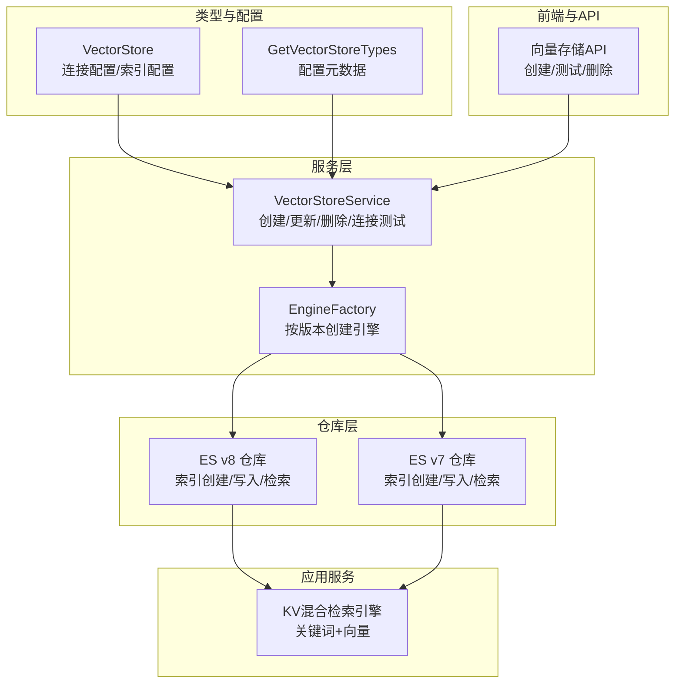
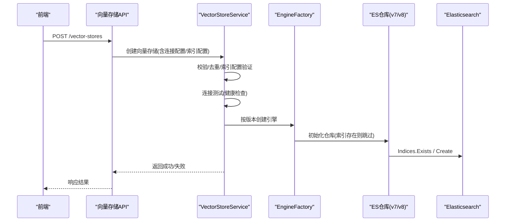
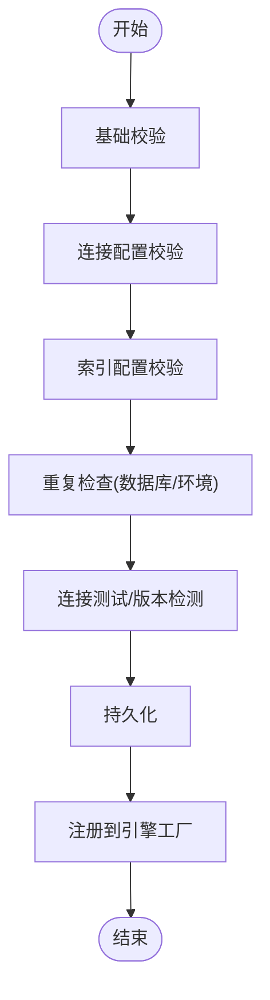
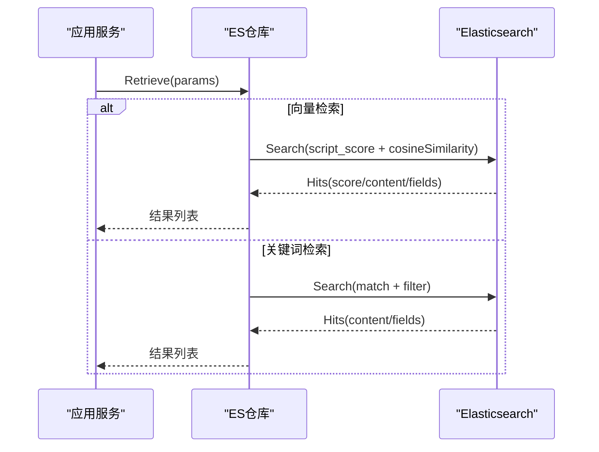
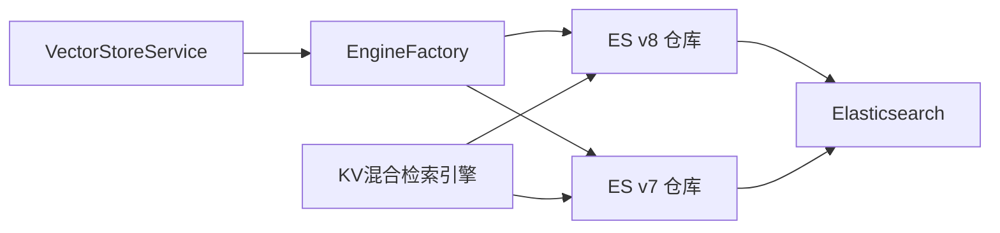

# Elasticsearch集成

<cite>
**本文档引用的文件**
- [internal/application/service/vectorstore.go](file://internal/application/service/vectorstore.go)
- [internal/types/vectorstore.go](file://internal/types/vectorstore.go)
- [internal/application/repository/vectorstore.go](file://internal/application/repository/vectorstore.go)
- [internal/application/repository/retriever/elasticsearch/v8/repository.go](file://internal/application/repository/retriever/elasticsearch/v8/repository.go)
- [internal/application/repository/retriever/elasticsearch/v7/repository.go](file://internal/application/repository/retriever/elasticsearch/v7/repository.go)
- [internal/container/engine_factory.go](file://internal/container/engine_factory.go)
- [internal/application/service/retriever/keywords_vector_hybrid_indexer.go](file://internal/application/service/retriever/keywords_vector_hybrid_indexer.go)
- [internal/application/repository/retriever/elasticsearch/structs.go](file://internal/application/repository/retriever/elasticsearch/structs.go)
- [internal/application/service/vectorstore_healthcheck.go](file://internal/application/service/vectorstore_healthcheck.go)
- [internal/handler/vectorstore.go](file://internal/handler/vectorstore.go)
- [frontend/src/api/vector-store.ts](file://frontend/src/api/vector-store.ts)
</cite>

## 目录
1. [简介](#简介)
2. [项目结构](#项目结构)
3. [核心组件](#核心组件)
4. [架构总览](#架构总览)
5. [详细组件分析](#详细组件分析)
6. [依赖关系分析](#依赖关系分析)
7. [性能考虑](#性能考虑)
8. [故障排除指南](#故障排除指南)
9. [结论](#结论)

## 简介
本文件面向在WeKnora项目中集成Elasticsearch向量数据库的开发者与运维人员，系统性阐述Elasticsearch向量插件的安装与配置、版本兼容性与集群设置、向量字段映射与索引模板设计、KNN搜索算法配置与性能调优、索引创建与更新流程（含批量插入与实时更新）、查询DSL构建（向量查询、混合查询、聚合查询）、近似与精确搜索的平衡策略、以及集群监控与性能指标配置与故障排除实践。

## 项目结构
WeKnora通过统一的向量存储抽象与工厂模式，支持多种向量数据库后端，其中Elasticsearch作为核心候选之一。项目采用分层架构：
- 类型与配置层：定义向量存储、连接配置、索引配置与环境变量解析
- 服务层：负责向量存储的创建、更新、删除与连接测试
- 仓库层：针对具体引擎（如Elasticsearch v7/v8）实现索引创建、写入、删除、检索
- 工厂与注册层：根据存储配置动态创建引擎实例
- 前端与API层：提供向量存储的管理与连接测试接口

图表来源
- [internal/types/vectorstore.go:30-676](file://internal/types/vectorstore.go#L30-L676)
- [internal/application/service/vectorstore.go:36-190](file://internal/application/service/vectorstore.go#L36-L190)
- [internal/container/engine_factory.go:81-123](file://internal/container/engine_factory.go#L81-L123)
- [internal/application/repository/retriever/elasticsearch/v8/repository.go:30-55](file://internal/application/repository/retriever/elasticsearch/v8/repository.go#L30-L55)
- [internal/application/repository/retriever/elasticsearch/v7/repository.go:35-58](file://internal/application/repository/retriever/elasticsearch/v7/repository.go#L35-L58)
- [internal/application/service/retriever/keywords_vector_hybrid_indexer.go:23-41](file://internal/application/service/retriever/keywords_vector_hybrid_indexer.go#L23-L41)
- [internal/handler/vectorstore.go:397-455](file://internal/handler/vectorstore.go#L397-L455)

章节来源
- [internal/types/vectorstore.go:30-676](file://internal/types/vectorstore.go#L30-L676)
- [internal/application/service/vectorstore.go:36-190](file://internal/application/service/vectorstore.go#L36-L190)
- [internal/container/engine_factory.go:81-123](file://internal/container/engine_factory.go#L81-L123)
- [internal/application/repository/retriever/elasticsearch/v8/repository.go:30-55](file://internal/application/repository/retriever/elasticsearch/v8/repository.go#L30-L55)
- [internal/application/repository/retriever/elasticsearch/v7/repository.go:35-58](file://internal/application/repository/retriever/elasticsearch/v7/repository.go#L35-L58)
- [internal/application/service/retriever/keywords_vector_hybrid_indexer.go:23-41](file://internal/application/service/retriever/keywords_vector_hybrid_indexer.go#L23-L41)
- [internal/handler/vectorstore.go:397-455](file://internal/handler/vectorstore.go#L397-L455)

## 核心组件
- 向量存储模型与配置
  - VectorStore：包含引擎类型、连接配置、索引配置、时间戳等
  - ConnectionConfig：通用连接参数（地址、用户名、密码、API密钥等），支持敏感字段加密存储
  - IndexConfig：索引名称、分片数、副本数等，支持多引擎默认值与环境变量回退
- 服务层
  - VectorStoreService：校验、去重、连接测试、持久化与注册
  - EngineFactory：根据版本自动选择v7或v8客户端并创建引擎
- 仓库层（Elasticsearch）
  - v8/v7仓库：实现索引创建、文档写入（单条/批量）、删除（按chunk/source/knowledge ID）、检索（关键词/向量）
  - 检测字段类型：自动判断ID字段是否需要.keyword后缀
- 应用服务
  - KV混合检索引擎：统一暴露关键词与向量检索能力
- 健康检查与API
  - 连接测试：HTTP探测返回版本号，用于自动识别ES版本
  - 前端API：提供创建、测试、删除向量存储的REST接口

章节来源
- [internal/types/vectorstore.go:30-676](file://internal/types/vectorstore.go#L30-L676)
- [internal/application/service/vectorstore.go:36-190](file://internal/application/service/vectorstore.go#L36-L190)
- [internal/container/engine_factory.go:81-123](file://internal/container/engine_factory.go#L81-L123)
- [internal/application/repository/retriever/elasticsearch/v8/repository.go:30-55](file://internal/application/repository/retriever/elasticsearch/v8/repository.go#L30-L55)
- [internal/application/repository/retriever/elasticsearch/v7/repository.go:35-58](file://internal/application/repository/retriever/elasticsearch/v7/repository.go#L35-L58)
- [internal/application/service/retriever/keywords_vector_hybrid_indexer.go:23-41](file://internal/application/service/retriever/keywords_vector_hybrid_indexer.go#L23-L41)
- [internal/application/service/vectorstore_healthcheck.go:52-93](file://internal/application/service/vectorstore_healthcheck.go#L52-L93)
- [internal/handler/vectorstore.go:397-455](file://internal/handler/vectorstore.go#L397-L455)

## 架构总览
下图展示了从用户请求到Elasticsearch的完整链路：前端发起创建/测试请求 → 服务层执行校验与连接测试 → 工厂按版本创建仓库 → 仓库进行索引创建与数据写入/检索。

图表来源
- [internal/handler/vectorstore.go:397-455](file://internal/handler/vectorstore.go#L397-L455)
- [internal/application/service/vectorstore.go:36-190](file://internal/application/service/vectorstore.go#L36-L190)
- [internal/container/engine_factory.go:81-123](file://internal/container/engine_factory.go#L81-L123)
- [internal/application/repository/retriever/elasticsearch/v8/repository.go:344-381](file://internal/application/repository/retriever/elasticsearch/v8/repository.go#L344-L381)
- [internal/application/repository/retriever/elasticsearch/v7/repository.go:131-184](file://internal/application/repository/retriever/elasticsearch/v7/repository.go#L131-L184)

## 详细组件分析

### 向量存储模型与配置
- 字段与约束
  - 支持引擎类型：Elasticsearch、Qdrant、Milvus、Weaviate、PostgreSQL、SQLite
  - 连接配置：addr/host/username/password/api_key/use_tls等
  - 索引配置：index_name、number_of_shards、number_of_replicas、collection_prefix等
- 环境变量与默认值
  - 通过ResolveIndexName/ResolveCollectionName支持环境变量回退
  - Elasticsearch默认索引名：xwrag_default；可由环境变量覆盖
- 配置元数据
  - GetVectorStoreTypes提供UI/API使用的字段描述与默认值

章节来源
- [internal/types/vectorstore.go:30-676](file://internal/types/vectorstore.go#L30-L676)

### 服务层：创建/更新/删除与连接测试
- 创建流程
  - 基础校验（名称、引擎类型、租户ID）
  - 引擎特定连接配置校验
  - 索引配置校验（名称合法性、数值边界）
  - 去重检查（数据库与环境变量两种来源）
  - 自动检测服务器版本并通过连接测试
  - 持久化与注册（失败不回滚，支持自愈重启加载）
- 更新/删除
  - 更新仅允许修改名称
  - 删除同时从注册表注销
- 连接测试
  - 使用HTTP GET探测根路径，解析版本号
  - ES7/ES8通过不同SDK处理，避免协议错误

图表来源
- [internal/application/service/vectorstore.go:36-190](file://internal/application/service/vectorstore.go#L36-L190)
- [internal/application/service/vectorstore_healthcheck.go:52-93](file://internal/application/service/vectorstore_healthcheck.go#L52-L93)

章节来源
- [internal/application/service/vectorstore.go:36-190](file://internal/application/service/vectorstore.go#L36-L190)
- [internal/application/service/vectorstore_healthcheck.go:52-93](file://internal/application/service/vectorstore_healthcheck.go#L52-L93)

### 工厂与引擎创建（版本兼容性）
- 版本判定
  - 以ConnectionConfig.Version为准，7.x走v7分支，否则走v8分支
  - 未指定版本时默认使用v8（最新SDK）
- 客户端初始化
  - v8：elasticsearch.NewTypedClient
  - v7：esv7.NewClient
- 组合引擎
  - 通过KV混合检索引擎统一暴露关键词与向量检索能力

章节来源
- [internal/container/engine_factory.go:81-123](file://internal/container/engine_factory.go#L81-L123)

### Elasticsearch仓库：索引创建与字段映射
- 索引创建
  - 若索引不存在则创建，支持可选的分片数与副本数
  - v8/v7分别使用对应SDK的Indices接口
- 字段类型检测
  - 通过GetMapping读取chunk_id字段类型，自动决定是否使用.keyword后缀
  - 适配text映射下的子字段与keyword映射
- 索引模板建议
  - content：text（支持关键词检索）
  - embedding：dense_vector（向量维度需与嵌入器一致）
  - chunk_id/source_id/knowledge_id/knowledge_base_id/tag_id：keyword（用于过滤与聚合）
  - is_enabled/is_recommended：boolean（用于启用状态与推荐标记）

章节来源
- [internal/application/repository/retriever/elasticsearch/v8/repository.go:66-104](file://internal/application/repository/retriever/elasticsearch/v8/repository.go#L66-L104)
- [internal/application/repository/retriever/elasticsearch/v7/repository.go:69-127](file://internal/application/repository/retriever/elasticsearch/v7/repository.go#L69-L127)
- [internal/application/repository/retriever/elasticsearch/v8/repository.go:344-381](file://internal/application/repository/retriever/elasticsearch/v8/repository.go#L344-L381)
- [internal/application/repository/retriever/elasticsearch/v7/repository.go:131-184](file://internal/application/repository/retriever/elasticsearch/v7/repository.go#L131-L184)

### 写入与批量写入
- 单条写入
  - 将IndexInfo转换为VectorEmbedding，校验向量非空后写入
- 批量写入
  - v8：使用Bulk API，逐条Create操作
  - v7：构造批量请求体，使用esapi.Bulk接口
- 存储估算
  - 基于内容长度、向量维度、元数据与索引开销估算单文档与总量

章节来源
- [internal/application/repository/retriever/elasticsearch/v8/repository.go:155-217](file://internal/application/repository/retriever/elasticsearch/v8/repository.go#L155-L217)
- [internal/application/repository/retriever/elasticsearch/v7/repository.go:240-332](file://internal/application/repository/retriever/elasticsearch/v7/repository.go#L240-L332)
- [internal/application/repository/retriever/elasticsearch/v8/repository.go:116-153](file://internal/application/repository/retriever/elasticsearch/v8/repository.go#L116-L153)

### 删除与更新
- 按ID删除
  - 支持chunk_id、source_id、knowledge_id三类ID列表删除
- 批量更新
  - 更新chunk启用状态（is_enabled）
  - 更新chunk标签ID（tag_id）
- 实现方式
  - v8：DeleteByQuery + UpdateByQuery
  - v7：DeleteByQuery + UpdateByQuery（v7 SDK）

章节来源
- [internal/application/repository/retriever/elasticsearch/v8/repository.go:219-288](file://internal/application/repository/retriever/elasticsearch/v8/repository.go#L219-L288)
- [internal/application/repository/retriever/elasticsearch/v8/repository.go:677-756](file://internal/application/repository/retriever/elasticsearch/v8/repository.go#L677-L756)
- [internal/application/repository/retriever/elasticsearch/v7/repository.go:425-490](file://internal/application/repository/retriever/elasticsearch/v7/repository.go#L425-L490)

### 检索：关键词与向量
- 关键词检索
  - content字段匹配，结合过滤条件（知识库/知识/标签/排除列表）
- 向量检索
  - 使用script_score + cosineSimilarity计算相似度
  - 支持阈值过滤与TopK限制
- 字段类型适配
  - 自动判断ID字段是否带.keyword后缀，确保查询正确

图表来源
- [internal/application/repository/retriever/elasticsearch/v8/repository.go:384-529](file://internal/application/repository/retriever/elasticsearch/v8/repository.go#L384-L529)
- [internal/application/repository/retriever/elasticsearch/v7/repository.go:584-778](file://internal/application/repository/retriever/elasticsearch/v7/repository.go#L584-L778)

章节来源
- [internal/application/repository/retriever/elasticsearch/v8/repository.go:384-529](file://internal/application/repository/retriever/elasticsearch/v8/repository.go#L384-L529)
- [internal/application/repository/retriever/elasticsearch/v7/repository.go:584-778](file://internal/application/repository/retriever/elasticsearch/v7/repository.go#L584-L778)

### 混合检索与嵌入生成
- 混合引擎
  - 统一暴露关键词与向量检索能力
- 嵌入生成
  - 当启用向量检索时，对内容批量生成向量
  - 将向量映射注入additionalParams，供仓库写入
- 并发批处理
  - 对大批量数据进行分块并发写入，控制并发度避免后端压力过大

章节来源
- [internal/application/service/retriever/keywords_vector_hybrid_indexer.go:23-286](file://internal/application/service/retriever/keywords_vector_hybrid_indexer.go#L23-L286)

### 查询DSL构建要点
- 过滤条件
  - knowledge_base_id、knowledge_id、tag_id使用terms过滤
  - is_enabled=false使用must_not排除
  - 支持exclude列表（排除特定知识/块）
- 向量查询
  - script_score + cosineSimilarity
  - min_score设置阈值，size限制TopK
- 关键词查询
  - match(content=query)，与filter组合

章节来源
- [internal/application/repository/retriever/elasticsearch/v8/repository.go:290-340](file://internal/application/repository/retriever/elasticsearch/v8/repository.go#L290-L340)
- [internal/application/repository/retriever/elasticsearch/v7/repository.go:492-582](file://internal/application/repository/retriever/elasticsearch/v7/repository.go#L492-L582)
- [internal/application/repository/retriever/elasticsearch/v8/repository.go:404-474](file://internal/application/repository/retriever/elasticsearch/v8/repository.go#L404-L474)
- [internal/application/repository/retriever/elasticsearch/v7/repository.go:600-628](file://internal/application/repository/retriever/elasticsearch/v7/repository.go#L600-L628)

### 近似与精确搜索的平衡
- 近似搜索
  - 使用script_score + cosineSimilarity，性能高，适合大规模向量检索
- 精确搜索
  - 可通过更严格的阈值与过滤条件实现“近似即精确”的效果
- 调优建议
  - 合理设置TopK与阈值，避免过多候选导致延迟
  - 利用过滤条件缩小搜索空间，减少script_score计算量

章节来源
- [internal/application/repository/retriever/elasticsearch/v8/repository.go:404-474](file://internal/application/repository/retriever/elasticsearch/v8/repository.go#L404-L474)
- [internal/application/repository/retriever/elasticsearch/v7/repository.go:600-628](file://internal/application/repository/retriever/elasticsearch/v7/repository.go#L600-L628)

## 依赖关系分析
- 低耦合与高内聚
  - 服务层仅依赖接口，不直接依赖具体ES版本
  - 工厂根据版本选择仓库，避免在上层区分v7/v8
- 关键依赖链
  - VectorStoreService → EngineFactory → ES仓库 → Elasticsearch
  - KV混合引擎 → ES仓库
- 循环依赖风险
  - 未发现循环依赖，模块职责清晰

图表来源
- [internal/application/service/vectorstore.go:36-190](file://internal/application/service/vectorstore.go#L36-L190)
- [internal/container/engine_factory.go:81-123](file://internal/container/engine_factory.go#L81-L123)
- [internal/application/repository/retriever/elasticsearch/v8/repository.go:30-55](file://internal/application/repository/retriever/elasticsearch/v8/repository.go#L30-L55)
- [internal/application/repository/retriever/elasticsearch/v7/repository.go:35-58](file://internal/application/repository/retriever/elasticsearch/v7/repository.go#L35-L58)
- [internal/application/service/retriever/keywords_vector_hybrid_indexer.go:23-41](file://internal/application/service/retriever/keywords_vector_hybrid_indexer.go#L23-L41)

章节来源
- [internal/application/service/vectorstore.go:36-190](file://internal/application/service/vectorstore.go#L36-L190)
- [internal/container/engine_factory.go:81-123](file://internal/container/engine_factory.go#L81-L123)
- [internal/application/repository/retriever/elasticsearch/v8/repository.go:30-55](file://internal/application/repository/retriever/elasticsearch/v8/repository.go#L30-L55)
- [internal/application/repository/retriever/elasticsearch/v7/repository.go:35-58](file://internal/application/repository/retriever/elasticsearch/v7/repository.go#L35-L58)
- [internal/application/service/retriever/keywords_vector_hybrid_indexer.go:23-41](file://internal/application/service/retriever/keywords_vector_hybrid_indexer.go#L23-L41)

## 性能考虑
- 索引与分片
  - 合理设置number_of_shards与number_of_replicas，平衡吞吐与延迟
  - 在高写入场景下，适度增加分片数提升并行度
- 向量维度与存储
  - embedding字段使用dense_vector，维度需与嵌入器一致
  - 估算存储时考虑内容长度、向量大小、元数据与索引开销
- 查询优化
  - 使用过滤条件（knowledge_base_id/knowledge_id/tag_id）缩小搜索范围
  - 设置合适的min_score与TopK，避免返回过多候选
- 批处理与并发
  - 批量写入使用Bulk API
  - 并发批处理时控制最大并发，避免后端过载
- 字段类型适配
  - 自动检测ID字段类型，避免.text字段误用.keyword后缀导致查询失败

章节来源
- [internal/application/repository/retriever/elasticsearch/v8/repository.go:116-153](file://internal/application/repository/retriever/elasticsearch/v8/repository.go#L116-L153)
- [internal/application/repository/retriever/elasticsearch/v8/repository.go:183-217](file://internal/application/repository/retriever/elasticsearch/v8/repository.go#L183-L217)
- [internal/application/service/retriever/keywords_vector_hybrid_indexer.go:114-206](file://internal/application/service/retriever/keywords_vector_hybrid_indexer.go#L114-L206)
- [internal/application/repository/retriever/elasticsearch/v8/repository.go:66-104](file://internal/application/repository/retriever/elasticsearch/v8/repository.go#L66-L104)

## 故障排除指南
- 连接失败
  - 检查addr、username、password是否正确
  - 使用测试接口确认连通性与版本
- 版本不匹配
  - ES7/ES8使用不同SDK，确保版本检测正确
  - 若检测不到版本，可手动填写ConnectionConfig.Version
- 字段类型问题
  - 若查询ID字段报错，检查mapping中chunk_id类型
  - 自动检测会根据mapping决定是否使用.keyword后缀
- 写入异常
  - 确保embedding非空且维度正确
  - 批量写入时关注错误响应，定位失败项
- 检索性能差
  - 增加过滤条件，减少候选集
  - 调整TopK与阈值，避免过度扫描

章节来源
- [internal/application/service/vectorstore_healthcheck.go:52-93](file://internal/application/service/vectorstore_healthcheck.go#L52-L93)
- [internal/application/repository/retriever/elasticsearch/v8/repository.go:66-104](file://internal/application/repository/retriever/elasticsearch/v8/repository.go#L66-L104)
- [internal/application/repository/retriever/elasticsearch/v8/repository.go:155-217](file://internal/application/repository/retriever/elasticsearch/v8/repository.go#L155-L217)
- [internal/handler/vectorstore.go:397-455](file://internal/handler/vectorstore.go#L397-L455)

## 结论
WeKnora对Elasticsearch的集成通过统一的向量存储抽象与工厂模式实现了版本兼容与灵活扩展。其核心优势在于：
- 自动版本检测与SDK选择
- 统一的KV混合检索能力
- 完备的索引创建、写入、删除与检索实现
- 友好的配置元数据与环境变量回退机制
- 面向生产的批处理与并发控制策略

在实际部署中，建议结合业务规模合理设置分片与副本、严格控制向量维度与阈值，并通过过滤条件缩小搜索空间，以获得最佳的性能与稳定性。