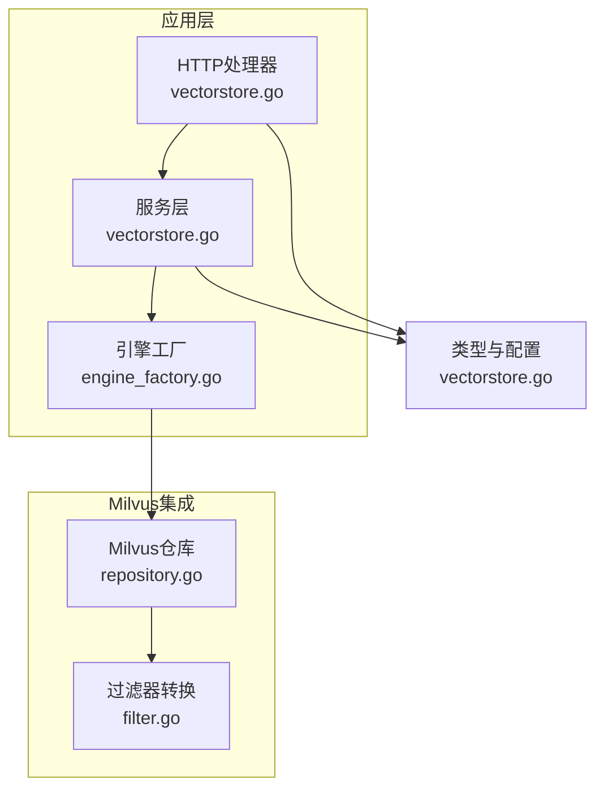
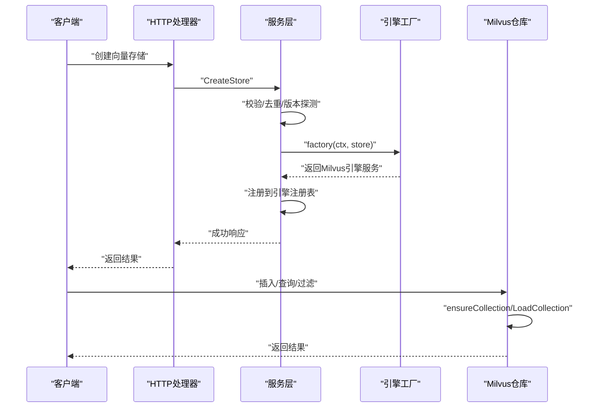
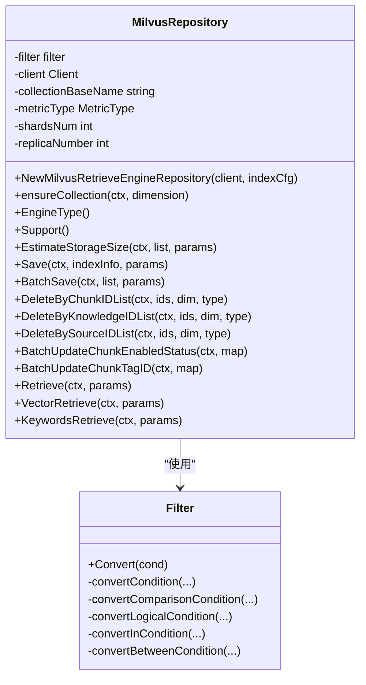
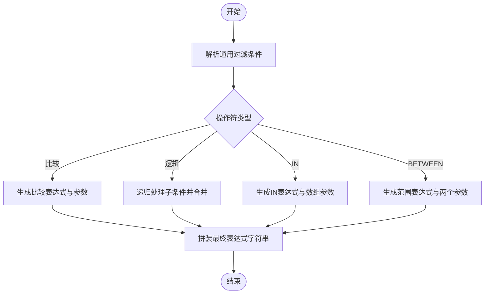
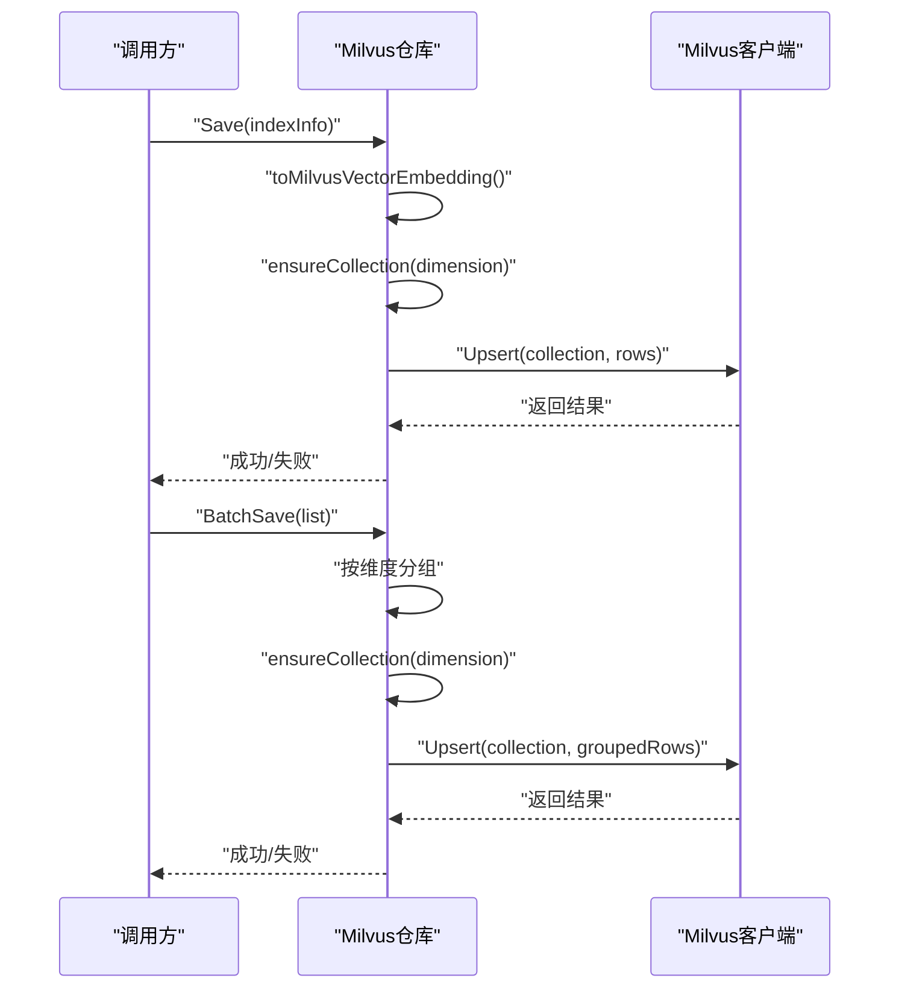
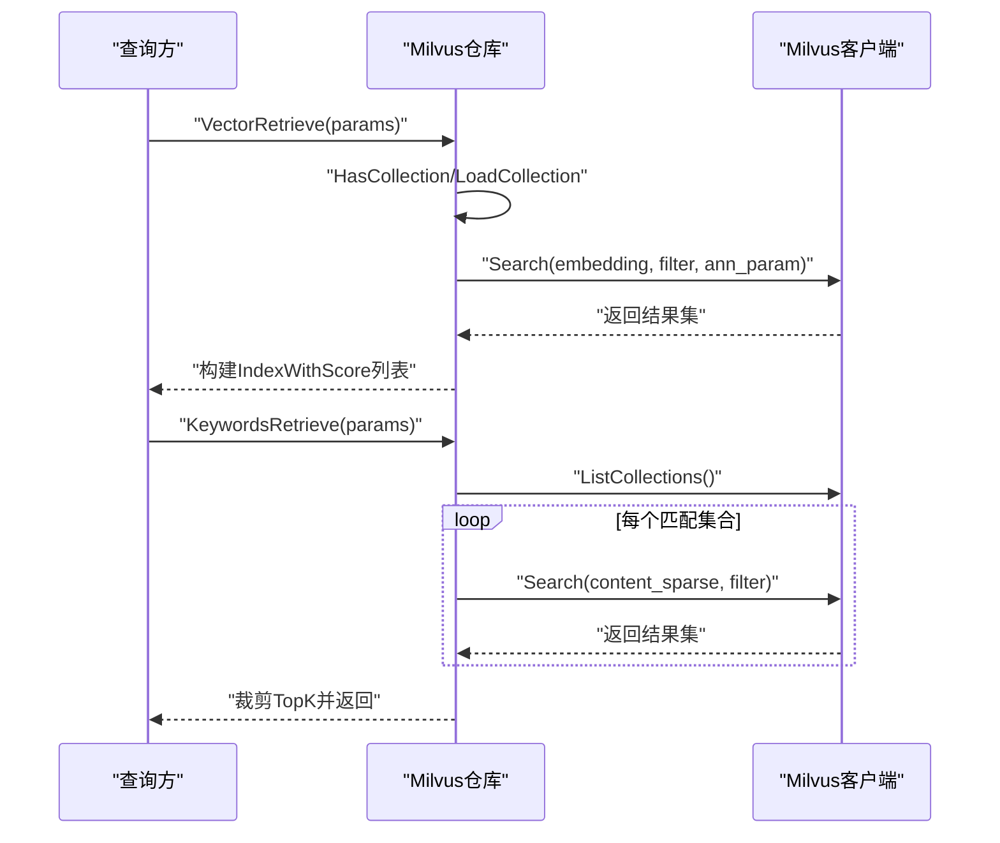
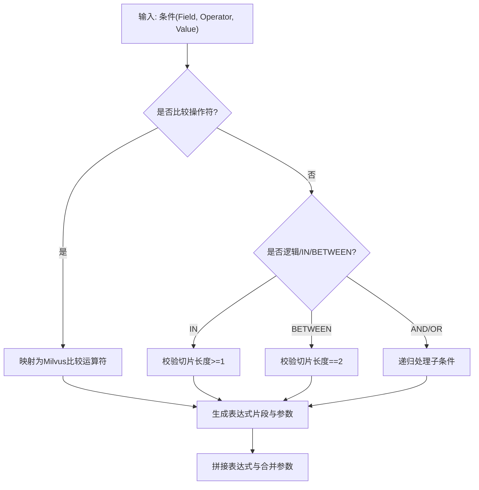
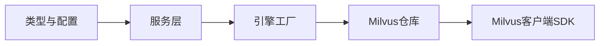

# Milvus集成

<cite>
**本文引用的文件**
- [repository.go](file://internal/application/repository/retriever/milvus/repository.go)
- [filter.go](file://internal/application/repository/retriever/milvus/filter.go)
- [vectorstore.go](file://internal/types/vectorstore.go)
- [vectorstore.go](file://internal/handler/vectorstore.go)
- [vectorstore.go](file://internal/application/service/vectorstore.go)
- [engine_factory.go](file://internal/container/engine_factory.go)
- [docker-compose.yml](file://docker-compose.yml)
</cite>

## 目录
1. [简介](#简介)
2. [项目结构](#项目结构)
3. [核心组件](#核心组件)
4. [架构总览](#架构总览)
5. [详细组件分析](#详细组件分析)
6. [依赖分析](#依赖分析)
7. [性能考虑](#性能考虑)
8. [故障排查指南](#故障排查指南)
9. [结论](#结论)
10. [附录](#附录)

## 简介
本文件面向在WeKnora项目中集成Milvus向量数据库的开发者，系统性阐述Milvus分布式架构与部署模式（单机与集群）、Collection与Partition概念、向量字段与索引类型定义、不同索引类型的性能特征与选择策略、连接配置与认证机制、查询与插入API使用（含批量与事务处理）、高并发性能优化（连接池与缓存策略）、数据导入导出与备份恢复自动化方案，以及监控告警与故障诊断工具。

## 项目结构
WeKnora通过统一的向量存储抽象支持多种引擎，Milvus作为其中之一被封装在检索仓库层中，并由服务层与HTTP处理器协同完成配置、测试、注册与检索调用。关键模块如下：
- 类型与配置：定义向量存储类型、连接配置、索引配置及元数据描述
- 服务层：负责校验、去重、版本探测、持久化与动态注册
- HTTP处理器：对外暴露向量存储的CRUD与连通性测试接口
- 引擎工厂：根据配置创建Milvus客户端并初始化检索仓库
- Milvus仓库：实现Collection/索引创建、Upsert/BatchUpsert、查询、过滤、删除与更新等操作

图表来源
- [vectorstore.go:15-456](file://internal/handler/vectorstore.go#L15-L456)
- [vectorstore.go:1-190](file://internal/application/service/vectorstore.go#L1-L190)
- [engine_factory.go:145-164](file://internal/container/engine_factory.go#L145-L164)
- [repository.go:1-200](file://internal/application/repository/retriever/milvus/repository.go#L1-L200)
- [filter.go:1-100](file://internal/application/repository/retriever/milvus/filter.go#L1-L100)

章节来源
- [vectorstore.go:30-121](file://internal/types/vectorstore.go#L30-L121)
- [vectorstore.go:15-456](file://internal/handler/vectorstore.go#L15-L456)
- [vectorstore.go:1-190](file://internal/application/service/vectorstore.go#L1-L190)
- [engine_factory.go:145-164](file://internal/container/engine_factory.go#L145-L164)
- [repository.go:1-200](file://internal/application/repository/retriever/milvus/repository.go#L1-L200)
- [filter.go:1-100](file://internal/application/repository/retriever/milvus/filter.go#L1-L100)

## 核心组件
- 向量存储类型与配置
  - 支持引擎类型：Milvus、Qdrant、Weaviate、Elasticsearch、Postgres、SQLite
  - 连接配置：地址、用户名、密码、API密钥、TLS开关等
  - 索引配置：集合名、分片数、副本数等
- Milvus仓库
  - 动态按维度命名的Collection（以基础名为前缀加维度后缀）
  - 自动创建Schema（主键id、向量字段embedding、文本字段content、稀疏BM25字段content_sparse、布尔启用字段is_enabled等）
  - 自动创建索引（HNSW向量索引、BM25稀疏索引、自动payload索引）
  - 自动加载集合（可设置内存副本数）
- 过滤器
  - 统一的过滤条件结构，支持比较、逻辑、IN、BETWEEN等操作符
  - 转换为Milvus表达式与模板参数
- 服务与HTTP处理器
  - 创建/更新/删除向量存储
  - 连通性测试与版本探测
  - 注册到运行时引擎注册表

章节来源
- [vectorstore.go:30-121](file://internal/types/vectorstore.go#L30-L121)
- [vectorstore.go:203-376](file://internal/types/vectorstore.go#L203-L376)
- [repository.go:44-208](file://internal/application/repository/retriever/milvus/repository.go#L44-L208)
- [filter.go:12-74](file://internal/application/repository/retriever/milvus/filter.go#L12-L74)

## 架构总览
下图展示了Milvus集成在WeKnora中的端到端调用链：HTTP请求经处理器进入服务层，服务层创建/更新向量存储并进行连通性测试与注册；运行时通过引擎工厂创建Milvus客户端，Milvus仓库负责Collection生命周期管理与检索操作。

图表来源
- [vectorstore.go:94-128](file://internal/handler/vectorstore.go#L94-L128)
- [vectorstore.go:36-99](file://internal/application/service/vectorstore.go#L36-L99)
- [engine_factory.go:145-164](file://internal/container/engine_factory.go#L145-L164)
- [repository.go:86-208](file://internal/application/repository/retriever/milvus/repository.go#L86-L208)

## 详细组件分析

### Milvus仓库类与方法
Milvus仓库负责Collection的创建、加载、Upsert/BatchUpsert、查询、关键词检索、过滤、删除与批量更新等。

图表来源
- [repository.go:44-208](file://internal/application/repository/retriever/milvus/repository.go#L44-L208)
- [filter.go:71-158](file://internal/application/repository/retriever/milvus/filter.go#L71-L158)

章节来源
- [repository.go:44-208](file://internal/application/repository/retriever/milvus/repository.go#L44-L208)
- [filter.go:71-158](file://internal/application/repository/retriever/milvus/filter.go#L71-L158)

### 查询与过滤流程
Milvus仓库将通用过滤条件转换为Milvus表达式，支持AND/OR/IN/BETWEEN/比较等操作符，并支持模板参数注入。

图表来源
- [filter.go:76-205](file://internal/application/repository/retriever/milvus/filter.go#L76-L205)

章节来源
- [filter.go:76-205](file://internal/application/repository/retriever/milvus/filter.go#L76-L205)

### 插入与批量插入流程
- 单条插入：转换为内部嵌入对象，自动生成主键ID，执行Upsert
- 批量插入：按维度分组，每组维度对应一个Collection，统一执行Upsert

图表来源
- [repository.go:234-328](file://internal/application/repository/retriever/milvus/repository.go#L234-L328)

章节来源
- [repository.go:234-328](file://internal/application/repository/retriever/milvus/repository.go#L234-L328)

### 查询与关键词检索
- 向量检索：指定TopK与阈值，支持半径参数，结合过滤条件与输出字段
- 关键词检索：对所有匹配集合执行BM25稀疏向量搜索，汇总TopK结果

图表来源
- [repository.go:656-792](file://internal/application/repository/retriever/milvus/repository.go#L656-L792)

章节来源
- [repository.go:656-792](file://internal/application/repository/retriever/milvus/repository.go#L656-L792)

### 过滤器转换与表达式生成
- 支持的操作符：等于、不等于、大于、小于、LIKE、IN、BETWEEN、AND、OR
- 参数命名规则：字段名替换点号为下划线并追加计数器
- 字符串转义：双引号转义

图表来源
- [filter.go:76-205](file://internal/application/repository/retriever/milvus/filter.go#L76-L205)

章节来源
- [filter.go:76-205](file://internal/application/repository/retriever/milvus/filter.go#L76-L205)

## 依赖分析
- 类型与配置
  - 向量存储类型、连接配置、索引配置与元数据描述
- 服务层
  - 校验、去重、版本探测、持久化、注册
- 引擎工厂
  - 基于连接配置创建Milvus客户端（含超时与认证）
- Milvus仓库
  - 依赖Milvus客户端SDK，实现Collection生命周期与检索

图表来源
- [vectorstore.go:30-121](file://internal/types/vectorstore.go#L30-L121)
- [vectorstore.go:36-99](file://internal/application/service/vectorstore.go#L36-L99)
- [engine_factory.go:145-164](file://internal/container/engine_factory.go#L145-L164)
- [repository.go:1-200](file://internal/application/repository/retriever/milvus/repository.go#L1-L200)

章节来源
- [vectorstore.go:30-121](file://internal/types/vectorstore.go#L30-L121)
- [vectorstore.go:36-99](file://internal/application/service/vectorstore.go#L36-L99)
- [engine_factory.go:145-164](file://internal/container/engine_factory.go#L145-L164)
- [repository.go:1-200](file://internal/application/repository/retriever/milvus/repository.go#L1-L200)

## 性能考虑
- 索引类型与性能特征
  - HNSW：适合高维向量近似最近邻检索，支持自定义M与efConstruction等参数；在WeKnora中默认创建HNSW索引
  - IVF_FLAT：倒排文件索引，适合大规模向量检索；仓库估算显示索引开销与向量大小相关
  - IVF_SQ8：标量量化索引，压缩比更高但精度略降；可按需引入
  - BM25：用于稀疏文本检索，配合content_sparse字段实现关键词检索
- 存储与索引估算
  - 仓库提供估算函数，综合payload、向量与索引、元数据等开销
- 并发与吞吐
  - 分片数（shards_num）影响写入并行度
  - 内存副本数（replica_number）影响查询并发与HA
- 查询优化
  - 合理设置TopK与阈值，避免返回过多结果
  - 使用过滤条件减少扫描范围
- 批量操作
  - 批量Upsert显著提升写入效率
- 缓存与连接池
  - 建议在应用侧复用Milvus客户端实例，避免频繁拨号
  - 对热点查询结果进行短期缓存（需结合业务场景）

章节来源
- [repository.go:167-176](file://internal/application/repository/retriever/milvus/repository.go#L167-L176)
- [repository.go:218-231](file://internal/application/repository/retriever/milvus/repository.go#L218-L231)
- [repository.go:916-940](file://internal/application/repository/retriever/milvus/repository.go#L916-L940)

## 故障排查指南
- 连接与认证
  - 通过HTTP接口测试向量存储连通性，服务层会探测版本并保存到连接配置
  - 工厂层创建Milvus客户端时支持用户名/密码与超时配置
- 集合与索引
  - 若集合不存在，仓库会自动创建并加载；若加载失败，检查分片与副本配置
  - 确认集合命名规则（基础名+维度后缀），避免冲突
- 查询异常
  - 检查过滤表达式是否正确生成，参数是否传入
  - 确认集合已加载且副本数满足查询需求
- 导入/导出与备份
  - 当前仓库未提供直接的导入/导出/备份接口；建议通过外部工具或Milvus官方工具链实现
- 监控与日志
  - 服务层与仓库均记录关键操作日志，便于定位问题

章节来源
- [vectorstore.go:355-417](file://internal/handler/vectorstore.go#L355-L417)
- [vectorstore.go:75-85](file://internal/application/service/vectorstore.go#L75-L85)
- [engine_factory.go:145-164](file://internal/container/engine_factory.go#L145-L164)
- [repository.go:86-208](file://internal/application/repository/retriever/milvus/repository.go#L86-L208)

## 结论
WeKnora对Milvus的集成通过统一的类型与配置体系、服务层的校验与注册、以及Milvus仓库的Collection生命周期管理与检索能力，实现了开箱即用的向量检索能力。通过合理选择索引类型、配置分片与副本、利用批量与过滤优化查询，可在高并发场景下获得稳定性能。建议结合外部工具完善数据导入导出与备份恢复流程，并持续关注日志与监控以保障生产环境稳定性。

## 附录

### Milvus部署模式与配置要点
- 单机版
  - 使用默认地址与端口，无需额外认证（如未启用安全）
  - 可通过环境变量覆盖集合名与度量类型
- 集群版
  - 配置用户名/密码与合适的分片/副本数
  - 通过环境变量设置集合名与度量类型，确保与应用一致

章节来源
- [docker-compose.yml:100-102](file://docker-compose.yml#L100-L102)
- [engine_factory.go:145-164](file://internal/container/engine_factory.go#L145-L164)
- [repository.go:44-78](file://internal/application/repository/retriever/milvus/repository.go#L44-L78)

### Collection与Partition概念
- Collection：Milvus中向量与元数据的逻辑容器，WeKnora按维度动态命名（基础名+“_维度”）
- Partition：Milvus支持分区，可用于多租户或时间维度的数据隔离；当前仓库未显式使用分区，建议在更高层业务逻辑中结合使用

章节来源
- [repository.go:80-83](file://internal/application/repository/retriever/milvus/repository.go#L80-L83)
- [repository.go:106-157](file://internal/application/repository/retriever/milvus/repository.go#L106-L157)

### 向量字段与索引类型定义
- 字段
  - 主键id（字符串，最大长度限制）
  - 向量字段embedding（浮点向量，维度由输入决定）
  - 文本字段content（启用分析器与匹配）
  - 稀疏向量字段content_sparse（BM25函数）
  - 元数据字段：source_id、source_type、chunk_id、knowledge_id、knowledge_base_id、tag_id、is_enabled
- 索引
  - 向量索引：HNSW（基于度量类型）
  - 文本索引：BM25（稀疏向量）
  - 载荷索引：自动为常用过滤字段创建

章节来源
- [repository.go:106-176](file://internal/application/repository/retriever/milvus/repository.go#L106-L176)

### 不同索引类型的性能特征与选择策略
- HNSW
  - 优点：近似最近邻检索效果好，支持自定义参数
  - 适用：高维向量、对召回率要求较高
- IVF_FLAT
  - 优点：召回稳定，实现简单
  - 适用：大规模向量、对精度敏感
- IVF_SQ8
  - 优点：内存占用低
  - 适用：内存受限、可接受轻微精度损失
- BM25
  - 优点：关键词检索高效
  - 适用：混合检索（向量+关键词）

章节来源
- [repository.go:167-176](file://internal/application/repository/retriever/milvus/repository.go#L167-L176)
- [repository.go:916-940](file://internal/application/repository/retriever/milvus/repository.go#L916-L940)

### 连接配置与认证机制
- 连接配置
  - 地址、用户名、密码、API密钥、TLS开关等
  - 环境变量覆盖：Milvus地址、集合名、度量类型
- 认证
  - 工厂层支持用户名/密码认证
  - 服务层连通性测试会探测版本并保存

章节来源
- [vectorstore.go:101-121](file://internal/types/vectorstore.go#L101-L121)
- [engine_factory.go:145-164](file://internal/container/engine_factory.go#L145-L164)
- [vectorstore.go:75-85](file://internal/application/service/vectorstore.go#L75-L85)

### 查询与插入API使用
- 插入
  - Save：单条Upsert
  - BatchSave：按维度分组批量Upsert
- 删除
  - 按chunk_id、knowledge_id、source_id删除
- 更新
  - 批量更新chunk启用状态与标签ID
- 查询
  - VectorRetrieve：向量相似度检索
  - KeywordsRetrieve：关键词检索（BM25）

章节来源
- [repository.go:234-328](file://internal/application/repository/retriever/milvus/repository.go#L234-L328)
- [repository.go:331-401](file://internal/application/repository/retriever/milvus/repository.go#L331-L401)
- [repository.go:403-488](file://internal/application/repository/retriever/milvus/repository.go#L403-L488)
- [repository.go:656-792](file://internal/application/repository/retriever/milvus/repository.go#L656-L792)

### 高并发性能优化
- 连接池
  - 复用Milvus客户端实例，避免频繁拨号
- 缓存策略
  - 对热点查询结果进行短期缓存（需结合业务）
- 并行写入
  - 使用BatchSave按维度分组批量写入
- 资源配置
  - 合理设置分片数与副本数，平衡写入并行与查询吞吐

章节来源
- [engine_factory.go:145-164](file://internal/container/engine_factory.go#L145-L164)
- [repository.go:268-328](file://internal/application/repository/retriever/milvus/repository.go#L268-L328)

### 数据导入导出与备份恢复自动化
- 当前仓库未提供直接的导入/导出/备份接口
- 建议方案
  - 使用外部工具或Milvus官方工具链进行数据迁移
  - 在应用层增加定时任务或触发器，结合外部存储实现自动化备份与恢复

章节来源
- [repository.go:794-800](file://internal/application/repository/retriever/milvus/repository.go#L794-L800)

### 监控告警与故障诊断
- 监控
  - 服务层与仓库记录关键操作日志
  - 建议接入应用级指标（请求量、延迟、错误率）
- 故障诊断
  - 通过HTTP接口测试连通性与版本
  - 检查集合是否存在、是否已加载、副本数是否满足需求
  - 校验过滤表达式与参数

章节来源
- [vectorstore.go:355-417](file://internal/handler/vectorstore.go#L355-L417)
- [repository.go:86-208](file://internal/application/repository/retriever/milvus/repository.go#L86-L208)