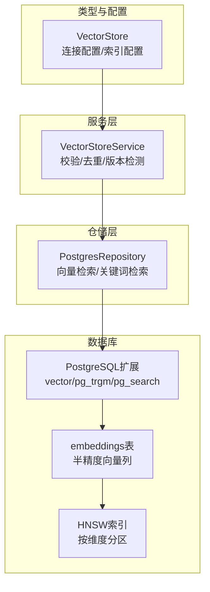
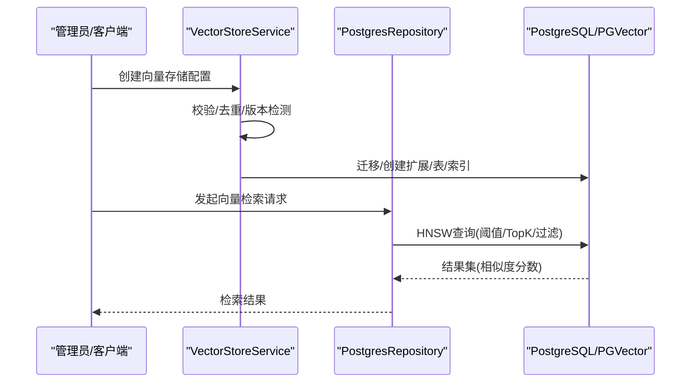
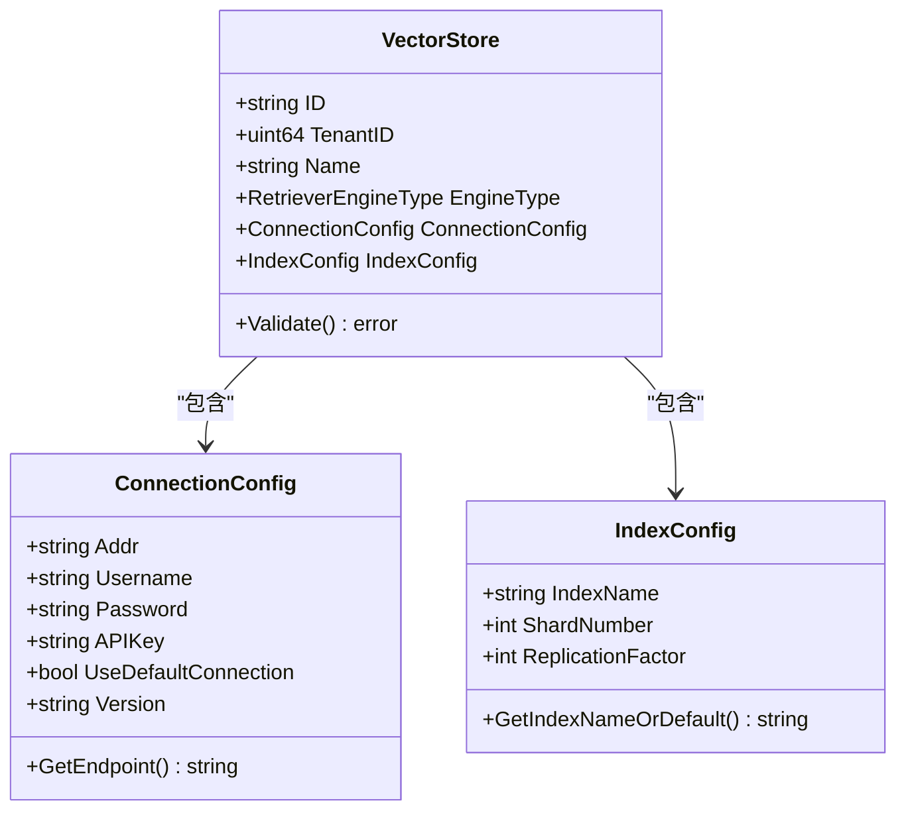
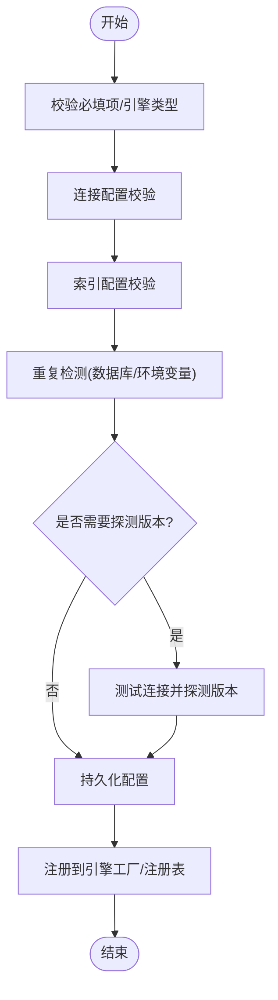
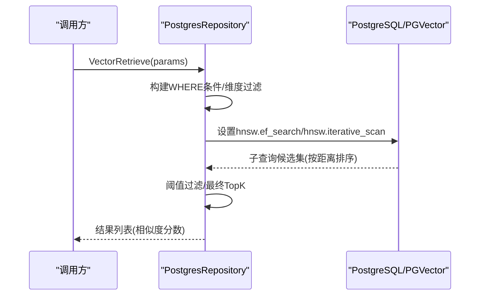
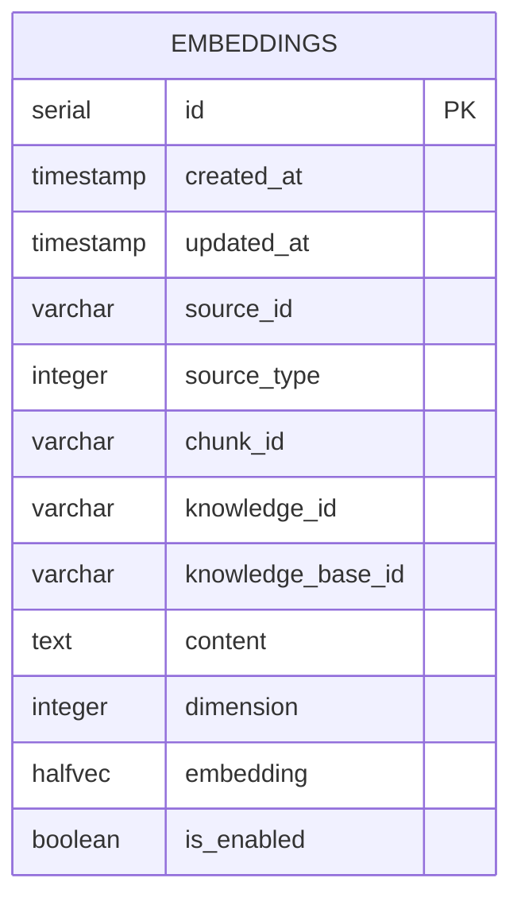
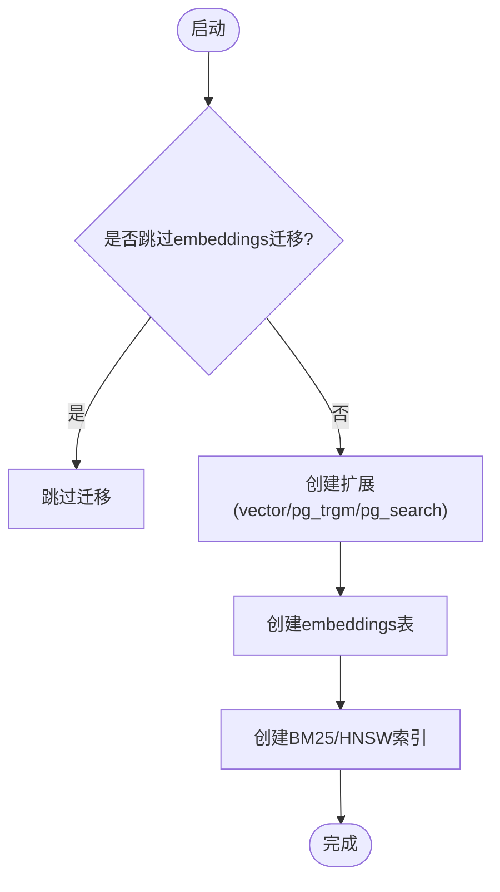
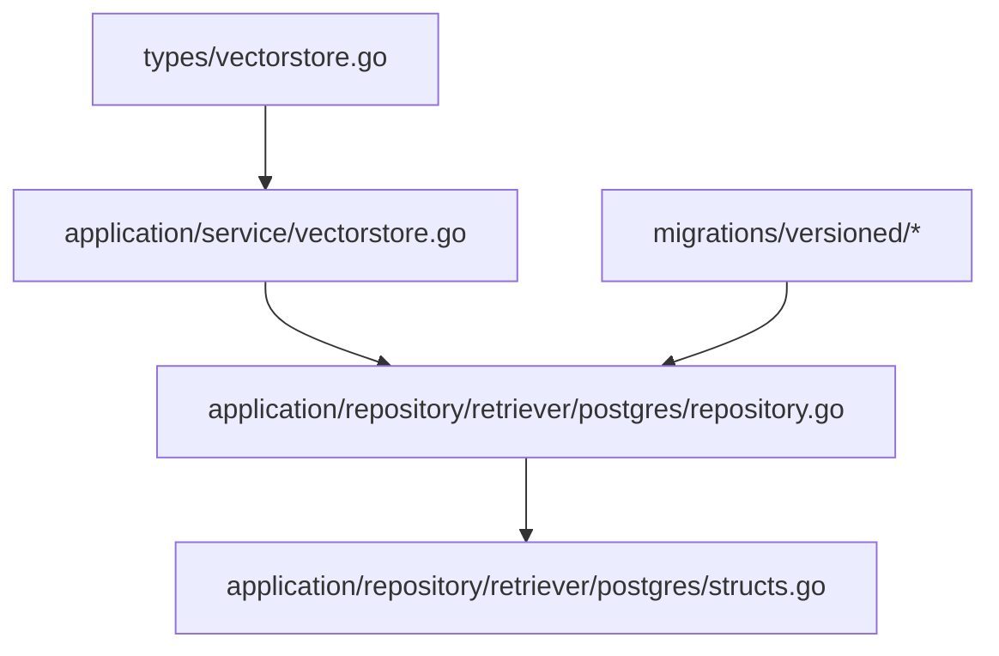

# PostgreSQL pgvector集成

<cite>
**本文档引用的文件**
- [internal/types/vectorstore.go](file://internal/types/vectorstore.go)
- [internal/application/service/vectorstore.go](file://internal/application/service/vectorstore.go)
- [internal/application/repository/vectorstore.go](file://internal/application/repository/vectorstore.go)
- [internal/application/repository/retriever/postgres/repository.go](file://internal/application/repository/retriever/postgres/repository.go)
- [internal/application/repository/retriever/postgres/structs.go](file://internal/application/repository/retriever/postgres/structs.go)
- [migrations/versioned/000032_vector_stores.up.sql](file://migrations/versioned/000032_vector_stores.up.sql)
- [migrations/versioned/000032_vector_stores.down.sql](file://migrations/versioned/000032_vector_stores.down.sql)
- [migrations/versioned/000002_embeddings.up.sql](file://migrations/versioned/000002_embeddings.up.sql)
- [internal/database/migration.go](file://internal/database/migration.go)
- [internal/application/service/vectorstore_healthcheck.go](file://internal/application/service/vectorstore_healthcheck.go)
- [scripts/migrate.sh](file://scripts/migrate.sh)
</cite>

## 目录
1. [简介](#简介)
2. [项目结构](#项目结构)
3. [核心组件](#核心组件)
4. [架构总览](#架构总览)
5. [详细组件分析](#详细组件分析)
6. [依赖关系分析](#依赖关系分析)
7. [性能考虑](#性能考虑)
8. [故障排除指南](#故障排除指南)
9. [结论](#结论)
10. [附录](#附录)

## 简介
本文件面向在WeKnora项目中集成PostgreSQL pgvector向量数据库的开发者与运维人员，系统性阐述从安装配置、表结构设计、索引策略、查询优化到连接配置与迁移备份的完整实践路径。重点覆盖以下方面：
- PostgreSQL版本兼容性与pgvector扩展启用
- 向量数据类型定义与HNSW索引策略（含维度感知）
- 嵌入向量的存储结构与查询优化技术
- 连接配置示例（默认连接与外部连接）、连接池与超时参数
- SQL查询语法与性能调优（相似度计算、阈值过滤、TopK限制）
- 复合查询与过滤条件实现
- 数据迁移脚本与备份恢复策略
- 常见问题与故障排除

## 项目结构
WeKnora通过模块化方式组织向量检索能力，核心围绕以下层次展开：
- 类型与配置层：定义向量存储配置、连接参数与索引配置
- 服务层：负责校验、去重、版本检测与持久化
- 仓储层：封装PostgreSQL访问逻辑，包含向量检索与关键词检索
- 迁移层：自动创建扩展、表与索引，并支持回滚

**图表来源**
- [internal/types/vectorstore.go:30-50](file://internal/types/vectorstore.go#L30-L50)
- [internal/application/service/vectorstore.go:36-99](file://internal/application/service/vectorstore.go#L36-L99)
- [internal/application/repository/retriever/postgres/repository.go:19-38](file://internal/application/repository/retriever/postgres/repository.go#L19-L38)
- [migrations/versioned/000002_embeddings.up.sql:15-95](file://migrations/versioned/000002_embeddings.up.sql#L15-L95)

**章节来源**
- [internal/types/vectorstore.go:30-50](file://internal/types/vectorstore.go#L30-L50)
- [internal/application/service/vectorstore.go:36-99](file://internal/application/service/vectorstore.go#L36-L99)
- [internal/application/repository/retriever/postgres/repository.go:19-38](file://internal/application/repository/retriever/postgres/repository.go#L19-L38)
- [migrations/versioned/000002_embeddings.up.sql:15-95](file://migrations/versioned/000002_embeddings.up.sql#L15-L95)

## 核心组件
- 向量存储配置模型：支持多租户隔离、引擎类型选择（含PostgreSQL）、连接参数与索引配置
- 服务层：统一校验、重复检测、版本探测与注册
- PostgreSQL检索仓库：实现关键词检索与向量检索，内置HNSW优化与阈值过滤
- 迁移脚本：自动创建扩展、表与索引，支持条件执行与回滚

**章节来源**
- [internal/types/vectorstore.go:30-50](file://internal/types/vectorstore.go#L30-L50)
- [internal/application/service/vectorstore.go:36-99](file://internal/application/service/vectorstore.go#L36-L99)
- [internal/application/repository/retriever/postgres/repository.go:19-38](file://internal/application/repository/retriever/postgres/repository.go#L19-L38)
- [migrations/versioned/000002_embeddings.up.sql:15-95](file://migrations/versioned/000002_embeddings.up.sql#L15-L95)

## 架构总览
下图展示了从配置到查询的端到端流程，强调PostgreSQL与pgvector的集成点。

**图表来源**
- [internal/application/service/vectorstore.go:36-99](file://internal/application/service/vectorstore.go#L36-L99)
- [internal/application/repository/retriever/postgres/repository.go:263-483](file://internal/application/repository/retriever/postgres/repository.go#L263-L483)
- [migrations/versioned/000002_embeddings.up.sql:15-95](file://migrations/versioned/000002_embeddings.up.sql#L15-L95)

## 详细组件分析

### 向量存储配置模型
- 支持多租户隔离与引擎类型枚举，PostgreSQL作为受支持引擎之一
- ConnectionConfig支持默认连接与外部连接两种模式；敏感字段加密存储
- IndexConfig提供索引名称与分片/副本等可选配置

**图表来源**
- [internal/types/vectorstore.go:30-50](file://internal/types/vectorstore.go#L30-L50)
- [internal/types/vectorstore.go:101-121](file://internal/types/vectorstore.go#L101-L121)
- [internal/types/vectorstore.go:203-220](file://internal/types/vectorstore.go#L203-L220)

**章节来源**
- [internal/types/vectorstore.go:30-50](file://internal/types/vectorstore.go#L30-L50)
- [internal/types/vectorstore.go:101-121](file://internal/types/vectorstore.go#L101-L121)
- [internal/types/vectorstore.go:203-220](file://internal/types/vectorstore.go#L203-L220)

### 服务层：创建与健康检查
- 创建向量存储时进行基础校验、连接配置校验、索引配置校验与重复检测
- 通过TestConnection探测服务器版本（PostgreSQL默认连接场景返回空版本）
- 成功后持久化并尝试注册到运行时注册表

**图表来源**
- [internal/application/service/vectorstore.go:36-99](file://internal/application/service/vectorstore.go#L36-L99)
- [internal/application/service/vectorstore_healthcheck.go:95-111](file://internal/application/service/vectorstore_healthcheck.go#L95-L111)

**章节来源**
- [internal/application/service/vectorstore.go:36-99](file://internal/application/service/vectorstore.go#L36-L99)
- [internal/application/service/vectorstore_healthcheck.go:95-111](file://internal/application/service/vectorstore_healthcheck.go#L95-L111)

### PostgreSQL检索仓库：向量检索与关键词检索
- 向量检索采用子查询+阈值过滤+TopK限制的策略，结合HNSW索引表达式匹配与GUC参数优化
- 关键词检索基于BM25索引，支持多字段过滤与排序
- 提供批量保存、删除、复制索引、批量更新状态与标签ID等操作

**图表来源**
- [internal/application/repository/retriever/postgres/repository.go:263-483](file://internal/application/repository/retriever/postgres/repository.go#L263-L483)

**章节来源**
- [internal/application/repository/retriever/postgres/repository.go:263-483](file://internal/application/repository/retriever/postgres/repository.go#L263-L483)
- [internal/application/repository/retriever/postgres/repository.go:163-261](file://internal/application/repository/retriever/postgres/repository.go#L163-L261)

### 数据模型与索引策略
- 表结构：embeddings表，包含source_id、source_type、chunk_id、knowledge_id、knowledge_base_id、content、dimension、embedding等字段
- 向量类型：halfvec（半精度浮点），节省存储空间
- 索引策略：HNSW索引按维度分区（如798、3584），表达式索引确保ORDER BY与索引表达式完全一致以避免回退到顺序扫描
- 关键词检索：BM25索引，支持中文分词器

**图表来源**
- [migrations/versioned/000002_embeddings.up.sql:23-36](file://migrations/versioned/000002_embeddings.up.sql#L23-L36)
- [internal/application/repository/retriever/postgres/structs.go:14-29](file://internal/application/repository/retriever/postgres/structs.go#L14-L29)

**章节来源**
- [migrations/versioned/000002_embeddings.up.sql:23-36](file://migrations/versioned/000002_embeddings.up.sql#L23-L36)
- [internal/application/repository/retriever/postgres/structs.go:14-29](file://internal/application/repository/retriever/postgres/structs.go#L14-L29)

### 连接配置与迁移
- 默认连接：通过应用主数据库连接直接使用，无需额外地址配置
- 外部连接：需提供连接地址，服务层会进行可达性测试
- 迁移脚本：自动创建vector、pg_trgm、pg_search扩展，创建embeddings表与索引，支持条件执行与回滚
- 迁移工具：支持脏状态自动恢复或强制回滚

**图表来源**
- [migrations/versioned/000002_embeddings.up.sql:4-10](file://migrations/versioned/000002_embeddings.up.sql#L4-L10)
- [migrations/versioned/000002_embeddings.up.sql:15-95](file://migrations/versioned/000002_embeddings.up.sql#L15-L95)

**章节来源**
- [internal/application/service/vectorstore.go:162-189](file://internal/application/service/vectorstore.go#L162-L189)
- [internal/application/service/vectorstore_healthcheck.go:95-111](file://internal/application/service/vectorstore_healthcheck.go#L95-L111)
- [migrations/versioned/000002_embeddings.up.sql:4-10](file://migrations/versioned/000002_embeddings.up.sql#L4-L10)
- [migrations/versioned/000002_embeddings.up.sql:15-95](file://migrations/versioned/000002_embeddings.up.sql#L15-L95)
- [internal/database/migration.go:39-208](file://internal/database/migration.go#L39-L208)

## 依赖关系分析
- 类型层与服务层解耦，服务层仅依赖类型定义与接口
- 仓储层依赖GORM与pgvector-go，实现具体数据库操作
- 迁移脚本独立于应用运行时，通过条件语句控制执行

**图表来源**
- [internal/types/vectorstore.go:30-50](file://internal/types/vectorstore.go#L30-L50)
- [internal/application/service/vectorstore.go:16-34](file://internal/application/service/vectorstore.go#L16-L34)
- [internal/application/repository/retriever/postgres/repository.go:19-38](file://internal/application/repository/retriever/postgres/repository.go#L19-L38)
- [internal/application/repository/retriever/postgres/structs.go:14-29](file://internal/application/repository/retriever/postgres/structs.go#L14-L29)
- [migrations/versioned/000002_embeddings.up.sql:15-95](file://migrations/versioned/000002_embeddings.up.sql#L15-L95)

**章节来源**
- [internal/types/vectorstore.go:30-50](file://internal/types/vectorstore.go#L30-L50)
- [internal/application/service/vectorstore.go:16-34](file://internal/application/service/vectorstore.go#L16-L34)
- [internal/application/repository/retriever/postgres/repository.go:19-38](file://internal/application/repository/retriever/postgres/repository.go#L19-L38)
- [internal/application/repository/retriever/postgres/structs.go:14-29](file://internal/application/repository/retriever/postgres/structs.go#L14-L29)
- [migrations/versioned/000002_embeddings.up.sql:15-95](file://migrations/versioned/000002_embeddings.up.sql#L15-L95)

## 性能考虑
- 存储与索引开销估算：文本内容、半精度向量（每维2字节）、元数据固定开销、HNSW索引约等于向量大小的2倍
- 向量检索优化：
  - 使用子查询先选出候选再阈值过滤，避免全表扫描
  - HNSW索引表达式必须与ORDER BY完全一致，否则回退顺序扫描
  - 通过事务设置hnsw.ef_search与hnsw.iterative_scan提升召回率与稳定性
  - TopK扩展策略：在100~200之间平衡召回与性能
- 关键词检索：BM25索引配合中文分词器，支持多字段过滤与排序

**章节来源**
- [internal/application/repository/retriever/postgres/repository.go:41-77](file://internal/application/repository/retriever/postgres/repository.go#L41-L77)
- [internal/application/repository/retriever/postgres/repository.go:361-433](file://internal/application/repository/retriever/postgres/repository.go#L361-L433)
- [migrations/versioned/000002_embeddings.up.sql:57-91](file://migrations/versioned/000002_embeddings.up.sql#L57-L91)

## 故障排除指南
- 连接失败
  - 检查UseDefaultConnection与外部连接地址配置
  - 使用服务层的TestConnection进行连通性验证
- 版本不兼容
  - 对于PostgreSQL默认连接，无法探测版本；外部连接可自动探测
  - 若HNSW相关GUC不可用，代码已提供降级重试路径
- 迁移失败
  - 检查脏状态并根据提示执行强制回滚或修复
  - 条件迁移可通过设置特定参数跳过
- 查询性能差
  - 确认HNSW索引表达式与ORDER BY一致
  - 调整TopK扩展范围与阈值，观察ef_search与iterative_scan效果

**章节来源**
- [internal/application/service/vectorstore_healthcheck.go:95-111](file://internal/application/service/vectorstore_healthcheck.go#L95-L111)
- [internal/application/repository/retriever/postgres/repository.go:435-443](file://internal/application/repository/retriever/postgres/repository.go#L435-L443)
- [internal/database/migration.go:110-187](file://internal/database/migration.go#L110-L187)
- [migrations/versioned/000002_embeddings.up.sql:4-10](file://migrations/versioned/000002_embeddings.up.sql#L4-L10)

## 结论
WeKnora对PostgreSQL pgvector的集成遵循“配置即服务”的理念：通过清晰的类型定义、严格的校验与去重、自动化的迁移与索引创建，以及针对HNSW的深度优化，实现了高可用、高性能的向量检索能力。建议在生产环境中：
- 明确连接模式（默认/外部），合理设置超时与重试
- 根据业务规模与召回需求调整TopK扩展与阈值
- 定期监控索引命中率与查询延迟，必要时重建索引或调整参数

## 附录

### 安装与配置步骤
- 启用扩展：在目标数据库中创建vector、pg_trgm、pg_search扩展
- 创建表与索引：执行embeddings迁移脚本，按需创建BM25与HNSW索引
- 配置向量存储：通过服务层创建VectorStore，选择PostgreSQL引擎类型
- 连接模式：
  - 默认连接：无需额外地址，直接复用应用主数据库连接
  - 外部连接：提供连接地址，服务层进行可达性测试

**章节来源**
- [migrations/versioned/000002_embeddings.up.sql:15-95](file://migrations/versioned/000002_embeddings.up.sql#L15-L95)
- [internal/application/service/vectorstore.go:162-189](file://internal/application/service/vectorstore.go#L162-L189)
- [internal/application/service/vectorstore_healthcheck.go:95-111](file://internal/application/service/vectorstore_healthcheck.go#L95-L111)

### 向量数据类型与索引策略
- 数据类型：halfvec（半精度向量）
- 索引策略：HNSW按维度分区，表达式索引确保与ORDER BY一致
- 关键词索引：BM25，支持中文分词

**章节来源**
- [migrations/versioned/000002_embeddings.up.sql:57-91](file://migrations/versioned/000002_embeddings.up.sql#L57-L91)
- [internal/application/repository/retriever/postgres/structs.go:14-29](file://internal/application/repository/retriever/postgres/structs.go#L14-L29)

### 查询语法与性能调优
- 相似度计算：使用向量间的余弦距离，转换为相似度分数
- 阈值过滤：先子查询取候选，再按阈值过滤
- TopK限制：最终限制返回数量
- GUC优化：hnsw.ef_search与hnsw.iterative_scan提升召回与稳定性

**章节来源**
- [internal/application/repository/retriever/postgres/repository.go:361-433](file://internal/application/repository/retriever/postgres/repository.go#L361-L433)

### 复合查询与过滤条件
- 支持按知识库ID、知识ID、标签ID进行AND过滤
- 支持is_enabled状态过滤
- 关键词检索使用BM25匹配任意token

**章节来源**
- [internal/application/repository/retriever/postgres/repository.go:285-335](file://internal/application/repository/retriever/postgres/repository.go#L285-L335)
- [internal/application/repository/retriever/postgres/repository.go:163-261](file://internal/application/repository/retriever/postgres/repository.go#L163-L261)

### 连接配置示例与超时参数
- 默认连接：UseDefaultConnection=true，无需额外地址
- 外部连接：提供Addr（PostgreSQL连接串），服务层进行Ping测试
- 超时：连接测试使用短超时上下文，避免阻塞

**章节来源**
- [internal/types/vectorstore.go:116-121](file://internal/types/vectorstore.go#L116-L121)
- [internal/application/service/vectorstore_healthcheck.go:95-111](file://internal/application/service/vectorstore_healthcheck.go#L95-L111)

### 迁移脚本与备份恢复
- 迁移脚本：支持条件执行（跳过标志）、创建扩展、表与索引
- 回滚脚本：提供表级回滚
- 迁移工具：支持脏状态自动恢复或强制回滚

**章节来源**
- [migrations/versioned/000002_embeddings.up.sql:4-10](file://migrations/versioned/000002_embeddings.up.sql#L4-L10)
- [migrations/versioned/000032_vector_stores.up.sql:1-29](file://migrations/versioned/000032_vector_stores.up.sql#L1-L29)
- [migrations/versioned/000032_vector_stores.down.sql:1-2](file://migrations/versioned/000032_vector_stores.down.sql#L1-L2)
- [internal/database/migration.go:39-208](file://internal/database/migration.go#L39-L208)