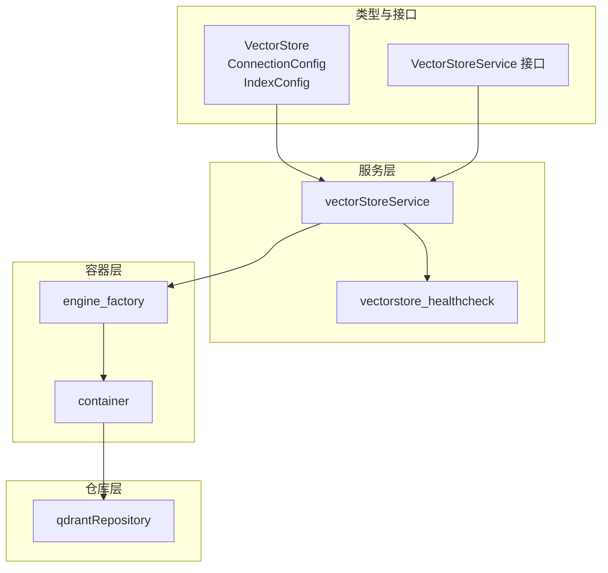
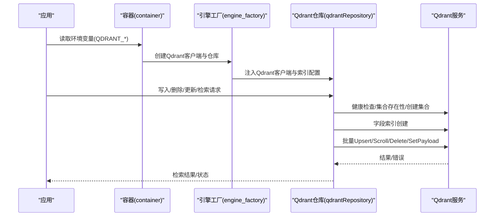
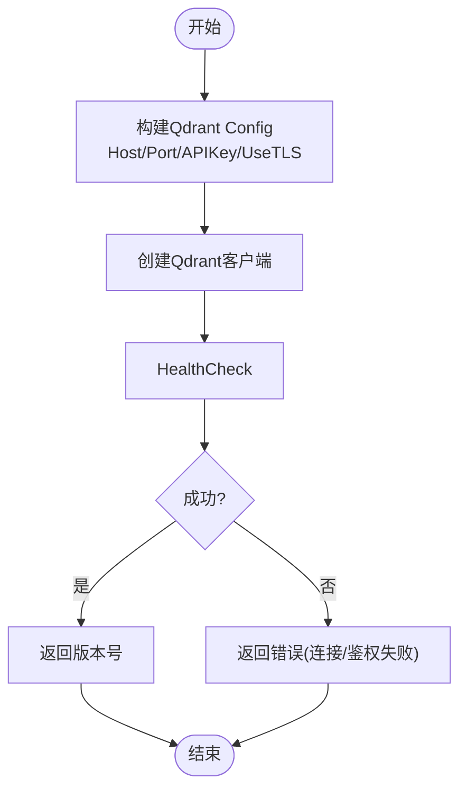
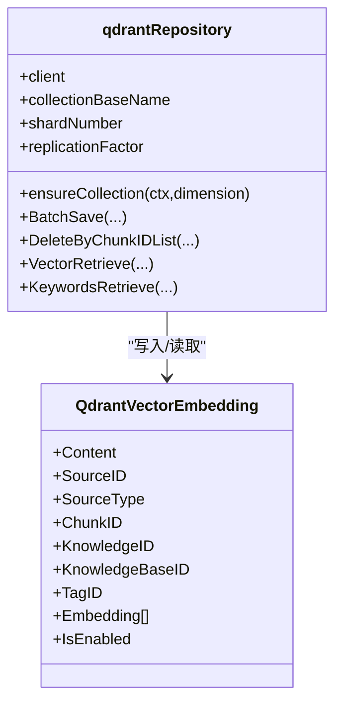
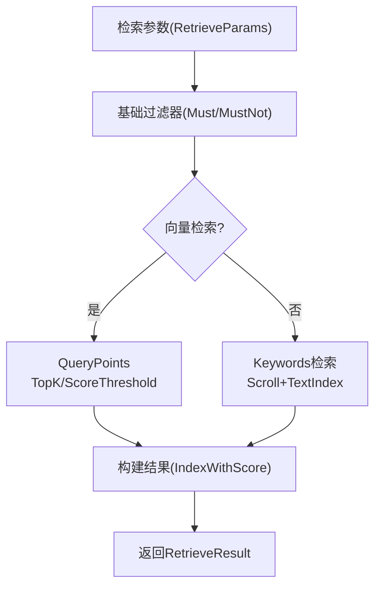
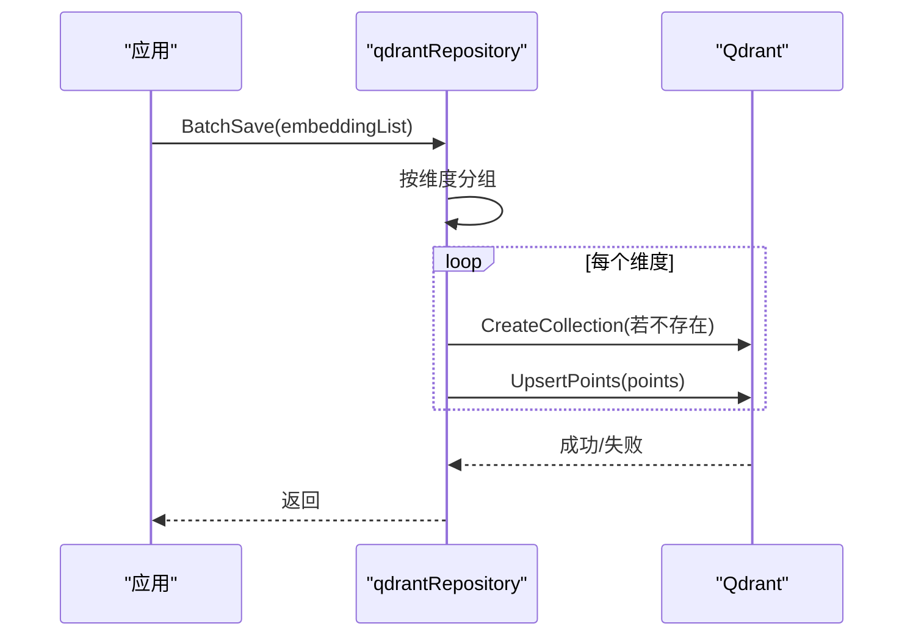
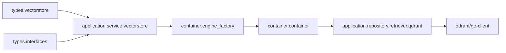

# Qdrant集成

<cite>
**本文引用的文件**
- [internal/application/service/vectorstore.go](file://internal/application/service/vectorstore.go)
- [internal/application/service/vectorstore_healthcheck.go](file://internal/application/service/vectorstore_healthcheck.go)
- [internal/application/repository/vectorstore.go](file://internal/application/repository/vectorstore.go)
- [internal/application/repository/retriever/qdrant/repository.go](file://internal/application/repository/retriever/qdrant/repository.go)
- [internal/application/repository/retriever/qdrant/structs.go](file://internal/application/repository/retriever/qdrant/structs.go)
- [internal/container/engine_factory.go](file://internal/container/engine_factory.go)
- [internal/container/container.go](file://internal/container/container.go)
- [internal/types/vectorstore.go](file://internal/types/vectorstore.go)
- [internal/types/retrieval_config.go](file://internal/types/retrieval_config.go)
- [internal/types/interfaces/vectorstore.go](file://internal/types/interfaces/vectorstore.go)
</cite>

## 目录
1. [简介](#简介)
2. [项目结构](#项目结构)
3. [核心组件](#核心组件)
4. [架构总览](#架构总览)
5. [详细组件分析](#详细组件分析)
6. [依赖分析](#依赖分析)
7. [性能考虑](#性能考虑)
8. [故障排查指南](#故障排查指南)
9. [结论](#结论)
10. [附录](#附录)

## 简介
本文件面向在WeKnora中集成Qdrant向量数据库的开发者与运维人员，系统性阐述Qdrant的配置、连接、索引与检索能力，覆盖以下主题：
- REST API与gRPC客户端配置与健康检查
- 向量集合(collection)与点(point)概念及数据模型
- 过滤器与搜索参数（TopK、阈值、维度）
- HNSW与Flat索引的配置与性能特征
- 批量写入、更新与删除
- 查询API：向量相似搜索、关键词检索与结果构建
- 高效数据导入策略：分批写入、断点续传思路
- 单机与集群部署要点
- 性能监控与调优建议（内存、延迟）

## 项目结构
WeKnora通过“服务层-仓库层-类型定义-容器工厂”的分层设计集成Qdrant：
- 类型与接口层：定义向量存储配置、索引配置、检索参数等
- 服务层：负责校验、去重、版本检测、注册引擎实例
- 仓库层：封装Qdrant客户端，实现集合创建、字段索引、写入/删除/更新、检索
- 容器层：根据环境变量或数据库配置动态创建Qdrant客户端与引擎服务

**图表来源**
- [internal/types/vectorstore.go:30-677](file://internal/types/vectorstore.go#L30-L677)
- [internal/application/service/vectorstore.go:16-190](file://internal/application/service/vectorstore.go#L16-L190)
- [internal/application/service/vectorstore_healthcheck.go:25-153](file://internal/application/service/vectorstore_healthcheck.go#L25-L153)
- [internal/container/engine_factory.go:32-143](file://internal/container/engine_factory.go#L32-L143)
- [internal/container/container.go:828-874](file://internal/container/container.go#L828-L874)
- [internal/application/repository/retriever/qdrant/repository.go:32-148](file://internal/application/repository/retriever/qdrant/repository.go#L32-L148)

**章节来源**
- [internal/types/vectorstore.go:30-677](file://internal/types/vectorstore.go#L30-L677)
- [internal/application/service/vectorstore.go:16-190](file://internal/application/service/vectorstore.go#L16-L190)
- [internal/application/service/vectorstore_healthcheck.go:25-153](file://internal/application/service/vectorstore_healthcheck.go#L25-L153)
- [internal/container/engine_factory.go:32-143](file://internal/container/engine_factory.go#L32-L143)
- [internal/container/container.go:828-874](file://internal/container/container.go#L828-L874)

## 核心组件
- 向量存储配置（VectorStore）：包含引擎类型、连接配置、索引配置
- 连接配置（ConnectionConfig）：支持Host/Port/APIKey/TLS等Qdrant参数
- 索引配置（IndexConfig）：支持Collection前缀、分片数、副本因子等
- 服务层（vectorStoreService）：创建/更新/删除向量存储；连接性测试与版本检测；注册引擎
- 仓库层（qdrantRepository）：集合创建与字段索引、批量写入、删除、更新、检索
- 引擎工厂（engine_factory）：按配置创建Qdrant客户端与检索引擎服务
- 容器初始化（container）：从环境变量读取Qdrant参数并注册检索引擎

**章节来源**
- [internal/types/vectorstore.go:30-677](file://internal/types/vectorstore.go#L30-L677)
- [internal/application/service/vectorstore.go:16-190](file://internal/application/service/vectorstore.go#L16-L190)
- [internal/application/repository/retriever/qdrant/repository.go:32-148](file://internal/application/repository/retriever/qdrant/repository.go#L32-L148)
- [internal/container/engine_factory.go:125-143](file://internal/container/engine_factory.go#L125-L143)
- [internal/container/container.go:828-874](file://internal/container/container.go#L828-L874)

## 架构总览
下图展示了从应用启动到Qdrant检索执行的端到端流程。

**图表来源**
- [internal/container/container.go:828-874](file://internal/container/container.go#L828-L874)
- [internal/container/engine_factory.go:125-143](file://internal/container/engine_factory.go#L125-L143)
- [internal/application/repository/retriever/qdrant/repository.go:56-140](file://internal/application/repository/retriever/qdrant/repository.go#L56-L140)

**章节来源**
- [internal/container/container.go:828-874](file://internal/container/container.go#L828-L874)
- [internal/container/engine_factory.go:125-143](file://internal/container/engine_factory.go#L125-L143)
- [internal/application/repository/retriever/qdrant/repository.go:56-140](file://internal/application/repository/retriever/qdrant/repository.go#L56-L140)

## 详细组件分析

### Qdrant连接与健康检查
- 服务层提供TestConnection，针对Qdrant使用HealthCheck进行连通性与版本检测
- 连接参数来自ConnectionConfig：Host、Port、APIKey、UseTLS
- 默认端口为6334，未设置时自动填充

**图表来源**
- [internal/application/service/vectorstore_healthcheck.go:126-153](file://internal/application/service/vectorstore_healthcheck.go#L126-L153)
- [internal/types/vectorstore.go:109-121](file://internal/types/vectorstore.go#L109-L121)

**章节来源**
- [internal/application/service/vectorstore_healthcheck.go:126-153](file://internal/application/service/vectorstore_healthcheck.go#L126-L153)
- [internal/types/vectorstore.go:109-121](file://internal/types/vectorstore.go#L109-L121)

### 向量集合与点(point)模型
- 集合(collection)命名规则：基于CollectionPrefix+“_”+维度，确保不同维度向量隔离
- 点(point)包含向量与负载(payload)，payload字段包括内容、来源、块ID、知识ID、知识库ID、标签ID、启用状态等
- 字段索引：为常用过滤字段创建Keyword/Bool/Text索引，提升检索效率

**图表来源**
- [internal/application/repository/retriever/qdrant/structs.go:9-34](file://internal/application/repository/retriever/qdrant/structs.go#L9-L34)
- [internal/application/repository/retriever/qdrant/repository.go:51-140](file://internal/application/repository/retriever/qdrant/repository.go#L51-L140)

**章节来源**
- [internal/application/repository/retriever/qdrant/structs.go:9-34](file://internal/application/repository/retriever/qdrant/structs.go#L9-L34)
- [internal/application/repository/retriever/qdrant/repository.go:51-140](file://internal/application/repository/retriever/qdrant/repository.go#L51-L140)

### 过滤器与搜索参数
- 过滤器基础条件：仅检索IsEnabled=true的点；支持按KnowledgeBaseID/KnowledgeID/TagID过滤；支持排除列表
- 向量检索：指定TopK与阈值，返回带分数的结果
- 关键词检索：对content字段使用多语言分词器，Tokenize后OR组合匹配

**图表来源**
- [internal/application/repository/retriever/qdrant/repository.go:482-518](file://internal/application/repository/retriever/qdrant/repository.go#L482-L518)
- [internal/application/repository/retriever/qdrant/repository.go:539-608](file://internal/application/repository/retriever/qdrant/repository.go#L539-L608)
- [internal/application/repository/retriever/qdrant/repository.go:610-706](file://internal/application/repository/retriever/qdrant/repository.go#L610-L706)

**章节来源**
- [internal/application/repository/retriever/qdrant/repository.go:482-518](file://internal/application/repository/retriever/qdrant/repository.go#L482-L518)
- [internal/application/repository/retriever/qdrant/repository.go:539-608](file://internal/application/repository/retriever/qdrant/repository.go#L539-L608)
- [internal/application/repository/retriever/qdrant/repository.go:610-706](file://internal/application/repository/retriever/qdrant/repository.go#L610-L706)

### 索引类型与性能特征
- HNSW（默认）：适合高维向量相似检索，支持Cosine距离；通过ShardNumber与ReplicationFactor控制可扩展性
- Flat：适用于小规模或低维场景，实现简单但扩展性差
- 仓库层默认使用Cosine距离与HNSW索引参数；Flat索引未在代码中直接体现，如需可扩展实现

**章节来源**
- [internal/application/repository/retriever/qdrant/repository.go:77-84](file://internal/application/repository/retriever/qdrant/repository.go#L77-L84)
- [internal/types/vectorstore.go:502-516](file://internal/types/vectorstore.go#L502-L516)

### 批量操作
- 批量写入：按维度分组，统一Upsert；维度不一致则拆分集合
- 批量删除：按ChunkID/KnowledgeID/SourceID删除
- 批量更新：支持启用状态与标签ID的跨集合批量更新

**图表来源**
- [internal/application/repository/retriever/qdrant/repository.go:206-265](file://internal/application/repository/retriever/qdrant/repository.go#L206-L265)

**章节来源**
- [internal/application/repository/retriever/qdrant/repository.go:206-265](file://internal/application/repository/retriever/qdrant/repository.go#L206-L265)
- [internal/application/repository/retriever/qdrant/repository.go:267-353](file://internal/application/repository/retriever/qdrant/repository.go#L267-L353)
- [internal/application/repository/retriever/qdrant/repository.go:355-428](file://internal/application/repository/retriever/qdrant/repository.go#L355-L428)

### 查询API使用
- 向量检索：指定Embedding、TopK、阈值，返回带分数的匹配结果
- 关键词检索：对content字段进行多语言分词后OR匹配
- 结果构建：统一包装为RetrieveResult，包含引擎类型与检索类型

**章节来源**
- [internal/application/repository/retriever/qdrant/repository.go:539-608](file://internal/application/repository/retriever/qdrant/repository.go#L539-L608)
- [internal/application/repository/retriever/qdrant/repository.go:610-706](file://internal/application/repository/retriever/qdrant/repository.go#L610-L706)
- [internal/application/repository/retriever/qdrant/repository.go:878-887](file://internal/application/repository/retriever/qdrant/repository.go#L878-L887)

### 高效数据导入与断点续传
- 分批写入：按维度分组批量Upsert，减少网络往返
- 断点续传：可基于已存在的集合与偏移滚动导入（Scroll），结合映射表处理目标ID转换
- 存储估算：提供估算函数，便于容量规划

**章节来源**
- [internal/application/repository/retriever/qdrant/repository.go:206-265](file://internal/application/repository/retriever/qdrant/repository.go#L206-L265)
- [internal/application/repository/retriever/qdrant/repository.go:708-800](file://internal/application/repository/retriever/qdrant/repository.go#L708-L800)
- [internal/application/repository/retriever/qdrant/repository.go:150-163](file://internal/application/repository/retriever/qdrant/repository.go#L150-L163)

### 部署配置（单机与集群）
- 单机模式：通过环境变量配置Host/Port/APIKey/TLS，容器层自动创建客户端并注册引擎
- 集群模式：通过IndexConfig中的ShardNumber与ReplicationFactor控制分片与副本，提升可用性与吞吐

**章节来源**
- [internal/container/container.go:828-874](file://internal/container/container.go#L828-L874)
- [internal/types/vectorstore.go:502-516](file://internal/types/vectorstore.go#L502-L516)

## 依赖分析
- 服务层依赖类型定义与仓库接口，负责业务规则与注册
- 仓库层依赖Qdrant Go客户端，封装具体API调用
- 容器层负责根据配置创建客户端与引擎服务，并注入到注册中心

**图表来源**
- [internal/types/vectorstore.go:30-677](file://internal/types/vectorstore.go#L30-L677)
- [internal/types/interfaces/vectorstore.go:26-59](file://internal/types/interfaces/vectorstore.go#L26-L59)
- [internal/application/service/vectorstore.go:16-190](file://internal/application/service/vectorstore.go#L16-L190)
- [internal/container/engine_factory.go:32-143](file://internal/container/engine_factory.go#L32-L143)
- [internal/container/container.go:828-874](file://internal/container/container.go#L828-L874)
- [internal/application/repository/retriever/qdrant/repository.go:32-148](file://internal/application/repository/retriever/qdrant/repository.go#L32-L148)

**章节来源**
- [internal/types/vectorstore.go:30-677](file://internal/types/vectorstore.go#L30-L677)
- [internal/types/interfaces/vectorstore.go:26-59](file://internal/types/interfaces/vectorstore.go#L26-L59)
- [internal/application/service/vectorstore.go:16-190](file://internal/application/service/vectorstore.go#L16-L190)
- [internal/container/engine_factory.go:32-143](file://internal/container/engine_factory.go#L32-L143)
- [internal/container/container.go:828-874](file://internal/container/container.go#L828-L874)
- [internal/application/repository/retriever/qdrant/repository.go:32-148](file://internal/application/repository/retriever/qdrant/repository.go#L32-L148)

## 性能考虑
- 索引选择：高维向量优先HNSW；Flat适合小规模或低维
- 维度隔离：不同维度使用独立集合，避免跨维度查询开销
- 字段索引：为常用过滤字段建立索引，降低扫描成本
- 批量写入：按维度分组批量Upsert，减少网络往返
- 存储估算：利用估算函数评估容量，结合分片与副本参数规划资源

[本节为通用指导，无需特定文件引用]

## 故障排查指南
- 连接失败：检查Host/Port/APIKey/TLS配置；确认Qdrant服务可达与鉴权正确
- 健康检查失败：查看日志中的错误提示，定位网络或认证问题
- 集合不存在：首次写入会自动创建集合；若失败，检查权限与磁盘配额
- 检索无结果：确认过滤条件是否过严；调整TopK与阈值；验证字段索引是否生效

**章节来源**
- [internal/application/service/vectorstore_healthcheck.go:126-153](file://internal/application/service/vectorstore_healthcheck.go#L126-L153)
- [internal/application/repository/retriever/qdrant/repository.go:551-560](file://internal/application/repository/retriever/qdrant/repository.go#L551-L560)

## 结论
WeKnora对Qdrant的集成以清晰的分层架构实现：类型与接口定义了配置与参数，服务层负责校验与注册，仓库层封装Qdrant客户端API，容器层完成运行时装配。该实现支持向量与关键词双模检索、批量写入/删除/更新、维度隔离与字段索引，满足常见RAG场景需求。通过合理的索引与批量策略，可在保证检索质量的同时提升吞吐与稳定性。

[本节为总结，无需特定文件引用]

## 附录

### REST与gRPC客户端配置要点
- REST：通过HealthCheck进行连通性与版本检测
- gRPC：Qdrant Go客户端内部使用gRPC；通过Host/Port/APIKey/UseTLS配置

**章节来源**
- [internal/application/service/vectorstore_healthcheck.go:126-153](file://internal/application/service/vectorstore_healthcheck.go#L126-L153)
- [internal/types/vectorstore.go:109-121](file://internal/types/vectorstore.go#L109-L121)

### 环境变量与配置项
- QDRANT_HOST/QDRANT_PORT/QDRANT_API_KEY/QDRANT_USE_TLS：容器层读取用于创建Qdrant客户端
- QDRANT_COLLECTION：集合名称环境变量回退

**章节来源**
- [internal/container/container.go:828-874](file://internal/container/container.go#L828-L874)
- [internal/application/repository/retriever/qdrant/repository.go:38-44](file://internal/application/repository/retriever/qdrant/repository.go#L38-L44)

### 检索参数与全局配置
- 检索参数：TopK、阈值、嵌入向量、过滤条件
- 全局检索配置：EmbeddingTopK、VectorThreshold、KeywordThreshold、Rerank相关参数

**章节来源**
- [internal/application/repository/retriever/qdrant/repository.go:539-608](file://internal/application/repository/retriever/qdrant/repository.go#L539-L608)
- [internal/types/retrieval_config.go:14-27](file://internal/types/retrieval_config.go#L14-L27)