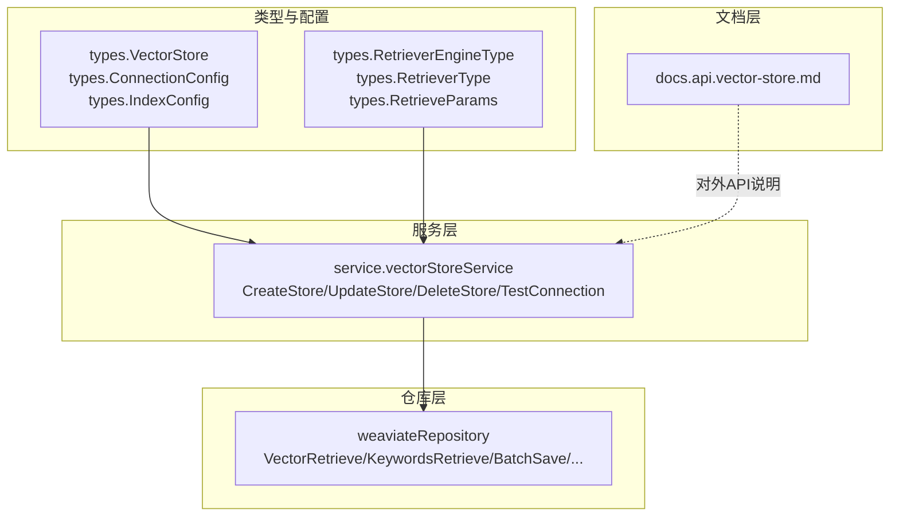
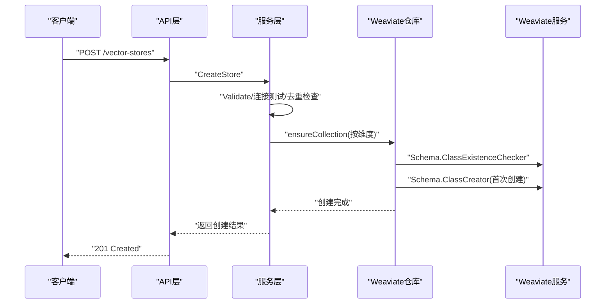
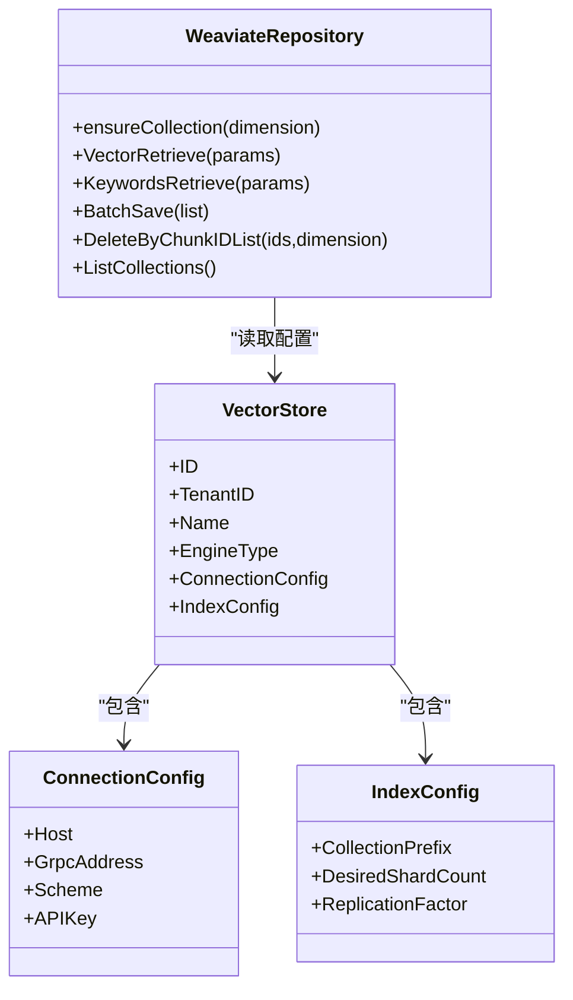
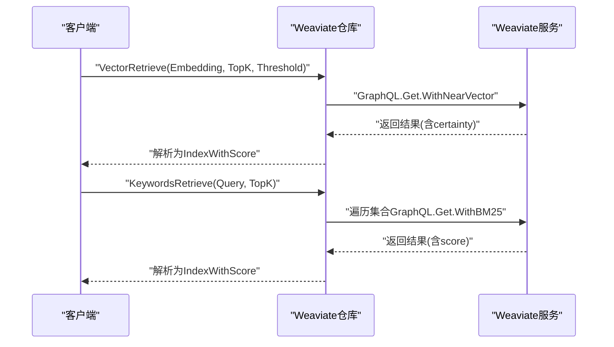
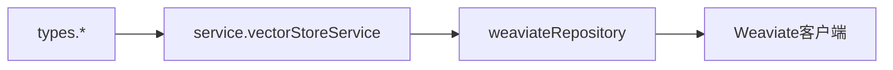

# Weaviate集成

<cite>
**本文档引用的文件**
- [vectorstore.go](file://internal/types/vectorstore.go)
- [vectorstore.go](file://internal/application/service/vectorstore.go)
- [vectorstore.go](file://internal/application/repository/vectorstore.go)
- [vectorstore_healthcheck.go](file://internal/application/service/vectorstore_healthcheck.go)
- [repository.go](file://internal/application/repository/retriever/weaviate/repository.go)
- [retriever.go](file://internal/types/retriever.go)
- [vector-store.md](file://docs/api/vector-store.md)
</cite>

## 目录
1. [简介](#简介)
2. [项目结构](#项目结构)
3. [核心组件](#核心组件)
4. [架构总览](#架构总览)
5. [详细组件分析](#详细组件分析)
6. [依赖分析](#依赖分析)
7. [性能考虑](#性能考虑)
8. [故障排查指南](#故障排查指南)
9. [结论](#结论)
10. [附录](#附录)

## 简介
本文件面向WeKnora项目中Weaviate向量数据库的集成与使用，覆盖以下主题：
- Weaviate的GraphQL API与REST API使用方式
- 对象模型与类定义设计
- 向量属性配置与索引策略（HNSW与Flat）
- Schema定义与对象创建流程（属性类型与向量维度）
- 查询API使用（向量搜索、过滤查询、聚合统计）
- 批量操作与事务处理（含错误处理与重试建议）
- 复杂查询（交叉引用与组合查询）
- 数据导入工具与同步机制配置
- 集群部署与高可用最佳实践

## 项目结构
Weaviate集成主要分布在以下模块：
- 类型与配置层：定义向量存储、连接与索引配置、检索参数等
- 服务层：提供向量存储的创建、更新、删除、连接测试等业务逻辑
- 仓库层：Weaviate检索引擎的具体实现，封装GraphQL/HTTP调用
- 文档层：对外API说明

图表来源
- [vectorstore.go:30-50](file://internal/types/vectorstore.go#L30-L50)
- [vectorstore.go:16-34](file://internal/application/service/vectorstore.go#L16-L34)
- [repository.go:37-54](file://internal/application/repository/retriever/weaviate/repository.go#L37-L54)
- [retriever.go:28-54](file://internal/types/retriever.go#L28-L54)
- [vector-store.md:1-362](file://docs/api/vector-store.md#L1-L362)

章节来源
- [vectorstore.go:30-50](file://internal/types/vectorstore.go#L30-L50)
- [vectorstore.go:16-34](file://internal/application/service/vectorstore.go#L16-L34)
- [repository.go:37-54](file://internal/application/repository/retriever/weaviate/repository.go#L37-L54)
- [retriever.go:28-54](file://internal/types/retriever.go#L28-L54)
- [vector-store.md:1-362](file://docs/api/vector-store.md#L1-L362)

## 核心组件
- 向量存储模型：包含引擎类型、连接配置、索引配置等
- Weaviate检索仓库：负责集合创建、对象保存、批量写入、删除、更新、查询等
- 检索参数：统一的查询参数结构，支持关键词与向量两种检索类型
- 连接测试：对Weaviate进行连通性与版本检测

章节来源
- [vectorstore.go:30-50](file://internal/types/vectorstore.go#L30-L50)
- [repository.go:60-160](file://internal/application/repository/retriever/weaviate/repository.go#L60-L160)
- [retriever.go:28-54](file://internal/types/retriever.go#L28-L54)
- [vectorstore_healthcheck.go:179-228](file://internal/application/service/vectorstore_healthcheck.go#L179-L228)

## 架构总览
Weaviate集成采用分层架构：
- 类型层：定义数据模型与枚举
- 服务层：编排业务流程，执行校验与连接测试
- 仓库层：对接Weaviate客户端，封装GraphQL/HTTP调用
- API层：对外暴露向量存储管理与连接测试接口

图表来源
- [vectorstore.go:36-99](file://internal/application/service/vectorstore.go#L36-L99)
- [repository.go:60-160](file://internal/application/repository/retriever/weaviate/repository.go#L60-L160)

## 详细组件分析

### Weaviate对象模型与类定义
- 集合命名规则：基于基础名与向量维度动态生成，形如“基础名_维度”
- 类配置要点：
  - 向量索引类型：HNSW
  - 向量距离度量：余弦
  - 属性：文本内容、来源标识、块ID、知识ID、知识库ID、标签ID、启用状态等
  - 可选配置：复制因子、期望分片数

图表来源
- [repository.go:60-160](file://internal/application/repository/retriever/weaviate/repository.go#L60-L160)
- [vectorstore.go:33-49](file://internal/types/vectorstore.go#L33-L49)
- [vectorstore.go:103-121](file://internal/types/vectorstore.go#L103-L121)
- [vectorstore.go:205-219](file://internal/types/vectorstore.go#L205-L219)

章节来源
- [repository.go:60-160](file://internal/application/repository/retriever/weaviate/repository.go#L60-L160)
- [vectorstore.go:103-121](file://internal/types/vectorstore.go#L103-L121)
- [vectorstore.go:205-219](file://internal/types/vectorstore.go#L205-L219)

### 向量属性配置与索引策略
- 向量维度：按输入嵌入的实际维度动态创建集合
- 索引类型：HNSW（支持efConstruction、maxConnections、ef等参数）
- 距离度量：余弦距离
- Flat索引：代码中未显式配置Flat索引；默认使用HNSW
- 分片与复制：
  - 分片数：通过IndexConfig.desired_shard_count配置
  - 复制因子：通过IndexConfig.replication_factor配置

章节来源
- [repository.go:84-96](file://internal/application/repository/retriever/weaviate/repository.go#L84-L96)
- [repository.go:140-150](file://internal/application/repository/retriever/weaviate/repository.go#L140-L150)

### Schema定义与对象创建流程
- 首次写入时自动创建集合
- 属性类型映射：文本、整数、布尔等
- 写入字段：内容、来源ID、块ID、知识ID、知识库ID、标签ID、启用状态
- 批量写入：按维度分组，使用批量插入器

章节来源
- [repository.go:80-138](file://internal/application/repository/retriever/weaviate/repository.go#L80-L138)
- [repository.go:224-286](file://internal/application/repository/retriever/weaviate/repository.go#L224-L286)

### 查询API使用
- 向量相似搜索：NearVector + Certainty阈值
- 关键词搜索：BM25跨所有集合匹配
- 过滤条件：启用状态、知识库ID、知识ID、标签ID、排除ID等
- 字段选择：内容、来源、块ID、知识ID、知识库ID、标签ID、附加字段（向量搜索含certainty，关键词搜索含score）

图表来源
- [repository.go:540-601](file://internal/application/repository/retriever/weaviate/repository.go#L540-L601)
- [repository.go:603-674](file://internal/application/repository/retriever/weaviate/repository.go#L603-L674)

章节来源
- [repository.go:540-601](file://internal/application/repository/retriever/weaviate/repository.go#L540-L601)
- [repository.go:603-674](file://internal/application/repository/retriever/weaviate/repository.go#L603-L674)

### 批量操作与事务处理
- 批量写入：按维度分组，使用批量插入器提交
- 批量删除：按块ID或知识ID批量删除
- 批量更新：启用状态与标签ID的批量更新
- 事务特性：Weaviate Go客户端未暴露显式事务API；批量操作由批量插入器/删除器执行，错误逐条返回

章节来源
- [repository.go:224-286](file://internal/application/repository/retriever/weaviate/repository.go#L224-L286)
- [repository.go:288-376](file://internal/application/repository/retriever/weaviate/repository.go#L288-L376)
- [repository.go:378-474](file://internal/application/repository/retriever/weaviate/repository.go#L378-L474)

### 复杂查询与组合查询
- 组合过滤：启用状态+多ID过滤（包含/排除）
- 跨集合查询：关键词检索遍历所有匹配集合
- 排序与限制：按TopK限制结果数量

章节来源
- [repository.go:477-519](file://internal/application/repository/retriever/weaviate/repository.go#L477-L519)
- [repository.go:603-674](file://internal/application/repository/retriever/weaviate/repository.go#L603-L674)

### 数据导入工具与同步机制
- 导入入口：批量写入接口按维度分组处理
- 同步机制：支持按知识库ID复制索引，保留向量与元数据
- 建议：导入前确保目标集合存在，导入后进行一致性校验

章节来源
- [repository.go:224-286](file://internal/application/repository/retriever/weaviate/repository.go#L224-L286)
- [repository.go:676-816](file://internal/application/repository/retriever/weaviate/repository.go#L676-L816)

### 集群部署与高可用
- 复制因子：通过IndexConfig.replication_factor配置
- 分片数：通过IndexConfig.desired_shard_count配置
- 连接测试：服务启动时进行连通性与版本检测

章节来源
- [vectorstore.go:214-218](file://internal/types/vectorstore.go#L214-L218)
- [repository.go:140-150](file://internal/application/repository/retriever/weaviate/repository.go#L140-L150)
- [vectorstore_healthcheck.go:179-228](file://internal/application/service/vectorstore_healthcheck.go#L179-L228)

## 依赖分析
- 类型依赖：Weaviate仓库依赖类型层的检索参数与配置
- 服务依赖：服务层依赖仓库层与工厂/注册表
- 外部依赖：Weaviate Go客户端、GraphQL/HTTP

图表来源
- [retriever.go:28-54](file://internal/types/retriever.go#L28-L54)
- [vectorstore.go:16-34](file://internal/application/service/vectorstore.go#L16-L34)
- [repository.go:37-54](file://internal/application/repository/retriever/weaviate/repository.go#L37-L54)

章节来源
- [retriever.go:28-54](file://internal/types/retriever.go#L28-L54)
- [vectorstore.go:16-34](file://internal/application/service/vectorstore.go#L16-L34)
- [repository.go:37-54](file://internal/application/repository/retriever/weaviate/repository.go#L37-L54)

## 性能考虑
- HNSW vs Flat
  - HNSW：适合大规模高维向量检索，支持efConstruction、maxConnections、ef等参数调优
  - Flat：无索引开销，适合小规模或低维场景；代码中未显式配置
- 存储估算：按payload大小、向量字节数、HNSW索引链接、ID追踪元数据估算
- 分片与复制：合理设置分片数与复制因子以提升读写吞吐与可用性

章节来源
- [repository.go:967-998](file://internal/application/repository/retriever/weaviate/repository.go#L967-L998)
- [repository.go:140-150](file://internal/application/repository/retriever/weaviate/repository.go#L140-L150)

## 故障排查指南
- 连接测试失败
  - 检查主机地址、端口、协议、API密钥
  - 确认服务就绪与版本兼容
- 查询失败
  - 检查集合是否存在（按维度命名）
  - 校验过滤条件与阈值
- 批量操作失败
  - 查看逐条错误返回
  - 检查维度与集合配置

章节来源
- [vectorstore_healthcheck.go:179-228](file://internal/application/service/vectorstore_healthcheck.go#L179-L228)
- [repository.go:552-561](file://internal/application/repository/retriever/weaviate/repository.go#L552-L561)
- [repository.go:276-278](file://internal/application/repository/retriever/weaviate/repository.go#L276-L278)

## 结论
WeKnora对Weaviate的集成提供了完善的类型定义、连接配置、Schema管理与查询能力，支持按维度动态创建集合、HNSW索引与BM25关键词检索，并具备批量写入、删除与更新能力。通过连接测试与索引配置，可在生产环境中实现高可用与高性能的向量检索。

## 附录

### API参考（向量存储管理）
- 获取支持的引擎类型与字段定义
- 测试原始凭据连接
- 创建向量存储
- 获取列表/详情
- 更新名称
- 删除向量存储
- 测试已保存的连接（含版本回填）

章节来源
- [vector-store.md:1-362](file://docs/api/vector-store.md#L1-L362)