# 多后端集成支持

<cite>
**本文档引用的文件**
- [internal/types/vectorstore.go](file://internal/types/vectorstore.go)
- [internal/application/service/vectorstore.go](file://internal/application/service/vectorstore.go)
- [internal/application/repository/vectorstore.go](file://internal/application/repository/vectorstore.go)
- [internal/models/embedding/embedder.go](file://internal/models/embedding/embedder.go)
- [internal/models/embedding/openai.go](file://internal/models/embedding/openai.go)
- [internal/models/embedding/azure_openai.go](file://internal/models/embedding/azure_openai.go)
- [internal/models/embedding/ollama.go](file://internal/models/embedding/ollama.go)
- [internal/application/repository/retriever/elasticsearch/v8/repository.go](file://internal/application/repository/retriever/elasticsearch/v8/repository.go)
- [internal/application/repository/retriever/qdrant/repository.go](file://internal/application/repository/retriever/qdrant/repository.go)
- [internal/application/repository/retriever/milvus/repository.go](file://internal/application/repository/retriever/milvus/repository.go)
- [internal/application/repository/retriever/weaviate/repository.go](file://internal/application/repository/retriever/weaviate/repository.go)
- [internal/application/repository/retriever/postgres/repository.go](file://internal/application/repository/retriever/postgres/repository.go)
</cite>

## 目录
1. [简介](#简介)
2. [项目结构](#项目结构)
3. [核心组件](#核心组件)
4. [架构总览](#架构总览)
5. [详细组件分析](#详细组件分析)
6. [依赖关系分析](#依赖关系分析)
7. [性能考虑](#性能考虑)
8. [故障排除指南](#故障排除指南)
9. [结论](#结论)
10. [附录](#附录)

## 简介
本文件面向WeKnora多后端向量数据库集成，系统性阐述以下内容：
- PostgreSQL pgvector、Elasticsearch、Milvus、Weaviate、Qdrant五类后端的连接配置、索引管理与查询优化策略
- 统一嵌入模型接口设计，覆盖OpenAI、Azure OpenAI、本地Ollama等提供商
- 向量检索性能调优：索引选择、查询参数与缓存策略
- 各后端部署与监控要点
- 向量数据迁移与备份策略
- 自定义向量存储后端的开发框架
- 故障排除与性能诊断最佳实践

## 项目结构
WeKnora采用分层架构，围绕“类型定义—服务—仓储—具体后端实现”组织代码。核心模块包括：
- 类型与配置：统一的向量存储类型、连接与索引配置
- 嵌入模型：统一的Embedder接口与多提供商适配
- 向量检索：按引擎抽象的仓储接口与各后端实现
- 服务层：向量存储注册、校验、版本检测与注册表更新

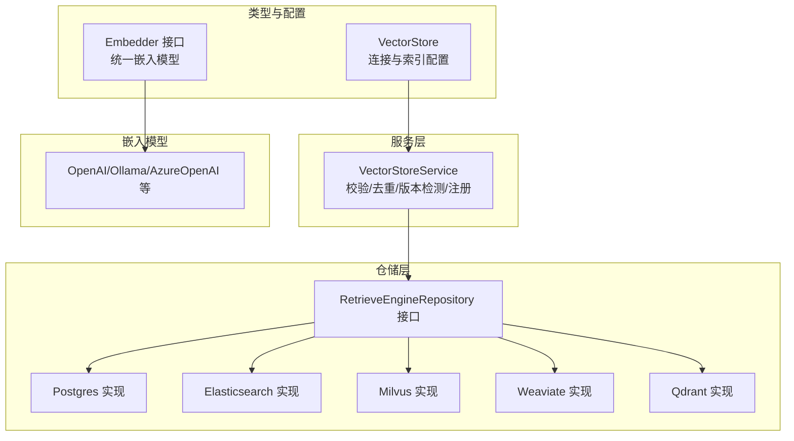

**图表来源**
- [internal/types/vectorstore.go:30-50](file://internal/types/vectorstore.go#L30-L50)
- [internal/application/service/vectorstore.go:16-34](file://internal/application/service/vectorstore.go#L16-L34)
- [internal/application/repository/retriever/postgres/repository.go:19-38](file://internal/application/repository/retriever/postgres/repository.go#L19-L38)
- [internal/models/embedding/embedder.go:15-37](file://internal/models/embedding/embedder.go#L15-L37)

**章节来源**
- [internal/types/vectorstore.go:30-121](file://internal/types/vectorstore.go#L30-L121)
- [internal/application/service/vectorstore.go:16-34](file://internal/application/service/vectorstore.go#L16-L34)

## 核心组件
- 向量存储类型与配置
  - VectorStore：租户级向量数据库实例，支持多实例与多租户隔离
  - ConnectionConfig：驱动特定连接参数（地址、用户名、密码、API Key、TLS等）
  - IndexConfig：索引/集合命名与可扩展配置（分片数、副本数、副本数量等）
- 服务层
  - VectorStoreService：负责校验、去重、版本检测、持久化与注册表更新
- 仓储层
  - RetrieveEngineRepository接口：统一的保存、批量保存、删除、检索、复制与批处理更新能力
  - 各后端实现：Postgres、Elasticsearch、Milvus、Weaviate、Qdrant

**章节来源**
- [internal/types/vectorstore.go:30-121](file://internal/types/vectorstore.go#L30-L121)
- [internal/application/service/vectorstore.go:36-99](file://internal/application/service/vectorstore.go#L36-L99)
- [internal/application/repository/vectorstore.go:22-76](file://internal/application/repository/vectorstore.go#L22-L76)

## 架构总览
WeKnora通过“类型定义 + 服务层 + 仓储层 + 后端实现”的分层设计，实现多后端无缝切换与统一对外接口。

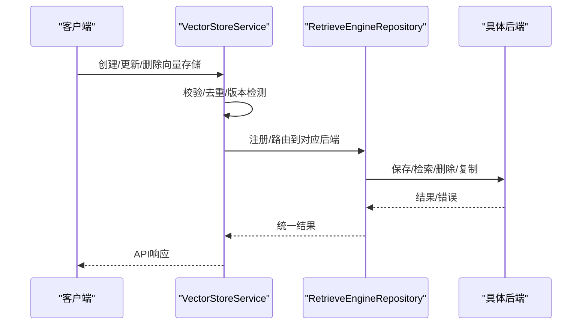

**图表来源**
- [internal/application/service/vectorstore.go:36-99](file://internal/application/service/vectorstore.go#L36-L99)
- [internal/application/repository/retriever/postgres/repository.go:79-108](file://internal/application/repository/retriever/postgres/repository.go#L79-L108)

## 详细组件分析

### 向量存储类型与配置
- 支持引擎类型：PostgreSQL、Elasticsearch、Qdrant、Milvus、Weaviate、SQLite
- 连接配置字段：通用（地址、用户名、密码、API Key）、后端特有（Host/Port/TLS、gRPC地址、默认连接等）
- 索引配置字段：索引名/集合前缀、分片/副本/副本数量等
- 名称校验：仅允许字母开头、含字母数字下划线连字符，最大长度限制
- 环境变量注入：支持从环境变量构建“虚拟”向量存储（只读）

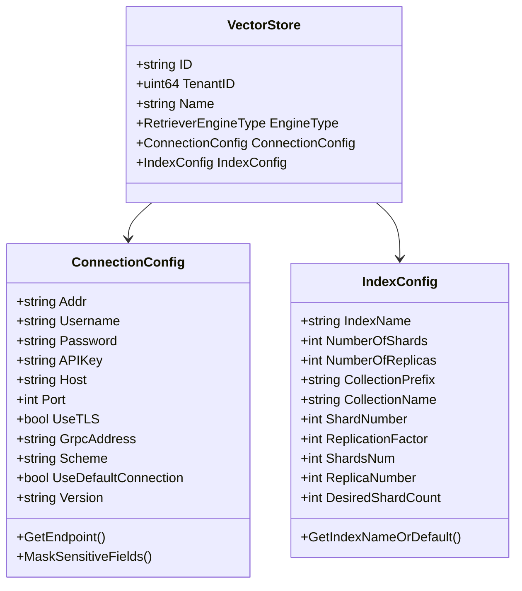

**图表来源**
- [internal/types/vectorstore.go:30-121](file://internal/types/vectorstore.go#L30-L121)
- [internal/types/vectorstore.go:203-265](file://internal/types/vectorstore.go#L203-L265)

**章节来源**
- [internal/types/vectorstore.go:30-121](file://internal/types/vectorstore.go#L30-L121)
- [internal/types/vectorstore.go:203-265](file://internal/types/vectorstore.go#L203-L265)

### 服务层：向量存储生命周期
- 创建：基础校验 → 连接配置校验 → 索引配置校验 → 去重检查（DB与环境变量）→ 版本检测（如需）→ 持久化 → 注册到注册表
- 更新：仅名称可变
- 删除：软删除并从注册表注销
- 注册失败：记录日志，不影响DB持久化（应用重启后自愈）

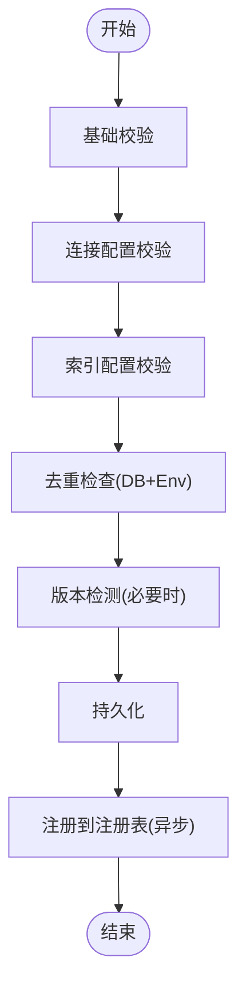

**图表来源**
- [internal/application/service/vectorstore.go:36-99](file://internal/application/service/vectorstore.go#L36-L99)

**章节来源**
- [internal/application/service/vectorstore.go:36-99](file://internal/application/service/vectorstore.go#L36-L99)
- [internal/application/repository/vectorstore.go:78-101](file://internal/application/repository/vectorstore.go#L78-L101)

### 嵌入模型统一接口
- Embedder接口：Embed/BatchEmbed/维度/模型名/模型ID
- 工厂函数：根据模型配置与提供商自动路由至具体实现
- 支持提供商：OpenAI、Azure OpenAI、阿里云DashScope、火山引擎、Jina、NVIDIA、本地Ollama、WeKnoraCloud等
- 可选增强：调试包装器、Langfuse追踪包装器

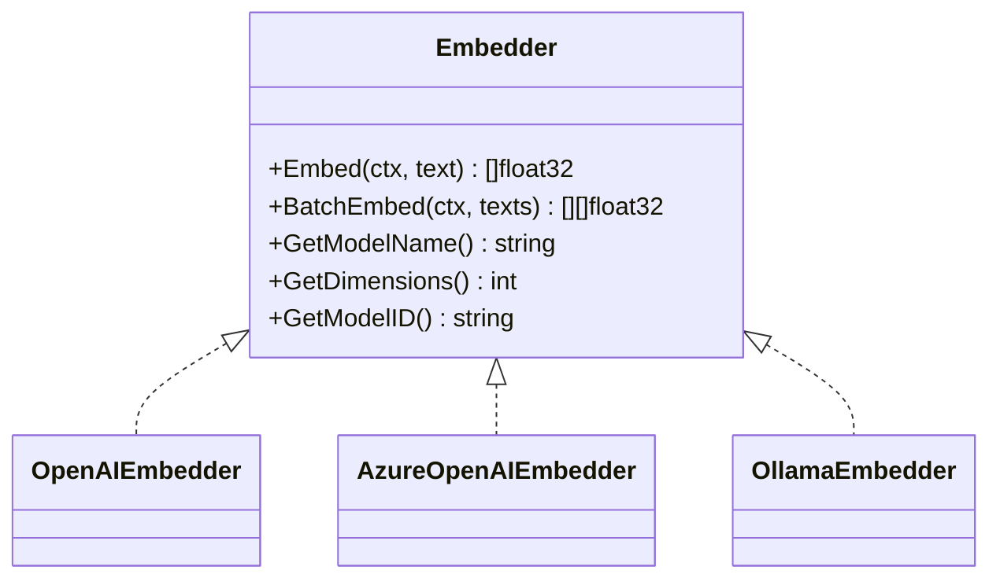

**图表来源**
- [internal/models/embedding/embedder.go:15-37](file://internal/models/embedding/embedder.go#L15-L37)
- [internal/models/embedding/openai.go:16-29](file://internal/models/embedding/openai.go#L16-L29)
- [internal/models/embedding/azure_openai.go:17-29](file://internal/models/embedding/azure_openai.go#L17-L29)
- [internal/models/embedding/ollama.go:13-21](file://internal/models/embedding/ollama.go#L13-L21)

**章节来源**
- [internal/models/embedding/embedder.go:82-95](file://internal/models/embedding/embedder.go#L82-L95)
- [internal/models/embedding/openai.go:47-82](file://internal/models/embedding/openai.go#L47-L82)
- [internal/models/embedding/azure_openai.go:44-74](file://internal/models/embedding/azure_openai.go#L44-L74)
- [internal/models/embedding/ollama.go:35-60](file://internal/models/embedding/ollama.go#L35-L60)

### PostgreSQL pgvector 实现
- 引擎类型：PostgresRetrieverEngineType
- 支持能力：关键词检索（ParadeDB全文检索）、向量检索（pgvector半精度向量+HNSW）
- 查询优化：
  - 子查询+阈值过滤：先扩大候选集，再阈值筛选，避免召回损失
  - HNSW ef_search与迭代扫描：提升召回与性能
  - 半精度向量表达式索引：确保索引命中
- 批量操作：ON CONFLICT DO NOTHING插入，减少重复写入
- 索引建议：按维度分表/分区，结合WHERE条件精确匹配

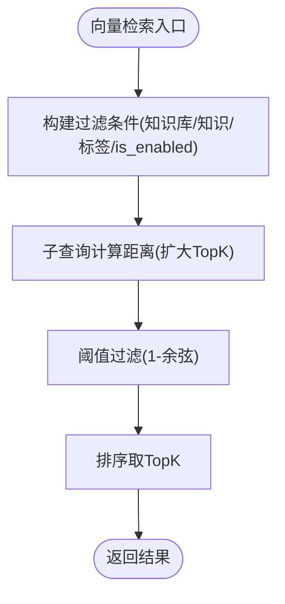

**图表来源**
- [internal/application/repository/retriever/postgres/repository.go:263-483](file://internal/application/repository/retriever/postgres/repository.go#L263-L483)

**章节来源**
- [internal/application/repository/retriever/postgres/repository.go:263-483](file://internal/application/repository/retriever/postgres/repository.go#L263-L483)

### Elasticsearch v8 实现
- 引擎类型：ElasticsearchRetrieverEngineType
- 支持能力：关键词检索（match）、向量检索（script_score + cosineSimilarity）
- 动态字段类型检测：自动判断ID字段是否为keyword类型，决定是否追加.keyword后缀
- 批量写入：Bulk API
- 删除与复制：基于查询的批量删除；分页滚动复制
- 索引设置：分片/副本可配置，默认值从环境变量或默认值解析

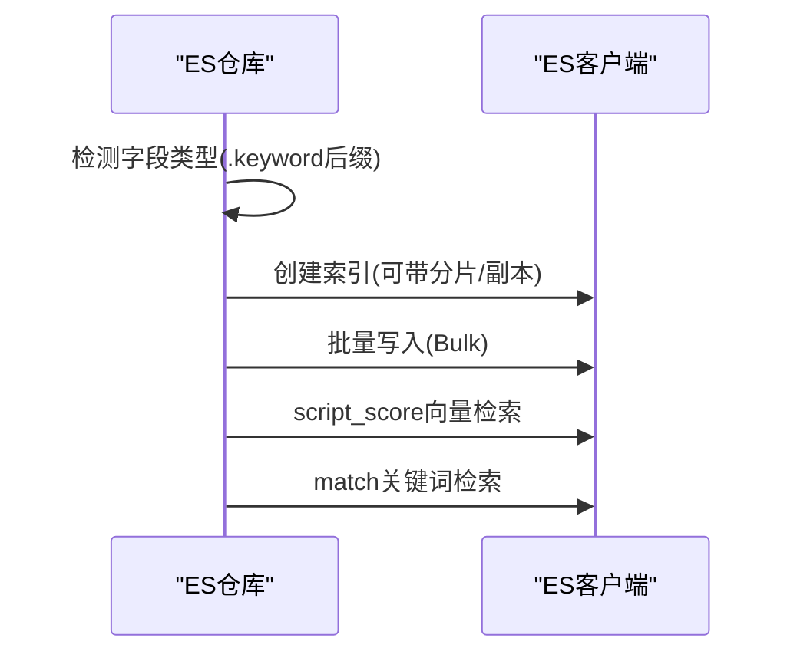

**图表来源**
- [internal/application/repository/retriever/elasticsearch/v8/repository.go:66-104](file://internal/application/repository/retriever/elasticsearch/v8/repository.go#L66-L104)
- [internal/application/repository/retriever/elasticsearch/v8/repository.go:342-381](file://internal/application/repository/retriever/elasticsearch/v8/repository.go#L342-L381)
- [internal/application/repository/retriever/elasticsearch/v8/repository.go:404-474](file://internal/application/repository/retriever/elasticsearch/v8/repository.go#L404-L474)
- [internal/application/repository/retriever/elasticsearch/v8/repository.go:476-529](file://internal/application/repository/retriever/elasticsearch/v8/repository.go#L476-L529)

**章节来源**
- [internal/application/repository/retriever/elasticsearch/v8/repository.go:66-104](file://internal/application/repository/retriever/elasticsearch/v8/repository.go#L66-L104)
- [internal/application/repository/retriever/elasticsearch/v8/repository.go:342-381](file://internal/application/repository/retriever/elasticsearch/v8/repository.go#L342-L381)
- [internal/application/repository/retriever/elasticsearch/v8/repository.go:404-474](file://internal/application/repository/retriever/elasticsearch/v8/repository.go#L404-L474)
- [internal/application/repository/retriever/elasticsearch/v8/repository.go:476-529](file://internal/application/repository/retriever/elasticsearch/v8/repository.go#L476-L529)

### Milvus 实现
- 引擎类型：MilvusRetrieverEngineType
- 支持能力：关键词检索（BM25）、向量检索（HNSW）
- 集合命名：以“基础名_维度”区分不同维度向量
- 索引配置：分片数（写并发）、内存副本数（读HA）
- 批量写入：Upsert
- 过滤表达式：统一转换为Milvus表达式语言

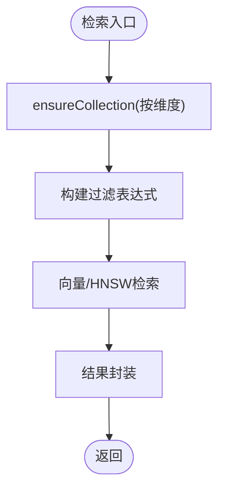

**图表来源**
- [internal/application/repository/retriever/milvus/repository.go:85-208](file://internal/application/repository/retriever/milvus/repository.go#L85-L208)
- [internal/application/repository/retriever/milvus/repository.go:656-724](file://internal/application/repository/retriever/milvus/repository.go#L656-L724)

**章节来源**
- [internal/application/repository/retriever/milvus/repository.go:85-208](file://internal/application/repository/retriever/milvus/repository.go#L85-L208)
- [internal/application/repository/retriever/milvus/repository.go:656-724](file://internal/application/repository/retriever/milvus/repository.go#L656-L724)

### Weaviate 实现
- 引擎类型：WeaviateRetrieverEngineType
- 支持能力：关键词检索（BM25）、向量检索（nearVector）
- 集合命名：以“基础名_维度”
- 索引配置：副本因子、期望分片数
- GraphQL查询：向量检索与关键词检索均通过GraphQL执行

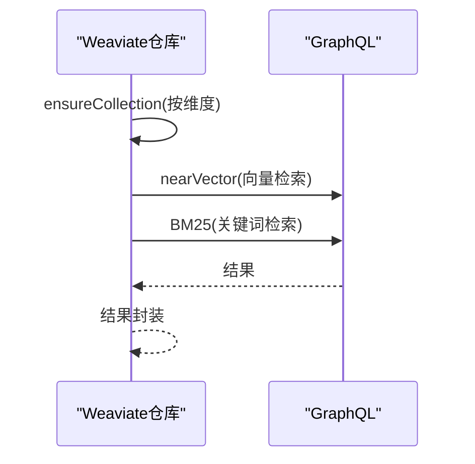

**图表来源**
- [internal/application/repository/retriever/weaviate/repository.go:60-160](file://internal/application/repository/retriever/weaviate/repository.go#L60-L160)
- [internal/application/repository/retriever/weaviate/repository.go:540-601](file://internal/application/repository/retriever/weaviate/repository.go#L540-L601)
- [internal/application/repository/retriever/weaviate/repository.go:603-674](file://internal/application/repository/retriever/weaviate/repository.go#L603-L674)

**章节来源**
- [internal/application/repository/retriever/weaviate/repository.go:60-160](file://internal/application/repository/retriever/weaviate/repository.go#L60-L160)
- [internal/application/repository/retriever/weaviate/repository.go:540-601](file://internal/application/repository/retriever/weaviate/repository.go#L540-L601)
- [internal/application/repository/retriever/weaviate/repository.go:603-674](file://internal/application/repository/retriever/weaviate/repository.go#L603-L674)

### Qdrant 实现
- 引擎类型：QdrantRetrieverEngineType
- 支持能力：关键词检索（多语言分词器）、向量检索（Cosine）
- 集合命名：以“基础名_维度”
- 索引配置：分片数、副本因子
- 文本索引：多语言分词器，支持中日韩等
- 批量写入：Upsert

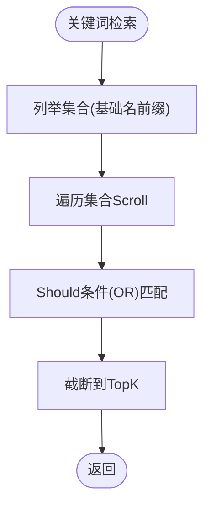

**图表来源**
- [internal/application/repository/retriever/qdrant/repository.go:610-706](file://internal/application/repository/retriever/qdrant/repository.go#L610-L706)

**章节来源**
- [internal/application/repository/retriever/qdrant/repository.go:610-706](file://internal/application/repository/retriever/qdrant/repository.go#L610-L706)

## 依赖关系分析
- 类型层：VectorStore/ConnectionConfig/IndexConfig定义了所有后端的统一约束与默认行为
- 服务层：VectorStoreService对类型层进行业务规则校验，并负责注册表更新
- 仓储层：RetrieveEngineRepository接口抽象出统一的CRUD与检索能力
- 后端实现：各引擎实现仓储接口，遵循统一的过滤、阈值、TopK等检索语义

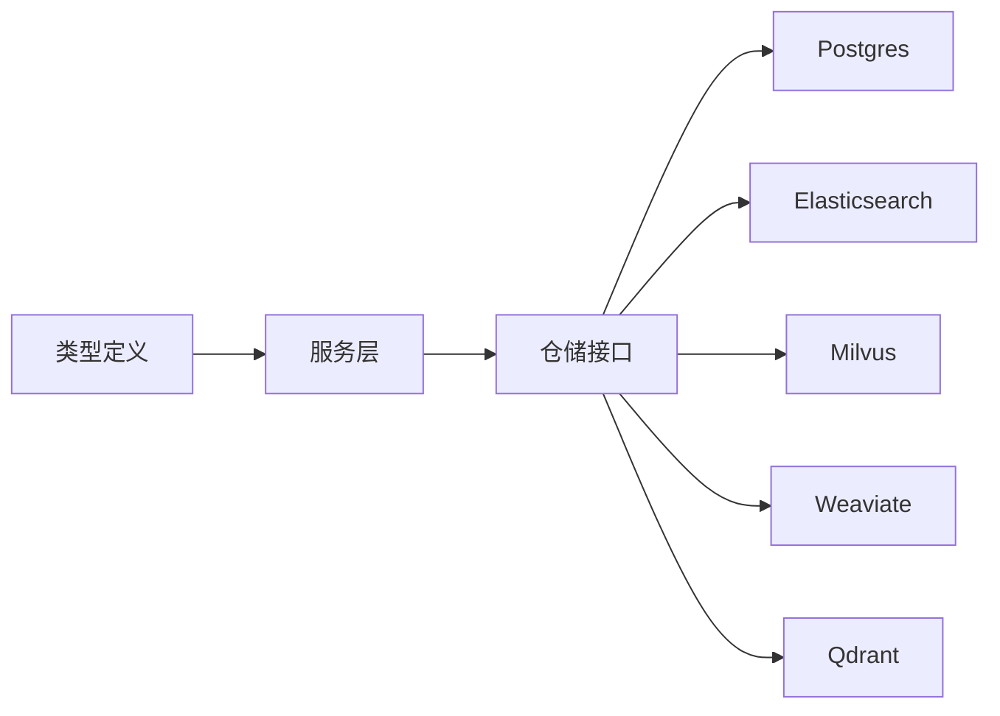

**图表来源**
- [internal/types/vectorstore.go:30-121](file://internal/types/vectorstore.go#L30-L121)
- [internal/application/service/vectorstore.go:16-34](file://internal/application/service/vectorstore.go#L16-L34)
- [internal/application/repository/retriever/postgres/repository.go:19-38](file://internal/application/repository/retriever/postgres/repository.go#L19-L38)

**章节来源**
- [internal/types/vectorstore.go:30-121](file://internal/types/vectorstore.go#L30-L121)
- [internal/application/service/vectorstore.go:16-34](file://internal/application/service/vectorstore.go#L16-L34)
- [internal/application/repository/retriever/postgres/repository.go:19-38](file://internal/application/repository/retriever/postgres/repository.go#L19-L38)

## 性能考虑
- 索引选择
  - PostgreSQL：HNSW半精度向量索引，表达式索引需严格匹配（embedding::halfvec(dim)）
  - Elasticsearch：script_score + cosineSimilarity，分片/副本合理配置
  - Milvus：HNSW索引，分片数控制写并发，内存副本数控制读HA
  - Weaviate：hnsw向量索引，BM25关键词检索
  - Qdrant：Cosine向量索引，多语言文本索引
- 查询参数
  - TopK适度放大（Subquery扩大候选），再阈值过滤，避免召回损失
  - 余弦阈值转换为距离阈值（1-余弦）
  - 过滤条件尽量走索引字段（chunk_id/knowledge_id等）
- 缓存策略
  - 注册表：后端实例注册失败不影响DB持久化，应用重启后自愈
  - 嵌入缓存：可结合业务场景在上层引入HTTP/SDK缓存（非本项目内置）
- 并发与批处理
  - 各后端均提供批量写入/删除/复制能力，降低网络往返开销

[本节为通用指导，无需列出具体文件来源]

## 故障排除指南
- 连接失败
  - 检查地址、凭据、TLS配置；确认版本检测（如ES v7/v8差异）
  - 查看服务层错误信息与日志
- 索引不存在
  - 各后端在首次使用时自动创建集合/索引；若失败，检查权限与配置
- 检索无结果
  - 调整阈值或扩大TopK；确认过滤条件与字段类型
  - PostgreSQL需确保HNSW ef_search与迭代扫描设置生效
- 版本不兼容
  - Azure OpenAI维度参数仅在特定API版本可用；根据模型ID动态判定
- 注册失败
  - 服务层注册失败会记录日志，不影响DB持久化，应用重启后自愈

**章节来源**
- [internal/application/service/vectorstore.go:140-160](file://internal/application/service/vectorstore.go#L140-L160)
- [internal/application/repository/retriever/postgres/repository.go:412-443](file://internal/application/repository/retriever/postgres/repository.go#L412-L443)
- [internal/models/embedding/azure_openai.go:177-199](file://internal/models/embedding/azure_openai.go#L177-L199)

## 结论
WeKnora通过统一的类型与服务层抽象，实现了多后端向量数据库的一致接入与统一检索体验。结合各后端的索引与查询优化策略，可在不同场景下取得良好性能与稳定性。嵌入模型的统一接口进一步简化了提供商切换与扩展成本。

[本节为总结性内容，无需列出具体文件来源]

## 附录

### 各后端部署与监控要点
- PostgreSQL
  - 部署：安装pgvector与ParadeDB扩展，准备HNSW索引
  - 监控：索引大小、查询耗时、ef_search与迭代扫描状态
- Elasticsearch
  - 部署：v8客户端，确保脚本与分片/副本配置
  - 监控：索引映射、脚本评分性能、集群健康
- Milvus
  - 部署：配置分片数与内存副本数
  - 监控：集合存在性、索引状态、查询延迟
- Weaviate
  - 部署：配置hnsw索引参数与BM25关键词索引
  - 监控：GraphQL查询耗时、集合状态
- Qdrant
  - 部署：配置分片/副本，启用多语言文本索引
  - 监控：集合数量、查询吞吐、分词效果

[本节为通用指导，无需列出具体文件来源]

### 向量数据迁移与备份策略
- 迁移
  - 各后端提供CopyIndices能力，支持按知识库/块ID映射复制
  - 注意SourceID生成规则（常规块与生成问题的处理）
- 备份
  - PostgreSQL：逻辑备份/物理快照
  - Elasticsearch：索引快照/时间戳索引
  - Milvus/Weaviate/Qdrant：各自官方备份方案

**章节来源**
- [internal/application/repository/retriever/postgres/repository.go:485-616](file://internal/application/repository/retriever/postgres/repository.go#L485-L616)
- [internal/application/repository/retriever/elasticsearch/v8/repository.go:531-675](file://internal/application/repository/retriever/elasticsearch/v8/repository.go#L531-L675)
- [internal/application/repository/retriever/milvus/repository.go:794-900](file://internal/application/repository/retriever/milvus/repository.go#L794-L900)
- [internal/application/repository/retriever/weaviate/repository.go:676-800](file://internal/application/repository/retriever/weaviate/repository.go#L676-L800)
- [internal/application/repository/retriever/qdrant/repository.go:708-800](file://internal/application/repository/retriever/qdrant/repository.go#L708-L800)

### 自定义向量存储后端开发框架
- 实现RetrieveEngineRepository接口：Save/BatchSave/Delete*/Retrieve/CopyIndices/批处理更新
- 在类型层定义索引命名与配置字段，确保与服务层校验一致
- 提供初始化与集合/索引创建逻辑，支持按维度命名
- 在服务层注册工厂与类型元数据，以便UI与API识别

**章节来源**
- [internal/types/vectorstore.go:436-547](file://internal/types/vectorstore.go#L436-L547)
- [internal/application/service/vectorstore.go:16-34](file://internal/application/service/vectorstore.go#L16-L34)