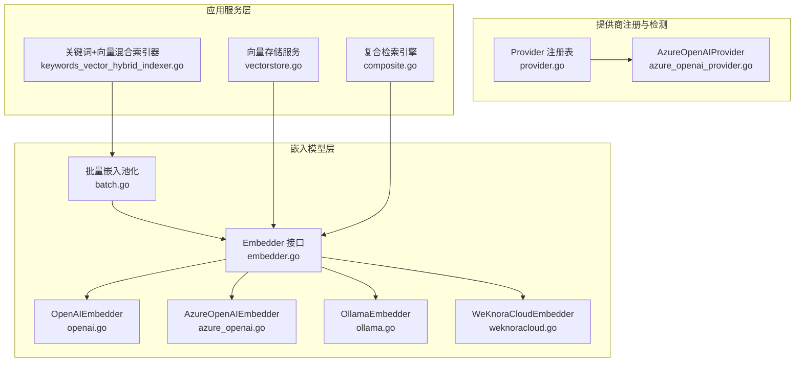
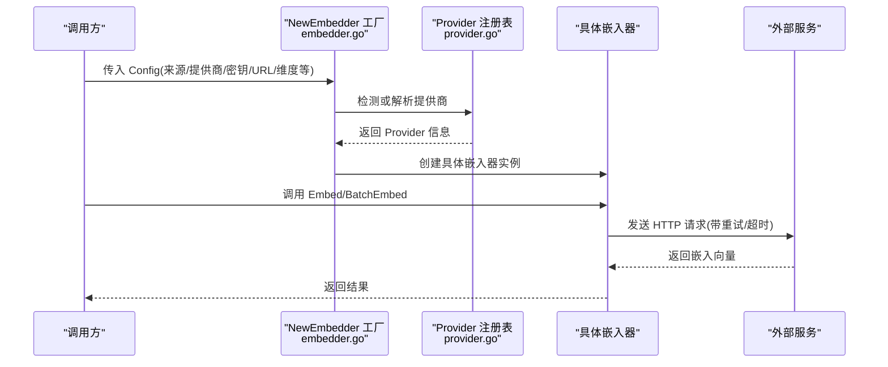
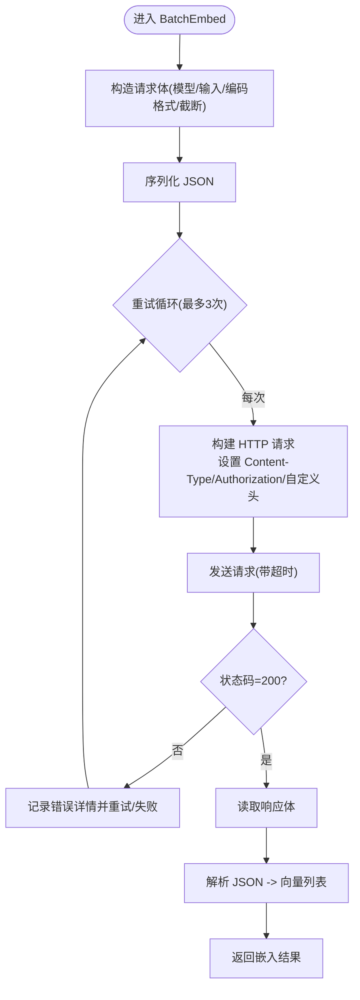
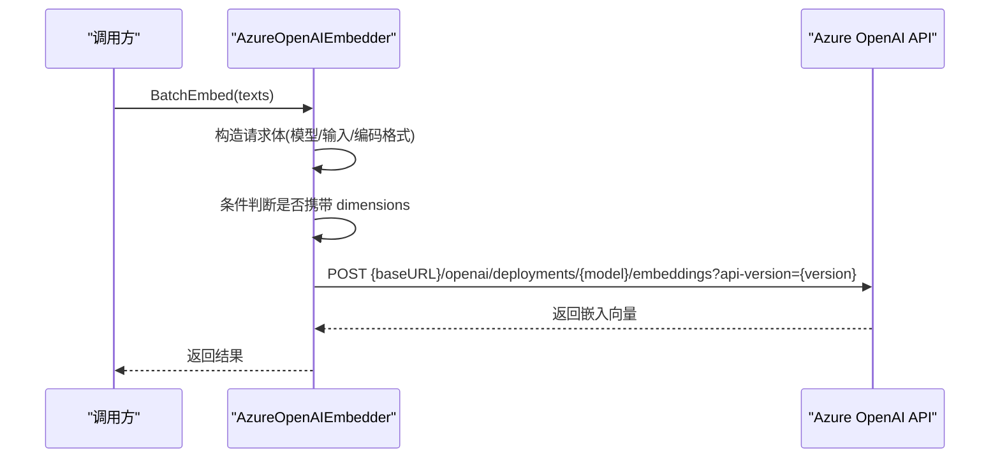
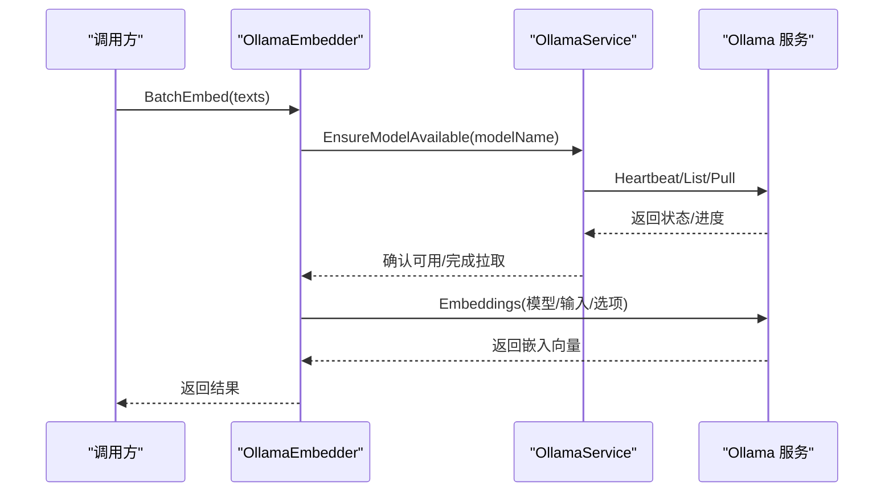
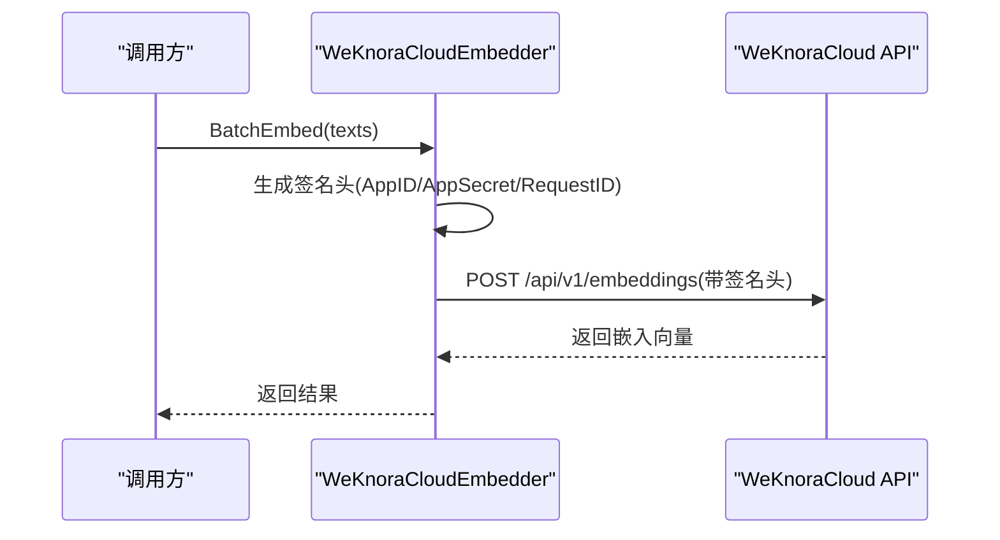
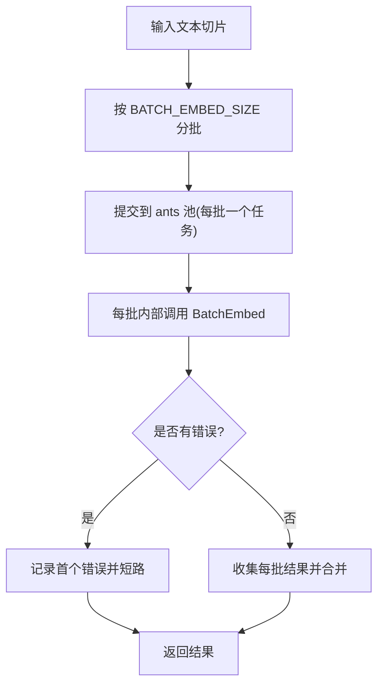
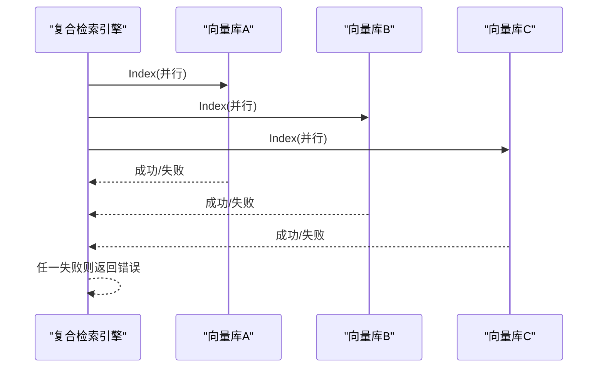
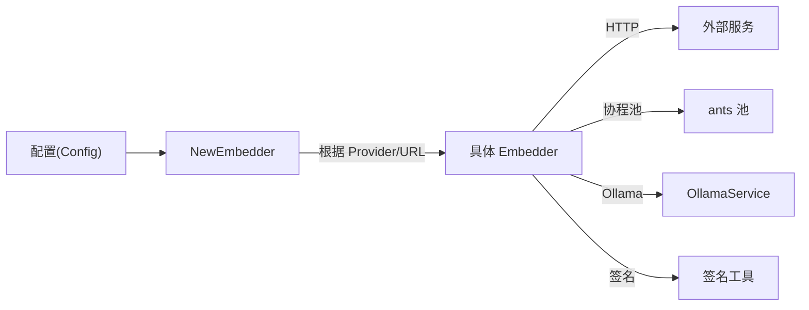

# 嵌入模型提供商集成

<cite>
**本文引用的文件**
- [embedder.go](file://internal/models/embedding/embedder.go)
- [openai.go](file://internal/models/embedding/openai.go)
- [azure_openai.go](file://internal/models/embedding/azure_openai.go)
- [ollama.go](file://internal/models/embedding/ollama.go)
- [weknoracloud.go](file://internal/models/embedding/weknoracloud.go)
- [batch.go](file://internal/models/embedding/batch.go)
- [provider.go](file://internal/models/provider/provider.go)
- [azure_openai_provider.go](file://internal/models/provider/azure_openai.go)
- [vectorstore.go](file://internal/application/service/vectorstore.go)
- [embedding.go](file://internal/types/embedding.go)
- [ollama_service.go](file://internal/models/utils/ollama/ollama.go)
- [composite.go](file://internal/application/service/retriever/composite.go)
- [keywords_vector_hybrid_indexer.go](file://internal/application/service/retriever/keywords_vector_hybrid_indexer.go)
</cite>

## 目录
1. [简介](#简介)
2. [项目结构](#项目结构)
3. [核心组件](#核心组件)
4. [架构总览](#架构总览)
5. [详细组件分析](#详细组件分析)
6. [依赖关系分析](#依赖关系分析)
7. [性能与成本考量](#性能与成本考量)
8. [故障排查指南](#故障排查指南)
9. [结论](#结论)
10. [附录](#附录)

## 简介
本文件面向嵌入模型提供商集成，系统性介绍 WeKnora 在嵌入向量化方面的多提供商支持与工程化实践。重点覆盖：
- OpenAI Embeddings API 的集成与请求重试
- Azure OpenAI 的认证与资源配置、版本参数与多区域部署建议
- 本地 Ollama 服务的集成、模型可用性保障与推理优化
- WeKnora Cloud 嵌入服务的调用与签名认证
- 批量嵌入处理与并发池化
- 多提供商负载均衡与故障转移策略
- API 限流与重试最佳实践
- 向量标准化与归一化处理建议

## 项目结构
嵌入模型相关代码主要位于 internal/models/embedding 与 internal/models/provider 下，并通过 internal/application/service/retriever 中的复合检索引擎进行编排。

**图表来源**
- [embedder.go:15-37](file://internal/models/embedding/embedder.go#L15-L37)
- [openai.go:16-29](file://internal/models/embedding/openai.go#L16-L29)
- [azure_openai.go:17-30](file://internal/models/embedding/azure_openai.go#L17-L30)
- [ollama.go:13-21](file://internal/models/embedding/ollama.go#L13-L21)
- [weknoracloud.go:19-30](file://internal/models/embedding/weknoracloud.go#L19-L30)
- [batch.go:13-19](file://internal/models/embedding/batch.go#L13-L19)
- [provider.go:149-160](file://internal/models/provider/provider.go#L149-L160)
- [azure_openai_provider.go:9-47](file://internal/models/provider/azure_openai_provider.go#L9-L47)
- [vectorstore.go:16-34](file://internal/application/service/vectorstore.go#L16-L34)
- [composite.go:169-197](file://internal/application/service/retriever/composite.go#L169-L197)
- [keywords_vector_hybrid_indexer.go:77-110](file://internal/application/service/retriever/keywords_vector_hybrid_indexer.go#L77-L110)

**章节来源**
- [embedder.go:1-243](file://internal/models/embedding/embedder.go#L1-L243)
- [provider.go:1-296](file://internal/models/provider/provider.go#L1-L296)
- [vectorstore.go:1-190](file://internal/application/service/vectorstore.go#L1-L190)

## 核心组件
- 统一嵌入接口与工厂：Embedder 接口定义 Embed/BatchEmbed 等能力；NewEmbedder 根据配置选择具体提供商实现。
- OpenAI 兼容嵌入器：支持自定义头部、超时、重试与输入长度校验。
- Azure OpenAI 嵌入器：基于资源域名与部署名，支持 api-version 与维度参数条件判断。
- 本地 Ollama 嵌入器：通过 OllamaService 确保模型可用并执行嵌入。
- WeKnora Cloud 嵌入器：基于 AppID/AppSecret 的签名认证与远程调用。
- 批量嵌入池化：基于 ants 协程池分批并发执行，提升吞吐。
- 提供商注册与检测：统一 Provider 接口、注册表与 URL 自动识别。
- 向量存储与检索编排：向量存储服务、复合检索引擎与混合索引器。

**章节来源**
- [embedder.go:15-95](file://internal/models/embedding/embedder.go#L15-L95)
- [openai.go:16-82](file://internal/models/embedding/openai.go#L16-L82)
- [azure_openai.go:17-74](file://internal/models/embedding/azure_openai.go#L17-L74)
- [ollama.go:13-60](file://internal/models/embedding/ollama.go#L13-L60)
- [weknoracloud.go:19-54](file://internal/models/embedding/weknoracloud.go#L19-L54)
- [batch.go:13-96](file://internal/models/embedding/batch.go#L13-L96)
- [provider.go:141-160](file://internal/models/provider/provider.go#L141-L160)

## 架构总览
下图展示了嵌入调用从配置到执行的关键路径，以及多提供商路由与重试策略。

**图表来源**
- [embedder.go:97-242](file://internal/models/embedding/embedder.go#L97-L242)
- [provider.go:215-267](file://internal/models/provider/provider.go#L215-L267)

**章节来源**
- [embedder.go:82-95](file://internal/models/embedding/embedder.go#L82-L95)
- [provider.go:155-180](file://internal/models/provider/provider.go#L155-L180)

## 详细组件分析

### OpenAI 嵌入器
- 功能要点
  - 默认 BaseURL 与模型名必填校验
  - 自定义请求头注入
  - 超时与指数回退重试（最多3次）
  - 输入长度校验与日志记录
  - 批量嵌入与单条嵌入封装
- 错误处理
  - 非 200 状态码统一记录响应体并返回错误
  - JSON 解析失败与读取响应体失败均有明确错误包装
- 性能与可维护性
  - 通过 SetCustomHeaders 支持透传额外头部
  - 日志级别区分调试与错误，便于定位问题

**图表来源**
- [openai.go:146-230](file://internal/models/embedding/openai.go#L146-L230)

**章节来源**
- [openai.go:47-82](file://internal/models/embedding/openai.go#L47-L82)
- [openai.go:104-144](file://internal/models/embedding/openai.go#L104-L144)
- [openai.go:146-230](file://internal/models/embedding/openai.go#L146-L230)

### Azure OpenAI 嵌入器
- 认证与 URL
  - 使用 api-key 头部，URL 采用资源域 + 部署名 + api-version
- 维度参数支持
  - 仅在满足版本与模型条件时才携带 dimensions 字段
- 重试与超时
  - 与 OpenAI 类似，具备指数回退重试与超时控制
- 多区域与负载均衡
  - 通过不同资源域名实现多区域部署与切换
  - 结合工厂层的 Provider 检测与路由，实现按 BaseURL 自动识别

**图表来源**
- [azure_openai.go:89-138](file://internal/models/embedding/azure_openai.go#L89-L138)
- [azure_openai.go:140-175](file://internal/models/embedding/azure_openai.go#L140-L175)
- [azure_openai_provider.go:16-47](file://internal/models/provider/azure_openai_provider.go#L16-L47)

**章节来源**
- [azure_openai.go:44-74](file://internal/models/embedding/azure_openai.go#L44-L74)
- [azure_openai.go:89-138](file://internal/models/embedding/azure_openai.go#L89-L138)
- [azure_openai.go:177-204](file://internal/models/embedding/azure_openai.go#L177-L204)

### 本地 Ollama 嵌入器
- 模型可用性保障
  - 通过 OllamaService 确认服务可用与模型存在，不存在则拉取
  - 支持 OLLAMA_OPTIONAL 模式，服务不可用时不中断主流程
- 截断参数
  - 通过 num_ctx 与 Truncate 控制上下文长度
- 执行流程
  - 确保模型可用 -> 构造 EmbedRequest -> 调用 Embeddings -> 返回向量

**图表来源**
- [ollama.go:82-112](file://internal/models/embedding/ollama.go#L82-L112)
- [ollama_service.go:189-212](file://internal/models/utils/ollama/ollama.go#L189-L212)

**章节来源**
- [ollama.go:35-60](file://internal/models/embedding/ollama.go#L35-L60)
- [ollama.go:82-112](file://internal/models/embedding/ollama.go#L82-L112)
- [ollama_service.go:28-71](file://internal/models/utils/ollama/ollama.go#L28-L71)

### WeKnora Cloud 嵌入器
- 认证与签名
  - 基于 AppID/AppSecret 生成签名头，确保请求合法性
- 远程模型名
  - 支持 remote_model_name 覆盖实际使用的远端模型名
- 错误处理
  - 非 200 状态码直接返回错误，包含响应体摘要

**图表来源**
- [weknoracloud.go:80-125](file://internal/models/embedding/weknoracloud.go#L80-L125)

**章节来源**
- [weknoracloud.go:32-54](file://internal/models/embedding/weknoracloud.go#L32-L54)
- [weknoracloud.go:80-125](file://internal/models/embedding/weknoracloud.go#L80-L125)

### 批量嵌入与并发池化
- 分批策略
  - 通过环境变量 BATCH_EMBED_SIZE 控制批次大小，默认 5
- 并发执行
  - 使用 ants 协程池提交任务，WaitGroup 等待全部完成
  - 首个错误记录并返回，保证一致性
- 混合索引器中的应用
  - 在关键词+向量混合索引中，使用 BatchEmbedWithPool 批量生成向量后分批入库

**图表来源**
- [batch.go:26-95](file://internal/models/embedding/batch.go#L26-L95)
- [keywords_vector_hybrid_indexer.go:77-110](file://internal/application/service/retriever/keywords_vector_hybrid_indexer.go#L77-L110)

**章节来源**
- [batch.go:17-96](file://internal/models/embedding/batch.go#L17-L96)
- [keywords_vector_hybrid_indexer.go:77-110](file://internal/application/service/retriever/keywords_vector_hybrid_indexer.go#L77-L110)

### 多提供商负载均衡与故障转移
- 路由策略
  - 优先使用显式 Provider，否则根据 BaseURL 自动检测
  - AzureOpenAI、Aliyun、Jina、NVIDIA 等均提供专用实现
- 故障转移
  - 复合检索引擎在多个后端仓库上并行写入，任一失败即返回错误
  - 建议在多区域部署时，将不同区域的资源域名作为候选，结合重试与降级策略

**图表来源**
- [composite.go:205-218](file://internal/application/service/retriever/composite.go#L205-L218)

**章节来源**
- [embedder.go:105-242](file://internal/models/embedding/embedder.go#L105-L242)
- [provider.go:215-267](file://internal/models/provider/provider.go#L215-L267)
- [composite.go:169-197](file://internal/application/service/retriever/composite.go#L169-L197)

## 依赖关系分析
- 组件耦合
  - Embedder 工厂与 Provider 注册表松耦合，通过字符串键值路由
  - OllamaEmbedder 依赖 OllamaService，后者提供服务可用性与模型管理
  - WeKnoraCloudEmbedder 依赖签名工具生成认证头
- 外部依赖
  - HTTP 客户端与超时控制
  - ants 协程池用于批量嵌入并发
  - Ollama 官方 Go SDK

**图表来源**
- [embedder.go:97-242](file://internal/models/embedding/embedder.go#L97-L242)
- [batch.go:17-19](file://internal/models/embedding/batch.go#L17-L19)
- [ollama_service.go:28-71](file://internal/models/utils/ollama/ollama.go#L28-L71)
- [weknoracloud.go:87-97](file://internal/models/embedding/weknoracloud.go#L87-L97)

**章节来源**
- [embedder.go:97-242](file://internal/models/embedding/embedder.go#L97-L242)
- [batch.go:17-19](file://internal/models/embedding/batch.go#L17-L19)
- [ollama_service.go:28-71](file://internal/models/utils/ollama/ollama.go#L28-L71)

## 性能与成本考量
- 响应时间
  - OpenAI/Azure：受网络与并发影响，建议启用批量与重试
  - Ollama：本地推理延迟取决于模型与硬件，建议合理设置 num_ctx
  - WeKnora Cloud：依赖网络与签名开销，建议批量与缓存
- 成本
  - OpenAI/Azure：按 token 或请求计费，需关注维度与输入长度
  - Ollama：本地部署，主要成本为硬件与能耗
  - WeKnora Cloud：按调用量与维度配置计费，建议开启缓存与复用
- 优化建议
  - 批量嵌入与并发池化
  - 合理设置截断长度与维度
  - 多区域部署与就近访问
  - 缓存热点向量与去重

[本节为通用指导，无需特定文件引用]

## 故障排查指南
- 常见错误与定位
  - 非 200 状态码：检查鉴权头、URL、模型名与 api-version
  - JSON 解析失败：确认响应体格式与长度限制
  - Ollama 不可用：检查 OLLAMA_BASE_URL、服务心跳与 OPTIONAL 模式
  - WeKnora Cloud 签名失败：核对 AppID/AppSecret 与签名生成逻辑
- 日志与调试
  - 嵌入器内置调试日志，建议在问题定位阶段开启 LLM 调试
  - 复合检索引擎记录各后端保存失败原因

**章节来源**
- [openai.go:206-214](file://internal/models/embedding/openai.go#L206-L214)
- [azure_openai.go:120-126](file://internal/models/embedding/azure_openai.go#L120-L126)
- [ollama_service.go:74-95](file://internal/models/utils/ollama/ollama.go#L74-L95)
- [weknoracloud.go:109-111](file://internal/models/embedding/weknoracloud.go#L109-L111)
- [composite.go:205-218](file://internal/application/service/retriever/composite.go#L205-L218)

## 结论
WeKnora 的嵌入模型提供商集成以统一接口与工厂为核心，结合 Provider 注册表与 URL 自动识别，实现了对 OpenAI、Azure OpenAI、Ollama、WeKnora Cloud 等多提供商的无缝接入。通过批量嵌入池化、指数回退重试与复合检索引擎的并行写入，系统在性能与可靠性方面具备良好表现。建议在生产环境中结合多区域部署、缓存与限流策略，进一步提升稳定性与成本效率。

[本节为总结，无需特定文件引用]

## 附录

### API 限流与重试最佳实践
- 指数回退
  - 初始等待 1s，上限 10s，避免雪崩效应
- 并发控制
  - 使用 ants 池限制并发度，避免打满外部服务
- 超时设置
  - 明确请求超时与上下文取消，防止阻塞
- 重试条件
  - 对瞬时网络错误与 5xx 响应进行重试，对 4xx 参数错误不重试

**章节来源**
- [openai.go:109-144](file://internal/models/embedding/openai.go#L109-L144)
- [azure_openai.go:147-175](file://internal/models/embedding/azure_openai.go#L147-L175)
- [batch.go:75-81](file://internal/models/embedding/batch.go#L75-L81)

### 向量标准化与归一化
- 归一化（L2）
  - 将向量除以其 L2 范数，使向量单位化，有利于余弦相似度计算
- 标准化（Z-score）
  - 对每个维度减去均值并除以标准差，适用于分布偏移场景
- 建议
  - 在检索前统一进行归一化，减少维度偏差对相似度的影响
  - 若下游使用内积而非余弦相似度，可考虑标准化后再归一化

[本节为通用指导，无需特定文件引用]