# 嵌入模型管理

<cite>
**本文引用的文件**
- [embedder.go](file://internal/models/embedding/embedder.go)
- [batch.go](file://internal/models/embedding/batch.go)
- [openai.go](file://internal/models/embedding/openai.go)
- [ollama.go](file://internal/models/embedding/ollama.go)
- [weknoracloud.go](file://internal/models/embedding/weknoracloud.go)
- [aliyun.go](file://internal/models/embedding/aliyun.go)
- [provider.go](file://internal/models/provider/provider.go)
- [vectorstore.go](file://internal/application/service/vectorstore.go)
- [repository.go](file://internal/application/repository/retriever/weaviate/repository.go)
- [keywords_vector_hybrid_indexer.go](file://internal/application/service/retriever/keywords_vector_hybrid_indexer.go)
- [evaluation.go](file://internal/application/service/evaluation.go)
- [evaluation.go](file://client/evaluation.go)
- [evaluation.go](file://internal/types/evaluation.go)
- [metric_hook.go](file://internal/application/service/metric_hook.go)
- [config_from_model_test.go](file://internal/models/embedding/config_from_model_test.go)
- [langfuse_wrapper.go](file://internal/models/embedding/langfuse_wrapper.go)
</cite>

## 目录
1. [简介](#简介)
2. [项目结构](#项目结构)
3. [核心组件](#核心组件)
4. [架构总览](#架构总览)
5. [详细组件分析](#详细组件分析)
6. [依赖分析](#依赖分析)
7. [性能考量](#性能考量)
8. [故障排查指南](#故障排查指南)
9. [结论](#结论)
10. [附录](#附录)

## 简介
本文件面向WeKnora的嵌入模型管理，系统性阐述嵌入模型的配置与管理机制、多提供商API集成（OpenAI、Azure OpenAI、阿里云DashScope、本地Ollama、WeKnora Cloud等）、批量与流式处理策略、质量评估与性能监控、热更新与回滚、向量压缩与存储优化、自定义模型集成、负载均衡与故障转移、以及成本优化与资源管理最佳实践。文档以代码为依据，辅以可视化图示，帮助开发者与运维人员快速掌握嵌入系统的整体设计与落地细节。

## 项目结构
WeKnora在嵌入模型管理方面采用“统一接口 + 多提供商适配 + 批处理池化 + 向量库解耦”的分层架构：
- 统一接口层：定义Embedder接口与批处理池化接口，屏蔽不同提供商差异
- 提供商适配层：针对OpenAI、Azure OpenAI、阿里云、Ollama、WeKnora Cloud等提供独立实现
- 批处理与并发层：基于goroutine池与环境变量控制的批大小，提升吞吐
- 应用服务层：在索引与检索流程中调用嵌入器，完成向量化与持久化
- 向量库层：通过服务抽象对接多种向量数据库（如Weaviate），按维度分集合存储
- 评估与监控：内置评估任务、指标计算与Langfuse链路追踪

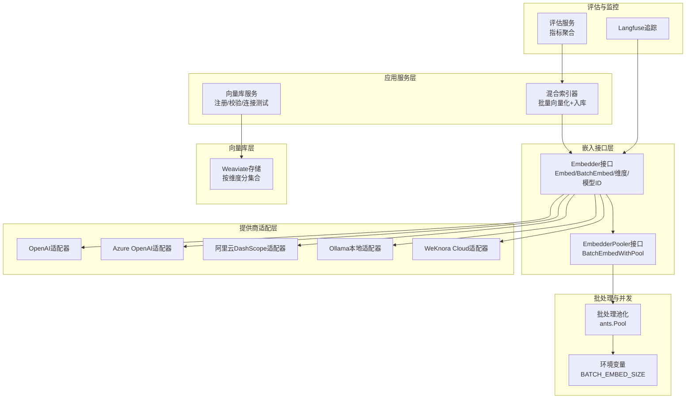

图表来源
- [embedder.go:15-37](file://internal/models/embedding/embedder.go#L15-L37)
- [batch.go:13-19](file://internal/models/embedding/batch.go#L13-L19)
- [openai.go:16-29](file://internal/models/embedding/openai.go#L16-L29)
- [ollama.go:13-21](file://internal/models/embedding/ollama.go#L13-L21)
- [weknoracloud.go:19-30](file://internal/models/embedding/weknoracloud.go#L19-L30)
- [aliyun.go:22-35](file://internal/models/embedding/aliyun.go#L22-L35)
- [vectorstore.go:16-34](file://internal/application/service/vectorstore.go#L16-L34)
- [repository.go:239-276](file://internal/application/repository/retriever/weaviate/repository.go#L239-L276)
- [keywords_vector_hybrid_indexer.go:65-110](file://internal/application/service/retriever/keywords_vector_hybrid_indexer.go#L65-L110)
- [evaluation.go:39-56](file://internal/application/service/evaluation.go#L39-L56)
- [langfuse_wrapper.go:45-84](file://internal/models/embedding/langfuse_wrapper.go#L45-L84)

章节来源
- [embedder.go:15-95](file://internal/models/embedding/embedder.go#L15-L95)
- [batch.go:13-95](file://internal/models/embedding/batch.go#L13-L95)
- [provider.go:12-92](file://internal/models/provider/provider.go#L12-L92)

## 核心组件
- 统一接口与工厂
  - Embedder接口：定义单文本与批量向量化、维度查询、模型信息查询
  - EmbedderPooler接口：提供带池化的批量向量化能力
  - 工厂函数NewEmbedder：根据配置与来源选择具体适配器；可叠加调试与Langfuse追踪包装器
- 提供商适配器
  - OpenAI/Ollama/WeKnora Cloud/阿里云等均实现Embedder接口，具备重试、超时、自定义头部等通用能力
- 批处理与并发
  - 基于ants.Pool的goroutine池，按环境变量BATCH_EMBED_SIZE切片并发提交任务，降低单次请求压力
- 应用服务与向量库
  - 混合索引器在入库前批量生成向量；向量库服务负责连接校验、版本探测与注册
  - Weaviate按维度分集合存储，避免维度不一致导致的写入失败

章节来源
- [embedder.go:15-95](file://internal/models/embedding/embedder.go#L15-L95)
- [batch.go:13-95](file://internal/models/embedding/batch.go#L13-L95)
- [openai.go:47-82](file://internal/models/embedding/openai.go#L47-L82)
- [ollama.go:35-60](file://internal/models/embedding/ollama.go#L35-L60)
- [weknoracloud.go:32-54](file://internal/models/embedding/weknoracloud.go#L32-L54)
- [aliyun.go:79-120](file://internal/models/embedding/aliyun.go#L79-L120)
- [vectorstore.go:36-99](file://internal/application/service/vectorstore.go#L36-L99)
- [repository.go:239-276](file://internal/application/repository/retriever/weaviate/repository.go#L239-L276)

## 架构总览
下图展示了嵌入模型从配置到向量入库的关键路径，包括提供商检测、适配器选择、批处理并发、Langfuse追踪与向量库存储。

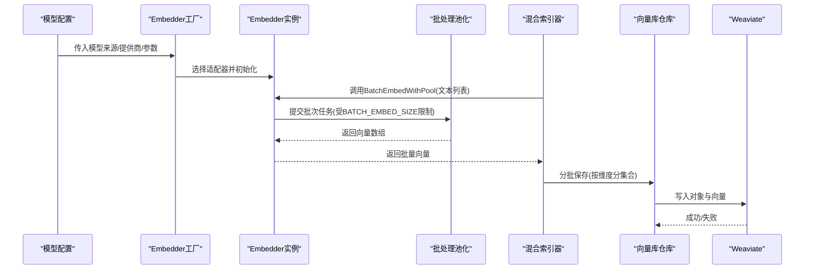

图表来源
- [embedder.go:82-95](file://internal/models/embedding/embedder.go#L82-L95)
- [batch.go:26-95](file://internal/models/embedding/batch.go#L26-L95)
- [keywords_vector_hybrid_indexer.go:65-110](file://internal/application/service/retriever/keywords_vector_hybrid_indexer.go#L65-L110)
- [repository.go:239-276](file://internal/application/repository/retriever/weaviate/repository.go#L239-L276)

## 详细组件分析

### 组件A：嵌入器工厂与提供商路由
- 功能要点
  - 根据模型来源（本地/远程）与提供商名称（OpenAI/Azure OpenAI/阿里云/WeKnora Cloud/通用兼容）选择适配器
  - 自动设置自定义HTTP头部、维度、截断长度等参数
  - 可选启用Langfuse追踪与调试包装器
- 关键流程
  - 解析模型参数，构造Config
  - 路由到对应提供商适配器或通用OpenAI兼容适配器
  - 返回可直接使用的Embedder实例

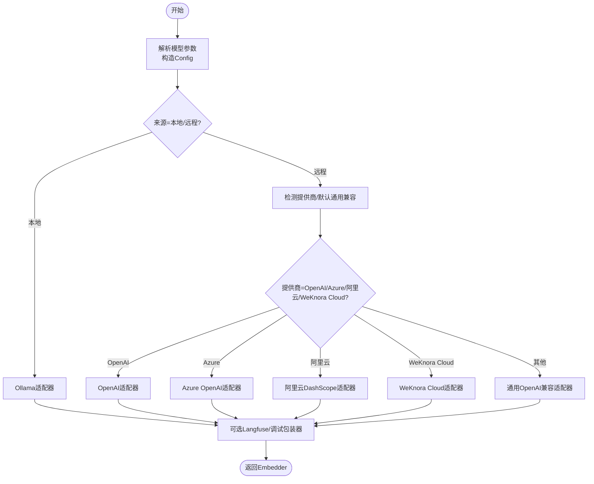

图表来源
- [embedder.go:82-242](file://internal/models/embedding/embedder.go#L82-L242)
- [provider.go:215-267](file://internal/models/provider/provider.go#L215-L267)

章节来源
- [embedder.go:82-242](file://internal/models/embedding/embedder.go#L82-L242)
- [provider.go:12-92](file://internal/models/provider/provider.go#L12-L92)

### 组件B：OpenAI与Azure OpenAI适配器
- OpenAI适配器
  - 默认BaseURL与模型名必填校验，支持自定义头部、重试与超时
  - 批量请求时自动设置encoding_format为float，支持truncate_prompt_tokens
- Azure OpenAI适配器
  - 通过提供商检测自动识别，其余行为与OpenAI兼容适配器一致

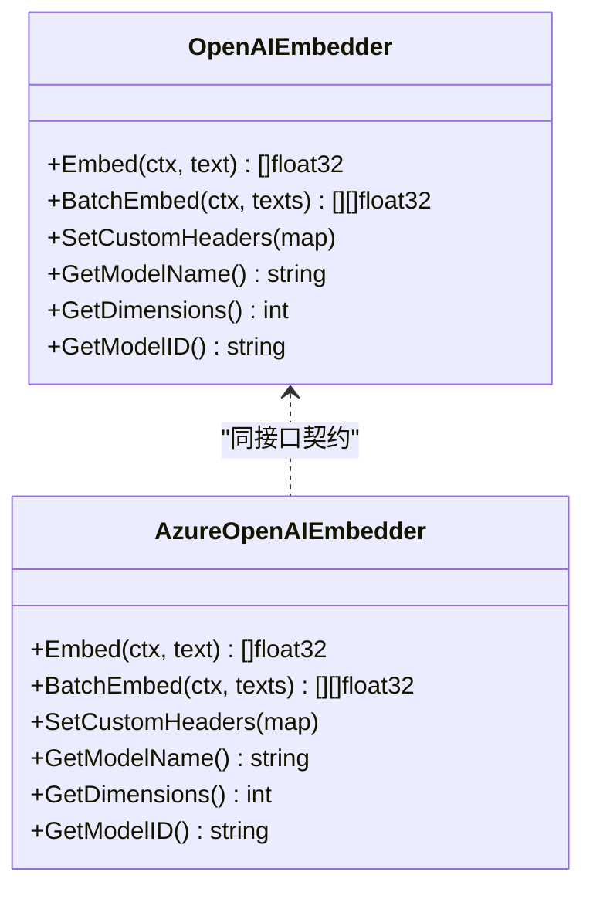

图表来源
- [openai.go:16-29](file://internal/models/embedding/openai.go#L16-L29)
- [provider.go:60-62](file://internal/models/provider/provider.go#L60-L62)

章节来源
- [openai.go:47-246](file://internal/models/embedding/openai.go#L47-L246)

### 组件C：Ollama本地适配器
- 特性
  - 通过OllamaService确保模型可用后再发起Embedding请求
  - 支持truncate参数映射到num_ctx与Truncate标志
- 流程
  - ensureModelAvailable -> Embeddings调用 -> 返回向量数组

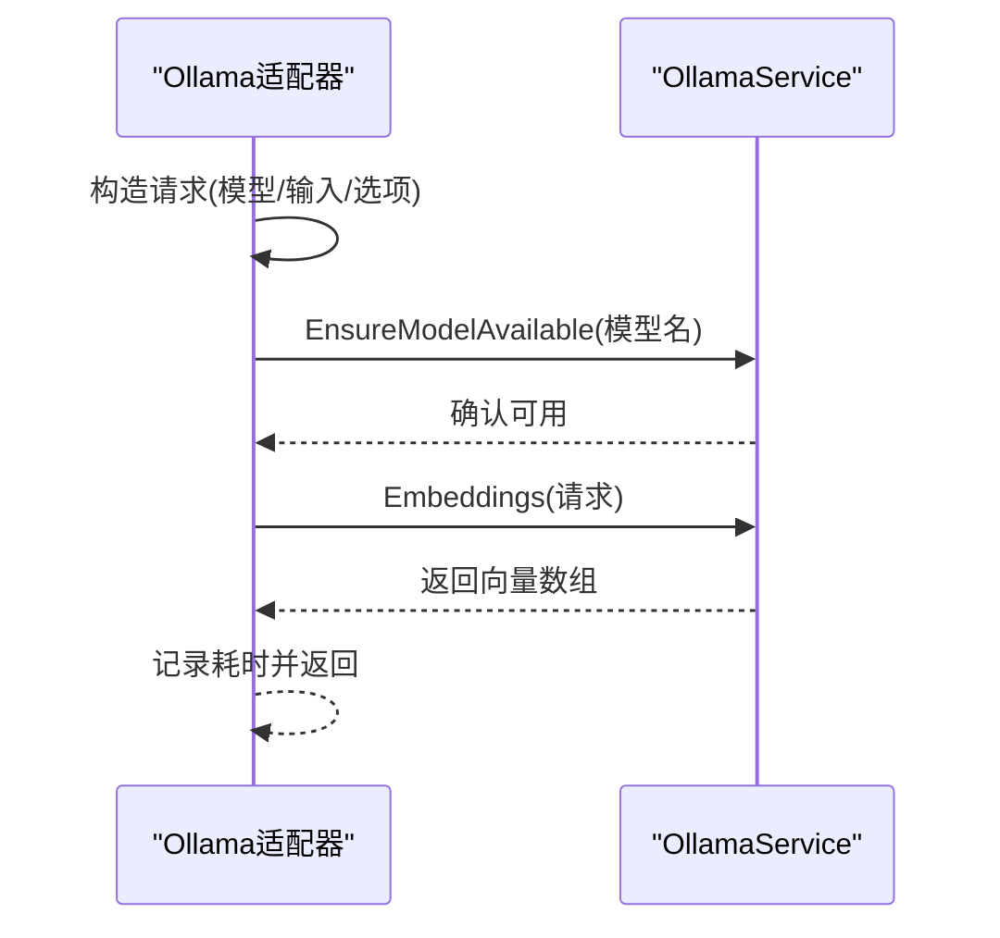

图表来源
- [ollama.go:62-112](file://internal/models/embedding/ollama.go#L62-L112)

章节来源
- [ollama.go:35-128](file://internal/models/embedding/ollama.go#L35-L128)

### 组件D：WeKnora Cloud适配器
- 特性
  - 通过AppID/AppSecret签名请求头，支持remote_model_name覆盖远端模型名
  - 统一的JSON请求/响应结构，按Index映射结果顺序
- 流程
  - 构造请求体 -> 生成签名头 -> 发送POST -> 解析响应 -> 按索引组装结果

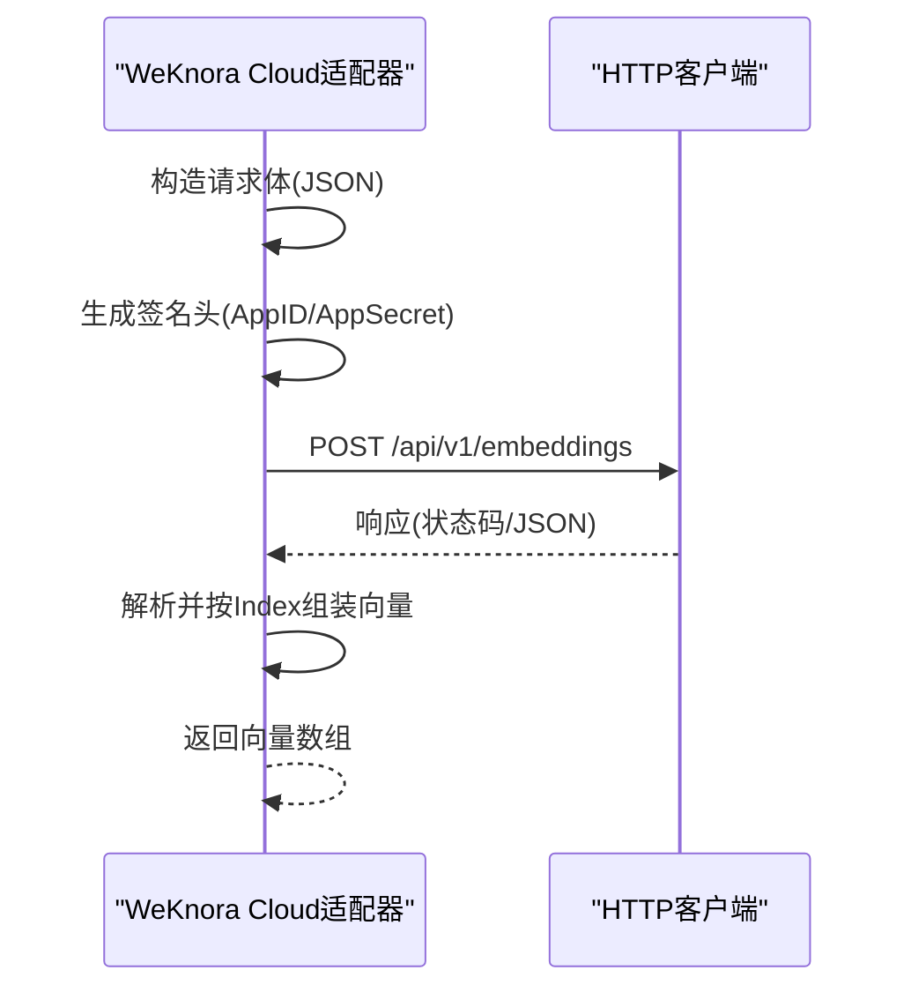

图表来源
- [weknoracloud.go:80-125](file://internal/models/embedding/weknoracloud.go#L80-L125)

章节来源
- [weknoracloud.go:32-141](file://internal/models/embedding/weknoracloud.go#L32-L141)

### 组件E：阿里云DashScope适配器
- 特性
  - 支持多模态输入结构，批量请求时按text_index还原顺序
  - 错误响应解析，便于定位问题
- 流程
  - 文本转Contents -> 发送请求 -> 解析输出 -> 按索引组装

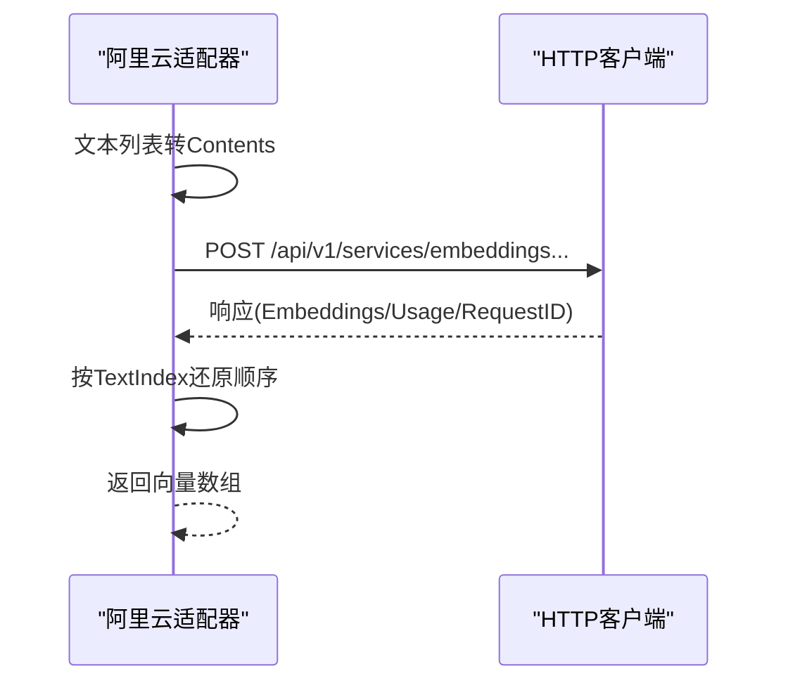

图表来源
- [aliyun.go:177-240](file://internal/models/embedding/aliyun.go#L177-L240)

章节来源
- [aliyun.go:79-256](file://internal/models/embedding/aliyun.go#L79-L256)

### 组件F：批处理与并发（ants.Pool）
- 特性
  - 通过环境变量BATCH_EMBED_SIZE控制每批任务数量，默认5
  - 使用WaitGroup与互斥锁记录首个错误，保证一致性
  - 将文本切分为批次，提交至goroutine池并发执行
- 流程

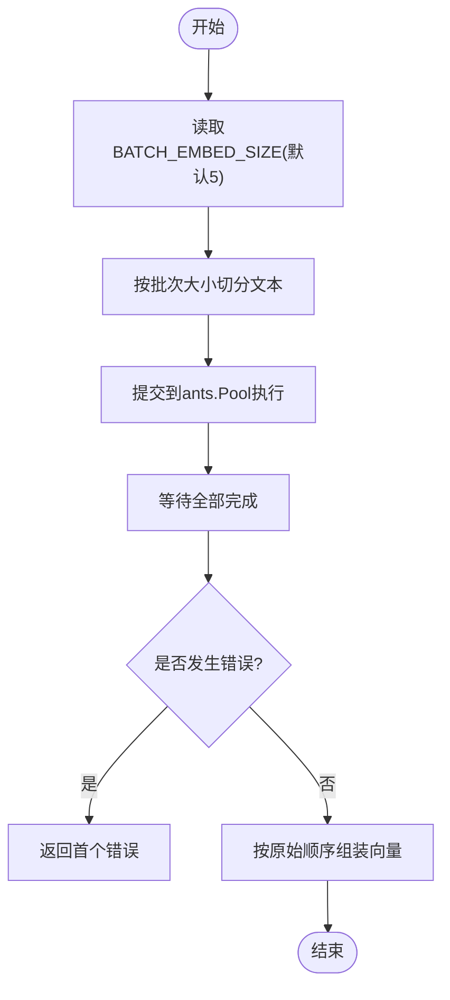

图表来源
- [batch.go:26-95](file://internal/models/embedding/batch.go#L26-L95)

章节来源
- [batch.go:13-95](file://internal/models/embedding/batch.go#L13-L95)

### 组件G：向量库存储（Weaviate）
- 特性
  - 按维度分集合存储，避免维度不一致导致的写入失败
  - 写入前过滤空向量，减少无效请求
- 流程

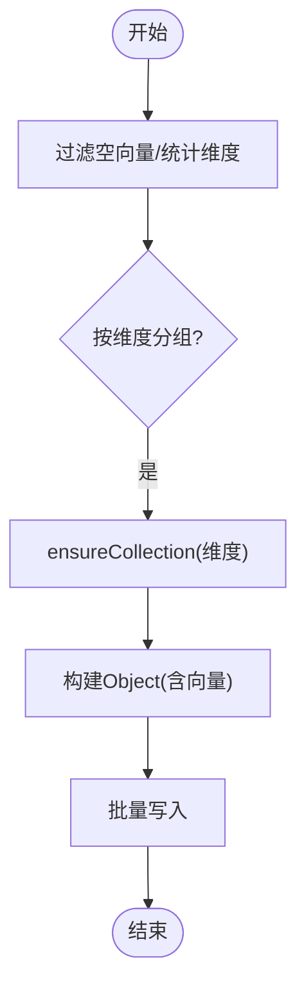

图表来源
- [repository.go:239-276](file://internal/application/repository/retriever/weaviate/repository.go#L239-L276)

章节来源
- [repository.go:239-276](file://internal/application/repository/retriever/weaviate/repository.go#L239-L276)

### 组件H：评估与指标
- 评估服务
  - 注册评估任务、后台执行、状态更新与错误记录
  - 支持嵌入、检索、重排序后的指标计算
- 指标计算
  - Precision/Recall/NDCG/MRR/MAP等检索指标
  - BLEU/ROUGE等生成指标
- 客户端与类型
  - 客户端定义EvaluationRequest/EvaluationResult
  - 类型定义EvalState与指标结构

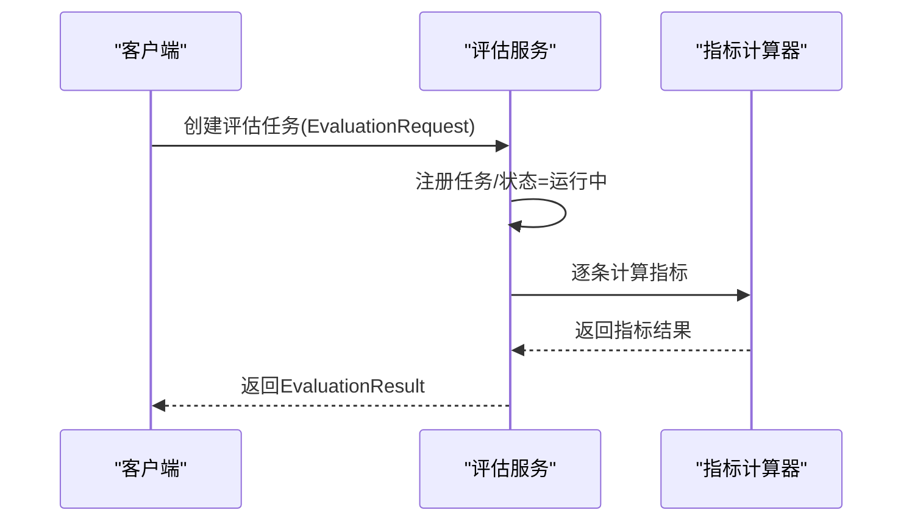

图表来源
- [evaluation.go:39-332](file://internal/application/service/evaluation.go#L39-L332)
- [evaluation.go:27-51](file://client/evaluation.go#L27-L51)
- [evaluation.go:68-99](file://internal/types/evaluation.go#L68-L99)
- [metric_hook.go:13-32](file://internal/application/service/metric_hook.go#L13-L32)

章节来源
- [evaluation.go:39-332](file://internal/application/service/evaluation.go#L39-L332)
- [evaluation.go:27-51](file://client/evaluation.go#L27-L51)
- [evaluation.go:68-99](file://internal/types/evaluation.go#L68-L99)
- [metric_hook.go:13-32](file://internal/application/service/metric_hook.go#L13-L32)

## 依赖分析
- 组件耦合
  - Embedder工厂与提供商注册表解耦，新增提供商仅需实现接口并注册
  - 批处理池化与具体适配器解耦，通过EmbedderPooler接口统一调度
  - 应用服务与向量库解耦，通过服务抽象与工厂创建引擎
- 外部依赖
  - HTTP客户端、重试与超时策略
  - ants.Pool并发调度
  - Langfuse链路追踪（可选）

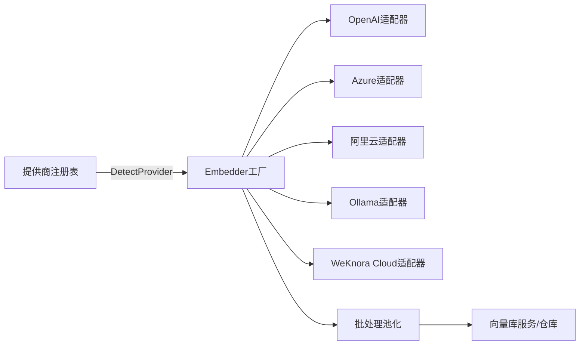

图表来源
- [provider.go:149-193](file://internal/models/provider/provider.go#L149-L193)
- [embedder.go:97-242](file://internal/models/embedding/embedder.go#L97-L242)
- [batch.go:13-19](file://internal/models/embedding/batch.go#L13-L19)
- [vectorstore.go:140-160](file://internal/application/service/vectorstore.go#L140-L160)

章节来源
- [provider.go:149-296](file://internal/models/provider/provider.go#L149-L296)
- [embedder.go:97-242](file://internal/models/embedding/embedder.go#L97-L242)

## 性能考量
- 批处理与并发
  - 通过BATCH_EMBED_SIZE控制批次大小，平衡吞吐与内存占用
  - ants.Pool限制并发度，避免后端过载
- 超时与重试
  - HTTP客户端统一超时与指数退避重试，提升稳定性
- 向量库写入
  - Weaviate按维度分集合，减少跨维度写入失败
- 监控与追踪
  - Langfuse封装BatchEmbed，记录输入预览、维度、批次大小与用量估算

章节来源
- [batch.go:26-95](file://internal/models/embedding/batch.go#L26-L95)
- [openai.go:104-144](file://internal/models/embedding/openai.go#L104-L144)
- [aliyun.go:136-175](file://internal/models/embedding/aliyun.go#L136-L175)
- [repository.go:255-276](file://internal/application/repository/retriever/weaviate/repository.go#L255-L276)
- [langfuse_wrapper.go:45-84](file://internal/models/embedding/langfuse_wrapper.go#L45-L84)

## 故障排查指南
- 常见问题
  - 输入长度异常：OpenAI适配器会记录长度越界警告，可能导致API错误
  - 空向量写入：Weaviate仓库会跳过空向量并告警
  - 重试与超时：适配器内置最大重试次数与超时时间，建议检查网络与密钥
- 排查步骤
  - 检查模型参数（BaseURL、APIKey、Provider、维度、截断长度）
  - 查看Langfuse追踪日志，确认批次大小与维度
  - 核对向量库连接配置与版本探测结果
  - 在评估服务中查看任务状态与错误信息

章节来源
- [openai.go:165-187](file://internal/models/embedding/openai.go#L165-L187)
- [repository.go:240-252](file://internal/application/repository/retriever/weaviate/repository.go#L240-L252)
- [langfuse_wrapper.go:45-74](file://internal/models/embedding/langfuse_wrapper.go#L45-L74)
- [evaluation.go:310-325](file://internal/application/service/evaluation.go#L310-L325)

## 结论
WeKnora的嵌入模型管理以统一接口为核心，通过提供商注册与工厂路由实现多厂商无缝接入；结合批处理池化与并发控制，在保证稳定性的同时最大化吞吐；在应用层与向量库层实现解耦，支持多种向量数据库；并通过Langfuse与评估体系实现可观测与质量保障。该架构为后续扩展新提供商、优化成本与资源管理提供了清晰路径。

## 附录

### A. 模型配置与参数映射
- 来源与提供商
  - Source: 本地/远程
  - Provider: openai/azure_openai/aliyun/generic/nvidia/jina/…（详见提供商常量）
- 关键参数
  - BaseURL/APIKey/ModelName/ModelID/Dimensions/TruncatePromptTokens
  - ExtraConfig/CustomerHeaders/Cloud AppID/AppSecret
- 配置验证与测试
  - 向量库服务在创建时进行连接配置校验与版本探测，失败即提示不可达

章节来源
- [embedder.go:42-80](file://internal/models/embedding/embedder.go#L42-L80)
- [provider.go:12-92](file://internal/models/provider/provider.go#L12-L92)
- [vectorstore.go:36-99](file://internal/application/service/vectorstore.go#L36-L99)

### B. 自定义嵌入模型集成步骤
- 实现Embedder接口（Embed/BatchEmbed/SetCustomHeaders/GetModelName/GetDimensions/GetModelID）
- 若为远程API，参考OpenAI/阿里云适配器的请求/响应结构与错误处理
- 若为本地服务，参考Ollama适配器的EnsureModelAvailable与Embeddings调用
- 在提供商注册表中注册或通过通用兼容适配器接入
- 在应用层通过Embedder工厂创建实例并接入批处理池化

章节来源
- [embedder.go:15-37](file://internal/models/embedding/embedder.go#L15-L37)
- [openai.go:16-29](file://internal/models/embedding/openai.go#L16-L29)
- [aliyun.go:22-35](file://internal/models/embedding/aliyun.go#L22-L35)
- [ollama.go:13-21](file://internal/models/embedding/ollama.go#L13-L21)
- [provider.go:149-193](file://internal/models/provider/provider.go#L149-L193)

### C. 质量评估与性能监控清单
- 评估任务
  - 创建评估任务、后台执行、状态更新、错误记录
- 指标计算
  - 检索：Precision/Recall/NDCG/MRR/MAP
  - 生成：BLEU/ROUGE
- 监控
  - Langfuse追踪BatchEmbed，记录输入预览、维度、批次大小与用量估算

章节来源
- [evaluation.go:39-332](file://internal/application/service/evaluation.go#L39-L332)
- [metric_hook.go:13-32](file://internal/application/service/metric_hook.go#L13-L32)
- [langfuse_wrapper.go:45-84](file://internal/models/embedding/langfuse_wrapper.go#L45-L84)

### D. 成本优化与资源管理最佳实践
- 批处理大小
  - 根据后端限流与延迟动态调整BATCH_EMBED_SIZE
- 并发控制
  - 通过ants.Pool限制并发，避免峰值抖动
- 向量维度
  - 选择合适维度模型，避免过大向量带来的存储与查询开销
- 缓存与复用
  - 对重复文本进行去重与缓存，减少重复请求
- 负载均衡与故障转移
  - 多提供商并行/降级策略（例如OpenAI失败时切换到通用兼容或备用提供商）
  - 向量库多副本/分片策略（按维度分集合已降低维度冲突风险）

章节来源
- [batch.go:26-95](file://internal/models/embedding/batch.go#L26-L95)
- [repository.go:255-276](file://internal/application/repository/retriever/weaviate/repository.go#L255-L276)
- [provider.go:215-267](file://internal/models/provider/provider.go#L215-L267)