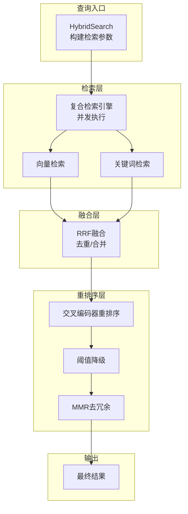
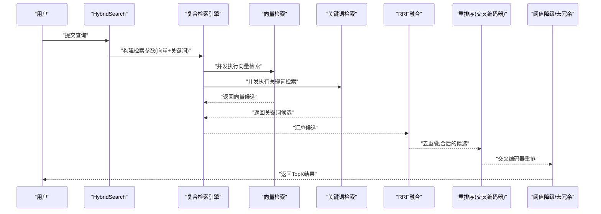
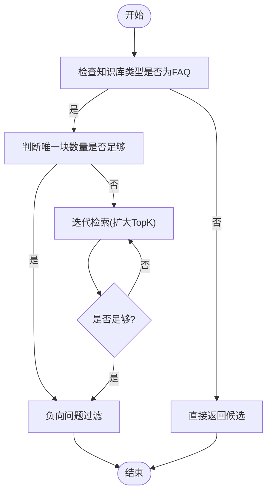
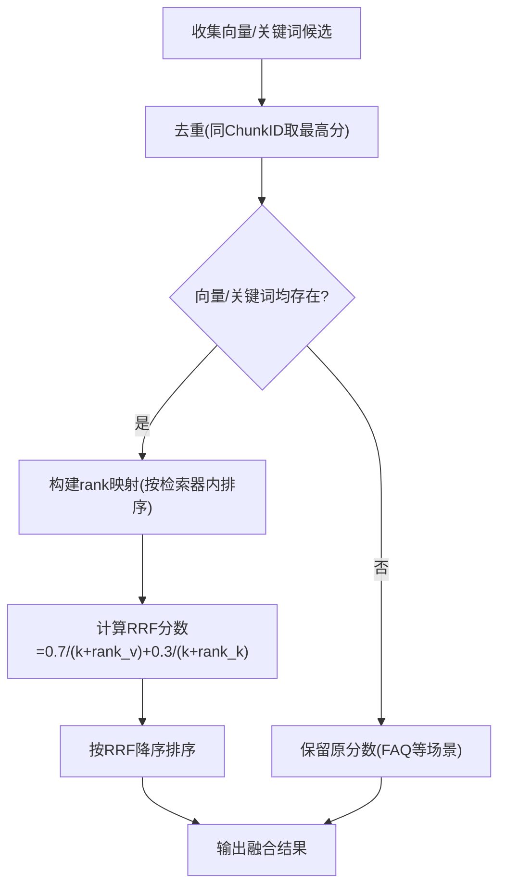
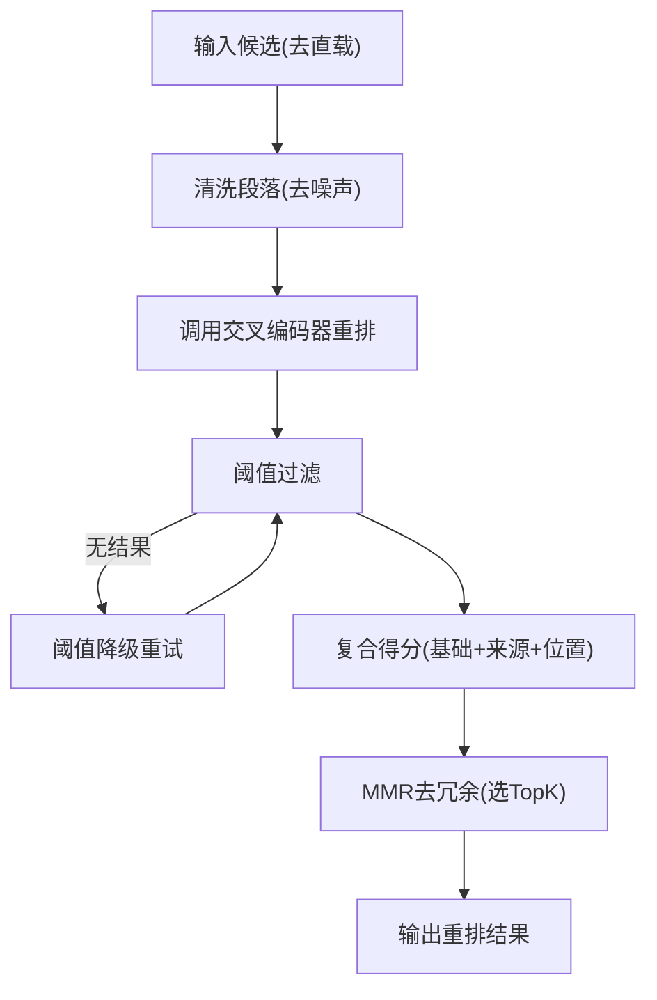
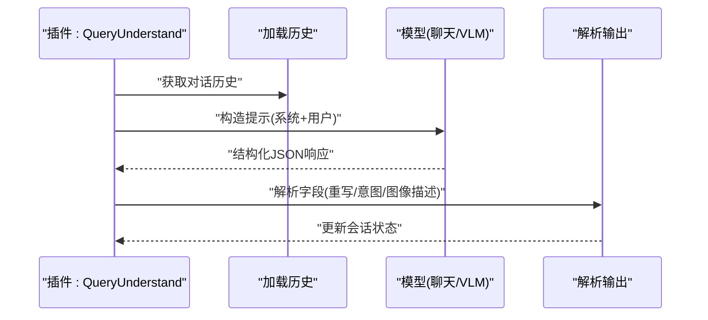
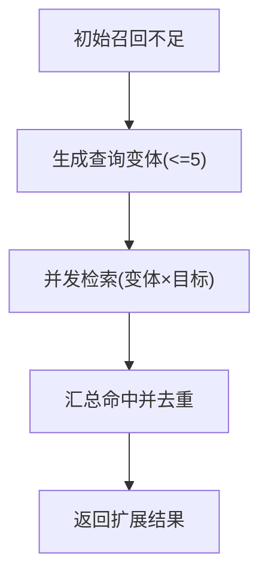
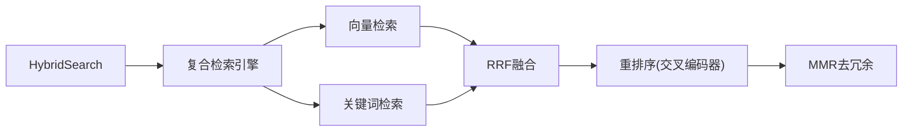

# 查询优化策略

<cite>
**本文引用的文件**
- [knowledgebase_search_fusion.go](file://internal/application/service/knowledgebase_search_fusion.go)
- [knowledgebase_search.go](file://internal/application/service/knowledgebase_search.go)
- [query_expansion.go](file://internal/application/service/chat_pipeline/query_expansion.go)
- [query_understand.go](file://internal/application/service/chat_pipeline/query_understand.go)
- [rerank.go](file://internal/application/service/chat_pipeline/rerank.go)
- [vectorstore.go](file://internal/types/vectorstore.go)
- [composite.go](file://internal/application/service/retriever/composite.go)
- [repository.go (Postgres)](file://internal/application/repository/retriever/postgres/repository.go)
- [repository.go (Elasticsearch)](file://internal/application/repository/retriever/elasticsearch/v8/repository.go)
- [repository.go (Milvus)](file://internal/application/repository/retriever/milvus/repository.go)
- [repository.go (Weaviate)](file://internal/application/repository/retriever/weaviate/repository.go)
- [qaqueue.go](file://internal/im/qaqueue.go)
- [metric_hook.go](file://internal/application/service/metric_hook.go)
- [knowledgebase_search_faq.go](file://internal/application/service/knowledgebase_search_faq.go)
</cite>

## 目录
1. [简介](#简介)
2. [项目结构](#项目结构)
3. [核心组件](#核心组件)
4. [架构总览](#架构总览)
5. [详细组件分析](#详细组件分析)
6. [依赖分析](#依赖分析)
7. [性能考量](#性能考量)
8. [故障排查指南](#故障排查指南)
9. [结论](#结论)
10. [附录](#附录)

## 简介
本文件面向WeKnora的向量查询优化策略，系统性阐述以下主题：
- 向量相似度搜索的算法原理与实现要点（含FAQ专用迭代检索）
- 混合检索策略：关键词检索与向量检索的融合（RRF）
- 重排序机制：BM25风格打分、交叉编码器重排序、最大边际相关（MMR）与多阶段重排序
- 查询扩展与意图理解：本地查询变体生成、图像描述增强、结构化重写与意图分类
- 查询性能监控与调优：索引配置、并发控制、存储估算与瓶颈定位
- 大规模向量数据的分区与分片策略：引擎差异与可伸缩字段
- 内存与磁盘平衡：向量精度、索引开销与副本/分片参数
- 查询日志与性能分析：指标聚合、阈值降级与结果采样

## 项目结构
WeKnora在服务层组织了“检索-融合-重排序”的流水线，并通过类型与仓库层适配不同向量数据库引擎。关键模块如下：
- 检索与融合：混合检索、RRF融合、FAQ专用后处理
- 重排序：交叉编码器重排序、阈值降级、MMR去冗余
- 查询理解与扩展：结构化重写、意图分类、本地查询变体生成
- 存储与索引：引擎无关的索引配置、存储估算与伸缩字段
- 并发与限流：全局并发门控
- 性能监控：指标钩子与日志采样

图表来源
- [knowledgebase_search.go:84-168](file://internal/application/service/knowledgebase_search.go#L84-L168)
- [knowledgebase_search_fusion.go:12-141](file://internal/application/service/knowledgebase_search_fusion.go#L12-L141)
- [rerank.go:36-206](file://internal/application/service/chat_pipeline/rerank.go#L36-L206)

章节来源
- [knowledgebase_search.go:84-168](file://internal/application/service/knowledgebase_search.go#L84-L168)
- [knowledgebase_search_fusion.go:12-141](file://internal/application/service/knowledgebase_search_fusion.go#L12-L141)
- [rerank.go:36-206](file://internal/application/service/chat_pipeline/rerank.go#L36-L206)

## 核心组件
- 混合检索与RRF融合：对向量与关键词检索结果进行统一去重与加权融合，保证FAQ等场景下的稳定性与召回质量。
- 交叉编码器重排序：基于重写后的查询与清洗后的段落进行语义重排，支持阈值降级与MMR去冗余。
- 查询理解与扩展：结构化重写与意图分类，本地生成查询变体以提升召回。
- 引擎无关索引配置：统一的IndexConfig与Getter帮助函数，支持多引擎的分片/副本/集合前缀等参数。
- 存储估算与伸缩：针对Postgres、Elasticsearch、Milvus、Weaviate的估算公式，辅助容量规划。
- 并发控制：全局并发门控，避免过载。
- 性能监控：指标聚合与日志采样，便于定位瓶颈。

章节来源
- [knowledgebase_search_fusion.go:12-141](file://internal/application/service/knowledgebase_search_fusion.go#L12-L141)
- [rerank.go:36-206](file://internal/application/service/chat_pipeline/rerank.go#L36-L206)
- [query_expansion.go:13-100](file://internal/application/service/chat_pipeline/query_expansion.go#L13-L100)
- [query_understand.go:19-208](file://internal/application/service/chat_pipeline/query_understand.go#L19-L208)
- [vectorstore.go:205-330](file://internal/types/vectorstore.go#L205-L330)
- [repository.go (Postgres):41-79](file://internal/application/repository/retriever/postgres/repository.go#L41-L79)
- [repository.go (Elasticsearch):128-161](file://internal/application/repository/retriever/elasticsearch/v8/repository.go#L128-L161)
- [repository.go (Milvus):916-947](file://internal/application/repository/retriever/milvus/repository.go#L916-L947)
- [repository.go (Weaviate):968-995](file://internal/application/repository/retriever/weaviate/repository.go#L968-L995)
- [qaqueue.go:292-333](file://internal/im/qaqueue.go#L292-L333)
- [metric_hook.go:65-113](file://internal/application/service/metric_hook.go#L65-L113)

## 架构总览
下图展示了从查询到最终结果的关键交互路径，涵盖检索、融合、重排序与后处理。

图表来源
- [knowledgebase_search.go:113-168](file://internal/application/service/knowledgebase_search.go#L113-L168)
- [composite.go:131-166](file://internal/application/service/retriever/composite.go#L131-L166)
- [knowledgebase_search_fusion.go:31-49](file://internal/application/service/knowledgebase_search_fusion.go#L31-L49)
- [rerank.go:108-131](file://internal/application/service/chat_pipeline/rerank.go#L108-L131)

## 详细组件分析

### 向量相似度搜索与FAQ专用迭代检索
- Over-retrieval策略：为确保融合与重排序有足够的候选，按KB数量与固定倍数扩大TopK，上限保护。
- FAQ专用后处理：
  - 若首次检索唯一块不足且达到初始TopK，采用“迭代检索+去重”逐步扩大候选，直至满足目标数量。
  - 否则进行“负向问题过滤”，减少与查询意图相反的FAQ块命中。
- 向量嵌入复用：跨租户共享KB时，使用源租户的嵌入模型，保证向量兼容性。

图表来源
- [knowledgebase_search_faq.go:13-48](file://internal/application/service/knowledgebase_search_faq.go#L13-L48)
- [knowledgebase_search_faq.go:50-183](file://internal/application/service/knowledgebase_search_faq.go#L50-L183)

章节来源
- [knowledgebase_search.go:113-118](file://internal/application/service/knowledgebase_search.go#L113-L118)
- [knowledgebase_search_faq.go:13-48](file://internal/application/service/knowledgebase_search_faq.go#L13-L48)
- [knowledgebase_search_faq.go:50-183](file://internal/application/service/knowledgebase_search_faq.go#L50-L183)

### 混合检索与Reciprocal Rank Fusion（RRF）
- 分类与去重：根据检索器类型分离向量与关键词结果，分别去重保留最高分。
- RRF融合：
  - 权重：向量权重0.7，关键词权重0.3；融合公式为加权倒数排名之和。
  - 排序：按RRF分数降序，记录前若干条用于调试。
- FAQ场景：若仅向量或仅关键词，保持原始分数不变，确保FAQ稳定性。

图表来源
- [knowledgebase_search_fusion.go:12-141](file://internal/application/service/knowledgebase_search_fusion.go#L12-L141)

章节来源
- [knowledgebase_search_fusion.go:12-141](file://internal/application/service/knowledgebase_search_fusion.go#L12-L141)

### 重排序机制：交叉编码器、阈值降级与MMR
- 交叉编码器重排序：
  - 清洗段落：去除代码块、LaTeX、Markdown链接/图片、表格、HTML标签等噪声，保留语义文本。
  - 阈值过滤：按阈值筛选，若全部过滤则尝试阈值降级；若最高分仍低于安全阈值，则保留Top-1作为兜底。
  - 复合得分：结合基础得分、来源权重与位置优先因子，归一化至[0,1]。
- MMR去冗余：
  - 预计算所有候选的词集，按MMR = λ*相关性 − (1−λ)*冗余 选择最优，控制平均冗余。
- FAQ优先：对FAQ块施加得分倍增，提升其在最终排序中的权重。

图表来源
- [rerank.go:73-131](file://internal/application/service/chat_pipeline/rerank.go#L73-L131)
- [rerank.go:208-304](file://internal/application/service/chat_pipeline/rerank.go#L208-L304)
- [rerank.go:345-426](file://internal/application/service/chat_pipeline/rerank.go#L345-L426)

章节来源
- [rerank.go:73-131](file://internal/application/service/chat_pipeline/rerank.go#L73-L131)
- [rerank.go:208-304](file://internal/application/service/chat_pipeline/rerank.go#L208-L304)
- [rerank.go:345-426](file://internal/application/service/chat_pipeline/rerank.go#L345-L426)

### 查询理解与意图分类
- 结构化重写：基于对话历史与多模态能力（文本/图像），输出重写查询、意图与图像描述。
- 输出解析：容忍少量格式偏差，自动提取rewrite_query、intent、image_description等字段。
- 系统提示覆盖：当不需要检索时，按意图动态覆盖系统提示，减少无效调用。

图表来源
- [query_understand.go:56-208](file://internal/application/service/chat_pipeline/query_understand.go#L56-L208)

章节来源
- [query_understand.go:56-208](file://internal/application/service/chat_pipeline/query_understand.go#L56-L208)

### 查询扩展（Query Expansion）
- 触发条件：当初始召回过低时启动扩展。
- 变体生成：本地规则（停用词移除、短语抽取、分段、疑问词清理）生成最多5个变体。
- 并发检索：对每个变体与目标范围并行执行HybridSearch，限制并发槽位，汇总命中结果。

图表来源
- [query_expansion.go:13-100](file://internal/application/service/chat_pipeline/query_expansion.go#L13-L100)

章节来源
- [query_expansion.go:13-100](file://internal/application/service/chat_pipeline/query_expansion.go#L13-L100)

### 引擎无关索引配置与存储估算
- IndexConfig提供统一的索引配置，包含：
  - 基础字段：索引名、分片/副本数等
  - 可伸缩字段：各引擎特有的分片/副本/集合名等
- Getter帮助函数：安全读取配置，零值回退默认值
- 存储估算（字节）：
  - Postgres：内容+向量(半精度2B/维度)+元数据+索引(约2×向量)
  - Elasticsearch：内容+向量+元数据+索引膨胀(约1.5倍)
  - Milvus：内容+向量(单精度4B/维度)+索引(近似IVF_FLAT)+元数据
  - Weaviate：内容+向量(单精度4B/维度)+HNSW索引+元数据

章节来源
- [vectorstore.go:205-330](file://internal/types/vectorstore.go#L205-L330)
- [repository.go (Postgres):41-79](file://internal/application/repository/retriever/postgres/repository.go#L41-L79)
- [repository.go (Elasticsearch):128-161](file://internal/application/repository/retriever/elasticsearch/v8/repository.go#L128-L161)
- [repository.go (Milvus):916-947](file://internal/application/repository/retriever/milvus/repository.go#L916-L947)
- [repository.go (Weaviate):968-995](file://internal/application/repository/retriever/weaviate/repository.go#L968-L995)

### 并发控制与全局限流
- 全局并发门控：基于Redis的INCR+PEXPIRE实现，超过阈值拒绝新请求，避免雪崩。
- 复合检索并发：检索参数按批并发执行，统一错误收集与等待。

章节来源
- [qaqueue.go:292-333](file://internal/im/qaqueue.go#L292-L333)
- [composite.go:131-166](file://internal/application/service/retriever/composite.go#L131-L166)

### 性能监控与日志采样
- 指标聚合：HookMetric按QA对记录检索/重排/回复指标，支持平均统计。
- 日志采样：重排序前后对输入分数与Top-N进行采样输出，便于快速定位异常。

章节来源
- [metric_hook.go:65-113](file://internal/application/service/metric_hook.go#L65-L113)
- [rerank.go:584-603](file://internal/application/service/chat_pipeline/rerank.go#L584-L603)

## 依赖分析
- 检索层依赖复合引擎，后者对不同检索器参数进行并发执行与错误聚合。
- 融合层依赖RRF实现，对向量与关键词结果进行统一排序。
- 重排序层依赖交叉编码器模型服务，结合阈值降级与MMR。
- 存储层依赖各引擎仓库，提供估算与配置解析。

图表来源
- [knowledgebase_search.go:113-168](file://internal/application/service/knowledgebase_search.go#L113-L168)
- [composite.go:131-166](file://internal/application/service/retriever/composite.go#L131-L166)
- [knowledgebase_search_fusion.go:79-141](file://internal/application/service/knowledgebase_search_fusion.go#L79-L141)
- [rerank.go:108-131](file://internal/application/service/chat_pipeline/rerank.go#L108-L131)

章节来源
- [knowledgebase_search.go:113-168](file://internal/application/service/knowledgebase_search.go#L113-L168)
- [composite.go:131-166](file://internal/application/service/retriever/composite.go#L131-L166)
- [knowledgebase_search_fusion.go:79-141](file://internal/application/service/knowledgebase_search_fusion.go#L79-L141)
- [rerank.go:108-131](file://internal/application/service/chat_pipeline/rerank.go#L108-L131)

## 性能考量
- 向量检索
  - 使用5倍过采样与按KB数量比例放大，确保融合与重排序的候选充足。
  - FAQ场景采用迭代检索与负向问题过滤，避免召回不足。
- 融合与重排序
  - RRF权重与k参数可调，建议结合业务召回目标微调。
  - 交叉编码器阈值降级与MMR可显著提升多样性与去冗余效果。
- 并发与限流
  - 全局并发门控与检索并发池协同，避免下游压力过大。
- 存储与伸缩
  - 合理设置分片/副本数，平衡写入吞吐与查询延迟。
  - 利用存储估算公式进行容量规划，关注索引膨胀与向量精度。

## 故障排查指南
- 无结果或召回过低
  - 检查Over-retrieval倍数与TopK是否合理，确认多KB场景下的比例放大。
  - 启用查询扩展，观察扩展命中数与并发作业数。
  - 对FAQ启用迭代检索或负向问题过滤。
- 重排序后质量不佳
  - 降低阈值或触发阈值降级，检查阈值降级日志。
  - 调整MMR的λ与TopK，观察平均冗余变化。
  - 检查段落清洗规则是否过度裁剪。
- 并发与资源瓶颈
  - 查看全局并发门控是否频繁拒绝请求。
  - 检查复合检索并发任务的错误通道与等待时间。
- 存储与索引问题
  - 使用存储估算公式核对容量，关注索引膨胀系数。
  - 校验IndexConfig边界值与命名规范，避免非法配置导致创建失败。

章节来源
- [query_expansion.go:13-100](file://internal/application/service/chat_pipeline/query_expansion.go#L13-L100)
- [knowledgebase_search_faq.go:13-48](file://internal/application/service/knowledgebase_search_faq.go#L13-L48)
- [rerank.go:114-131](file://internal/application/service/chat_pipeline/rerank.go#L114-L131)
- [qaqueue.go:292-333](file://internal/im/qaqueue.go#L292-L333)
- [repository.go (Postgres):41-79](file://internal/application/repository/retriever/postgres/repository.go#L41-L79)
- [repository.go (Elasticsearch):128-161](file://internal/application/repository/retriever/elasticsearch/v8/repository.go#L128-L161)
- [repository.go (Milvus):916-947](file://internal/application/repository/retriever/milvus/repository.go#L916-L947)
- [repository.go (Weaviate):968-995](file://internal/application/repository/retriever/weaviate/repository.go#L968-L995)

## 结论
WeKnora通过“过采样+RRF融合+交叉编码器重排序+MMR去冗余”的组合策略，在保证召回的同时提升了相关性与多样性。FAQ场景的迭代检索与负向过滤进一步增强了稳定性。借助统一的索引配置、存储估算与并发控制，系统在多引擎环境下具备良好的可伸缩性与可观测性。建议在生产中持续监控重排阈值与MMR参数，结合查询日志与指标聚合进行迭代优化。

## 附录
- 关键流程路径参考
  - 混合检索与RRF融合：[knowledgebase_search_fusion.go:12-141](file://internal/application/service/knowledgebase_search_fusion.go#L12-L141)
  - 重排序与阈值降级：[rerank.go:108-131](file://internal/application/service/chat_pipeline/rerank.go#L108-L131)
  - 查询扩展：[query_expansion.go:13-100](file://internal/application/service/chat_pipeline/query_expansion.go#L13-L100)
  - 查询理解与意图分类：[query_understand.go:56-208](file://internal/application/service/chat_pipeline/query_understand.go#L56-L208)
  - FAQ后处理：[knowledgebase_search_faq.go:13-48](file://internal/application/service/knowledgebase_search_faq.go#L13-L48)
  - 引擎无关索引配置：[vectorstore.go:205-330](file://internal/types/vectorstore.go#L205-L330)
  - 存储估算（多引擎）：[repository.go (Postgres):41-79](file://internal/application/repository/retriever/postgres/repository.go#L41-L79)、[repository.go (Elasticsearch):128-161](file://internal/application/repository/retriever/elasticsearch/v8/repository.go#L128-L161)、[repository.go (Milvus):916-947](file://internal/application/repository/retriever/milvus/repository.go#L916-L947)、[repository.go (Weaviate):968-995](file://internal/application/repository/retriever/weaviate/repository.go#L968-L995)
  - 并发控制：[qaqueue.go:292-333](file://internal/im/qaqueue.go#L292-L333)
  - 指标监控：[metric_hook.go:65-113](file://internal/application/service/metric_hook.go#L65-L113)