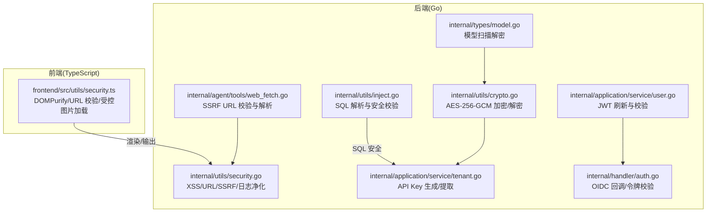
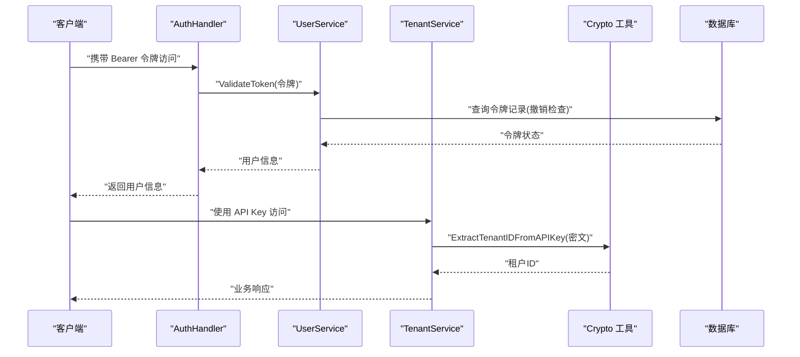
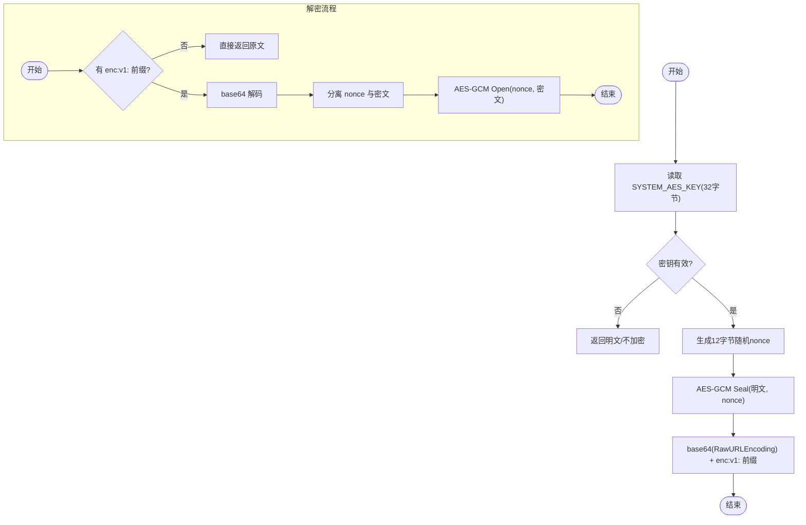
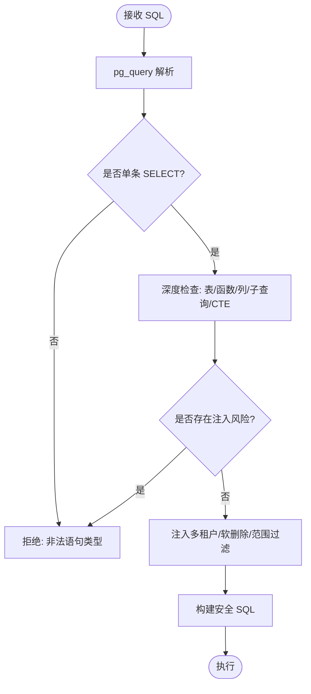
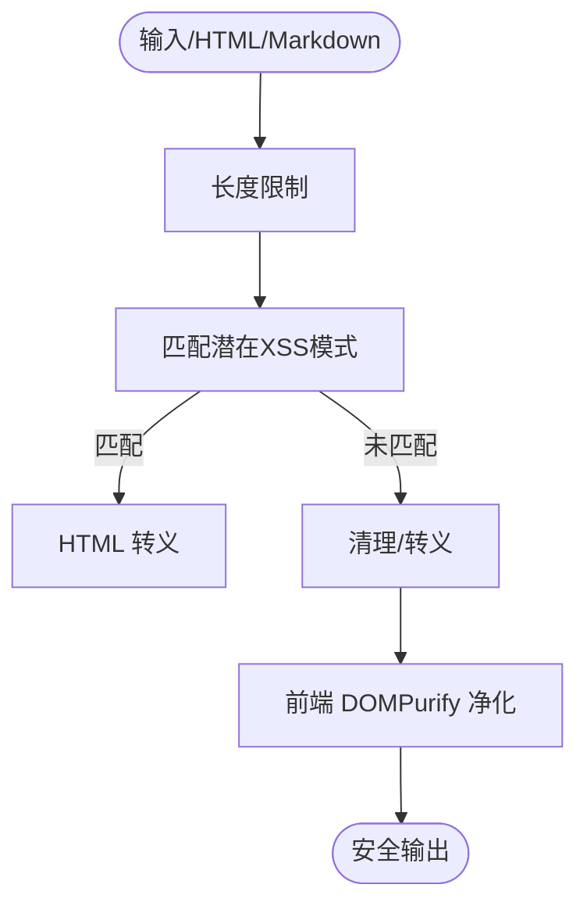
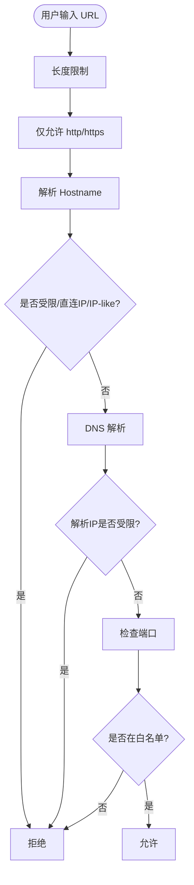
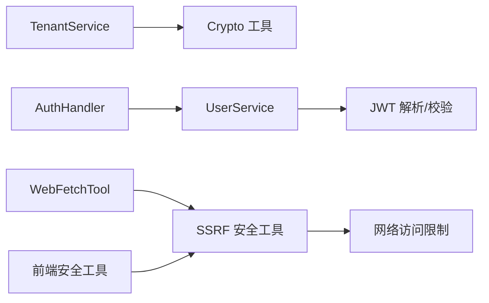

# 加密与安全

<cite>
**本文引用的文件**
- [internal/utils/crypto.go](file://internal/utils/crypto.go)
- [internal/application/service/tenant.go](file://internal/application/service/tenant.go)
- [internal/types/model.go](file://internal/types/model.go)
- [internal/utils/security.go](file://internal/utils/security.go)
- [internal/utils/inject.go](file://internal/utils/inject.go)
- [frontend/src/utils/security.ts](file://frontend/src/utils/security.ts)
- [internal/handler/auth.go](file://internal/handler/auth.go)
- [internal/application/service/user.go](file://internal/application/service/user.go)
- [internal/agent/tools/web_fetch.go](file://internal/agent/tools/web_fetch.go)
- [internal/utils/inject_test.go](file://internal/utils/inject_test.go)
- [internal/utils/security_test.go](file://internal/utils/security_test.go)
</cite>

## 目录
1. [简介](#简介)
2. [项目结构](#项目结构)
3. [核心组件](#核心组件)
4. [架构总览](#架构总览)
5. [详细组件分析](#详细组件分析)
6. [依赖分析](#依赖分析)
7. [性能考虑](#性能考虑)
8. [故障排查指南](#故障排查指南)
9. [结论](#结论)
10. [附录](#附录)

## 简介
本文件系统性梳理 WeKnora 的加密与安全机制，覆盖以下关键领域：
- API 密钥的 AES-256-GCM 加密存储与解密流程
- 敏感数据保护：密码哈希、令牌加密与传输安全
- CSRF 防护机制（令牌生成、验证与跨站请求伪造防范）
- SQL 注入防护策略（参数绑定、输入校验、查询构建安全）
- XSS（跨站脚本攻击）防护（输出编码、内容安全策略、输入清理）
- SSRF（服务器端请求伪造）防护（URL 校验、主机白名单、网络访问限制）
- 安全配置最佳实践与部署建议

本文件面向开发者与运维人员，既提供代码级实现细节，也给出可视化流程图与实操建议。

## 项目结构
WeKnora 的安全能力主要分布在如下模块：
- 后端 Go 语言实现的安全工具与服务层：加密工具、输入/URL/SQL 安全校验、令牌解析与校验、SSRF 安全 HTTP 客户端等
- 前端 TypeScript 工具：DOMPurify 输出净化、URL 校验、受控图片加载与鉴权头注入
- 处理器与服务：OIDC 回调、令牌校验、租户 API Key 生成与提取

图表来源
- [internal/utils/crypto.go:1-90](file://internal/utils/crypto.go#L1-L90)
- [internal/application/service/tenant.go:250-313](file://internal/application/service/tenant.go#L250-L313)
- [internal/utils/security.go:1-800](file://internal/utils/security.go#L1-L800)
- [internal/utils/inject.go:1-800](file://internal/utils/inject.go#L1-L800)
- [internal/application/service/user.go:472-518](file://internal/application/service/user.go#L472-L518)
- [internal/handler/auth.go:222-632](file://internal/handler/auth.go#L222-L632)
- [internal/agent/tools/web_fetch.go:254-293](file://internal/agent/tools/web_fetch.go#L254-L293)
- [internal/types/model.go:130-167](file://internal/types/model.go#L130-L167)
- [frontend/src/utils/security.ts:1-365](file://frontend/src/utils/security.ts#L1-L365)

章节来源
- [internal/utils/crypto.go:1-90](file://internal/utils/crypto.go#L1-L90)
- [internal/application/service/tenant.go:250-313](file://internal/application/service/tenant.go#L250-L313)
- [internal/utils/security.go:1-800](file://internal/utils/security.go#L1-L800)
- [internal/utils/inject.go:1-800](file://internal/utils/inject.go#L1-L800)
- [frontend/src/utils/security.ts:1-365](file://frontend/src/utils/security.ts#L1-L365)

## 核心组件
- AES-256-GCM 加密工具：提供密钥读取、加密与解密，统一前缀标记加密字符串
- 租户 API Key 服务：基于 AES-GCM 生成 sk- 前缀的加密 API Key，并支持从密文提取租户 ID
- 输入/URL/SQL 安全工具：XSS 清理、URL 校验、SSRF 防护、SQL 注入检测与安全构建
- 令牌与 OIDC：JWT 刷新与校验、OIDC 回调处理、令牌撤销检查
- 前端安全工具：DOMPurify 净化、URL 校验、受控图片加载与鉴权头注入

章节来源
- [internal/utils/crypto.go:17-90](file://internal/utils/crypto.go#L17-L90)
- [internal/application/service/tenant.go:250-313](file://internal/application/service/tenant.go#L250-L313)
- [internal/utils/security.go:44-186](file://internal/utils/security.go#L44-L186)
- [internal/utils/inject.go:660-800](file://internal/utils/inject.go#L660-L800)
- [internal/application/service/user.go:472-518](file://internal/application/service/user.go#L472-L518)
- [frontend/src/utils/security.ts:103-191](file://frontend/src/utils/security.ts#L103-L191)

## 架构总览
下图展示从请求到响应的关键安全交互路径，涵盖令牌校验、API Key 提取、SQL 安全校验与 SSRF 防护。

图表来源
- [internal/handler/auth.go:593-632](file://internal/handler/auth.go#L593-L632)
- [internal/application/service/user.go:472-518](file://internal/application/service/user.go#L472-L518)
- [internal/application/service/tenant.go:273-313](file://internal/application/service/tenant.go#L273-L313)
- [internal/utils/crypto.go:56-90](file://internal/utils/crypto.go#L56-L90)

## 详细组件分析

### AES-256-GCM 加密存储与 API Key 生成/提取
- 密钥来源：从环境变量 SYSTEM_AES_KEY 读取 32 字节密钥
- 加密流程：随机生成 12 字节 nonce，使用 AES-GCM 加密封装，再以 base64(RawURLEncoding) 编码，前缀 enc:v1:
- 解密流程：若存在 enc:v1: 前缀则解码并用相同密钥解密，否则视为明文或直接返回
- API Key 生成：对租户 ID 进行小端序编码，使用 AES-GCM 加密，最终格式为 sk-{base64 编码密文}
- API Key 提取：解析 sk- 前缀，解码 base64，分离 nonce 与密文，AES-GCM 解密得到原始租户 ID

图表来源
- [internal/utils/crypto.go:17-90](file://internal/utils/crypto.go#L17-L90)
- [internal/application/service/tenant.go:250-313](file://internal/application/service/tenant.go#L250-L313)

章节来源
- [internal/utils/crypto.go:17-90](file://internal/utils/crypto.go#L17-L90)
- [internal/application/service/tenant.go:250-313](file://internal/application/service/tenant.go#L250-L313)

### 敏感数据保护：密码哈希、令牌加密与传输安全
- 密码哈希：仓库未发现显式的密码哈希实现，建议采用 argon2 或 bcrypt 存储密码哈希
- 令牌加密：JWT 刷新令牌解析时使用 HMAC 校验签名，结合撤销列表实现令牌回收
- 传输安全：OIDC 回调与令牌校验均通过 HTTPS，前端受控图片加载通过 /files 代理并注入鉴权头

章节来源
- [internal/application/service/user.go:472-518](file://internal/application/service/user.go#L472-L518)
- [internal/handler/auth.go:222-256](file://internal/handler/auth.go#L222-L256)
- [frontend/src/utils/security.ts:270-295](file://frontend/src/utils/security.ts#L270-L295)

### CSRF 防护机制
- 令牌生成与验证：后端未直接实现传统意义上的 CSRF Token（如表单隐藏字段）。当前安全控制主要依赖：
  - 令牌校验：Authorization Bearer 令牌必须存在且格式正确
  - 跨域与来源控制：OIDC 回调严格校验 state 与 code
- 建议增强：在表单提交与 AJAX 请求中引入一次性 CSRF Token，并在服务端严格校验来源与令牌一致性

章节来源
- [internal/handler/auth.go:593-632](file://internal/handler/auth.go#L593-L632)
- [internal/handler/auth.go:222-256](file://internal/handler/auth.go#L222-L256)

### SQL 注入防护策略
- 解析与建模：使用 pg_query 对 SQL 进行语法树解析，提取表名、字段、WHERE 条件等
- 安全选项：
  - 仅允许 SELECT 语句、单条语句
  - 表白名单与函数白名单
  - 禁止子查询、CTE、系统列访问、危险函数前缀与特定函数
  - 多租户隔离自动注入 tenant_id 条件
  - 软删除过滤 deleted_at IS NULL
  - 搜索范围过滤（按知识库/知识文档）
- 注入风险检测：识别 1=1、true、空字符串比较等恒真条件，以及 OR + 恒真等常见模式

图表来源
- [internal/utils/inject.go:660-800](file://internal/utils/inject.go#L660-L800)
- [internal/utils/inject.go:1057-1125](file://internal/utils/inject.go#L1057-L1125)
- [internal/utils/inject.go:1808-1907](file://internal/utils/inject.go#L1808-L1907)

章节来源
- [internal/utils/inject.go:1-800](file://internal/utils/inject.go#L1-L800)
- [internal/utils/inject_test.go:239-437](file://internal/utils/inject_test.go#L239-L437)

### XSS（跨站脚本攻击）防护
- 后端：
  - HTML 转义与输入校验：对潜在 XSS 模式进行匹配并转义
  - Markdown 清理：移除脚本/iframe/object/embed 等标签
  - 日志注入防护：移除换行符与控制字符
- 前端：
  - DOMPurify 配置：允许安全标签/属性，禁用脚本与事件处理器
  - URL 校验：仅允许 http/https 与受控 provider 协议
  - 受控图片加载：通过 /files 代理并注入鉴权头，避免在 URL 暴露令牌

图表来源
- [internal/utils/security.go:44-101](file://internal/utils/security.go#L44-L101)
- [internal/utils/security.go:501-529](file://internal/utils/security.go#L501-L529)
- [frontend/src/utils/security.ts:103-191](file://frontend/src/utils/security.ts#L103-L191)

章节来源
- [internal/utils/security.go:44-186](file://internal/utils/security.go#L44-L186)
- [frontend/src/utils/security.ts:1-365](file://frontend/src/utils/security.ts#L1-L365)

### SSRF（服务器端请求伪造）防护
- URL 校验：仅允许 http/https；禁止 localhost、内网/回环/链路本地地址、云元数据域名、保留后缀
- 主机白名单：支持精确主机/IP/CIDR/通配符域名；白名单主机跳过严格 URL 校验
- DNS 与 IP 限制：严格禁止直接 IP；解析主机并检查解析 IP 是否受限
- 端口限制：阻断常见内网服务端口
- 安全 HTTP 客户端：自定义 DialContext 与重定向检查，阻止内部服务重定向

图表来源
- [internal/utils/security.go:373-480](file://internal/utils/security.go#L373-L480)
- [internal/utils/security.go:755-792](file://internal/utils/security.go#L755-L792)
- [internal/agent/tools/web_fetch.go:254-293](file://internal/agent/tools/web_fetch.go#L254-L293)

章节来源
- [internal/utils/security.go:373-970](file://internal/utils/security.go#L373-L970)
- [internal/utils/security_test.go:137-228](file://internal/utils/security_test.go#L137-L228)
- [internal/agent/tools/web_fetch.go:254-293](file://internal/agent/tools/web_fetch.go#L254-L293)

### 模型扫描解密与敏感字段保护
- GORM 扫描钩子：在加载模型时，若存在系统 AES 密钥，则对 APIKey/AppSecret 等敏感字段尝试解密
- 降级处理：解密失败或密钥缺失时保持原值不变

章节来源
- [internal/types/model.go:130-167](file://internal/types/model.go#L130-L167)
- [internal/utils/crypto.go:56-90](file://internal/utils/crypto.go#L56-L90)

## 依赖分析
- 组件耦合：
  - TenantService 依赖 Crypto 工具进行 API Key 生成与提取
  - AuthHandler 依赖 UserService 进行令牌校验
  - WebFetchTool 依赖 SSRF 安全工具进行 URL 校验与解析
  - 前端安全工具与后端安全工具在输出净化与 URL 校验上互补
- 外部依赖：
  - pg_query 用于 SQL 语法树解析
  - DOMPurify 用于前端输出净化

图表来源
- [internal/application/service/tenant.go:250-313](file://internal/application/service/tenant.go#L250-L313)
- [internal/handler/auth.go:593-632](file://internal/handler/auth.go#L593-L632)
- [internal/application/service/user.go:472-518](file://internal/application/service/user.go#L472-L518)
- [internal/agent/tools/web_fetch.go:254-293](file://internal/agent/tools/web_fetch.go#L254-L293)
- [frontend/src/utils/security.ts:103-191](file://frontend/src/utils/security.ts#L103-L191)

## 性能考虑
- AES-GCM 加密/解密：每次操作涉及随机数生成与对称加密，建议在批量处理时复用密钥与上下文
- SQL 安全校验：pg_query 解析成本较高，建议缓存解析结果或在高频路径使用更严格的白名单策略
- SSRF 客户端：自定义 DialContext 与 DNS 解析会增加网络延迟，建议合理设置超时与连接池
- 前端 DOMPurify：对大段 HTML 净化可能耗时，建议分块处理或在服务端完成主要净化

## 故障排查指南
- API Key 无法解密
  - 检查 SYSTEM_AES_KEY 是否设置且为 32 字节
  - 确认密文格式是否包含 enc:v1: 前缀
  - 参考测试用例定位边界情况
- SQL 注入检测误报
  - 使用 WithSecurityDefaults 并结合 WithAllowedTables/WithAllowedFunctions
  - 逐步放宽规则并观察报错类型
- SSRF URL 被拒
  - 检查是否为直连 IP 或受限主机名
  - 将目标加入 SSRF_WHITELIST（精确主机/IP/CIDR/通配符）
- 前端图片无法显示
  - 确认 /files 代理与鉴权头注入逻辑
  - 检查受控图片 src 与 data-protected-src 的映射

章节来源
- [internal/utils/crypto_test.go:44-95](file://internal/utils/crypto_test.go#L44-L95)
- [internal/utils/inject_test.go:239-437](file://internal/utils/inject_test.go#L239-L437)
- [internal/utils/security_test.go:137-228](file://internal/utils/security_test.go#L137-L228)
- [frontend/src/utils/security.ts:301-365](file://frontend/src/utils/security.ts#L301-L365)

## 结论
WeKnora 在后端实现了完善的加密存储（AES-256-GCM）、输入/URL/SQL 安全校验与 SSRF 防护，并在前端提供了 DOMPurify 净化与受控资源加载。建议在现有基础上补充 CSRF Token 机制、密码哈希策略与更细粒度的日志脱敏，以进一步提升整体安全性与合规性。

## 附录
- 最佳实践清单
  - 强制 HTTPS 传输，启用 HSTS
  - 令牌撤销列表与短期刷新令牌策略
  - 严格的 API Key 生命周期管理与轮换
  - 定期审计 SQL 白名单与函数白名单
  - SSRF 白名单最小化与定期审查
  - 前端输出一律经 DOMPurify 净化
  - 日志中避免输出敏感信息，使用 SanitizeForLog