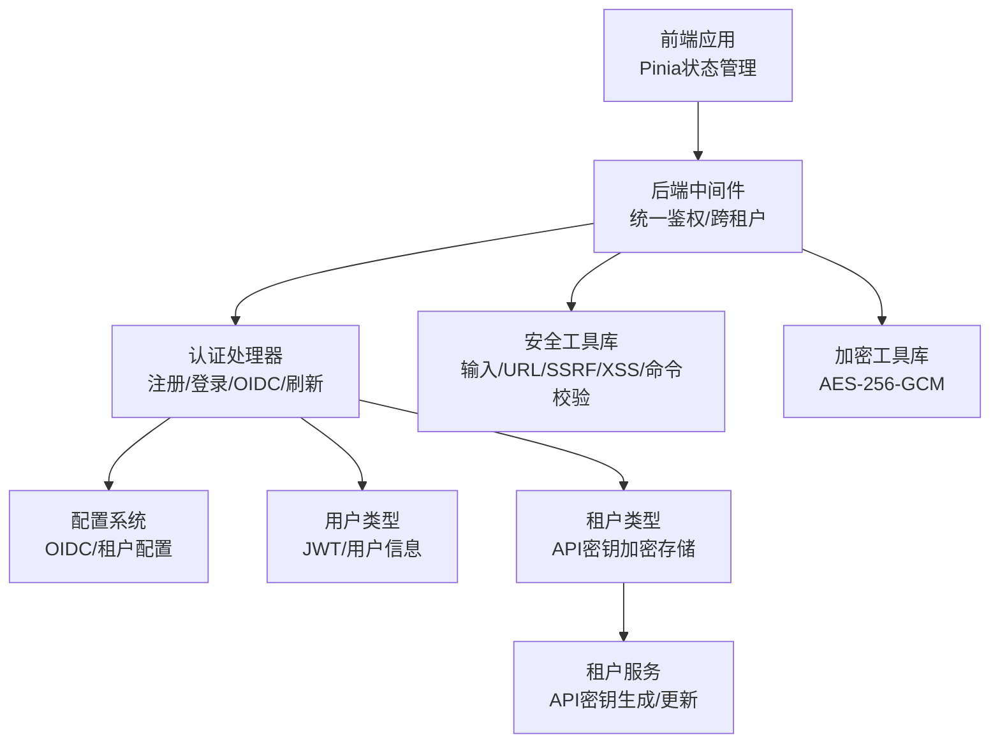
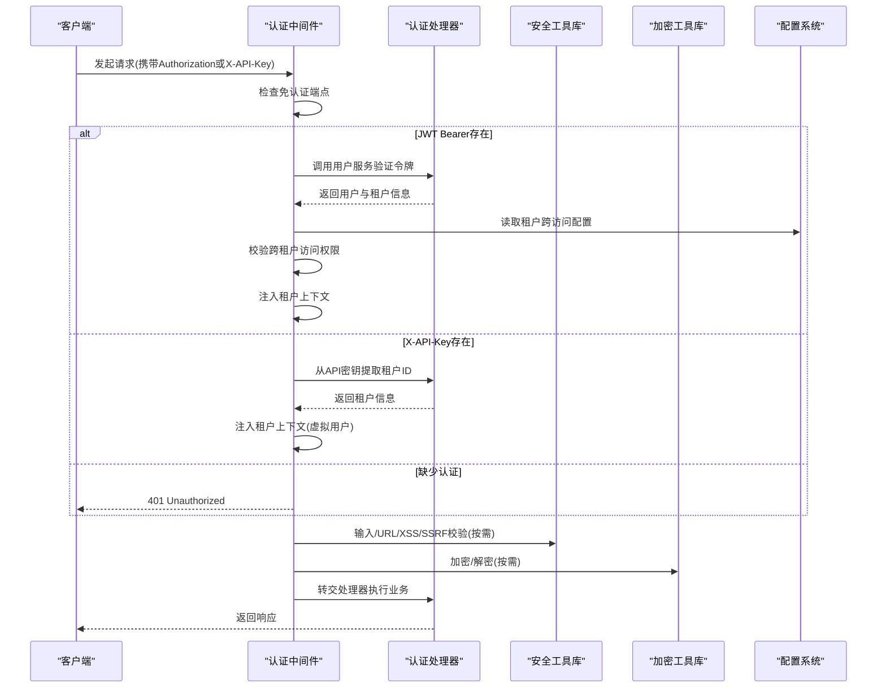
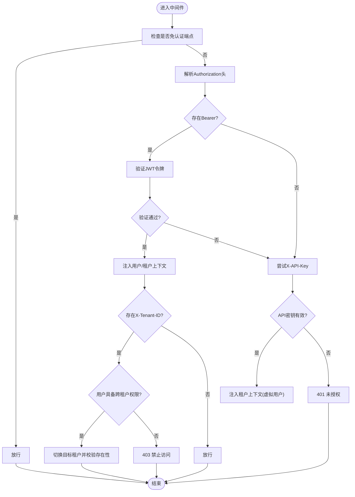
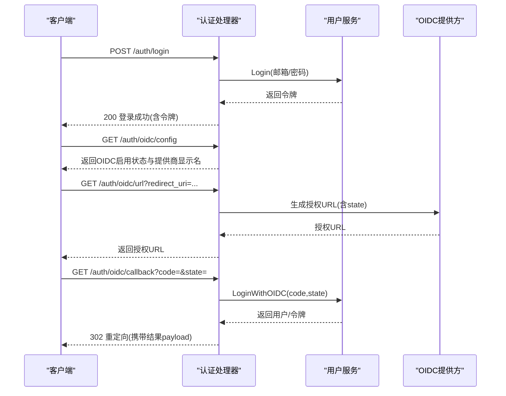
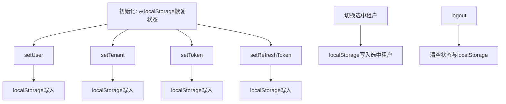
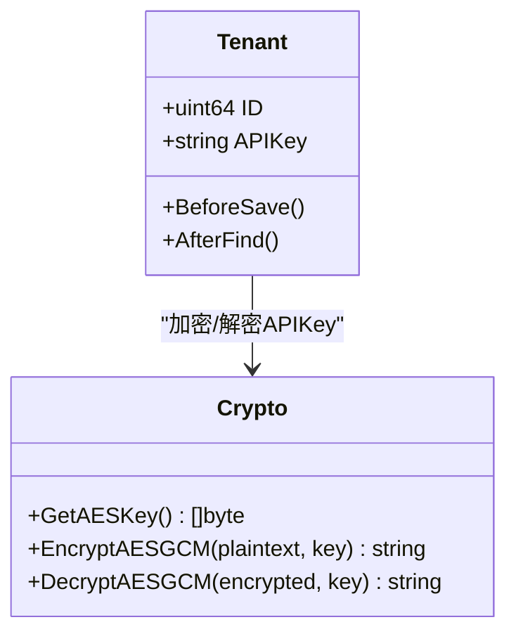
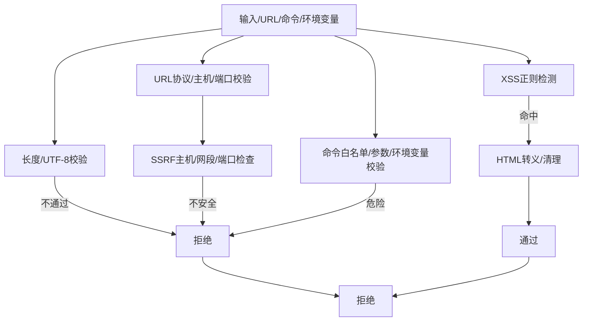
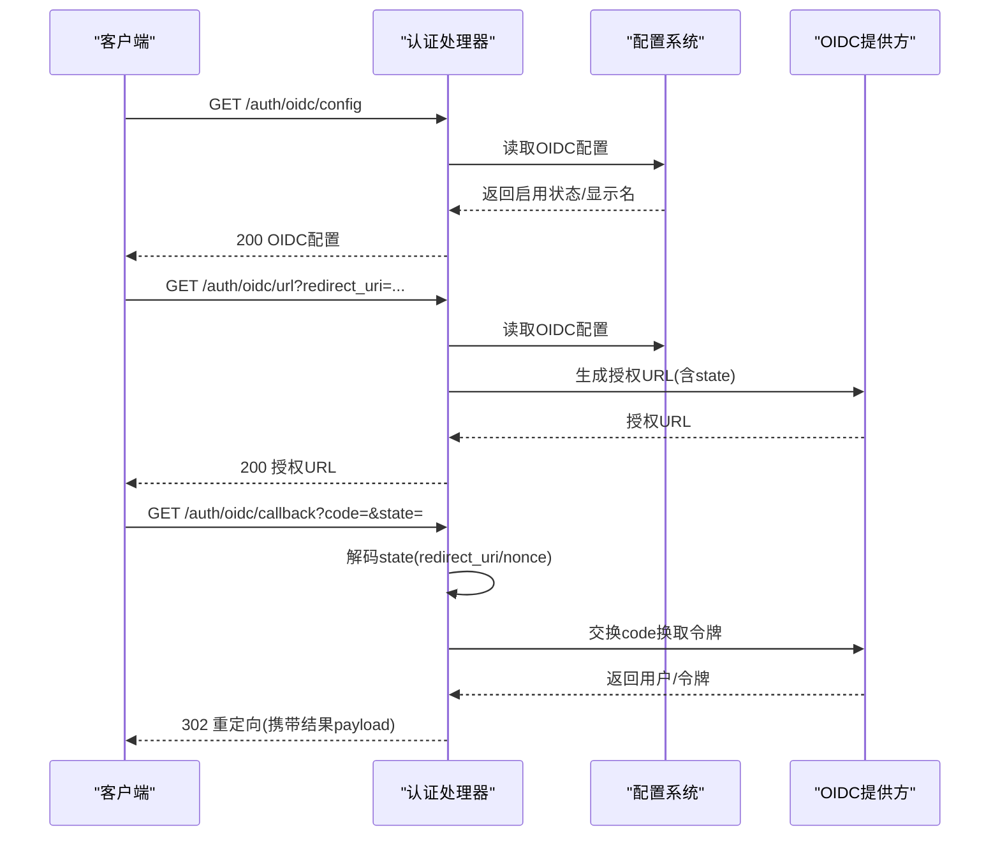
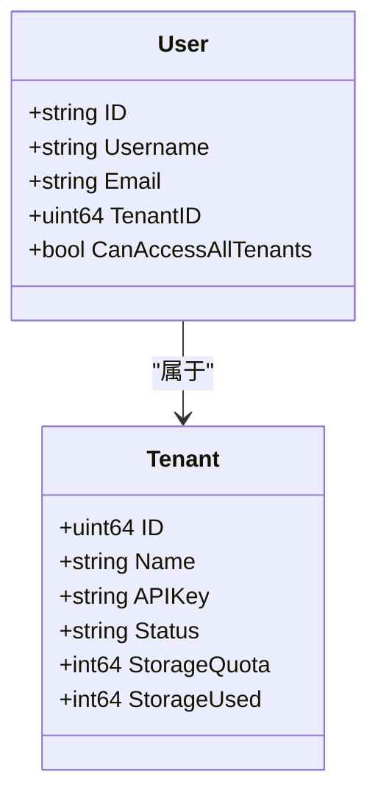
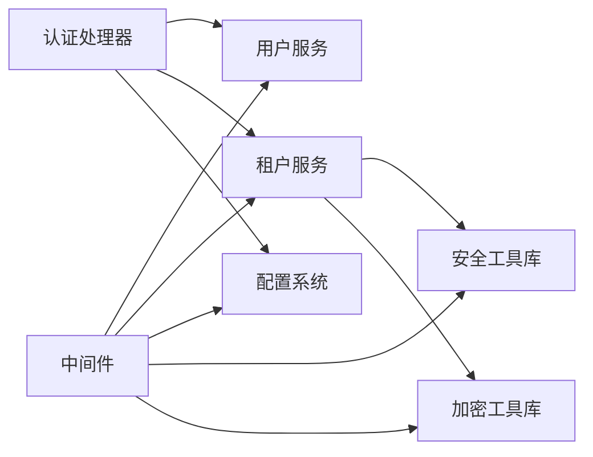

# 安全与认证

<cite>
**本文档引用的文件**
- [internal/middleware/auth.go](file://internal/middleware/auth.go)
- [internal/handler/auth.go](file://internal/handler/auth.go)
- [frontend/src/stores/auth.ts](file://frontend/src/stores/auth.ts)
- [internal/utils/security.go](file://internal/utils/security.go)
- [internal/utils/crypto.go](file://internal/utils/crypto.go)
- [internal/config/config.go](file://internal/config/config.go)
- [config/config.yaml](file://config/config.yaml)
- [internal/types/user.go](file://internal/types/user.go)
- [internal/types/tenant.go](file://internal/types/tenant.go)
- [internal/application/service/tenant.go](file://internal/application/service/tenant.go)
- [SECURITY.md](file://SECURITY.md)
</cite>

## 目录
1. [简介](#简介)
2. [项目结构](#项目结构)
3. [核心组件](#核心组件)
4. [架构总览](#架构总览)
5. [详细组件分析](#详细组件分析)
6. [依赖分析](#依赖分析)
7. [性能考虑](#性能考虑)
8. [故障排查指南](#故障排查指南)
9. [结论](#结论)
10. [附录](#附录)

## 简介
本文件面向WeKnora的安全与认证能力，系统性阐述以下主题：
- 认证机制：JWT令牌管理、API密钥认证、OIDC集成
- 授权控制：租户隔离、权限管理、跨租户访问策略
- 加密机制：API密钥的AES-256-GCM加密存储与传输安全
- 安全防护：SSRF防护、SQL注入防范、跨站脚本攻击(XSS)防护
- 安全配置最佳实践与部署建议
- 多租户安全隔离机制
- 安全审计与监控工具使用
- 安全漏洞修复流程与应急响应机制

## 项目结构
WeKnora采用前后端分离架构，安全与认证相关的关键位置如下：
- 后端中间件层：统一鉴权与跨租户访问控制
- 后端处理器层：提供注册、登录、OIDC、令牌刷新等认证接口
- 前端状态管理：持久化用户会话与租户上下文
- 安全工具库：输入校验、URL与SSRF校验、XSS清理、命令与环境变量白名单
- 加密工具库：AES-256-GCM对称加密，支持API密钥与敏感配置的存储
- 配置系统：OIDC开关、租户配置、提示词模板等
- 类型与服务：用户、租户模型，租户服务负责API密钥生成与加密

图表来源
- [internal/middleware/auth.go:66-228](file://internal/middleware/auth.go#L66-L228)
- [internal/handler/auth.go:25-44](file://internal/handler/auth.go#L25-L44)
- [frontend/src/stores/auth.ts:7-252](file://frontend/src/stores/auth.ts#L7-L252)
- [internal/utils/security.go:44-101](file://internal/utils/security.go#L44-L101)
- [internal/utils/crypto.go:14-89](file://internal/utils/crypto.go#L14-L89)
- [internal/config/config.go:18-33](file://internal/config/config.go#L18-L33)
- [internal/types/user.go:9-36](file://internal/types/user.go#L9-L36)
- [internal/types/tenant.go:72-161](file://internal/types/tenant.go#L72-L161)
- [internal/application/service/tenant.go:45-97](file://internal/application/service/tenant.go#L45-L97)

章节来源
- [internal/middleware/auth.go:20-228](file://internal/middleware/auth.go#L20-L228)
- [internal/handler/auth.go:25-44](file://internal/handler/auth.go#L25-L44)
- [frontend/src/stores/auth.ts:7-252](file://frontend/src/stores/auth.ts#L7-L252)
- [internal/utils/security.go:44-101](file://internal/utils/security.go#L44-L101)
- [internal/utils/crypto.go:14-89](file://internal/utils/crypto.go#L14-L89)
- [internal/config/config.go:18-33](file://internal/config/config.go#L18-L33)
- [internal/types/user.go:9-36](file://internal/types/user.go#L9-L36)
- [internal/types/tenant.go:72-161](file://internal/types/tenant.go#L72-L161)
- [internal/application/service/tenant.go:45-97](file://internal/application/service/tenant.go#L45-L97)

## 核心组件
- 统一认证中间件：拦截请求，识别免认证端点，优先尝试JWT Bearer认证，其次尝试X-API-Key认证，并处理跨租户访问与租户上下文注入。
- 认证处理器：提供注册、登录、OIDC授权URL生成、回调、登出、令牌刷新、当前用户信息、密码修改、自动初始化等接口。
- 前端认证状态：持久化用户、租户、令牌、当前选中租户等信息，支持跨租户切换与本地存储恢复。
- 安全工具库：HTML/XSS清理、输入校验、URL与SSRF校验、受限主机/网段/端口检查、命令与环境变量白名单校验。
- 加密工具库：AES-256-GCM对称加解密，支持API密钥与WeKnoraCloud密钥的存储加密。
- 配置系统：OIDC开关、发现端点、作用域、用户信息映射、租户跨访问配置。
- 类型与服务：用户与租户模型，租户服务负责API密钥生成与加密更新。

章节来源
- [internal/middleware/auth.go:66-228](file://internal/middleware/auth.go#L66-L228)
- [internal/handler/auth.go:25-44](file://internal/handler/auth.go#L25-L44)
- [frontend/src/stores/auth.ts:7-252](file://frontend/src/stores/auth.ts#L7-L252)
- [internal/utils/security.go:44-101](file://internal/utils/security.go#L44-L101)
- [internal/utils/crypto.go:14-89](file://internal/utils/crypto.go#L14-L89)
- [internal/config/config.go:18-33](file://internal/config/config.go#L18-L33)
- [internal/types/user.go:9-36](file://internal/types/user.go#L9-L36)
- [internal/types/tenant.go:72-161](file://internal/types/tenant.go#L72-L161)
- [internal/application/service/tenant.go:45-97](file://internal/application/service/tenant.go#L45-L97)

## 架构总览
下图展示了认证与授权的整体流程：客户端发起请求，中间件进行认证与跨租户校验，处理器执行业务逻辑，安全工具与加密工具贯穿其中，配置系统提供OIDC与租户策略。

图表来源
- [internal/middleware/auth.go:66-228](file://internal/middleware/auth.go#L66-L228)
- [internal/handler/auth.go:120-162](file://internal/handler/auth.go#L120-L162)
- [internal/utils/security.go:373-480](file://internal/utils/security.go#L373-L480)
- [internal/utils/crypto.go:27-89](file://internal/utils/crypto.go#L27-L89)
- [internal/config/config.go:180-192](file://internal/config/config.go#L180-L192)

## 详细组件分析

### 组件A：认证中间件与跨租户访问控制
- 免认证端点清单：健康检查、注册、登录、自动初始化、OIDC配置、OIDC授权URL、OIDC回调、令牌刷新。
- JWT Bearer认证：从Authorization头解析Bearer令牌，调用用户服务验证，成功后注入用户与租户上下文，支持通过X-Tenant-ID进行跨租户切换。
- API密钥认证：从X-API-Key解析租户ID，校验数据库中API密钥一致性，注入租户上下文（若无用户则构造系统虚拟用户）。
- 跨租户访问：受配置与用户权限双重控制，仅当开启跨租户访问且用户具备全局访问权限时允许切换。

图表来源
- [internal/middleware/auth.go:66-228](file://internal/middleware/auth.go#L66-L228)

章节来源
- [internal/middleware/auth.go:20-228](file://internal/middleware/auth.go#L20-L228)

### 组件B：认证处理器（注册/登录/OIDC/刷新）
- 注册：支持环境变量禁用注册；参数绑定与校验；调用用户服务注册并返回用户信息。
- 登录：参数校验；调用用户服务登录；返回令牌与租户信息。
- OIDC：生成授权URL（携带state与redirect_uri）、返回OIDC配置、处理回调（state解码、code交换、结果编码回传）。
- 刷新：接收刷新令牌，调用用户服务刷新并返回新令牌。
- 其他：登出（撤销令牌）、当前用户、修改密码、自动初始化（Lite桌面版）。

图表来源
- [internal/handler/auth.go:120-276](file://internal/handler/auth.go#L120-L276)

章节来源
- [internal/handler/auth.go:57-108](file://internal/handler/auth.go#L57-L108)
- [internal/handler/auth.go:120-162](file://internal/handler/auth.go#L120-L162)
- [internal/handler/auth.go:164-217](file://internal/handler/auth.go#L164-L217)
- [internal/handler/auth.go:219-276](file://internal/handler/auth.go#L219-L276)
- [internal/handler/auth.go:380-412](file://internal/handler/auth.go#L380-L412)
- [internal/handler/auth.go:414-454](file://internal/handler/auth.go#L414-L454)
- [internal/handler/auth.go:456-507](file://internal/handler/auth.go#L456-L507)
- [internal/handler/auth.go:509-580](file://internal/handler/auth.go#L509-L580)
- [internal/handler/auth.go:582-632](file://internal/handler/auth.go#L582-L632)

### 组件C：前端认证状态管理
- 状态：用户、租户、访问令牌、刷新令牌、知识库列表、当前知识库、选中租户ID/名称、所有租户、Lite模式标记。
- 行为：设置/清除/从localStorage恢复状态；计算登录态、有效租户、当前租户ID、当前用户ID、跨租户访问权限、有效租户ID；支持跨租户切换与持久化。

图表来源
- [frontend/src/stores/auth.ts:145-212](file://frontend/src/stores/auth.ts#L145-L212)

章节来源
- [frontend/src/stores/auth.ts:7-252](file://frontend/src/stores/auth.ts#L7-L252)

### 组件D：加密机制（API密钥AES-256-GCM）
- 密钥来源：SYSTEM_AES_KEY（32字节）。
- API密钥存储：租户创建/更新时，使用AES-256-GCM加密APIKey并持久化；读取时自动解密。
- WeKnoraCloud密钥：AppSecret同样采用AES-256-GCM加密存储。
- 传输安全：建议通过HTTPS传输，避免明文泄露。

图表来源
- [internal/types/tenant.go:141-161](file://internal/types/tenant.go#L141-L161)
- [internal/utils/crypto.go:14-89](file://internal/utils/crypto.go#L14-L89)

章节来源
- [internal/types/tenant.go:141-161](file://internal/types/tenant.go#L141-L161)
- [internal/utils/crypto.go:14-89](file://internal/utils/crypto.go#L14-L89)

### 组件E：安全防护（SSRF/XSS/输入校验/命令与环境变量白名单）
- XSS防护：内置正则匹配常见脚本标签与事件属性，提供HTML清理与转义函数。
- 输入校验：过滤控制字符、UTF-8校验、长度限制、XSS模式检测。
- URL与SSRF：严格协议白名单（http/https/local/minio/cos/tos/oss），禁止内网主机/域名后缀/保留网段/IP类伪装，DNS解析后再次校验解析IP。
- 命令与环境变量：stdio命令白名单（uvx/npx等），参数与环境变量危险模式检测，长度限制与空字节过滤。

图表来源
- [internal/utils/security.go:21-65](file://internal/utils/security.go#L21-L65)
- [internal/utils/security.go:75-101](file://internal/utils/security.go#L75-L101)
- [internal/utils/security.go:154-186](file://internal/utils/security.go#L154-L186)
- [internal/utils/security.go:373-480](file://internal/utils/security.go#L373-L480)
- [internal/utils/security.go:574-732](file://internal/utils/security.go#L574-L732)

章节来源
- [internal/utils/security.go:21-65](file://internal/utils/security.go#L21-L65)
- [internal/utils/security.go:75-101](file://internal/utils/security.go#L75-L101)
- [internal/utils/security.go:154-186](file://internal/utils/security.go#L154-L186)
- [internal/utils/security.go:373-480](file://internal/utils/security.go#L373-L480)
- [internal/utils/security.go:574-732](file://internal/utils/security.go#L574-L732)

### 组件F：OIDC集成与配置
- 配置项：启用开关、发现端点/授权/令牌/用户信息端点、客户端ID/密钥、作用域、提供商显示名、用户信息映射。
- 处理流程：生成授权URL（state包含redirect_uri与nonce）、返回OIDC配置、回调时解码state、校验错误、交换code换取令牌并返回结果payload。
- 环境变量覆盖：支持通过环境变量动态覆盖配置。

图表来源
- [internal/handler/auth.go:164-217](file://internal/handler/auth.go#L164-L217)
- [internal/handler/auth.go:219-276](file://internal/handler/auth.go#L219-L276)
- [internal/config/config.go:180-192](file://internal/config/config.go#L180-L192)
- [config/config.yaml:109-113](file://config/config.yaml#L109-L113)

章节来源
- [internal/handler/auth.go:164-217](file://internal/handler/auth.go#L164-L217)
- [internal/handler/auth.go:219-276](file://internal/handler/auth.go#L219-L276)
- [internal/config/config.go:180-192](file://internal/config/config.go#L180-L192)
- [config/config.yaml:109-113](file://config/config.yaml#L109-L113)

### 组件G：租户隔离与权限管理
- 租户模型：包含APIKey、状态、配额、检索引擎、上下文配置、Web搜索配置、解析引擎配置、凭证配置、存储引擎配置等。
- API密钥：创建/更新时自动生成，使用AES-256-GCM加密存储；读取时解密。
- 跨租户访问：受配置与用户权限共同控制；中间件支持通过X-Tenant-ID切换目标租户并校验存在性。
- 前端：支持选中租户切换，持久化选中状态。

图表来源
- [internal/types/user.go:9-36](file://internal/types/user.go#L9-L36)
- [internal/types/tenant.go:72-118](file://internal/types/tenant.go#L72-L118)
- [internal/middleware/auth.go:47-63](file://internal/middleware/auth.go#L47-L63)

章节来源
- [internal/types/user.go:9-36](file://internal/types/user.go#L9-L36)
- [internal/types/tenant.go:72-118](file://internal/types/tenant.go#L72-L118)
- [internal/middleware/auth.go:47-63](file://internal/middleware/auth.go#L47-L63)

## 依赖分析
- 中间件依赖：用户服务（JWT验证）、租户服务（API密钥解析与租户查询）、配置（跨租户访问开关）。
- 处理器依赖：用户服务（注册/登录/OIDC/刷新/登出/当前用户/密码修改）、租户服务（租户信息）、配置（OIDC配置）。
- 安全工具库：被中间件与各处理器按需调用，保障输入/URL/XSS/SSRF/命令与环境变量安全。
- 加密工具库：被租户模型钩子与服务层调用，保障API密钥与敏感配置的存储安全。
- 配置系统：被处理器与中间件读取，影响OIDC与租户策略。

图表来源
- [internal/middleware/auth.go:66-228](file://internal/middleware/auth.go#L66-L228)
- [internal/handler/auth.go:25-44](file://internal/handler/auth.go#L25-L44)
- [internal/application/service/tenant.go:45-97](file://internal/application/service/tenant.go#L45-L97)
- [internal/utils/security.go:44-101](file://internal/utils/security.go#L44-L101)
- [internal/utils/crypto.go:14-89](file://internal/utils/crypto.go#L14-L89)
- [internal/config/config.go:18-33](file://internal/config/config.go#L18-L33)

章节来源
- [internal/middleware/auth.go:66-228](file://internal/middleware/auth.go#L66-L228)
- [internal/handler/auth.go:25-44](file://internal/handler/auth.go#L25-L44)
- [internal/application/service/tenant.go:45-97](file://internal/application/service/tenant.go#L45-L97)
- [internal/utils/security.go:44-101](file://internal/utils/security.go#L44-L101)
- [internal/utils/crypto.go:14-89](file://internal/utils/crypto.go#L14-L89)
- [internal/config/config.go:18-33](file://internal/config/config.go#L18-L33)

## 性能考虑
- 中间件短路：免认证端点与OPTIONS请求快速放行，减少不必要的鉴权开销。
- 常驻配置：OIDC配置与租户配置在启动时加载并缓存，避免重复解析。
- 加密成本：API密钥加密/解密仅在创建/更新/读取租户时触发，避免频繁加解密。
- SSRF客户端：HTTP客户端在连接阶段与重定向阶段均进行URL与IP校验，降低外部风险暴露。
- 前端状态：Pinia状态持久化于localStorage/sessionStorage，减少重复请求与计算。

## 故障排查指南
- 401未授权
  - 检查Authorization头格式是否为Bearer；确认JWT有效；核对租户上下文是否正确注入。
  - 若使用X-API-Key，请确认API密钥格式与租户ID一致，且租户存在。
- 403禁止访问
  - 检查跨租户访问配置与用户权限；确认目标租户ID存在且用户具备全局访问权限。
- OIDC登录失败
  - 检查state解码是否正确；确认回调URL与授权URL中的redirect_uri一致；核对客户端ID/密钥与提供方配置。
- SSRF/URL异常
  - 检查URL协议与主机是否在白名单；确认未使用内网直连或保留网段；核对DNS解析结果。
- XSS/输入异常
  - 检查输入是否包含脚本标签或事件属性；确认使用了清理/转义函数。
- 加密异常
  - 确认SYSTEM_AES_KEY为32字节；检查API密钥/密钥是否带有enc:v1:前缀；核对加解密流程。

章节来源
- [internal/middleware/auth.go:66-228](file://internal/middleware/auth.go#L66-L228)
- [internal/handler/auth.go:164-276](file://internal/handler/auth.go#L164-L276)
- [internal/utils/security.go:373-480](file://internal/utils/security.go#L373-L480)
- [internal/utils/security.go:574-732](file://internal/utils/security.go#L574-L732)
- [internal/utils/crypto.go:14-89](file://internal/utils/crypto.go#L14-L89)

## 结论
WeKnora在安全与认证方面形成了“中间件统一鉴权+处理器业务实现+前端状态管理”的完整闭环，并通过安全工具库与加密工具库强化输入/URL/XSS/SSRF与密钥存储安全。结合OIDC与租户隔离策略，满足多租户场景下的身份认证与权限控制需求。建议在生产环境中启用HTTPS、严格管理密钥、定期轮换API密钥，并遵循最小权限原则与跨租户访问策略。

## 附录

### 安全配置最佳实践与部署建议
- OIDC
  - 在配置中启用OIDC并填写发现端点/授权/令牌/用户信息端点或相应端点；设置合适的scope与用户信息映射。
  - 通过环境变量覆盖敏感配置，避免硬编码。
- 租户与API密钥
  - SYSTEM_AES_KEY必须为32字节并妥善保管；定期轮换API密钥并通过租户服务更新。
  - 启用跨租户访问需谨慎评估，仅在内网或可信环境开启。
- SSRF防护
  - 严格限制URL协议与主机白名单；避免直接使用IP地址；对重定向目标进行二次校验。
- 传输安全
  - 强制使用HTTPS；在反向代理层配置TLS终止与安全头。
- 日志与审计
  - 使用安全工具库的日志清理函数，防止日志注入；记录关键安全事件（登录、登出、跨租户切换、OIDC回调）。
- 应急响应
  - 遵循安全政策，通过私有漏洞上报渠道提交问题；配合团队进行调查与修复。

章节来源
- [internal/config/config.go:180-192](file://internal/config/config.go#L180-L192)
- [config/config.yaml:109-113](file://config/config.yaml#L109-L113)
- [internal/utils/security.go:531-558](file://internal/utils/security.go#L531-L558)
- [SECURITY.md:1-47](file://SECURITY.md#L1-L47)