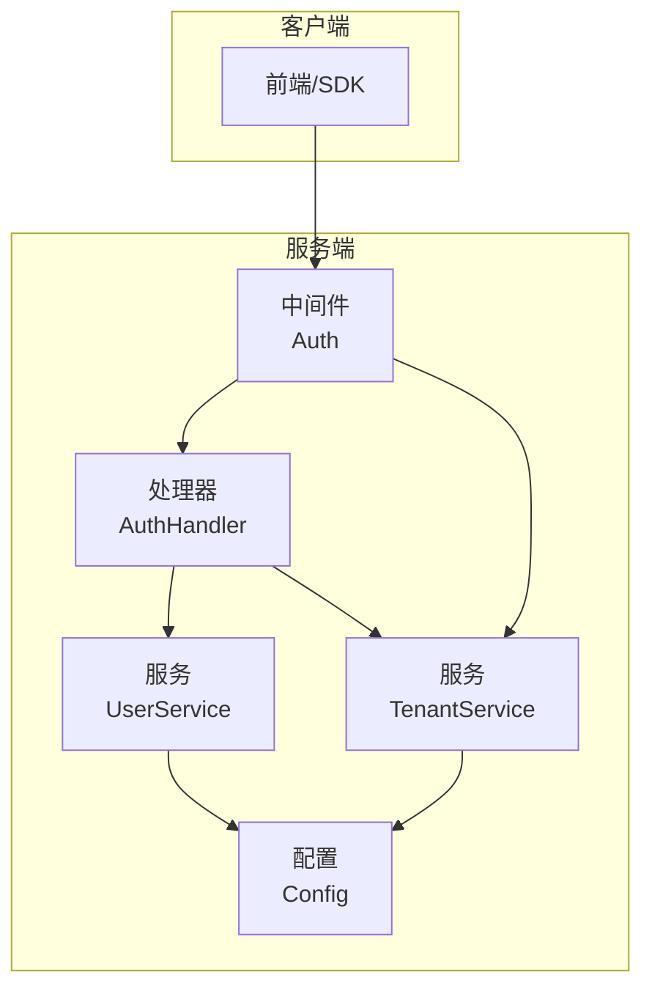
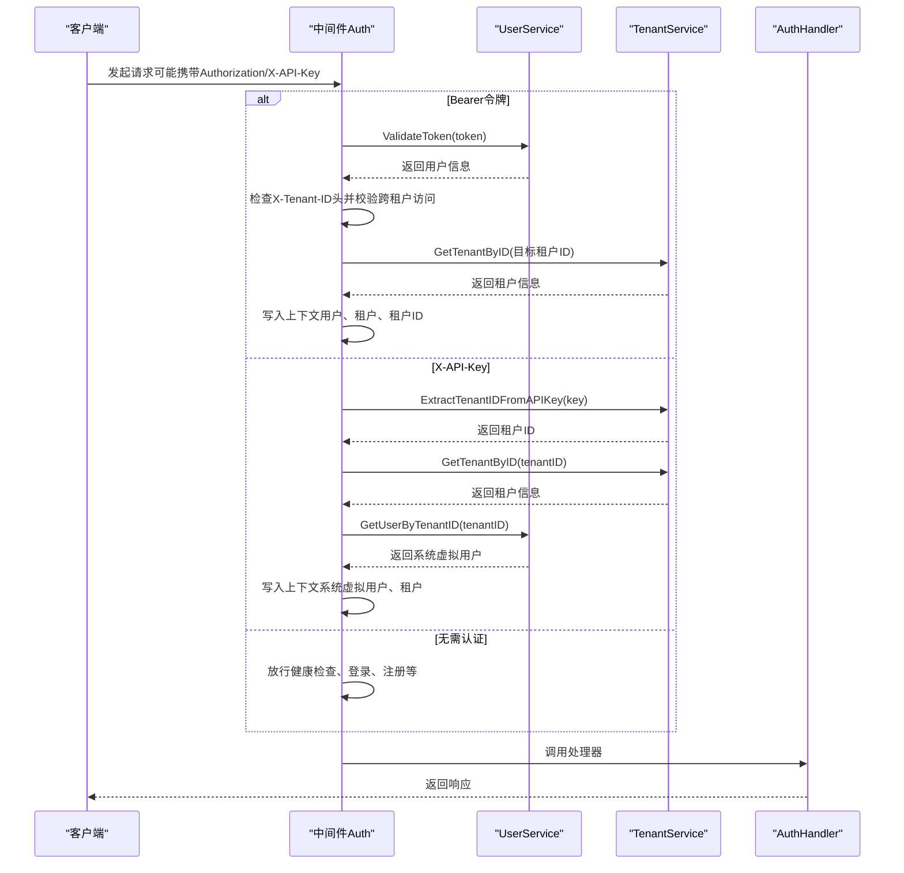
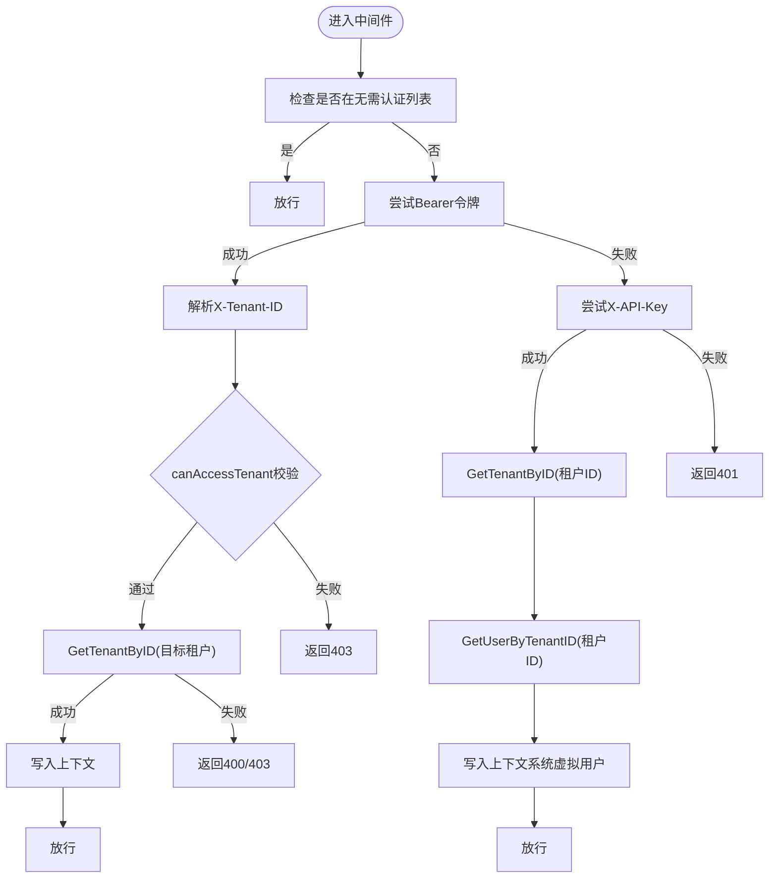
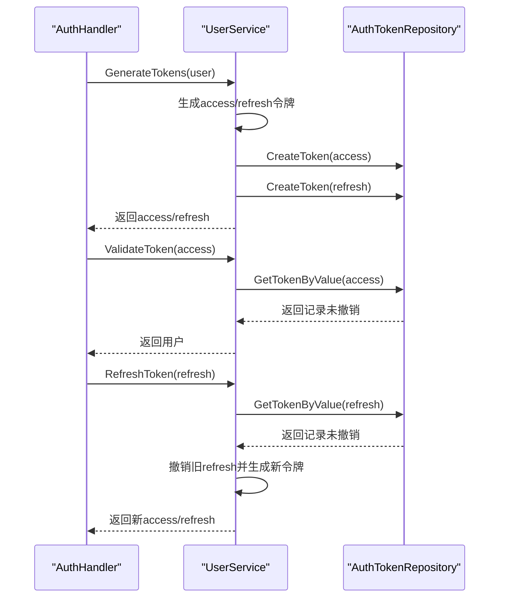
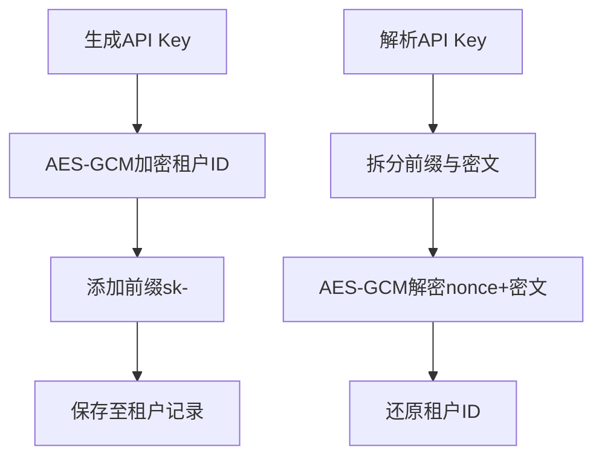
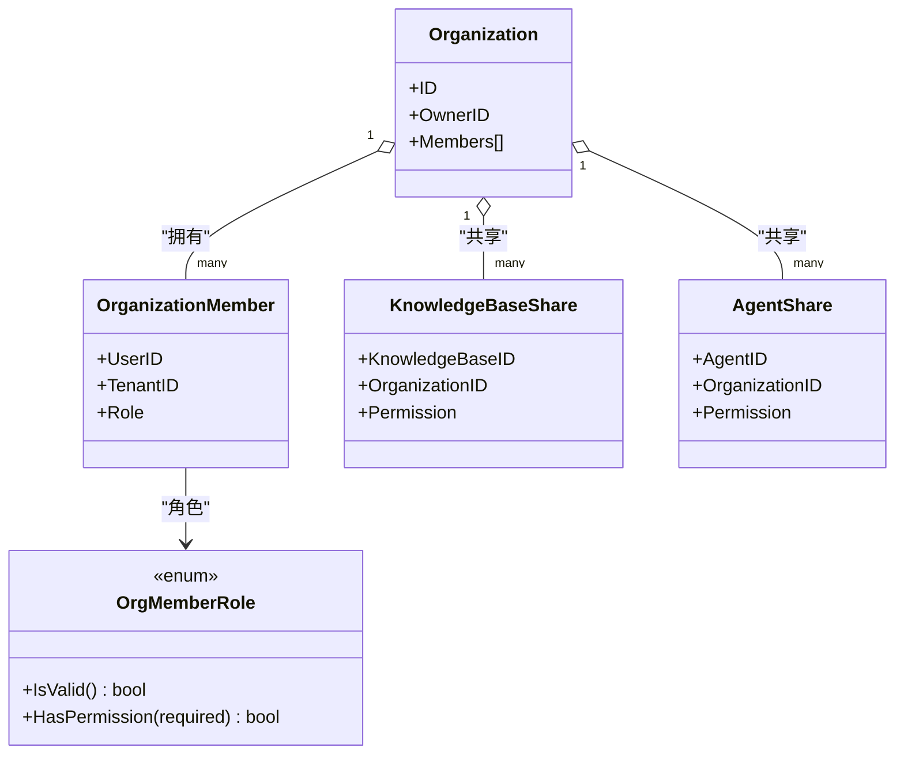
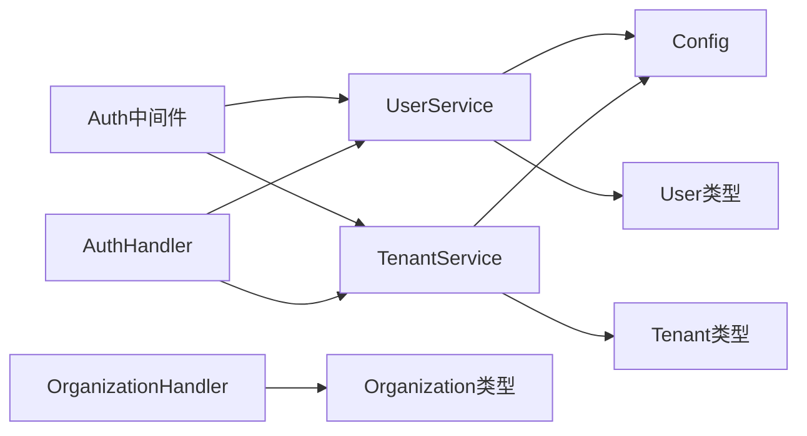

# 授权控制

<cite>
**本文档引用的文件**
- [internal/middleware/auth.go](file://internal/middleware/auth.go)
- [internal/handler/auth.go](file://internal/handler/auth.go)
- [internal/application/service/user.go](file://internal/application/service/user.go)
- [internal/application/service/tenant.go](file://internal/application/service/tenant.go)
- [internal/types/user.go](file://internal/types/user.go)
- [internal/types/tenant.go](file://internal/types/tenant.go)
- [internal/types/organization.go](file://internal/types/organization.go)
- [internal/handler/organization.go](file://internal/handler/organization.go)
- [internal/config/config.go](file://internal/config/config.go)
- [docs/swagger.json](file://docs/swagger.json)
- [docs/docs.go](file://docs/docs.go)
- [client/tenant.go](file://client/tenant.go)
</cite>

## 目录
1. [引言](#引言)
2. [项目结构](#项目结构)
3. [核心组件](#核心组件)
4. [架构总览](#架构总览)
5. [详细组件分析](#详细组件分析)
6. [依赖分析](#依赖分析)
7. [性能考虑](#性能考虑)
8. [故障排查指南](#故障排查指南)
9. [结论](#结论)
10. [附录](#附录)

## 引言
本文件面向WeKnora授权控制系统，聚焦于多租户架构下的权限管理机制，涵盖以下主题：
- 租户隔离与跨租户访问控制
- 用户权限分配与组织级权限控制（角色定义、权限继承、访问策略）
- 请求拦截、权限验证与访问决策流程
- API端点的RBAC与ABAC实现思路
- 权限配置最佳实践与安全建议
- 具体配置示例与访问控制代码实现路径

WeKnora采用JWT令牌进行认证与会话管理，支持租户维度的资源隔离与跨租户访问开关；同时提供组织（跨租户协作空间）内的角色体系，实现组织级的资源分享与权限控制。

## 项目结构
围绕授权控制的关键模块如下：
- 中间件层：统一请求拦截与认证校验，注入租户与用户上下文
- 处理器层：对外暴露认证与用户信息等API
- 服务层：实现JWT签发/校验、租户API Key生成与解析、用户与租户业务逻辑
- 类型与配置：用户、租户、组织的数据模型与系统配置（含跨租户访问开关）

图表来源
- [internal/middleware/auth.go:65-227](file://internal/middleware/auth.go#L65-L227)
- [internal/handler/auth.go:22-44](file://internal/handler/auth.go#L22-L44)
- [internal/application/service/user.go:58-79](file://internal/application/service/user.go#L58-L79)
- [internal/application/service/tenant.go:35-43](file://internal/application/service/tenant.go#L35-L43)
- [internal/config/config.go:166-173](file://internal/config/config.go#L166-L173)

章节来源
- [internal/middleware/auth.go:1-238](file://internal/middleware/auth.go#L1-L238)
- [internal/handler/auth.go:1-633](file://internal/handler/auth.go#L1-L633)
- [internal/application/service/user.go:1-852](file://internal/application/service/user.go#L1-L852)
- [internal/application/service/tenant.go:1-461](file://internal/application/service/tenant.go#L1-L461)
- [internal/config/config.go:166-173](file://internal/config/config.go#L166-L173)

## 核心组件
- 认证中间件Auth
  - 支持JWT与X-API-Key两种认证方式
  - 负责跨租户访问校验与租户切换
  - 将用户、租户信息写入请求上下文
- 认证处理器AuthHandler
  - 提供注册、登录、登出、刷新、验证令牌、获取当前用户等接口
  - 所有受保护接口均需Bearer令牌
- 用户服务UserService
  - 实现JWT签发、校验、刷新、撤销
  - OIDC授权URL生成与回调处理
- 租户服务TenantService
  - 租户生命周期管理、API Key生成与解析
  - 跨租户访问能力的启用与校验
- 配置Config
  - 跨租户访问开关（EnableCrossTenantAccess）
  - OIDC配置等

章节来源
- [internal/middleware/auth.go:65-227](file://internal/middleware/auth.go#L65-L227)
- [internal/handler/auth.go:22-44](file://internal/handler/auth.go#L22-L44)
- [internal/application/service/user.go:58-79](file://internal/application/service/user.go#L58-L79)
- [internal/application/service/tenant.go:35-43](file://internal/application/service/tenant.go#L35-L43)
- [internal/config/config.go:166-173](file://internal/config/config.go#L166-L173)

## 架构总览
下图展示了从请求进入至资源访问的整体流程，重点体现认证、跨租户切换与上下文注入：

图表来源
- [internal/middleware/auth.go:65-227](file://internal/middleware/auth.go#L65-L227)
- [internal/handler/auth.go:414-454](file://internal/handler/auth.go#L414-L454)
- [internal/application/service/user.go:446-476](file://internal/application/service/user.go#L446-L476)
- [internal/application/service/tenant.go:273-313](file://internal/application/service/tenant.go#L273-L313)

## 详细组件分析

### 认证中间件：Auth
- 功能要点
  - 识别无需认证的API白名单
  - 优先尝试JWT Bearer令牌校验
  - 支持X-API-Key兼容模式（租户维度）
  - 跨租户访问校验：当请求携带X-Tenant-ID时，校验用户是否具备跨租户访问权限与目标租户存在性
  - 将用户、租户、租户ID写入上下文，供下游处理器使用
- 关键流程
  - JWT校验通过后，解析X-Tenant-ID并调用canAccessTenant与GetTenantByID进行二次校验
  - API Key模式下，解析租户ID并构造系统虚拟用户，确保上下文一致性

图表来源
- [internal/middleware/auth.go:65-227](file://internal/middleware/auth.go#L65-L227)
- [internal/middleware/auth.go:47-63](file://internal/middleware/auth.go#L47-L63)

章节来源
- [internal/middleware/auth.go:20-45](file://internal/middleware/auth.go#L20-L45)
- [internal/middleware/auth.go:47-63](file://internal/middleware/auth.go#L47-L63)
- [internal/middleware/auth.go:65-227](file://internal/middleware/auth.go#L65-L227)

### 用户服务：JWT与令牌管理
- 令牌签发
  - 生成访问令牌与刷新令牌，包含用户ID、邮箱、租户ID等声明
  - 访问令牌有效期24小时，刷新令牌7天
  - 令牌持久化至数据库，便于撤销与审计
- 令牌校验
  - 校验签名与过期时间
  - 查询数据库确认未被撤销
- 令牌刷新与撤销
  - 刷新时校验刷新令牌有效性并撤销旧刷新令牌
  - 撤销时标记令牌为已撤销并更新时间戳

图表来源
- [internal/handler/auth.go:370-412](file://internal/handler/auth.go#L370-L412)
- [internal/handler/auth.go:582-632](file://internal/handler/auth.go#L582-L632)
- [internal/application/service/user.go:384-444](file://internal/application/service/user.go#L384-L444)
- [internal/application/service/user.go:446-476](file://internal/application/service/user.go#L446-L476)
- [internal/application/service/user.go:478-527](file://internal/application/service/user.go#L478-L527)
- [internal/application/service/user.go:529-540](file://internal/application/service/user.go#L529-L540)

章节来源
- [internal/application/service/user.go:384-444](file://internal/application/service/user.go#L384-L444)
- [internal/application/service/user.go:446-476](file://internal/application/service/user.go#L446-L476)
- [internal/application/service/user.go:478-527](file://internal/application/service/user.go#L478-L527)
- [internal/application/service/user.go:529-540](file://internal/application/service/user.go#L529-L540)

### 租户服务：API Key与跨租户访问
- API Key生成与解析
  - 生成：基于租户ID与密钥进行AES-GCM加密，前缀“sk-”
  - 解析：从API Key中提取nonce与密文，解密得到租户ID
- 跨租户访问
  - 通过配置项EnableCrossTenantAccess开启
  - 用户需具备CanAccessAllTenants标志才允许跨租户访问
  - 中间件在解析X-Tenant-ID时执行canAccessTenant校验

图表来源
- [internal/application/service/tenant.go:241-271](file://internal/application/service/tenant.go#L241-L271)
- [internal/application/service/tenant.go:273-313](file://internal/application/service/tenant.go#L273-L313)
- [internal/middleware/auth.go:47-63](file://internal/middleware/auth.go#L47-L63)
- [internal/config/config.go:166-173](file://internal/config/config.go#L166-L173)

章节来源
- [internal/application/service/tenant.go:241-271](file://internal/application/service/tenant.go#L241-L271)
- [internal/application/service/tenant.go:273-313](file://internal/application/service/tenant.go#L273-L313)
- [internal/middleware/auth.go:47-63](file://internal/middleware/auth.go#L47-L63)
- [internal/config/config.go:166-173](file://internal/config/config.go#L166-L173)

### 组织与角色：RBAC与资源访问控制
- 角色定义
  - 组织成员角色：admin（管理员）、editor（编辑者）、viewer（只读）
  - 角色具备层级关系，HasPermission用于判断权限阈值
- 资源访问控制
  - 知识库共享：共享记录包含授予权限（viewer/editor/admin），当前用户在组织内的实际权限为授予权限与自身角色的最小值
  - 智能体共享：同上，支持按组织维度的权限继承与覆盖
  - 申请与审批：成员可提交加入/升级申请，管理员审批后生效

图表来源
- [internal/types/organization.go:9-39](file://internal/types/organization.go#L9-L39)
- [internal/types/organization.go:41-108](file://internal/types/organization.go#L41-L108)
- [internal/types/organization.go:171-200](file://internal/types/organization.go#L171-L200)
- [internal/types/organization.go:213-247](file://internal/types/organization.go#L213-L247)

章节来源
- [internal/types/organization.go:9-39](file://internal/types/organization.go#L9-L39)
- [internal/types/organization.go:41-108](file://internal/types/organization.go#L41-L108)
- [internal/types/organization.go:171-200](file://internal/types/organization.go#L171-L200)
- [internal/types/organization.go:213-247](file://internal/types/organization.go#L213-L247)
- [internal/handler/organization.go:735-742](file://internal/handler/organization.go#L735-L742)
- [internal/handler/organization.go:1312-1335](file://internal/handler/organization.go#L1312-L1335)

### API端点与权限控制
- 受保护端点
  - /auth/me、/auth/validate、/auth/logout等均需Bearer令牌
  - /tenants/all需跨租户访问权限
- Swagger标注
  - 文档中明确标注security: Bearer
  - /tenants/all标注“需要跨租户访问权限”

章节来源
- [docs/swagger.json:8085-8123](file://docs/swagger.json#L8085-L8123)
- [docs/docs.go:8092-8130](file://docs/docs.go#L8092-L8130)
- [internal/handler/auth.go:414-454](file://internal/handler/auth.go#L414-L454)
- [internal/handler/auth.go:582-632](file://internal/handler/auth.go#L582-L632)
- [client/tenant.go:145-159](file://client/tenant.go#L145-L159)

## 依赖分析
- 中间件Auth依赖UserService与TenantService进行令牌校验与租户解析
- 处理器AuthHandler依赖UserService与TenantService提供用户与租户信息
- 服务层UserService与TenantService依赖配置Config进行功能开关与行为控制
- 类型层User、Tenant、Organization定义了权限与资源模型

图表来源
- [internal/middleware/auth.go:65-69](file://internal/middleware/auth.go#L65-L69)
- [internal/handler/auth.go:25-43](file://internal/handler/auth.go#L25-L43)
- [internal/application/service/user.go:58-79](file://internal/application/service/user.go#L58-L79)
- [internal/application/service/tenant.go:35-43](file://internal/application/service/tenant.go#L35-L43)
- [internal/config/config.go:166-173](file://internal/config/config.go#L166-L173)
- [internal/types/user.go:9-36](file://internal/types/user.go#L9-L36)
- [internal/types/tenant.go:72-118](file://internal/types/tenant.go#L72-L118)
- [internal/types/organization.go:41-76](file://internal/types/organization.go#L41-L76)

章节来源
- [internal/middleware/auth.go:65-69](file://internal/middleware/auth.go#L65-L69)
- [internal/handler/auth.go:25-43](file://internal/handler/auth.go#L25-L43)
- [internal/application/service/user.go:58-79](file://internal/application/service/user.go#L58-L79)
- [internal/application/service/tenant.go:35-43](file://internal/application/service/tenant.go#L35-L43)
- [internal/config/config.go:166-173](file://internal/config/config.go#L166-L173)
- [internal/types/user.go:9-36](file://internal/types/user.go#L9-L36)
- [internal/types/tenant.go:72-118](file://internal/types/tenant.go#L72-L118)
- [internal/types/organization.go:41-76](file://internal/types/organization.go#L41-L76)

## 性能考虑
- JWT校验与令牌撤销检查
  - 建议缓存常用用户与租户信息，减少重复查询
  - 对令牌撤销表的查询应使用索引（token、user_id、revoked）
- 跨租户访问
  - 严格限制EnableCrossTenantAccess开关，避免不必要的跨租户查询
  - 在中间件层尽早短路，减少后续处理开销
- API Key解析
  - AES-GCM解密为CPU密集操作，建议在高并发场景下引入连接池与限流

## 故障排查指南
- 401 未授权
  - Bearer令牌缺失或格式错误
  - 令牌无效或已撤销
  - API Key格式错误或无效
- 403 禁止访问
  - 无跨租户访问权限或目标租户ID非法
  - 组织内权限不足（如仅viewer尝试编辑）
- 400 参数错误
  - 跨租户访问时X-Tenant-ID格式或值非法
  - 注册/登录参数缺失或不合法
- 常见定位步骤
  - 检查Authorization头与X-API-Key是否正确
  - 核对Config中EnableCrossTenantAccess开关
  - 确认用户CanAccessAllTenants标志与目标租户存在性
  - 查看处理器日志与错误码

章节来源
- [internal/middleware/auth.go:84-123](file://internal/middleware/auth.go#L84-L123)
- [internal/middleware/auth.go:158-188](file://internal/middleware/auth.go#L158-L188)
- [internal/handler/auth.go:582-632](file://internal/handler/auth.go#L582-L632)
- [internal/application/service/user.go:446-476](file://internal/application/service/user.go#L446-L476)
- [internal/application/service/tenant.go:273-313](file://internal/application/service/tenant.go#L273-L313)

## 结论
WeKnora的授权控制以JWT为核心，结合租户维度的API Key与跨租户访问开关，实现了清晰的多租户隔离与灵活的跨租户访问能力。组织级角色体系进一步细化了资源分享与权限控制，满足跨租户协作场景。通过中间件统一拦截与上下文注入，保障了各业务处理器的一致性与安全性。

## 附录

### RBAC与ABAC实现建议
- RBAC（基于角色的访问控制）
  - 在组织与共享资源层面使用角色（admin/editor/viewer）进行权限判定
  - 推荐在处理器中统一封装权限检查函数，避免分散逻辑
- ABAC（基于属性的访问控制）
  - 可在资源访问前增加属性评估（如用户租户ID、资源归属租户、共享策略等）
  - 建议将属性规则集中管理，便于审计与变更

### 权限配置最佳实践
- 启用跨租户访问前
  - 明确管理员职责与最小权限原则
  - 严格控制CanAccessAllTenants标志的发放
- API Key管理
  - 定期轮换租户API Key，避免长期使用同一密钥
  - 限制API Key的使用范围与有效期
- 日志与审计
  - 记录关键授权事件（登录、令牌签发/撤销、跨租户切换）
  - 对异常访问（401/403）进行告警

### 具体配置示例与代码实现路径
- 开启跨租户访问
  - 配置项：Config.Tenant.EnableCrossTenantAccess
  - 参考路径：[internal/config/config.go:166-173](file://internal/config/config.go#L166-L173)
- 中间件跨租户校验
  - 函数：canAccessTenant
  - 参考路径：[internal/middleware/auth.go:47-63](file://internal/middleware/auth.go#L47-L63)
- JWT签发与校验
  - 方法：GenerateTokens、ValidateToken、RefreshToken、RevokeToken
  - 参考路径：
    - [internal/application/service/user.go:384-444](file://internal/application/service/user.go#L384-L444)
    - [internal/application/service/user.go:446-476](file://internal/application/service/user.go#L446-L476)
    - [internal/application/service/user.go:478-527](file://internal/application/service/user.go#L478-L527)
    - [internal/application/service/user.go:529-540](file://internal/application/service/user.go#L529-L540)
- API Key生成与解析
  - 方法：generateApiKey、ExtractTenantIDFromAPIKey
  - 参考路径：
    - [internal/application/service/tenant.go:241-271](file://internal/application/service/tenant.go#L241-L271)
    - [internal/application/service/tenant.go:273-313](file://internal/application/service/tenant.go#L273-L313)
- 组织权限控制
  - 角色与权限比较：HasPermission
  - 共享资源权限计算：授予权限与当前角色取最小值
  - 参考路径：
    - [internal/types/organization.go:31-39](file://internal/types/organization.go#L31-L39)
    - [internal/handler/organization.go:1312-1335](file://internal/handler/organization.go#L1312-L1335)