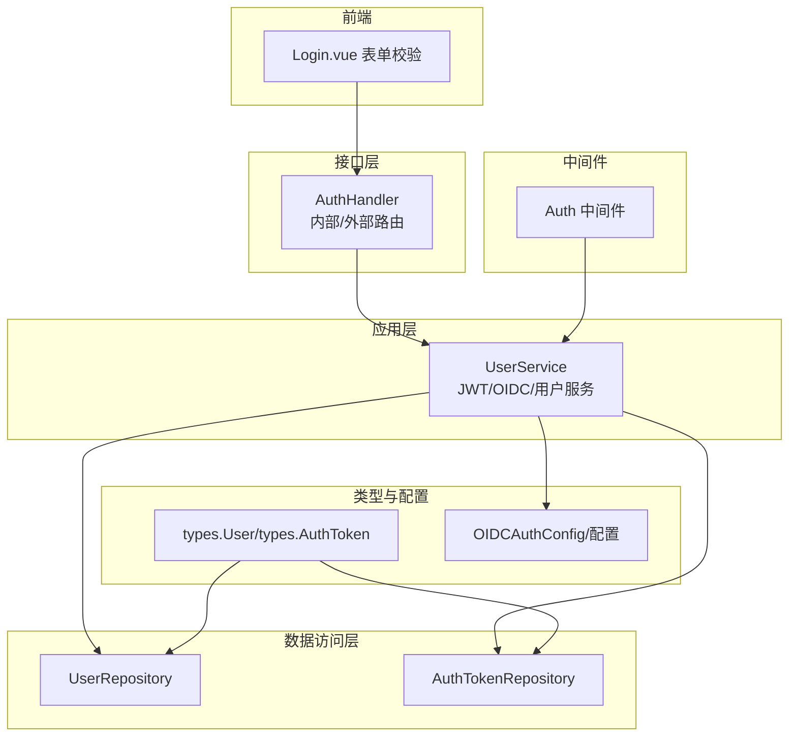
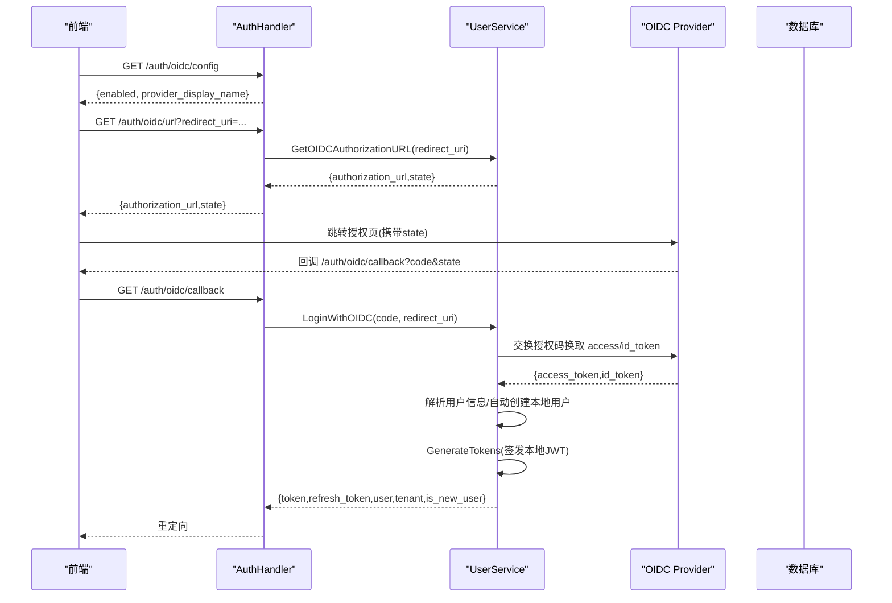
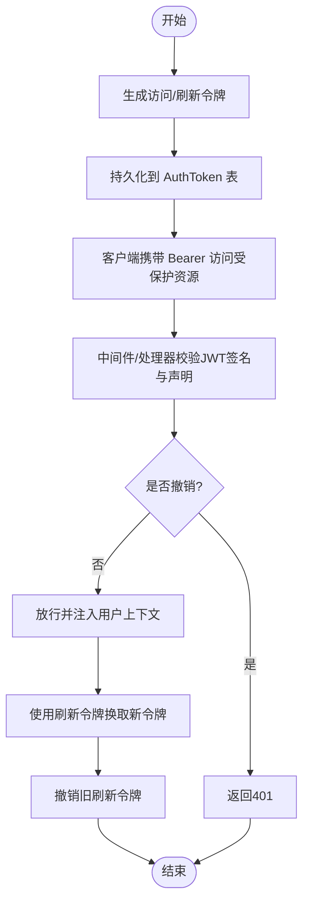
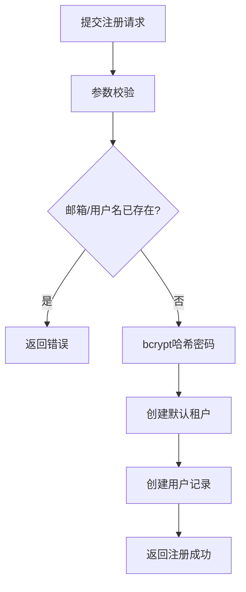
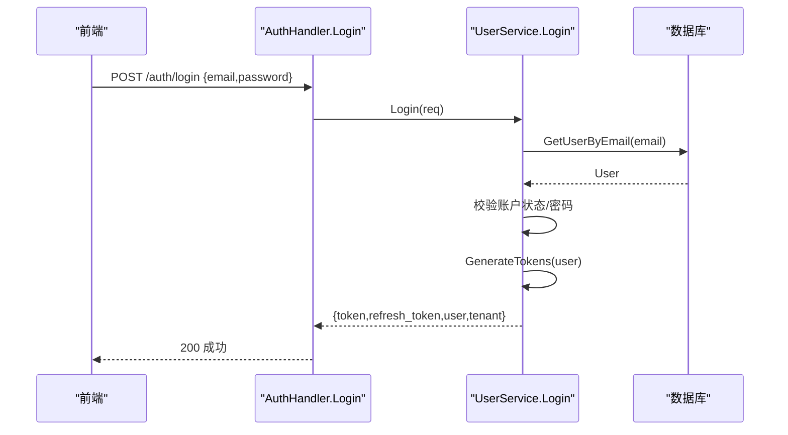
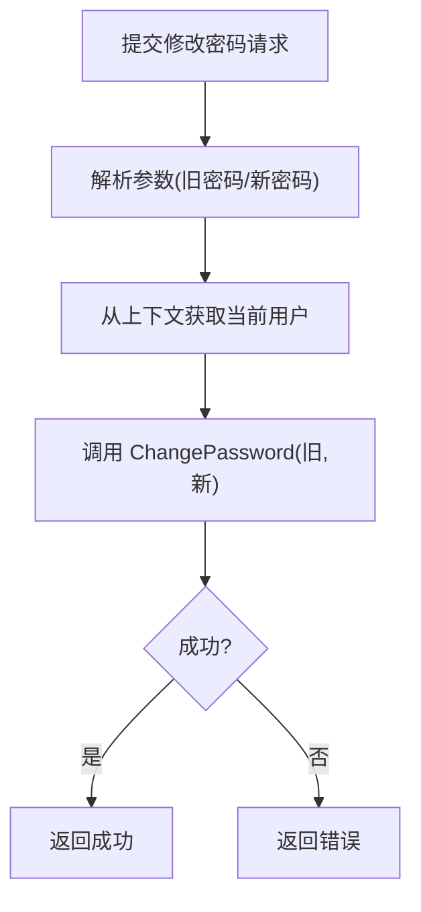
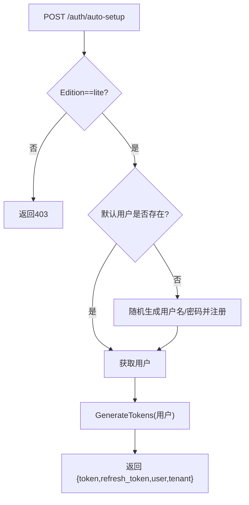
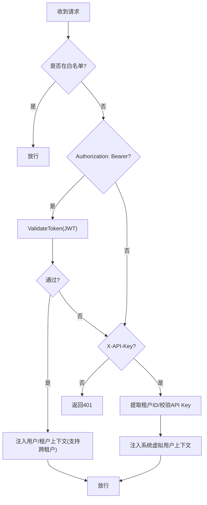
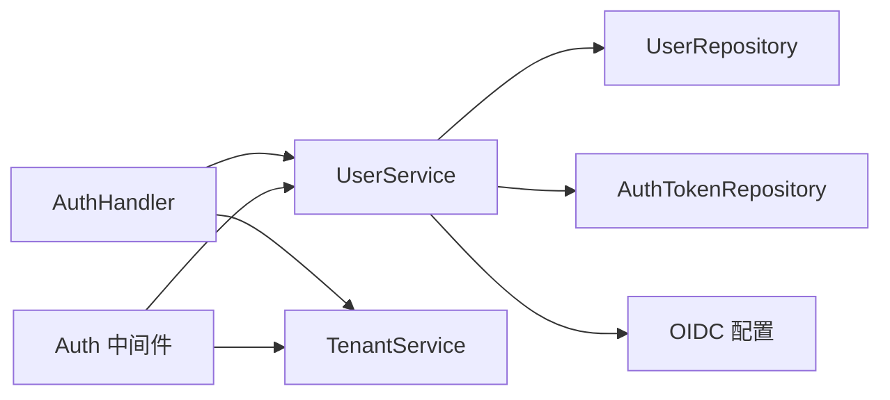

# 认证机制

<cite>
**本文引用的文件**
- [internal/handler/auth.go](file://internal/handler/auth.go)
- [internal/middleware/auth.go](file://internal/middleware/auth.go)
- [internal/application/service/user.go](file://internal/application/service/user.go)
- [internal/application/repository/user.go](file://internal/application/repository/user.go)
- [internal/types/interfaces/user.go](file://internal/types/interfaces/user.go)
- [internal/types/user.go](file://internal/types/user.go)
- [internal/config/config.go](file://internal/config/config.go)
- [cmd/server/main.go](file://cmd/server/main.go)
- [docs/OIDC认证调用流程.md](file://docs/OIDC认证调用流程.md)
- [frontend/src/views/auth/Login.vue](file://frontend/src/views/auth/Login.vue)
</cite>

## 目录
1. [简介](#简介)
2. [项目结构](#项目结构)
3. [核心组件](#核心组件)
4. [架构总览](#架构总览)
5. [详细组件分析](#详细组件分析)
6. [依赖分析](#依赖分析)
7. [性能考虑](#性能考虑)
8. [故障排查指南](#故障排查指南)
9. [结论](#结论)
10. [附录](#附录)

## 简介
本文件系统性阐述 WeKnora 的认证与授权机制，覆盖以下主题：
- JWT 令牌管理：访问令牌与刷新令牌的生成、验证与撤销
- 用户注册与登录：用户名、邮箱、密码的校验规则与登录流程
- OIDC 集成：授权 URL 生成、回调处理、令牌交换与用户自动创建
- 密码修改：安全实现与流程
- Lite 版自动初始化：首次启动自动生成默认用户与令牌
- 认证中间件：工作原理与安全配置项
- API 调用示例与代码路径定位

## 项目结构
WeKnora 的认证相关代码主要分布在如下层次：
- 接口层：HTTP 处理器负责接收请求、参数校验与响应封装
- 应用层：业务服务实现认证核心逻辑（JWT 生成、OIDC 交换、用户管理）
- 数据访问层：仓储接口与实现负责持久化（用户、令牌）
- 类型与配置：定义请求/响应结构、JWT 声明、OIDC 配置
- 中间件：全局认证与跨租户访问控制
- 前端：表单校验规则与 OIDC 登录入口

图表来源
- [internal/handler/auth.go:1-633](file://internal/handler/auth.go#L1-L633)
- [internal/application/service/user.go:1-852](file://internal/application/service/user.go#L1-L852)
- [internal/application/repository/user.go:1-187](file://internal/application/repository/user.go#L1-L187)
- [internal/types/user.go:35-105](file://internal/types/user.go#L35-L105)
- [internal/config/config.go:180-192](file://internal/config/config.go#L180-L192)
- [internal/middleware/auth.go:1-238](file://internal/middleware/auth.go#L1-L238)
- [frontend/src/views/auth/Login.vue:465-495](file://frontend/src/views/auth/Login.vue#L465-L495)

章节来源
- [internal/handler/auth.go:1-633](file://internal/handler/auth.go#L1-L633)
- [internal/application/service/user.go:1-852](file://internal/application/service/user.go#L1-L852)
- [internal/application/repository/user.go:1-187](file://internal/application/repository/user.go#L1-L187)
- [internal/types/user.go:35-105](file://internal/types/user.go#L35-L105)
- [internal/config/config.go:180-192](file://internal/config/config.go#L180-L192)
- [internal/middleware/auth.go:1-238](file://internal/middleware/auth.go#L1-L238)
- [frontend/src/views/auth/Login.vue:465-495](file://frontend/src/views/auth/Login.vue#L465-L495)

## 核心组件
- 认证处理器（AuthHandler）：提供注册、登录、登出、刷新、验证、OIDC 授权 URL、回调、自动初始化等接口
- 用户服务（UserService）：实现 JWT 生成/验证、刷新令牌、撤销令牌、OIDC 代码交换、用户自动创建等
- 仓储层：用户与令牌的持久化操作
- 类型与接口：定义请求/响应结构、JWT 声明、OIDC 配置、用户与令牌实体
- 认证中间件（Auth Middleware）：全局拦截请求，执行 Bearer/JWT 校验与跨租户访问控制
- 配置（OIDCAuthConfig）：OIDC 开关、发现地址、端点、作用域、用户信息映射等

章节来源
- [internal/handler/auth.go:22-44](file://internal/handler/auth.go#L22-L44)
- [internal/application/service/user.go:58-79](file://internal/application/service/user.go#L58-L79)
- [internal/application/repository/user.go:12-187](file://internal/application/repository/user.go#L12-L187)
- [internal/types/interfaces/user.go:9-47](file://internal/types/interfaces/user.go#L9-L47)
- [internal/types/user.go:35-105](file://internal/types/user.go#L35-L105)
- [internal/middleware/auth.go:65-228](file://internal/middleware/auth.go#L65-L228)
- [internal/config/config.go:180-192](file://internal/config/config.go#L180-L192)

## 架构总览
WeKnora 的认证采用“本地 JWT + OIDC 外部身份”的混合策略：
- 用户注册/登录：本地凭据，签发 WeKnora 自有的 JWT（访问令牌与刷新令牌）
- OIDC 登录：前端引导至第三方 OIDC Provider，后端以授权码换取第三方令牌，解析用户信息后自动创建本地用户并签发本地 JWT
- 令牌生命周期：访问令牌短期有效，刷新令牌长期有效但可撤销；支持登出撤销与批量清理

图表来源
- [internal/handler/auth.go:164-276](file://internal/handler/auth.go#L164-L276)
- [internal/application/service/user.go:219-258](file://internal/application/service/user.go#L219-L258)
- [internal/application/service/user.go:260-388](file://internal/application/service/user.go#L260-L388)
- [docs/OIDC认证调用流程.md:28-64](file://docs/OIDC认证调用流程.md#L28-L64)

章节来源
- [internal/handler/auth.go:164-276](file://internal/handler/auth.go#L164-L276)
- [internal/application/service/user.go:219-388](file://internal/application/service/user.go#L219-L388)
- [docs/OIDC认证调用流程.md:28-64](file://docs/OIDC认证调用流程.md#L28-L64)

## 详细组件分析

### JWT 令牌管理
- 生成策略
  - 访问令牌：有效期 24 小时，声明包含 user_id、email、tenant_id、iat/exp、type=access
  - 刷新令牌：有效期 7 天，声明包含 user_id、iat/exp、type=refresh
  - 使用 HS256 签名，密钥来自环境变量 JWT_SECRET，未设置时随机生成并缓存
- 验证策略
  - 校验签名算法与密钥
  - 校验声明合法性与过期时间
  - 查询数据库确认令牌未被撤销
- 刷新与撤销
  - 使用刷新令牌生成新令牌，旧刷新令牌标记为撤销
  - 登出时撤销访问令牌；支持按用户批量撤销

图表来源
- [internal/application/service/user.go:389-444](file://internal/application/service/user.go#L389-L444)
- [internal/application/service/user.go:446-476](file://internal/application/service/user.go#L446-L476)
- [internal/application/service/user.go:478-527](file://internal/application/service/user.go#L478-L527)
- [internal/application/repository/user.go:142-186](file://internal/application/repository/user.go#L142-L186)

章节来源
- [internal/application/service/user.go:389-527](file://internal/application/service/user.go#L389-L527)
- [internal/application/repository/user.go:142-186](file://internal/application/repository/user.go#L142-L186)

### 用户注册流程
- 参数校验
  - 用户名：必填，长度 2-50
  - 邮箱：必填，合法邮箱
  - 密码：必填，最小长度 6
- 业务逻辑
  - 检查邮箱/用户名唯一性
  - 使用 bcrypt 哈希密码
  - 创建默认租户（Workspace）
  - 创建用户记录并返回

图表来源
- [internal/handler/auth.go:57-108](file://internal/handler/auth.go#L57-L108)
- [internal/application/service/user.go:82-142](file://internal/application/service/user.go#L82-L142)
- [frontend/src/views/auth/Login.vue:474-495](file://frontend/src/views/auth/Login.vue#L474-L495)

章节来源
- [internal/handler/auth.go:57-108](file://internal/handler/auth.go#L57-L108)
- [internal/application/service/user.go:82-142](file://internal/application/service/user.go#L82-L142)
- [frontend/src/views/auth/Login.vue:474-495](file://frontend/src/views/auth/Login.vue#L474-L495)

### 用户登录流程
- 参数校验：邮箱与密码必填
- 业务逻辑：
  - 根据邮箱查找用户并校验账户状态
  - bcrypt 校验密码
  - 生成本地 JWT（访问/刷新）
  - 返回用户与租户信息

图表来源
- [internal/handler/auth.go:120-162](file://internal/handler/auth.go#L120-L162)
- [internal/application/service/user.go:144-200](file://internal/application/service/user.go#L144-L200)

章节来源
- [internal/handler/auth.go:120-162](file://internal/handler/auth.go#L120-L162)
- [internal/application/service/user.go:144-200](file://internal/application/service/user.go#L144-L200)

### OIDC 集成实现
- 授权 URL 生成
  - 读取 OIDC 配置（发现地址或显式端点）
  - 生成 state（包含 nonce 与 redirect_uri），编码后拼接到授权端点
- 回调处理
  - 校验错误参数与 state
  - 使用授权码换取第三方令牌
  - 解析用户信息（优先 id_token claims，其次 userinfo）
  - 自动创建本地用户（用户名去噪、邮箱唯一）
  - 生成本地 JWT 并返回
- 重定向回前端
  - 将登录结果序列化并 base64url 编码，作为 hash 参数重定向

```mermaid
sequenceDiagram
participant FE as "前端"
participant API as "AuthHandler.GetOIDCAuthorizationURL"
participant SVC as "UserService"
participant OP as "OIDC Provider"
FE->>API : GET /auth/oidc/url?redirect_uri=...
API->>SVC : GetOIDCAuthorizationURL(redirect_uri)
SVC->>SVC : 读取OIDC配置/填充端点
SVC->>SVC : 生成state(含nonce/redirect_uri)
SVC-->>API : {authorization_url,state}
API-->>FE : {authorization_url,state}
FE->>OP : 跳转授权页
OP-->>FE : 回调 /auth/oidc/callback?code&state
FE->>API : GET /auth/oidc/callback
API->>SVC : LoginWithOIDC(code, redirect_uri)
SVC->>OP : 交换授权码
OP-->>SVC : {access_token,id_token}
SVC->>SVC : 解析用户信息/自动创建本地用户
SVC->>SVC : GenerateTokens(本地JWT)
SVC-->>API : {token,refresh_token,user,tenant,is_new_user}
API-->>FE : 重定向 #oidc_result=base64url(JSON)
```

图表来源
- [internal/handler/auth.go:175-276](file://internal/handler/auth.go#L175-L276)
- [internal/application/service/user.go:219-388](file://internal/application/service/user.go#L219-L388)
- [docs/OIDC认证调用流程.md:28-64](file://docs/OIDC认证调用流程.md#L28-L64)

章节来源
- [internal/handler/auth.go:175-276](file://internal/handler/auth.go#L175-L276)
- [internal/application/service/user.go:219-388](file://internal/application/service/user.go#L219-L388)
- [docs/OIDC认证调用流程.md:28-64](file://docs/OIDC认证调用流程.md#L28-L64)

### 密码修改功能
- 请求参数：旧密码、新密码（最小长度 6）
- 流程：
  - 从上下文获取当前用户
  - 调用服务层 ChangePassword 执行校验与更新
  - 返回成功响应

图表来源
- [internal/handler/auth.go:467-507](file://internal/handler/auth.go#L467-L507)
- [internal/application/service/user.go:529-540](file://internal/application/service/user.go#L529-L540)

章节来源
- [internal/handler/auth.go:467-507](file://internal/handler/auth.go#L467-L507)
- [internal/application/service/user.go:529-540](file://internal/application/service/user.go#L529-L540)

### Lite 版自动初始化
- 适用条件：仅在 Lite 版本可用
- 流程：
  - 默认邮箱 admin@weknora.local
  - 若用户不存在，随机生成用户名与密码并注册
  - 生成本地 JWT（访问/刷新）并返回
- 作用：首次启动免注册/登录，直接进入系统

图表来源
- [internal/handler/auth.go:518-580](file://internal/handler/auth.go#L518-L580)

章节来源
- [internal/handler/auth.go:518-580](file://internal/handler/auth.go#L518-L580)

### 认证中间件与安全配置
- 无需认证的 API 白名单（GET/POST）
- 核心逻辑：
  - 优先尝试 Bearer JWT 校验
  - 成功后注入用户与租户上下文，支持跨租户访问（需配置开启）
  - 兼容 X-API-Key（系统虚拟用户）
  - 未提供认证信息则拒绝
- 安全要点：
  - JWT 密钥通过环境变量配置
  - 跨租户访问需显式开启
  - 令牌撤销与过期检查

图表来源
- [internal/middleware/auth.go:20-228](file://internal/middleware/auth.go#L20-L228)
- [internal/application/service/user.go:446-476](file://internal/application/service/user.go#L446-L476)

章节来源
- [internal/middleware/auth.go:20-228](file://internal/middleware/auth.go#L20-L228)
- [internal/application/service/user.go:446-476](file://internal/application/service/user.go#L446-L476)

## 依赖分析
- 组件耦合
  - AuthHandler 依赖 UserService 与 TenantService
  - UserService 依赖 UserRepository、AuthTokenRepository、配置与加密库
  - 中间件依赖 UserService 与 TenantService
- 外部依赖
  - JWT 库（HS256）
  - bcrypt（密码哈希）
  - OIDC Provider（HTTP 交换令牌与用户信息）

图表来源
- [internal/handler/auth.go:25-44](file://internal/handler/auth.go#L25-L44)
- [internal/application/service/user.go:58-79](file://internal/application/service/user.go#L58-L79)
- [internal/middleware/auth.go:65-70](file://internal/middleware/auth.go#L65-L70)

章节来源
- [internal/handler/auth.go:25-44](file://internal/handler/auth.go#L25-L44)
- [internal/application/service/user.go:58-79](file://internal/application/service/user.go#L58-L79)
- [internal/middleware/auth.go:65-70](file://internal/middleware/auth.go#L65-L70)

## 性能考虑
- JWT 生成/验证为内存计算，开销极低
- 令牌持久化仅在签发与撤销时发生，建议定期清理过期令牌
- OIDC 交换涉及外部 HTTP 请求，建议配置合理的超时与重试策略
- 中间件每次请求都会校验 JWT 与查询令牌状态，建议在网关层缓存鉴权结果（如适用）

## 故障排查指南
- OIDC 未启用或配置缺失
  - 检查 OIDC 配置开关与必要字段（client_id、client_secret、发现地址或端点）
- 回调错误
  - 检查 state 解码、nonce 校验、回调参数完整性
- 令牌无效
  - 确认签名算法与密钥一致；检查令牌是否撤销或过期
- 登出失败
  - 确认传入的是访问令牌而非刷新令牌；检查撤销是否成功写入数据库
- 跨租户访问被拒
  - 确认租户配置已开启跨租户访问，且用户具备相应权限

章节来源
- [internal/config/config.go:440-495](file://internal/config/config.go#L440-L495)
- [internal/handler/auth.go:234-276](file://internal/handler/auth.go#L234-L276)
- [internal/application/service/user.go:446-476](file://internal/application/service/user.go#L446-L476)
- [internal/middleware/auth.go:47-63](file://internal/middleware/auth.go#L47-L63)

## 结论
WeKnora 的认证体系以本地 JWT 为核心，结合 OIDC 外部身份，既保证了易用性又兼顾安全性。通过严格的参数校验、令牌撤销与中间件拦截，系统在桌面端 Lite 版本实现了“零门槛”初始化，在服务端版本提供了灵活的 OIDC 集成与跨租户访问能力。

## 附录

### API 调用示例与代码路径
- 注册
  - 请求：POST /api/v1/auth/register
  - 处理：AuthHandler.Register → UserService.Register
  - 参考：[internal/handler/auth.go:57-108](file://internal/handler/auth.go#L57-L108)，[internal/application/service/user.go:82-142](file://internal/application/service/user.go#L82-L142)
- 登录
  - 请求：POST /api/v1/auth/login
  - 处理：AuthHandler.Login → UserService.Login → GenerateTokens
  - 参考：[internal/handler/auth.go:120-162](file://internal/handler/auth.go#L120-L162)，[internal/application/service/user.go:144-200](file://internal/application/service/user.go#L144-L200)
- 刷新令牌
  - 请求：POST /api/v1/auth/refresh
  - 处理：AuthHandler.RefreshToken → UserService.RefreshToken
  - 参考：[internal/handler/auth.go:380-412](file://internal/handler/auth.go#L380-L412)，[internal/application/service/user.go:478-527](file://internal/application/service/user.go#L478-L527)
- 登出
  - 请求：POST /api/v1/auth/logout
  - 处理：AuthHandler.Logout → UserService.RevokeToken
  - 参考：[internal/handler/auth.go:329-368](file://internal/handler/auth.go#L329-L368)，[internal/application/service/user.go:529-540](file://internal/application/service/user.go#L529-L540)
- OIDC 授权 URL
  - 请求：GET /api/v1/auth/oidc/url?redirect_uri=...
  - 处理：AuthHandler.GetOIDCAuthorizationURL → UserService.GetOIDCAuthorizationURL
  - 参考：[internal/handler/auth.go:175-193](file://internal/handler/auth.go#L175-L193)，[internal/application/service/user.go:219-258](file://internal/application/service/user.go#L219-L258)
- OIDC 回调
  - 请求：GET /api/v1/auth/oidc/callback
  - 处理：AuthHandler.OIDCRedirectCallback → UserService.LoginWithOIDC
  - 参考：[internal/handler/auth.go:229-276](file://internal/handler/auth.go#L229-L276)，[internal/application/service/user.go:260-388](file://internal/application/service/user.go#L260-L388)
- 自动初始化（Lite）
  - 请求：POST /api/v1/auth/auto-setup
  - 处理：AuthHandler.AutoSetup → UserService.GenerateTokens
  - 参考：[internal/handler/auth.go:518-580](file://internal/handler/auth.go#L518-L580)
- 验证令牌
  - 请求：GET /api/v1/auth/validate
  - 处理：AuthHandler.ValidateToken → UserService.ValidateToken
  - 参考：[internal/handler/auth.go:592-632](file://internal/handler/auth.go#L592-L632)，[internal/application/service/user.go:446-476](file://internal/application/service/user.go#L446-L476)

### OIDC 配置项
- enable：是否启用 OIDC
- issuer_url/discovery_url：发现地址或显式端点
- authorization_endpoint/token_endpoint/user_info_endpoint：三方端点
- client_id/client_secret：客户端凭据
- scopes：作用域集合
- user_info_mapping：用户名与邮箱映射键

章节来源
- [internal/config/config.go:180-192](file://internal/config/config.go#L180-L192)
- [internal/config/config.go:497-557](file://internal/config/config.go#L497-L557)