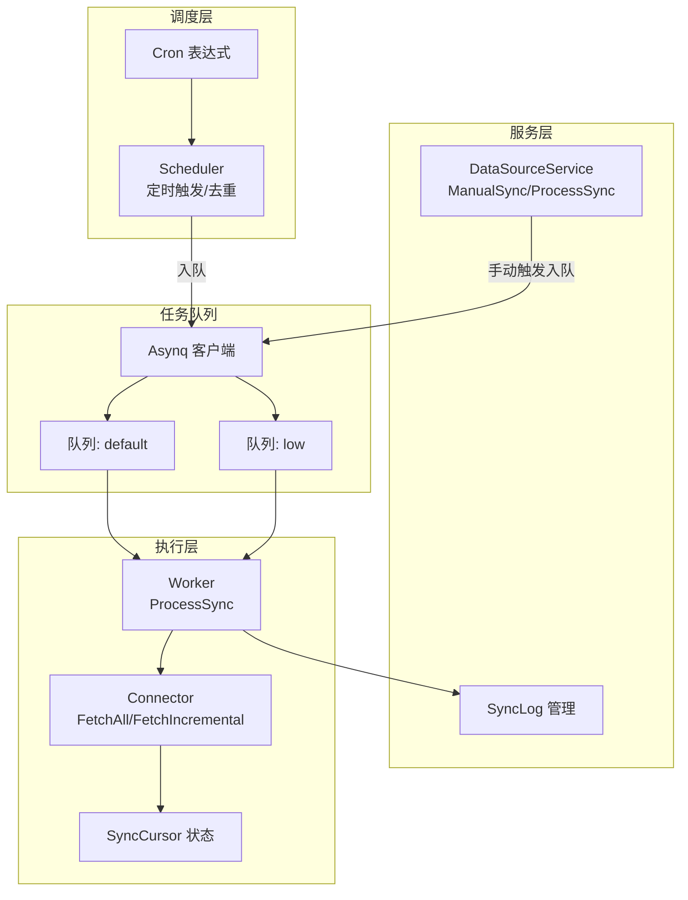
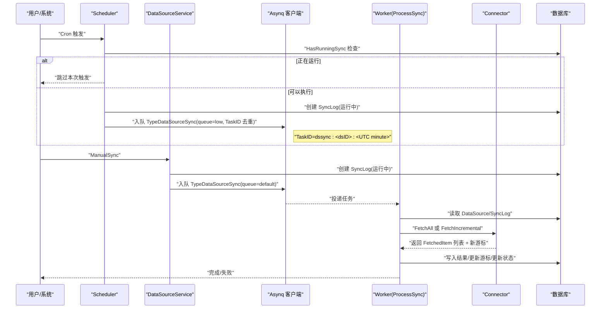
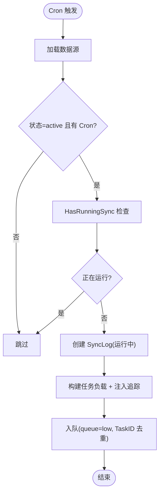
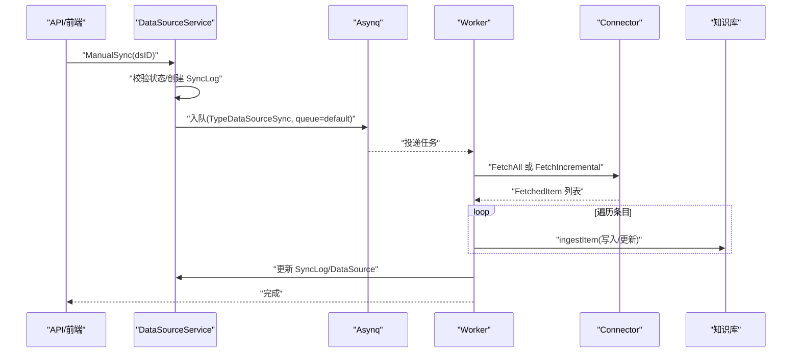
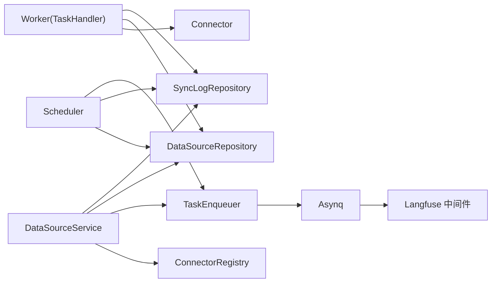

# 同步调度机制

<cite>
**本文引用的文件**
- [scheduler.go](file://internal/datasource/scheduler.go)
- [datasource_service.go](file://internal/application/service/datasource_service.go)
- [task.go](file://internal/types/task.go)
- [datasource.go](file://internal/types/datasource.go)
- [connector.go](file://internal/datasource/connector.go)
- [task_enqueuer.go](file://internal/types/interfaces/task_enqueuer.go)
- [task_handler.go](file://internal/types/interfaces/task_handler.go)
- [asynq.go](file://internal/tracing/langfuse/asynq.go)
- [数据源导入开发文档.md](file://docs/数据源导入开发文档.md)
- [connector.go（飞书）](file://internal/datasource/connector/feishu/connector.go)
- [connector.go（语雀）](file://internal/datasource/connector/yuque/connector.go)
</cite>

## 目录
1. [简介](#简介)
2. [项目结构](#项目结构)
3. [核心组件](#核心组件)
4. [架构总览](#架构总览)
5. [详细组件分析](#详细组件分析)
6. [依赖分析](#依赖分析)
7. [性能考虑](#性能考虑)
8. [故障排查指南](#故障排查指南)
9. [结论](#结论)
10. [附录](#附录)

## 简介
本文围绕 WeKnora 的“数据源同步调度机制”进行系统化文档化，重点覆盖以下方面：
- 异步任务队列 Asynq 的集成与配置（任务注册、执行流程、错误处理）
- 手动触发与定时任务的实现（Cron 表达式、调度策略）
- 增量同步与全量同步的差异与适用场景
- 同步游标（cursor）工作原理与状态管理
- 并发控制与资源限制策略
- 同步失败的重试与错误恢复流程
- 性能优化建议与监控指标

## 项目结构
WeKnora 的同步调度由“调度器（Scheduler）+ 服务（DataSourceService）+ Asynq 任务 + 连接器（Connector）”构成，整体采用生产者-消费者模式：手动或定时触发创建 SyncLog 并入队 TypeDataSourceSync 任务；Worker 异步执行实际同步逻辑。

图表来源
- [scheduler.go:18-203](file://internal/datasource/scheduler.go#L18-L203)
- [datasource_service.go:269-599](file://internal/application/service/datasource_service.go#L269-L599)
- [task.go](file://internal/types/task.go#L18)
- [connector.go:28-31](file://internal/datasource/connector.go#L28-L31)

章节来源
- [scheduler.go:18-203](file://internal/datasource/scheduler.go#L18-L203)
- [datasource_service.go:269-599](file://internal/application/service/datasource_service.go#L269-L599)
- [数据源导入开发文档.md:426-455](file://docs/数据源导入开发文档.md#L426-L455)

## 核心组件
- 调度器（Scheduler）：基于 robfig/cron 的定时任务管理，负责加载活跃数据源、注册 Cron 表达式、触发同步、去重入队。
- 数据源服务（DataSourceService）：对外提供手动触发接口，封装任务入队与错误回滚；在 Worker 中执行具体同步逻辑。
- Asynq 任务类型：TypeDataSourceSync，承载同步任务负载（数据源ID、租户ID、SyncLogID、强制全量标志等）。
- 连接器（Connector）：抽象各外部平台的数据拉取能力，支持全量与增量两种模式，并维护各自平台的游标状态。
- 游标（SyncCursor）：记录增量同步的状态，确保下次同步只拉取变更项。

章节来源
- [scheduler.go:18-203](file://internal/datasource/scheduler.go#L18-L203)
- [datasource_service.go:269-599](file://internal/application/service/datasource_service.go#L269-L599)
- [task.go](file://internal/types/task.go#L18)
- [datasource.go:27-47](file://internal/types/datasource.go#L27-L47)

## 架构总览
下图展示了从“定时触发/手动触发”到“Worker 执行”的完整链路，以及两层去重保护与错误处理路径。

图表来源
- [scheduler.go:132-203](file://internal/datasource/scheduler.go#L132-L203)
- [datasource_service.go:269-599](file://internal/application/service/datasource_service.go#L269-L599)
- [数据源导入开发文档.md:426-455](file://docs/数据源导入开发文档.md#L426-L455)

## 详细组件分析

### 调度器（Scheduler）
- 职责
  - 加载活跃数据源并注册 Cron 表达式
  - 在 Cron 触发点检查“是否存在仍在运行的同步”，避免重叠
  - 创建 SyncLog 并入队 Asynq 任务，使用确定性 TaskID 实现跨实例去重
- 去重策略
  - DB 层：HasRunningSync 防止同数据源重复执行
  - 队列层：TaskID=dssync:<dsID>:<UTC minute>，Redis 保证同一分钟内仅一个任务入队
- 关键行为
  - Start：加载活跃数据源并注册 Cron
  - AddOrUpdate/Remove：动态增删 Cron 条目
  - triggerSync：创建 SyncLog、构造任务负载、入队并处理错误

图表来源
- [scheduler.go:132-203](file://internal/datasource/scheduler.go#L132-L203)

章节来源
- [scheduler.go:18-203](file://internal/datasource/scheduler.go#L18-L203)
- [数据源导入开发文档.md:709-751](file://docs/数据源导入开发文档.md#L709-L751)

### 数据源服务（DataSourceService）
- 手动触发（ManualSync）
  - 校验状态、创建 SyncLog、构造任务负载、入队 default 队列
  - 若入队失败，回写 SyncLog 为失败并更新数据源状态
- Worker 执行（ProcessSync）
  - 解析任务负载、加载数据源与配置、获取 Connector
  - 根据 ForceFull 或 SyncMode 决定 FetchAll 或 FetchIncremental
  - 遍历 FetchedItem，调用 ingestItem 写入知识库，统计结果
  - 更新 SyncLog 与 DataSource（游标、最后同步时间、结果）

图表来源
- [datasource_service.go:269-599](file://internal/application/service/datasource_service.go#L269-L599)

章节来源
- [datasource_service.go:269-599](file://internal/application/service/datasource_service.go#L269-L599)

### Asynq 任务类型与负载
- 任务类型：TypeDataSourceSync
- 负载字段：DataSourceID、TenantID、SyncLogID、ForceFull
- 队列策略：
  - 定时触发：queue=low
  - 手动触发：queue=default
- 去重策略：定时触发使用确定性 TaskID，避免多实例重复执行

章节来源
- [task.go](file://internal/types/task.go#L18)
- [scheduler.go:176-182](file://internal/datasource/scheduler.go#L176-L182)

### 连接器（Connector）与同步模式
- 抽象接口
  - FetchAll：全量同步
  - FetchIncremental：增量同步，返回变更项与新游标
- 增量同步要点
  - 基于上次游标判断变更
  - 支持检测删除（如飞书示例中对节点集合差分）
- 平台实现
  - 飞书：基于节点编辑时间比较，支持检测删除
  - 语雀：基于文档 ContentUpdatedAt 比较

章节来源
- [connector.go:28-31](file://internal/datasource/connector.go#L28-L31)
- [connector.go（飞书）:115-200](file://internal/datasource/connector/feishu/connector.go#L115-L200)
- [connector.go（语雀）:116-200](file://internal/datasource/connector/yuque/connector.go#L116-L200)

### 同步游标（SyncCursor）与状态管理
- 结构与解析
  - DataSource.LastSyncCursor 存储 JSON，提供 ParseSyncCursor 解析
  - SyncLog.Result 提供 ParseResult 解析同步结果
- 增量同步流程
  - ProcessSync 读取上次游标，调用 FetchIncremental 获取变更项与新游标
  - 成功后将新游标写回 DataSource.LastSyncCursor
- 设计要点
  - 游标需包含足够信息以识别“已删除/未变更/已更新”
  - 不同平台游标结构不同，但遵循统一的 JSON 存储与解析接口

章节来源
- [datasource.go:383-417](file://internal/types/datasource.go#L383-L417)
- [datasource_service.go:456-465](file://internal/application/service/datasource_service.go#L456-L465)
- [datasource_service.go:568-572](file://internal/application/service/datasource_service.go#L568-L572)

### Cron 表达式与调度策略
- Cron 表达式
  - 6 字段（秒级）：支持每秒触发，如 "*/2 * * * * *"（每 2 秒）
  - 与 robfig/cron 配合，按绝对墙钟时间触发
- 调度策略
  - 多实例同时触发时，通过 DB 层与队列层双重去重，确保同一分钟内仅一次执行
  - 动态管理：创建/更新/暂停/恢复/删除数据源时，对应增删 Cron 条目

章节来源
- [scheduler.go:117-130](file://internal/datasource/scheduler.go#L117-L130)
- [scheduler.go:83-98](file://internal/datasource/scheduler.go#L83-L98)
- [数据源导入开发文档.md:709-751](file://docs/数据源导入开发文档.md#L709-L751)

### 错误处理与重试
- 入队失败
  - 定时触发：若 TaskID 冲突（ErrTaskIDConflict），记录取消状态；其他入队错误，记录失败并回写 SyncLog
  - 手动触发：入队失败回写 SyncLog 为失败并更新数据源状态
- 连接器错误
  - FetchAll/FetchIncremental 失败时，回写 SyncLog 为失败并更新数据源状态
- Worker 执行期错误
  - 解析负载、加载数据源、获取连接器、写入知识库任一步骤失败均会回写失败状态
- 重试机制
  - 当前实现未显式配置 Asynq 重试策略；失败后由上层（如前端/再次手动触发）决定是否重试

章节来源
- [scheduler.go:183-200](file://internal/datasource/scheduler.go#L183-L200)
- [datasource_service.go:307-320](file://internal/application/service/datasource_service.go#L307-L320)
- [datasource_service.go:467-479](file://internal/application/service/datasource_service.go#L467-L479)

### 并发控制与资源限制
- 队列隔离
  - 定时触发：queue=low，手动触发：queue=default，便于差异化优先级与资源分配
- 去重保护
  - DB 层 HasRunningSync 防重叠
  - 队列层 TaskID 去重防多实例重复执行
- 并发建议
  - 根据平台限流与网络带宽设置 Worker 数量
  - 对高并发场景，可拆分数据源或按租户/知识库分片

章节来源
- [scheduler.go:176-182](file://internal/datasource/scheduler.go#L176-L182)
- [datasource_service.go:269-324](file://internal/application/service/datasource_service.go#L269-L324)

## 依赖分析
- 组件耦合
  - Scheduler 依赖 DataSourceRepository、SyncLogRepository、TaskEnqueuer
  - DataSourceService 依赖 ConnectorRegistry、TaskEnqueuer、多个仓储与服务
  - Worker 通过 TaskHandler 接口被 Asynq 调用（接口定义见 task_handler.go）
- 外部依赖
  - Asynq：任务队列与去重
  - robfig/cron：Cron 表达式解析与调度
  - Langfuse：任务追踪注入（Asynq 中间件）

图表来源
- [scheduler.go:28-31](file://internal/datasource/scheduler.go#L28-L31)
- [datasource_service.go:22-32](file://internal/application/service/datasource_service.go#L22-L32)
- [task_handler.go:9-13](file://internal/types/interfaces/task_handler.go#L9-L13)
- [asynq.go:101-142](file://internal/tracing/langfuse/asynq.go#L101-L142)

章节来源
- [task_enqueuer.go:5-9](file://internal/types/interfaces/task_enqueuer.go#L5-L9)
- [task_handler.go:9-13](file://internal/types/interfaces/task_handler.go#L9-L13)
- [asynq.go:101-142](file://internal/tracing/langfuse/asynq.go#L101-L142)

## 性能考虑
- 增量同步优先：默认使用增量同步，减少网络与解析开销
- 游标优化：确保游标包含足够信息（如时间戳、节点集合），降低无效拉取
- 队列与并发：合理划分队列与 Worker 数量，避免热点数据源成为瓶颈
- 连接器限流：在 Connector 层实现平台限流与退避，避免触发平台速率限制
- 日志与观测：利用 Langfuse 中间件与 SyncLog 记录关键指标（耗时、失败率、变更量）

## 故障排查指南
- 常见问题定位
  - 入队失败：检查 Redis 可用性与 Asynq 配置；查看 ErrTaskIDConflict 与其它错误码
  - 同步未执行：确认数据源状态为 active，Cron 表达式有效，HasRunningSync 返回 false
  - 结果异常：核对 SyncLog 与 DataSource.LastSyncResult/LastSyncCursor 的解析
- 建议步骤
  - 查看 SyncLog 列表与详情，定位失败阶段
  - 检查 Connector 的 Validate 与 ListResources 输出
  - 核对租户上下文与自动标签创建情况

章节来源
- [datasource_service.go:368-385](file://internal/application/service/datasource_service.go#L368-L385)
- [datasource_service.go:410-415](file://internal/application/service/datasource_service.go#L410-L415)

## 结论
WeKnora 的同步调度机制通过“Cron + Asynq + 连接器”的组合，实现了稳定、可观测、可扩展的数据源同步能力。双层去重（DB + 队列）与明确的错误回滚路径，确保了在多实例环境下的正确性与可靠性。建议在生产环境中结合平台限流、队列隔离与监控指标，持续优化同步性能与稳定性。

## 附录
- 增量 vs 全量
  - 增量：基于游标只拉取变更项，适合日常同步
  - 全量：拉取全部内容，适合初始化或修复性同步
- Cron 表达式示例
  - 每 2 秒：*/2 * * * * *
  - 每小时：0 0 * * * *
- 队列选择
  - default：手动触发
  - low：定时触发（带去重）