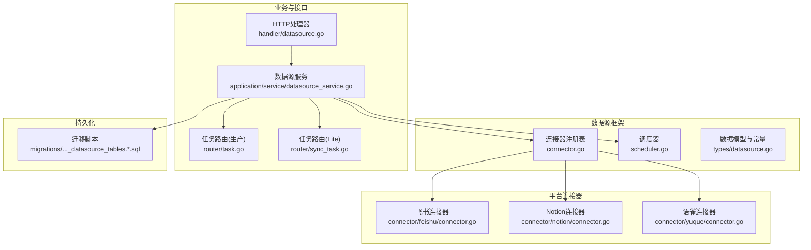
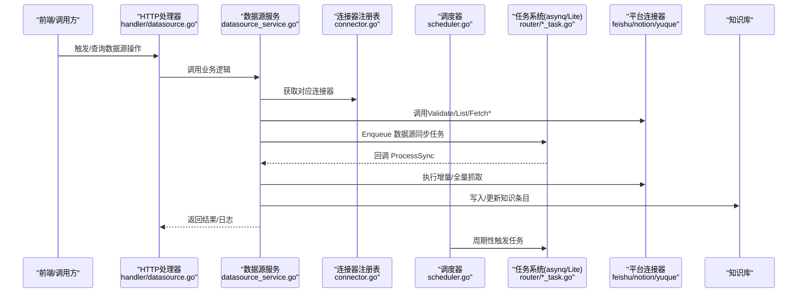
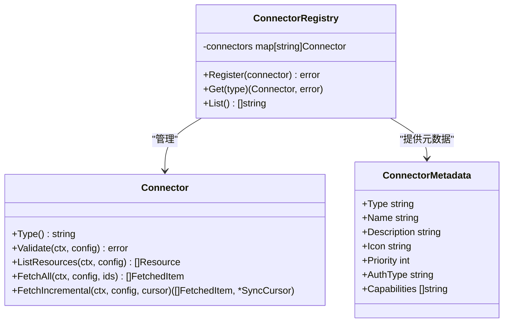
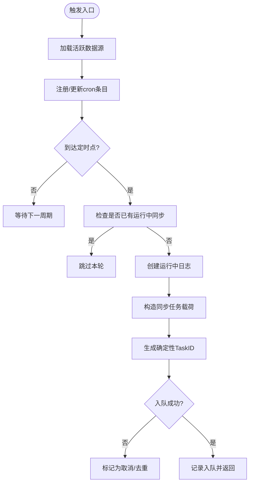
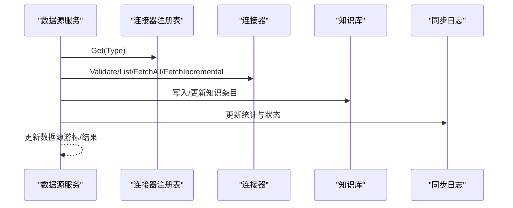
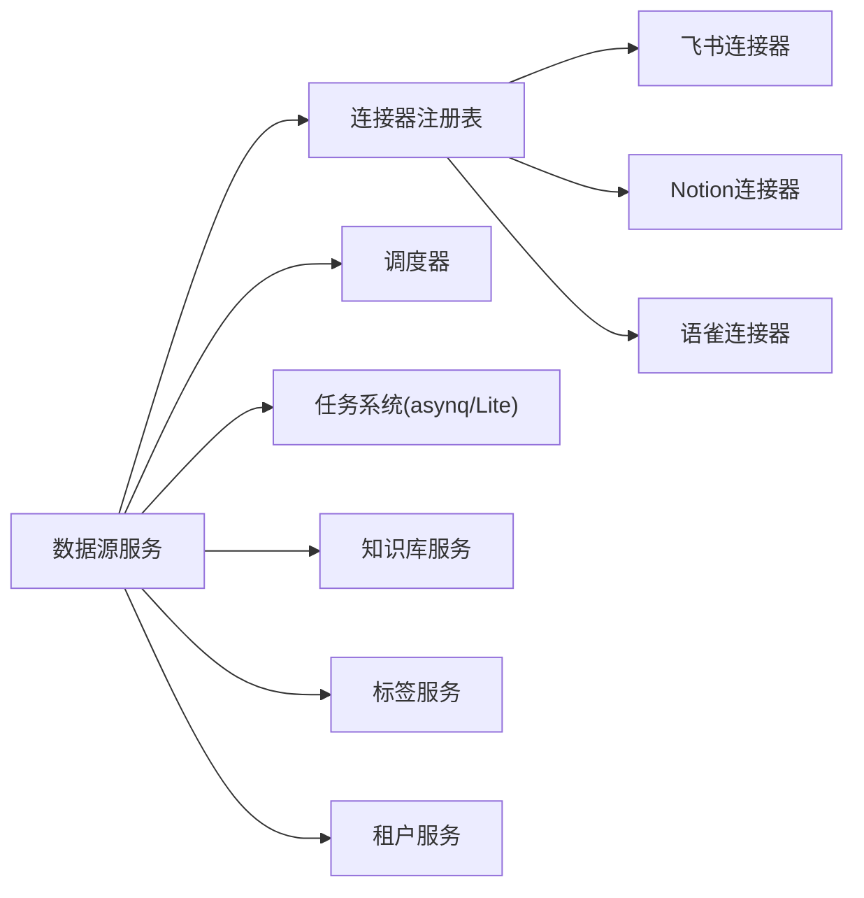

# 数据源集成

<cite>
**本文引用的文件**
- [connector.go](file://internal/datasource/connector.go)
- [scheduler.go](file://internal/datasource/scheduler.go)
- [CONNECTOR_IMPLEMENTATION_GUIDE.md](file://internal/datasource/CONNECTOR_IMPLEMENTATION_GUIDE.md)
- [README.md](file://internal/datasource/README.md)
- [datasource.go](file://internal/types/datasource.go)
- [datasource_service.go](file://internal/application/service/datasource_service.go)
- [datasource.go](file://internal/handler/datasource.go)
- [task.go](file://internal/router/task.go)
- [sync_task.go](file://internal/router/sync_task.go)
- [000029_datasource_tables.up.sql](file://migrations/versioned/000029_datasource_tables.up.sql)
- [000029_datasource_tables.down.sql](file://migrations/versioned/000029_datasource_tables.down.sql)
- [connector.go（飞书）](file://internal/datasource/connector/feishu/connector.go)
- [connector.go（Notion）](file://internal/datasource/connector/notion/connector.go)
- [connector.go（语雀）](file://internal/datasource/connector/yuque/connector.go)
- [errors.go](file://internal/datasource/errors.go)
</cite>

## 目录
1. [简介](#简介)
2. [项目结构](#项目结构)
3. [核心组件](#核心组件)
4. [架构总览](#架构总览)
5. [详细组件分析](#详细组件分析)
6. [依赖关系分析](#依赖关系分析)
7. [性能考虑](#性能考虑)
8. [故障排查指南](#故障排查指南)
9. [结论](#结论)
10. [附录](#附录)

## 简介
本文件面向WeKnora的数据源集成功能，系统性阐述数据源连接器的设计架构与实现原理，解释自动同步机制（调度器、增量同步策略、错误恢复），文档化飞书、Notion、语雀等平台的集成方式，给出连接器开发指南（接口实现、认证处理、数据映射规则），并提供配置最佳实践、性能优化建议、并发控制与冲突解决机制、新连接器开发流程与测试方法，以及监控与故障排除工具。

## 项目结构
WeKnora的数据源同步体系由“连接器框架 + 业务服务 + 调度与任务 + 数据模型 + 数据库迁移”构成，采用分层设计与适配器模式，支持多平台扩展与异步执行。

图表来源
- [connector.go:34-73](file://internal/datasource/connector.go#L34-L73)
- [scheduler.go:18-52](file://internal/datasource/scheduler.go#L18-L52)
- [datasource_service.go:21-57](file://internal/application/service/datasource_service.go#L21-L57)
- [datasource.go:14-29](file://internal/handler/datasource.go#L14-L29)
- [task.go:100-165](file://internal/router/task.go#L100-L165)
- [sync_task.go:86-106](file://internal/router/sync_task.go#L86-L106)
- [connector.go（飞书）:15-26](file://internal/datasource/connector/feishu/connector.go#L15-L26)
- [connector.go（Notion）:23-34](file://internal/datasource/connector/notion/connector.go#L23-L34)
- [connector.go（语雀）:21-28](file://internal/datasource/connector/yuque/connector.go#L21-L28)
- [000029_datasource_tables.up.sql:5-52](file://migrations/versioned/000029_datasource_tables.up.sql#L5-L52)

章节来源
- [README.md:1-261](file://internal/datasource/README.md#L1-L261)
- [connector.go:9-31](file://internal/datasource/connector.go#L9-L31)
- [scheduler.go:18-52](file://internal/datasource/scheduler.go#L18-L52)
- [datasource.go:49-114](file://internal/types/datasource.go#L49-L114)
- [datasource_service.go:21-57](file://internal/application/service/datasource_service.go#L21-L57)
- [datasource.go:14-29](file://internal/handler/datasource.go#L14-L29)
- [task.go:100-165](file://internal/router/task.go#L100-L165)
- [sync_task.go:86-106](file://internal/router/sync_task.go#L86-L106)
- [000029_datasource_tables.up.sql:5-52](file://migrations/versioned/000029_datasource_tables.up.sql#L5-L52)

## 核心组件
- 连接器接口与注册表：定义统一的Connector接口与注册表，屏蔽平台差异；内置多种平台元数据与能力标识。
- 调度器：基于cron表达式进行周期性触发，结合Redis任务ID去重与“运行中检测”避免重复执行。
- 业务服务：封装数据源生命周期管理、资源列表、手动/自动同步、结果汇总与状态更新。
- 任务系统：生产环境使用asynq队列，Lite模式下使用同步执行器，均注册数据源同步处理器。
- 数据模型：统一描述数据源配置、同步日志、资源项、游标与同步结果。
- 平台连接器：飞书、Notion、语雀等具体实现，覆盖全量/增量同步、删除检测、内容导出与文件名规范化等细节。

章节来源
- [connector.go:9-31](file://internal/datasource/connector.go#L9-L31)
- [connector.go:34-73](file://internal/datasource/connector.go#L34-L73)
- [scheduler.go:18-52](file://internal/datasource/scheduler.go#L18-L52)
- [datasource_service.go:387-599](file://internal/application/service/datasource_service.go#L387-L599)
- [datasource.go:49-114](file://internal/types/datasource.go#L49-L114)
- [datasource.go:129-194](file://internal/types/datasource.go#L129-L194)
- [datasource.go:212-273](file://internal/types/datasource.go#L212-L273)
- [datasource.go:275-286](file://internal/types/datasource.go#L275-L286)
- [datasource.go:315-333](file://internal/types/datasource.go#L315-L333)

## 架构总览
WeKnora通过“HTTP接口 -> 业务服务 -> 连接器 -> 异步任务 -> 知识库”的链路完成外部平台到本地知识库的同步。调度器负责周期性触发，任务系统保证幂等与并发安全，连接器负责平台特定的拉取与转换。

图表来源
- [datasource.go:77-556](file://internal/handler/datasource.go#L77-L556)
- [datasource_service.go:202-324](file://internal/application/service/datasource_service.go#L202-L324)
- [datasource_service.go:387-599](file://internal/application/service/datasource_service.go#L387-L599)
- [connector.go:34-73](file://internal/datasource/connector.go#L34-L73)
- [scheduler.go:132-203](file://internal/datasource/scheduler.go#L132-L203)
- [task.go:100-165](file://internal/router/task.go#L100-L165)
- [sync_task.go:37-69](file://internal/router/sync_task.go#L37-L69)

## 详细组件分析

### 连接器接口与注册表
- 接口职责：类型识别、连通性校验、资源枚举、全量/增量抓取。
- 注册表：按类型注册与查找连接器，提供可用连接器元数据（名称、描述、优先级、认证类型、能力）。
- 元数据示例：飞书（OAuth2、增量、Webhook、删除同步）、Notion（API Key、增量）、语雀（API Key、增量）等。

图表来源
- [connector.go:9-31](file://internal/datasource/connector.go#L9-L31)
- [connector.go:34-73](file://internal/datasource/connector.go#L34-L73)
- [connector.go:75-84](file://internal/datasource/connector.go#L75-L84)

章节来源
- [connector.go:9-31](file://internal/datasource/connector.go#L9-L31)
- [connector.go:34-73](file://internal/datasource/connector.go#L34-L73)
- [connector.go:86-185](file://internal/datasource/connector.go#L86-L185)

### 调度器与自动同步
- 触发来源：手动触发或cron定时触发。
- 去重与并发控制：
  - 层1：检查是否存在“正在运行”的同步，避免重叠。
  - 层2：基于“数据源ID+分钟级时间戳”的确定性任务ID，利用Redis确保同一时刻仅一个实例入队。
- 同步日志：每次触发创建运行中的日志记录，失败时写入错误信息并更新状态。
- 任务负载：默认队列“low”，可扩展至“default”“critical”。

图表来源
- [scheduler.go:54-75](file://internal/datasource/scheduler.go#L54-L75)
- [scheduler.go:117-130](file://internal/datasource/scheduler.go#L117-L130)
- [scheduler.go:140-203](file://internal/datasource/scheduler.go#L140-L203)

章节来源
- [scheduler.go:18-52](file://internal/datasource/scheduler.go#L18-L52)
- [scheduler.go:132-203](file://internal/datasource/scheduler.go#L132-L203)

### 业务服务与任务处理
- 生命周期管理：创建/读取/更新/删除数据源；变更时更新调度。
- 连接性验证：对配置进行连通性测试，失败则更新状态与错误信息。
- 资源枚举：调用连接器列出可选资源供用户选择。
- 手动同步：创建运行中日志并入队任务。
- 同步处理：根据模式（全量/增量）调用连接器；对失败项记录错误；对删除项按策略计数但不直接删除知识库条目；更新游标与最后结果。
- 知识入库：根据内容或URL写入知识库，并打上数据源自动标签便于追踪。

图表来源
- [datasource_service.go:202-324](file://internal/application/service/datasource_service.go#L202-L324)
- [datasource_service.go:387-599](file://internal/application/service/datasource_service.go#L387-L599)
- [datasource_service.go:636-710](file://internal/application/service/datasource_service.go#L636-L710)

章节来源
- [datasource_service.go:59-100](file://internal/application/service/datasource_service.go#L59-L100)
- [datasource_service.go:202-324](file://internal/application/service/datasource_service.go#L202-L324)
- [datasource_service.go:387-599](file://internal/application/service/datasource_service.go#L387-L599)
- [datasource_service.go:636-710](file://internal/application/service/datasource_service.go#L636-L710)

### HTTP接口与API
- 提供数据源的增删改查、连接性验证、资源枚举、手动同步、暂停/恢复、日志查询等REST接口。
- 基于租户隔离，访问受鉴权中间件保护。

章节来源
- [datasource.go:77-556](file://internal/handler/datasource.go#L77-L556)

### 数据模型与数据库
- 数据源模型包含类型、配置、计划、模式、状态、冲突策略、删除同步开关、游标、结果、错误信息、保留天数等字段。
- 同步日志记录状态、起止时间、各类计数、错误详情与结果。
- 数据库迁移创建数据源与同步日志表，并建立索引。

章节来源
- [datasource.go:49-114](file://internal/types/datasource.go#L49-L114)
- [datasource.go:129-194](file://internal/types/datasource.go#L129-L194)
- [datasource.go:196-210](file://internal/types/datasource.go#L196-L210)
- [datasource.go:212-273](file://internal/types/datasource.go#L212-L273)
- [datasource.go:275-286](file://internal/types/datasource.go#L275-L286)
- [datasource.go:315-333](file://internal/types/datasource.go#L315-L333)
- [000029_datasource_tables.up.sql:5-52](file://migrations/versioned/000029_datasource_tables.up.sql#L5-L52)

### 平台连接器实现要点

#### 飞书（Feishu）
- 类型：feishu
- 能力：OAuth2认证、增量同步、Webhook支持、删除检测
- 实现要点：
  - 列举知识库空间作为资源
  - 递归遍历节点，区分文档类型（docx/doc/sheet/bitable/file），分别导出或下载
  - 增量：基于节点编辑时间对比，记录每个空间下的节点时间映射，检测新增/修改/删除
  - 文件名规范化，避免非法字符与UTF-8截断问题

章节来源
- [connector.go（飞书）:23-41](file://internal/datasource/connector/feishu/connector.go#L23-L41)
- [connector.go（飞ishu）:43-71](file://internal/datasource/connector/feishu/connector.go#L43-L71)
- [connector.go（飞书）:73-113](file://internal/datasource/connector/feishu/connector.go#L73-L113)
- [connector.go（飞书）:115-227](file://internal/datasource/connector/feishu/connector.go#L115-L227)
- [connector.go（飞书）:229-310](file://internal/datasource/connector/feishu/connector.go#L229-L310)
- [connector.go（飞书）:314-387](file://internal/datasource/connector/feishu/connector.go#L314-L387)

#### Notion
- 类型：notion
- 能力：API Key认证、增量同步
- 实现要点：
  - 搜索页面与数据库，构建父子关系树，支持页面与数据库两种资源
  - 全量：按资源ID拉取页面与数据库内容
  - 增量：首次全量后构建页面编辑时间游标；后续发现变更页面与数据库记录，按记录级别比较编辑时间；检测删除（仅对曾属于所选根且当前不可达的页面）
  - 文件上传块解析与附件下载，Markdown转换

章节来源
- [connector.go（Notion）:31-45](file://internal/datasource/connector/notion/connector.go#L31-L45)
- [connector.go（Notion）:47-107](file://internal/datasource/connector/notion/connector.go#L47-L107)
- [connector.go（Notion）:109-137](file://internal/datasource/connector/notion/connector.go#L109-L137)
- [connector.go（Notion）:139-256](file://internal/datasource/connector/notion/connector.go#L139-L256)
- [connector.go（Notion）:275-383](file://internal/datasource/connector/notion/connector.go#L275-L383)
- [connector.go（Notion）:385-462](file://internal/datasource/connector/notion/connector.go#L385-L462)

#### 语雀（Yuque）
- 类型：yuque
- 能力：API Key认证、增量同步
- 实现要点：
  - 列举个人与团队仓库，去重合并，稳定排序
  - 全量/增量：遍历书籍下的文档，过滤非文档与草稿；增量基于内容更新时间；检测删除（当前不存在的旧文档）
  - 支持格式白名单（markdown/lake），非白名单跳过

章节来源
- [connector.go（语雀）:27-41](file://internal/datasource/connector/yuque/connector.go#L27-L41)
- [connector.go（语雀）:43-108](file://internal/datasource/connector/yuque/connector.go#L43-L108)
- [connector.go（语雀）:110-114](file://internal/datasource/connector/yuque/connector.go#L110-L114)
- [connector.go（语雀）:116-265](file://internal/datasource/connector/yuque/connector.go#L116-L265)
- [connector.go（语雀）:276-312](file://internal/datasource/connector/yuque/connector.go#L276-L312)

### 新连接器开发指南
- 包结构：client.go（API客户端）、connector.go（实现接口）、types.go（平台数据结构）
- 关键步骤：
  - 定义平台配置与数据结构
  - 实现连接器接口（Type/Validate/ListResources/FetchAll/FetchIncremental）
  - 在容器中注册连接器与元数据
  - 编写单元测试与真实API联调
- 认证处理：OAuth2令牌刷新、API Key校验、密码/令牌加密存储
- 数据映射：统一输出FetchedItem，包含标题、内容、URL、更新时间、元数据、来源资源ID、删除标记等

章节来源
- [CONNECTOR_IMPLEMENTATION_GUIDE.md:1-498](file://internal/datasource/CONNECTOR_IMPLEMENTATION_GUIDE.md#L1-L498)
- [connector.go:86-185](file://internal/datasource/connector.go#L86-L185)

## 依赖关系分析
- 组件耦合：
  - 业务服务依赖连接器注册表、调度器、任务入队器、知识库服务、租户服务与标签服务
  - 连接器注册表与各平台连接器松耦合，通过接口解耦
  - 调度器与任务系统通过确定性任务ID与运行中检测实现强一致的并发控制
- 外部依赖：
  - asynq用于生产队列，Lite模式下使用同步执行器
  - Redis用于任务ID去重与队列
  - 平台API（飞书、Notion、语雀等）

图表来源
- [datasource_service.go:21-57](file://internal/application/service/datasource_service.go#L21-L57)
- [connector.go:34-73](file://internal/datasource/connector.go#L34-L73)
- [scheduler.go:18-52](file://internal/datasource/scheduler.go#L18-L52)
- [task.go:100-165](file://internal/router/task.go#L100-L165)
- [sync_task.go:86-106](file://internal/router/sync_task.go#L86-L106)

章节来源
- [datasource_service.go:21-57](file://internal/application/service/datasource_service.go#L21-L57)
- [connector.go:34-73](file://internal/datasource/connector.go#L34-L73)
- [scheduler.go:18-52](file://internal/datasource/scheduler.go#L18-L52)
- [task.go:100-165](file://internal/router/task.go#L100-L165)
- [sync_task.go:86-106](file://internal/router/sync_task.go#L86-L106)

## 性能考虑
- 增量同步优先：减少API调用与传输开销，降低平台限流风险
- 游标设计：平台特定游标（如时间戳、页码、令牌）需稳定且向前兼容
- 分批处理：对大批量文档分批抓取与入库，避免内存峰值
- 并发与去重：调度层双重去重（运行中检测 + 确定性任务ID），避免重复工作
- 任务队列：合理设置队列优先级与重试策略，针对锁冲突使用固定退避
- 存储与索引：数据库表建立必要索引，定期清理过期日志

## 故障排查指南
- 常见错误：
  - 连接器未找到、配置无效、数据源不存在、同步失败、同步取消、资源不存在、知识库不存在、同步日志不存在
- 排查路径：
  - 检查HTTP响应与状态码，确认租户上下文与权限
  - 查看同步日志（状态、错误消息、结果统计）
  - 验证连接器配置（OAuth令牌、API Key、资源ID）
  - 检查调度器cron表达式与任务入队情况
  - 核对平台API限制与速率限制策略
- 错误恢复：
  - 失败任务会记录错误并更新状态；可重新触发手动同步或修复配置后重试
  - 删除检测仅计数不直接删除知识库条目，避免误删

章节来源
- [errors.go:6-32](file://internal/datasource/errors.go#L6-L32)
- [datasource_service.go:202-324](file://internal/application/service/datasource_service.go#L202-L324)
- [datasource_service.go:387-599](file://internal/application/service/datasource_service.go#L387-L599)

## 结论
WeKnora的数据源集成功能以清晰的接口抽象与严格的并发控制为基础，结合平台连接器的差异化实现，提供了高扩展性的外部内容同步能力。通过增量同步、确定性任务ID与运行中检测、详尽的日志与错误处理，系统在可靠性与性能之间取得平衡。开发者可依据指南快速接入新平台，并遵循配置与性能最佳实践获得稳定体验。

## 附录

### 数据源配置最佳实践
- 认证与密钥：
  - 使用平台提供的最小权限凭据（OAuth Token或API Key）
  - 密钥加密存储，避免明文泄露
- 资源选择：
  - 优先选择层级清晰、更新频率可控的资源范围
  - 对大型组织建议分批选择与分批同步
- 同步策略：
  - 默认启用增量同步；首次全量后进入增量
  - 启用删除同步以保持一致性，但注意对知识库的显式管理
- 冲突与覆盖：
  - 根据业务需求选择覆盖或跳过策略
- 调度与时区：
  - 使用稳定的cron表达式，避免与平台限流冲突
- 日志与保留：
  - 设置合理的日志保留天数，便于审计与排障

### 并发控制与冲突解决
- 并发控制：
  - 运行中检测：若上次同步仍在运行，则本次跳过
  - 确定性任务ID：同一分钟内仅一个实例入队，其余实例标记为取消
- 冲突解决：
  - 删除检测：仅计数，不直接删除知识库条目
  - 冲突策略：覆盖或跳过，取决于配置
  - 去重：相同external_id存在时先删除再重建，避免重复

章节来源
- [scheduler.go:132-203](file://internal/datasource/scheduler.go#L132-L203)
- [datasource_service.go:515-556](file://internal/application/service/datasource_service.go#L515-L556)
- [datasource_service.go:636-710](file://internal/application/service/datasource_service.go#L636-L710)

### 监控与可观测性
- 同步日志：记录状态、计数、错误与结果，支持分页查询
- Tracing：Langfuse中间件贯穿任务执行，便于端到端追踪
- 队列指标：队列长度、重试次数、处理耗时
- 建议：结合外部监控系统（如Prometheus/Grafana）采集关键指标

章节来源
- [datasource_service.go:368-385](file://internal/application/service/datasource_service.go#L368-L385)
- [task.go:100-165](file://internal/router/task.go#L100-L165)