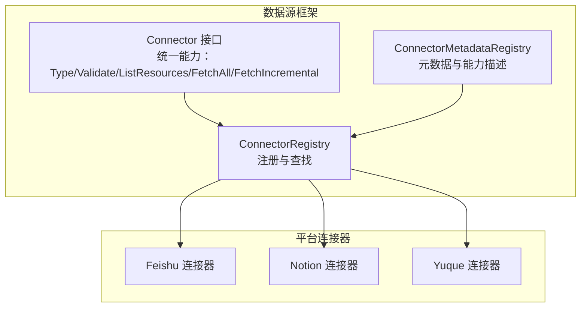
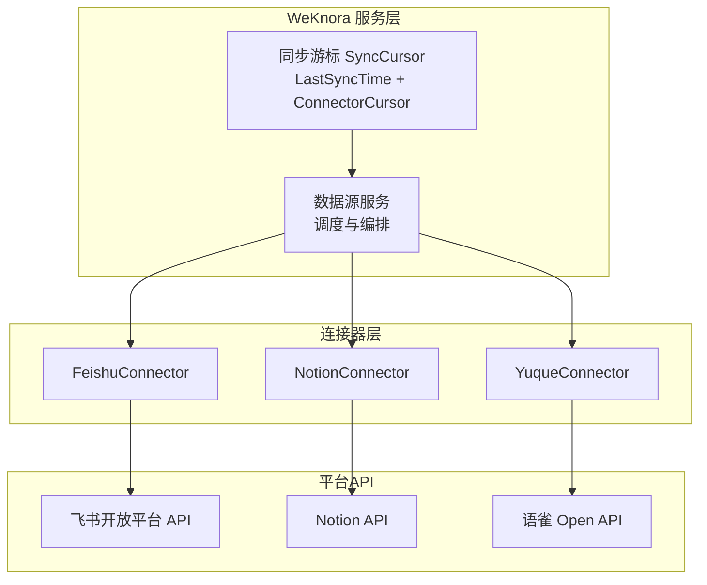
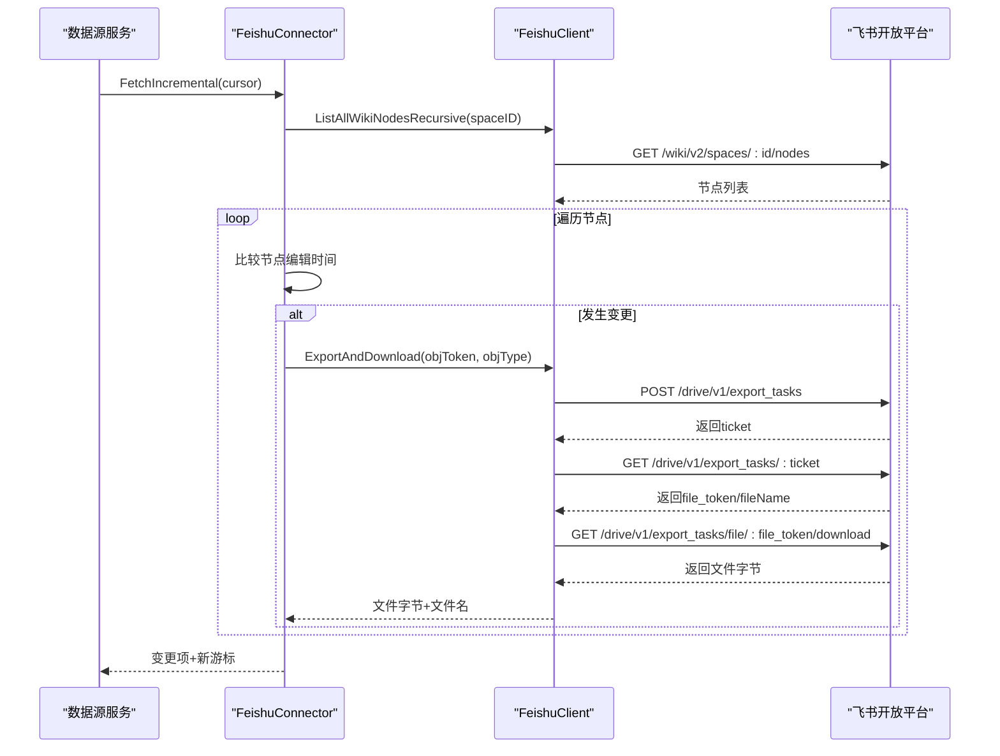
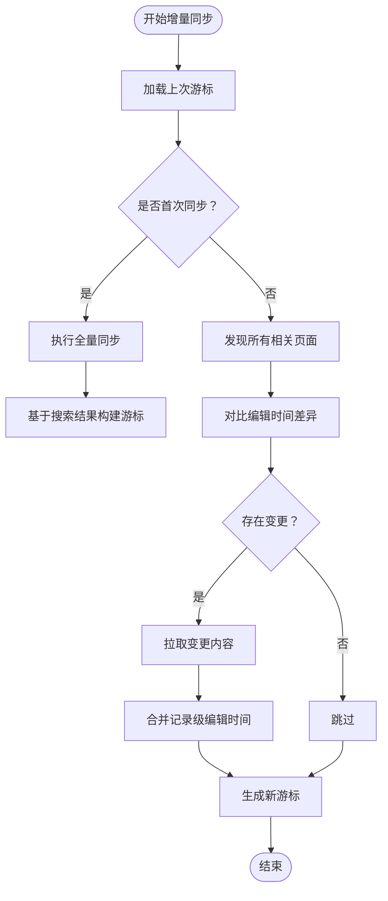
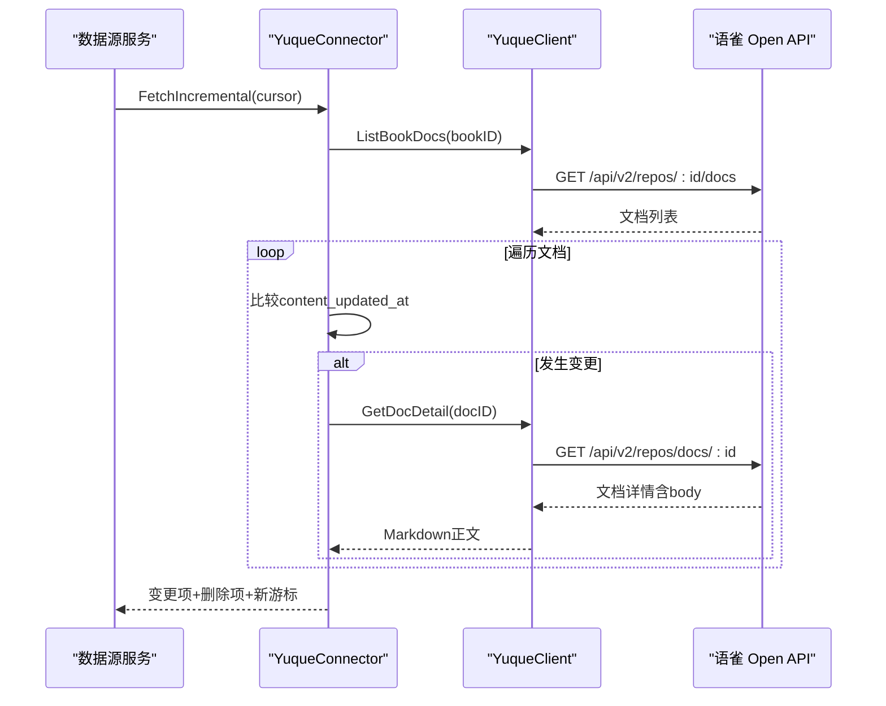
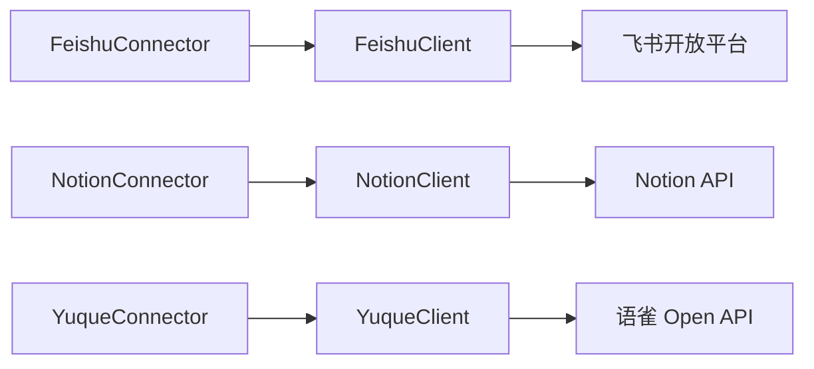

# 现有连接器实现

<cite>
**本文档引用的文件**
- [connector.go](file://internal/datasource/connector.go)
- [CONNECTOR_IMPLEMENTATION_GUIDE.md](file://internal/datasource/CONNECTOR_IMPLEMENTATION_GUIDE.md)
- [feishu/client.go](file://internal/datasource/connector/feishu/client.go)
- [feishu/connector.go](file://internal/datasource/connector/feishu/connector.go)
- [feishu/types.go](file://internal/datasource/connector/feishu/types.go)
- [notion/client.go](file://internal/datasource/connector/notion/client.go)
- [notion/connector.go](file://internal/datasource/connector/notion/connector.go)
- [notion/types.go](file://internal/datasource/connector/notion/types.go)
- [yuque/client.go](file://internal/datasource/connector/yuque/client.go)
- [yuque/connector.go](file://internal/datasource/connector/yuque/connector.go)
- [yuque/types.go](file://internal/datasource/connector/yuque/types.go)
</cite>

## 目录
1. [简介](#简介)
2. [项目结构](#项目结构)
3. [核心组件](#核心组件)
4. [架构总览](#架构总览)
5. [详细组件分析](#详细组件分析)
6. [依赖分析](#依赖分析)
7. [性能考虑](#性能考虑)
8. [故障排查指南](#故障排查指南)
9. [结论](#结论)
10. [附录](#附录)

## 简介
本文件面向WeKnora现有数据源连接器实现，重点覆盖飞书（Feishu）、Notion与语雀（Yuque）三大平台连接器。内容涵盖：
- 认证机制与API调用方式
- 数据获取策略与增量同步设计
- 平台特有数据结构转换与内容处理逻辑
- 连接器配置参数与使用示例
- 错误处理与异常情况处理机制
- 性能特性、限制条件与最佳实践

## 项目结构
WeKnora的数据源连接器遵循统一接口规范，通过注册表集中管理不同平台的连接器实现，并在服务层以统一方式调度。

**图表来源**
- [connector.go:11-31](file://internal/datasource/connector.go#L11-L31)
- [connector.go:34-73](file://internal/datasource/connector.go#L34-L73)
- [connector.go:86-185](file://internal/datasource/connector.go#L86-L185)

**章节来源**
- [connector.go:11-31](file://internal/datasource/connector.go#L11-L31)
- [connector.go:34-73](file://internal/datasource/connector.go#L34-L73)
- [connector.go:86-185](file://internal/datasource/connector.go#L86-L185)

## 核心组件
- Connector接口：定义所有外部数据源连接器必须实现的能力集合，包括类型标识、连通性验证、资源列举、全量同步与增量同步。
- ConnectorRegistry：负责连接器的注册、查找与列表输出，支持按类型检索具体实现。
- ConnectorMetadataRegistry：集中维护各连接器的元数据（名称、描述、认证方式、能力等），用于前端展示与排序。

关键能力与认证方式：
- 飞书：OAuth2（企业自建应用内获取tenant_access_token）
- Notion：API Key（内部集成令牌）
- 语雀：API Token（个人令牌）

**章节来源**
- [connector.go:11-31](file://internal/datasource/connector.go#L11-L31)
- [connector.go:34-73](file://internal/datasource/connector.go#L34-L73)
- [connector.go:86-185](file://internal/datasource/connector.go#L86-L185)

## 架构总览
下图展示了WeKnora数据源框架与三个平台连接器之间的交互关系，以及统一的增量同步状态管理。

**图表来源**
- [connector.go:11-31](file://internal/datasource/connector.go#L11-L31)
- [notion/connector.go:139-256](file://internal/datasource/connector/notion/connector.go#L139-L256)
- [yuque/connector.go:276-312](file://internal/datasource/connector/yuque/connector.go#L276-L312)
- [feishu/connector.go:115-227](file://internal/datasource/connector/feishu/connector.go#L115-L227)

## 详细组件分析

### 飞书（Feishu）连接器
- 认证机制
  - 使用企业自建应用模型，通过内部tenant_access_token进行鉴权。
  - 实现了token缓存与过期前刷新，避免频繁请求导致限流或延迟。
- API调用方式
  - 统一封装doRequest，自动注入Authorization头与日志记录。
  - 支持导出任务（Export Task）异步下载多种格式（docx/xlsx/pdf），以及直链下载用户上传文件。
- 数据获取策略
  - 资源枚举：列出Wiki空间，支持递归遍历节点树。
  - 文档内容：根据对象类型选择导出或直链下载；mindnote/slides跳过。
  - 文件名清洗：去除非法字符并按UTF-8边界截断，保证跨平台兼容。
- 增量同步
  - 使用节点编辑时间（优先obj_edit_time，回退node_edit_time）作为变更判断依据。
  - 通过游标记录每个空间下节点的最后编辑时间，检测新增、修改与删除。
- 错误处理
  - 对非2xx响应、解码失败、超时等场景进行分类处理与重试。
  - 导出任务轮询设置超时上限与固定轮询间隔，避免长时间占用。

**图表来源**
- [feishu/connector.go:115-227](file://internal/datasource/connector/feishu/connector.go#L115-L227)
- [feishu/client.go:298-411](file://internal/datasource/connector/feishu/client.go#L298-L411)

**章节来源**
- [feishu/client.go:16-95](file://internal/datasource/connector/feishu/client.go#L16-L95)
- [feishu/client.go:97-149](file://internal/datasource/connector/feishu/client.go#L97-L149)
- [feishu/client.go:159-228](file://internal/datasource/connector/feishu/client.go#L159-L228)
- [feishu/client.go:298-411](file://internal/datasource/connector/feishu/client.go#L298-L411)
- [feishu/connector.go:115-227](file://internal/datasource/connector/feishu/connector.go#L115-L227)
- [feishu/connector.go:229-310](file://internal/datasource/connector/feishu/connector.go#L229-L310)
- [feishu/types.go:198-206](file://internal/datasource/connector/feishu/types.go#L198-L206)

配置参数与使用示例
- 配置字段
  - app_id：飞书开发者后台的企业自建应用App ID
  - app_secret：对应密钥
  - base_url：可选，默认使用国内版开放平台地址，国际版可指定为larksuite域名
- 示例流程
  - 在“数据源”页面添加新连接器，选择“飞书”，填写上述参数后点击“验证”，随后选择要同步的Wiki空间，执行全量或增量同步。

**章节来源**
- [feishu/types.go:15-41](file://internal/datasource/connector/feishu/types.go#L15-L41)
- [feishu/connector.go:28-41](file://internal/datasource/connector/feishu/connector.go#L28-L41)

### Notion 连接器
- 认证机制
  - 使用内部集成令牌（API Key），通过调用/me端点进行连通性校验。
- API调用方式
  - 自定义速率限制器（约3 QPS，突发3），并针对429与5xx进行指数退避重试。
  - 支持分页查询与块树递归拉取，深度与每页块数均有限制，防止过度API调用。
- 数据获取策略
  - 资源枚举：通过搜索API获取页面与数据库（含data_source），构建父-子关系树。
  - 页面内容：解析块树为Markdown，处理富文本、公式、链接等元素；附件（除图片外）单独下载。
  - 数据库：将记录属性转为Markdown表格，必要时追加块级内容。
- 增量同步
  - 首次同步直接走全量路径，基于搜索结果构建游标。
  - 后续同步发现页面与记录的最后编辑时间变化，仅对变更项进行拉取。
  - 删除检测：若页面从可见变为不可达且不在排除集合中，则标记为删除。
- 错误处理
  - 明确区分凭据无效、资源不存在、速率限制与服务器错误，便于上层自动处理。

**图表来源**
- [notion/connector.go:139-256](file://internal/datasource/connector/notion/connector.go#L139-L256)

**章节来源**
- [notion/client.go:20-39](file://internal/datasource/connector/notion/client.go#L20-L39)
- [notion/client.go:55-148](file://internal/datasource/connector/notion/client.go#L55-L148)
- [notion/client.go:156-267](file://internal/datasource/connector/notion/client.go#L156-L267)
- [notion/connector.go:47-107](file://internal/datasource/connector/notion/connector.go#L47-L107)
- [notion/connector.go:139-256](file://internal/datasource/connector/notion/connector.go#L139-L256)
- [notion/types.go:247-253](file://internal/datasource/connector/notion/types.go#L247-L253)

配置参数与使用示例
- 配置字段
  - api_key：Notion内部集成令牌
  - base_url：可选，默认使用官方API地址
- 示例流程
  - 在“数据源”页面添加新连接器，选择“Notion”，填写令牌后点击“验证”，随后展开工作区树选择页面或数据库，执行全量或增量同步。

**章节来源**
- [notion/types.go:28-49](file://internal/datasource/connector/notion/types.go#L28-L49)
- [notion/connector.go:36-45](file://internal/datasource/connector/notion/connector.go#L36-L45)

### 语雀（Yuque）连接器
- 认证机制
  - 使用个人令牌（X-Auth-Token），通过获取当前用户信息进行连通性校验。
- API调用方式
  - 封装带重试的HTTP客户端，支持429与5xx的指数退避与固定延迟重试。
  - 提供用户组、仓库与文档列表的分页查询，过滤仅保留文档型知识库。
- 数据获取策略
  - 资源枚举：合并个人仓库与团队仓库，去重后按ID排序输出。
  - 文档内容：仅同步类型为Doc且状态为已发布的文档；对非Markdown格式进行跳过并记录原因。
  - 文件名清洗：去除非法字符并按UTF-8边界截断，避免跨平台不兼容。
- 增量同步
  - 以content_updated_at作为变更判断依据，记录每个知识库下的文档更新时间。
  - 删除检测：若某文档在上次游标存在但当前不存在，则发出删除占位项。
- 错误处理
  - 对401/403明确返回凭据无效，便于上层自动标记失效；对429解析Retry-After头进行等待。

**图表来源**
- [yuque/connector.go:276-312](file://internal/datasource/connector/yuque/connector.go#L276-L312)
- [yuque/client.go:264-297](file://internal/datasource/connector/yuque/client.go#L264-L297)

**章节来源**
- [yuque/client.go:23-41](file://internal/datasource/connector/yuque/client.go#L23-L41)
- [yuque/client.go:43-151](file://internal/datasource/connector/yuque/client.go#L43-L151)
- [yuque/client.go:181-297](file://internal/datasource/connector/yuque/client.go#L181-L297)
- [yuque/connector.go:43-108](file://internal/datasource/connector/yuque/connector.go#L43-L108)
- [yuque/connector.go:116-265](file://internal/datasource/connector/yuque/connector.go#L116-L265)
- [yuque/connector.go:276-312](file://internal/datasource/connector/yuque/connector.go#L276-L312)
- [yuque/types.go:205-210](file://internal/datasource/connector/yuque/types.go#L205-L210)

配置参数与使用示例
- 配置字段
  - api_token：语雀设置中的个人令牌
  - base_url：可选，默认使用公有云地址，企业私有化可指定公司域
- 示例流程
  - 在“数据源”页面添加新连接器，选择“语雀”，填写令牌后点击“验证”，随后选择知识库（Book），执行全量或增量同步。

**章节来源**
- [yuque/types.go:35-59](file://internal/datasource/connector/yuque/types.go#L35-L59)
- [yuque/connector.go:30-41](file://internal/datasource/connector/yuque/connector.go#L30-L41)

## 依赖分析
- 组件耦合
  - 连接器实现严格依赖统一接口与类型定义，降低与业务层耦合。
  - 各平台客户端封装了各自的API细节，保持连接器层的简洁。
- 外部依赖
  - 飞书：开放平台API（Wiki、导出任务、驱动下载）
  - Notion：官方API（搜索、页面、块、数据库、数据源查询）
  - 语雀：Open API（用户、组、仓库、文档）
- 潜在循环依赖
  - 当前实现未见循环依赖，连接器到客户端再到API的单向依赖清晰。

**图表来源**
- [feishu/connector.go:15-26](file://internal/datasource/connector/feishu/connector.go#L15-L26)
- [notion/connector.go:23-34](file://internal/datasource/connector/notion/connector.go#L23-L34)
- [yuque/connector.go:21-29](file://internal/datasource/connector/yuque/connector.go#L21-L29)

**章节来源**
- [feishu/connector.go:15-26](file://internal/datasource/connector/feishu/connector.go#L15-L26)
- [notion/connector.go:23-34](file://internal/datasource/connector/notion/connector.go#L23-L34)
- [yuque/connector.go:21-29](file://internal/datasource/connector/yuque/connector.go#L21-L29)

## 性能考虑
- 速率控制
  - Notion：内置速率限制器，约3 QPS，突发3，匹配实际API行为。
  - 语雀：对429与5xx采用指数退避与固定延迟重试，降低抖动影响。
- 分页与递归限制
  - Notion：限制块树递归深度与每页块数量，避免复杂页面导致的高开销。
  - 语雀：默认分页大小为100，减少往返次数。
- 缓存与复用
  - 飞书：tenant_access_token本地缓存并预留安全余量，避免频繁刷新。
- 下载限制
  - Notion：对文件下载设置最大体积限制，防止内存溢出。
- 增量优化
  - 三平台均通过游标记录变更时间，仅拉取变化内容，显著降低带宽与CPU消耗。

**章节来源**
- [notion/client.go:26-39](file://internal/datasource/connector/notion/client.go#L26-L39)
- [notion/client.go:269-270](file://internal/datasource/connector/notion/client.go#L269-L270)
- [notion/client.go:373-421](file://internal/datasource/connector/notion/client.go#L373-L421)
- [yuque/client.go:43-54](file://internal/datasource/connector/yuque/client.go#L43-L54)
- [yuque/client.go:117-126](file://internal/datasource/connector/yuque/client.go#L117-L126)
- [feishu/client.go:42-95](file://internal/datasource/connector/feishu/client.go#L42-L95)

## 故障排查指南
- 飞书
  - 常见问题：token过期、导出任务超时、下载失败。
  - 处理建议：检查应用权限与回调地址配置；确认导出任务轮询超时阈值；关注下载有效期窗口。
- Notion
  - 常见问题：429限流、服务器错误、凭据无效、块树过大。
  - 处理建议：调整同步频率与并发；检查API版本头；确保令牌有效；必要时减少单次同步范围。
- 语雀
  - 常见问题：401/403凭据无效、429限流、文档格式不受支持。
  - 处理建议：重新生成个人令牌；解析Retry-After头进行等待；仅同步Doc且状态为已发布的文档。

**章节来源**
- [feishu/client.go:138-149](file://internal/datasource/connector/feishu/client.go#L138-L149)
- [notion/client.go:105-147](file://internal/datasource/connector/notion/client.go#L105-L147)
- [yuque/client.go:105-141](file://internal/datasource/connector/yuque/client.go#L105-L141)

## 结论
WeKnora的现有连接器实现遵循统一接口与元数据规范，分别针对飞书、Notion与语雀的API特性设计了稳健的认证、调用与数据处理策略。通过增量同步与多级限流/重试机制，实现了在大规模文档场景下的稳定与高效。建议在生产环境中结合平台API限制与自身资源约束，合理配置同步周期与并发度，并持续监控游标一致性与错误率。

## 附录
- 新连接器开发指南
  - 参考步骤：创建包结构、定义平台类型、实现API客户端、实现连接器接口、注册到容器与元数据、编写测试与手动验证。
  - 关键要点：OAuth令牌刷新、分页与游标、增量变更检测、删除检测、错误分类与重试策略。

**章节来源**
- [CONNECTOR_IMPLEMENTATION_GUIDE.md:13-498](file://internal/datasource/CONNECTOR_IMPLEMENTATION_GUIDE.md#L13-L498)