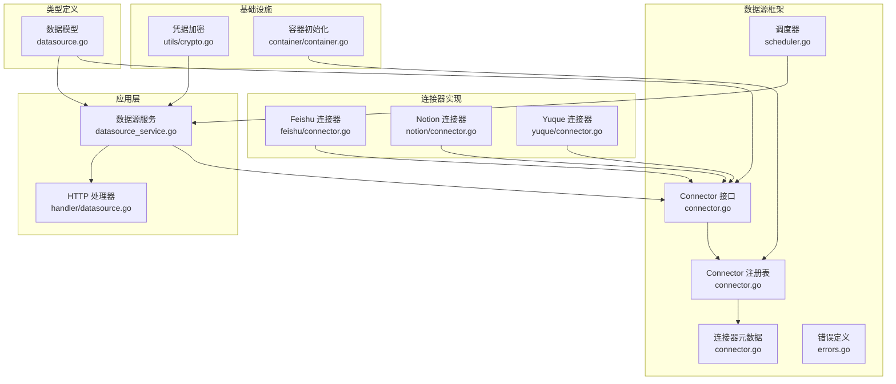
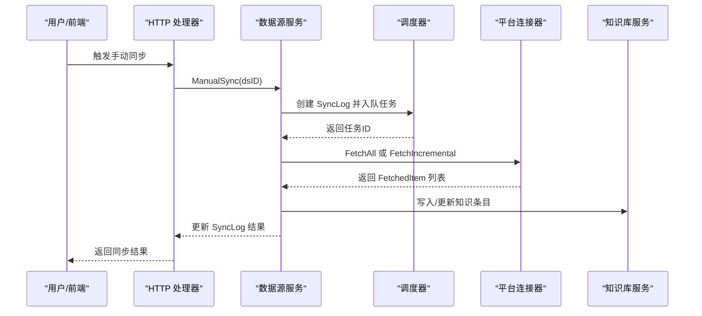
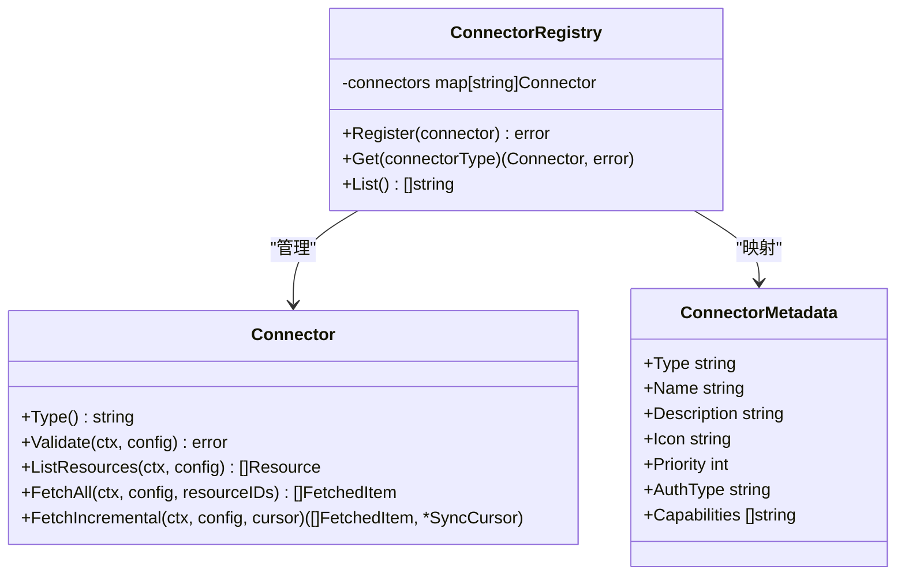
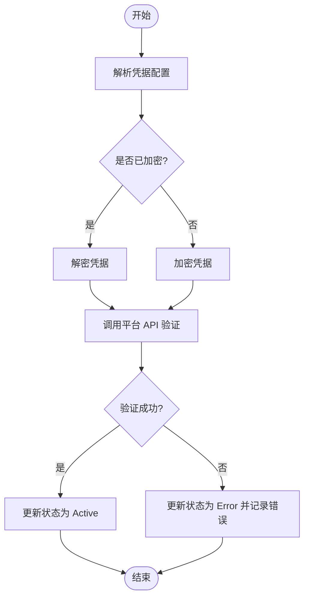
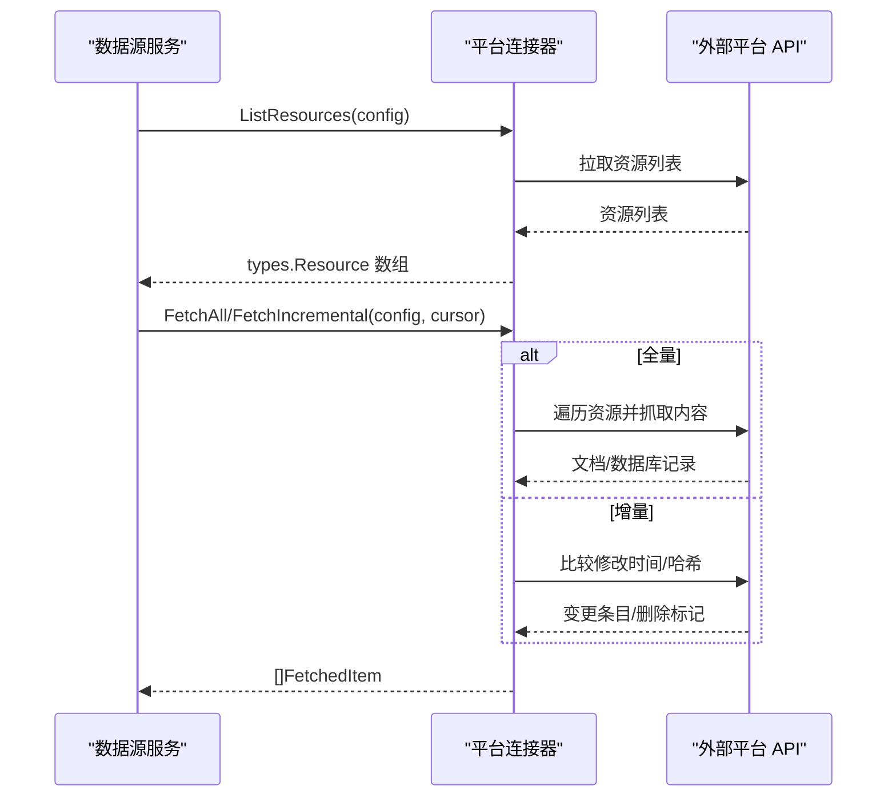
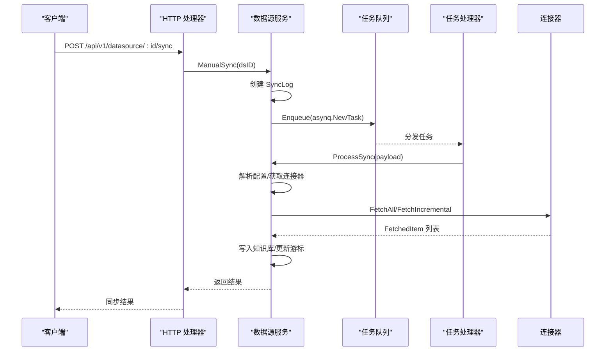
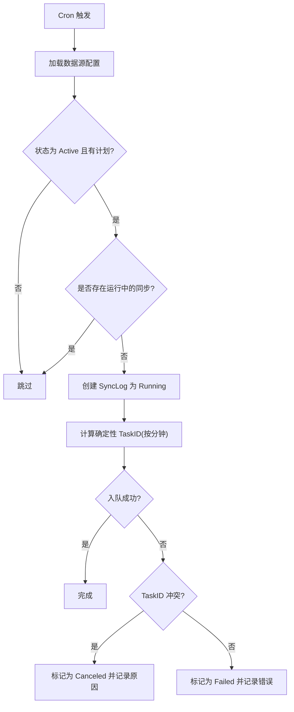
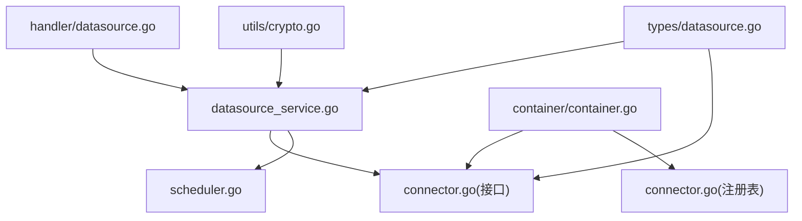

# 连接器开发指南

<cite>
**本文档引用的文件**
- [CONNECTOR_IMPLEMENTATION_GUIDE.md](file://internal/datasource/CONNECTOR_IMPLEMENTATION_GUIDE.md)
- [connector.go](file://internal/datasource/connector.go)
- [errors.go](file://internal/datasource/errors.go)
- [scheduler.go](file://internal/datasource/scheduler.go)
- [README.md](file://internal/datasource/README.md)
- [datasource.go](file://internal/types/datasource.go)
- [client.go](file://internal/datasource/connector/feishu/client.go)
- [connector.go](file://internal/datasource/connector/feishu/connector.go)
- [types.go](file://internal/datasource/connector/feishu/types.go)
- [connector.go](file://internal/datasource/connector/notion/connector.go)
- [connector.go](file://internal/datasource/connector/yuque/connector.go)
- [crypto.go](file://internal/utils/crypto.go)
- [datasource_service.go](file://internal/application/service/datasource_service.go)
- [datasource.go](file://internal/handler/datasource.go)
- [container.go](file://internal/container/container.go)
</cite>

## 目录
1. [简介](#简介)
2. [项目结构](#项目结构)
3. [核心组件](#核心组件)
4. [架构总览](#架构总览)
5. [详细组件分析](#详细组件分析)
6. [依赖关系分析](#依赖关系分析)
7. [性能考虑](#性能考虑)
8. [故障排除指南](#故障排除指南)
9. [结论](#结论)
10. [附录](#附录)

## 简介
本指南面向为 WeKnora 开发新数据源连接器（Connector）的工程师，提供从零开始的完整开发流程、接口实现规范、注册机制、认证与凭据加密、资源列表获取、全量与增量同步策略、错误处理最佳实践、测试与调试方法，以及性能优化与 API 限流应对策略。WeKnora 的数据源同步框架采用适配器模式，每个外部平台（如 Feishu、Notion、Yuque 等）通过实现统一的 Connector 接口接入，并由调度器驱动周期性或手动触发的同步任务。

## 项目结构
WeKnora 的连接器开发围绕以下关键模块展开：
- 数据源框架与接口定义：位于 internal/datasource，包含 Connector 接口、注册表、元数据、调度器等
- 类型定义：位于 internal/types，定义数据源配置、资源、抓取项、游标、同步结果等核心数据结构
- 连接器实现：位于 internal/datasource/connector/<platform>，以 Feishu、Notion、Yuque 为例
- 应用服务与处理器：位于 internal/application/service 与 internal/handler，负责业务编排、HTTP API、任务队列等
- 加密工具：位于 internal/utils，提供凭据加密/解密能力
- 容器初始化：位于 internal/container，负责依赖注入与连接器注册

**图表来源**
- [connector.go:9-31](file://internal/datasource/connector.go#L9-L31)
- [scheduler.go:18-52](file://internal/datasource/scheduler.go#L18-L52)
- [datasource.go:49-114](file://internal/types/datasource.go#L49-L114)
- [datasource_service.go:21-57](file://internal/application/service/datasource_service.go#L21-L57)
- [datasource.go:14-29](file://internal/handler/datasource.go#L14-L29)
- [crypto.go:14-25](file://internal/utils/crypto.go#L14-L25)
- [container.go:240-244](file://internal/container/container.go#L240-L244)

**章节来源**
- [README.md:1-261](file://internal/datasource/README.md#L1-L261)
- [connector.go:9-31](file://internal/datasource/connector.go#L9-L31)
- [datasource.go:11-47](file://internal/types/datasource.go#L11-L47)

## 核心组件
- Connector 接口：定义连接器类型标识、连接验证、资源列举、全量同步、增量同步等方法
- ConnectorRegistry：连接器注册与查找中心
- ConnectorMetadata：连接器元数据（名称、描述、认证方式、能力等）
- Scheduler：基于 cron 的周期性同步调度器
- DataSourceService：业务服务层，协调连接器执行、写入知识库、更新状态与日志
- HTTP Handler：对外暴露数据源管理与操作的 REST API
- 加密工具：AES-256-GCM 对凭据进行加密存储

**章节来源**
- [connector.go:9-31](file://internal/datasource/connector.go#L9-L31)
- [connector.go:33-74](file://internal/datasource/connector.go#L33-L74)
- [connector.go:75-84](file://internal/datasource/connector.go#L75-L84)
- [scheduler.go:18-52](file://internal/datasource/scheduler.go#L18-L52)
- [datasource_service.go:21-57](file://internal/application/service/datasource_service.go#L21-L57)
- [datasource.go:14-29](file://internal/handler/datasource.go#L14-L29)
- [crypto.go:14-25](file://internal/utils/crypto.go#L14-L25)

## 架构总览
WeKnora 的数据源同步采用“适配器 + 调度 + 任务队列”的分层架构：
- 适配器层：各平台连接器实现 Connector 接口
- 业务层：DataSourceService 解析配置、选择连接器、执行 FetchAll/FetchIncremental
- 调度层：Scheduler 将周期性任务入队，避免多实例重复执行
- 存储层：凭据加密存储于数据库，同步结果与日志持久化
- API 层：HTTP Handler 提供创建、验证、资源列举、手动同步、暂停/恢复、查询日志等接口

**图表来源**
- [datasource.go:366-396](file://internal/handler/datasource.go#L366-L396)
- [datasource_service.go:269-324](file://internal/application/service/datasource_service.go#L269-L324)
- [datasource_service.go:387-599](file://internal/application/service/datasource_service.go#L387-L599)
- [scheduler.go:132-203](file://internal/datasource/scheduler.go#L132-L203)

## 详细组件分析

### Connector 接口与注册机制
- 接口职责
  - Type：返回连接器类型标识（如 "feishu"）
  - Validate：校验配置与连通性
  - ListResources：列出可同步的资源（文档、空间、文件夹等）
  - FetchAll：全量同步指定资源下的所有条目
  - FetchIncremental：基于游标增量同步变更条目
- 注册方式
  - 在容器初始化时注册连接器实例
  - 通过 ConnectorRegistry.Register 统一管理
  - 在元数据表中登记连接器的显示名、认证方式、能力等

**图表来源**
- [connector.go:9-31](file://internal/datasource/connector.go#L9-L31)
- [connector.go:33-74](file://internal/datasource/connector.go#L33-L74)
- [connector.go:75-84](file://internal/datasource/connector.go#L75-L84)

**章节来源**
- [connector.go:9-31](file://internal/datasource/connector.go#L9-L31)
- [connector.go:33-74](file://internal/datasource/connector.go#L33-L74)
- [connector.go:86-208](file://internal/datasource/connector.go#L86-L208)
- [container.go:240-244](file://internal/container/container.go#L240-L244)

### 认证处理与凭据加密
- 凭据存储
  - DataSource.Config 字段采用 AES-256-GCM 加密存储
  - 加密前缀为 "enc:v1:"，密钥来自环境变量 SYSTEM_AES_KEY（32字节）
- 连接器验证
  - Validate 方法解析配置后，调用平台 API 进行连通性测试
  - 失败时更新数据源状态与错误信息
- 示例
  - Feishu：通过内部 tenant_access_token 接口验证
  - Notion：通过 API Key 调用 SearchPages/Ping
  - Yuque：通过当前用户接口验证

**图表来源**
- [crypto.go:14-25](file://internal/utils/crypto.go#L14-L25)
- [crypto.go:27-54](file://internal/utils/crypto.go#L27-L54)
- [crypto.go:56-89](file://internal/utils/crypto.go#L56-L89)
- [datasource_service.go:202-238](file://internal/application/service/datasource_service.go#L202-L238)

**章节来源**
- [crypto.go:14-25](file://internal/utils/crypto.go#L14-L25)
- [crypto.go:27-54](file://internal/utils/crypto.go#L27-L54)
- [crypto.go:56-89](file://internal/utils/crypto.go#L56-L89)
- [datasource_service.go:202-238](file://internal/application/service/datasource_service.go#L202-L238)
- [connector.go:28-41](file://internal/datasource/connector/feishu/connector.go#L28-L41)
- [connector.go:36-45](file://internal/datasource/connector/notion/connector.go#L36-L45)
- [connector.go:30-41](file://internal/datasource/connector/yuque/connector.go#L30-L41)

### 资源列表获取、全量同步与增量同步
- 资源列表（ListResources）
  - Feishu：列举 Wiki 空间作为可选资源
  - Notion：通过搜索 API 获取页面与数据库，构建父子关系树
  - Yuque：列举个人与团队仓库（书籍）
- 全量同步（FetchAll）
  - 遍历选定资源，递归抓取文档内容或数据库记录
  - 将内容转换为 FetchedItem，设置标题、内容、文件名、URL、时间戳与元数据
- 增量同步（FetchIncremental）
  - 基于上次游标（LastSyncCursor）比较修改时间或哈希
  - 发现变更条目与删除项（IsDeleted），生成新的游标用于下次同步

**图表来源**
- [connector.go:43-71](file://internal/datasource/connector/feishu/connector.go#L43-L71)
- [connector.go:73-113](file://internal/datasource/connector/feishu/connector.go#L73-L113)
- [connector.go:115-227](file://internal/datasource/connector/feishu/connector.go#L115-L227)
- [connector.go:47-107](file://internal/datasource/connector/notion/connector.go#L47-L107)
- [connector.go:109-137](file://internal/datasource/connector/notion/connector.go#L109-L137)
- [connector.go:139-256](file://internal/datasource/connector/notion/connector.go#L139-L256)
- [connector.go:43-108](file://internal/datasource/connector/yuque/connector.go#L43-L108)
- [connector.go:110-114](file://internal/datasource/connector/yuque/connector.go#L110-L114)
- [connector.go:116-265](file://internal/datasource/connector/yuque/connector.go#L116-L265)
- [connector.go:276-312](file://internal/datasource/connector/yuque/connector.go#L276-L312)

**章节来源**
- [connector.go:43-71](file://internal/datasource/connector/feishu/connector.go#L43-L71)
- [connector.go:73-113](file://internal/datasource/connector/feishu/connector.go#L73-L113)
- [connector.go:115-227](file://internal/datasource/connector/feishu/connector.go#L115-L227)
- [connector.go:47-107](file://internal/datasource/connector/notion/connector.go#L47-L107)
- [connector.go:109-137](file://internal/datasource/connector/notion/connector.go#L109-L137)
- [connector.go:139-256](file://internal/datasource/connector/notion/connector.go#L139-L256)
- [connector.go:43-108](file://internal/datasource/connector/yuque/connector.go#L43-L108)
- [connector.go:110-114](file://internal/datasource/connector/yuque/connector.go#L110-L114)
- [connector.go:116-265](file://internal/datasource/connector/yuque/connector.go#L116-L265)
- [connector.go:276-312](file://internal/datasource/connector/yuque/connector.go#L276-L312)

### HTTP API 与任务执行流程
- API 端点
  - 创建/查询/更新/删除数据源
  - 验证连接、列举可用资源、手动触发同步、暂停/恢复、查询日志
- 任务执行
  - 手动同步或定时触发后，服务层创建 SyncLog 并入队 asynq 任务
  - 任务处理器根据配置选择连接器，执行 FetchAll/FetchIncremental
  - 将结果写入知识库，更新游标与状态

**图表来源**
- [datasource.go:366-396](file://internal/handler/datasource.go#L366-L396)
- [datasource_service.go:269-324](file://internal/application/service/datasource_service.go#L269-L324)
- [datasource_service.go:387-599](file://internal/application/service/datasource_service.go#L387-L599)

**章节来源**
- [datasource.go:77-557](file://internal/handler/datasource.go#L77-L557)
- [datasource_service.go:269-324](file://internal/application/service/datasource_service.go#L269-L324)
- [datasource_service.go:387-599](file://internal/application/service/datasource_service.go#L387-L599)

### 调度器与去重机制
- 调度器基于 cron 表达式注册周期任务
- 两层去重保障
  - DB 层：检测上次同步是否仍在运行，若在则跳过本次
  - Redis 层：按分钟级确定性 TaskID，确保同一时刻只有一个实例入队
- 异常处理：入队失败或重复入队时记录取消/失败状态

**图表来源**
- [scheduler.go:111-130](file://internal/datasource/scheduler.go#L111-L130)
- [scheduler.go:140-203](file://internal/datasource/scheduler.go#L140-L203)

**章节来源**
- [scheduler.go:18-52](file://internal/datasource/scheduler.go#L18-L52)
- [scheduler.go:111-130](file://internal/datasource/scheduler.go#L111-L130)
- [scheduler.go:140-203](file://internal/datasource/scheduler.go#L140-L203)

### 错误处理与异常管理
- 连接器侧
  - Validate 失败时返回具体错误，服务层更新数据源状态与错误消息
  - FetchAll/FetchIncremental 中的单个条目失败以占位项形式记录，不中断整体流程
- 服务层
  - 解析配置失败、连接器不存在、任务入队失败等均记录到 SyncLog
  - 支持暂停状态的数据源在恢复时保持暂停状态
- 错误码
  - 定义了连接器、数据源、配置、同步、知识库、日志等各类错误

**章节来源**
- [datasource_service.go:202-238](file://internal/application/service/datasource_service.go#L202-L238)
- [datasource_service.go:417-479](file://internal/application/service/datasource_service.go#L417-L479)
- [errors.go:5-32](file://internal/datasource/errors.go#L5-L32)

### 测试方法与调试技巧
- 单元测试
  - 为连接器实现 Validate、ListResources、FetchAll、FetchIncremental 的单元测试
  - 使用内存/模拟客户端替代真实 API
- 集成测试
  - 使用真实平台账号与最小化测试资源（单个文档/空间）
  - 逐步验证：连接测试 → 资源列举 → 全量同步 → 增量同步
- 调试建议
  - 启用平台 API 日志（Feishu 客户端已内置请求/响应日志）
  - 关注 SyncLog 的错误字段与结果统计
  - 使用容器日志查看 asynq 任务执行情况

**章节来源**
- [CONNECTOR_IMPLEMENTATION_GUIDE.md:363-394](file://internal/datasource/CONNECTOR_IMPLEMENTATION_GUIDE.md#L363-L394)
- [client.go:97-149](file://internal/datasource/connector/feishu/client.go#L97-L149)

### 性能优化与 API 限制应对
- 并发与限流
  - 连接器内部实现应遵循平台速率限制，必要时引入退避策略
  - 对于支持分页的平台，合理设置分页大小与并发拉取
- 增量同步优先
  - 优先实现基于时间戳/哈希的增量同步，减少 API 调用
  - 游标设计要稳定，避免因 API 变更导致全量回滚
- 缓存与去重
  - 对于频繁访问的元数据（如用户、组织）建立本地缓存
  - 对重复内容进行去重（如 URL/文件内容一致）
- 存储与序列化
  - 使用紧凑的 JSON 结构存储游标与结果
  - 对大文件内容采用流式处理，避免一次性加载到内存

[本节为通用指导，无需特定文件引用]

## 依赖关系分析
连接器开发涉及的关键依赖与耦合关系如下：
- 连接器实现依赖 Connector 接口与 types 包中的数据结构
- 服务层依赖连接器注册表与调度器
- HTTP 处理器依赖服务层
- 加密工具独立于业务逻辑，仅在配置解析/存储阶段使用
- 容器初始化负责注册连接器与服务组件

**图表来源**
- [datasource_service.go:21-57](file://internal/application/service/datasource_service.go#L21-L57)
- [datasource.go:14-29](file://internal/handler/datasource.go#L14-L29)
- [crypto.go:14-25](file://internal/utils/crypto.go#L14-L25)
- [container.go:240-244](file://internal/container/container.go#L240-L244)
- [connector.go:33-74](file://internal/datasource/connector.go#L33-L74)
- [datasource.go:49-114](file://internal/types/datasource.go#L49-L114)

**章节来源**
- [datasource_service.go:21-57](file://internal/application/service/datasource_service.go#L21-L57)
- [datasource.go:14-29](file://internal/handler/datasource.go#L14-L29)
- [crypto.go:14-25](file://internal/utils/crypto.go#L14-L25)
- [container.go:240-244](file://internal/container/container.go#L240-L244)
- [connector.go:33-74](file://internal/datasource/connector.go#L33-L74)
- [datasource.go:49-114](file://internal/types/datasource.go#L49-L114)

## 性能考虑
- API 限流与退避：在连接器中实现指数退避与并发控制，避免触发平台限流
- 增量同步策略：优先使用时间戳/哈希对比，减少全量扫描
- 游标稳定性：游标结构应向前兼容，避免频繁全量回滚
- 内存与磁盘：大文件采用流式下载与解析，避免内存峰值
- 任务去重：利用调度器的去重机制，避免多实例重复执行

[本节为通用指导，无需特定文件引用]

## 故障排除指南
- 连接失败
  - 检查凭据是否正确、令牌是否过期、网络连通性
  - 查看 SyncLog 的错误信息与状态
- 同步未执行
  - 确认数据源状态为 Active，检查调度器是否正常启动
  - 查看 asynq 任务队列状态与日志
- 增量不同步
  - 检查游标是否正确保存与解析
  - 确认平台 API 是否支持增量参数或时间戳字段
- 删除检测异常
  - 确认连接器是否实现了删除检测逻辑
  - 检查 SyncDeletions 配置是否启用

**章节来源**
- [datasource_service.go:417-479](file://internal/application/service/datasource_service.go#L417-L479)
- [scheduler.go:140-203](file://internal/datasource/scheduler.go#L140-L203)
- [errors.go:5-32](file://internal/datasource/errors.go#L5-L32)

## 结论
WeKnora 的连接器开发遵循清晰的接口与分层架构，通过统一的 Connector 接口、完善的元数据与注册机制、严格的凭据加密与去重调度策略，能够高效、安全地对接多种外部平台。开发者只需按照指南完成目录结构、接口实现与注册，即可快速上线新的数据源连接器，并通过增量同步与性能优化策略降低平台 API 压力与成本。

## 附录
- 开发模板与步骤清单
  - 创建目录：internal/datasource/connector/<your_platform>/
  - 实现 types.go、client.go、connector.go
  - 在容器中注册连接器
  - 在元数据表中添加连接器信息
  - 编写单元测试与集成测试
  - 验证连接、资源列举、全量/增量同步
- 参考实现
  - Feishu：完整的 OAuth 令牌缓存、导出任务、递归节点遍历
  - Notion：复杂的父子关系树、数据库记录增量策略
  - Yuque：仓库与文档的过滤与增量检测

**章节来源**
- [CONNECTOR_IMPLEMENTATION_GUIDE.md:13-408](file://internal/datasource/CONNECTOR_IMPLEMENTATION_GUIDE.md#L13-L408)
- [connector.go:15-387](file://internal/datasource/connector/feishu/connector.go#L15-L387)
- [connector.go:23-800](file://internal/datasource/connector/notion/connector.go#L23-L800)
- [connector.go:21-313](file://internal/datasource/connector/yuque/connector.go#L21-L313)