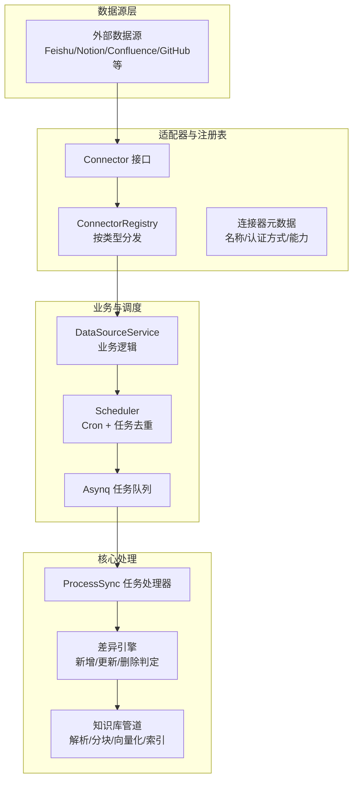
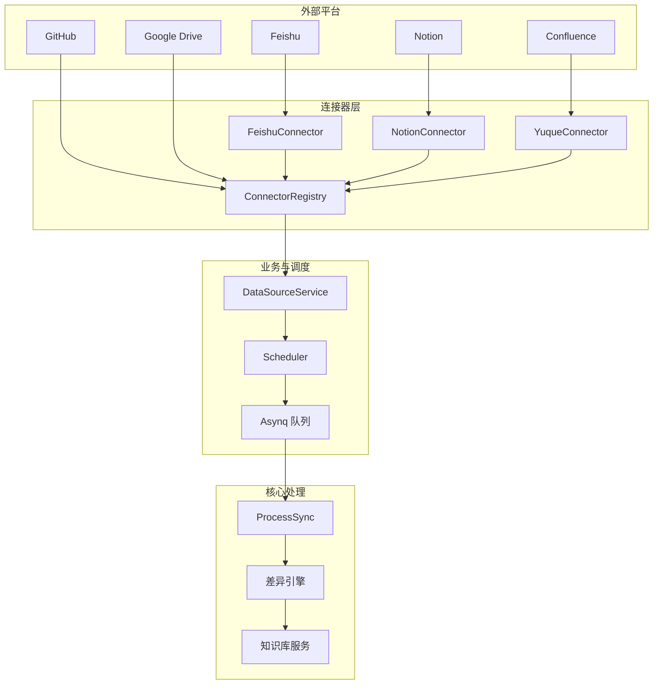
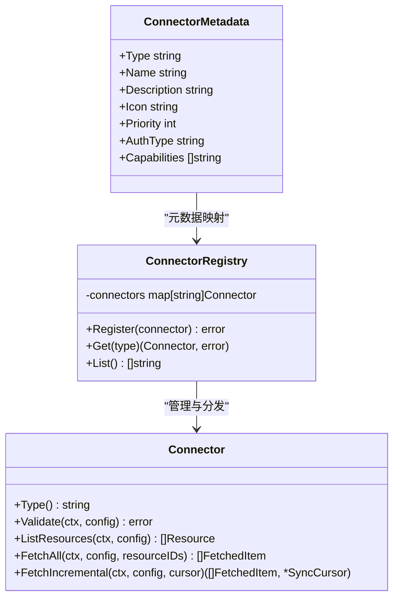
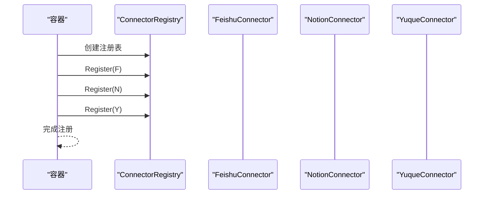
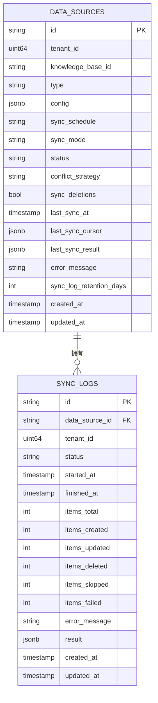
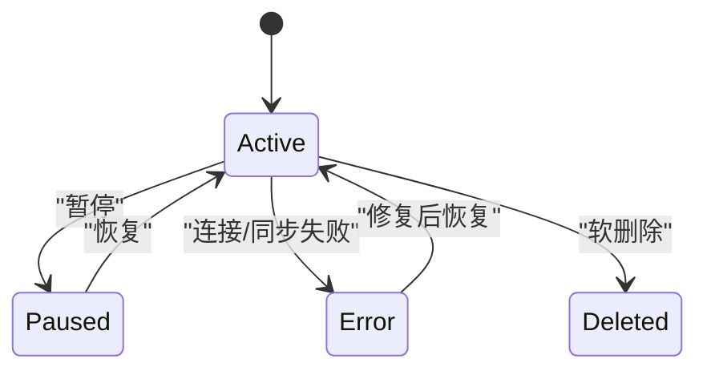

# 连接器架构设计

<cite>
**本文引用的文件**
- [connector.go](file://internal/datasource/connector.go)
- [CONNECTOR_IMPLEMENTATION_GUIDE.md](file://internal/datasource/CONNECTOR_IMPLEMENTATION_GUIDE.md)
- [datasource.go](file://internal/types/datasource.go)
- [scheduler.go](file://internal/datasource/scheduler.go)
- [errors.go](file://internal/datasource/errors.go)
- [README.md](file://internal/datasource/README.md)
- [container.go](file://internal/container/container.go)
- [数据源导入开发文档.md](file://docs/数据源导入开发文档.md)
</cite>

## 目录
1. [简介](#简介)
2. [项目结构](#项目结构)
3. [核心组件](#核心组件)
4. [架构总览](#架构总览)
5. [详细组件分析](#详细组件分析)
6. [依赖关系分析](#依赖关系分析)
7. [性能考量](#性能考量)
8. [故障排查指南](#故障排查指南)
9. [结论](#结论)
10. [附录](#附录)

## 简介
本文件系统性阐述 WeKnora 数据源连接器架构设计与实现规范，重点覆盖以下方面：
- 连接器接口设计原理与实现规范：Type、Validate、ListResources、FetchAll、FetchIncremental 的职责边界与契约
- 连接器注册机制与适配器模式应用：通过注册表统一管理与按类型分发
- 数据源配置模型（DataSource）与同步日志模型（SyncLog）的设计思路与字段含义
- 连接器生命周期管理与状态控制：从调度、任务队列到日志记录的全流程
- 实现指南与最佳实践：如何扩展新连接器并无缝集成到现有架构
- 以序列图、类图等形式可视化关键流程与结构

## 项目结构
WeKnora 的数据源同步框架采用“适配器 + 注册表 + 业务服务 + 任务队列”的分层设计：
- 接口与注册表：在 internal/datasource 中定义 Connector 接口与 ConnectorRegistry，并维护连接器元数据
- 类型与模型：在 internal/types 中定义 DataSource、SyncLog、Resource、FetchedItem、SyncCursor 等核心数据结构
- 业务与调度：在 internal/datasource 中实现调度器 Scheduler，负责基于 cron 的周期性触发与任务去重
- 容器与集成：在 internal/container 中初始化并注册各连接器实例，供上层服务调用
- 文档与指南：在 internal/datasource 与 docs 下提供实现指南与架构说明

图表来源
- [connector.go:9-31](file://internal/datasource/connector.go#L9-L31)
- [connector.go:33-73](file://internal/datasource/connector.go#L33-L73)
- [connector.go:87-185](file://internal/datasource/connector.go#L87-L185)
- [scheduler.go:18-52](file://internal/datasource/scheduler.go#L18-L52)
- [数据源导入开发文档.md:124-184](file://docs/数据源导入开发文档.md#L124-L184)

章节来源
- [README.md:1-261](file://internal/datasource/README.md#L1-L261)
- [数据源导入开发文档.md:124-184](file://docs/数据源导入开发文档.md#L124-L184)

## 核心组件
本节聚焦连接器接口、注册表、元数据、调度器与数据模型的关键设计点。

- Connector 接口
  - Type：返回连接器类型标识，用于注册表与业务层识别
  - Validate：校验配置连通性与凭据有效性
  - ListResources：枚举可同步资源（如文档、空间、文件夹）
  - FetchAll：全量拉取指定资源下的所有条目
  - FetchIncremental：增量拉取自上次游标以来变更的条目，并返回新的游标

- ConnectorRegistry
  - 提供 Register、Get、List 等能力，确保连接器按类型唯一注册与检索
  - 与错误常量配合，保证注册与查找过程的健壮性

- 连接器元数据（ConnectorMetadata）
  - 包含类型、名称、描述、图标、优先级、认证方式、能力列表等
  - 用于前端展示与排序，优先级越小显示越靠前

- 调度器（Scheduler）
  - 基于 cron 表达式周期触发同步任务
  - 两层去重：数据库层防止重叠运行；Redis/TaskID 层确保同一分钟仅一个实例入队
  - 触发时创建 SyncLog 并入队 asynq 任务，携带 Trace 上下文

- 数据模型
  - DataSource：封装数据源配置、状态、调度策略、冲突解决策略、增量游标等
  - SyncLog：记录每次同步的执行结果与统计信息
  - Resource/FetchedItem/SyncCursor：抽象外部资源、抓取项与增量游标
  - DataSourceConfig：解密后的明文配置载体

章节来源
- [connector.go:9-31](file://internal/datasource/connector.go#L9-L31)
- [connector.go:33-73](file://internal/datasource/connector.go#L33-L73)
- [connector.go:75-84](file://internal/datasource/connector.go#L75-L84)
- [connector.go:87-185](file://internal/datasource/connector.go#L87-L185)
- [scheduler.go:18-52](file://internal/datasource/scheduler.go#L18-L52)
- [datasource.go:49-114](file://internal/types/datasource.go#L49-L114)
- [datasource.go:129-183](file://internal/types/datasource.go#L129-L183)
- [datasource.go:196-286](file://internal/types/datasource.go#L196-L286)

## 架构总览
WeKnora 的数据源同步采用“适配器 + 注册表 + 业务服务 + 调度 + 任务队列 + 知识库管道”的端到端架构。外部平台通过各自 Connector 实现接入，经由注册表分发给业务服务，再由调度器触发异步任务，最终进入知识库处理流水线。

图表来源
- [数据源导入开发文档.md:124-184](file://docs/数据源导入开发文档.md#L124-L184)
- [connector.go:87-185](file://internal/datasource/connector.go#L87-L185)
- [container.go:1499-1513](file://internal/container/container.go#L1499-L1513)

## 详细组件分析

### 连接器接口与适配器模式
- 设计原则
  - 统一接口：所有外部平台均实现 Connector 接口，屏蔽平台差异
  - 明确职责：Validate/LR/FA/FI 四个方法分别对应“连通性校验、资源枚举、全量拉取、增量拉取”
  - 可扩展：通过注册表动态注册新连接器，无需修改上层调用代码
- 实现要点
  - Type 返回值必须与类型常量一致，避免运行时匹配失败
  - Validate 应覆盖网络连通、鉴权令牌有效性、最小权限校验
  - ListResources 返回用户可选择的资源树或列表，支持层级与过滤
  - FetchAll/FetchIncremental 返回标准化的 FetchedItem 列表，包含标题、内容、URL、时间戳、元数据等

图表来源
- [connector.go:9-31](file://internal/datasource/connector.go#L9-L31)
- [connector.go:33-73](file://internal/datasource/connector.go#L33-L73)
- [connector.go:75-84](file://internal/datasource/connector.go#L75-L84)

章节来源
- [connector.go:9-31](file://internal/datasource/connector.go#L9-L31)
- [connector.go:33-73](file://internal/datasource/connector.go#L33-L73)
- [connector.go:75-84](file://internal/datasource/connector.go#L75-L84)

### 连接器注册机制与容器集成
- 注册表
  - 通过 Register 将具体连接器实例按类型注册，Get 按类型获取，List 获取已注册类型集合
  - 注册时进行空值与类型名校验，避免无效注册
- 容器初始化
  - 在容器启动阶段创建注册表并逐一注册各连接器实例
  - 便于上层服务通过依赖注入获取注册表或直接获取指定类型的连接器

图表来源
- [container.go:1499-1513](file://internal/container/container.go#L1499-L1513)
- [connector.go:45-55](file://internal/datasource/connector.go#L45-L55)

章节来源
- [container.go:1499-1513](file://internal/container/container.go#L1499-L1513)
- [connector.go:45-55](file://internal/datasource/connector.go#L45-L55)

### 数据源配置模型与同步日志模型
- DataSource
  - 字段覆盖：ID、租户ID、目标知识库ID、类型、加密配置、同步计划、同步模式、状态、冲突策略、是否同步删除、最近一次成功同步时间、增量游标、最近一次结果、错误信息、日志保留天数等
  - 关键点：配置字段采用加密存储；增量游标用于 FetchIncremental；状态机驱动调度与业务逻辑
- SyncLog
  - 字段覆盖：关联数据源、租户ID、状态、开始/结束时间、总数、新增/更新/删除/跳过/失败计数、错误详情、结果明细等
  - 关键点：每轮同步创建一条日志记录，便于审计与回溯
- Resource/FetchedItem/SyncCursor
  - Resource：外部系统中的可同步对象，包含外部ID、名称、类型、URL、修改时间等
  - FetchedItem：抓取后的标准内容单元，包含外部ID、标题、内容字节、MIME类型、文件名、URL、更新时间、元数据、删除标记、来源资源ID等
  - SyncCursor：增量同步游标，包含最后同步时间、平台特定游标、schema 哈希等

图表来源
- [datasource.go:49-114](file://internal/types/datasource.go#L49-L114)
- [datasource.go:129-183](file://internal/types/datasource.go#L129-L183)

章节来源
- [datasource.go:49-114](file://internal/types/datasource.go#L49-L114)
- [datasource.go:129-183](file://internal/types/datasource.go#L129-L183)
- [datasource.go:196-286](file://internal/types/datasource.go#L196-L286)

### 生命周期管理与状态控制
- 调度与去重
  - Scheduler 基于 cron 表达式加载活跃数据源并注册定时任务
  - 两层去重：数据库层检查是否存在正在运行的同步；Redis/TaskID 层确保同一分钟仅一个任务入队
- 日志与追踪
  - 触发同步前创建 SyncLog 并标记为 running
  - 任务完成后根据结果更新状态（success/partial/failed/canceled），并记录统计与错误信息
  - 任务负载中注入链路追踪上下文，便于跨服务追踪
- 状态机与异常处理
  - 数据源状态：active/paused/error/deleted
  - 同步日志状态：running/success/partial/failed/canceled
  - 错误分类：连接失败、凭据无效、资源不存在、同步失败等，均有明确错误常量

图表来源
- [datasource.go:31-47](file://internal/types/datasource.go#L31-L47)
- [scheduler.go:140-203](file://internal/datasource/scheduler.go#L140-L203)

章节来源
- [scheduler.go:18-52](file://internal/datasource/scheduler.go#L18-L52)
- [scheduler.go:140-203](file://internal/datasource/scheduler.go#L140-L203)
- [datasource.go:31-47](file://internal/types/datasource.go#L31-L47)

### 实现指南与最佳实践
- 新增连接器步骤
  - 创建包结构：client.go（平台 API 客户端）、connector.go（实现 Connector 接口）、types.go（平台特有数据结构）
  - 实现 Validate：测试连通性与凭据有效性
  - 实现 ListResources：返回可选资源列表
  - 实现 FetchAll：全量抓取指定资源
  - 实现 FetchIncremental：基于游标增量抓取并返回新游标
  - 注册到容器：在容器初始化阶段注册连接器实例
  - 增加类型常量与元数据：在类型常量与元数据注册表中补充新类型
- 最佳实践
  - 凭证安全：使用加密存储，避免明文泄露
  - 错误处理：区分网络错误、鉴权错误、资源不存在等，返回可读性强的错误信息
  - 游标设计：增量同步需稳定且幂等，必要时引入 schema 哈希检测结构变化
  - 性能优化：合理分页、并发抓取、批量入库、缓存热点资源信息
  - 可观测性：记录 SyncLog，注入链路追踪，提供健康检查与告警

章节来源
- [CONNECTOR_IMPLEMENTATION_GUIDE.md:1-498](file://internal/datasource/CONNECTOR_IMPLEMENTATION_GUIDE.md#L1-L498)
- [connector.go:45-55](file://internal/datasource/connector.go#L45-L55)
- [datasource.go:196-286](file://internal/types/datasource.go#L196-L286)

## 依赖关系分析
- 组件耦合
  - ConnectorRegistry 与 Connector：低耦合高内聚，通过接口隔离平台差异
  - Scheduler 与 DataSourceService：通过任务队列解耦，支持水平扩展
  - 数据模型与仓库层：通过接口契约解耦，便于替换存储实现
- 外部依赖
  - Asynq：异步任务队列，支持 Redis/Lite 模式
  - Cron：定时调度，支持秒级精度
  - 数据库：MySQL/PostgreSQL，提供事务与索引支撑

图表来源
- [connector.go:9-31](file://internal/datasource/connector.go#L9-L31)
- [scheduler.go:18-52](file://internal/datasource/scheduler.go#L18-L52)
- [数据源导入开发文档.md:124-184](file://docs/数据源导入开发文档.md#L124-L184)

章节来源
- [connector.go:9-31](file://internal/datasource/connector.go#L9-L31)
- [scheduler.go:18-52](file://internal/datasource/scheduler.go#L18-L52)

## 性能考量
- 增量同步优先：默认采用增量模式，减少 API 调用与带宽消耗
- 任务去重与并发：通过 TaskID 与运行中状态双重去重，避免重复工作
- 分页与批处理：在连接器实现中采用分页与批量抓取，降低单次请求压力
- 存储与索引：入库后进行解析、分块、向量化与索引，提升检索效率
- 超时与重试：为外部 API 调用设置合理超时与指数退避策略

## 故障排查指南
- 常见错误与定位
  - 连接器未注册：检查注册表是否包含该类型，确认 Type 返回值与类型常量一致
  - 凭据无效：Validate 返回错误，检查凭据格式与有效期
  - 资源不存在：ListResources 或 FetchAll 返回资源缺失，核对资源ID与权限范围
  - 同步失败：查看 SyncLog 的错误详情与统计，定位失败原因
- 日志与追踪
  - 查看 SyncLog 的 StartedAt/FinishedAt、ItemsXXX 计数与 ErrorMessage
  - 在任务负载中注入的追踪上下文中定位调用链
- 错误常量参考
  - 连接器相关：nil、类型为空、未找到
  - 数据源相关：未找到、配置无效、非激活
  - 同步相关：失败、取消、抓取失败、资源不存在
  - 知识库相关：知识库未找到
  - 日志相关：日志未找到

章节来源
- [errors.go:6-32](file://internal/datasource/errors.go#L6-L32)
- [scheduler.go:155-203](file://internal/datasource/scheduler.go#L155-L203)

## 结论
WeKnora 的连接器架构以“适配器 + 注册表 + 业务服务 + 调度 + 任务队列”为核心，实现了对多平台数据源的统一接入与高效同步。通过标准化的 Connector 接口、完善的元数据与错误体系、严格的生命周期与状态控制，以及可扩展的实现指南，开发者可以快速、安全地扩展新的连接器类型并融入整体架构。建议在实现过程中重点关注凭证安全、增量游标稳定性、可观测性与性能优化，以保障生产环境的可靠性与可维护性。

## 附录
- 关键流程时序：手动触发或定时触发 → 调度器入队 → 任务处理器执行 → 连接器抓取 → 差异引擎判定 → 知识库入库
- 扩展清单：新增连接器类型常量、实现 Connector 接口、注册到容器、完善元数据、编写测试与文档