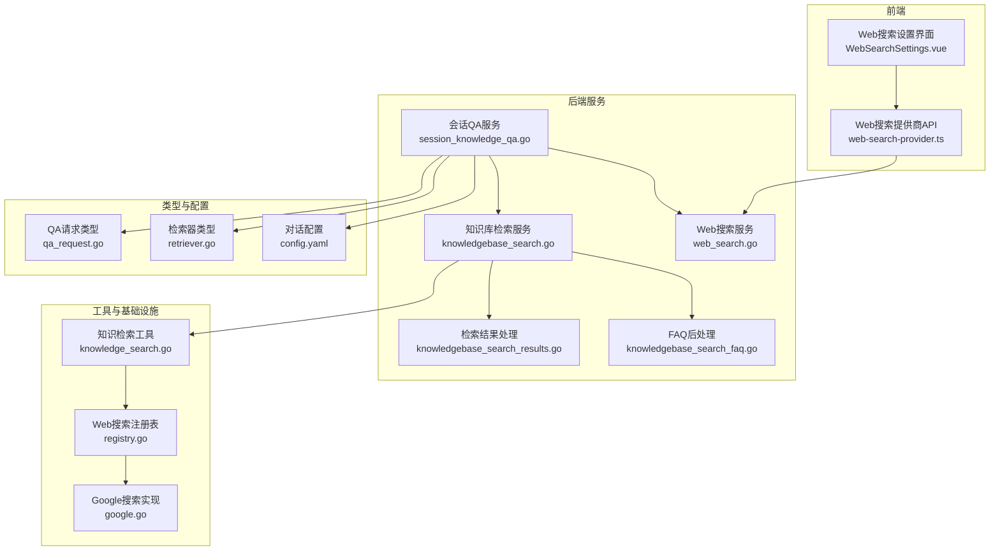
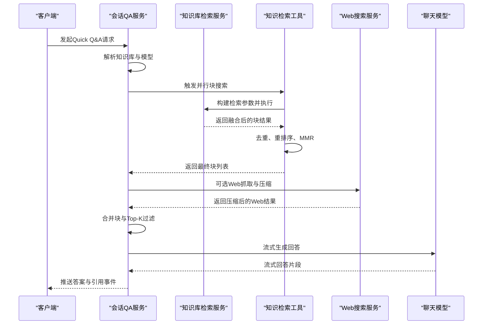
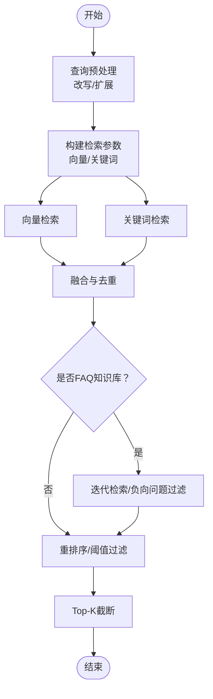
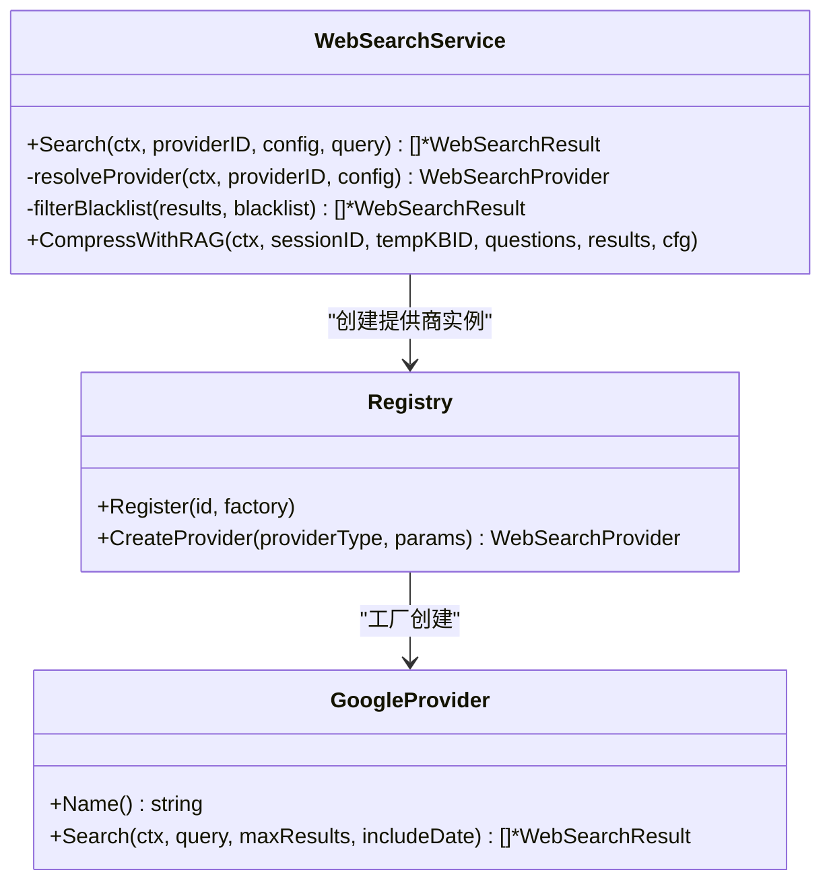
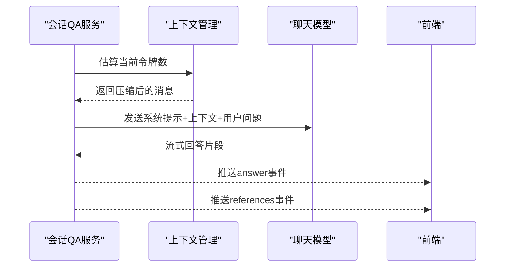
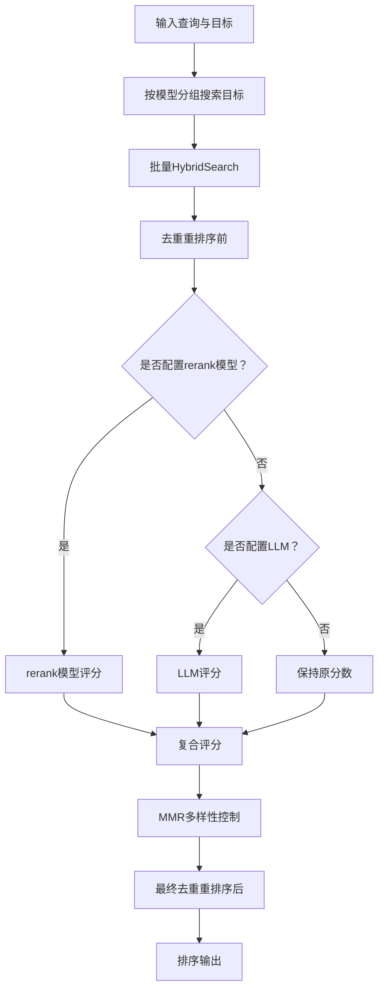
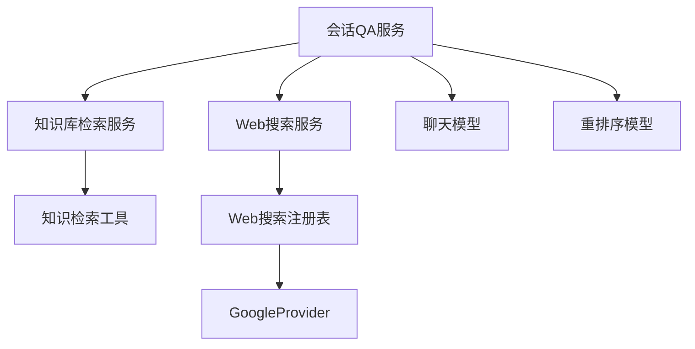

# Quick Q&A模式

<cite>
**本文档引用的文件**
- [knowledgebase_search.go](file://internal/application/service/knowledgebase_search.go)
- [knowledgebase_search_results.go](file://internal/application/service/knowledgebase_search_results.go)
- [knowledgebase_search_faq.go](file://internal/application/service/knowledgebase_search_faq.go)
- [session_knowledge_qa.go](file://internal/application/service/session_knowledge_qa.go)
- [knowledge_search.go](file://internal/agent/tools/knowledge_search.go)
- [web_search.go](file://internal/application/service/web_search.go)
- [google.go](file://internal/infrastructure/web_search/google.go)
- [registry.go](file://internal/infrastructure/web_search/registry.go)
- [qa_request.go](file://internal/types/qa_request.go)
- [retriever.go](file://internal/types/retriever.go)
- [config.yaml](file://config/config.yaml)
- [web-search-provider.ts](file://frontend/src/api/web-search-provider.ts)
- [WebSearchSettings.vue](file://frontend/src/views/settings/WebSearchSettings.vue)
- [qaqueue.go](file://internal/im/qaqueue.go)
- [service.go](file://internal/im/service.go)
- [chat.go](file://internal/types/chat.go)
</cite>

## 目录
1. [简介](#简介)
2. [项目结构](#项目结构)
3. [核心组件](#核心组件)
4. [架构总览](#架构总览)
5. [详细组件分析](#详细组件分析)
6. [依赖关系分析](#依赖关系分析)
7. [性能考虑](#性能考虑)
8. [故障排除指南](#故障排除指南)
9. [结论](#结论)
10. [附录](#附录)

## 简介
Quick Q&A模式是WeKnora提供的面向快速问答的RAG（检索增强生成）工作流，旨在通过混合检索（向量与关键词）、多来源融合与重排序、以及可选的Web搜索集成，为用户提供准确、高效的知识问答体验。该模式支持：
- 查询预处理与改写
- 向量相似度计算与关键词匹配
- 结果去重、融合与重排序
- Web搜索结果聚合与压缩
- 上下文窗口管理与提示词优化
- 输出格式化与引用展示

## 项目结构
Quick Q&A模式涉及后端服务层、工具层、基础设施层与前端配置界面，核心文件分布如下：
- 服务层：知识库检索、Web搜索、会话QA编排
- 工具层：知识检索工具（并发检索、去重、重排序、MMR）
- 基础设施层：Web搜索提供商注册与实现
- 类型定义：检索参数、检索器类型、QA请求等
- 配置：全局对话配置、前端Web搜索设置

**图表来源**
- [session_knowledge_qa.go:18-224](file://internal/application/service/session_knowledge_qa.go#L18-L224)
- [knowledgebase_search.go:76-168](file://internal/application/service/knowledgebase_search.go#L76-L168)
- [knowledge_search.go:161-429](file://internal/agent/tools/knowledge_search.go#L161-L429)
- [web_search.go:46-83](file://internal/application/service/web_search.go#L46-L83)
- [registry.go:11-45](file://internal/infrastructure/web_search/registry.go#L11-L45)
- [google.go:16-95](file://internal/infrastructure/web_search/google.go#L16-L95)
- [qa_request.go:3-22](file://internal/types/qa_request.go#L3-L22)
- [retriever.go:1-38](file://internal/types/retriever.go#L1-L38)
- [config.yaml:9-39](file://config/config.yaml#L9-L39)

**章节来源**
- [session_knowledge_qa.go:18-224](file://internal/application/service/session_knowledge_qa.go#L18-L224)
- [knowledgebase_search.go:76-168](file://internal/application/service/knowledgebase_search.go#L76-L168)
- [knowledge_search.go:161-429](file://internal/agent/tools/knowledge_search.go#L161-L429)
- [web_search.go:46-83](file://internal/application/service/web_search.go#L46-L83)
- [registry.go:11-45](file://internal/infrastructure/web_search/registry.go#L11-L45)
- [google.go:16-95](file://internal/infrastructure/web_search/google.go#L16-L95)
- [qa_request.go:3-22](file://internal/types/qa_request.go#L3-L22)
- [retriever.go:1-38](file://internal/types/retriever.go#L1-L38)
- [config.yaml:9-39](file://config/config.yaml#L9-L39)

## 核心组件
- 会话QA服务：负责组装RAG流水线、解析请求、选择模型与检索范围，并触发事件驱动的处理阶段。
- 知识库检索服务：构建检索参数、执行向量与关键词检索、结果融合与去重、FAQ专用后处理。
- 知识检索工具：并发执行跨KB检索、结果去重、重排序（基于rerank模型或LLM）、MMR多样性控制。
- Web搜索服务：按提供商实体动态创建搜索实例、超时控制、黑名单过滤、RAG压缩。
- 检索器类型与参数：统一的检索器类型枚举与检索参数结构，支持向量、关键词与Web搜索。
- 配置与前端设置：全局对话配置、Web搜索提供商配置与测试。

**章节来源**
- [session_knowledge_qa.go:18-224](file://internal/application/service/session_knowledge_qa.go#L18-L224)
- [knowledgebase_search.go:76-168](file://internal/application/service/knowledgebase_search.go#L76-L168)
- [knowledge_search.go:161-429](file://internal/agent/tools/knowledge_search.go#L161-L429)
- [web_search.go:46-83](file://internal/application/service/web_search.go#L46-L83)
- [retriever.go:1-38](file://internal/types/retriever.go#L1-L38)
- [config.yaml:9-39](file://config/config.yaml#L9-L39)

## 架构总览
Quick Q&A模式采用事件驱动的流水线架构，主要阶段包括：
- 加载历史与改写查询
- 并行块搜索（向量/关键词）
- 块重排序（rerank/LLM评分）
- 可选Web抓取与压缩
- 块合并与Top-K过滤
- 数据分析与消息注入
- 流式聊天完成
- 引用事件发射

**图表来源**
- [session_knowledge_qa.go:172-186](file://internal/application/service/session_knowledge_qa.go#L172-L186)
- [knowledge_search.go:455-627](file://internal/agent/tools/knowledge_search.go#L455-L627)
- [web_search.go:46-83](file://internal/application/service/web_search.go#L46-L83)

**章节来源**
- [session_knowledge_qa.go:172-186](file://internal/application/service/session_knowledge_qa.go#L172-L186)
- [knowledge_search.go:455-627](file://internal/agent/tools/knowledge_search.go#L455-L627)
- [web_search.go:46-83](file://internal/application/service/web_search.go#L46-L83)

## 详细组件分析

### 文档检索流程（向量+关键词+融合+重排序）
- 查询预处理：根据会话与代理配置决定是否启用改写、查询扩展与重写提示模板。
- 向量检索：按知识库嵌入模型生成查询向量，支持跨租户共享KB的模型解析。
- 关键词检索：对启用关键词索引的知识库执行关键词匹配。
- 结果融合：对向量与关键词结果进行去重与融合，确保跨来源一致性。
- FAQ后处理：针对FAQ知识库采用迭代检索或负向问题过滤，提升命中质量。
- Top-K截断：按MatchCount限制最终返回数量。

**图表来源**
- [knowledgebase_search.go:170-267](file://internal/application/service/knowledgebase_search.go#L170-L267)
- [knowledgebase_search_results.go:13-91](file://internal/application/service/knowledgebase_search_results.go#L13-L91)
- [knowledgebase_search_faq.go:13-48](file://internal/application/service/knowledgebase_search_faq.go#L13-L48)

**章节来源**
- [knowledgebase_search.go:170-267](file://internal/application/service/knowledgebase_search.go#L170-L267)
- [knowledgebase_search_results.go:13-91](file://internal/application/service/knowledgebase_search_results.go#L13-L91)
- [knowledgebase_search_faq.go:13-48](file://internal/application/service/knowledgebase_search_faq.go#L13-L48)

### Web搜索集成机制
- 提供商注册与动态创建：通过注册表按提供商类型创建实例，支持代理与租户参数覆盖。
- 搜索执行：设置超时、执行搜索、应用黑名单过滤。
- RAG压缩：将Web结果注入临时知识库，基于问题检索引用片段，按URL轮询选择并合并回原始结果。

**图表来源**
- [web_search.go:46-140](file://internal/application/service/web_search.go#L46-L140)
- [registry.go:11-45](file://internal/infrastructure/web_search/registry.go#L11-L45)
- [google.go:16-95](file://internal/infrastructure/web_search/google.go#L16-L95)

**章节来源**
- [web_search.go:46-140](file://internal/application/service/web_search.go#L46-L140)
- [registry.go:11-45](file://internal/infrastructure/web_search/registry.go#L11-L45)
- [google.go:16-95](file://internal/infrastructure/web_search/google.go#L16-L95)

### 响应生成与上下文管理
- 会话QA服务：根据是否有知识库或Web搜索决定流水线阶段；在纯聊天路径中直接注入附件内容，在RAG路径中通过INTO_CHAT_MESSAGE阶段注入检索上下文。
- 上下文窗口管理：估算当前令牌数，超过阈值时压缩历史消息，保留系统提示、当前轮次与工具调用配对。
- 提示词优化：通过模板ID加载系统提示与上下文模板，支持温度、最大生成Token等参数。
- 输出格式化：流式推送答案与引用事件，前端据此渲染。

**图表来源**
- [session_knowledge_qa.go:166-186](file://internal/application/service/session_knowledge_qa.go#L166-L186)
- [session_knowledge_qa.go:522-575](file://internal/application/service/session_knowledge_qa.go#L522-L575)
- [chat.go:28-75](file://internal/types/chat.go#L28-L75)

**章节来源**
- [session_knowledge_qa.go:166-186](file://internal/application/service/session_knowledge_qa.go#L166-L186)
- [session_knowledge_qa.go:522-575](file://internal/application/service/session_knowledge_qa.go#L522-L575)
- [chat.go:28-75](file://internal/types/chat.go#L28-L75)

### 知识检索工具（并发、去重、重排序、MMR）
- 并发搜索：按嵌入模型分组目标知识库，批量执行HybridSearch，减少重复嵌入计算。
- 去重：在重排序前与重排序后分别执行去重，避免重复块影响质量。
- 重排序：优先使用rerank模型，失败则回退至LLM评分；FAQ结果保持原分数。
- MMR：在重排序后应用最大边际相关性，平衡相关性与多样性。

**图表来源**
- [knowledge_search.go:455-627](file://internal/agent/tools/knowledge_search.go#L455-L627)
- [knowledge_search.go:629-713](file://internal/agent/tools/knowledge_search.go#L629-L713)
- [knowledge_search.go:747-800](file://internal/agent/tools/knowledge_search.go#L747-L800)

**章节来源**
- [knowledge_search.go:455-627](file://internal/agent/tools/knowledge_search.go#L455-L627)
- [knowledge_search.go:629-713](file://internal/agent/tools/knowledge_search.go#L629-L713)
- [knowledge_search.go:747-800](file://internal/agent/tools/knowledge_search.go#L747-L800)

## 依赖关系分析
- 组件耦合：会话QA服务依赖知识库检索服务与Web搜索服务；知识检索工具依赖知识库服务与rerank/LLM模型；Web搜索服务依赖注册表与提供商仓库。
- 外部依赖：Google Custom Search API、嵌入模型、重排序模型、聊天模型。
- 循环依赖：通过接口与事件总线避免循环依赖。

**图表来源**
- [session_knowledge_qa.go:18-224](file://internal/application/service/session_knowledge_qa.go#L18-L224)
- [knowledgebase_search.go:76-168](file://internal/application/service/knowledgebase_search.go#L76-L168)
- [web_search.go:46-83](file://internal/application/service/web_search.go#L46-L83)
- [registry.go:11-45](file://internal/infrastructure/web_search/registry.go#L11-L45)
- [google.go:16-95](file://internal/infrastructure/web_search/google.go#L16-L95)

**章节来源**
- [session_knowledge_qa.go:18-224](file://internal/application/service/session_knowledge_qa.go#L18-L224)
- [knowledgebase_search.go:76-168](file://internal/application/service/knowledgebase_search.go#L76-L168)
- [web_search.go:46-83](file://internal/application/service/web_search.go#L46-L83)
- [registry.go:11-45](file://internal/infrastructure/web_search/registry.go#L11-L45)
- [google.go:16-95](file://internal/infrastructure/web_search/google.go#L16-L95)

## 性能考虑
- Over-retrieval策略：为每个知识库扩大TopK以保证融合与重排序质量，同时在多KB场景下按比例缩放。
- 批量与并发：按嵌入模型分组目标，一次计算多个KB的查询向量，减少重复调用。
- 去重与阈值：在HybridSearch内部已做阈值过滤与去重，工具层再做二次去重与MMR，避免冗余。
- 超时与限流：Web搜索设置默认超时，IM服务提供队列与全局并发门控，避免过载。
- 上下文压缩：当接近上下文上限时自动压缩历史消息，保留必要信息。

[本节为通用指导，无需特定文件引用]

## 故障排除指南
- Web搜索提供商未配置：检查提供商实体是否存在、参数是否正确、代理设置是否覆盖。
- 搜索无结果：确认阈值设置、黑名单规则、提供商可用性；检查FAQ知识库的负向问题过滤逻辑。
- 重排序失败：若rerank模型不可用，系统回退至LLM评分；若均失败，使用原始分数。
- 上下文溢出：启用上下文压缩，调整最大生成Token或历史轮次。
- IM队列满/拒绝：检查队列大小、每用户限制与全局并发门控，必要时扩容或优化模型参数。

**章节来源**
- [web_search.go:85-140](file://internal/application/service/web_search.go#L85-L140)
- [knowledge_search.go:629-713](file://internal/agent/tools/knowledge_search.go#L629-L713)
- [session_knowledge_qa.go:686-762](file://internal/application/service/session_knowledge_qa.go#L686-L762)
- [qaqueue.go:132-155](file://internal/im/qaqueue.go#L132-L155)
- [service.go:325-350](file://internal/im/service.go#L325-L350)

## 结论
Quick Q&A模式通过事件驱动的流水线、混合检索与重排序、以及可选的Web搜索集成，实现了高效且可扩展的RAG问答能力。其设计强调：
- 模块化与可配置：检索器类型、阈值、重排序模型均可灵活配置
- 性能优化：批量与并发、去重与阈值、上下文压缩
- 可靠性：回退策略、超时与限流、错误处理与日志记录
- 易用性：前端Web搜索设置与提供商测试、模板化提示词

[本节为总结，无需特定文件引用]

## 附录

### Quick Q&A模式配置与参数设置
- 全局对话配置（config.yaml）
  - 关键阈值与TopK：keyword_threshold、embedding_top_k、vector_threshold、rerank_top_k、rerank_threshold
  - 回退策略：fallback_strategy、fallback_response、fallback_prompt_id
  - 重写与提示词：enable_rewrite、enable_query_expansion、rewrite_prompt_id、summary.prompt_id、summary.context_template_id
- 会话QA请求（QARequest）
  - 包含会话、查询、附件、Web搜索开关、记忆开关、引用上下文等字段
- 前端Web搜索设置
  - 提供商类型、名称、描述、API密钥/引擎ID、代理URL、是否设为默认
  - 支持测试连接与删除操作

**章节来源**
- [config.yaml:9-39](file://config/config.yaml#L9-L39)
- [qa_request.go:3-22](file://internal/types/qa_request.go#L3-L22)
- [web-search-provider.ts:44-75](file://frontend/src/api/web-search-provider.ts#L44-L75)
- [WebSearchSettings.vue:1-499](file://frontend/src/views/settings/WebSearchSettings.vue#L1-L499)

### 代码示例（路径引用）
- 启动Quick Q&A请求
  - [session_knowledge_qa.go:21-224](file://internal/application/service/session_knowledge_qa.go#L21-L224)
- 执行HybridSearch
  - [knowledgebase_search.go:84-168](file://internal/application/service/knowledgebase_search.go#L84-L168)
- 并行知识检索与重排序
  - [knowledge_search.go:455-713](file://internal/agent/tools/knowledge_search.go#L455-L713)
- Web搜索与RAG压缩
  - [web_search.go:46-247](file://internal/application/service/web_search.go#L46-L247)
- 上下文窗口管理与流式回答
  - [session_knowledge_qa.go:490-496](file://internal/application/service/session_knowledge_qa.go#L490-L496)
  - [chat.go:62-75](file://internal/types/chat.go#L62-L75)