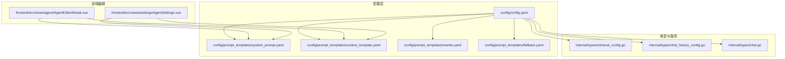
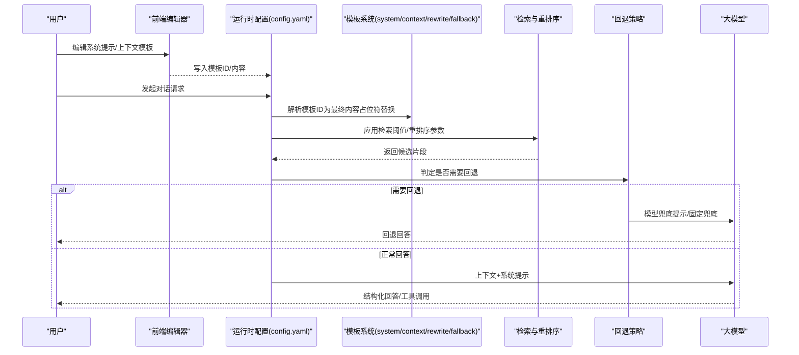
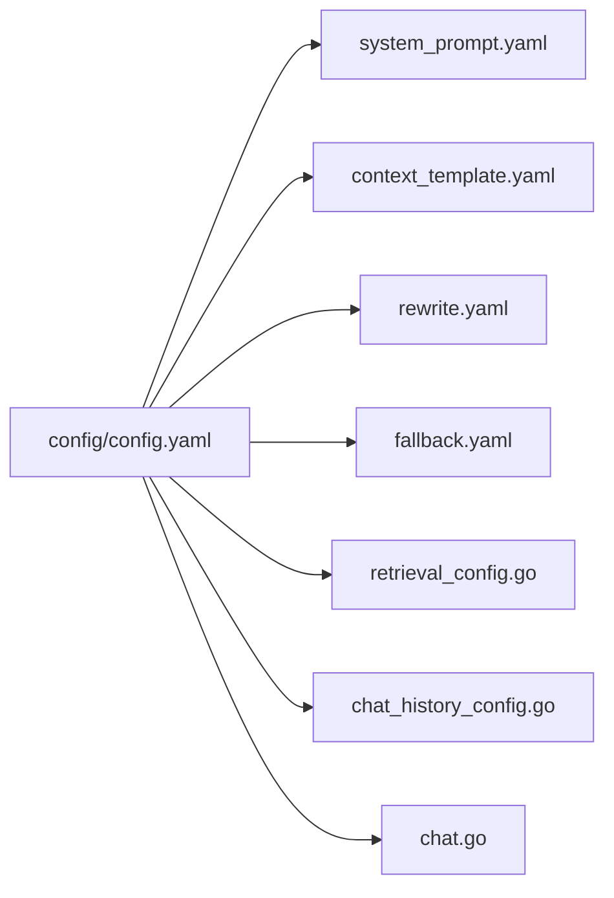

# 对话策略配置

<cite>
**本文引用的文件**
- [config.yaml](file://config/config.yaml)
- [builtin_agents.yaml](file://config/builtin_agents.yaml)
- [agent_type_presets.yaml](file://config/agent_type_presets.yaml)
- [system_prompt.yaml](file://config/prompt_templates/system_prompt.yaml)
- [context_template.yaml](file://config/prompt_templates/context_template.yaml)
- [rewrite.yaml](file://config/prompt_templates/rewrite.yaml)
- [fallback.yaml](file://config/prompt_templates/fallback.yaml)
- [chat_history_config.go](file://internal/types/chat_history_config.go)
- [retrieval_config.go](file://internal/types/retrieval_config.go)
- [chat.go](file://internal/types/chat.go)
- [AgentEditorModal.vue](file://frontend/src/views/agent/AgentEditorModal.vue)
- [AgentSettings.vue](file://frontend/src/views/settings/AgentSettings.vue)
</cite>

## 目录
1. [简介](#简介)
2. [项目结构](#项目结构)
3. [核心组件](#核心组件)
4. [架构总览](#架构总览)
5. [详细组件分析](#详细组件分析)
6. [依赖关系分析](#依赖关系分析)
7. [性能考量](#性能考量)
8. [故障排查指南](#故障排查指南)
9. [结论](#结论)
10. [附录](#附录)

## 简介
本文件面向WeKnora的对话策略配置，系统性阐述以下主题：
- 对话策略的全局配置项与参数含义
- 系统提示模板与上下文模板的定制方法
- 上下文管理策略与对话历史处理机制
- 检索阈值与重排序参数的调优
- 多轮对话上下文管理与在线提示编辑能力
- Quick Q&A与智能推理模式的策略差异
- 提示词模板系统：占位符替换、语言本地化与动态内容生成
- 配置示例、最佳实践、性能优化、错误处理与调试技巧
- 不同策略对对话质量与性能的影响及调优建议

## 项目结构
WeKnora的对话策略配置由“运行时配置 + 模板系统 + 类型定义 + 前端编辑器”四部分组成：
- 运行时配置：集中于config/config.yaml，定义对话轮数、检索阈值、重排序、回退策略等
- 模板系统：位于config/prompt_templates，包含系统提示、上下文模板、改写、兜底等模板
- 类型定义：internal/types中定义聊天响应类型、检索配置、聊天历史配置等
- 前端编辑器：frontend/src/views/...提供在线编辑系统提示与上下文模板的能力

**图表来源**
- [config.yaml:1-113](file://config/config.yaml#L1-L113)
- [system_prompt.yaml:1-201](file://config/prompt_templates/system_prompt.yaml#L1-L201)
- [context_template.yaml:1-107](file://config/prompt_templates/context_template.yaml#L1-L107)
- [rewrite.yaml:1-196](file://config/prompt_templates/rewrite.yaml#L1-L196)
- [fallback.yaml:1-131](file://config/prompt_templates/fallback.yaml#L1-L131)
- [retrieval_config.go:1-85](file://internal/types/retrieval_config.go#L1-L85)
- [chat_history_config.go:1-48](file://internal/types/chat_history_config.go#L1-L48)
- [chat.go:1-96](file://internal/types/chat.go#L1-L96)
- [AgentEditorModal.vue:234-258](file://frontend/src/views/agent/AgentEditorModal.vue#L234-L258)
- [AgentSettings.vue:217-243](file://frontend/src/views/settings/AgentSettings.vue#L217-L243)

**章节来源**
- [config.yaml:1-113](file://config/config.yaml#L1-L113)
- [system_prompt.yaml:1-201](file://config/prompt_templates/system_prompt.yaml#L1-L201)
- [context_template.yaml:1-107](file://config/prompt_templates/context_template.yaml#L1-L107)
- [rewrite.yaml:1-196](file://config/prompt_templates/rewrite.yaml#L1-L196)
- [fallback.yaml:1-131](file://config/prompt_templates/fallback.yaml#L1-L131)
- [retrieval_config.go:1-85](file://internal/types/retrieval_config.go#L1-L85)
- [chat_history_config.go:1-48](file://internal/types/chat_history_config.go#L1-L48)
- [chat.go:1-96](file://internal/types/chat.go#L1-L96)
- [AgentEditorModal.vue:234-258](file://frontend/src/views/agent/AgentEditorModal.vue#L234-L258)
- [AgentSettings.vue:217-243](file://frontend/src/views/settings/AgentSettings.vue#L217-L243)

## 核心组件
- 全局对话配置（config/config.yaml）
  - 关键字段：max_rounds、keyword_threshold、embedding_top_k、vector_threshold、rerank_threshold、rerank_top_k、enable_rewrite、enable_query_expansion、enable_rerank、fallback_strategy、fallback_response、fallback_prompt_id、rewrite_prompt_id、generate_summary_prompt_id、generate_session_title_prompt_id、extract_entities_prompt_id、extract_relationships_prompt_id、generate_questions_prompt_id 等
  - 影响范围：对话轮次上限、检索阈值、重排序、回退策略、改写与查询扩展开关、摘要/标题/实体/关系/问题生成的提示词ID
- 检索配置（internal/types/retrieval_config.go）
  - 字段：EmbeddingTopK、VectorThreshold、KeywordThreshold、RerankTopK、RerankThreshold、RerankModelID
  - 默认回退：当配置缺失或非正值时，提供合理的默认值
- 聊天历史配置（internal/types/chat_history_config.go）
  - 字段：Enabled、EmbeddingModelID、KnowledgeBaseID
  - IsConfigured：三者齐全才视为已配置
- 聊天响应类型（internal/types/chat.go）
  - 定义响应类型枚举（answer、references、thinking、tool_call、tool_result、error、reflection、session_title、agent_query、complete）与流式响应结构
- 模板系统（config/prompt_templates/*.yaml）
  - system_prompt.yaml：系统提示模板集合，支持多语言与占位符
  - context_template.yaml：上下文模板集合，支持多语言与占位符
  - rewrite.yaml：查询改写模板（含意图分类），支持多套可选模板
  - fallback.yaml：兜底模板（固定回复与模型兜底提示）

**章节来源**
- [config.yaml:6-39](file://config/config.yaml#L6-L39)
- [retrieval_config.go:14-27](file://internal/types/retrieval_config.go#L14-L27)
- [retrieval_config.go:29-67](file://internal/types/retrieval_config.go#L29-L67)
- [chat_history_config.go:15-24](file://internal/types/chat_history_config.go#L15-L24)
- [chat_history_config.go:43-47](file://internal/types/chat_history_config.go#L43-L47)
- [chat.go:29-75](file://internal/types/chat.go#L29-L75)
- [system_prompt.yaml:1-201](file://config/prompt_templates/system_prompt.yaml#L1-L201)
- [context_template.yaml:1-107](file://config/prompt_templates/context_template.yaml#L1-L107)
- [rewrite.yaml:1-196](file://config/prompt_templates/rewrite.yaml#L1-L196)
- [fallback.yaml:1-131](file://config/prompt_templates/fallback.yaml#L1-L131)

## 架构总览
对话策略配置贯穿“配置层 → 模板解析 → 检索与重排序 → 回退策略 → 响应输出”的链路。

**图表来源**
- [config.yaml:6-39](file://config/config.yaml#L6-L39)
- [system_prompt.yaml:1-201](file://config/prompt_templates/system_prompt.yaml#L1-L201)
- [context_template.yaml:1-107](file://config/prompt_templates/context_template.yaml#L1-L107)
- [rewrite.yaml:1-196](file://config/prompt_templates/rewrite.yaml#L1-L196)
- [fallback.yaml:1-131](file://config/prompt_templates/fallback.yaml#L1-L131)
- [retrieval_config.go:14-27](file://internal/types/retrieval_config.go#L14-L27)

## 详细组件分析

### 全局对话配置（config/config.yaml）
- 对话轮次与上下文
  - max_rounds：单会话最大轮次
  - multi_turn_enabled、history_turns：多轮对话开关与保留轮数
- 检索与重排序
  - keyword_threshold、vector_threshold、embedding_top_k、rerank_threshold、rerank_top_k
  - enable_rewrite、enable_query_expansion、enable_rerank
- 回退策略
  - fallback_strategy：fixed 或 model
  - fallback_response、fallback_prompt_id
- 摘要/标题/实体/关系/问题生成
  - generate_summary_prompt_id、generate_session_title_prompt_id、extract_entities_prompt_id、extract_relationships_prompt_id、generate_questions_prompt_id
- 摘要生成的LLM参数
  - summary.max_input_chars、repeat_penalty、temperature、max_completion_tokens、no_match_prefix、prompt_id、context_template_id

调优要点
- 检索阈值与TopK：降低threshold可提升召回但增加噪声；增大TopK可提高召回但增加计算与延迟
- 重排序：开启rerank可显著提升相关性，但需配置RerankModelID
- 回退策略：生产环境建议使用model兜底，保证一致性与礼貌性

**章节来源**
- [config.yaml:6-39](file://config/config.yaml#L6-L39)

### 检索配置（internal/types/retrieval_config.go）
- 字段与默认值
  - EmbeddingTopK：默认50
  - VectorThreshold：默认0.15
  - KeywordThreshold：默认0.3
  - RerankTopK：默认10
  - RerankThreshold：默认0.2
- 作用域：知识库检索与消息检索共享这些参数
- 存储：JSONB列，通过设置界面管理

调优要点
- 当全局RetrievalConfig缺失或数值无效时，采用上述默认值，避免异常
- RerankModelID必填，否则无法执行重排序

**章节来源**
- [retrieval_config.go:14-27](file://internal/types/retrieval_config.go#L14-L27)
- [retrieval_config.go:29-67](file://internal/types/retrieval_config.go#L29-L67)

### 聊天历史配置（internal/types/chat_history_config.go）
- 字段
  - Enabled：是否启用
  - EmbeddingModelID：向量化模型ID
  - KnowledgeBaseID：自动管理的隐藏知识库ID
- IsConfigured：三者均满足才视为可用

调优要点
- 启用后不可更改EmbeddingModelID，需重建索引
- KnowledgeBaseID由后端自动创建/复用

**章节来源**
- [chat_history_config.go:15-24](file://internal/types/chat_history_config.go#L15-L24)
- [chat_history_config.go:43-47](file://internal/types/chat_history_config.go#L43-L47)

### 聊天响应类型（internal/types/chat.go）
- 响应类型：answer、references、thinking、tool_call、tool_result、error、reflection、session_title、agent_query、complete
- 流式响应：包含content、tool_calls、usage、finish_reason等字段

调优要点
- 在多工具调用与思维链场景下，合理利用thinking与tool_result区分不同阶段输出
- finish_reason可用于判断模型是否因长度限制提前结束

**章节来源**
- [chat.go:29-75](file://internal/types/chat.go#L29-L75)

### 模板系统与占位符替换
- 系统提示模板（system_prompt.yaml）
  - 支持多语言名称与描述，default为true的模板作为默认选择
  - 占位符：{{language}}、{{current_time}}等
  - 可控制是否依赖知识库（has_knowledge_base）、是否支持网页搜索（has_web_search）
- 上下文模板（context_template.yaml）
  - 支持多语言，包含标准/详细/简洁/Q&A专用模板
  - 占位符：{{current_time}}、{{current_week}}、{{query}}、{{contexts}}等
- 查询改写模板（rewrite.yaml）
  - 包含意图分类与图片/附件分析
  - 提供标准/严格/带意图分类三种模板
  - 占位符：{{conversation}}、{{query}}、{{language}}等
- 兜底模板（fallback.yaml）
  - 固定回复模板与模型兜底提示模板
  - 支持多语言与占位符{{language}}、{{query}}

前端在线编辑
- AgentEditorModal.vue：提供占位符点击插入、模板选择器
- AgentSettings.vue：系统提示与上下文模板的在线编辑入口

**章节来源**
- [system_prompt.yaml:1-201](file://config/prompt_templates/system_prompt.yaml#L1-L201)
- [context_template.yaml:1-107](file://config/prompt_templates/context_template.yaml#L1-L107)
- [rewrite.yaml:1-196](file://config/prompt_templates/rewrite.yaml#L1-L196)
- [fallback.yaml:1-131](file://config/prompt_templates/fallback.yaml#L1-L131)
- [AgentEditorModal.vue:234-258](file://frontend/src/views/agent/AgentEditorModal.vue#L234-L258)
- [AgentSettings.vue:217-243](file://frontend/src/views/settings/AgentSettings.vue#L217-L243)

### Quick Q&A 与智能推理模式
- Quick Q&A（内置代理：builtin-quick-answer）
  - agent_mode: quick-answer
  - system_prompt_id: default_kb
  - context_template_id: default_context
  - web_search_enabled: true
  - multi_turn_enabled: true、history_turns: 5
  - faq_priority_enabled: true、faq_direct_answer_threshold、faq_score_boost
  - 检索参数：embedding_top_k、keyword_threshold、vector_threshold、rerank_top_k、rerank_threshold
  - enable_rewrite、enable_query_expansion、enable_rerank、fallback_strategy
- 智能推理（内置代理：builtin-smart-reasoning）
  - agent_mode: smart-reasoning
  - agent_type: rag-qa（或其他preset）
  - allowed_tools：知识检索、匹配、列出、图谱查询、文档信息等
  - max_iterations：更高迭代次数
  - multi_turn_enabled、history_turns：与Quick Q&A类似
  - web_search_enabled：可选
  - 其他检索参数与Quick Q&A一致

策略差异
- Quick Q&A：强调快速、准确、可回退，适合FAQ/文档问答
- 智能推理：强调多步思考、工具编排、图谱/百科联动，适合复杂问题

**章节来源**
- [builtin_agents.yaml:25-48](file://config/builtin_agents.yaml#L25-L48)
- [builtin_agents.yaml:68-96](file://config/builtin_agents.yaml#L68-L96)
- [agent_type_presets.yaml:30-63](file://config/agent_type_presets.yaml#L30-L63)
- [agent_type_presets.yaml:65-95](file://config/agent_type_presets.yaml#L65-L95)
- [agent_type_presets.yaml:97-141](file://config/agent_type_presets.yaml#L97-L141)
- [agent_type_presets.yaml:143-186](file://config/agent_type_presets.yaml#L143-L186)

### 多轮对话上下文管理
- 全局配置
  - max_rounds：会话最大轮次
  - multi_turn_enabled、history_turns：是否启用多轮与保留轮数
- 聊天历史知识库
  - chat_history_config：启用后可将消息向量化并纳入检索，提升上下文连贯性
- 上下文模板
  - 通过context_template.yaml的{{conversation}}等占位符注入历史

调优要点
- history_turns过大将增加上下文长度与延迟
- 启用聊天历史知识库需配置EmbeddingModelID与自动KB

**章节来源**
- [config.yaml:10-11](file://config/config.yaml#L10-L11)
- [config.yaml:33-34](file://config/config.yaml#L33-L34)
- [chat_history_config.go:15-24](file://internal/types/chat_history_config.go#L15-L24)
- [context_template.yaml:105-107](file://config/prompt_templates/context_template.yaml#L105-L107)

### 在线提示编辑功能
- 前端组件
  - AgentEditorModal.vue：占位符标签点击插入、模板选择器
  - AgentSettings.vue：系统提示与上下文模板的文本域与模板选择器
- 工作方式
  - 用户在前端编辑模板内容或选择预设模板
  - 后端按模板ID解析为最终提示词，支持占位符替换与语言本地化

**章节来源**
- [AgentEditorModal.vue:234-258](file://frontend/src/views/agent/AgentEditorModal.vue#L234-L258)
- [AgentSettings.vue:217-243](file://frontend/src/views/settings/AgentSettings.vue#L217-L243)

## 依赖关系分析
- 配置到模板
  - config/config.yaml中的*_prompt_id字段指向config/prompt_templates下的模板ID，启动时解析为最终内容
- 配置到类型
  - retrieval_config.go与chat_history_config.go分别承载检索与聊天历史的配置结构
- 配置到响应
  - chat.go定义的响应类型与流式结构，支撑前后端交互

**图表来源**
- [config.yaml:6-39](file://config/config.yaml#L6-L39)
- [system_prompt.yaml:1-201](file://config/prompt_templates/system_prompt.yaml#L1-L201)
- [context_template.yaml:1-107](file://config/prompt_templates/context_template.yaml#L1-L107)
- [rewrite.yaml:1-196](file://config/prompt_templates/rewrite.yaml#L1-L196)
- [fallback.yaml:1-131](file://config/prompt_templates/fallback.yaml#L1-L131)
- [retrieval_config.go:14-27](file://internal/types/retrieval_config.go#L14-L27)
- [chat_history_config.go:15-24](file://internal/types/chat_history_config.go#L15-L24)
- [chat.go:29-75](file://internal/types/chat.go#L29-L75)

**章节来源**
- [config.yaml:6-39](file://config/config.yaml#L6-L39)
- [system_prompt.yaml:1-201](file://config/prompt_templates/system_prompt.yaml#L1-L201)
- [context_template.yaml:1-107](file://config/prompt_templates/context_template.yaml#L1-L107)
- [rewrite.yaml:1-196](file://config/prompt_templates/rewrite.yaml#L1-L196)
- [fallback.yaml:1-131](file://config/prompt_templates/fallback.yaml#L1-L131)
- [retrieval_config.go:14-27](file://internal/types/retrieval_config.go#L14-L27)
- [chat_history_config.go:15-24](file://internal/types/chat_history_config.go#L15-L24)
- [chat.go:29-75](file://internal/types/chat.go#L29-L75)

## 性能考量
- 检索参数
  - embedding_top_k与rerank_top_k越大，召回越多但延迟越高；建议从默认值逐步下调观察F1/命中率变化
  - vector_threshold与keyword_threshold过低会引入噪声，过高会漏召回；建议结合业务数据分布校准
- 重排序
  - 启用rerank可显著提升相关性，但需配置RerankModelID并评估延迟成本
- 回退策略
  - model兜底可减少“无法回答”带来的体验断层，但会增加一次额外推理
- 多轮上下文
  - history_turns与聊天历史知识库会显著增加上下文长度，需关注token上限与延迟
- 前端编辑
  - 模板占位符替换在后端完成，建议避免在模板中放置超长动态内容，优先使用占位符拼接

[本节为通用指导，无需特定文件来源]

## 故障排查指南
- 兜底策略无效
  - 检查fallback_strategy与fallback_prompt_id/fallback_response是否正确配置
  - 若strategy为model，确认模板ID存在且包含{{query}}占位符
- 检索命中率低
  - 降低vector_threshold/keyword_threshold或增大embedding_top_k/rerank_top_k
  - 确认RerankModelID已配置并有效
- 重排序未生效
  - 检查RerankModelID是否存在且可用
- 多轮上下文异常
  - 确认chat_history_config的Enabled、EmbeddingModelID、KnowledgeBaseID均已配置
  - 检查history_turns与max_rounds是否合理
- 响应类型异常
  - 检查chat.go中响应类型枚举与流式结构是否被正确消费
- 模板占位符未替换
  - 确认模板ID与模板内容正确，占位符如{{language}}、{{current_time}}、{{query}}、{{contexts}}等是否在上下文中提供

**章节来源**
- [config.yaml:16-18](file://config/config.yaml#L16-L18)
- [config.yaml:11-15](file://config/config.yaml#L11-L15)
- [config.yaml:22-24](file://config/config.yaml#L22-L24)
- [retrieval_config.go:25-26](file://internal/types/retrieval_config.go#L25-L26)
- [chat_history_config.go:43-47](file://internal/types/chat_history_config.go#L43-L47)
- [chat.go:29-75](file://internal/types/chat.go#L29-L75)
- [system_prompt.yaml:34-38](file://config/prompt_templates/system_prompt.yaml#L34-L38)
- [context_template.yaml:18-19](file://config/prompt_templates/context_template.yaml#L18-L19)
- [rewrite.yaml:105-112](file://config/prompt_templates/rewrite.yaml#L105-L112)

## 结论
WeKnora的对话策略配置通过“全局配置 + 模板系统 + 类型定义 + 前端编辑器”形成闭环：全局配置决定检索与回退策略，模板系统提供可定制的提示词与上下文，类型定义保障响应结构与配置持久化，前端编辑器则让运营与开发者能够在线调整策略。通过合理调优检索阈值、重排序、回退策略与多轮上下文，可在准确性与性能之间取得平衡，并根据不同场景（Quick Q&A vs 智能推理）选择合适的策略组合。

[本节为总结，无需特定文件来源]

## 附录

### 配置示例与最佳实践
- Quick Q&A
  - 启用网页搜索与FAQ优先级，适当降低vector_threshold与rerank_threshold以提升召回
  - 保持multi_turn_enabled与history_turns适中，避免上下文过长
- 智能推理
  - 提高max_iterations与rerank_top_k，启用重排序与意图改写
  - 合理配置allowed_tools，避免不必要的工具调用导致延迟
- 检索阈值调优步骤
  - 固定embedding_top_k，逐步调整vector_threshold与keyword_threshold，观察命中率与误召回
  - 在召回稳定后，逐步提高rerank_top_k并评估相关性提升
- 回退策略
  - 生产环境推荐使用model兜底，配合兜底提示模板，确保一致性与礼貌性
- 多轮对话
  - 启用聊天历史知识库时，注意EmbeddingModelID不可变更，需重建索引
  - 控制history_turns，避免超出模型上下文长度

[本节为通用指导，无需特定文件来源]