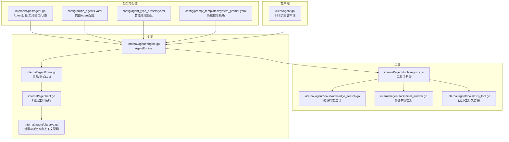
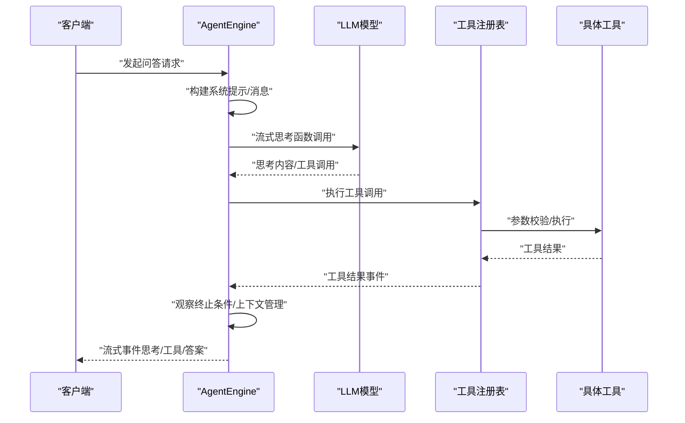
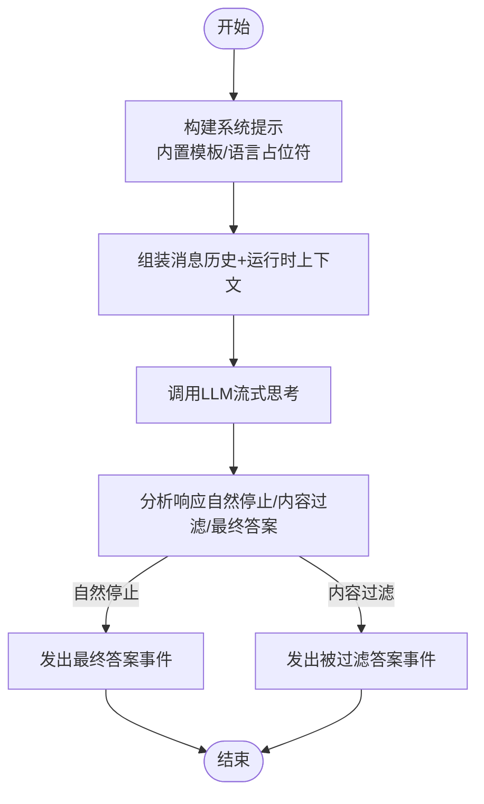
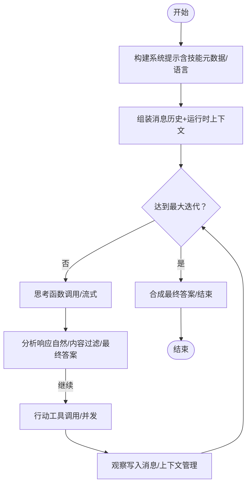
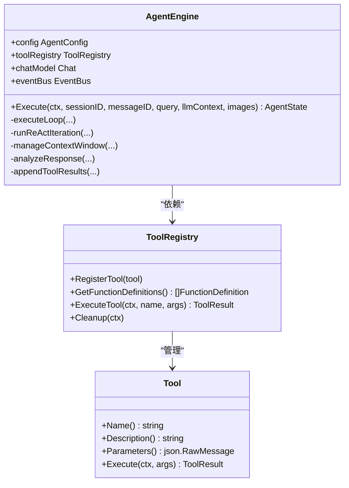
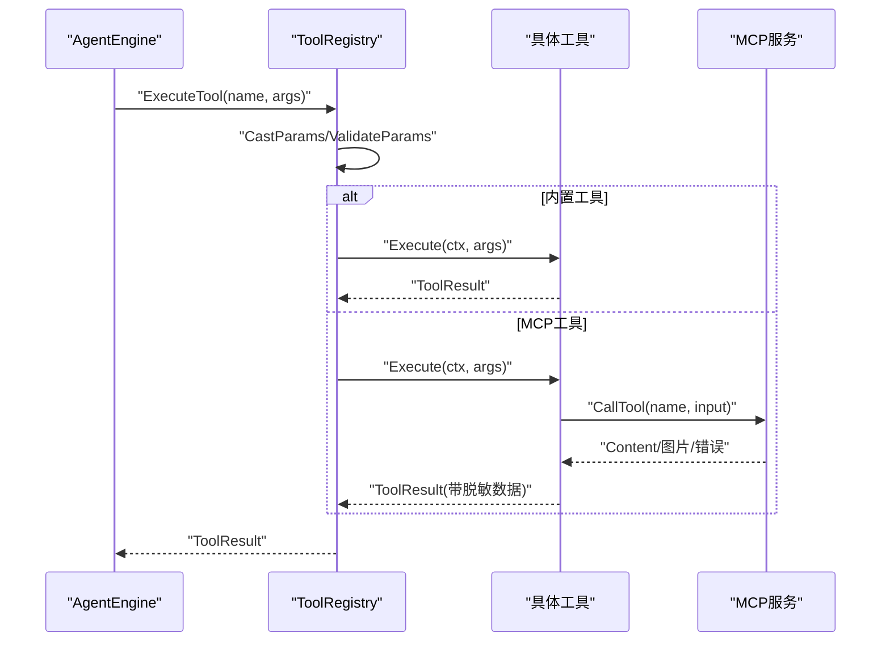
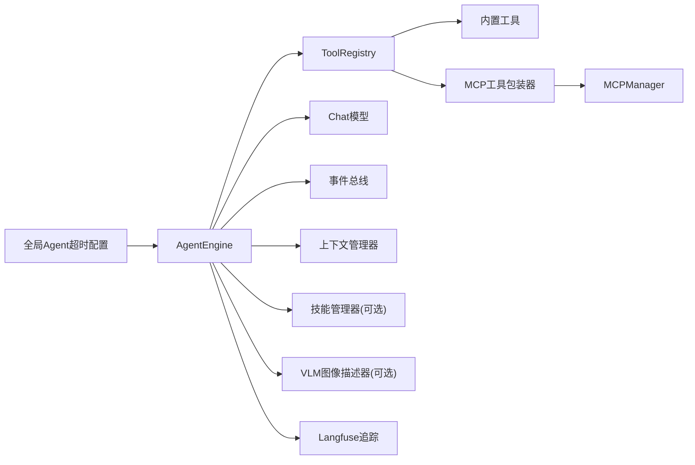

# 智能对话系统

<cite>
**本文引用的文件**
- [internal/agent/engine.go](file://internal/agent/engine.go)
- [internal/agent/think.go](file://internal/agent/think.go)
- [internal/agent/observe.go](file://internal/agent/observe.go)
- [internal/agent/act.go](file://internal/agent/act.go)
- [internal/agent/tools/registry.go](file://internal/agent/tools/registry.go)
- [internal/agent/tools/mcp_tool.go](file://internal/agent/tools/mcp_tool.go)
- [internal/agent/tools/knowledge_search.go](file://internal/agent/tools/knowledge_search.go)
- [internal/agent/tools/final_answer.go](file://internal/agent/tools/final_answer.go)
- [internal/types/agent.go](file://internal/types/agent.go)
- [config/builtin_agents.yaml](file://config/builtin_agents.yaml)
- [config/agent_type_presets.yaml](file://config/agent_type_presets.yaml)
- [config/prompt_templates/system_prompt.yaml](file://config/prompt_templates/system_prompt.yaml)
- [client/agent.go](file://client/agent.go)
- [internal/config/config.go](file://internal/config/config.go)
</cite>

## 目录
1. [简介](#简介)
2. [项目结构](#项目结构)
3. [核心组件](#核心组件)
4. [架构总览](#架构总览)
5. [详细组件分析](#详细组件分析)
6. [依赖分析](#依赖分析)
7. [性能考虑](#性能考虑)
8. [故障排查指南](#故障排查指南)
9. [结论](#结论)
10. [附录](#附录)

## 简介
本文件面向WeKnora智能对话系统，系统提供两类主要对话模式：
- Quick Q&A（快速问答）：基于知识库RAG的单轮检索增强问答，强调“快而准”的答案生成。
- 智能推理（Smart Reasoning）：基于ReAct框架的多步推理与工具调用，支持复杂任务分解、检索、分析与最终回答。

系统通过ReACT代理引擎实现“思考-行动-观察”循环，结合内置工具与MCP外部工具，完成从用户查询到最终答案的自动化处理。对话策略可通过配置项灵活调整，包括在线提示编辑、检索阈值、多轮上下文管理等。系统同时提供事件驱动的流式输出与可观测性（Langfuse），便于前端实时渲染与调试。

## 项目结构
WeKnora后端采用分层架构：
- 类型与配置层：定义Agent配置、会话配置、工具接口与结果结构，并提供内置Agent与预设模板。
- 工具层：内置知识检索、数据处理、网页搜索、最终答案提交等工具；支持MCP服务注册与调用。
- 引擎层：ReAct代理引擎负责执行循环、消息构建、上下文窗口管理、工具并发执行与事件广播。
- 客户端层：提供SSE流式接口，封装Agent问答请求与回调处理。

图表来源
- [internal/types/agent.go:13-65](file://internal/types/agent.go#L13-L65)
- [config/builtin_agents.yaml:25-96](file://config/builtin_agents.yaml#L25-L96)
- [config/agent_type_presets.yaml:30-142](file://config/agent_type_presets.yaml#L30-L142)
- [config/prompt_templates/system_prompt.yaml:18-40](file://config/prompt_templates/system_prompt.yaml#L18-L40)
- [internal/agent/engine.go:28-92](file://internal/agent/engine.go#L28-L92)
- [internal/agent/think.go:24-90](file://internal/agent/think.go#L24-L90)
- [internal/agent/act.go:163-187](file://internal/agent/act.go#L163-L187)
- [internal/agent/observe.go:26-57](file://internal/agent/observe.go#L26-L57)
- [internal/agent/tools/registry.go:16-85](file://internal/agent/tools/registry.go#L16-L85)
- [internal/agent/tools/knowledge_search.go:120-159](file://internal/agent/tools/knowledge_search.go#L120-L159)
- [internal/agent/tools/final_answer.go:50-88](file://internal/agent/tools/final_answer.go#L50-L88)
- [internal/agent/tools/mcp_tool.go:17-87](file://internal/agent/tools/mcp_tool.go#L17-L87)
- [client/agent.go:66-101](file://client/agent.go#L66-L101)

章节来源
- [internal/types/agent.go:13-65](file://internal/types/agent.go#L13-L65)
- [config/builtin_agents.yaml:5-236](file://config/builtin_agents.yaml#L5-L236)
- [config/agent_type_presets.yaml:30-204](file://config/agent_type_presets.yaml#L30-L204)
- [config/prompt_templates/system_prompt.yaml:1-201](file://config/prompt_templates/system_prompt.yaml#L1-L201)
- [internal/agent/engine.go:28-92](file://internal/agent/engine.go#L28-L92)
- [internal/agent/think.go:24-90](file://internal/agent/think.go#L24-L90)
- [internal/agent/act.go:163-187](file://internal/agent/act.go#L163-L187)
- [internal/agent/observe.go:26-57](file://internal/agent/observe.go#L26-L57)
- [internal/agent/tools/registry.go:16-85](file://internal/agent/tools/registry.go#L16-L85)
- [internal/agent/tools/knowledge_search.go:120-159](file://internal/agent/tools/knowledge_search.go#L120-L159)
- [internal/agent/tools/final_answer.go:50-88](file://internal/agent/tools/final_answer.go#L50-L88)
- [internal/agent/tools/mcp_tool.go:17-87](file://internal/agent/tools/mcp_tool.go#L17-L87)
- [client/agent.go:66-101](file://client/agent.go#L66-L101)

## 核心组件
- AgentEngine：ReAct代理引擎，负责系统提示构建、消息组装、上下文窗口管理、迭代控制与事件广播。
- 工具注册表（ToolRegistry）：统一注册与执行工具，支持参数校验、输出截断与清理。
- 内置工具：知识检索、关键词匹配、文档信息、数据结构/分析、网页搜索、最终答案等。
- MCP工具：封装外部MCP服务工具，支持连接复用、重连与安全前缀输出。
- 配置与模板：内置Agent与预设、系统提示模板、会话配置与全局Agent超时配置。

章节来源
- [internal/agent/engine.go:28-92](file://internal/agent/engine.go#L28-L92)
- [internal/agent/tools/registry.go:16-85](file://internal/agent/tools/registry.go#L16-L85)
- [internal/agent/tools/knowledge_search.go:120-159](file://internal/agent/tools/knowledge_search.go#L120-L159)
- [internal/agent/tools/final_answer.go:50-88](file://internal/agent/tools/final_answer.go#L50-L88)
- [internal/agent/tools/mcp_tool.go:17-87](file://internal/agent/tools/mcp_tool.go#L17-L87)
- [internal/types/agent.go:13-65](file://internal/types/agent.go#L13-L65)
- [config/builtin_agents.yaml:25-96](file://config/builtin_agents.yaml#L25-L96)
- [config/agent_type_presets.yaml:30-142](file://config/agent_type_presets.yaml#L30-L142)
- [config/prompt_templates/system_prompt.yaml:18-40](file://config/prompt_templates/system_prompt.yaml#L18-L40)
- [internal/config/config.go:35-40](file://internal/config/config.go#L35-L40)

## 架构总览
ReAct代理引擎以“思考-行动-观察”为核心循环：
- 思考（Think）：调用大模型进行函数调用（含工具列表），支持流式事件与重试。
- 行动（Act）：解析工具调用，按配置并发执行，产出结果事件。
- 观察（Observe）：将工具结果写入消息历史，分析终止条件（自然停止、内容过滤、最终答案工具）。

图表来源
- [internal/agent/engine.go:158-298](file://internal/agent/engine.go#L158-L298)
- [internal/agent/think.go:24-90](file://internal/agent/think.go#L24-L90)
- [internal/agent/act.go:163-187](file://internal/agent/act.go#L163-L187)
- [internal/agent/observe.go:68-120](file://internal/agent/observe.go#L68-L120)
- [internal/agent/tools/registry.go:87-159](file://internal/agent/tools/registry.go#L87-L159)

## 详细组件分析

### Quick Q&A（快速问答）模式
- 模式定位：单轮RAG问答，强调检索与直接回答，适合快速、准确的答案需求。
- 关键配置：
  - 温度、最大补全长度、是否启用网页搜索、多轮与历史回合数、检索阈值与重排参数、FAQ优先策略等。
- 使用场景：FAQ优先、关键词/向量混合检索、查询扩展与改写、嵌入TopK与重排TopK等。

图表来源
- [config/builtin_agents.yaml:25-48](file://config/builtin_agents.yaml#L25-L48)
- [config/prompt_templates/system_prompt.yaml:18-40](file://config/prompt_templates/system_prompt.yaml#L18-L40)
- [internal/agent/observe.go:68-120](file://internal/agent/observe.go#L68-L120)
- [internal/agent/think.go:24-90](file://internal/agent/think.go#L24-L90)

章节来源
- [config/builtin_agents.yaml:5-48](file://config/builtin_agents.yaml#L5-L48)
- [config/prompt_templates/system_prompt.yaml:18-40](file://config/prompt_templates/system_prompt.yaml#L18-L40)
- [internal/agent/observe.go:68-120](file://internal/agent/observe.go#L68-L120)
- [internal/agent/think.go:24-90](file://internal/agent/think.go#L24-L90)

### 智能推理（Smart Reasoning）模式
- 模式定位：多步ReAct推理，支持工具驱动的任务分解与执行，适合复杂问题与跨域检索。
- 关键配置：
  - 最大迭代次数、允许工具清单（知识检索、关键词匹配、文档信息、知识图谱、数据结构/分析、网页搜索、最终答案等）、是否启用思维模式、是否保留检索历史、MCP服务选择模式与白名单等。
- 预设类型：RAG问答、Wiki问答、混合（Wiki+RAG）、数据分析、自定义。

图表来源
- [config/agent_type_presets.yaml:30-142](file://config/agent_type_presets.yaml#L30-L142)
- [internal/agent/engine.go:341-405](file://internal/agent/engine.go#L341-L405)
- [internal/agent/think.go:24-90](file://internal/agent/think.go#L24-L90)
- [internal/agent/act.go:163-187](file://internal/agent/act.go#L163-L187)
- [internal/agent/observe.go:26-57](file://internal/agent/observe.go#L26-L57)

章节来源
- [config/agent_type_presets.yaml:30-142](file://config/agent_type_presets.yaml#L30-L142)
- [internal/agent/engine.go:341-405](file://internal/agent/engine.go#L341-L405)
- [internal/agent/think.go:24-90](file://internal/agent/think.go#L24-L90)
- [internal/agent/act.go:163-187](file://internal/agent/act.go#L163-L187)
- [internal/agent/observe.go:26-57](file://internal/agent/observe.go#L26-L57)

### ReACT代理引擎工作机制
- 执行入口：构建系统提示、消息数组与工具定义，进入主循环。
- 上下文窗口管理：估算当前token，必要时压缩或LLM摘要合并，避免超出限制。
- 响应分析：识别自然停止、内容过滤、最终答案工具调用等终止条件。
- 并发工具执行：当存在多个工具调用且开启并发时，使用errgroup并发执行，保证失败不影响其他工具。

图表来源
- [internal/agent/engine.go:28-92](file://internal/agent/engine.go#L28-L92)
- [internal/agent/observe.go:26-57](file://internal/agent/observe.go#L26-L57)
- [internal/agent/act.go:163-187](file://internal/agent/act.go#L163-L187)
- [internal/agent/think.go:24-90](file://internal/agent/think.go#L24-L90)
- [internal/agent/tools/registry.go:16-85](file://internal/agent/tools/registry.go#L16-L85)

章节来源
- [internal/agent/engine.go:158-298](file://internal/agent/engine.go#L158-L298)
- [internal/agent/observe.go:26-57](file://internal/agent/observe.go#L26-L57)
- [internal/agent/act.go:163-187](file://internal/agent/act.go#L163-L187)
- [internal/agent/think.go:24-90](file://internal/agent/think.go#L24-L90)
- [internal/agent/tools/registry.go:87-159](file://internal/agent/tools/registry.go#L87-L159)

### 工具调用系统架构
- 内置工具：知识检索、关键词匹配、文档信息、数据结构/分析、网页搜索、最终答案等，均实现统一工具接口。
- MCP工具：封装外部MCP服务工具，自动连接/重连、参数与输出安全处理、图像提取与描述、结构化数据脱敏。
- 注册与执行：注册表负责参数校验、输出截断、错误提示与清理资源。

图表来源
- [internal/agent/tools/registry.go:87-159](file://internal/agent/tools/registry.go#L87-L159)
- [internal/agent/tools/mcp_tool.go:89-184](file://internal/agent/tools/mcp_tool.go#L89-L184)
- [internal/agent/tools/knowledge_search.go:161-200](file://internal/agent/tools/knowledge_search.go#L161-L200)
- [internal/agent/tools/final_answer.go:62-88](file://internal/agent/tools/final_answer.go#L62-L88)

章节来源
- [internal/agent/tools/registry.go:87-159](file://internal/agent/tools/registry.go#L87-L159)
- [internal/agent/tools/mcp_tool.go:89-184](file://internal/agent/tools/mcp_tool.go#L89-L184)
- [internal/agent/tools/knowledge_search.go:161-200](file://internal/agent/tools/knowledge_search.go#L161-L200)
- [internal/agent/tools/final_answer.go:62-88](file://internal/agent/tools/final_answer.go#L62-L88)

### 对话策略配置选项
- 在线提示编辑：通过系统提示模板与语言占位符动态生成，支持国际化。
- 检索阈值与重排：嵌入TopK、关键词阈值、向量阈值、重排TopK与阈值等，影响检索质量与召回。
- 多轮对话上下文管理：历史回合数、是否保留检索历史、运行时上下文块（包含当前时间、会话ID、绑定知识库与权威文档集）。
- Agent配置：最大迭代次数、允许工具清单、温度、是否启用思维模式、MCP服务选择模式与白名单、最大上下文token、工具并发等。

章节来源
- [config/prompt_templates/system_prompt.yaml:18-40](file://config/prompt_templates/system_prompt.yaml#L18-L40)
- [config/builtin_agents.yaml:25-48](file://config/builtin_agents.yaml#L25-L48)
- [config/agent_type_presets.yaml:30-142](file://config/agent_type_presets.yaml#L30-L142)
- [internal/types/agent.go:13-65](file://internal/types/agent.go#L13-L65)
- [internal/agent/observe.go:281-342](file://internal/agent/observe.go#L281-L342)

### 代码示例：配置与使用不同对话模式
以下示例展示如何通过请求体配置不同模式与参数（路径引用，不含具体代码内容）：
- 快速问答模式（单轮RAG）：设置agent_mode为“quick-answer”，启用网页搜索与FAQ优先策略，配置嵌入TopK、关键词阈值、向量阈值与重排参数。
  - 参考路径：[config/builtin_agents.yaml:25-48](file://config/builtin_agents.yaml#L25-L48)
- 智能推理模式（ReAct）：设置agent_mode为“smart-reasoning”，选择预设类型（如“rag-qa”、“wiki-qa”、“hybrid-rag-wiki”、“data-analysis”），配置最大迭代次数、允许工具清单、是否保留检索历史、MCP服务选择模式等。
  - 参考路径：[config/agent_type_presets.yaml:30-142](file://config/agent_type_presets.yaml#L30-L142)
- 流式问答请求（SSE）：通过客户端封装AgentQAStreamWithRequest发送请求，回调处理思考、工具调用、工具结果、引用与最终答案事件。
  - 参考路径：[client/agent.go:76-101](file://client/agent.go#L76-L101)
- 返回值与错误处理：客户端回调中根据响应类型处理内容片段与完成标记；错误通过事件总线广播，引擎在失败时尝试优雅降级（基于已有工具结果合成最终答案）。
  - 参考路径：[internal/agent/think.go:297-323](file://internal/agent/think.go#L297-L323)
  - 参考路径：[internal/agent/observe.go:166-253](file://internal/agent/observe.go#L166-L253)

章节来源
- [config/builtin_agents.yaml:25-48](file://config/builtin_agents.yaml#L25-L48)
- [config/agent_type_presets.yaml:30-142](file://config/agent_type_presets.yaml#L30-L142)
- [client/agent.go:76-101](file://client/agent.go#L76-L101)
- [internal/agent/think.go:297-323](file://internal/agent/think.go#L297-L323)
- [internal/agent/observe.go:166-253](file://internal/agent/observe.go#L166-L253)

## 依赖分析
- 组件耦合：
  - AgentEngine依赖ToolRegistry、Chat模型、事件总线、上下文管理器、可选技能管理器与VLM图像描述器。
  - ToolRegistry统一管理工具生命周期与参数校验，避免工具名冲突与资源泄漏。
  - MCP工具通过MCPManager管理客户端连接，支持stdio与网络传输，具备重连与错误恢复。
- 外部依赖：
  - Langfuse：为每个agent.execute、agent.round与agent.tool.*生成追踪跨度，便于可视化与诊断。
  - 全局Agent超时：通过全局配置控制单次LLM调用超时，避免长时间阻塞。

图表来源
- [internal/agent/engine.go:28-92](file://internal/agent/engine.go#L28-L92)
- [internal/agent/tools/registry.go:16-85](file://internal/agent/tools/registry.go#L16-L85)
- [internal/agent/tools/mcp_tool.go:17-87](file://internal/agent/tools/mcp_tool.go#L17-L87)
- [internal/config/config.go:35-40](file://internal/config/config.go#L35-L40)

章节来源
- [internal/agent/engine.go:28-92](file://internal/agent/engine.go#L28-L92)
- [internal/agent/tools/registry.go:16-85](file://internal/agent/tools/registry.go#L16-L85)
- [internal/agent/tools/mcp_tool.go:17-87](file://internal/agent/tools/mcp_tool.go#L17-L87)
- [internal/config/config.go:35-40](file://internal/config/config.go#L35-L40)

## 性能考虑
- 上下文窗口管理：估算当前token，必要时压缩或摘要合并，避免超出限制导致失败与重试。
- 工具并发执行：当存在多个工具调用且开启并发时，使用errgroup并发执行，提升吞吐并降低总延迟。
- 输出截断：工具输出超过阈值时进行截断，防止污染上下文与内存占用过高。
- LLM调用超时：全局配置控制单次调用超时，避免长尾请求拖累整体性能。
- 图像处理：MCP工具结果中的图像进行验证与限制，避免过大负载与日志膨胀。

章节来源
- [internal/agent/observe.go:26-57](file://internal/agent/observe.go#L26-L57)
- [internal/agent/act.go:189-214](file://internal/agent/act.go#L189-L214)
- [internal/agent/tools/registry.go:129-133](file://internal/agent/tools/registry.go#L129-L133)
- [internal/config/config.go:35-40](file://internal/config/config.go#L35-L40)
- [internal/agent/tools/mcp_tool.go:186-202](file://internal/agent/tools/mcp_tool.go#L186-L202)

## 故障排查指南
- LLM调用失败：记录错误并尝试基于已有工具结果合成最终答案；若仍失败，返回用户可见的降级消息。
  - 参考路径：[internal/agent/think.go:297-323](file://internal/agent/think.go#L297-L323)
- 内容过滤触发：检测到内容过滤时立即终止循环，发出被过滤答案事件。
  - 参考路径：[internal/agent/observe.go:78-120](file://internal/agent/observe.go#L78-L120)
- 工具执行异常：注册表对参数进行校验与修复，输出截断并追加错误提示，确保不会因单个工具失败影响其他步骤。
  - 参考路径：[internal/agent/tools/registry.go:113-159](file://internal/agent/tools/registry.go#L113-L159)
- MCP工具错误：记录错误并返回标准化错误消息；对stdio传输在使用后释放连接。
  - 参考路径：[internal/agent/tools/mcp_tool.go:103-148](file://internal/agent/tools/mcp_tool.go#L103-L148)
- 事件总线：所有阶段通过事件总线广播，便于前端实时渲染与问题定位。
  - 参考路径：[internal/agent/think.go:121-201](file://internal/agent/think.go#L121-L201)

章节来源
- [internal/agent/think.go:297-323](file://internal/agent/think.go#L297-L323)
- [internal/agent/observe.go:78-120](file://internal/agent/observe.go#L78-L120)
- [internal/agent/tools/registry.go:113-159](file://internal/agent/tools/registry.go#L113-L159)
- [internal/agent/tools/mcp_tool.go:103-148](file://internal/agent/tools/mcp_tool.go#L103-L148)
- [internal/agent/think.go:121-201](file://internal/agent/think.go#L121-L201)

## 结论
WeKnora智能对话系统通过清晰的分层架构与ReAct推理框架，实现了从简单问答到复杂推理的全场景覆盖。Quick Q&A强调“快而准”，适合FAQ与文档检索；智能推理模式支持多步思考与工具调用，适合复杂任务。系统通过工具注册表、MCP集成、上下文窗口管理与并发执行等机制，在保证稳定性的同时兼顾性能与可扩展性。配合事件驱动的流式输出与Langfuse可观测性，能够满足生产环境的高质量交互需求。

## 附录
- 典型配置要点
  - Quick Q&A：启用网页搜索、FAQ优先、合理的历史回合数与检索阈值。
  - 智能推理：选择合适的预设类型，配置最大迭代次数与允许工具清单，按需开启并发与思维模式。
- 常用工具
  - 知识检索、关键词匹配、文档信息、数据结构/分析、网页搜索、最终答案、MCP工具等。
- 客户端使用
  - 通过SSE流式接口接收思考、工具、引用与最终答案事件，结合回调进行UI渲染与错误处理。