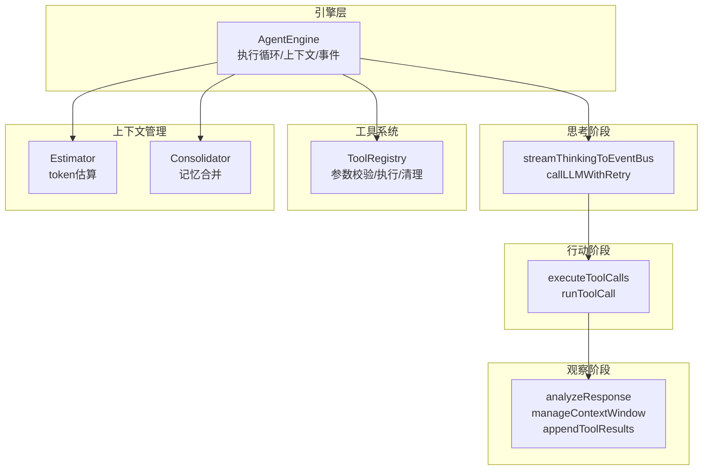
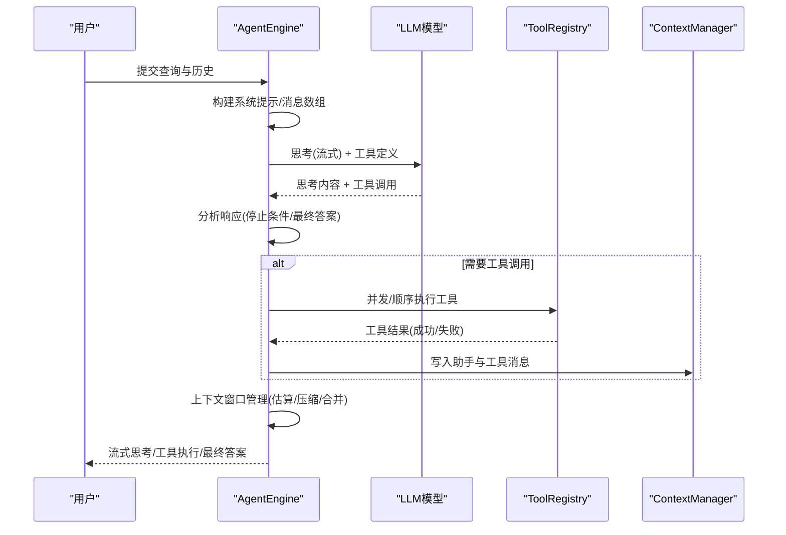
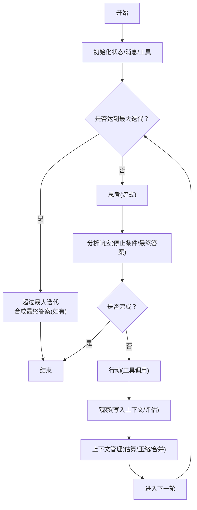
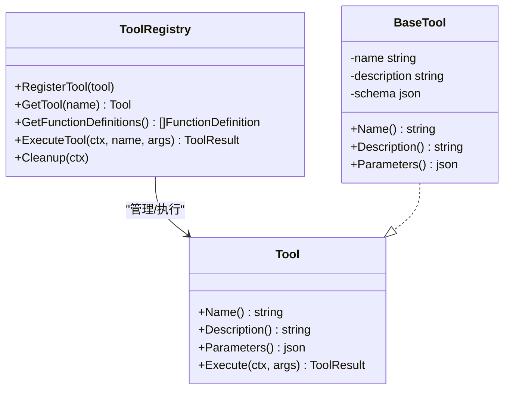
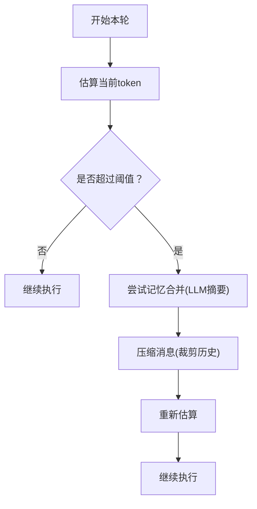
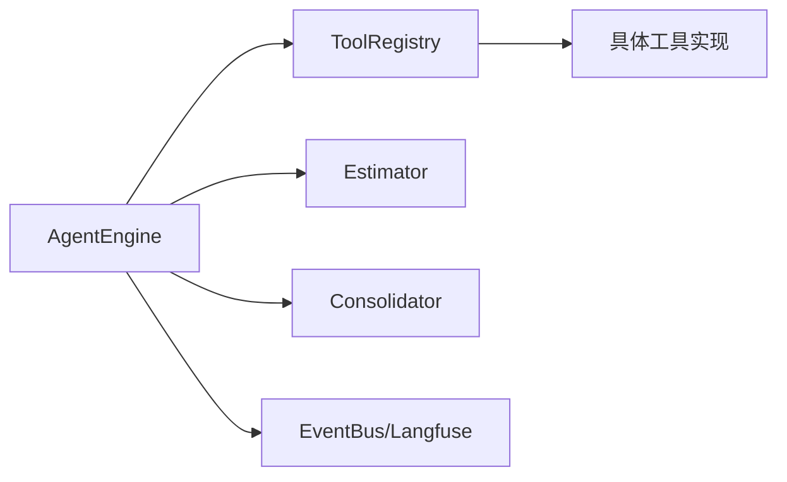

# 智能推理模式

<cite>
**本文引用的文件**
- [engine.go](file://internal/agent/engine.go)
- [think.go](file://internal/agent/think.go)
- [act.go](file://internal/agent/act.go)
- [observe.go](file://internal/agent/observe.go)
- [registry.go](file://internal/agent/tools/registry.go)
- [estimator.go](file://internal/agent/token/estimator.go)
- [consolidator.go](file://internal/agent/memory/consolidator.go)
- [builtin_agents.yaml](file://config/builtin_agents.yaml)
- [agent.go](file://internal/types/agent.go)
- [prompts.go](file://internal/agent/prompts.go)
- [knowledge_search.go](file://internal/agent/tools/knowledge_search.go)
- [final_answer.go](file://internal/agent/tools/final_answer.go)
</cite>

## 目录
1. [简介](#简介)
2. [项目结构](#项目结构)
3. [核心组件](#核心组件)
4. [架构总览](#架构总览)
5. [详细组件分析](#详细组件分析)
6. [依赖分析](#依赖分析)
7. [性能考量](#性能考量)
8. [故障排查指南](#故障排查指南)
9. [结论](#结论)
10. [附录：配置与使用示例](#附录配置与使用示例)

## 简介
本文件面向WeKnora的“智能推理模式”，系统性阐述ReACT代理引擎的工作机制与工程实现，覆盖思考(Think)、行动(Act)、观察(Observe)三阶段的执行细节；代理执行循环的控制流（迭代次数限制、停止条件、异常处理）；工具调用系统的架构（注册、参数校验、并发执行、结果处理与事件上报）；以及上下文窗口管理（token估算、消息压缩、记忆合并）等关键技术点。同时提供可操作的配置与使用建议，帮助读者在多轮对话、复杂任务分解与外部系统集成等场景中高效落地。

## 项目结构
WeKnora的智能推理模式主要由以下模块构成：
- 引擎层：负责ReACT主循环、上下文构建、工具列表生成、事件与可观测性上报
- 思考阶段：封装LLM流式输出、工具调用提示、错误重试与降级
- 行动阶段：参数修复与校验、并发工具调用、结果事件与追踪
- 观察阶段：停止条件判定、最终答案解析、上下文窗口管理与历史清理
- 工具系统：工具注册表、参数校验、执行监控与结果截断
- 上下文管理：token估算、消息压缩、LLM驱动的记忆合并

图表来源
- [engine.go:158-298](file://internal/agent/engine.go#L158-L298)
- [think.go:92-230](file://internal/agent/think.go#L92-L230)
- [act.go:163-301](file://internal/agent/act.go#L163-L301)
- [observe.go:68-253](file://internal/agent/observe.go#L68-L253)
- [registry.go:87-159](file://internal/agent/tools/registry.go#L87-L159)
- [estimator.go:50-87](file://internal/agent/token/estimator.go#L50-L87)
- [consolidator.go:79-151](file://internal/agent/memory/consolidator.go#L79-L151)

章节来源
- [engine.go:28-92](file://internal/agent/engine.go#L28-L92)
- [builtin_agents.yaml:49-96](file://config/builtin_agents.yaml#L49-L96)

## 核心组件
- AgentEngine：ReACT代理引擎核心，负责执行循环、上下文构建、工具定义生成、事件与可观测性、以及上下文窗口管理。
- ToolRegistry：工具注册与执行中枢，提供参数校验、类型转换、执行监控、输出截断与清理。
- Estimator：基于BPE的token估算器，用于增量估算与首轮回退。
- Consolidator：基于LLM的对话记忆合并器，在接近阈值时将历史消息摘要化以节省token。
- AgentConfig：代理运行期配置，包含最大迭代次数、工具白名单、温度、上下文窗口、并行工具调用、多轮对话等。
- AgentState/AgentStep：记录每轮步骤、工具调用、最终答案与知识引用。

章节来源
- [engine.go:28-92](file://internal/agent/engine.go#L28-L92)
- [registry.go:16-85](file://internal/agent/tools/registry.go#L16-L85)
- [estimator.go:34-87](file://internal/agent/token/estimator.go#L34-L87)
- [consolidator.go:30-58](file://internal/agent/memory/consolidator.go#L30-L58)
- [agent.go:13-65](file://internal/types/agent.go#L13-L65)

## 架构总览
ReACT智能推理模式的执行路径如下：
- 初始化：构建系统提示、消息历史、工具定义，准备上下文窗口与事件总线。
- 执行循环：在每次迭代中依次执行“思考→行动→观察”三阶段，并在必要时进行上下文管理。
- 停止条件：自然结束、内容过滤、显式final_answer工具调用或达到最大迭代次数。
- 结果合成：在异常或取消时尝试从已有工具结果合成最终答案。

图表来源
- [engine.go:158-298](file://internal/agent/engine.go#L158-L298)
- [think.go:232-353](file://internal/agent/think.go#L232-L353)
- [act.go:163-301](file://internal/agent/act.go#L163-L301)
- [observe.go:68-253](file://internal/agent/observe.go#L68-L253)

## 详细组件分析

### ReACT执行循环与控制流
- 循环入口：初始化AgentState，构建系统提示与消息数组，生成工具函数定义。
- 迭代控制：通过MaxIterations限制最大轮次；在每次迭代前估算当前token并进行上下文管理。
- 停止条件：
  - 自然停止：finish_reason为stop且无工具调用。
  - 内容过滤：finish_reason为content_filter。
  - 显式终止：final_answer工具调用，支持严格解析、修复解析与正则兜底。
  - 超时/取消：上下文取消时尝试从现有工具结果合成最终答案。
- 异常处理：LLM瞬时错误自动重试；若存在工具调用历史，则进行优雅降级，合成最终答案。

图表来源
- [engine.go:341-405](file://internal/agent/engine.go#L341-L405)
- [think.go:232-353](file://internal/agent/think.go#L232-L353)
- [act.go:163-301](file://internal/agent/act.go#L163-L301)
- [observe.go:68-253](file://internal/agent/observe.go#L68-L253)

章节来源
- [engine.go:341-405](file://internal/agent/engine.go#L341-L405)
- [think.go:232-353](file://internal/agent/think.go#L232-L353)
- [observe.go:68-253](file://internal/agent/observe.go#L68-L253)

### 思考(Think)阶段
- 流式输出：通过streamThinkingToEventBus将LLM的思考与工具调用实时事件化，便于UI与观测系统消费。
- 参数与选项：Temperature、Thinking开关、并行工具调用策略；工具定义随请求下发。
- 错误重试：对瞬时错误进行最多maxLLMRetries次指数级延迟重试。
- 优雅降级：当LLM调用失败但存在工具调用历史时，尝试从已有结果合成最终答案。

章节来源
- [think.go:24-90](file://internal/agent/think.go#L24-L90)
- [think.go:92-230](file://internal/agent/think.go#L92-L230)
- [think.go:232-353](file://internal/agent/think.go#L232-L353)

### 行动(Act)阶段
- 参数修复与校验：对LLM返回的JSON参数进行RepairJSON与严格解析，确保类型安全与schema一致。
- 并发执行：当开启ParallelToolCalls且存在多个工具调用时，使用errgroup并发执行，保证兄弟工具不互相影响。
- 结果事件：为每个工具调用发射“工具调用”和“工具结果”两类事件，便于前端与监控系统感知。
- 可观测性：为每个工具调用开启Langfuse子span，记录输入、输出、错误与耗时。

章节来源
- [act.go:163-301](file://internal/agent/act.go#L163-L301)
- [act.go:303-462](file://internal/agent/act.go#L303-L462)
- [registry.go:87-159](file://internal/agent/tools/registry.go#L87-L159)

### 观察(Observe)阶段
- 停止条件判定：自然停止、内容过滤、final_answer工具调用（含严格解析、修复解析、正则兜底）。
- 最终答案事件：无论解析成功与否，均发出最终答案事件，确保UI可见性。
- 上下文管理：
  - 估算：优先使用API Usage，其次使用Estimator进行增量估算。
  - 压缩：当超出阈值时，使用CompressContext进行消息压缩。
  - 合并：当接近阈值时，使用Consolidator将历史消息摘要化，保留关键事实与工具结果。
- 历史清理：对可能随时间变化的知识库工具结果进行脱敏，避免使用过期检索结果。

章节来源
- [observe.go:68-253](file://internal/agent/observe.go#L68-L253)
- [observe.go:26-57](file://internal/agent/observe.go#L26-L57)
- [estimator.go:50-87](file://internal/agent/token/estimator.go#L50-L87)
- [consolidator.go:79-151](file://internal/agent/memory/consolidator.go#L79-L151)

### 工具调用系统
- 注册与发现：ToolRegistry集中管理工具，提供GetFunctionDefinitions用于函数调用；支持最大输出长度截断与清理回调。
- 参数校验：在执行前对参数进行schema校验与类型转换，减少无效调用。
- 执行监控：统一的Pipeline日志与事件上报，记录成功/警告/错误级别指标。
- 名称冲突防护：采用“首次注册获胜”的策略，防止同名工具覆盖。

图表来源
- [registry.go:16-85](file://internal/agent/tools/registry.go#L16-L85)
- [registry.go:87-159](file://internal/agent/tools/registry.go#L87-L159)
- [tool.go:10-47](file://internal/agent/tools/tool.go#L10-L47)

章节来源
- [registry.go:16-85](file://internal/agent/tools/registry.go#L16-L85)
- [registry.go:87-159](file://internal/agent/tools/registry.go#L87-L159)
- [tool.go:10-47](file://internal/agent/tools/tool.go#L10-L47)

### 上下文窗口管理
- token估算：Estimator基于BPE编码估算消息token数，支持增量估算与字符串估算。
- 压缩策略：当估算超过阈值时，CompressContext按规则裁剪消息，优先保留最近回合与工具调用对。
- 记忆合并：Consolidator在接近阈值时，使用LLM对历史消息进行摘要化，保留关键事实与工具结果，失败时回退到原始归档。

图表来源
- [engine.go:490-498](file://internal/agent/engine.go#L490-L498)
- [observe.go:26-57](file://internal/agent/observe.go#L26-L57)
- [consolidator.go:79-151](file://internal/agent/memory/consolidator.go#L79-L151)
- [estimator.go:50-87](file://internal/agent/token/estimator.go#L50-L87)

章节来源
- [engine.go:490-498](file://internal/agent/engine.go#L490-L498)
- [observe.go:26-57](file://internal/agent/observe.go#L26-L57)
- [consolidator.go:79-151](file://internal/agent/memory/consolidator.go#L79-L151)
- [estimator.go:50-87](file://internal/agent/token/estimator.go#L50-L87)

### 停止条件与最终答案
- 自然停止：finish_reason为stop且无工具调用，Strip掉<think>块后作为最终答案。
- 内容过滤：触发content_filter时，发出带内容或默认提示的最终答案事件。
- 显式终止：final_answer工具调用，支持三层解析容错（严格→修复→正则），确保循环不会重复输出最终答案。

章节来源
- [observe.go:68-253](file://internal/agent/observe.go#L68-L253)
- [final_answer.go:100-138](file://internal/agent/tools/final_answer.go#L100-L138)

### 多轮对话与运行时上下文
- 运行时上下文块：在用户消息中注入runtime_context，包含会话ID、当前时间、绑定的知识库与选中的文档，确保多轮切换时的正确性。
- 历史保留策略：可通过配置决定是否保留检索历史，避免过时检索结果干扰后续检索。

章节来源
- [observe.go:298-342](file://internal/agent/observe.go#L298-L342)
- [prompts.go:114-186](file://internal/agent/prompts.go#L114-L186)

## 依赖分析
- 组件耦合：
  - AgentEngine依赖ToolRegistry、Estimator、Consolidator、ContextManager、EventBus、Langfuse等。
  - ToolRegistry依赖各具体工具实现，遵循统一接口与参数schema。
- 关键依赖链：
  - 执行循环 → 思考 → 行动 → 观察 → 上下文管理。
  - 工具执行 → 参数校验/修复 → 并发执行 → 结果事件 → 上下文写入。
- 外部集成点：
  - LLM模型（流式/非流式）、MCP服务、向量检索、知识库服务、Rerank模型等。

图表来源
- [engine.go:28-92](file://internal/agent/engine.go#L28-L92)
- [registry.go:87-159](file://internal/agent/tools/registry.go#L87-L159)

章节来源
- [engine.go:28-92](file://internal/agent/engine.go#L28-L92)
- [registry.go:87-159](file://internal/agent/tools/registry.go#L87-L159)

## 性能考量
- token估算与压缩：优先使用API Usage作为权威计数，结合Estimator进行增量估算，避免频繁API往返；在接近阈值时先尝试Consolidator，再进行CompressContext压缩。
- 并行工具调用：开启ParallelToolCalls可显著降低总时延，但需注意资源竞争与错误隔离。
- 输出截断：对工具输出设置最大长度，避免污染上下文窗口。
- LLM调用超时与重试：合理设置LLMCallTimeout与重试次数，平衡稳定性与延迟。
- 事件与追踪：通过事件总线与Langfuse进行端到端观测，定位瓶颈与异常。

## 故障排查指南
- LLM调用失败：
  - 检查瞬时错误重试是否生效；确认重试次数与延迟策略。
  - 若存在工具调用历史，检查是否触发了优雅降级并成功合成最终答案。
- 工具执行异常：
  - 查看参数校验与类型转换日志；确认工具名称与schema匹配。
  - 检查工具结果是否被截断；关注事件总线中的错误字段。
- 上下文溢出：
  - 检查MaxContextTokens配置；确认Consolidator是否启用与阈值设置。
  - 查看压缩后的消息数量与token估算结果。
- 停止条件异常：
  - 检查final_answer工具参数解析路径；确认正则兜底逻辑是否触发。
  - 对于content_filter，确认是否需要调整提示词或内容策略。

章节来源
- [think.go:282-323](file://internal/agent/think.go#L282-L323)
- [act.go:395-427](file://internal/agent/act.go#L395-L427)
- [observe.go:166-253](file://internal/agent/observe.go#L166-L253)

## 结论
WeKnora的智能推理模式以ReACT为核心，通过严谨的执行循环、完善的工具系统与上下文窗口管理，实现了稳定高效的多轮推理与外部系统集成能力。借助参数校验、并发执行、可观测性与优雅降级等机制，系统在复杂任务与不稳定环境中仍能保持高鲁棒性与可维护性。配合合理的配置与监控策略，可在知识检索、数据分析、文档问答等多种场景中取得良好效果。

## 附录：配置与使用示例

### 代理配置要点
- 最大迭代次数：MaxIterations，控制ReACT循环上限。
- 工具白名单：AllowedTools，限定可用工具集合。
- 温度与思考：Temperature与Thinking，影响模型推理风格。
- 上下文窗口：MaxContextTokens，结合Consolidator与CompressContext使用。
- 并行工具调用：ParallelToolCalls，提升吞吐但需权衡资源。
- 多轮对话：MultiTurnEnabled与HistoryTurns，控制历史保留策略。
- Web搜索：WebSearchEnabled与WebSearchMaxResults，启用外部搜索能力。

章节来源
- [agent.go:13-65](file://internal/types/agent.go#L13-L65)
- [builtin_agents.yaml:68-96](file://config/builtin_agents.yaml#L68-L96)

### 工具集成要点
- 工具注册：通过ToolRegistry.RegisterTool注册自定义工具，遵循统一接口与参数schema。
- 参数校验：在执行前进行ValidateParams与CastParams，确保类型与格式正确。
- 并发执行：开启ParallelToolCalls时，工具应具备幂等性与资源隔离。
- 结果处理：关注ToolResult.Success/Error/Output/Images，必要时进行截断与脱敏。

章节来源
- [registry.go:87-159](file://internal/agent/tools/registry.go#L87-L159)
- [act.go:163-301](file://internal/agent/act.go#L163-L301)

### 上下文窗口管理要点
- 估算策略：优先使用API Usage，其次使用Estimator进行增量估算。
- 压缩策略：CompressContext按规则裁剪历史消息，优先保留最近回合与工具调用对。
- 记忆合并：Consolidator在接近阈值时摘要化历史，失败回退到原始归档。

章节来源
- [engine.go:490-498](file://internal/agent/engine.go#L490-L498)
- [observe.go:26-57](file://internal/agent/observe.go#L26-L57)
- [consolidator.go:79-151](file://internal/agent/memory/consolidator.go#L79-L151)
- [estimator.go:50-87](file://internal/agent/token/estimator.go#L50-L87)

### 高级特性与使用场景
- 多轮对话：通过runtime_context与历史清理策略，确保多轮切换时的检索一致性。
- 复杂任务分解：利用final_answer工具明确终止条件，结合工具链完成端到端任务。
- 外部系统集成：通过MCP工具与知识库/检索/Rerank等服务对接，扩展代理能力。

章节来源
- [prompts.go:298-342](file://internal/agent/prompts.go#L298-L342)
- [knowledge_search.go:161-200](file://internal/agent/tools/knowledge_search.go#L161-L200)
- [builtin_agents.yaml:49-96](file://config/builtin_agents.yaml#L49-L96)