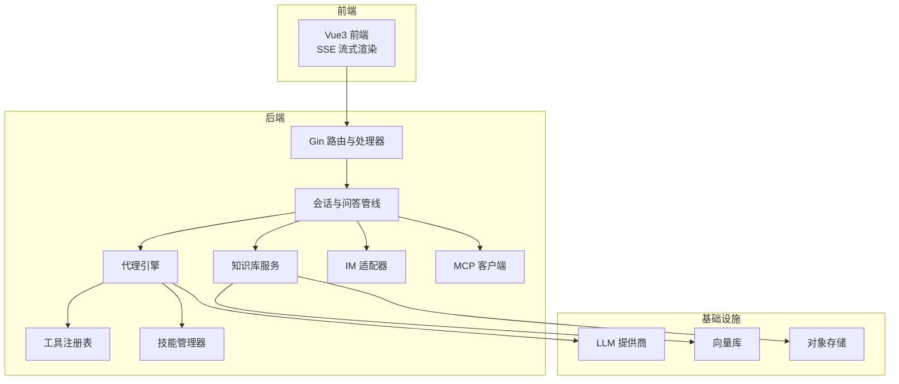
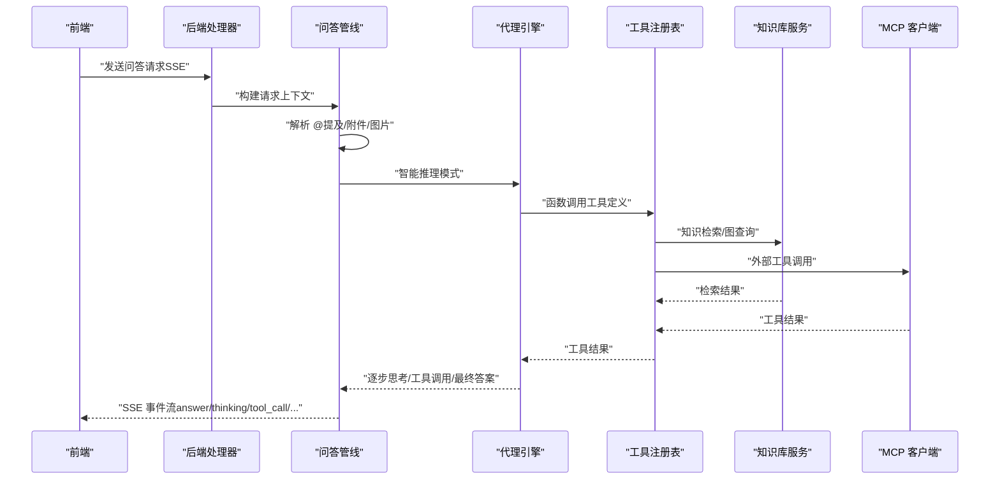
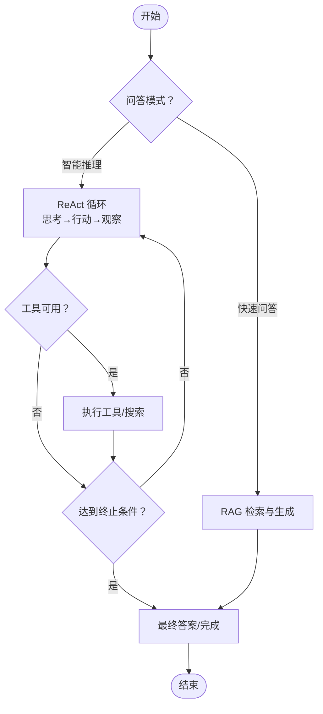
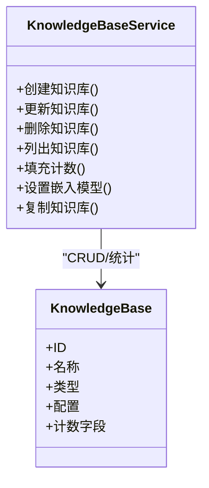
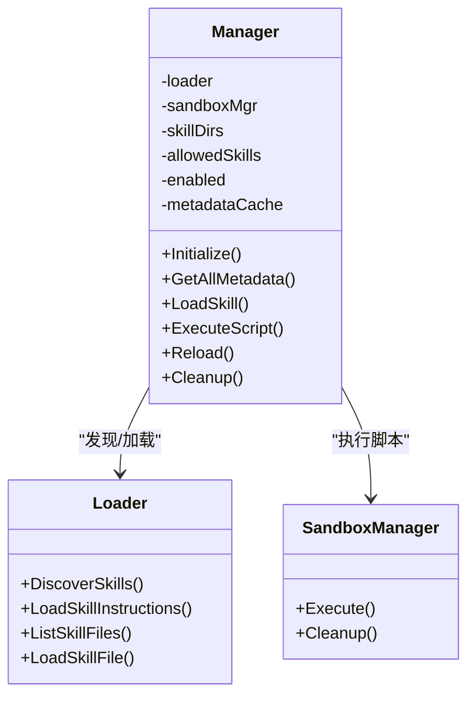
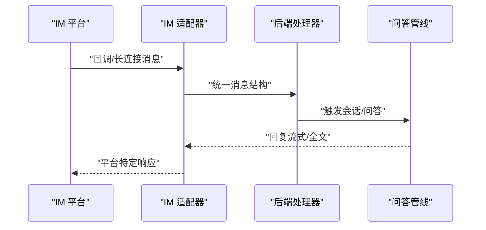
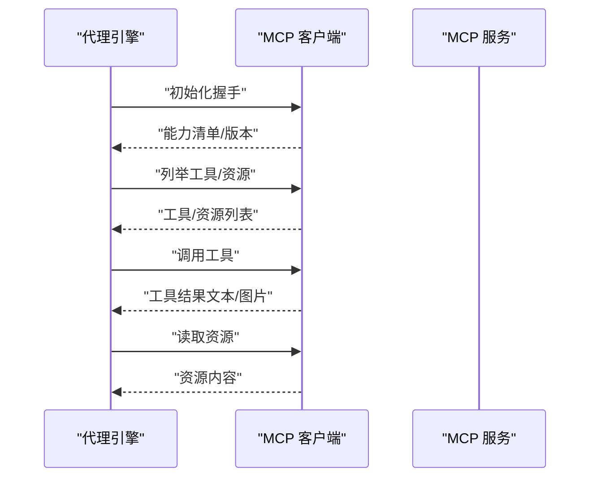
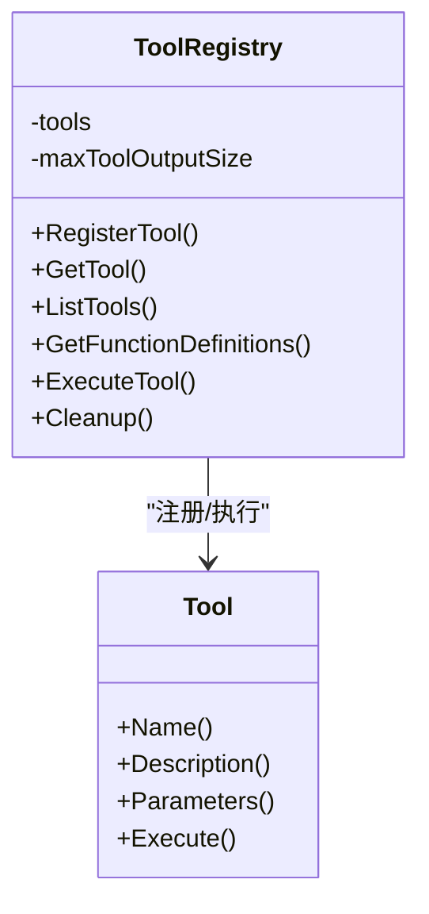
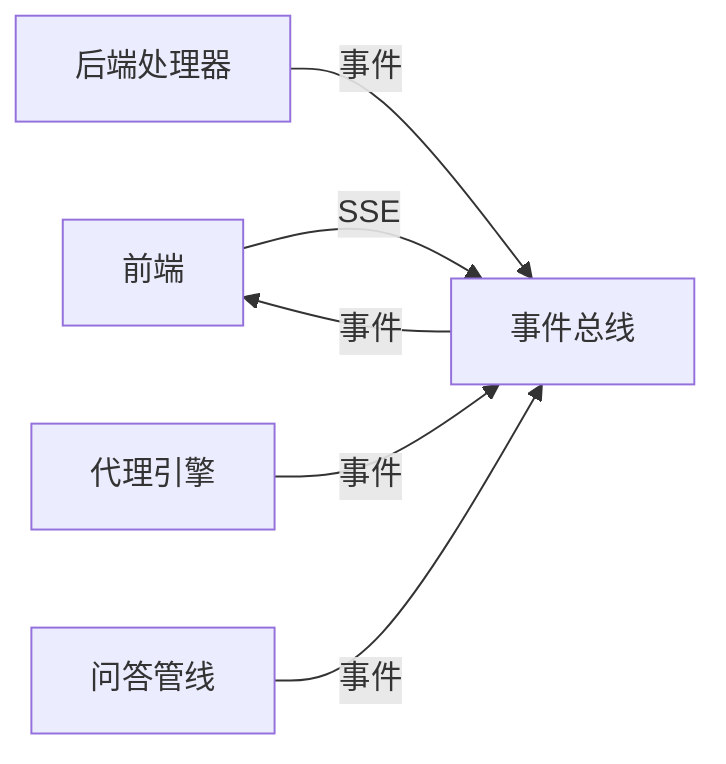

# 核心功能特性

<cite>
**本文引用的文件**
- [README.md](file://README.md)
- [client.go](file://client/client.go)
- [engine.go](file://internal/agent/engine.go)
- [adapter.go](file://internal/im/adapter.go)
- [client.go](file://internal/mcp/client.go)
- [tool.go](file://internal/agent/tools/tool.go)
- [knowledgebase.go](file://internal/application/service/knowledgebase.go)
- [skill_service.go](file://internal/application/service/skill_service.go)
- [qa.go](file://internal/handler/session/qa.go)
- [config.yaml](file://config/config.yaml)
- [builtin_agents.yaml](file://config/builtin_agents.yaml)
- [index.vue](file://frontend/src/views/chat/index.vue)
- [IMChannelPanel.vue](file://frontend/src/components/IMChannelPanel.vue)
- [manager.go](file://internal/agent/skills/manager.go)
- [registry.go](file://internal/agent/tools/registry.go)
</cite>

## 目录
1. [简介](#简介)
2. [项目结构](#项目结构)
3. [核心组件](#核心组件)
4. [架构总览](#架构总览)
5. [详细组件分析](#详细组件分析)
6. [依赖关系分析](#依赖关系分析)
7. [性能考量](#性能考量)
8. [故障排查指南](#故障排查指南)
9. [结论](#结论)
10. [附录](#附录)

## 简介
WeKnora 是面向企业级的智能知识管理与问答框架，提供两类问答模式：快速问答（Quick Q&A）与智能推理（Intelligent Reasoning）。前者基于 RAG 管线，强调检索与生成的高效结合；后者采用 ReAct Agent 引擎，通过“思考-行动-观察”的迭代策略，自主编排知识检索、MCP 工具与网络搜索，逐步达成最终结论。系统支持多来源知识导入（如飞书、Notion）、多格式文档解析、多模态图像处理、多平台即时通讯（IM）集成、MCP 服务扩展、以及可插拔的 LLM/向量库/存储后端。

## 项目结构
WeKnora 采用分层与模块化设计，后端以 Go 实现，前端基于 Vue3 + TypeScript，服务端通过 Gin 提供 REST API，同时提供桌面端应用入口。核心模块包括：
- 会话与问答管线：处理普通问答与智能推理模式的统一执行路径
- 知识库与检索：支持 FAQ/文档知识库、多种检索策略与索引配置
- 代理技能系统：预加载技能与沙箱执行，按需注入系统提示
- 即时通讯集成：适配多平台 IM，支持长连接/Webhook/扫码登录等模式
- MCP 服务集成：通过标准协议连接外部工具与资源
- 前端交互：SSE 流式渲染、推荐问题、附件与图片上传、嵌入式会话等

图表来源
- [index.vue](file://frontend/src/views/chat/index.vue)
- [qa.go](file://internal/handler/session/qa.go)
- [engine.go](file://internal/agent/engine.go)
- [registry.go](file://internal/agent/tools/registry.go)
- [manager.go](file://internal/agent/skills/manager.go)
- [knowledgebase.go](file://internal/application/service/knowledgebase.go)
- [adapter.go](file://internal/im/adapter.go)
- [client.go](file://internal/mcp/client.go)

章节来源
- [README.md](file://README.md)
- [index.vue](file://frontend/src/views/chat/index.vue)
- [qa.go](file://internal/handler/session/qa.go)

## 核心组件
- 智能问答系统
  - 快速问答（RAG）：基于知识库检索与生成，适合日常问答
  - 智能推理（ReAct Agent）：多轮迭代、工具调用、网络搜索，适合复杂任务
- 知识管理系统
  - 支持 FAQ/文档两类知识库，多格式解析与增量同步
  - 多种检索策略（BM25/稠密向量/图RAG/父子块）
- 代理技能系统
  - 预加载技能目录发现、白名单控制、沙箱执行
- 即时通讯集成
  - WeCom/飞书/Slack/Telegram/DingTalk/Mattermost/微信
  - 支持长连接/Webhook/扫码登录，文件消息入库
- MCP 服务集成
  - SSE/HTTP 可流式传输，自动重连，安全禁用 Stdio 传输
- 前端交互
  - SSE 事件驱动渲染、推荐问题、附件/图片上传、嵌入式会话

章节来源
- [README.md](file://README.md)
- [builtin_agents.yaml](file://config/builtin_agents.yaml)
- [config.yaml](file://config/config.yaml)

## 架构总览
WeKnora 的整体架构围绕“统一会话与问答管线”展开：前端通过 SSE 订阅后端事件，后端根据模式选择普通问答或智能推理路径；推理路径通过代理引擎组织工具调用与检索，工具与技能通过注册表与管理器协调，知识库服务负责检索与计数，IM 与 MCP 分别负责外部通道与外部工具扩展。

图表来源
- [qa.go](file://internal/handler/session/qa.go)
- [engine.go](file://internal/agent/engine.go)
- [registry.go](file://internal/agent/tools/registry.go)
- [knowledgebase.go](file://internal/application/service/knowledgebase.go)
- [client.go](file://internal/mcp/client.go)

章节来源
- [qa.go](file://internal/handler/session/qa.go)
- [engine.go](file://internal/agent/engine.go)

## 详细组件分析

### 智能问答系统（Quick Q&A 与智能推理）
- 快速问答（RAG）
  - 能力：基于知识库的语义检索、重排序、摘要生成
  - 技术要点：检索阈值、TopK、重排序、回退策略、系统提示模板
  - 场景：日常知识问答、FAQ 直答优先
- 智能推理（ReAct Agent）
  - 能力：多轮思考、工具调用、网络搜索、最终答案
  - 技术要点：最大迭代次数、上下文窗口管理、并发工具调用、VLM 图像描述、Langfuse 追踪
  - 场景：复杂任务合成、跨源检索与验证

图表来源
- [engine.go](file://internal/agent/engine.go)
- [qa.go](file://internal/handler/session/qa.go)
- [builtin_agents.yaml](file://config/builtin_agents.yaml)

章节来源
- [engine.go](file://internal/agent/engine.go)
- [qa.go](file://internal/handler/session/qa.go)
- [builtin_agents.yaml](file://config/builtin_agents.yaml)
- [config.yaml](file://config/config.yaml)

### 知识管理系统
- 知识库类型：FAQ 与文档
- 导入与解析：多格式支持、增量/全量同步、解析器与存储引擎可配置
- 检索策略：BM25、稠密向量、图RAG、父子块、多维索引
- 管理能力：创建/更新/删除、计数统计、处理中状态、Pin 置顶、嵌入模型切换

图表来源
- [knowledgebase.go](file://internal/application/service/knowledgebase.go)

章节来源
- [knowledgebase.go](file://internal/application/service/knowledgebase.go)

### 代理技能系统
- 能力列表
  - 技能发现与缓存
  - 白名单控制与权限过滤
  - 沙箱执行与隔离
  - 指令注入（系统提示）
- 技术实现
  - 管理器负责生命周期与执行；加载器负责文件系统扫描；沙箱负责脚本执行
  - 支持按需读取技能文件、列出文件、执行脚本并返回结果
- 使用场景
  - 数据分析、Wiki 编辑、自定义工具链等

图表来源
- [manager.go](file://internal/agent/skills/manager.go)
- [skill_service.go](file://internal/application/service/skill_service.go)

章节来源
- [manager.go](file://internal/agent/skills/manager.go)
- [skill_service.go](file://internal/application/service/skill_service.go)

### 即时通讯集成
- 支持平台：WeCom、飞书、Slack、Telegram、钉钉、Mattermost、微信
- 模式：WebSocket/Webhook/长轮询/扫码登录
- 功能：会话模式（用户/话题线程）、文件消息入库、引用回复上下文注入、流式输出
- 前端面板：可视化配置回调地址、凭证绑定、启用/禁用、编辑/删除

图表来源
- [adapter.go](file://internal/im/adapter.go)
- [IMChannelPanel.vue](file://frontend/src/components/IMChannelPanel.vue)

章节来源
- [adapter.go](file://internal/im/adapter.go)
- [IMChannelPanel.vue](file://frontend/src/components/IMChannelPanel.vue)

### MCP 服务集成
- 能力：工具清单、资源读取、工具调用、资源读取
- 传输：SSE/HTTP 可流式传输；自动断线重连；禁用 Stdio 传输
- 安全：鉴权头注入、会话失效检测与主动断开

图表来源
- [client.go](file://internal/mcp/client.go)
- [engine.go](file://internal/agent/engine.go)

章节来源
- [client.go](file://internal/mcp/client.go)

### 工具系统与工具注册表
- 能力：工具注册、参数校验、参数类型转换、执行结果截断、清理资源
- 执行：统一错误提示与重试引导，避免上下文污染

图表来源
- [registry.go](file://internal/agent/tools/registry.go)
- [tool.go](file://internal/agent/tools/tool.go)

章节来源
- [registry.go](file://internal/agent/tools/registry.go)
- [tool.go](file://internal/agent/tools/tool.go)

## 依赖关系分析
- 后端依赖
  - Gin 路由与中间件
  - 事件总线（EventBus）用于 SSE 事件分发
  - Langfuse 追踪（Agent 执行、回合、工具调用）
  - Asynq 异步任务（知识库删除清理）
- 前端依赖
  - SSE 流式订阅
  - Pinia 状态管理
  - TDesign UI 组件库

图表来源
- [qa.go](file://internal/handler/session/qa.go)
- [engine.go](file://internal/agent/engine.go)

章节来源
- [qa.go](file://internal/handler/session/qa.go)
- [engine.go](file://internal/agent/engine.go)

## 性能考量
- 上下文窗口管理：基于上次用量与增量估算，动态裁剪消息，避免超限
- 工具并发：支持并发工具调用，提升复杂任务处理速度
- 检索优化：混合检索（向量+关键词）、重排序、父-子块策略
- 异步清理：知识库删除通过异步任务清理向量与文件，降低主流程阻塞
- SSE 流式：前后端均采用流式传输，减少等待时间

## 故障排查指南
- 常见问题
  - 代理模式无输出：检查工具可用性、MCP 连接状态、会话上下文
  - 知识库检索命中率低：调整阈值、TopK、索引策略或增加嵌入维度
  - IM 回调失败：核对平台凭证、回调地址、签名/加密配置
  - 工具执行报错：查看参数校验与类型转换、输出截断、错误提示
- 建议
  - 启用 Langfuse 追踪定位 Agent 执行瓶颈
  - 使用 SSE 事件流观察工具调用与检索步骤
  - 对大输出工具开启截断，避免上下文污染

章节来源
- [engine.go](file://internal/agent/engine.go)
- [registry.go](file://internal/agent/tools/registry.go)
- [adapter.go](file://internal/im/adapter.go)

## 结论
WeKnora 通过模块化与可插拔的设计，实现了从知识管理到智能问答再到外部扩展的完整闭环。快速问答与智能推理双轨并行，既能满足高频问答需求，也能应对复杂任务；代理技能系统与 MCP 集成提供了强大的扩展能力；IM 集成与前端交互进一步提升了企业级落地体验。建议在生产环境中结合 Langfuse 追踪、异步任务与合理的检索策略，持续优化性能与稳定性。

## 附录

### 功能对比表
- 快速问答（RAG）
  - 能力：语义检索、重排序、摘要生成、回退策略
  - 适用场景：日常知识问答、FAQ 直答
- 智能推理（ReAct Agent）
  - 能力：多轮思考、工具调用、网络搜索、并发工具、VLM 图像描述
  - 适用场景：复杂任务合成、跨源验证
- 知识库管理
  - 能力：FAQ/文档、多格式解析、增量同步、多维检索、计数统计
  - 适用场景：企业知识沉淀与检索
- 代理技能系统
  - 能力：预加载技能、白名单、沙箱执行、指令注入
  - 适用场景：数据分析、Wiki 编辑、自定义工具链
- 即时通讯集成
  - 能力：多平台适配、长连接/Webhook、文件入库、引用上下文
  - 适用场景：企业内部机器人、客服场景
- MCP 服务集成
  - 能力：工具/资源清单、调用、读取、自动重连
  - 适用场景：外部工具扩展、数据源接入

章节来源
- [README.md](file://README.md)
- [builtin_agents.yaml](file://config/builtin_agents.yaml)
- [config.yaml](file://config/config.yaml)

### 使用流程与界面示意
- 前端会话页（SSE 流式渲染、推荐问题、附件/图片上传）
- IM 渠道面板（可视化配置、凭证绑定、启用/禁用）

章节来源
- [index.vue](file://frontend/src/views/chat/index.vue)
- [IMChannelPanel.vue](file://frontend/src/components/IMChannelPanel.vue)