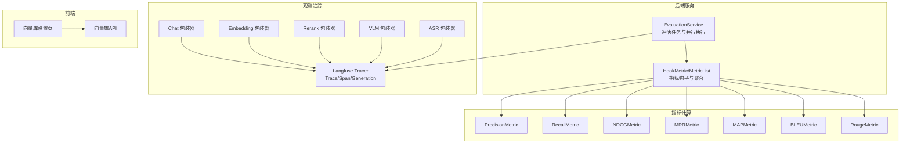
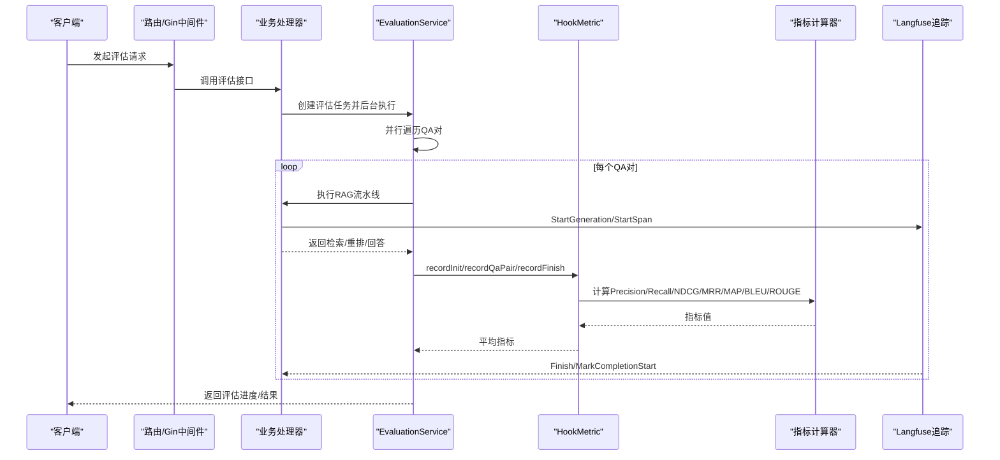
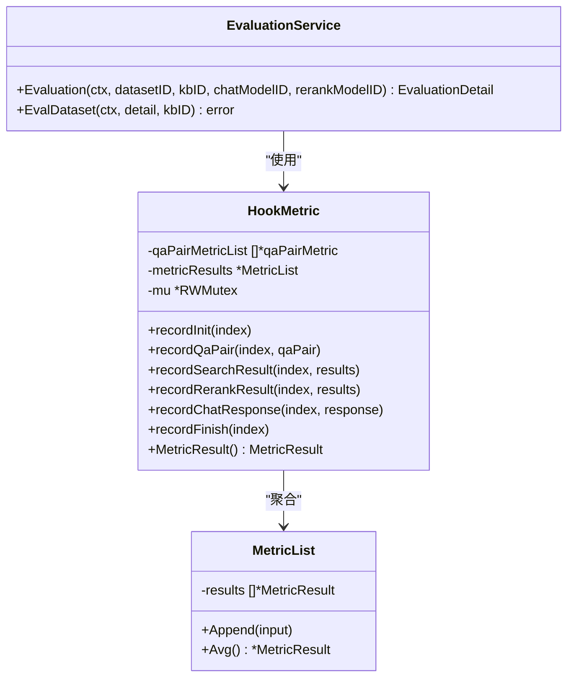
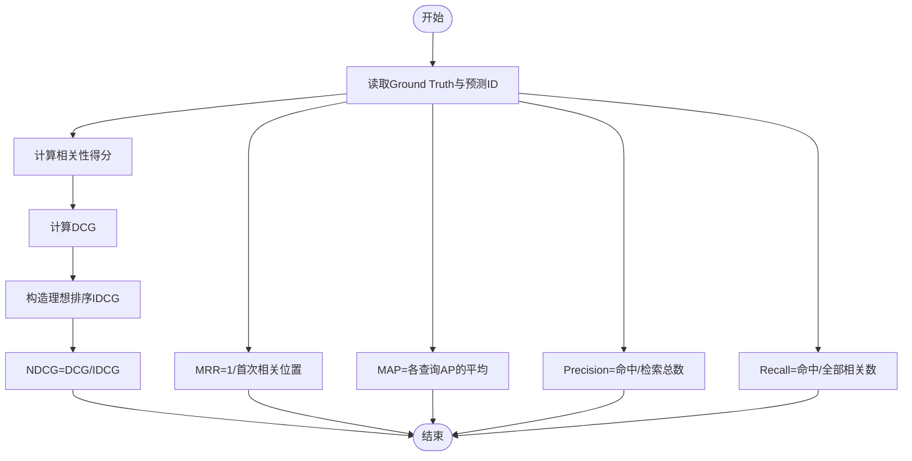
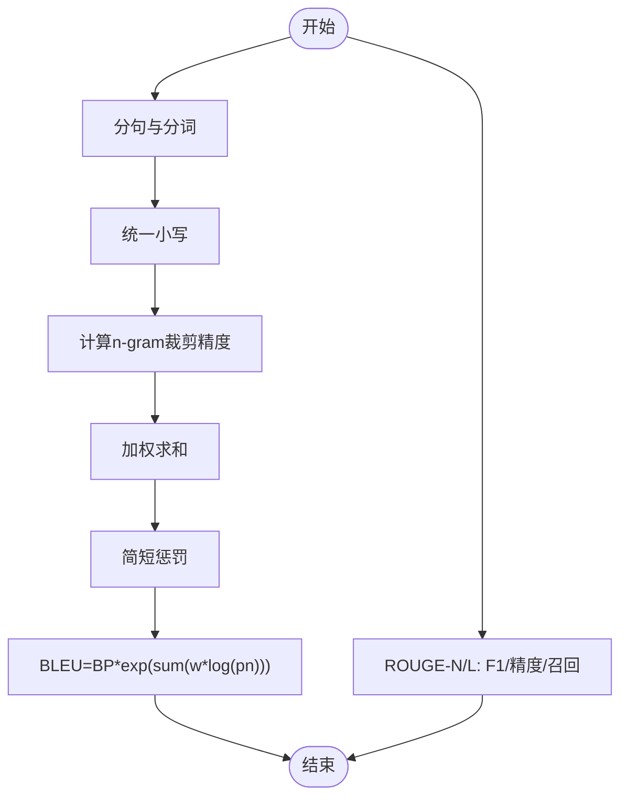
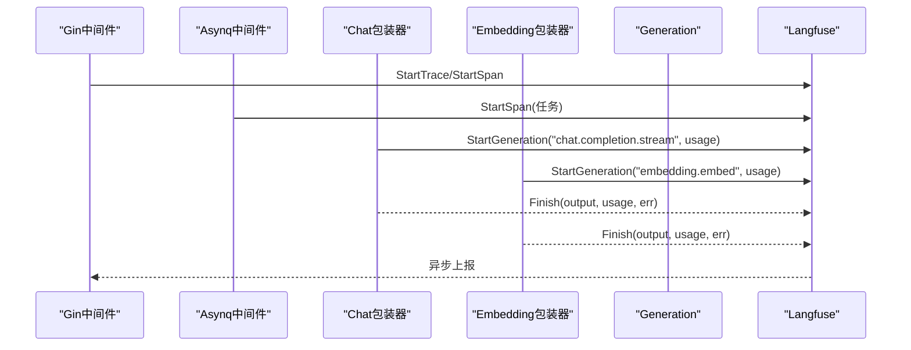
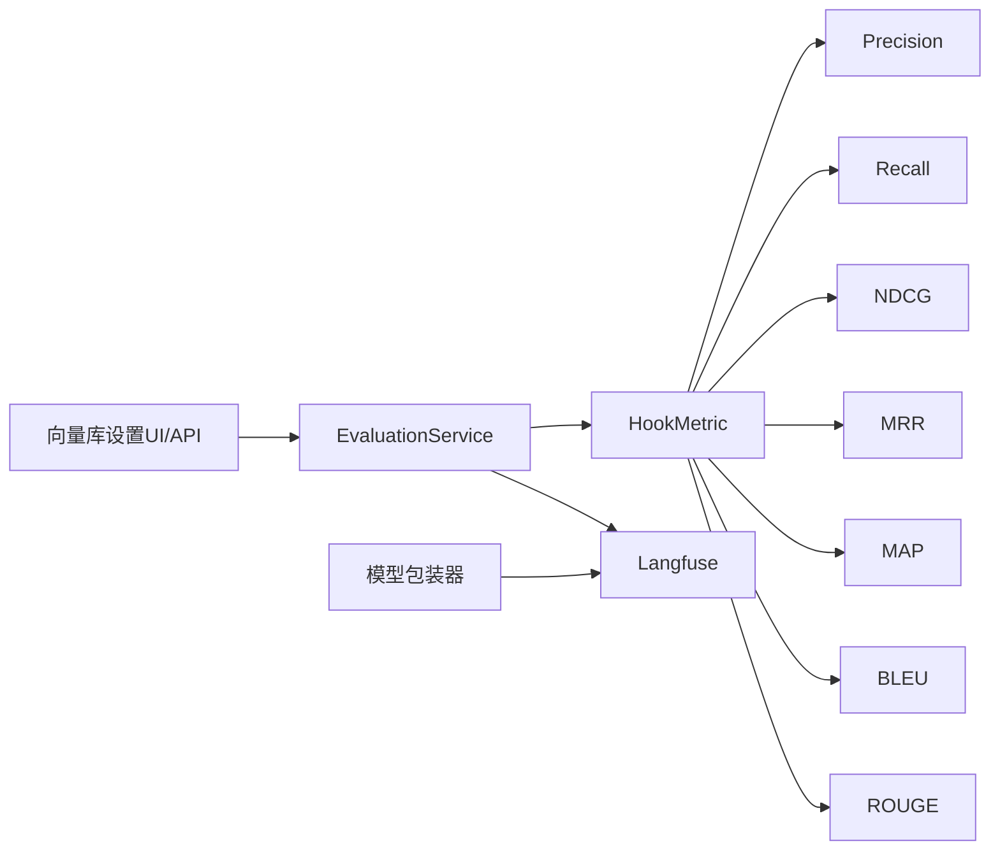

# 性能监控

<cite>
**本文引用的文件**
- [internal/application/service/metric_hook.go](file://internal/application/service/metric_hook.go)
- [internal/application/service/evaluation.go](file://internal/application/service/evaluation.go)
- [internal/application/service/metric/precision.go](file://internal/application/service/metric/precision.go)
- [internal/application/service/metric/recall.go](file://internal/application/service/metric/recall.go)
- [internal/application/service/metric/ndcg.go](file://internal/application/service/metric/ndcg.go)
- [internal/application/service/metric/mrr.go](file://internal/application/service/metric/mrr.go)
- [internal/application/service/metric/map.go](file://internal/application/service/metric/map.go)
- [internal/application/service/metric/bleu.go](file://internal/application/service/metric/bleu.go)
- [internal/application/service/metric/rouge.go](file://internal/application/service/metric/rouge.go)
- [internal/application/service/metric/rouge_score.go](file://internal/application/service/metric/rouge_score.go)
- [internal/types/evaluation.go](file://internal/types/evaluation.go)
- [internal/logger/llm_logger.go](file://internal/logger/llm_logger.go)
- [internal/tracing/langfuse/tracer.go](file://internal/tracing/langfuse/tracer.go)
- [docs/Langfuse集成.md](file://docs/Langfuse集成.md)
- [internal/models/chat/langfuse_wrapper.go](file://internal/models/chat/langfuse_wrapper.go)
- [internal/models/embedding/langfuse_wrapper.go](file://internal/models/embedding/langfuse_wrapper.go)
- [internal/models/rerank/langfuse_wrapper.go](file://internal/models/rerank/langfuse_wrapper.go)
- [internal/models/vlm/langfuse_wrapper.go](file://internal/models/vlm/langfuse_wrapper.go)
- [internal/models/asr/langfuse_wrapper.go](file://internal/models/asr/langfuse_wrapper.go)
- [internal/agent/engine.go](file://internal/agent/engine.go)
- [internal/agent/act.go](file://internal/agent/act.go)
- [internal/router/router.go](file://internal/router/router.go)
- [internal/router/task.go](file://internal/router/task.go)
- [internal/container/container.go](file://internal/container/container.go)
- [migrations/versioned/000019_add_agent_duration_ms.up.sql](file://migrations/versioned/000019_add_agent_duration_ms.up.sql)
- [frontend/src/views/settings/VectorStoreSettings.vue](file://frontend/src/views/settings/VectorStoreSettings.vue)
- [frontend/src/api/vector-store.ts](file://frontend/src/api/vector-store.ts)
- [docs/api/vector-store.md](file://docs/api/vector-store.md)
</cite>

## 目录
1. [简介](#简介)
2. [项目结构](#项目结构)
3. [核心组件](#核心组件)
4. [架构总览](#架构总览)
5. [详细组件分析](#详细组件分析)
6. [依赖关系分析](#依赖关系分析)
7. [性能考量](#性能考量)
8. [故障排查指南](#故障排查指南)
9. [结论](#结论)
10. [附录](#附录)

## 简介
本文件面向WeKnora性能监控体系，围绕以下目标展开：
- 性能指标采集机制：LLM调用时间、向量化性能、检索效率监控
- 指标计算算法：BLEU、ROUGE、精度、召回率、NDCG、MRR、MAP等
- 性能数据存储与分析：历史趋势、性能基线、评估任务状态
- Langfuse集成：性能追踪、生成质量评估、成本分析
- 性能瓶颈识别与优化策略
- 监控仪表板配置与可视化
- 性能告警设置与通知机制
- 性能测试与基准测试最佳实践

## 项目结构
WeKnora的性能监控涉及后端服务、指标计算、观测追踪与前端配置四个层面：
- 后端服务层：评估任务调度、指标钩子、并行处理
- 指标计算层：检索与生成两类指标的独立实现
- 观测追踪层：Langfuse客户端、中间件、模型调用包装器
- 前端配置层：向量库健康检查、测试与可视化入口

图表来源
- [internal/application/service/evaluation.go:331-456](file://internal/application/service/evaluation.go#L331-L456)
- [internal/application/service/metric_hook.go:1-166](file://internal/application/service/metric_hook.go#L1-L166)
- [internal/tracing/langfuse/tracer.go:1-334](file://internal/tracing/langfuse/tracer.go#L1-L334)
- [internal/models/chat/langfuse_wrapper.go:36-85](file://internal/models/chat/langfuse_wrapper.go#L36-L85)
- [frontend/src/views/settings/VectorStoreSettings.vue:454-502](file://frontend/src/views/settings/VectorStoreSettings.vue#L454-L502)

章节来源
- [internal/application/service/evaluation.go:1-477](file://internal/application/service/evaluation.go#L1-L477)
- [internal/application/service/metric_hook.go:1-166](file://internal/application/service/metric_hook.go#L1-L166)
- [docs/Langfuse集成.md:226-309](file://docs/Langfuse集成.md#L226-L309)

## 核心组件
- 评估服务：负责创建评估任务、加载数据集、并行执行问答流水线、记录指标并维护内存态评估详情。
- 指标钩子：在每个QA对上采集检索结果、重排结果、LLM回答，构造指标输入，计算各类指标并做平均。
- 指标计算：独立实现检索类（Precision/Recall/NDCG/MRR/MAP）与生成类（BLEU/ROUGE）指标。
- 观测追踪：Langfuse封装Trace/Span/Generation，自动上报模型调用耗时、Token用量、TTFT等。
- 前端向量库：提供连接测试、版本探测、健康检查，辅助定位向量化性能瓶颈。

章节来源
- [internal/application/service/evaluation.go:128-329](file://internal/application/service/evaluation.go#L128-L329)
- [internal/application/service/metric_hook.go:84-166](file://internal/application/service/metric_hook.go#L84-L166)
- [internal/types/evaluation.go:35-99](file://internal/types/evaluation.go#L35-L99)
- [docs/Langfuse集成.md:226-309](file://docs/Langfuse集成.md#L226-L309)

## 架构总览
WeKnora的性能监控采用“评估驱动 + 观测追踪”的双轨机制：
- 评估驱动：通过EvaluationService对数据集进行并行评测，利用HookMetric收集检索与生成指标，形成历史趋势与基线。
- 观测追踪：Langfuse在HTTP与异步任务层面自动埋点，记录LLM调用、嵌入、重排、VLM、ASR等关键链路的耗时与成本，支持TTFT、Token用量、费用核算。

图表来源
- [internal/application/service/evaluation.go:331-456](file://internal/application/service/evaluation.go#L331-L456)
- [internal/application/service/metric_hook.go:108-159](file://internal/application/service/metric_hook.go#L108-L159)
- [internal/tracing/langfuse/tracer.go:247-334](file://internal/tracing/langfuse/tracer.go#L247-L334)
- [docs/Langfuse集成.md:226-309](file://docs/Langfuse集成.md#L226-L309)

## 详细组件分析

### 评估服务与指标钩子
- 评估服务负责：
  - 生成唯一任务ID、注册内存态任务、后台并发执行
  - 为每个QA对构建Pipeline参数，调用知识QA流水线
  - 通过HookMetric记录检索、重排、回答，计算指标并实时更新进度
- 指标钩子：
  - 支持多指标并行计算，内部以数组容量初始化每对指标
  - 通过Avg()对所有样本的指标取平均，得到最终评估结果
  - 线程安全，使用读写锁保护聚合过程

图表来源
- [internal/application/service/evaluation.go:128-329](file://internal/application/service/evaluation.go#L128-L329)
- [internal/application/service/metric_hook.go:84-166](file://internal/application/service/metric_hook.go#L84-L166)

章节来源
- [internal/application/service/evaluation.go:331-456](file://internal/application/service/evaluation.go#L331-L456)
- [internal/application/service/metric_hook.go:1-166](file://internal/application/service/metric_hook.go#L1-L166)
- [internal/types/evaluation.go:35-99](file://internal/types/evaluation.go#L35-L99)

### 检索指标算法
- 精度（Precision）：相关命中数 / 检索总数
- 召回（Recall）：相关命中数 / 全部相关数
- 归一化折损累积增益（NDCG@k）：DCG/IDCG，考虑排序位置
- 平均倒数排名（MRR）：首个相关项的倒数排名的平均
- 平均精度（MAP）：各查询的精确率平均后的平均

图表来源
- [internal/application/service/metric/ndcg.go:19-78](file://internal/application/service/metric/ndcg.go#L19-L78)
- [internal/application/service/metric/mrr.go:15-47](file://internal/application/service/metric/mrr.go#L15-L47)
- [internal/application/service/metric/map.go:15-48](file://internal/application/service/metric/map.go#L15-L48)
- [internal/application/service/metric/precision.go:15-44](file://internal/application/service/metric/precision.go#L15-L44)
- [internal/application/service/metric/recall.go:15-41](file://internal/application/service/metric/recall.go#L15-L41)

章节来源
- [internal/application/service/metric/precision.go:1-45](file://internal/application/service/metric/precision.go#L1-L45)
- [internal/application/service/metric/recall.go:1-42](file://internal/application/service/metric/recall.go#L1-L42)
- [internal/application/service/metric/ndcg.go:1-79](file://internal/application/service/metric/ndcg.go#L1-L79)
- [internal/application/service/metric/mrr.go:1-48](file://internal/application/service/metric/mrr.go#L1-L48)
- [internal/application/service/metric/map.go:1-49](file://internal/application/service/metric/map.go#L1-L49)

### 生成指标算法
- BLEU：n-gram匹配的裁剪精度加权几何平均，结合简短惩罚
- ROUGE：基于n-gram或最长公共子序列的F1/精度/召回统计

图表来源
- [internal/application/service/metric/bleu.go:47-165](file://internal/application/service/metric/bleu.go#L47-L165)
- [internal/application/service/metric/rouge.go:47-72](file://internal/application/service/metric/rouge.go#L47-L72)
- [internal/application/service/metric/rouge_score.go:201-250](file://internal/application/service/metric/rouge_score.go#L201-L250)

章节来源
- [internal/application/service/metric/bleu.go:1-166](file://internal/application/service/metric/bleu.go#L1-L166)
- [internal/application/service/metric/rouge.go:1-73](file://internal/application/service/metric/rouge.go#L1-L73)
- [internal/application/service/metric/rouge_score.go:192-250](file://internal/application/service/metric/rouge_score.go#L192-L250)

### Langfuse集成与性能追踪
- Trace/Span/Generation概念映射与注入：Trace对应一次HTTP请求及异步任务；Span对应异步任务/Agent执行/工具调用；Generation对应模型调用（聊天、嵌入、重排、VLM、ASR）。
- Token用量与TTFT：聊天流式请求记录首token时间；嵌入/重排/VLM/ASR按各自规则估算或上报usage。
- 包装器：各模型调用通过Langfuse包装器自动StartGeneration/Finish，携带输入、输出、参数、usage等。
- 中间件：Gin中间件与Asynq中间件自动包裹请求与任务，确保上下文传播与ID注入。

图表来源
- [docs/Langfuse集成.md:226-309](file://docs/Langfuse集成.md#L226-L309)
- [internal/tracing/langfuse/tracer.go:247-334](file://internal/tracing/langfuse/tracer.go#L247-L334)
- [internal/models/chat/langfuse_wrapper.go:36-85](file://internal/models/chat/langfuse_wrapper.go#L36-L85)
- [internal/models/embedding/langfuse_wrapper.go](file://internal/models/embedding/langfuse_wrapper.go)
- [internal/models/rerank/langfuse_wrapper.go](file://internal/models/rerank/langfuse_wrapper.go)
- [internal/models/vlm/langfuse_wrapper.go](file://internal/models/vlm/langfuse_wrapper.go)
- [internal/models/asr/langfuse_wrapper.go](file://internal/models/asr/langfuse_wrapper.go)
- [internal/agent/engine.go](file://internal/agent/engine.go)
- [internal/agent/act.go](file://internal/agent/act.go)
- [internal/router/router.go](file://internal/router/router.go)
- [internal/router/task.go](file://internal/router/task.go)
- [internal/container/container.go](file://internal/container/container.go)

章节来源
- [docs/Langfuse集成.md:226-309](file://docs/Langfuse集成.md#L226-L309)
- [internal/tracing/langfuse/tracer.go:1-334](file://internal/tracing/langfuse/tracer.go#L1-L334)

### 向量库性能与健康检查
- 前端提供向量库连接测试与版本探测，支持对已保存与环境变量存储进行测试。
- 后端API提供测试接口，成功时返回服务器版本并更新记录中的版本字段。
- 该能力可用于定位向量化阶段的延迟与可用性问题。

章节来源
- [frontend/src/views/settings/VectorStoreSettings.vue:454-502](file://frontend/src/views/settings/VectorStoreSettings.vue#L454-L502)
- [frontend/src/api/vector-store.ts:50-64](file://frontend/src/api/vector-store.ts#L50-L64)
- [docs/api/vector-store.md:310-340](file://docs/api/vector-store.md#L310-L340)

## 依赖关系分析
- 评估服务依赖指标钩子与指标计算器，后者实现具体算法。
- 指标输入来自评估服务的QA对、检索结果、重排结果与LLM回答。
- 观测追踪贯穿HTTP与异步任务，模型调用通过包装器接入Langfuse。
- 前端向量库设置与API为性能诊断提供入口。

图表来源
- [internal/application/service/evaluation.go:331-456](file://internal/application/service/evaluation.go#L331-L456)
- [internal/application/service/metric_hook.go:1-166](file://internal/application/service/metric_hook.go#L1-L166)
- [internal/tracing/langfuse/tracer.go:1-334](file://internal/tracing/langfuse/tracer.go#L1-L334)
- [frontend/src/views/settings/VectorStoreSettings.vue:454-502](file://frontend/src/views/settings/VectorStoreSettings.vue#L454-L502)

章节来源
- [internal/application/service/evaluation.go:1-477](file://internal/application/service/evaluation.go#L1-L477)
- [internal/application/service/metric_hook.go:1-166](file://internal/application/service/metric_hook.go#L1-L166)

## 性能考量
- 并行度控制：评估阶段使用errgroup限制并发，CPU核数减1，避免过度竞争。
- 指标计算复杂度：检索指标主要为集合操作与排序，生成指标涉及n-gram统计与平滑，整体以线性或近似线性复杂度为主。
- 观测开销：Langfuse批量上报与采样控制，建议在生产环境合理配置采样率与字段大小，避免大体积payload影响性能。
- 存储与趋势：评估结果以内存态维护，适合短期趋势分析；长期基线建议持久化至数据库或外部时序库。

章节来源
- [internal/application/service/evaluation.go:380-389](file://internal/application/service/evaluation.go#L380-L389)
- [internal/logger/llm_logger.go:1-248](file://internal/logger/llm_logger.go#L1-L248)

## 故障排查指南
- LLM调试日志：通过环境变量启用LLM调试日志，按请求ID落盘，便于复盘调用细节与耗时。
- 向量库健康检查：前端测试接口可快速判断连接与版本，定位向量化阶段异常。
- 观测追踪：确认Gin与Asynq中间件已注册，Langfuse客户端初始化成功，trace_id与parent_obs_id正确注入。

章节来源
- [internal/logger/llm_logger.go:23-81](file://internal/logger/llm_logger.go#L23-L81)
- [frontend/src/views/settings/VectorStoreSettings.vue:475-500](file://frontend/src/views/settings/VectorStoreSettings.vue#L475-L500)
- [docs/Langfuse集成.md:291-308](file://docs/Langfuse集成.md#L291-L308)

## 结论
WeKnora的性能监控体系通过“评估驱动 + 观测追踪”双轨机制，实现了从检索到生成的全链路指标采集与成本分析。评估服务与指标钩子提供了可扩展的评测框架，Langfuse则为生产环境提供了可观测性与成本洞察。配合前端向量库健康检查与调试日志，能够快速定位性能瓶颈并制定优化策略。

## 附录

### 性能数据存储与分析
- 评估结果：当前以内存态存储，适合短期趋势与基线对比；建议引入持久化以支持跨版本比较。
- 指标字段：包含检索类（Precision/Recall/NDCG@3/10/MRR/MAP）与生成类（BLEU-1/2/4、ROUGE-1/2/L）。
- 历史趋势：可通过定期拉取评估任务结果，绘制指标随时间变化曲线。

章节来源
- [internal/types/evaluation.go:59-85](file://internal/types/evaluation.go#L59-L85)
- [internal/application/service/evaluation.go:448-456](file://internal/application/service/evaluation.go#L448-L456)

### Langfuse集成要点
- Trace/Span/Generation概念映射与字段：用户ID、会话ID、Token用量、TTFT、模型参数等。
- 包装器覆盖：聊天、嵌入、重排、VLM、ASR均提供包装器，确保观测覆盖面。
- 中间件：HTTP与异步任务中间件自动注入上下文，保证树形结构清晰。

章节来源
- [docs/Langfuse集成.md:226-309](file://docs/Langfuse集成.md#L226-L309)
- [internal/tracing/langfuse/tracer.go:1-334](file://internal/tracing/langfuse/tracer.go#L1-L334)

### 监控仪表板与可视化
- 建议在前端或外部BI平台展示：
  - 评估任务进度与完成状态
  - 指标滚动均值（Precision/Recall/NDCG/MAP/BLEU/ROUGE）
  - LLM调用耗时分布、TTFT分布、Token用量分布
  - 向量库连接成功率与版本信息
- 可视化维度：按租户、模型、KB、时间窗口聚合。

[本节为通用建议，不直接分析具体文件]

### 性能告警与通知
- 告警阈值建议：
  - 检索：Precision/Recall显著下降（如相对上周下降≥10%）、MRR/MAP下降
  - 生成：BLEU/ROUGE下降、TTFT异常升高、Token用量异常增长
  - 成本：按模型单价与Token用量计算的费用环比增长
- 通知渠道：邮件、IM群组、Webhook
- 触发条件：连续N个周期内超过阈值或绝对值越界

[本节为通用建议，不直接分析具体文件]

### 性能测试与基准测试最佳实践
- 数据集：构建稳定、可重复的QA数据集，覆盖不同领域与难度
- 指标组合：同时关注检索与生成指标，避免单一指标误导
- 基线建立：固定模型与向量库配置，长期记录指标均值与方差
- 压力测试：逐步提升并发与数据规模，观察吞吐与延迟拐点
- 回归测试：每次模型/向量库升级后运行基准测试，确保回归可控

[本节为通用建议，不直接分析具体文件]