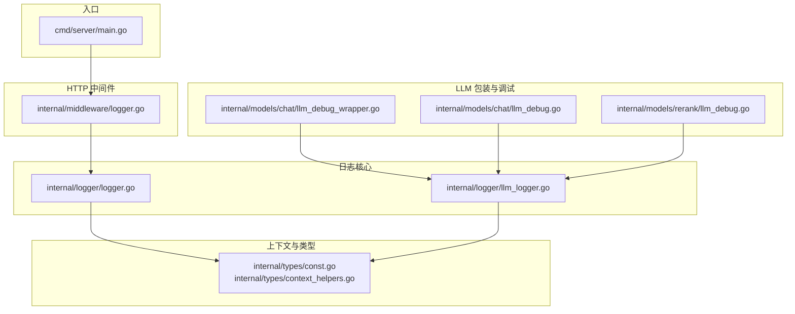
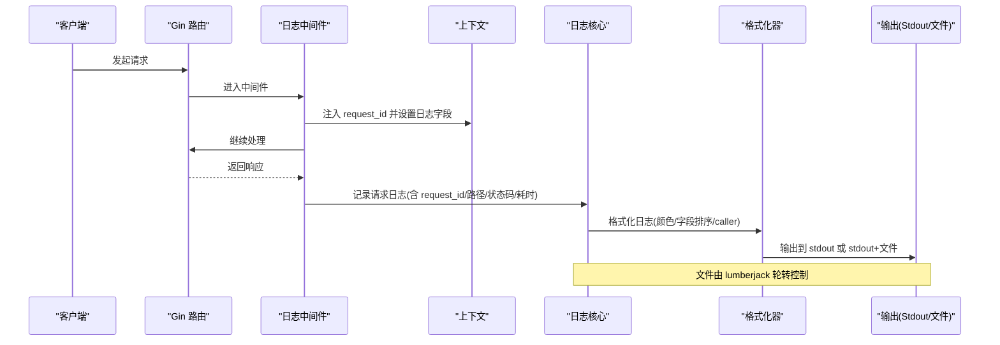
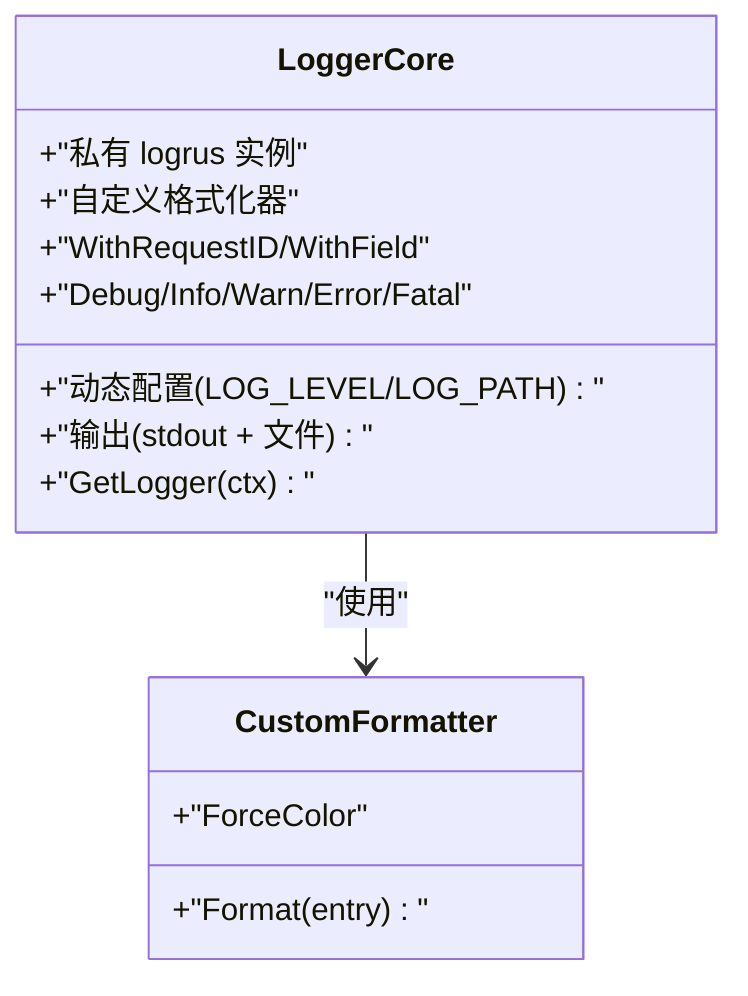
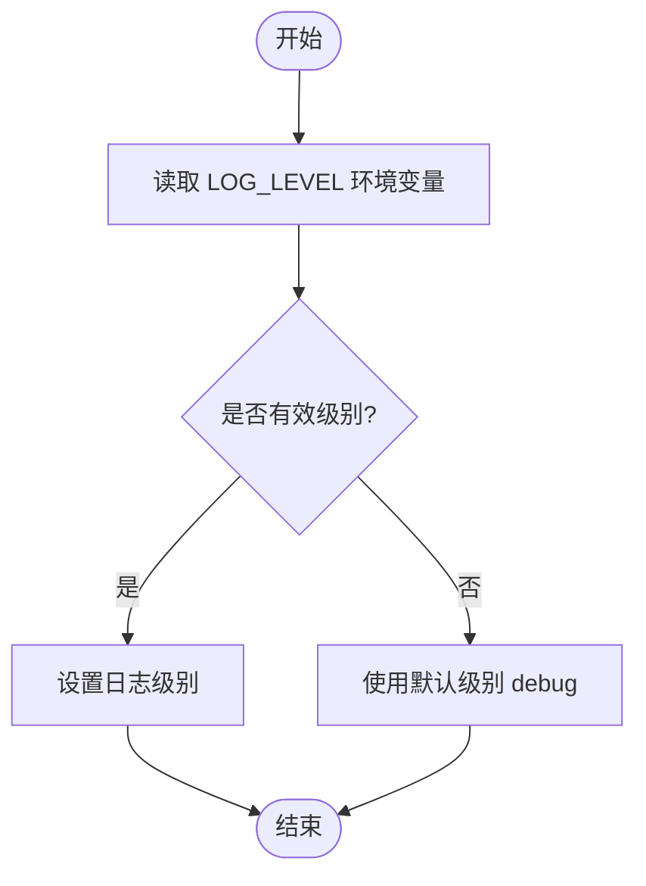
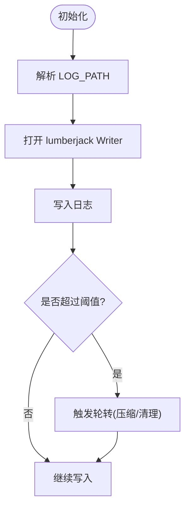
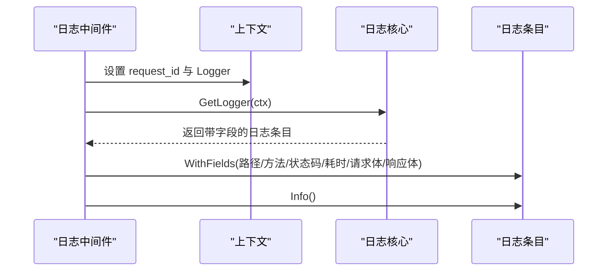
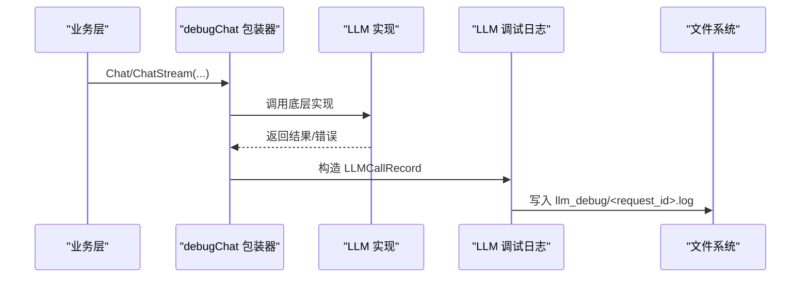
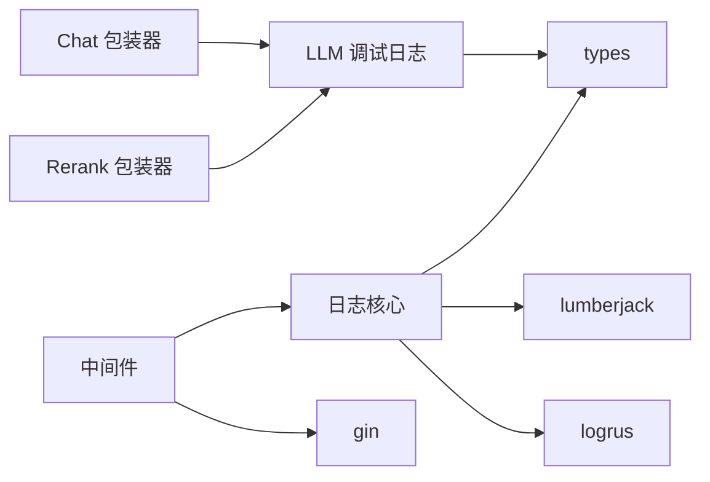

# 日志系统

<cite>
**本文引用的文件**
- [internal/logger/logger.go](file://internal/logger/logger.go)
- [internal/logger/llm_logger.go](file://internal/logger/llm_logger.go)
- [internal/middleware/logger.go](file://internal/middleware/logger.go)
- [internal/models/chat/llm_debug.go](file://internal/models/chat/llm_debug.go)
- [internal/models/chat/llm_debug_wrapper.go](file://internal/models/chat/llm_debug_wrapper.go)
- [internal/models/rerank/llm_debug.go](file://internal/models/rerank/llm_debug.go)
- [internal/types/context_helpers.go](file://internal/types/context_helpers.go)
- [internal/types/const.go](file://internal/types/const.go)
- [cmd/server/main.go](file://cmd/server/main.go)
</cite>

## 目录
1. [简介](#简介)
2. [项目结构](#项目结构)
3. [核心组件](#核心组件)
4. [架构总览](#架构总览)
5. [详细组件分析](#详细组件分析)
6. [依赖分析](#依赖分析)
7. [性能考虑](#性能考虑)
8. [故障排查指南](#故障排查指南)
9. [结论](#结论)
10. [附录](#附录)

## 简介
本文件系统性阐述 WeKnora 的结构化日志体系，覆盖以下主题：
- logrus 集成与自定义格式化器、ANSI 颜色支持
- 日志级别管理（DEBUG/INFO/WARN/ERROR/FATAL）
- 日志轮转机制（lumberjack 库、文件大小限制与保留策略）
- 上下文传递的日志记录（request_id 跟踪、caller 信息捕获）
- 日志配置最佳实践（环境变量、生产部署）
- LLM 调用的日志记录与分析（专用调试目录、按请求聚合）
- 格式化器定制与调试技巧

## 项目结构
WeKnora 的日志系统主要分布在如下模块：
- 核心日志模块：internal/logger
- Web 请求日志中间件：internal/middleware
- LLM 调试日志与包装器：internal/models/chat、internal/models/rerank
- 上下文键定义与辅助：internal/types
- 服务端入口：cmd/server

图表来源
- [internal/logger/logger.go:1-414](file://internal/logger/logger.go#L1-L414)
- [internal/logger/llm_logger.go:1-248](file://internal/logger/llm_logger.go#L1-L248)
- [internal/middleware/logger.go:1-236](file://internal/middleware/logger.go#L1-L236)
- [internal/models/chat/llm_debug_wrapper.go:1-77](file://internal/models/chat/llm_debug_wrapper.go#L1-L77)
- [internal/models/chat/llm_debug.go:1-215](file://internal/models/chat/llm_debug.go#L1-L215)
- [internal/models/rerank/llm_debug.go:1-71](file://internal/models/rerank/llm_debug.go#L1-L71)
- [internal/types/const.go:1-35](file://internal/types/const.go#L1-L35)
- [internal/types/context_helpers.go:1-113](file://internal/types/context_helpers.go#L1-L113)
- [cmd/server/main.go:1-124](file://cmd/server/main.go#L1-L124)

章节来源
- [internal/logger/logger.go:1-414](file://internal/logger/logger.go#L1-L414)
- [internal/logger/llm_logger.go:1-248](file://internal/logger/llm_logger.go#L1-L248)
- [internal/middleware/logger.go:1-236](file://internal/middleware/logger.go#L1-L236)
- [internal/models/chat/llm_debug_wrapper.go:1-77](file://internal/models/chat/llm_debug_wrapper.go#L1-L77)
- [internal/models/chat/llm_debug.go:1-215](file://internal/models/chat/llm_debug.go#L1-L215)
- [internal/models/rerank/llm_debug.go:1-71](file://internal/models/rerank/llm_debug.go#L1-L71)
- [internal/types/const.go:1-35](file://internal/types/const.go#L1-L35)
- [internal/types/context_helpers.go:1-113](file://internal/types/context_helpers.go#L1-L113)
- [cmd/server/main.go:1-124](file://cmd/server/main.go#L1-L124)

## 核心组件
- 结构化日志核心
  - 使用 logrus 实例化私有 logger，避免污染全局状态
  - 自定义格式化器，支持 ANSI 颜色、字段排序、request_id 优先显示、caller 信息
  - 支持从环境变量动态配置日志级别与输出路径（stdout + 文件）
  - 提供基于上下文的便捷日志 API（Debug/Info/Warn/Error/Fatal 等）
- 日志轮转
  - 基于 lumberjack，按大小轮转、保留数量与压缩
- 上下文与请求追踪
  - 中间件注入 request_id，并将其放入上下文与日志字段
  - 日志自动追加 caller 信息（文件:行号[函数]）
- LLM 调试日志
  - 通过环境变量启用专用调试目录，按 request_id 聚合输出
  - 包装器对 Chat/Rerank 等调用进行完整记录（消息、选项、工具、用量、错误）

章节来源
- [internal/logger/logger.go:20-414](file://internal/logger/logger.go#L20-L414)
- [internal/logger/llm_logger.go:13-248](file://internal/logger/llm_logger.go#L13-L248)
- [internal/middleware/logger.go:108-236](file://internal/middleware/logger.go#L108-L236)
- [internal/models/chat/llm_debug_wrapper.go:13-77](file://internal/models/chat/llm_debug_wrapper.go#L13-L77)
- [internal/models/chat/llm_debug.go:115-215](file://internal/models/chat/llm_debug.go#L115-L215)
- [internal/models/rerank/llm_debug.go:27-71](file://internal/models/rerank/llm_debug.go#L27-L71)

## 架构总览
下面的序列图展示了从 HTTP 请求到日志记录的关键流程，包括请求 ID 注入、日志格式化、LLM 调试记录与轮转输出。

图表来源
- [internal/middleware/logger.go:108-236](file://internal/middleware/logger.go#L108-L236)
- [internal/logger/logger.go:140-184](file://internal/logger/logger.go#L140-L184)
- [internal/logger/logger.go:276-290](file://internal/logger/logger.go#L276-L290)

## 详细组件分析

### 日志核心与格式化器
- 设计要点
  - 私有 logrus 实例，避免外部修改全局状态
  - 自定义格式化器，支持：
    - ANSI 颜色：不同级别使用不同颜色
    - 字段排序：除 request_id 优先外，其余字段按键排序输出
    - caller 信息：自动捕获文件、行号与函数名
    - 非终端禁用颜色：避免容器日志收集异常
  - 动态配置：从环境变量读取 LOG_LEVEL 与 LOG_PATH，支持运行时重新应用
  - 输出目标：默认 stdout；当 LOG_PATH 指定有效路径时，同时写入文件（lumberjack）
- 关键 API
  - GetLogger(ctx)：从上下文获取带字段的日志条目
  - WithRequestID/WithField/WithFields：向上下文注入 request_id 与其他字段
  - Debug/Info/Warn/Error/Fatal 系列：自动添加 caller 并输出
  - SetLogLevel/SetOutput：运行时调整级别或输出目标（测试场景）

图表来源
- [internal/logger/logger.go:20-184](file://internal/logger/logger.go#L20-L184)
- [internal/logger/logger.go:186-414](file://internal/logger/logger.go#L186-L414)

章节来源
- [internal/logger/logger.go:20-184](file://internal/logger/logger.go#L20-L184)
- [internal/logger/logger.go:186-414](file://internal/logger/logger.go#L186-L414)

### 日志级别管理
- 支持级别：debug/info/warn/error/fatal
- 配置来源
  - 环境变量 LOG_LEVEL：支持字符串值（大小写不敏感）
  - 运行时 API：SetLogLevel
- 默认行为：无效配置时回退到 debug

图表来源
- [internal/logger/logger.go:226-245](file://internal/logger/logger.go#L226-L245)

章节来源
- [internal/logger/logger.go:226-245](file://internal/logger/logger.go#L226-L245)

### 日志轮转机制
- 使用 lumberjack
  - 文件大小上限：50 MB
  - 保留备份数：3 个
  - 保留时间：28 天
  - 压缩：开启
- 自动创建目录，按 LOG_PATH 写入
- macOS 桌面应用默认日志路径：用户主目录 Library/Logs/<App>/App.log

图表来源
- [internal/logger/logger.go:247-290](file://internal/logger/logger.go#L247-L290)

章节来源
- [internal/logger/logger.go:247-290](file://internal/logger/logger.go#L247-L290)

### 上下文传递与请求追踪
- 中间件职责
  - 生成或读取 X-Request-ID，注入响应头与上下文
  - 将 request_id 写入日志字段
  - 记录路径、方法、状态码、耗时、客户端 IP、请求/响应体（安全清洗与截断）
- 日志核心职责
  - GetLogger(ctx) 从上下文提取日志条目
  - WithRequestID/WithField/WithFields 扩展字段
  - Debug/Info/Warn/Error/Fatal 自动添加 caller
- 类型与上下文键
  - RequestIDContextKey、LoggerContextKey 等定义于 types
  - 提供 RequestIDFromContext 等辅助函数

图表来源
- [internal/middleware/logger.go:108-236](file://internal/middleware/logger.go#L108-L236)
- [internal/logger/logger.go:186-192](file://internal/logger/logger.go#L186-L192)
- [internal/types/const.go:6-30](file://internal/types/const.go#L6-L30)
- [internal/types/context_helpers.go:45-49](file://internal/types/context_helpers.go#L45-L49)

章节来源
- [internal/middleware/logger.go:108-236](file://internal/middleware/logger.go#L108-L236)
- [internal/logger/logger.go:186-192](file://internal/logger/logger.go#L186-L192)
- [internal/types/const.go:6-30](file://internal/types/const.go#L6-L30)
- [internal/types/context_helpers.go:45-49](file://internal/types/context_helpers.go#L45-L49)

### LLM 调用的日志记录与分析
- 启用方式
  - 环境变量 LLM_DEBUG_LOG：true/1 启用并使用 LOG_PATH 所在目录下的 llm_debug 子目录；也可直接指定目录
- 输出策略
  - 按 request_id 聚合：同一次请求的所有 LLM 调用写入同一文件
  - 自动清理：定期删除超过 7 天的历史文件
- 记录内容
  - Chat/Chat Stream：消息、选项、工具、响应、用量、错误
  - Rerank：查询、文档列表、结果、错误
- 包装器
  - debugChat 对 Chat 接口进行包装，拦截同步与流式调用，完成后统一记录

图表来源
- [internal/models/chat/llm_debug_wrapper.go:13-77](file://internal/models/chat/llm_debug_wrapper.go#L13-L77)
- [internal/models/chat/llm_debug.go:115-215](file://internal/models/chat/llm_debug.go#L115-L215)
- [internal/models/rerank/llm_debug.go:27-71](file://internal/models/rerank/llm_debug.go#L27-L71)
- [internal/logger/llm_logger.go:23-111](file://internal/logger/llm_logger.go#L23-L111)

章节来源
- [internal/logger/llm_logger.go:23-111](file://internal/logger/llm_logger.go#L23-L111)
- [internal/models/chat/llm_debug_wrapper.go:13-77](file://internal/models/chat/llm_debug_wrapper.go#L13-L77)
- [internal/models/chat/llm_debug.go:115-215](file://internal/models/chat/llm_debug.go#L115-L215)
- [internal/models/rerank/llm_debug.go:27-71](file://internal/models/rerank/llm_debug.go#L27-L71)

### 格式化器定制与调试技巧
- 自定义格式化器
  - ForceColor 控制是否强制使用颜色
  - 字段排序与高亮：error 字段特殊高亮
  - caller 信息：短文件名、行号、函数名
- 调试技巧
  - 在测试中使用 SetOutput 重定向输出，便于断言
  - 使用 ConfigureFromEnv 在 .env 加载后立即生效
  - 在容器/CI 环境中关闭颜色，避免日志聚合异常

章节来源
- [internal/logger/logger.go:54-138](file://internal/logger/logger.go#L54-L138)
- [internal/logger/logger.go:140-184](file://internal/logger/logger.go#L140-L184)
- [internal/logger/logger.go:194-202](file://internal/logger/logger.go#L194-L202)

## 依赖分析
- 组件耦合
  - 日志核心与中间件松耦合：中间件仅依赖 GetLogger/WithField 等轻量 API
  - LLM 调试日志与具体模型实现解耦：通过包装器与公共记录结构
- 外部依赖
  - logrus：结构化日志
  - lumberjack：日志轮转
  - gin：Web 框架（中间件）
  - types：上下文键与辅助函数

图表来源
- [internal/middleware/logger.go:108-236](file://internal/middleware/logger.go#L108-L236)
- [internal/logger/logger.go:140-184](file://internal/logger/logger.go#L140-L184)
- [internal/logger/llm_logger.go:23-111](file://internal/logger/llm_logger.go#L23-L111)
- [internal/models/chat/llm_debug_wrapper.go:13-77](file://internal/models/chat/llm_debug_wrapper.go#L13-L77)
- [internal/models/rerank/llm_debug.go:27-71](file://internal/models/rerank/llm_debug.go#L27-L71)
- [internal/types/const.go:6-30](file://internal/types/const.go#L6-L30)

章节来源
- [internal/middleware/logger.go:108-236](file://internal/middleware/logger.go#L108-L236)
- [internal/logger/logger.go:140-184](file://internal/logger/logger.go#L140-L184)
- [internal/logger/llm_logger.go:23-111](file://internal/logger/llm_logger.go#L23-L111)
- [internal/models/chat/llm_debug_wrapper.go:13-77](file://internal/models/chat/llm_debug_wrapper.go#L13-L77)
- [internal/models/rerank/llm_debug.go:27-71](file://internal/models/rerank/llm_debug.go#L27-L71)
- [internal/types/const.go:6-30](file://internal/types/const.go#L6-L30)

## 性能考虑
- 日志级别
  - 生产建议使用 info/warn，避免 debug 的高开销
- 请求体记录
  - 中间件对请求/响应体进行截断与清洗，避免超大数据写入日志
- LLM 调试
  - 仅在需要时启用 LLM_DEBUG_LOG，避免频繁磁盘 IO
- 格式化器
  - 非终端自动禁用颜色，减少字符处理开销
- 轮转策略
  - 适中的文件大小与保留数，平衡磁盘占用与检索效率

## 故障排查指南
- 日志未落盘
  - 检查 LOG_PATH 是否可写，确认目录已创建
  - 确认 lumberjack 初始化成功
- 颜色异常
  - 在容器/CI 环境中颜色被自动禁用，属预期行为
  - 如需强制彩色，可在本地终端运行并检查终端类型判断逻辑
- request_id 缺失
  - 确认中间件已注册且顺序正确
  - 检查上下文键是否一致（RequestIDContextKey/LoggerContextKey）
- LLM 调试日志未生成
  - 检查 LLM_DEBUG_LOG 环境变量是否启用
  - 确认 llm_debug 目录存在且可写
  - 查看历史文件清理任务是否正常运行

章节来源
- [internal/logger/logger.go:140-184](file://internal/logger/logger.go#L140-L184)
- [internal/logger/llm_logger.go:23-111](file://internal/logger/llm_logger.go#L23-L111)
- [internal/middleware/logger.go:108-236](file://internal/middleware/logger.go#L108-L236)
- [internal/types/const.go:6-30](file://internal/types/const.go#L6-L30)

## 结论
WeKnora 的日志系统以 logrus 为核心，结合自定义格式化器、lumberjack 轮转与上下文驱动的请求追踪，提供了结构化、可观察、可运维的日志能力。LLM 调试日志进一步增强了大模型调用的可观测性与问题定位效率。通过合理的环境变量配置与生产最佳实践，可在保证性能的同时满足生产级日志需求。

## 附录

### 环境变量与配置项
- LOG_LEVEL：日志级别（debug/info/warn/error/fatal）
- LOG_PATH：日志文件路径（支持相对/绝对路径；macOS 桌面应用有默认路径）
- LLM_DEBUG_LOG：启用 LLM 调试日志（true/1 启用；可指定目录）

章节来源
- [internal/logger/logger.go:226-252](file://internal/logger/logger.go#L226-L252)
- [internal/logger/llm_logger.go:23-60](file://internal/logger/llm_logger.go#L23-L60)

### 生产部署建议
- 使用 systemd/Docker 等平台的标准输出收集日志，避免在容器内强制彩色
- 为 LOG_PATH 指定持久化卷，确保日志不随容器重建丢失
- 为 LLM 调试日志单独挂载目录，避免与常规日志争用磁盘
- 通过日志聚合工具（如 ELK/Fluent Bit）集中收集与检索

### 关键使用示例（路径引用）
- 服务端启动与信号处理中使用日志
  - [cmd/server/main.go:77-122](file://cmd/server/main.go#L77-L122)
- 中间件注入 request_id 并记录请求日志
  - [internal/middleware/logger.go:108-236](file://internal/middleware/logger.go#L108-L236)
- 日志核心 API（GetLogger/WithRequestID/WithField/日志级别）
  - [internal/logger/logger.go:186-224](file://internal/logger/logger.go#L186-L224)
- LLM 调试记录（Chat/Rerank）
  - [internal/models/chat/llm_debug.go:115-215](file://internal/models/chat/llm_debug.go#L115-L215)
  - [internal/models/rerank/llm_debug.go:27-71](file://internal/models/rerank/llm_debug.go#L27-L71)