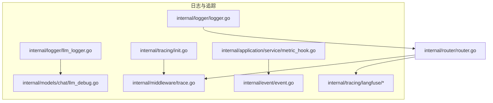
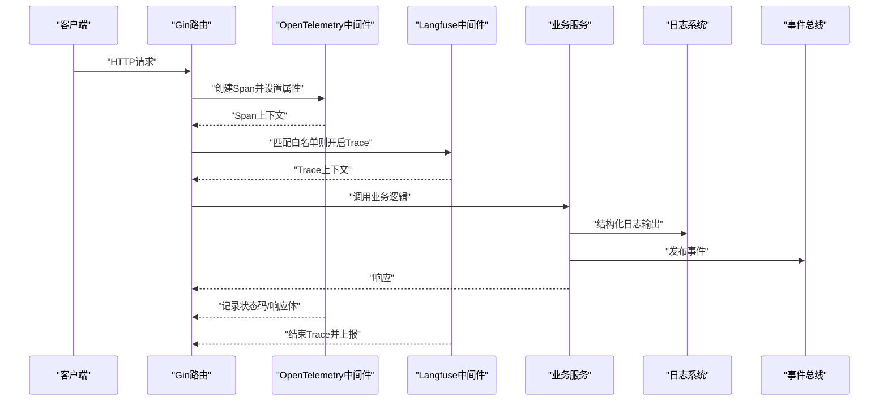
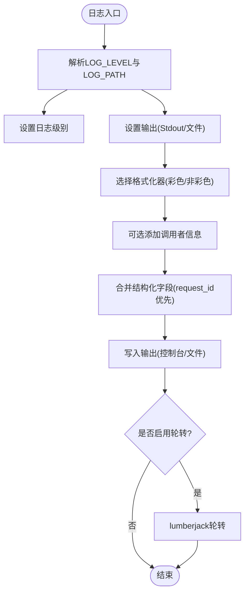
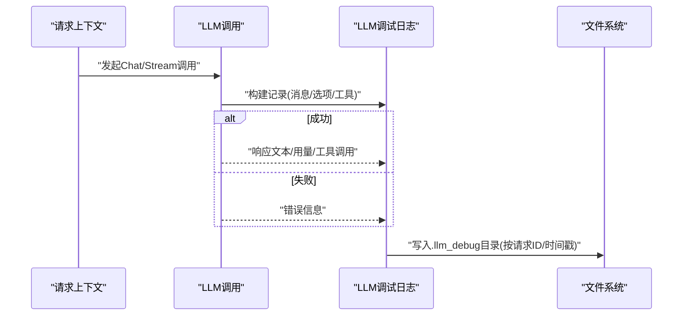
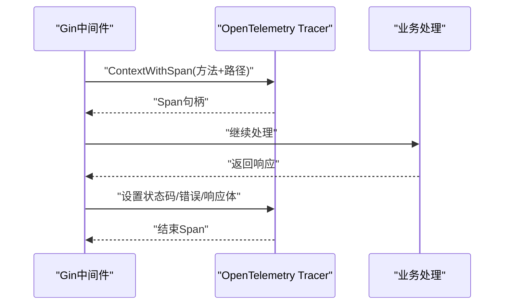
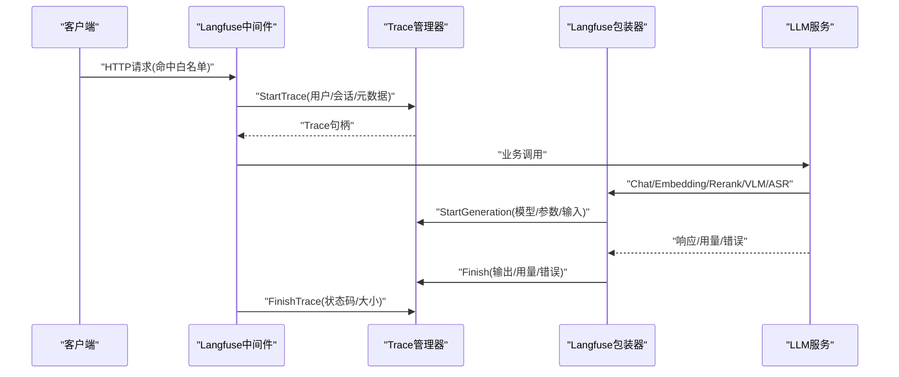
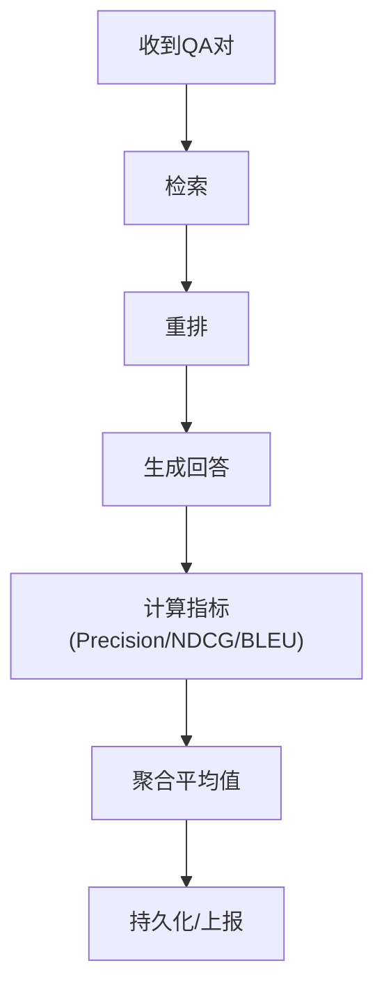
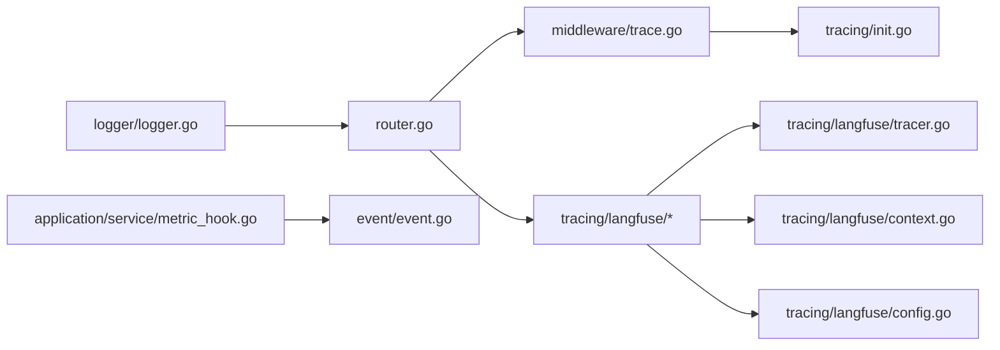

# 监控与追踪

<cite>
**本文引用的文件**
- [logger.go](file://internal/logger/logger.go)
- [llm_logger.go](file://internal/logger/llm_logger.go)
- [llm_debug.go](file://internal/models/chat/llm_debug.go)
- [init.go](file://internal/tracing/init.go)
- [trace.go](file://internal/middleware/trace.go)
- [router.go](file://internal/router/router.go)
- [middleware.go](file://internal/tracing/langfuse/middleware.go)
- [tracer.go](file://internal/tracing/langfuse/tracer.go)
- [context.go](file://internal/tracing/langfuse/context.go)
- [config.go](file://internal/tracing/langfuse/config.go)
- [container.go](file://internal/container/container.go)
- [event.go](file://internal/event/event.go)
- [metric_hook.go](file://internal/application/service/metric_hook.go)
- [precision.go](file://internal/application/service/metric/precision.go)
- [ndcg.go](file://internal/application/service/metric/ndcg.go)
- [bleu.go](file://internal/application/service/metric/bleu.go)
- [Langfuse集成.md](file://docs/Langfuse集成.md)
</cite>

## 目录
1. [简介](#简介)
2. [项目结构](#项目结构)
3. [核心组件](#核心组件)
4. [架构总览](#架构总览)
5. [详细组件分析](#详细组件分析)
6. [依赖分析](#依赖分析)
7. [性能考量](#性能考量)
8. [故障排查指南](#故障排查指南)
9. [结论](#结论)
10. [附录](#附录)

## 简介
本文件面向WeKnora的监控与追踪能力，系统性阐述以下主题：
- 日志系统设计：结构化日志、日志级别管理、日志轮转机制
- 链路追踪：OpenTelemetry集成与Langfuse追踪系统的使用
- 性能指标：指标采集、评估钩子与事件总线
- LLM调用日志：记录与分析
- 监控仪表板与可视化：配置与使用建议
- 分布式追踪原理与调试技巧
- 性能瓶颈识别与优化策略
- 监控数据存储与分析策略

## 项目结构
WeKnora的监控与追踪涉及如下模块：
- 日志与结构化输出：internal/logger
- LLM调试日志：internal/logger/llm_logger.go 与 internal/models/chat/llm_debug.go
- OpenTelemetry追踪：internal/tracing/init.go 与 internal/middleware/trace.go
- Langfuse追踪：internal/tracing/langfuse/*
- 路由与中间件：internal/router/router.go
- 事件总线与指标：internal/event/event.go、internal/application/service/metric_hook.go、metric子包
- 资源清理：internal/container/container.go

图表来源
- [logger.go:1-414](file://internal/logger/logger.go#L1-L414)
- [llm_logger.go:1-206](file://internal/logger/llm_logger.go#L1-L206)
- [llm_debug.go:96-177](file://internal/models/chat/llm_debug.go#L96-L177)
- [init.go:1-106](file://internal/tracing/init.go#L1-L106)
- [trace.go:1-118](file://internal/middleware/trace.go#L1-L118)
- [router.go:1-161](file://internal/router/router.go#L1-L161)
- [middleware.go:1-154](file://internal/tracing/langfuse/middleware.go#L1-L154)
- [tracer.go:1-251](file://internal/tracing/langfuse/tracer.go#L1-L251)
- [context.go:30-67](file://internal/tracing/langfuse/context.go#L30-L67)
- [config.go:34-66](file://internal/tracing/langfuse/config.go#L34-L66)
- [event.go:1-231](file://internal/event/event.go#L1-L231)
- [metric_hook.go:1-147](file://internal/application/service/metric_hook.go#L1-L147)

章节来源
- [router.go:123-128](file://internal/router/router.go#L123-L128)

## 核心组件
- 结构化日志与轮转：基于logrus与lumberjack，支持环境变量控制日志级别、输出路径与轮转策略，并在非TTY环境自动禁用ANSI颜色。
- LLM调试日志：按请求ID或时间戳生成独立文件，记录消息、选项、工具、响应、用量与错误，便于离线复盘。
- OpenTelemetry追踪：初始化TracerProvider，支持OTLP导出至Jaeger/Zipkin或标准输出，配合Gin中间件记录HTTP请求的Span。
- Langfuse追踪：Gin中间件按白名单路径开启Trace，自动注入用户/会话标识；对Chat/Embedding/Rerank/VLM/ASR调用进行Generation观测。
- 事件总线与指标：定义丰富事件类型，支持同步/异步发布；评估钩子计算检索与生成指标（Precision/NDCG/BLEU等）。

章节来源
- [logger.go:140-290](file://internal/logger/logger.go#L140-L290)
- [llm_logger.go:23-50](file://internal/logger/llm_logger.go#L23-L50)
- [llm_debug.go:115-177](file://internal/models/chat/llm_debug.go#L115-L177)
- [init.go:31-95](file://internal/tracing/init.go#L31-L95)
- [trace.go:28-116](file://internal/middleware/trace.go#L28-L116)
- [middleware.go:12-57](file://internal/tracing/langfuse/middleware.go#L12-L57)
- [tracer.go:70-94](file://internal/tracing/langfuse/tracer.go#L70-L94)
- [event.go:14-65](file://internal/event/event.go#L14-L65)
- [metric_hook.go:18-31](file://internal/application/service/metric_hook.go#L18-L31)

## 架构总览
WeKnora采用“多层可观测性”架构：
- 入口层：Gin路由注册OpenTelemetry中间件与Langfuse中间件
- 应用层：业务逻辑在Span/Trace上下文中运行，LLM调用被Langfuse包装器观测
- 数据层：日志落盘与轮转；事件总线驱动指标计算；Langfuse异步批量上报
- 清理层：容器在关闭时优雅停止Tracer与Langfuse队列

图表来源
- [router.go:123-128](file://internal/router/router.go#L123-L128)
- [trace.go:28-116](file://internal/middleware/trace.go#L28-L116)
- [middleware.go:12-57](file://internal/tracing/langfuse/middleware.go#L12-L57)
- [event.go:120-157](file://internal/event/event.go#L120-L157)

## 详细组件分析

### 日志系统与结构化输出
- 结构化字段：支持request_id优先、其余字段排序输出；错误字段高亮；调用者信息（文件行号/函数名）可选添加。
- 日志级别：通过环境变量LOG_LEVEL动态生效；支持debug/info/warn/error/fatal。
- 输出目标：默认stdout；可通过LOG_PATH启用文件输出；非TTY环境自动禁用ANSI颜色。
- 轮转策略：基于lumberjack，最大50MB、保留3份、最多28天、压缩旧文件。
- 上下文克隆：CloneContext保留日志、租户、请求ID、用户等关键上下文，确保跨组件日志一致性。

图表来源
- [logger.go:140-183](file://internal/logger/logger.go#L140-L183)
- [logger.go:276-290](file://internal/logger/logger.go#L276-L290)

章节来源
- [logger.go:140-290](file://internal/logger/logger.go#L140-L290)

### LLM调用日志记录与分析
- 触发条件：通过LLM_DEBUG_LOG环境变量启用；支持true/1/指定目录三种方式；默认目录为llm_debug（若存在LOG_PATH则位于其同级）。
- 文件组织：按请求ID命名；若无请求ID则以时间戳命名；定期清理超过7天的历史文件。
- 记录内容：调用类型、模型、耗时、消息、选项、工具、响应、用量、错误等分节。
- 集成点：Chat与ChatStream在完成或失败后统一写入；工具调用与用量转换由专用辅助函数完成。

图表来源
- [llm_debug.go:115-177](file://internal/models/chat/llm_debug.go#L115-L177)
- [llm_logger.go:113-151](file://internal/logger/llm_logger.go#L113-L151)

章节来源
- [llm_logger.go:23-50](file://internal/logger/llm_logger.go#L23-L50)
- [llm_debug.go:115-177](file://internal/models/chat/llm_debug.go#L115-L177)

### OpenTelemetry集成
- 初始化：根据OTEL_EXPORTER_OTLP_ENDPOINT决定使用OTLP导出器或标准输出；设置资源属性与采样器；注册全局TracerProvider。
- Gin中间件：提取请求头上下文，创建Span，记录方法、URL、路径、查询参数、请求/响应体与头部；错误状态码标记为Error。
- 生命周期：容器在关闭时提供Tracer Cleanup回调，确保优雅停机。

图表来源
- [init.go:31-95](file://internal/tracing/init.go#L31-L95)
- [trace.go:28-116](file://internal/middleware/trace.go#L28-L116)
- [container.go:1026-1051](file://internal/container/container.go#L1026-L1051)

章节来源
- [init.go:31-95](file://internal/tracing/init.go#L31-L95)
- [trace.go:28-116](file://internal/middleware/trace.go#L28-L116)
- [container.go:1026-1051](file://internal/container/container.go#L1026-L1051)

### Langfuse追踪系统
- 中间件：仅对白名单路径启用；自动提取用户ID/会话ID；记录HTTP元数据与请求ID；请求结束后Finish Trace并附加状态码与响应大小。
- 白名单策略：聚焦在线推理、入库、批处理、诊断与wiki操作等会产生LLM工作或触发异步任务的端点。
- 包装器：Chat/Embedding/Rerank/VLM/ASR均提供Langfuse包装器，在调用前后创建Generation并上报输入/输出/用量/错误。
- 上下文传播：通过context传递Trace与父观察ID，保证树形结构清晰。

图表来源
- [middleware.go:12-57](file://internal/tracing/langfuse/middleware.go#L12-L57)
- [middleware.go:77-133](file://internal/tracing/langfuse/middleware.go#L77-L133)
- [tracer.go:70-94](file://internal/tracing/langfuse/tracer.go#L70-L94)
- [tracer.go:233-251](file://internal/tracing/langfuse/tracer.go#L233-L251)
- [context.go:30-67](file://internal/tracing/langfuse/context.go#L30-L67)

章节来源
- [middleware.go:12-57](file://internal/tracing/langfuse/middleware.go#L12-L57)
- [middleware.go:77-133](file://internal/tracing/langfuse/middleware.go#L77-L133)
- [tracer.go:70-94](file://internal/tracing/langfuse/tracer.go#L70-L94)
- [tracer.go:233-251](file://internal/tracing/langfuse/tracer.go#L233-L251)
- [context.go:30-67](file://internal/tracing/langfuse/context.go#L30-L67)

### 性能指标收集与监控告警
- 事件总线：定义查询、检索、重排、合并、聊天、Agent全流程事件；支持同步/异步发布与等待模式。
- 评估钩子：记录每条QA对的检索结果、重排结果与生成回答，计算Precision/NDCG/BLEU/MAP/MRR等指标并求平均。
- 指标计算：Precision按召回集合交集计算；NDCG考虑相关性排序折扣；BLEU支持平滑与不同n-gram权重。
- 监控处理器示例：可基于事件总线注册Prometheus直方图，采集检索/重排耗时等指标。

图表来源
- [event.go:14-65](file://internal/event/event.go#L14-L65)
- [metric_hook.go:18-31](file://internal/application/service/metric_hook.go#L18-L31)
- [precision.go:15-44](file://internal/application/service/metric/precision.go#L15-L44)
- [ndcg.go:19-55](file://internal/application/service/metric/ndcg.go#L19-L55)
- [bleu.go:47-83](file://internal/application/service/metric/bleu.go#L47-L83)

章节来源
- [event.go:120-202](file://internal/event/event.go#L120-L202)
- [metric_hook.go:18-82](file://internal/application/service/metric_hook.go#L18-L82)
- [precision.go:15-44](file://internal/application/service/metric/precision.go#L15-L44)
- [ndcg.go:19-55](file://internal/application/service/metric/ndcg.go#L19-L55)
- [bleu.go:47-83](file://internal/application/service/metric/bleu.go#L47-L83)

### 监控仪表板配置与可视化
- Prometheus指标：可将检索/重排耗时等注册为直方图，结合Grafana构建仪表板。
- Langfuse可视化：通过Trace树形结构查看请求-子请求-Generation的完整链路，定位慢调用与错误。
- 建议：在Grafana中建立“请求延迟分布”、“错误率趋势”、“LLM调用用量”等面板；结合日志与事件总线实现根因分析。

章节来源
- [event.go:245-302](file://internal/event/event.go#L245-L302)

## 依赖分析
- 组件耦合
  - 日志系统与路由：日志中间件贯穿请求生命周期，确保每个请求都有统一的结构化输出。
  - OpenTelemetry与Gin：中间件强依赖Tracer初始化；容器负责优雅关闭。
  - Langfuse与路由：中间件无侵入，仅在启用且命中白名单时生效；包装器对具体模型调用透明。
  - 事件总线与指标：评估钩子依赖事件总线；指标计算模块独立于业务逻辑。
- 外部依赖
  - OpenTelemetry：OTLP导出器、标准输出导出器
  - logrus与lumberjack：结构化日志与轮转
  - Gin：中间件生态

图表来源
- [router.go:123-128](file://internal/router/router.go#L123-L128)
- [trace.go:28-116](file://internal/middleware/trace.go#L28-L116)
- [init.go:31-95](file://internal/tracing/init.go#L31-L95)
- [middleware.go:12-57](file://internal/tracing/langfuse/middleware.go#L12-L57)
- [tracer.go:70-94](file://internal/tracing/langfuse/tracer.go#L70-L94)
- [context.go:30-67](file://internal/tracing/langfuse/context.go#L30-L67)
- [config.go:34-66](file://internal/tracing/langfuse/config.go#L34-L66)
- [metric_hook.go:18-31](file://internal/application/service/metric_hook.go#L18-L31)
- [event.go:120-157](file://internal/event/event.go#L120-L157)
- [logger.go:140-183](file://internal/logger/logger.go#L140-L183)

## 性能考量
- 日志性能
  - 非TTY环境禁用ANSI颜色，减少CPU与I/O开销
  - lumberjack轮转避免单文件过大，降低磁盘压力
- 追踪性能
  - OpenTelemetry默认AlwaysSample，生产环境建议调整采样策略
  - Langfuse批量上报与队列上限，避免内存膨胀
- 指标计算
  - 评估钩子聚合指标时注意并发安全与锁粒度
  - 指标计算复杂度与数据规模成正比，建议分批处理与缓存中间结果

## 故障排查指南
- 日志无法落盘
  - 检查LOG_PATH是否存在且具备写权限；确认lumberjack初始化成功
- 日志级别不生效
  - 确认ConfigureFromEnv在主进程加载.env之后调用；检查LOG_LEVEL取值
- Langfuse未上报
  - 确认LANGFUSE_*环境变量齐全；检查shouldTrace白名单是否命中；查看Flush队列与超时配置
- OpenTelemetry未采集
  - 检查OTEL_EXPORTER_OTLP_ENDPOINT；确认中间件已注册；核对Span属性是否正确设置
- 指标缺失
  - 确认事件总线已注册处理器；检查评估钩子是否正确记录每一步结果

章节来源
- [logger.go:147-183](file://internal/logger/logger.go#L147-L183)
- [config.go:50-66](file://internal/tracing/langfuse/config.go#L50-L66)
- [middleware.go:77-133](file://internal/tracing/langfuse/middleware.go#L77-L133)
- [trace.go:28-116](file://internal/middleware/trace.go#L28-L116)
- [event.go:120-157](file://internal/event/event.go#L120-L157)

## 结论
WeKnora通过“结构化日志+OpenTelemetry+Langfuse+事件总线+指标计算”的组合，实现了从请求到模型调用的全链路可观测性。建议在生产环境中：
- 启用Langfuse并合理配置白名单
- 将关键耗时指标接入Prometheus/Grafana
- 对日志与追踪进行采样与轮转策略优化
- 建立基于事件总线的自动化监控与告警

## 附录
- 环境变量与配置要点
  - LOG_LEVEL、LOG_PATH：日志级别与输出路径
  - LLM_DEBUG_LOG：LLM调试日志开关与目录
  - OTEL_EXPORTER_OTLP_ENDPOINT：OTLP导出端点
  - LANGFUSE_*：Langfuse接入参数（主机、公钥、密钥、版本、环境、采样率等）
- 代码位置参考
  - Langfuse中间件与包装器：internal/tracing/langfuse/*、internal/models/chat/langfuse_wrapper.go等
  - 事件与指标：internal/event/event.go、internal/application/service/metric_hook.go及metric子包

章节来源
- [Langfuse集成.md:291-309](file://docs/Langfuse集成.md#L291-L309)
- [config.go:50-66](file://internal/tracing/langfuse/config.go#L50-L66)