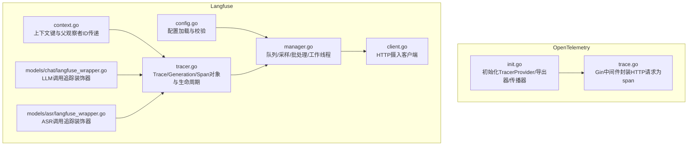
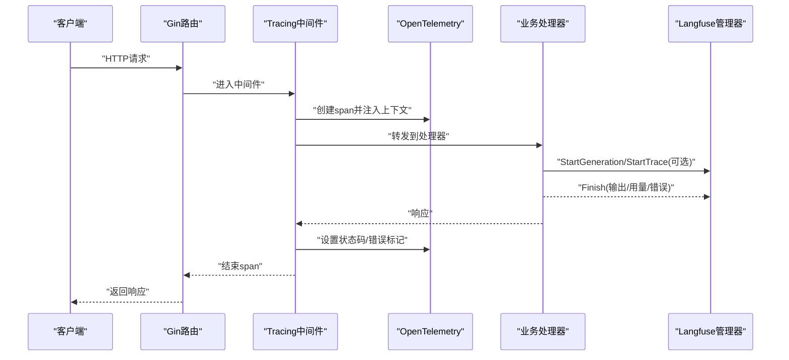
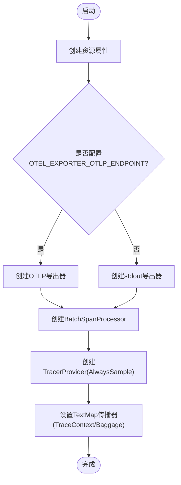
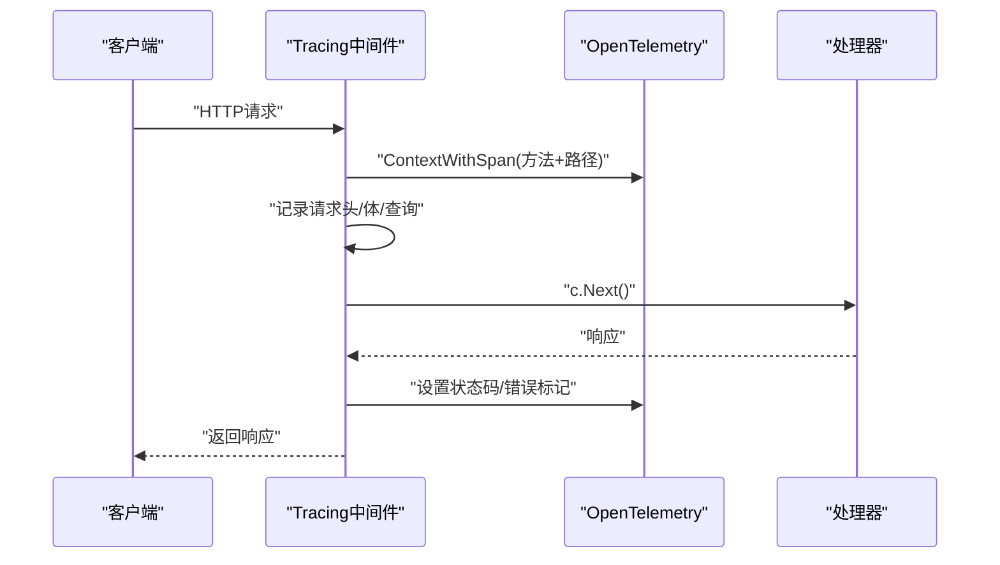
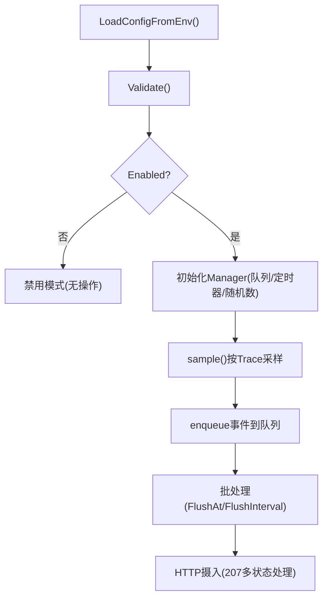
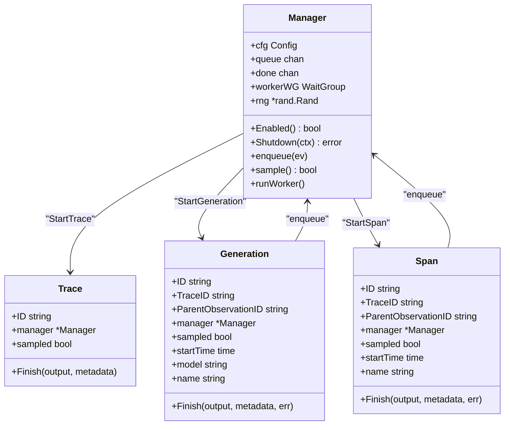
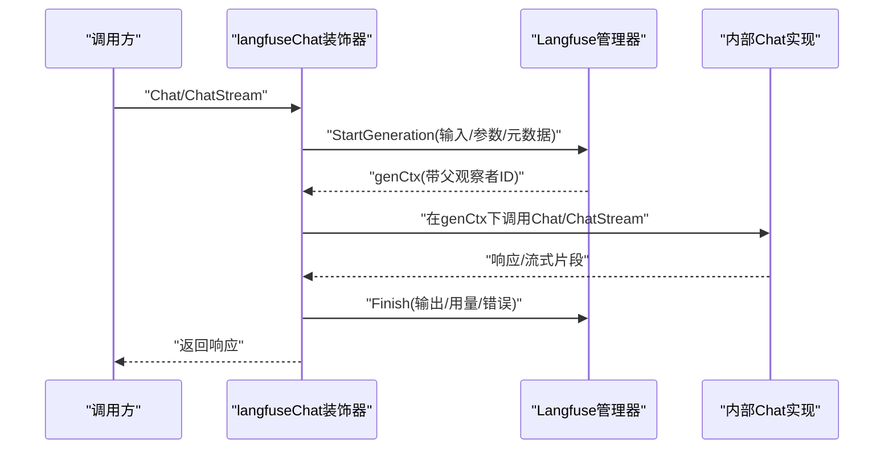
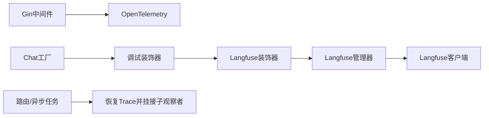

# 链路追踪

<cite>
**本文引用的文件**
- [init.go](file://internal/tracing/init.go)
- [trace.go](file://internal/middleware/trace.go)
- [manager.go](file://internal/tracing/langfuse/manager.go)
- [config.go](file://internal/tracing/langfuse/config.go)
- [tracer.go](file://internal/tracing/langfuse/tracer.go)
- [context.go](file://internal/tracing/langfuse/context.go)
- [client.go](file://internal/tracing/langfuse/client.go)
- [langfuse_wrapper.go](file://internal/models/chat/langfuse_wrapper.go)
- [chat.go](file://internal/models/chat/chat.go)
- [langfuse_wrapper.go](file://internal/models/asr/langfuse_wrapper.go)
- [extraheaders_test.go](file://internal/utils/extraheaders_test.go)
- [inject.go](file://internal/utils/inject.go)
- [inject_test.go](file://internal/utils/inject_test.go)
- [router.go](file://internal/router/router.go)
- [task.go](file://internal/router/task.go)
- [sync_task.go](file://internal/router/sync_task.go)
- [asynq.go](file://internal/router/asynq.go)
- [asynq_test.go](file://internal/router/asynq_test.go)
- [logger.go](file://internal/logger/logger.go)
- [llm_logger.go](file://internal/logger/llm_logger.go)
- [metrics.go](file://internal/application/service/metric/metrics.go)
- [metric_hook.go](file://internal/application/service/metric/metric_hook.go)
- [README.md](file://docs/Langfuse集成.md)
</cite>

## 目录
1. [简介](#简介)
2. [项目结构](#项目结构)
3. [核心组件](#核心组件)
4. [架构总览](#架构总览)
5. [详细组件分析](#详细组件分析)
6. [依赖关系分析](#依赖关系分析)
7. [性能考量](#性能考量)
8. [故障排查指南](#故障排查指南)
9. [结论](#结论)
10. [附录](#附录)

## 简介
本文件面向WeKnora的链路追踪系统，系统性阐述以下内容：
- OpenTelemetry集成架构与传播机制
- Langfuse追踪系统的实现与数据模型
- 分布式追踪的技术原理：span创建、传播与上下文管理
- 追踪中间件工作机制：请求ID生成与跨服务传递
- LLM调用的追踪记录：生成过程可视化与性能分析
- 追踪数据的存储与查询：Langfuse面板使用指南
- 追踪配置最佳实践：采样策略与性能优化
- 追踪数据分析与故障排查技巧
- 追踪系统的监控告警配置建议

## 项目结构
WeKnora的追踪能力由两部分组成：
- OpenTelemetry：全局TracerProvider、导出器与传播器初始化，以及Gin中间件对HTTP请求进行span包装
- Langfuse：轻量级Langfuse摄入客户端，用于记录Trace/Generation/Span事件，并支持采样与批量flush

**图表来源**
- [init.go:31-95](file://internal/tracing/init.go#L31-L95)
- [trace.go:28-117](file://internal/middleware/trace.go#L28-L117)
- [config.go:50-109](file://internal/tracing/langfuse/config.go#L50-L109)
- [manager.go:40-180](file://internal/tracing/langfuse/manager.go#L40-L180)
- [client.go:22-78](file://internal/tracing/langfuse/client.go#L22-L78)
- [tracer.go:70-132](file://internal/tracing/langfuse/tracer.go#L70-L132)
- [context.go:30-67](file://internal/tracing/langfuse/context.go#L30-L67)
- [langfuse_wrapper.go:11-54](file://internal/models/chat/langfuse_wrapper.go#L11-L54)
- [langfuse_wrapper.go:9-68](file://internal/models/asr/langfuse_wrapper.go#L9-L68)

**章节来源**
- [init.go:31-95](file://internal/tracing/init.go#L31-L95)
- [trace.go:28-117](file://internal/middleware/trace.go#L28-L117)
- [config.go:50-109](file://internal/tracing/langfuse/config.go#L50-L109)
- [manager.go:40-180](file://internal/tracing/langfuse/manager.go#L40-L180)
- [client.go:22-78](file://internal/tracing/langfuse/client.go#L22-L78)
- [tracer.go:70-132](file://internal/tracing/langfuse/tracer.go#L70-L132)
- [context.go:30-67](file://internal/tracing/langfuse/context.go#L30-L67)
- [langfuse_wrapper.go:11-54](file://internal/models/chat/langfuse_wrapper.go#L11-L54)
- [langfuse_wrapper.go:9-68](file://internal/models/asr/langfuse_wrapper.go#L9-L68)

## 核心组件
- OpenTelemetry初始化与传播
  - 初始化TracerProvider，设置资源标签、采样器、导出器（OTLP或stdout），并注册TextMap传播器（TraceContext/Baggage）
  - 提供获取Tracer与基于上下文创建span的便捷方法
- Gin追踪中间件
  - 从请求中提取trace上下文，创建span，记录请求/响应元信息，错误标记与状态码
- Langfuse配置与管理
  - 通过环境变量加载配置，支持启用/禁用、主机、凭据、flush策略、队列大小、超时、采样率、调试开关
  - 管理器负责采样决策、事件队列、批处理发送与优雅关闭
- Langfuse摄入客户端
  - 将事件序列化为batch，以Basic认证访问Langfuse摄入端点，处理207多状态返回
- Langfuse追踪对象
  - Trace/Generation/Span三类观察对象，支持Start/Finish生命周期，父子关系通过parentObservationId建立
- LLM/ASR调用追踪装饰器
  - 在Chat/ASR调用前后自动StartGeneration并Finish，捕获输入输出、模型参数与token用量

**章节来源**
- [init.go:31-95](file://internal/tracing/init.go#L31-L95)
- [trace.go:28-117](file://internal/middleware/trace.go#L28-L117)
- [config.go:50-109](file://internal/tracing/langfuse/config.go#L50-L109)
- [manager.go:40-180](file://internal/tracing/langfuse/manager.go#L40-L180)
- [client.go:22-78](file://internal/tracing/langfuse/client.go#L22-L78)
- [tracer.go:70-132](file://internal/tracing/langfuse/tracer.go#L70-L132)
- [langfuse_wrapper.go:11-54](file://internal/models/chat/langfuse_wrapper.go#L11-L54)
- [langfuse_wrapper.go:9-68](file://internal/models/asr/langfuse_wrapper.go#L9-L68)

## 架构总览
WeKnora的追踪体系采用“双轨制”：
- OpenTelemetry：统一的分布式追踪，便于接入Jaeger/Zipkin等后端，或本地stdout输出
- Langfuse：专用于LLM观测，记录完整的生成树（Trace→Span→Generation），便于成本与性能分析

**图表来源**
- [trace.go:28-117](file://internal/middleware/trace.go#L28-L117)
- [init.go:31-95](file://internal/tracing/init.go#L31-L95)
- [manager.go:40-180](file://internal/tracing/langfuse/manager.go#L40-L180)
- [tracer.go:70-132](file://internal/tracing/langfuse/tracer.go#L70-L132)

## 详细组件分析

### OpenTelemetry初始化与传播
- 资源与标签：服务名、语言等语义属性
- 导出器选择：优先OTLP gRPC（连接Jaeger/Zipkin等），否则回退stdout
- 传播器：TraceContext与Baggage组合传播
- TracerProvider：批处理SpanProcessor，AlwaysSample采样器
- 上下文工具：ContextWithSpan便捷创建span；GetTracer获取全局Tracer

**图表来源**
- [init.go:31-95](file://internal/tracing/init.go#L31-L95)

**章节来源**
- [init.go:31-95](file://internal/tracing/init.go#L31-L95)

### Gin追踪中间件
- 从请求头提取trace上下文，创建span，设置基础属性（方法、URL、路径）
- 记录请求头（敏感头过滤）、请求体、查询参数
- 包装ResponseWriter捕获响应体与响应头
- 结束时设置状态码、错误标记与日志记录

**图表来源**
- [trace.go:28-117](file://internal/middleware/trace.go#L28-L117)
- [init.go:102-105](file://internal/tracing/init.go#L102-L105)

**章节来源**
- [trace.go:28-117](file://internal/middleware/trace.go#L28-L117)

### Langfuse配置与采样
- 配置项：Enabled、Host、PublicKey/SecretKey、FlushAt/FlushInterval、QueueSize、RequestTimeout、Release/Environment、SampleRate、Debug
- 环境变量加载：遵循LANGFUSE_*命名规范，自动启用当凭据存在
- 采样策略：按Trace粒度采样，一旦采样即保留该Trace下的所有观测；SampleRate=0时视为1.0

**图表来源**
- [config.go:50-109](file://internal/tracing/langfuse/config.go#L50-L109)
- [manager.go:120-180](file://internal/tracing/langfuse/manager.go#L120-L180)
- [client.go:42-78](file://internal/tracing/langfuse/client.go#L42-L78)

**章节来源**
- [config.go:50-109](file://internal/tracing/langfuse/config.go#L50-L109)
- [manager.go:120-180](file://internal/tracing/langfuse/manager.go#L120-L180)
- [client.go:42-78](file://internal/tracing/langfuse/client.go#L42-L78)

### Langfuse追踪对象与上下文传递
- Trace：根级观察对象，可携带用户、会话、输入、元数据、标签、环境与版本
- Generation：一次模型调用（LLM/Embedding/VLM），记录模型名、输入、模型参数、输出、用量
- Span：逻辑阶段或任务，可嵌套，通过ParentObservationID串联
- 上下文：traceCtxKey与parentObsCtxKey在context中传递当前Trace与父观察者ID

**图表来源**
- [tracer.go:11-40](file://internal/tracing/langfuse/tracer.go#L11-L40)
- [manager.go:14-30](file://internal/tracing/langfuse/manager.go#L14-L30)

**章节来源**
- [tracer.go:11-40](file://internal/tracing/langfuse/tracer.go#L11-L40)
- [context.go:30-67](file://internal/tracing/langfuse/context.go#L30-L67)

### LLM调用追踪装饰器（Chat）
- 在Chat/ChatStream调用前后自动StartGeneration并Finish
- 输入：构建消息数组（含多模态内容、工具调用等）
- 输出：聚合首token时间、累计内容、工具调用、结束原因与token用量
- 元数据：模型ID、是否流式、是否存在工具

**图表来源**
- [langfuse_wrapper.go:22-54](file://internal/models/chat/langfuse_wrapper.go#L22-L54)
- [langfuse_wrapper.go:56-121](file://internal/models/chat/langfuse_wrapper.go#L56-L121)
- [tracer.go:233-251](file://internal/tracing/langfuse/tracer.go#L233-L251)

**章节来源**
- [langfuse_wrapper.go:22-54](file://internal/models/chat/langfuse_wrapper.go#L22-L54)
- [langfuse_wrapper.go:56-121](file://internal/models/chat/langfuse_wrapper.go#L56-L121)
- [chat.go:132-146](file://internal/models/chat/chat.go#L132-L146)

### ASR调用追踪装饰器
- 对Transcribe调用进行Generation记录
- 输入：文件名、音频大小
- 输出：文本、分段数量、持续时长（秒）
- 用量：以秒计费单位，便于Langfuse定价配置

**章节来源**
- [langfuse_wrapper.go:21-68](file://internal/models/asr/langfuse_wrapper.go#L21-L68)

### 请求头注入与跨服务传递
- 自定义头部注入工具：支持在HTTP请求上追加非保留头，避免覆盖保留头
- 注入场景：在跨服务调用时注入X-Trace-Id、X-Route等追踪头，便于下游服务恢复span
- 测试验证：确保保留头不被覆盖，自定义头正确注入

**章节来源**
- [extraheaders_test.go:11-45](file://internal/utils/extraheaders_test.go#L11-L45)
- [inject.go](file://internal/utils/inject.go)
- [inject_test.go](file://internal/utils/inject_test.go)

## 依赖关系分析
- 组件耦合
  - Gin中间件依赖OpenTelemetry全局TracerProvider
  - Langfuse装饰器依赖Langfuse管理器，管理器依赖HTTP客户端
  - Chat/ASR工厂在构造完成后按序应用调试与Langfuse装饰器
- 异步任务与追踪
  - 路由层包含异步任务相关模块，Langfuse支持从上游恢复Trace并挂接异步任务作为子观察者
- 外部依赖
  - OpenTelemetry SDK（OTLP/Stdout/传播器）
  - Langfuse摄入API（Basic认证）

**图表来源**
- [trace.go:28-117](file://internal/middleware/trace.go#L28-L117)
- [init.go:31-95](file://internal/tracing/init.go#L31-L95)
- [chat.go:132-146](file://internal/models/chat/chat.go#L132-L146)
- [manager.go:40-180](file://internal/tracing/langfuse/manager.go#L40-L180)
- [client.go:22-78](file://internal/tracing/langfuse/client.go#L22-L78)
- [router.go](file://internal/router/router.go)
- [task.go](file://internal/router/task.go)
- [sync_task.go](file://internal/router/sync_task.go)
- [asynq.go](file://internal/router/asynq.go)

**章节来源**
- [chat.go:132-146](file://internal/models/chat/chat.go#L132-L146)
- [router.go](file://internal/router/router.go)
- [task.go](file://internal/router/task.go)
- [sync_task.go](file://internal/router/sync_task.go)
- [asynq.go](file://internal/router/asynq.go)

## 性能考量
- 采样策略
  - Langfuse按Trace粒度采样，SampleRate=0时视为1.0；建议在高QPS场景降低采样率以控制摄入成本
- 批处理与背压
  - FlushAt与FlushInterval平衡延迟与吞吐；QueueSize限制内存占用；队列满时静默丢弃，避免阻塞请求路径
- 导出器选择
  - 生产环境优先OTLP，减少本地磁盘/控制台开销；开发环境可使用stdout便于快速验证
- 日志与调试
  - Debug模式开启后记录批次发送失败细节；建议仅在问题定位时开启
- LLM追踪开销
  - 仅在启用Langfuse时安装装饰器，避免无谓包装；流式响应聚合首token时间，减少多次Finish调用

[本节为通用指导，无需特定文件来源]

## 故障排查指南
- 启动与导出
  - 若未配置OTEL_EXPORTER_OTLP_ENDPOINT，默认使用stdout；检查环境变量与导出器初始化
- Langfuse不可达
  - 207多状态表示部分事件失败，但批次整体接受；检查凭证、主机地址与网络连通性
  - 队列满导致事件丢弃：增大QueueSize或提高Flush频率
- 采样与覆盖率
  - 若发现Trace缺失，检查SampleRate与Trace上下文是否正确传递
- 请求头与上下文
  - 确认自定义头未覆盖保留头；验证跨服务传递的X-Trace-Id等头是否正确注入
- 日志与指标
  - 查看Langfuse管理器日志与LLM日志，定位异常响应与用量统计

**章节来源**
- [client.go:42-78](file://internal/tracing/langfuse/client.go#L42-L78)
- [manager.go:104-118](file://internal/tracing/langfuse/manager.go#L104-L118)
- [extraheaders_test.go:11-45](file://internal/utils/extraheaders_test.go#L11-L45)
- [logger.go](file://internal/logger/logger.go)
- [llm_logger.go](file://internal/logger/llm_logger.go)

## 结论
WeKnora的链路追踪体系通过OpenTelemetry与Langfuse的协同，实现了：
- 统一的分布式追踪与传播
- LLM调用的完整可观测性（输入/输出/用量/错误）
- 可配置的采样与批处理策略，兼顾性能与成本
- 易于扩展的装饰器模式，便于接入更多模型与服务

[本节为总结，无需特定文件来源]

## 附录

### 追踪数据的存储与查询（Langfuse面板）
- 面板入口：登录Langfuse后，通过项目与环境筛选查看Trace/Generation/Span
- 关键视图：
  - Trace树：按Trace→Span→Generation层级查看调用链
  - Generation详情：模型参数、输入输出、token用量、错误信息
  - 指标仪表盘：按模型、会话、用户维度统计耗时与用量
- 建议字段：
  - Trace：用户ID、会话ID、标签、环境、版本
  - Generation：模型ID、是否工具调用、流式标识
  - Span：阶段名称、输入/输出摘要

**章节来源**
- [README.md](file://docs/Langfuse集成.md)

### 追踪配置最佳实践
- OpenTelemetry
  - 生产环境启用OTLP并配置合适的endpoint；开发环境可使用stdout
  - 保持AlwaysSample或按需调整采样策略，避免过度采样导致关键路径缺失
- Langfuse
  - 通过环境变量启用，避免在配置文件中硬编码密钥
  - 合理设置FlushAt/FlushInterval/QueueSize/RequestTimeout，结合业务流量峰值评估
  - 使用SampleRate控制总体摄入量，结合环境/版本标签进行对比分析
  - Debug仅在问题定位时开启，避免影响线上性能

**章节来源**
- [config.go:50-109](file://internal/tracing/langfuse/config.go#L50-L109)
- [manager.go:120-180](file://internal/tracing/langfuse/manager.go#L120-L180)
- [init.go:31-95](file://internal/tracing/init.go#L31-L95)

### 监控告警配置建议
- 指标采集
  - 通过Langfuse面板与内部指标系统（如metrics包）共同监控
  - 关键指标：Trace/Generation数量、平均耗时、错误率、token用量、队列长度
- 告警规则
  - Trace/Generation错误率阈值告警
  - 平均耗时突增告警
  - 队列积压告警（Flush失败或队列长度超过阈值）
- 日志联动
  - 将Langfuse日志与应用日志关联，结合X-Trace-Id进行问题复盘

**章节来源**
- [metrics.go](file://internal/application/service/metric/metrics.go)
- [metric_hook.go](file://internal/application/service/metric/metric_hook.go)