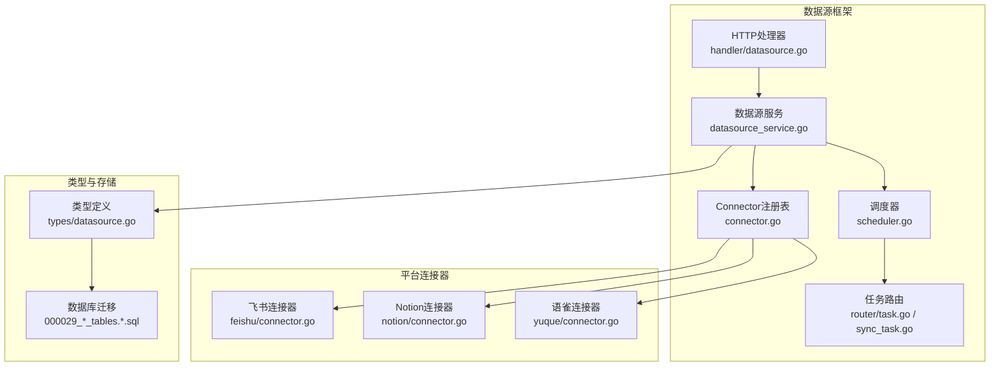
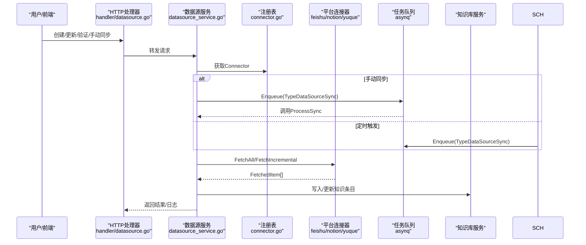
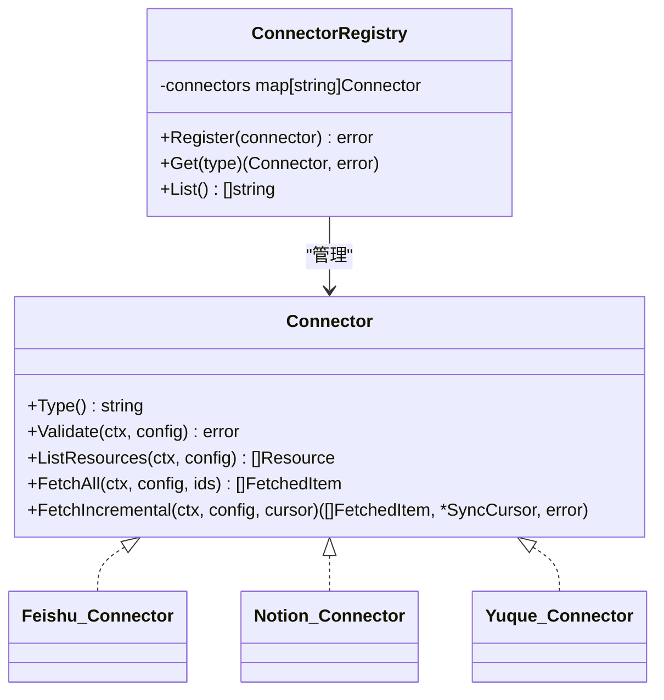
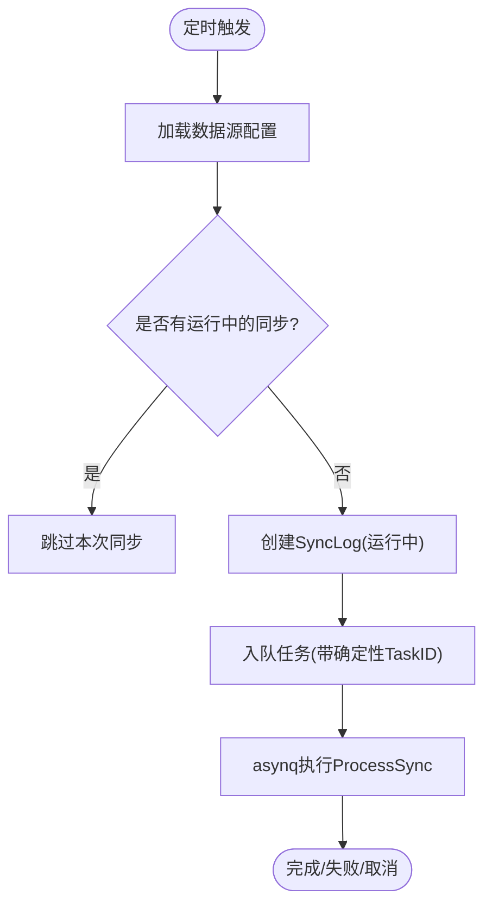
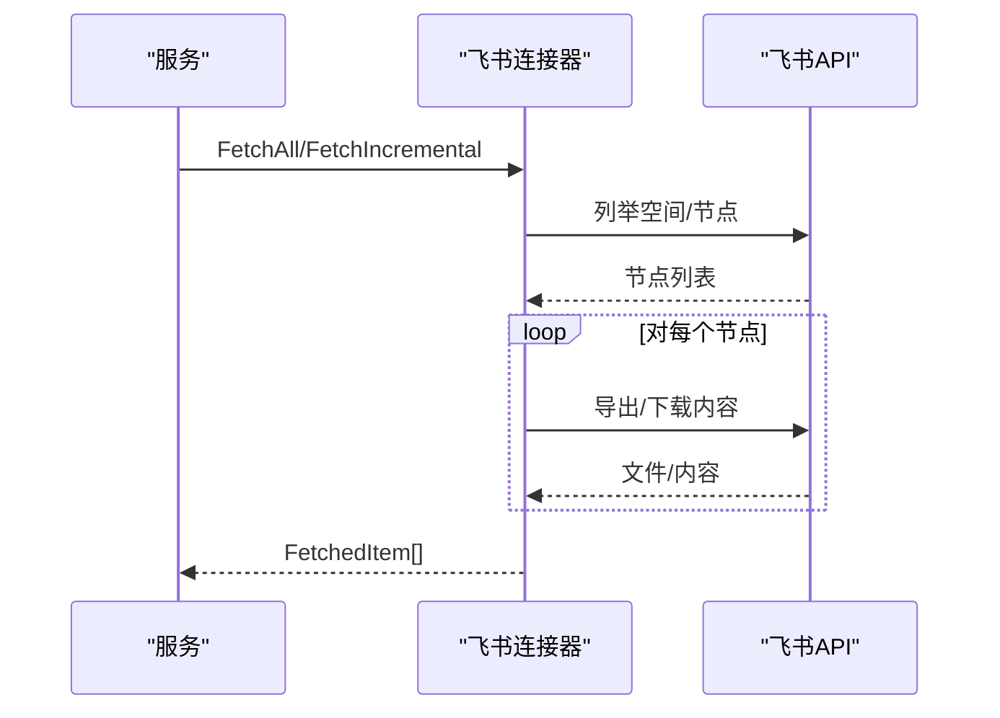
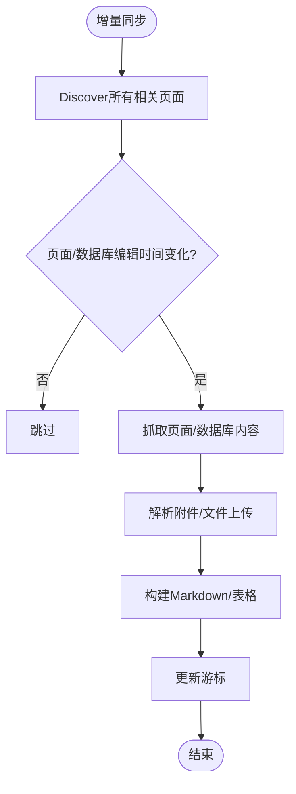
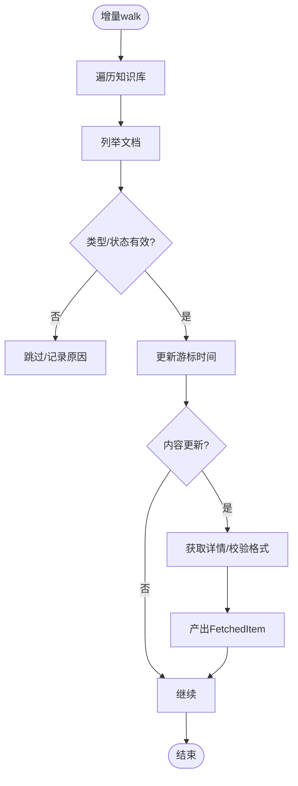
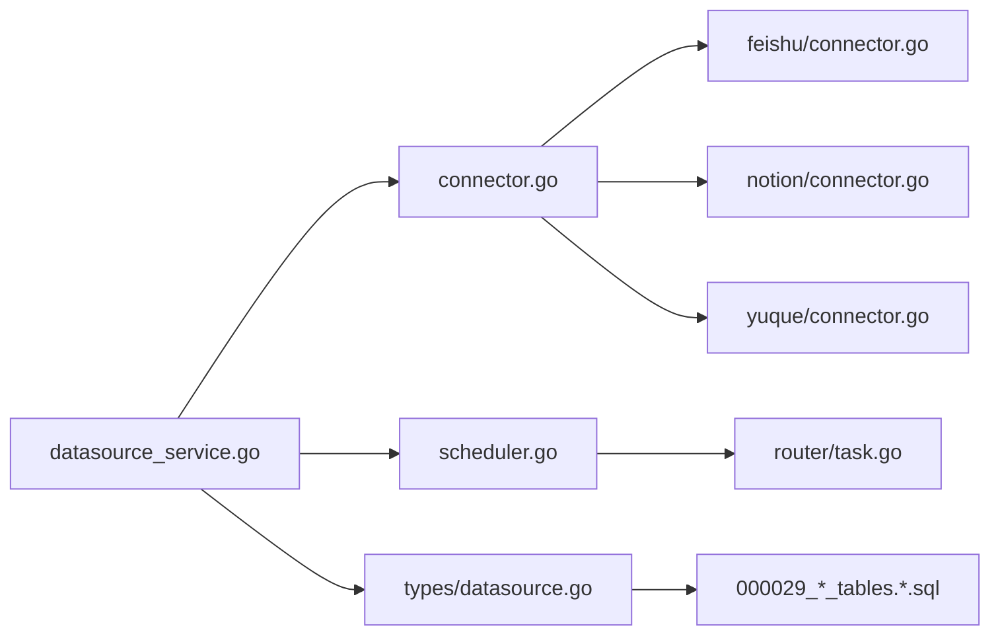

# 数据源集成

<cite>
**本文引用的文件**
- [connector.go](file://internal/datasource/connector.go)
- [scheduler.go](file://internal/datasource/scheduler.go)
- [README.md](file://internal/datasource/README.md)
- [CONNECTOR_IMPLEMENTATION_GUIDE.md](file://internal/datasource/CONNECTOR_IMPLEMENTATION_GUIDE.md)
- [feishu/connector.go](file://internal/datasource/connector/feishu/connector.go)
- [notion/connector.go](file://internal/datasource/connector/notion/connector.go)
- [yuque/connector.go](file://internal/datasource/connector/yuque/connector.go)
- [datasource.go](file://internal/types/datasource.go)
- [datasource_service.go](file://internal/application/service/datasource_service.go)
- [datasource.go](file://internal/handler/datasource.go)
- [000029_datasource_tables.up.sql](file://migrations/versioned/000029_datasource_tables.up.sql)
- [000029_datasource_tables.down.sql](file://migrations/versioned/000029_datasource_tables.down.sql)
- [task.go](file://internal/router/task.go)
- [sync_task.go](file://internal/router/sync_task.go)
</cite>

## 目录
1. [简介](#简介)
2. [项目结构](#项目结构)
3. [核心组件](#核心组件)
4. [架构总览](#架构总览)
5. [详细组件分析](#详细组件分析)
6. [依赖关系分析](#依赖关系分析)
7. [性能考量](#性能考量)
8. [故障排除指南](#故障排除指南)
9. [结论](#结论)
10. [附录](#附录)

## 简介
本文件面向WeKnora的数据源集成功能，系统性阐述统一接口抽象与多平台适配器模式、飞书(Feishu)、Notion、语雀(Yuque)等平台连接器的实现细节（含API调用、认证机制与数据同步策略）、自动同步机制（调度器、增量同步与冲突处理）、配置与安全、数据转换与标准化、故障排除与性能监控，以及新增连接器的开发指南与最佳实践。

## 项目结构
WeKnora的数据源框架位于internal/datasource，采用“适配器 + 注册表 + 业务服务 + 调度器 + 任务队列”的分层设计：
- 接口与注册表：统一的Connector接口与注册表，屏蔽各平台差异
- 平台连接器：feishu、notion、yuque等具体实现
- 业务服务：DataSourceService封装配置校验、手动/定时触发、结果写入知识库
- 调度器：基于robfig/cron与asynq的去重与并发控制
- 任务执行：asynq或Lite模式下的同步执行
- 类型与持久化：统一的数据结构、数据库迁移脚本

图表来源
- [connector.go:34-73](file://internal/datasource/connector.go#L34-L73)
- [scheduler.go:18-52](file://internal/datasource/scheduler.go#L18-L52)
- [datasource_service.go:21-57](file://internal/application/service/datasource_service.go#L21-L57)
- [datasource.go:14-29](file://internal/handler/datasource.go#L14-L29)
- [task.go:100-165](file://internal/router/task.go#L100-L165)
- [sync_task.go:17-106](file://internal/router/sync_task.go#L17-L106)
- [datasource.go:49-114](file://internal/types/datasource.go#L49-L114)
- [000029_datasource_tables.up.sql:5-52](file://migrations/versioned/000029_datasource_tables.up.sql#L5-L52)

章节来源
- [README.md:65-91](file://internal/datasource/README.md#L65-L91)
- [datasource.go:49-114](file://internal/types/datasource.go#L49-L114)
- [000029_datasource_tables.up.sql:5-52](file://migrations/versioned/000029_datasource_tables.up.sql#L5-L52)

## 核心组件
- 统一接口与注册表
  - Connector接口定义Type、Validate、ListResources、FetchAll、FetchIncremental
  - ConnectorRegistry负责注册与查找，支持多平台扩展
  - ConnectorMetadataRegistry提供UI展示与能力标注（OAuth/API Key/增量/删除同步等）
- 调度器
  - 基于robfig/cron的周期调度；通过HasRunningSync与asynq.TaskID双重去重，避免实例间重复执行
  - 触发时创建SyncLog并入队数据源同步任务
- 业务服务
  - Create/Update/List/Validate/ManualSync/Pause/Resume/Logs等完整生命周期管理
  - ProcessSync中根据配置选择全量或增量同步，调用Connector并写入知识库
- 类型与持久化
  - DataSource、SyncLog、Resource、FetchedItem、SyncCursor等统一模型
  - 数据库存储配置、游标、结果与日志，并带索引优化查询

章节来源
- [connector.go:9-31](file://internal/datasource/connector.go#L9-L31)
- [connector.go:34-73](file://internal/datasource/connector.go#L34-L73)
- [connector.go:86-185](file://internal/datasource/connector.go#L86-L185)
- [scheduler.go:18-52](file://internal/datasource/scheduler.go#L18-L52)
- [scheduler.go:132-203](file://internal/datasource/scheduler.go#L132-L203)
- [datasource_service.go:21-57](file://internal/application/service/datasource_service.go#L21-L57)
- [datasource_service.go:387-599](file://internal/application/service/datasource_service.go#L387-L599)
- [datasource.go:49-114](file://internal/types/datasource.go#L49-L114)
- [datasource.go:129-183](file://internal/types/datasource.go#L129-L183)
- [datasource.go:212-273](file://internal/types/datasource.go#L212-L273)
- [datasource.go:275-286](file://internal/types/datasource.go#L275-L286)

## 架构总览
下图展示了从用户操作到平台API调用、再到知识库入库的端到端流程。

图表来源
- [datasource.go:77-118](file://internal/handler/datasource.go#L77-L118)
- [datasource_service.go:269-324](file://internal/application/service/datasource_service.go#L269-L324)
- [datasource_service.go:387-599](file://internal/application/service/datasource_service.go#L387-L599)
- [connector.go:9-31](file://internal/datasource/connector.go#L9-L31)
- [task.go:152-154](file://internal/router/task.go#L152-L154)

## 详细组件分析

### 统一接口与注册表
- Connector接口职责
  - Type：返回连接器类型标识
  - Validate：校验凭证与连通性
  - ListResources：枚举可同步资源（如空间/页面/仓库）
  - FetchAll：全量拉取
  - FetchIncremental：增量拉取（返回变更项与新游标）
- 注册表与元数据
  - NewConnectorRegistry/Register/Get/List
  - ConnectorMetadataRegistry按优先级与能力标注，供前端展示

图表来源
- [connector.go:9-31](file://internal/datasource/connector.go#L9-L31)
- [connector.go:34-73](file://internal/datasource/connector.go#L34-L73)
- [feishu/connector.go:15-26](file://internal/datasource/connector/feishu/connector.go#L15-L26)
- [notion/connector.go:23-34](file://internal/datasource/connector/notion/connector.go#L23-L34)
- [yuque/connector.go:21-28](file://internal/datasource/connector/yuque/connector.go#L21-L28)

章节来源
- [connector.go:9-31](file://internal/datasource/connector.go#L9-L31)
- [connector.go:34-73](file://internal/datasource/connector.go#L34-L73)
- [connector.go:86-185](file://internal/datasource/connector.go#L86-L185)

### 调度器与自动同步
- 去重与并发
  - 层1：DB检查是否已有运行中的同步（HasRunningSync）
  - 层2：asynq任务ID“dssync:<dsID>:<minute>”确保同一分钟内仅一个实例入队
- 触发流程
  - cron表达式触发后创建SyncLog，构造payload并入队
  - 失败场景记录错误并更新状态
- 任务执行
  - asynq服务注册TypeDataSourceSync处理器为ProcessSync

图表来源
- [scheduler.go:132-203](file://internal/datasource/scheduler.go#L132-L203)
- [task.go:152-154](file://internal/router/task.go#L152-L154)

章节来源
- [scheduler.go:18-52](file://internal/datasource/scheduler.go#L18-L52)
- [scheduler.go:132-203](file://internal/datasource/scheduler.go#L132-L203)
- [task.go:100-165](file://internal/router/task.go#L100-L165)

### 飞书(Feishu)连接器
- 认证与连通性
  - Validate解析配置并Ping
- 资源枚举
  - ListResources列出Wiki空间作为可选资源
- 同步策略
  - 全量：递归列举空间内节点并逐个抓取内容
  - 增量：基于节点编辑时间比较，支持删除检测（节点消失即标记删除）
- 内容抓取
  - docx/doc/sheet/bitable通过导出API下载；file通过驱动下载
  - 文件名清洗与扩展名补全
- 游标
  - 记录每个空间下节点的最后编辑时间，用于下次增量对比

图表来源
- [feishu/connector.go:74-113](file://internal/datasource/connector/feishu/connector.go#L74-L113)
- [feishu/connector.go:117-227](file://internal/datasource/connector/feishu/connector.go#L117-L227)
- [feishu/connector.go:229-310](file://internal/datasource/connector/feishu/connector.go#L229-L310)

章节来源
- [feishu/connector.go:28-41](file://internal/datasource/connector/feishu/connector.go#L28-L41)
- [feishu/connector.go:43-71](file://internal/datasource/connector/feishu/connector.go#L43-L71)
- [feishu/connector.go:74-113](file://internal/datasource/connector/feishu/connector.go#L74-L113)
- [feishu/connector.go:117-227](file://internal/datasource/connector/feishu/connector.go#L117-L227)
- [feishu/connector.go:229-310](file://internal/datasource/connector/feishu/connector.go#L229-L310)

### Notion连接器
- 认证与连通性
  - Validate解析API Key并Ping
- 资源枚举
  - ListResources通过SearchPages获取页面/数据库树形结构，支持父ID与子节点标记
- 同步策略
  - 全量：对资源ID分别处理，页面走BlocksToMarkdown，数据库转为Markdown表格
  - 增量：首次同步直接走全量构建游标；后续基于页面/数据库编辑时间差分，支持删除检测
- 附件处理
  - 页面块中的文件上传类型需二次解析获取临时下载地址
- 游标
  - 记录页面/数据库的最后编辑时间，数据库记录行级编辑时间

图表来源
- [notion/connector.go:139-256](file://internal/datasource/connector/notion/connector.go#L139-L256)
- [notion/connector.go:640-702](file://internal/datasource/connector/notion/connector.go#L640-L702)
- [notion/connector.go:704-727](file://internal/datasource/connector/notion/connector.go#L704-L727)

章节来源
- [notion/connector.go:36-45](file://internal/datasource/connector/notion/connector.go#L36-L45)
- [notion/connector.go:47-107](file://internal/datasource/connector/notion/connector.go#L47-L107)
- [notion/connector.go:109-137](file://internal/datasource/connector/notion/connector.go#L109-L137)
- [notion/connector.go:139-256](file://internal/datasource/connector/notion/connector.go#L139-L256)
- [notion/connector.go:704-727](file://internal/datasource/connector/notion/connector.go#L704-L727)

### 语雀(Yuque)连接器
- 认证与连通性
  - Validate解析配置并Ping
- 资源枚举
  - ListResources聚合个人与团队仓库，去重后排序
- 同步策略
  - 全量：遍历所选知识库的所有文档
  - 增量：基于文档内容更新时间对比，支持删除检测（当前列表缺失即标记删除）
- 内容过滤
  - 仅处理类型为Doc且状态为已发布的内容；非Markdown/非Lake格式跳过
- 游标
  - 记录每个知识库下文档的内容更新时间

图表来源
- [yuque/connector.go:116-265](file://internal/datasource/connector/yuque/connector.go#L116-L265)
- [yuque/connector.go:276-312](file://internal/datasource/connector/yuque/connector.go#L276-L312)

章节来源
- [yuque/connector.go:30-41](file://internal/datasource/connector/yuque/connector.go#L30-L41)
- [yuque/connector.go:43-108](file://internal/datasource/connector/yuque/connector.go#L43-L108)
- [yuque/connector.go:110-114](file://internal/datasource/connector/yuque/connector.go#L110-L114)
- [yuque/connector.go:116-265](file://internal/datasource/connector/yuque/connector.go#L116-L265)
- [yuque/connector.go:276-312](file://internal/datasource/connector/yuque/connector.go#L276-L312)

### 数据转换与标准化
- 统一输出
  - 所有连接器均输出FetchedItem：外部ID、标题、内容字节、内容类型、文件名、URL、更新时间、来源资源ID、元数据、删除标记
- 写入知识库
  - ProcessSync中根据是否存在Content或URL分别走CreateKnowledgeFromFile或CreateKnowledgeFromURL
  - 按外部ID去重：存在则先删后增，实现“更新”
  - 自动打标签：按数据源名称创建/复用标签，便于溯源
- 渠道标记
  - 在元数据中注入channel字段，区分来源（如feishu/notion/yuque）

章节来源
- [datasource.go:242-273](file://internal/types/datasource.go#L242-L273)
- [datasource_service.go:636-710](file://internal/application/service/datasource_service.go#L636-L710)
- [datasource_service.go:515-556](file://internal/application/service/datasource_service.go#L515-L556)

### 数据源配置管理与安全
- 配置模型
  - DataSource：包含租户ID、知识库ID、类型、加密配置、同步计划、模式、状态、冲突策略、删除同步开关、最近同步时间/游标/结果、错误信息、日志保留天数
  - DataSourceConfig：通用的type/credentials/resource_ids/settings
- 加密与隔离
  - 配置字段以JSON存储并采用AES-256-GCM加密
  - 多租户隔离，路由层严格校验租户上下文
- 权限与可见性
  - 资源枚举与同步均受租户边界保护

章节来源
- [datasource.go:49-114](file://internal/types/datasource.go#L49-L114)
- [datasource.go:196-210](file://internal/types/datasource.go#L196-L210)
- [datasource.go:38-75](file://internal/handler/datasource.go#L38-L75)

### API与日志
- 管理接口
  - 创建/读取/列表/更新/删除/暂停/恢复/手动同步/校验连接/列出可用资源/列出日志
- 日志模型
  - SyncLog：记录每次同步的开始/结束、状态、计数、错误、结果

章节来源
- [datasource.go:77-118](file://internal/handler/datasource.go#L77-L118)
- [datasource.go:148-183](file://internal/handler/datasource.go#L148-L183)
- [datasource.go:366-396](file://internal/handler/datasource.go#L366-L396)
- [datasource.go:460-471](file://internal/handler/datasource.go#L460-L471)
- [datasource.go:129-183](file://internal/types/datasource.go#L129-L183)

## 依赖关系分析
- 组件耦合
  - DataSourceService依赖ConnectorRegistry、Scheduler、TaskEnqueuer、知识库服务与标签服务
  - 调度器依赖数据源仓库与同步日志仓库
  - 平台连接器仅依赖types与自身客户端
- 外部依赖
  - asynq用于任务队列与幂等
  - robfig/cron用于定时
  - 数据库迁移脚本定义data_sources与sync_logs表结构

图表来源
- [datasource_service.go:21-57](file://internal/application/service/datasource_service.go#L21-L57)
- [connector.go:34-73](file://internal/datasource/connector.go#L34-L73)
- [scheduler.go:18-52](file://internal/datasource/scheduler.go#L18-L52)
- [task.go:100-165](file://internal/router/task.go#L100-L165)
- [datasource.go:49-114](file://internal/types/datasource.go#L49-L114)
- [000029_datasource_tables.up.sql:5-52](file://migrations/versioned/000029_datasource_tables.up.sql#L5-L52)

章节来源
- [datasource_service.go:21-57](file://internal/application/service/datasource_service.go#L21-L57)
- [scheduler.go:18-52](file://internal/datasource/scheduler.go#L18-L52)
- [task.go:100-165](file://internal/router/task.go#L100-L165)
- [000029_datasource_tables.up.sql:5-52](file://migrations/versioned/000029_datasource_tables.up.sql#L5-L52)

## 性能考量
- 增量同步优先
  - 通过游标与编辑时间对比，减少API调用与传输
- 去重与并发控制
  - HasRunningSync与asynq确定性TaskID避免重复执行
- 分页与批量
  - Notion/语雀在列举资源时注意分页与批量处理，必要时并行（示例注释提示）
- I/O与解析
  - 文档解析与向量化在知识库写入阶段进行，连接器仅负责抽取与标准化

## 故障排除指南
- 常见错误与定位
  - 连接失败：Validate/ValidateConnection返回错误，状态置为error并记录错误消息
  - 同步失败：ProcessSync捕获异常，更新SyncLog状态与错误信息
  - 重复/跳过：同URL/文件视为重复，计为skipped
- 排查步骤
  - 查看SyncLog详情与错误消息
  - 检查配置加密与凭证有效性
  - 核对资源ID与权限范围
  - 关注平台API限制与速率控制
- 取消与重试
  - 删除数据源会取消待执行/运行中的同步日志
  - 任务队列具备重试机制，特定冲突采用固定退避

章节来源
- [datasource_service.go:202-238](file://internal/application/service/datasource_service.go#L202-L238)
- [datasource_service.go:387-599](file://internal/application/service/datasource_service.go#L387-L599)
- [datasource.go:460-471](file://internal/handler/datasource.go#L460-L471)
- [datasource.go:129-183](file://internal/types/datasource.go#L129-L183)

## 结论
WeKnora的数据源集成功能以统一接口与适配器模式为核心，结合调度器与任务队列实现了高可靠、可扩展的自动同步。通过标准化的数据模型与严格的多租户隔离，平台连接器可快速扩展，满足飞书、Notion、语雀等多源异构内容的统一入库与检索。

## 附录

### 新增数据源连接器开发指南
- 步骤
  - 创建包与文件：client.go、connector.go、types.go
  - 实现Connector接口：Type/Validate/ListResources/FetchAll/FetchIncremental
  - 在容器中注册连接器与元数据
  - 编写测试与真实API联调
- 最佳实践
  - 明确增量游标结构与删除检测策略
  - 统一输出FetchedItem，保证内容类型与文件名规范
  - 错误项与失败项要记录并计入统计
  - 注意平台API限制与速率控制

章节来源
- [CONNECTOR_IMPLEMENTATION_GUIDE.md:1-498](file://internal/datasource/CONNECTOR_IMPLEMENTATION_GUIDE.md#L1-L498)
- [connector.go:86-185](file://internal/datasource/connector.go#L86-L185)