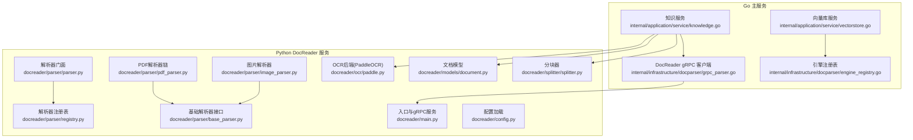
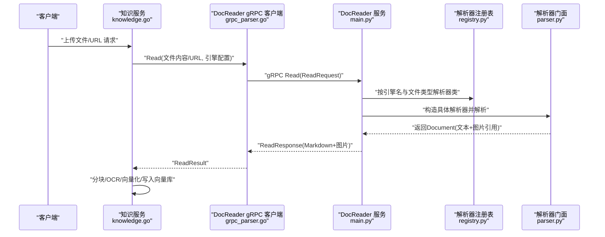
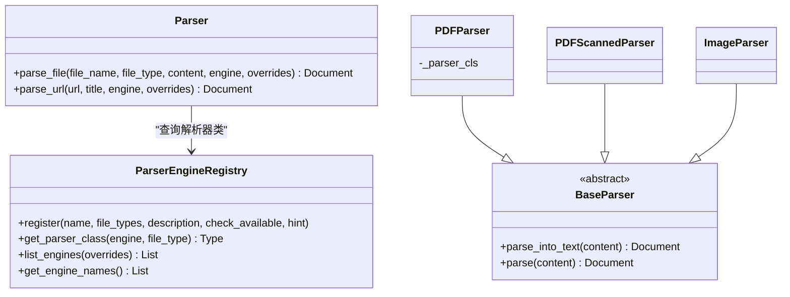
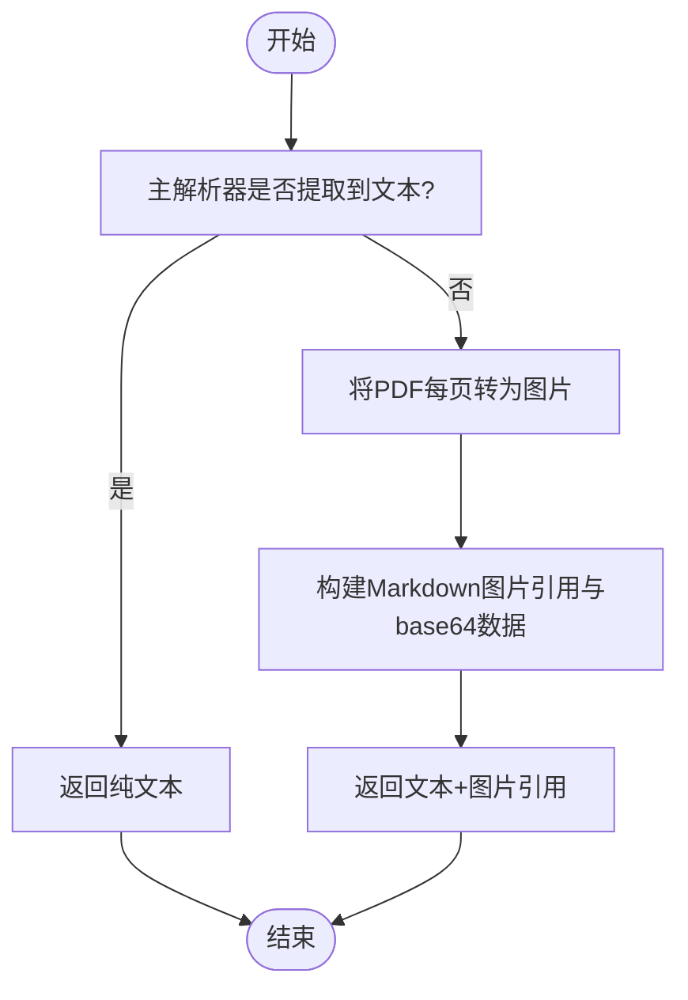
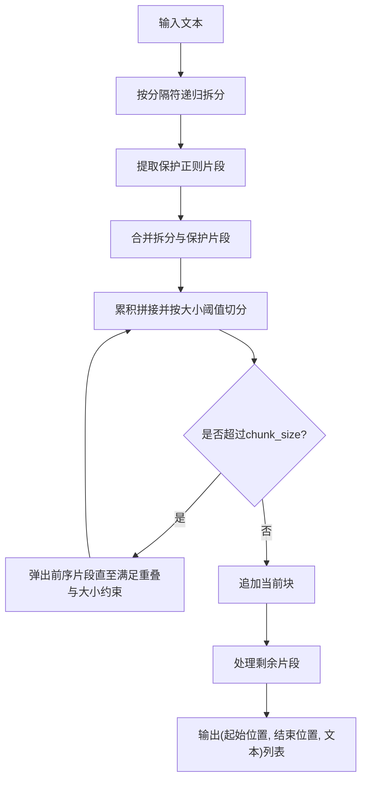
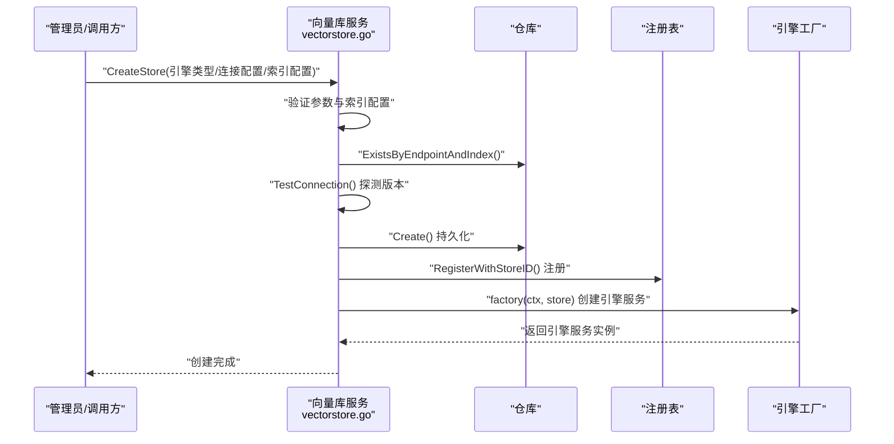
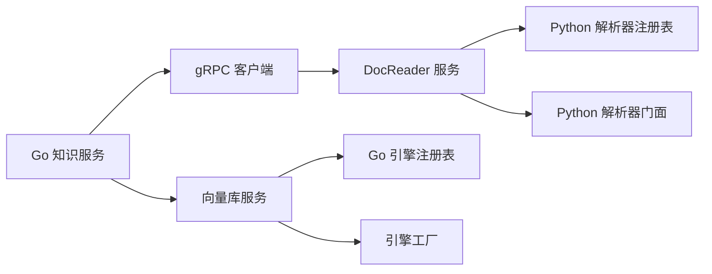

# 文档处理流程

<cite>
**本文引用的文件**
- [docreader/main.py](file://docreader/main.py)
- [docreader/config.py](file://docreader/config.py)
- [docreader/parser/parser.py](file://docreader/parser/parser.py)
- [docreader/parser/registry.py](file://docreader/parser/registry.py)
- [docreader/parser/base_parser.py](file://docreader/parser/base_parser.py)
- [docreader/parser/pdf_parser.py](file://docreader/parser/pdf_parser.py)
- [docreader/parser/image_parser.py](file://docreader/parser/image_parser.py)
- [docreader/splitter/splitter.py](file://docreader/splitter/splitter.py)
- [docreader/models/document.py](file://docreader/models/document.py)
- [docreader/ocr/paddle.py](file://docreader/ocr/paddle.py)
- [internal/infrastructure/docparser/grpc_parser.go](file://internal/infrastructure/docparser/grpc_parser.go)
- [internal/infrastructure/docparser/engine_registry.go](file://internal/infrastructure/docparser/engine_registry.go)
- [internal/application/service/vectorstore.go](file://internal/application/service/vectorstore.go)
- [internal/application/service/knowledge.go](file://internal/application/service/knowledge.go)
</cite>

## 目录
1. [简介](#简介)
2. [项目结构](#项目结构)
3. [核心组件](#核心组件)
4. [架构总览](#架构总览)
5. [详细组件分析](#详细组件分析)
6. [依赖分析](#依赖分析)
7. [性能考虑](#性能考虑)
8. [故障排查指南](#故障排查指南)
9. [结论](#结论)
10. [附录](#附录)

## 简介
本文件面向WeKnora的文档处理流程，系统性阐述从“文件上传/URL抓取”到“解析、分块、向量化”的完整技术实现与最佳实践。重点覆盖以下方面：
- 文件上传处理与来源识别（本地文件或URL）
- 存储后端选择（本地、S3、COS等）由Go应用侧负责，Python DocReader仅返回内联图片数据供Go侧持久化
- 解析服务调用（gRPC）与解析器选择机制（内置引擎、MarkItDown、MinerU、WeKnora Cloud等）
- 分块策略（固定大小、重叠、保护正则、标题上下文）
- 向量化与向量存储（嵌入模型调用、批量处理、向量库注册与可用性校验）
- OCR识别与图像处理（PaddleOCR后端）
- 错误处理与重试策略
- 性能优化与大规模处理建议

## 项目结构
WeKnora采用“Go主服务 + Python DocReader子服务”的双层架构：
- Go主服务负责业务编排、向量库注册、任务队列、存储后端对接、知识库检索与写入
- Python DocReader通过gRPC提供统一解析能力，输出Markdown文本与图片引用，不执行分块、OCR、向量化等后续步骤

图表来源
- [internal/application/service/knowledge.go:1-200](file://internal/application/service/knowledge.go#L1-L200)
- [internal/application/service/vectorstore.go:1-190](file://internal/application/service/vectorstore.go#L1-L190)
- [internal/infrastructure/docparser/grpc_parser.go:1-176](file://internal/infrastructure/docparser/grpc_parser.go#L1-L176)
- [internal/infrastructure/docparser/engine_registry.go:1-194](file://internal/infrastructure/docparser/engine_registry.go#L1-L194)
- [docreader/main.py:1-215](file://docreader/main.py#L1-L215)
- [docreader/parser/parser.py:1-83](file://docreader/parser/parser.py#L1-L83)
- [docreader/parser/registry.py:1-161](file://docreader/parser/registry.py#L1-L161)
- [docreader/parser/base_parser.py:1-62](file://docreader/parser/base_parser.py#L1-L62)
- [docreader/parser/pdf_parser.py:1-69](file://docreader/parser/pdf_parser.py#L1-L69)
- [docreader/parser/image_parser.py:1-29](file://docreader/parser/image_parser.py#L1-L29)
- [docreader/splitter/splitter.py:1-585](file://docreader/splitter/splitter.py#L1-L585)
- [docreader/models/document.py:1-88](file://docreader/models/document.py#L1-L88)
- [docreader/ocr/paddle.py:1-176](file://docreader/ocr/paddle.py#L1-L176)
- [docreader/config.py:1-122](file://docreader/config.py#L1-L122)

章节来源
- [docreader/main.py:1-215](file://docreader/main.py#L1-L215)
- [docreader/config.py:1-122](file://docreader/config.py#L1-L122)
- [docreader/parser/parser.py:1-83](file://docreader/parser/parser.py#L1-L83)
- [docreader/parser/registry.py:1-161](file://docreader/parser/registry.py#L1-L161)
- [docreader/parser/base_parser.py:1-62](file://docreader/parser/base_parser.py#L1-L62)
- [docreader/parser/pdf_parser.py:1-69](file://docreader/parser/pdf_parser.py#L1-L69)
- [docreader/parser/image_parser.py:1-29](file://docreader/parser/image_parser.py#L1-L29)
- [docreader/splitter/splitter.py:1-585](file://docreader/splitter/splitter.py#L1-L585)
- [docreader/models/document.py:1-88](file://docreader/models/document.py#L1-L88)
- [docreader/ocr/paddle.py:1-176](file://docreader/ocr/paddle.py#L1-L176)
- [internal/infrastructure/docparser/grpc_parser.go:1-176](file://internal/infrastructure/docparser/grpc_parser.go#L1-L176)
- [internal/infrastructure/docparser/engine_registry.go:1-194](file://internal/infrastructure/docparser/engine_registry.go#L1-L194)
- [internal/application/service/vectorstore.go:1-190](file://internal/application/service/vectorstore.go#L1-L190)
- [internal/application/service/knowledge.go:1-200](file://internal/application/service/knowledge.go#L1-L200)

## 核心组件
- DocReader gRPC服务：接收文件或URL请求，返回Markdown文本与图片引用
- 解析器门面与注册表：根据引擎名与文件类型选择具体解析器类，支持回退至内置引擎
- 基础解析器接口：统一parse_into_text契约，返回Document对象
- PDF解析器链：优先尝试MarkItDown，失败时回退到扫描版PDF转页为图片
- 图片解析器：将图片封装为Markdown引用与内联数据
- 分块器：基于分隔符、保护正则与标题上下文的智能分块
- 文档模型：统一的Document/Chunk结构，便于序列化与后续处理
- OCR后端：PaddleOCR，用于扫描版PDF的文本提取
- 向量库服务：向量库注册、连接性测试、索引配置校验
- 知识服务：编排上传/URL抓取、解析、分块、向量化、写入向量库与关系抽取

章节来源
- [docreader/main.py:98-182](file://docreader/main.py#L98-L182)
- [docreader/parser/parser.py:11-83](file://docreader/parser/parser.py#L11-L83)
- [docreader/parser/registry.py:18-110](file://docreader/parser/registry.py#L18-L110)
- [docreader/parser/base_parser.py:13-62](file://docreader/parser/base_parser.py#L13-L62)
- [docreader/parser/pdf_parser.py:13-69](file://docreader/parser/pdf_parser.py#L13-L69)
- [docreader/parser/image_parser.py:11-29](file://docreader/parser/image_parser.py#L11-L29)
- [docreader/splitter/splitter.py:31-145](file://docreader/splitter/splitter.py#L31-L145)
- [docreader/models/document.py:9-88](file://docreader/models/document.py#L9-L88)
- [docreader/ocr/paddle.py:16-176](file://docreader/ocr/paddle.py#L16-L176)
- [internal/application/service/vectorstore.go:36-99](file://internal/application/service/vectorstore.go#L36-L99)
- [internal/application/service/knowledge.go:61-141](file://internal/application/service/knowledge.go#L61-L141)

## 架构总览
下图展示从客户端到DocReader再到Go主服务的整体流程。

图表来源
- [internal/application/service/knowledge.go:1-200](file://internal/application/service/knowledge.go#L1-L200)
- [internal/infrastructure/docparser/grpc_parser.go:102-128](file://internal/infrastructure/docparser/grpc_parser.go#L102-L128)
- [docreader/main.py:103-161](file://docreader/main.py#L103-L161)
- [docreader/parser/registry.py:51-76](file://docreader/parser/registry.py#L51-L76)
- [docreader/parser/parser.py:25-64](file://docreader/parser/parser.py#L25-L64)

## 详细组件分析

### 文件上传与来源识别
- 支持两种来源：本地文件（含文件名、类型、字节流）与URL
- 通过请求中的标志位判断来源，并分别调用解析器的parse_file或parse_url
- 返回的Document包含纯文本内容与图片引用（图片数据以内联形式返回，由Go侧负责落地）

章节来源
- [docreader/main.py:103-161](file://docreader/main.py#L103-L161)

### 解析器选择与规则配置
- 引擎注册表维护引擎名到文件类型的映射
- 若指定引擎不支持该文件类型，则自动回退到内置引擎
- 支持远程引擎（如MarkItDown）通过ListEngines RPC动态发现，Go侧可合并本地与远程能力
- 引擎可用性检查由本地引擎注册表与DocReader服务共同完成

图表来源
- [docreader/parser/registry.py:18-110](file://docreader/parser/registry.py#L18-L110)
- [docreader/parser/parser.py:11-83](file://docreader/parser/parser.py#L11-L83)
- [docreader/parser/base_parser.py:13-62](file://docreader/parser/base_parser.py#L13-L62)
- [docreader/parser/pdf_parser.py:57-69](file://docreader/parser/pdf_parser.py#L57-L69)
- [docreader/parser/pdf_parser.py:13-56](file://docreader/parser/pdf_parser.py#L13-L56)
- [docreader/parser/image_parser.py:11-29](file://docreader/parser/image_parser.py#L11-L29)

章节来源
- [docreader/parser/registry.py:18-110](file://docreader/parser/registry.py#L18-L110)
- [docreader/parser/parser.py:11-83](file://docreader/parser/parser.py#L11-L83)
- [internal/infrastructure/docparser/engine_registry.go:140-193](file://internal/infrastructure/docparser/engine_registry.go#L140-L193)

### 文档预处理：OCR与图像处理
- 扫描版PDF解析器在主解析器无文本时，将每一页转为高分辨率图片，并生成Markdown图片引用
- 图片以base64形式随Document返回，Go侧负责上传到所选存储后端（本地/S3/COS等）
- OCR后端（PaddleOCR）提供CPU兼容模式与日志记录，适用于后续图像识别场景

图表来源
- [docreader/parser/pdf_parser.py:13-56](file://docreader/parser/pdf_parser.py#L13-L56)
- [docreader/parser/image_parser.py:19-29](file://docreader/parser/image_parser.py#L19-L29)
- [docreader/main.py:54-96](file://docreader/main.py#L54-L96)
- [docreader/ocr/paddle.py:16-176](file://docreader/ocr/paddle.py#L16-L176)

章节来源
- [docreader/parser/pdf_parser.py:13-69](file://docreader/parser/pdf_parser.py#L13-L69)
- [docreader/parser/image_parser.py:11-29](file://docreader/parser/image_parser.py#L11-L29)
- [docreader/main.py:54-96](file://docreader/main.py#L54-L96)
- [docreader/ocr/paddle.py:16-176](file://docreader/ocr/paddle.py#L16-L176)

### 分块策略实现
- 固定大小与重叠：通过TextSplitter控制chunk_size与chunk_overlap
- 保护正则：数学公式、表格、代码块、图片链接等被整体保留，避免切分破坏语义
- 标题上下文：HeaderTracker在分块前追踪标题，必要时将标题前置到新块以保持上下文
- 智能合并：递归拆分+合并，确保最终块不超过chunk_size且满足overlap约束

图表来源
- [docreader/splitter/splitter.py:116-145](file://docreader/splitter/splitter.py#L116-L145)
- [docreader/splitter/splitter.py:183-298](file://docreader/splitter/splitter.py#L183-L298)
- [docreader/splitter/splitter.py:299-408](file://docreader/splitter/splitter.py#L299-L408)

章节来源
- [docreader/splitter/splitter.py:31-585](file://docreader/splitter/splitter.py#L31-L585)

### 向量化与向量存储
- 向量库注册：创建向量库时进行连接性测试与版本探测，避免错误SDK导致协议错误
- 索引配置校验：名称、边界等参数合法性检查
- 注册表更新：成功持久化后尝试注册到运行时注册表，失败则等待重启自愈
- 批量处理：Go主服务在知识服务中组织批量写入，结合任务队列与并发控制

图表来源
- [internal/application/service/vectorstore.go:36-99](file://internal/application/service/vectorstore.go#L36-L99)
- [internal/application/service/vectorstore.go:140-160](file://internal/application/service/vectorstore.go#L140-L160)

章节来源
- [internal/application/service/vectorstore.go:1-190](file://internal/application/service/vectorstore.go#L1-L190)

### 错误处理与重试策略
- DocReader服务：捕获异常并返回ReadResponse.error字段，同时记录堆栈信息
- gRPC客户端：连接失败、未就绪、超时等情况均返回明确错误
- 引擎可用性：本地引擎与远程引擎均提供可用性检查，不可用时返回原因
- 重试建议：针对DocReader连接失败与远程引擎不可用，可在上层进行指数退避重试

章节来源
- [docreader/main.py:162-167](file://docreader/main.py#L162-L167)
- [internal/infrastructure/docparser/grpc_parser.go:46-70](file://internal/infrastructure/docparser/grpc_parser.go#L46-L70)
- [internal/infrastructure/docparser/engine_registry.go:140-193](file://internal/infrastructure/docparser/engine_registry.go#L140-L193)

## 依赖分析
- Go主服务依赖DocReader gRPC客户端，后者负责与Python DocReader通信
- 解析器注册表在Go侧与Python侧分别存在，Go侧负责合并与可用性检查，Python侧负责具体解析实现
- 向量库服务依赖注册表与工厂，动态创建引擎服务并注册到运行时

图表来源
- [internal/application/service/knowledge.go:61-88](file://internal/application/service/knowledge.go#L61-L88)
- [internal/infrastructure/docparser/grpc_parser.go:1-176](file://internal/infrastructure/docparser/grpc_parser.go#L1-L176)
- [docreader/main.py:1-215](file://docreader/main.py#L1-L215)
- [docreader/parser/registry.py:1-161](file://docreader/parser/registry.py#L1-L161)
- [internal/application/service/vectorstore.go:1-190](file://internal/application/service/vectorstore.go#L1-L190)
- [internal/infrastructure/docparser/engine_registry.go:1-194](file://internal/infrastructure/docparser/engine_registry.go#L1-L194)

章节来源
- [internal/application/service/knowledge.go:1-200](file://internal/application/service/knowledge.go#L1-L200)
- [internal/infrastructure/docparser/grpc_parser.go:1-176](file://internal/infrastructure/docparser/grpc_parser.go#L1-L176)
- [docreader/parser/registry.py:1-161](file://docreader/parser/registry.py#L1-L161)
- [internal/application/service/vectorstore.go:1-190](file://internal/application/service/vectorstore.go#L1-L190)
- [internal/infrastructure/docparser/engine_registry.go:1-194](file://internal/infrastructure/docparser/engine_registry.go#L1-L194)

## 性能考虑
- DocReader并发与消息大小：通过环境变量配置最大工作线程与gRPC消息大小，避免大文件传输阻塞
- 分块参数：合理设置chunk_size与chunk_overlap，平衡召回与上下文完整性
- 保护正则：避免对大表格/公式过度分割，减少重复向量化成本
- OCR与图片处理：扫描版PDF转图片时控制分辨率，避免过大图片增加存储与传输开销
- 向量库写入：批量写入与索引刷新策略需结合目标引擎特性调整
- 可用性检查：在创建向量库前进行连接测试，避免后续失败重试带来的资源浪费

章节来源
- [docreader/config.py:66-98](file://docreader/config.py#L66-L98)
- [docreader/splitter/splitter.py:23-24](file://docreader/splitter/splitter.py#L23-L24)
- [docreader/ocr/paddle.py:72-90](file://docreader/ocr/paddle.py#L72-L90)
- [internal/application/service/vectorstore.go:75-85](file://internal/application/service/vectorstore.go#L75-L85)

## 故障排查指南
- DocReader未连接：检查gRPC地址、端口与环境变量配置，确认服务已启动
- 文件类型不受支持：确认引擎注册表中是否存在对应文件类型，或切换到支持的引擎
- 扫描版PDF无文本：确认PDFScannedParser是否被触发，检查图片引用是否正确返回
- 向量库创建失败：查看连接测试结果与索引配置，确保端点与索引名唯一且合法
- OCR初始化失败：检查CPU指令集兼容性与依赖安装情况

章节来源
- [internal/infrastructure/docparser/grpc_parser.go:46-70](file://internal/infrastructure/docparser/grpc_parser.go#L46-L70)
- [docreader/parser/registry.py:77-106](file://docreader/parser/registry.py#L77-L106)
- [docreader/parser/pdf_parser.py:13-56](file://docreader/parser/pdf_parser.py#L13-L56)
- [internal/application/service/vectorstore.go:75-85](file://internal/application/service/vectorstore.go#L75-L85)
- [docreader/ocr/paddle.py:95-117](file://docreader/ocr/paddle.py#L95-L117)

## 结论
WeKnora的文档处理流程通过“Go主服务 + Python DocReader”的解耦设计，实现了高扩展性的解析、分块与向量化能力。Go侧负责存储后端、向量库注册与任务编排，Python侧专注多格式解析与图像处理。借助引擎注册表与可用性检查，系统能够灵活适配多种解析后端；通过保护正则与标题上下文的分块策略，保证了检索质量；通过连接测试与注册表自愈机制，提升了稳定性与可运维性。

## 附录
- 多格式支持：docx、pdf、md、xlsx、xls、各类图片格式等
- 引擎选择：builtin、markitdown、mineru、mineru_cloud、weknoracloud等
- 存储后端：本地、S3、COS等由Go应用侧统一管理，DocReader仅返回内联图片数据