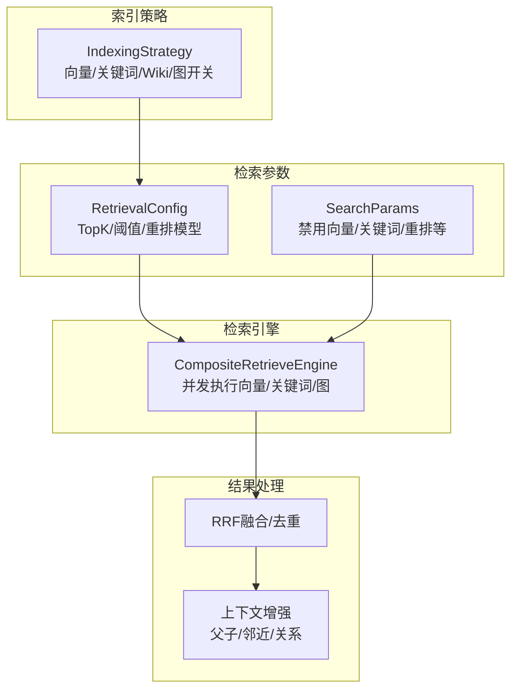
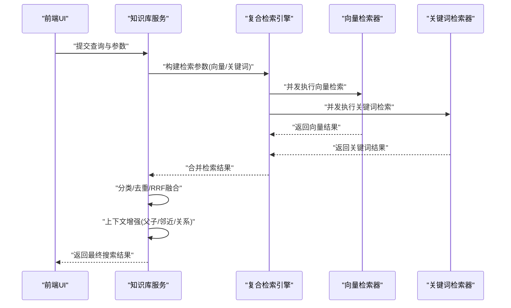
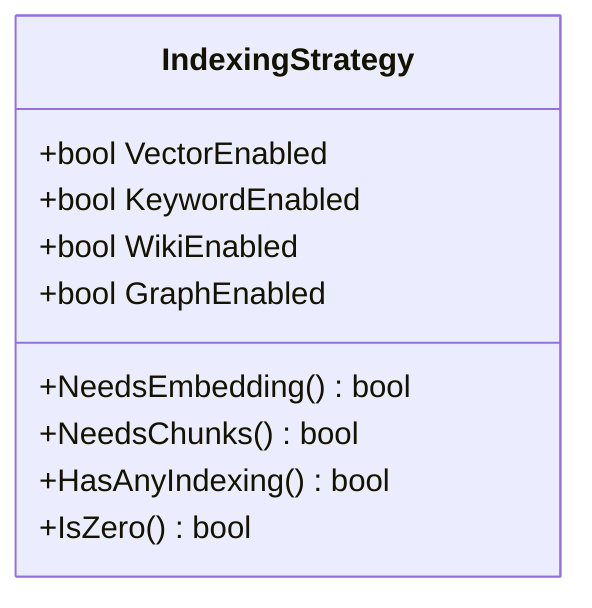
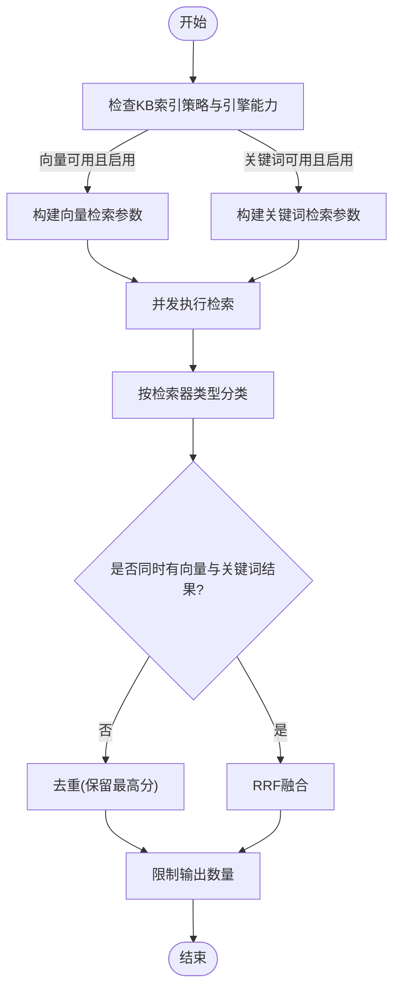
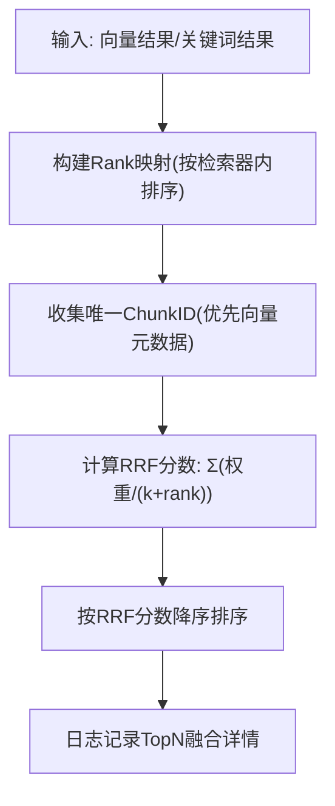
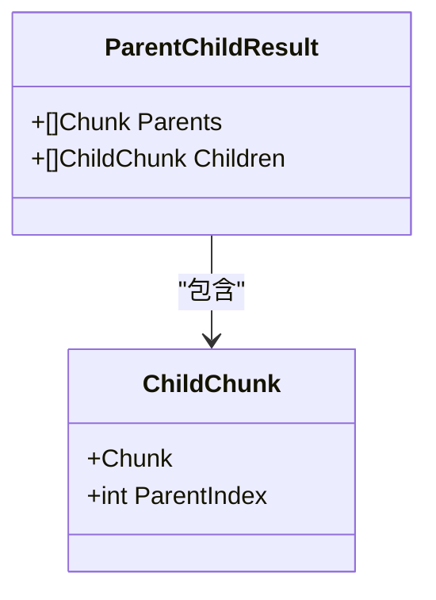
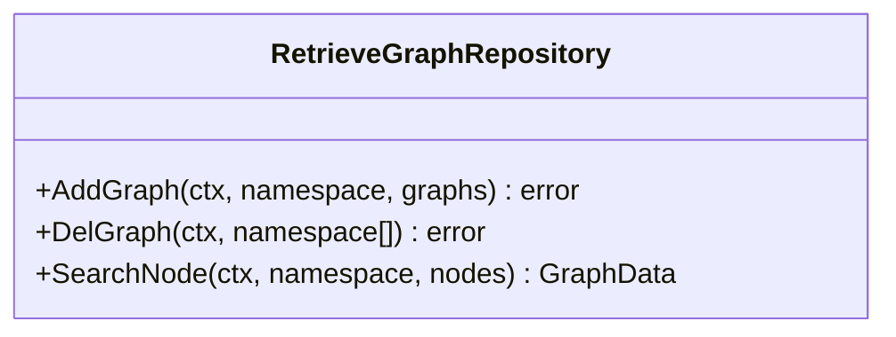

# 检索策略配置

<cite>
**本文引用的文件**
- [indexing_strategy.go](file://internal/types/indexing_strategy.go)
- [retrieval_config.go](file://internal/types/retrieval_config.go)
- [retriever.go](file://internal/types/retriever.go)
- [knowledgebase_search.go](file://internal/application/service/knowledgebase_search.go)
- [knowledgebase_search_fusion.go](file://internal/application/service/knowledgebase_search_fusion.go)
- [knowledgebase_search_results.go](file://internal/application/service/knowledgebase_search_results.go)
- [composite.go](file://internal/application/service/retriever/composite.go)
- [splitter.go](file://internal/infrastructure/chunker/splitter.go)
- [chunk.go](file://internal/types/chunk.go)
- [KBIndexingStrategy.vue](file://frontend/src/views/knowledge/settings/KBIndexingStrategy.vue)
- [RetrievalSettings.vue](file://frontend/src/views/settings/RetrievalSettings.vue)
- [AgentSettings.vue](file://frontend/src/views/settings/AgentSettings.vue)
- [rerank.go](file://internal/application/service/chat_pipeline/rerank.go)
- [retriever_graph.go](file://internal/types/interfaces/retriever_graph.go)
</cite>

## 目录
1. [简介](#简介)
2. [项目结构](#项目结构)
3. [核心组件](#核心组件)
4. [架构总览](#架构总览)
5. [详细组件分析](#详细组件分析)
6. [依赖分析](#依赖分析)
7. [性能考量](#性能考量)
8. [故障排查指南](#故障排查指南)
9. [结论](#结论)
10. [附录](#附录)

## 简介
本文件面向WeKnora的检索策略配置，系统性阐述索引策略(IndexingStrategy)的设计理念与配置项，覆盖向量搜索(vector)、关键词搜索(keyword)、Wiki生成(wiki)与知识图谱(graph)的启用控制；同时文档化多种检索策略的实现：BM25稀疏检索、密集向量检索、混合检索与图RAG检索；详解检索结果融合算法（加权融合、排序融合与重排策略）；解释父子分块检索策略（parent-child chunking）在提供上下文的同时使用子块进行向量匹配；并给出检索性能优化策略（索引优化、缓存机制与查询加速）、最佳实践与不同场景下的推荐设置。

## 项目结构
WeKnora的检索体系由“索引策略”“检索参数”“检索引擎”“结果处理”四层构成：
- 索引策略：控制哪些处理流水线启用（向量/关键词/Wiki/图），决定文档入库阶段的处理范围。
- 检索参数：全局检索配置（TopK、阈值、重排模型等），以及每次检索的局部参数（如禁用向量/关键词匹配）。
- 检索引擎：复合检索引擎按策略并发执行向量与关键词检索，支持后续图检索扩展。
- 结果处理：分类、融合、去重、重排与上下文增强（父子块、邻近块、关系块）。

**图表来源**
- [indexing_strategy.go:1-78](file://internal/types/indexing_strategy.go#L1-L78)
- [retrieval_config.go:1-85](file://internal/types/retrieval_config.go#L1-L85)
- [knowledgebase_search.go:76-168](file://internal/application/service/knowledgebase_search.go#L76-L168)
- [knowledgebase_search_fusion.go:12-142](file://internal/application/service/knowledgebase_search_fusion.go#L12-L142)
- [knowledgebase_search_results.go:13-91](file://internal/application/service/knowledgebase_search_results.go#L13-L91)

**章节来源**
- [indexing_strategy.go:1-78](file://internal/types/indexing_strategy.go#L1-L78)
- [retrieval_config.go:1-85](file://internal/types/retrieval_config.go#L1-L85)
- [knowledgebase_search.go:76-168](file://internal/application/service/knowledgebase_search.go#L76-L168)

## 核心组件
- 索引策略(IndexingStrategy)
  - 控制向量、关键词、Wiki、图四个处理流水线的启用/禁用。
  - 提供NeedsEmbedding/NeedsChunks/HasAnyIndexing/IsZero等判定方法，便于索引与检索前置判断。
- 全局检索配置(RetrievalConfig)
  - 包含EmbeddingTopK、VectorThreshold、KeywordThreshold、RerankTopK、RerankThreshold、RerankModelID等。
  - 提供GetEffectiveXxx()方法，确保默认值安全回退。
- 检索结果类型
  - IndexWithScore：检索命中项（ChunkID、Score、匹配类型等）。
  - RetrieveResult：一次检索返回结果集及来源引擎类型。
- 检索服务
  - HybridSearch：构建检索参数、并发检索、融合与后处理。
  - buildRetrievalParams：根据KB策略与引擎能力构造向量/关键词参数。
  - 分类与融合：按检索器类型分离向量/关键词结果，执行去重或RRF融合。
  - 结果后处理：批量拉取知识与块数据，上下文增强（父子/邻近/关系），组装最终SearchResult。

**章节来源**
- [indexing_strategy.go:8-52](file://internal/types/indexing_strategy.go#L8-L52)
- [retrieval_config.go:8-27](file://internal/types/retrieval_config.go#L8-L27)
- [retriever.go:95-101](file://internal/types/retriever.go#L95-L101)
- [knowledgebase_search.go:76-168](file://internal/application/service/knowledgebase_search.go#L76-L168)
- [knowledgebase_search_fusion.go:12-142](file://internal/application/service/knowledgebase_search_fusion.go#L12-L142)
- [knowledgebase_search_results.go:13-91](file://internal/application/service/knowledgebase_search_results.go#L13-L91)

## 架构总览
WeKnora的检索采用“复合检索引擎 + 多路融合”的架构：前端通过UI配置索引策略与检索参数；后端根据策略与引擎能力并发执行向量与关键词检索；对结果进行分类、去重或RRF融合；随后进行上下文增强与最终结果组装。

**图表来源**
- [knowledgebase_search.go:76-168](file://internal/application/service/knowledgebase_search.go#L76-L168)
- [composite.go:131-166](file://internal/application/service/retriever/composite.go#L131-L166)
- [knowledgebase_search_fusion.go:12-142](file://internal/application/service/knowledgebase_search_fusion.go#L12-L142)
- [knowledgebase_search_results.go:13-91](file://internal/application/service/knowledgebase_search_results.go#L13-L91)

## 详细组件分析

### 索引策略(IndexingStrategy)设计与配置
- 设计理念
  - 四个布尔开关独立控制：向量(语义嵌入与相似度搜索)、关键词(BM25)、Wiki(从文档自动生成页面)、图(实体/关系抽取)。
  - 通过NeedsEmbedding/NeedsChunks等方法，避免不必要的预处理与检索开销。
- 配置入口
  - 后端类型定义与序列化/反序列化。
  - 前端知识库设置界面提供开关与子设置区域。
- 默认行为
  - 默认启用向量与关键词，禁用Wiki与图，兼容历史行为。

**图表来源**
- [indexing_strategy.go:8-52](file://internal/types/indexing_strategy.go#L8-L52)

**章节来源**
- [indexing_strategy.go:8-52](file://internal/types/indexing_strategy.go#L8-L52)
- [KBIndexingStrategy.vue:40-62](file://frontend/src/views/knowledge/settings/KBIndexingStrategy.vue#L40-L62)

### 检索策略实现：BM25稀疏检索、密集向量检索、混合检索
- BM25稀疏检索
  - 由关键词检索器负责，适用于结构化查询与短语匹配。
  - 参数包含TopK与KeywordThreshold，受RetrievalConfig影响。
- 密集向量检索
  - 由向量检索器负责，依赖Embedding模型生成查询向量与候选向量相似度计算。
  - 支持跨租户共享KB时使用源租户的Embedding模型以保证向量兼容。
- 混合检索
  - 同时执行向量与关键词检索，使用RRF融合提升召回与精度平衡。
  - Over-retrieval策略：按匹配数量的若干倍进行检索，再融合与限制输出。

**图表来源**
- [knowledgebase_search.go:170-267](file://internal/application/service/knowledgebase_search.go#L170-L267)
- [knowledgebase_search_fusion.go:12-142](file://internal/application/service/knowledgebase_search_fusion.go#L12-L142)

**章节来源**
- [knowledgebase_search.go:170-267](file://internal/application/service/knowledgebase_search.go#L170-L267)
- [knowledgebase_search_fusion.go:12-142](file://internal/application/service/knowledgebase_search_fusion.go#L12-L142)

### 检索结果融合算法：加权融合、排序融合与重排策略
- 加权融合
  - 对单一检索器（向量或关键词）结果，按ChunkID去重并保留最高分，保持原有分数。
- 排序融合(RRF)
  - 对混合检索，使用Reciprocal Rank Fusion：对每个Chunk计算加权倒数排名分数，再整体降序排序。
  - 融合参数：权重与常数k固定，确保向量与关键词贡献均衡。
- 重排策略
  - 在聊天/会话场景中，结合重排模型对候选结果进行二次打分与排序，必要时自动降低阈值以保证有结果输出。
  - 重排后综合基础分与模型分，更新最终得分。

**图表来源**
- [knowledgebase_search_fusion.go:79-142](file://internal/application/service/knowledgebase_search_fusion.go#L79-L142)

**章节来源**
- [knowledgebase_search_fusion.go:31-49](file://internal/application/service/knowledgebase_search_fusion.go#L31-L49)
- [rerank.go:115-153](file://internal/application/service/chat_pipeline/rerank.go#L115-L153)

### 父子分块检索策略(parent-child chunking)
- 设计目标
  - 父块提供上下文与结构信息，子块用于向量匹配，兼顾上下文完整性与语义检索精度。
- 实现要点
  - 分两层切分：先大块作为父块，再在父块内切分为小块作为子块。
  - 子块携带全局唯一序号，父块与子块建立父子关系，便于检索后上下文增强。
  - 父块不参与向量索引，但作为检索结果的上下文补充。
- 上下文增强
  - 主要结果中若包含子块，则补充其父块、邻近块与关系块，提升回答质量。

**图表来源**
- [splitter.go:498-537](file://internal/infrastructure/chunker/splitter.go#L498-L537)
- [chunk.go:14-39](file://internal/types/chunk.go#L14-L39)
- [knowledgebase_search_results.go:127-193](file://internal/application/service/knowledgebase_search_results.go#L127-L193)

**章节来源**
- [splitter.go:511-537](file://internal/infrastructure/chunker/splitter.go#L511-L537)
- [knowledgebase_search_results.go:127-193](file://internal/application/service/knowledgebase_search_results.go#L127-L193)

### 知识图谱检索(Graph Retrieval)与Wiki生成
- 知识图谱检索
  - 通过图检索接口定义，支持节点搜索与图数据管理，作为检索策略之一启用。
- Wiki生成
  - 当Wiki启用时，文档会被处理为Wiki页面，便于知识组织与检索。

**图表来源**
- [retriever_graph.go:9-17](file://internal/types/interfaces/retriever_graph.go#L9-L17)

**章节来源**
- [indexing_strategy.go:16-19](file://internal/types/indexing_strategy.go#L16-L19)
- [KBIndexingStrategy.vue:40-62](file://frontend/src/views/knowledge/settings/KBIndexingStrategy.vue#L40-L62)

## 依赖分析
- 组件耦合
  - 知识库服务依赖复合检索引擎与检索参数，负责参数构建与并发执行。
  - 融合模块独立于具体检索器类型，仅依赖统一的结果结构。
  - 结果处理模块依赖知识与块的数据访问层，完成上下文增强与最终组装。
- 外部依赖
  - 向量检索依赖Embedding模型；关键词检索依赖向量数据库/全文索引；图检索依赖图存储。
- 循环依赖
  - 检索服务与融合模块解耦良好，未见循环依赖迹象。

**图表来源**
- [knowledgebase_search.go:76-168](file://internal/application/service/knowledgebase_search.go#L76-L168)
- [knowledgebase_search_fusion.go:12-142](file://internal/application/service/knowledgebase_search_fusion.go#L12-L142)
- [knowledgebase_search_results.go:13-91](file://internal/application/service/knowledgebase_search_results.go#L13-L91)

**章节来源**
- [knowledgebase_search.go:76-168](file://internal/application/service/knowledgebase_search.go#L76-L168)
- [knowledgebase_search_fusion.go:12-142](file://internal/application/service/knowledgebase_search_fusion.go#L12-L142)
- [knowledgebase_search_results.go:13-91](file://internal/application/service/knowledgebase_search_results.go#L13-L91)

## 性能考量
- 索引优化
  - 向量索引：合理设置集合/分片/副本参数，确保高吞吐与低延迟。
  - 全文索引：针对关键词检索优化字段索引与分词策略。
- 缓存机制
  - 复用查询向量：同一租户内共享Embedding模型时，可复用已生成的查询向量。
  - 结果缓存：对热点查询与常用KB组合进行结果缓存（需注意时效性与一致性）。
- 查询加速
  - Over-retrieval：混合检索前扩大TopK，融合后再裁剪，提升召回稳定性。
  - 并发执行：向量与关键词检索并发，缩短端到端延迟。
  - 去重与融合：减少重复块，降低下游处理成本。
- 重排优化
  - 动态阈值：当重排无结果时自动降低阈值重试，保证体验连续性。

[本节为通用性能建议，无需特定文件引用]

## 故障排查指南
- 无结果或结果过少
  - 检查索引策略：确认向量或关键词至少启用一项。
  - 调整阈值：适当降低VectorThreshold/KeywordThreshold/RerankThreshold。
  - 扩大TopK：提高EmbeddingTopK或RerankTopK。
- 结果质量不佳
  - 使用RRF融合：确保向量与关键词均启用并参与融合。
  - 启用上下文增强：父子/邻近/关系块有助于提升准确性。
- 重排失败或无结果
  - 查看重排阈值降级日志，确认是否触发自动降阈。
  - 检查重排模型ID与可用性。
- 跨租户共享KB向量不兼容
  - 确认使用源租户的Embedding模型，避免向量维度不一致导致检索异常。

**章节来源**
- [knowledgebase_search.go:113-118](file://internal/application/service/knowledgebase_search.go#L113-L118)
- [rerank.go:115-153](file://internal/application/service/chat_pipeline/rerank.go#L115-L153)

## 结论
WeKnora的检索策略以“索引策略+检索参数+复合引擎+结果融合”为核心，既支持传统BM25与向量检索，也通过RRF融合与上下文增强提升效果。父子分块策略在保证上下文完整性的同时提升向量匹配精度。通过合理的阈值、TopK与重排策略，可在不同场景下取得良好的召回与精度平衡。建议在生产环境中结合业务特征持续调优参数，并关注跨租户兼容性与缓存策略。

## 附录

### 检索配置最佳实践
- 通用场景
  - 启用向量与关键词，使用默认阈值与TopK；开启RRF融合；启用上下文增强。
- 问答/FAQ场景
  - 优先保留向量或关键词的原始分数，必要时进行迭代检索与负向问题过滤。
- 长文档/报告
  - 启用父子分块策略，确保上下文完整；适当提高Over-retrieval倍数。
- 低延迟要求
  - 减少TopK、启用结果缓存、并发执行检索；谨慎使用重排。

### 前端配置入口
- 索引策略开关：知识库设置界面提供向量/关键词/Wiki/图开关与子设置。
- 全局检索参数：租户设置界面提供EmbeddingTopK、VectorThreshold、KeywordThreshold、RerankTopK、RerankThreshold等滑块与数值输入。

**章节来源**
- [KBIndexingStrategy.vue:40-62](file://frontend/src/views/knowledge/settings/KBIndexingStrategy.vue#L40-L62)
- [RetrievalSettings.vue:33-119](file://frontend/src/views/settings/RetrievalSettings.vue#L33-L119)
- [AgentSettings.vue:402-440](file://frontend/src/views/settings/AgentSettings.vue#L402-L440)