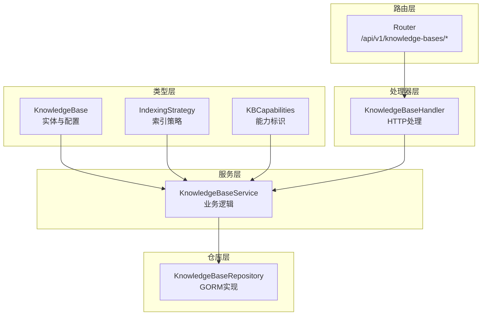
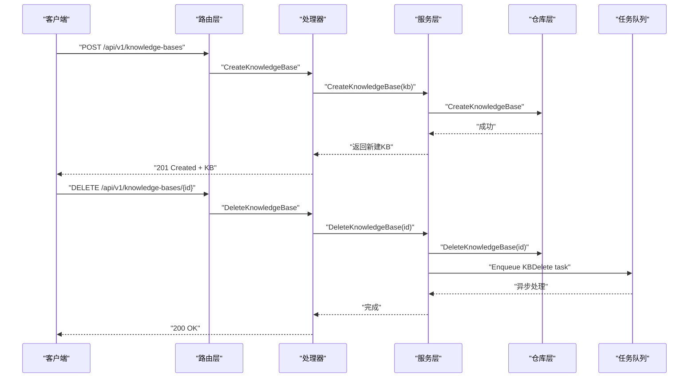
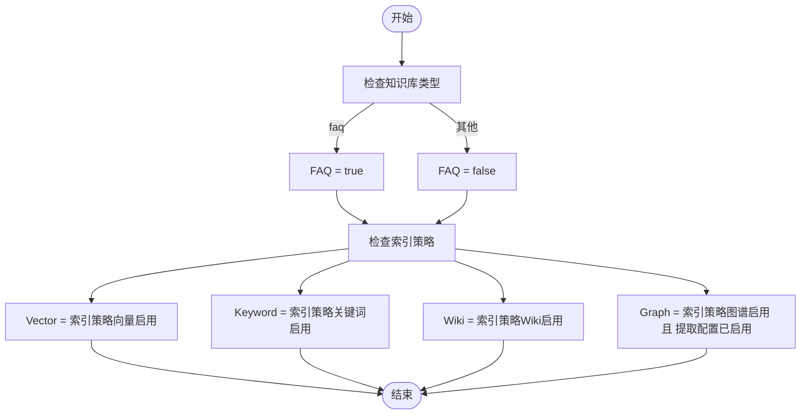
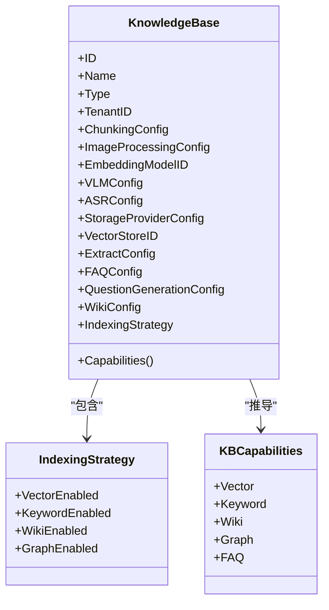

# 知识库管理

<cite>
**本文引用的文件**
- [knowledgebase.go](file://internal/types/knowledgebase.go)
- [knowledgebase_test.go](file://internal/types/knowledgebase_test.go)
- [interfaces/knowledgebase.go](file://internal/types/interfaces/knowledgebase.go)
- [repository/knowledgebase.go](file://internal/application/repository/knowledgebase.go)
- [service/knowledgebase.go](file://internal/application/service/knowledgebase.go)
- [handler/knowledgebase.go](file://internal/handler/knowledgebase.go)
- [router.go](file://internal/router/router.go)
- [indexing_strategy.go](file://internal/types/indexing_strategy.go)
- [knowledgebase.go](file://client/knowledgebase.go)
</cite>

## 目录
1. [简介](#简介)
2. [项目结构](#项目结构)
3. [核心组件](#核心组件)
4. [架构总览](#架构总览)
5. [详细组件分析](#详细组件分析)
6. [依赖分析](#依赖分析)
7. [性能考虑](#性能考虑)
8. [故障排查指南](#故障排查指南)
9. [结论](#结论)
10. [附录](#附录)

## 简介
本文件面向WeKnora知识库管理功能，系统性阐述知识库类型设计、实体结构、配置项、生命周期管理、API接口与能力标识（Capabilities）。重点覆盖三类知识库：
- 文档知识库（document）：面向结构化/半结构化文档，支持向量检索、关键词检索、可选的Wiki生成与知识图谱抽取。
- FAQ知识库（faq）：面向问答对，支持问题与答案的联合索引或仅问题索引，适合问答检索场景。
- Wiki知识库（wiki）：面向维基页面生成与浏览，强调Wiki功能的启用与页面治理。

同时，文档还解释了知识库的配置项（分块、图像处理、嵌入模型、提取配置、FAQ配置、Wiki配置、索引策略等），以及基于这些配置推导出的能力标识（向量搜索、关键词搜索、Wiki、图谱、FAQ）。

## 项目结构
知识库管理涉及类型定义、服务层、仓库层、HTTP处理器与路由注册，整体采用分层架构：
- 类型层：定义知识库实体、配置结构、能力标识与索引策略。
- 服务层：封装业务逻辑（创建、查询、更新、删除、复制、计数填充、异步清理等）。
- 仓库层：数据持久化接口与实现（GORM）。
- 处理器层：HTTP路由与鉴权/权限校验。
- 路由层：REST API路由注册。

图表来源
- [knowledgebase.go:41-108](file://internal/types/knowledgebase.go#L41-L108)
- [indexing_strategy.go:8-20](file://internal/types/indexing_strategy.go#L8-L20)
- [interfaces/knowledgebase.go:14-132](file://internal/types/interfaces/knowledgebase.go#L14-L132)
- [repository/knowledgebase.go:15-23](file://internal/application/repository/knowledgebase.go#L15-L23)
- [service/knowledgebase.go:21-62](file://internal/application/service/knowledgebase.go#L21-L62)
- [handler/knowledgebase.go:25-49](file://internal/handler/knowledgebase.go#L25-L49)
- [router.go:261-287](file://internal/router/router.go#L261-L287)

章节来源
- [router.go:261-287](file://internal/router/router.go#L261-L287)
- [handler/knowledgebase.go:25-49](file://internal/handler/knowledgebase.go#L25-L49)
- [service/knowledgebase.go:21-62](file://internal/application/service/knowledgebase.go#L21-L62)
- [repository/knowledgebase.go:15-23](file://internal/application/repository/knowledgebase.go#L15-L23)
- [knowledgebase.go:41-108](file://internal/types/knowledgebase.go#L41-L108)
- [indexing_strategy.go:8-20](file://internal/types/indexing_strategy.go#L8-L20)

## 核心组件
- 知识库实体与配置
  - 实体字段：ID、名称、类型、描述、租户ID、是否临时、是否置顶、创建/更新时间、软删除时间、计数字段（知识数、分块数）、处理状态（处理中、待处理数量）、分享数等。
  - 配置字段：分块配置（ChunkingConfig）、图像处理配置（ImageProcessingConfig）、嵌入模型ID、摘要模型ID、VLM配置、ASR配置、存储提供商配置、向量库绑定ID、提取配置（ExtractConfig）、FAQ配置（FAQConfig）、问题生成配置（QuestionGenerationConfig）、Wiki配置（WikiConfig）、索引策略（IndexingStrategy）。
- 能力标识（KBCapabilities）
  - 向量（Vector）、关键词（Keyword）、Wiki、图谱（Graph）、FAQ。
  - 由索引策略与类型共同决定，序列化时自动注入到JSON响应中，便于前端按能力过滤。
- 索引策略（IndexingStrategy）
  - 控制向量、关键词、Wiki、图谱四项索引管道的启用状态，默认保留历史行为（向量+关键词启用，Wiki/图谱关闭）。
- 生命周期管理
  - 创建、查询、列表、更新、置顶切换、删除（异步清理）、复制（异步任务）、计数填充、嵌入模型设置等。
- 权限与共享
  - 支持组织共享与共享智能体访问控制，不同角色（拥有者、编辑者、查看者）具有不同操作权限。

章节来源
- [knowledgebase.go:41-108](file://internal/types/knowledgebase.go#L41-L108)
- [knowledgebase.go:529-574](file://internal/types/knowledgebase.go#L529-L574)
- [indexing_strategy.go:8-31](file://internal/types/indexing_strategy.go#L8-L31)
- [service/knowledgebase.go:74-99](file://internal/application/service/knowledgebase.go#L74-L99)
- [service/knowledgebase.go:266-333](file://internal/application/service/knowledgebase.go#L266-L333)
- [service/knowledgebase.go:352-408](file://internal/application/service/knowledgebase.go#L352-L408)
- [service/knowledgebase.go:591-638](file://internal/application/service/knowledgebase.go#L591-L638)
- [handler/knowledgebase.go:151-246](file://internal/handler/knowledgebase.go#L151-L246)

## 架构总览
知识库管理的端到端流程如下：
- HTTP请求进入路由层，经鉴权与权限校验后交由处理器。
- 处理器调用服务层，服务层协调仓库层进行数据持久化与计数填充。
- 异步任务（如知识库删除、复制）通过任务队列执行重负载清理或迁移。
- 能力标识在序列化时自动计算并返回，供前端筛选。

图表来源
- [router.go:261-287](file://internal/router/router.go#L261-L287)
- [handler/knowledgebase.go:104-149](file://internal/handler/knowledgebase.go#L104-L149)
- [handler/knowledgebase.go:516-562](file://internal/handler/knowledgebase.go#L516-L562)
- [service/knowledgebase.go:74-99](file://internal/application/service/knowledgebase.go#L74-L99)
- [service/knowledgebase.go:352-408](file://internal/application/service/knowledgebase.go#L352-L408)

## 详细组件分析

### 知识库类型设计与适用场景
- 文档知识库（document）
  - 适用于结构化/半结构化文档，支持向量检索、关键词检索、可选的Wiki生成与知识图谱抽取。
  - 可开启“问题生成”配置，为每个分块生成问题，提升召回。
- FAQ知识库（faq）
  - 专为问答对设计，支持“仅问题索引”和“问题+答案联合索引”，适合问答检索与相似问题匹配。
- Wiki知识库（wiki）
  - 侧重维基页面生成与浏览，Wiki功能需显式启用；与图谱抽取可并行配置。

章节来源
- [knowledgebase.go:12-18](file://internal/types/knowledgebase.go#L12-L18)
- [knowledgebase.go:464-468](file://internal/types/knowledgebase.go#L464-L468)
- [knowledgebase.go:366-373](file://internal/types/knowledgebase.go#L366-L373)

### 知识库实体结构与字段作用
- 基本字段
  - ID：唯一标识，创建时自动生成。
  - 名称、描述：用户可见信息。
  - 类型：document/faq/wiki。
  - 租户ID：多租户隔离。
  - 是否临时：临时知识库不参与UI列表展示。
  - 是否置顶：置顶排序优先级。
  - 计数字段：知识数、分块数、处理中数量、分享数（运行时计算/填充）。
- 配置字段
  - 分块配置：分块大小、重叠、分隔符、父子分块策略、解析引擎规则等。
  - 图像处理配置：图像模型ID。
  - 嵌入模型ID、摘要模型ID：用于向量化与摘要生成。
  - VLM配置：多模态视觉语言模型开关与参数。
  - ASR配置：语音识别开关与语言提示。
  - 存储提供商配置：本地/MinIO/COS/TOS/S3/OSS等。
  - 向量库绑定ID：知识库绑定的向量库，创建后不可修改。
  - 提取配置：知识图谱抽取开关与结构化参数。
  - FAQ配置：FAQ索引模式与问题索引模式。
  - 问题生成配置：文档知识库的问答生成策略。
  - Wiki配置：Wiki功能的合成模型、粒度等参数。
  - 索引策略：向量、关键词、Wiki、图谱四类管道的启用状态。
- 时间戳与软删除：创建/更新时间、软删除时间，便于审计与恢复。

章节来源
- [knowledgebase.go:41-108](file://internal/types/knowledgebase.go#L41-L108)
- [knowledgebase.go:131-154](file://internal/types/knowledgebase.go#L131-L154)
- [knowledgebase.go:295-299](file://internal/types/knowledgebase.go#L295-L299)
- [knowledgebase.go:335-349](file://internal/types/knowledgebase.go#L335-L349)
- [knowledgebase.go:409-414](file://internal/types/knowledgebase.go#L409-L414)
- [knowledgebase.go:170-174](file://internal/types/knowledgebase.go#L170-L174)
- [knowledgebase.go:438-445](file://internal/types/knowledgebase.go#L438-L445)
- [knowledgebase.go:464-468](file://internal/types/knowledgebase.go#L464-L468)
- [knowledgebase.go:366-373](file://internal/types/knowledgebase.go#L366-L373)
- [knowledgebase.go:82-87](file://internal/types/knowledgebase.go#L82-L87)

### 知识库配置选项详解
- 分块配置（ChunkingConfig）
  - 分块大小、重叠、分隔符、父子分块策略、解析引擎规则、启用多模态（兼容字段）。
  - 解析引擎规则允许针对不同文件类型选择特定解析器。
- 图像处理配置（ImageProcessingConfig）
  - 图像模型ID，用于图像内容的处理与理解。
- 嵌入模型配置（embedding_model_id）
  - 与索引策略联动，向量与关键词检索均依赖嵌入模型。
- 提取配置（ExtractConfig）
  - 知识图谱抽取开关与结构化参数（文本、标签、节点、关系）。
- FAQ配置（FAQConfig）
  - 索引模式：仅问题或问题+答案。
  - 问题索引模式：合并或分离。
- 问题生成配置（QuestionGenerationConfig）
  - 文档知识库可为每个分块生成若干问题，提升召回。
- Wiki配置（WikiConfig）
  - Wiki功能启用时的合成模型、粒度等参数。
- 索引策略（IndexingStrategy）
  - 向量、关键词、Wiki、图谱四类管道的启用状态。
  - 默认策略：向量+关键词启用，Wiki/图谱关闭。
  - 任一启用都会触发嵌入模型需求。

章节来源
- [knowledgebase.go:131-154](file://internal/types/knowledgebase.go#L131-L154)
- [knowledgebase.go:295-299](file://internal/types/knowledgebase.go#L295-L299)
- [knowledgebase.go:438-445](file://internal/types/knowledgebase.go#L438-L445)
- [knowledgebase.go:464-468](file://internal/types/knowledgebase.go#L464-L468)
- [knowledgebase.go:366-373](file://internal/types/knowledgebase.go#L366-L373)
- [indexing_strategy.go:8-31](file://internal/types/indexing_strategy.go#L8-L31)

### 知识库生命周期管理
- 创建
  - 自动生成ID、设置租户ID、创建时间、更新时间，应用默认配置。
- 查询
  - 单条查询、批量查询、按租户查询、按ID集合查询。
- 列表
  - 按租户列出，忽略临时知识库；支持置顶优先排序。
- 更新
  - 支持名称、描述与配置更新；索引策略更新时同步到提取配置与Wiki配置。
- 置顶切换
  - 切换置顶状态并记录置顶时间。
- 删除
  - 标记删除后，异步任务清理嵌入、分块、文件与图谱数据。
- 复制
  - 异步任务复制知识库内容，支持生成新目标知识库。
- 计数填充
  - 运行时填充知识数、分块数、处理中数量等统计。
- 嵌入模型设置
  - 设置知识库使用的嵌入模型ID。

章节来源
- [service/knowledgebase.go:74-99](file://internal/application/service/knowledgebase.go#L74-L99)
- [service/knowledgebase.go:101-138](file://internal/application/service/knowledgebase.go#L101-L138)
- [service/knowledgebase.go:157-211](file://internal/application/service/knowledgebase.go#L157-L211)
- [service/knowledgebase.go:266-333](file://internal/application/service/knowledgebase.go#L266-L333)
- [service/knowledgebase.go:335-350](file://internal/application/service/knowledgebase.go#L335-L350)
- [service/knowledgebase.go:352-408](file://internal/application/service/knowledgebase.go#L352-L408)
- [service/knowledgebase.go:545-589](file://internal/application/service/knowledgebase.go#L545-L589)
- [service/knowledgebase.go:591-638](file://internal/application/service/knowledgebase.go#L591-L638)
- [repository/knowledgebase.go:25-85](file://internal/application/repository/knowledgebase.go#L25-L85)

### 权限控制与共享
- 拥有者（admin）：完整权限，可删除。
- 编辑者（editor）：可更新配置与内容。
- 查看者（viewer）：仅可读，部分共享场景下可访问。
- 组织共享与共享智能体：
  - 支持通过组织共享与共享智能体访问控制，不同模式（none/all/selected）限制KB可见范围。
  - 对于共享KB，嵌入查询使用源租户ID。

章节来源
- [handler/knowledgebase.go:151-246](file://internal/handler/knowledgebase.go#L151-L246)
- [handler/knowledgebase.go:288-413](file://internal/handler/knowledgebase.go#L288-L413)

### 能力标识（KBCapabilities）与推导规则
- 向量（Vector）：由索引策略的向量启用决定。
- 关键词（Keyword）：由索引策略的关键词启用决定。
- Wiki：由索引策略的Wiki启用决定。
- 图谱（Graph）：由索引策略的图谱启用且存在有效提取配置决定。
- FAQ：由知识库类型为faq决定。
- 序列化时自动注入capabilities字段，便于前端按能力过滤。

图表来源
- [knowledgebase.go:546-600](file://internal/types/knowledgebase.go#L546-L600)

章节来源
- [knowledgebase.go:529-574](file://internal/types/knowledgebase.go#L529-L574)
- [knowledgebase.go:576-600](file://internal/types/knowledgebase.go#L576-L600)

### API接口文档（REST）
- 路由组：/api/v1/knowledge-bases
- 路由注册位置：RegisterKnowledgeBaseRoutes
- 主要接口
  - POST /knowledge-bases：创建知识库
  - GET /knowledge-bases：获取当前租户知识库列表（或受共享智能体限制）
  - GET /knowledge-bases/{id}：获取知识库详情（含计数填充与共享权限）
  - PUT /knowledge-bases/{id}：更新知识库（名称、描述、配置）
  - DELETE /knowledge-bases/{id}：删除知识库（异步清理）
  - PUT /knowledge-bases/{id}/pin：置顶/取消置顶
  - GET /knowledge-bases/{id}/hybrid-search：混合搜索（向量+关键词）
  - POST /knowledge-bases/copy：复制知识库（异步任务）
  - GET /knowledge-bases/copy/progress/{task_id}：查询复制进度
  - GET /knowledge-bases/{id}/move-targets：获取可移动目标知识库列表
- 认证与授权
  - 需要Bearer或ApiKeyAuth。
  - 不同操作对角色有要求（拥有者/编辑者/查看者）。
- 返回格式
  - 成功：{"success": true, "data": ...}
  - 错误：{"success": false, "error": {...}}

章节来源
- [router.go:261-287](file://internal/router/router.go#L261-L287)
- [handler/knowledgebase.go:104-149](file://internal/handler/knowledgebase.go#L104-L149)
- [handler/knowledgebase.go:288-413](file://internal/handler/knowledgebase.go#L288-L413)
- [handler/knowledgebase.go:459-514](file://internal/handler/knowledgebase.go#L459-L514)
- [handler/knowledgebase.go:516-562](file://internal/handler/knowledgebase.go#L516-L562)
- [handler/knowledgebase.go:578-706](file://internal/handler/knowledgebase.go#L578-L706)
- [handler/knowledgebase.go:708-741](file://internal/handler/knowledgebase.go#L708-L741)

### 客户端SDK示例路径
- 创建知识库：client/knowledgebase.go
- 获取知识库：client/knowledgebase.go
- 列出知识库：client/knowledgebase.go

章节来源
- [knowledgebase.go:198-236](file://client/knowledgebase.go#L198-L236)

## 依赖分析
- 类型层依赖
  - KnowledgeBase依赖IndexingStrategy、FAQConfig、ExtractConfig、ChunkingConfig、ImageProcessingConfig、VLMConfig、ASRConfig、WikiConfig等。
  - KBCapabilities由KnowledgeBase的配置推导。
- 服务层依赖
  - KnowledgeBaseService依赖仓库接口、知识/分块/图谱仓库、模型服务、租户服务、文件服务、任务队列等。
- 仓库层依赖
  - GORM数据库访问，提供CRUD与列表查询。
- 处理器层依赖
  - 知识库服务、知识服务、共享服务、任务队列客户端。
- 路由层依赖
  - Gin路由注册，统一鉴权中间件。

图表来源
- [knowledgebase.go:41-108](file://internal/types/knowledgebase.go#L41-L108)
- [indexing_strategy.go:8-20](file://internal/types/indexing_strategy.go#L8-L20)
- [knowledgebase.go:529-574](file://internal/types/knowledgebase.go#L529-L574)

章节来源
- [interfaces/knowledgebase.go:14-132](file://internal/types/interfaces/knowledgebase.go#L14-L132)
- [repository/knowledgebase.go:15-23](file://internal/application/repository/knowledgebase.go#L15-L23)
- [service/knowledgebase.go:21-62](file://internal/application/service/knowledgebase.go#L21-L62)
- [handler/knowledgebase.go:25-49](file://internal/handler/knowledgebase.go#L25-L49)

## 性能考虑
- 异步清理：删除知识库后，嵌入、分块、文件与图谱数据通过任务队列异步清理，避免阻塞主流程。
- 计数延迟：列表与详情中的知识数/分块数等统计在查询时按需填充，减少冗余存储。
- 索引策略：仅启用必要的索引管道，降低向量化与索引成本。
- 向量库绑定：知识库创建时绑定向量库，后续不可变更，确保检索一致性。
- 多模态与解析引擎：合理配置解析引擎规则，避免不必要的解析开销。

## 故障排查指南
- 创建失败
  - 检查请求参数合法性与租户上下文。
  - 查看服务日志与错误码。
- 权限不足
  - 确认用户角色与共享设置；共享智能体模式下需满足allowed tools与KB能力匹配。
- 删除异常
  - 确认删除任务是否成功入队；检查异步任务队列状态。
- 能力标识不符预期
  - 检查索引策略与类型配置；确认ExtractConfig启用状态。

章节来源
- [handler/knowledgebase.go:151-246](file://internal/handler/knowledgebase.go#L151-L246)
- [handler/knowledgebase.go:516-562](file://internal/handler/knowledgebase.go#L516-L562)
- [service/knowledgebase.go:410-543](file://internal/application/service/knowledgebase.go#L410-L543)

## 结论
WeKnora的知识库管理以清晰的类型与配置体系为基础，结合灵活的索引策略与能力标识，实现了文档、FAQ与Wiki三大场景的统一管理。通过分层架构与异步任务，系统在保证功能完整性的同时兼顾性能与可维护性。前端可通过能力标识精准筛选知识库，提升用户体验。

## 附录
- 测试用例
  - 提供了存储提供商方案解析与向量库ID序列化/反序列化的测试，确保兼容性与正确性。

章节来源
- [knowledgebase_test.go:9-59](file://internal/types/knowledgebase_test.go#L9-L59)
- [knowledgebase_test.go:72-126](file://internal/types/knowledgebase_test.go#L72-L126)
- [knowledgebase_test.go:128-157](file://internal/types/knowledgebase_test.go#L128-L157)