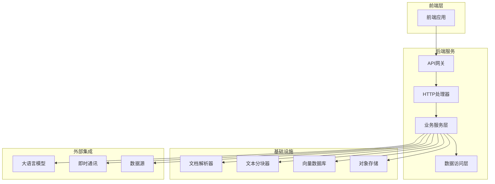
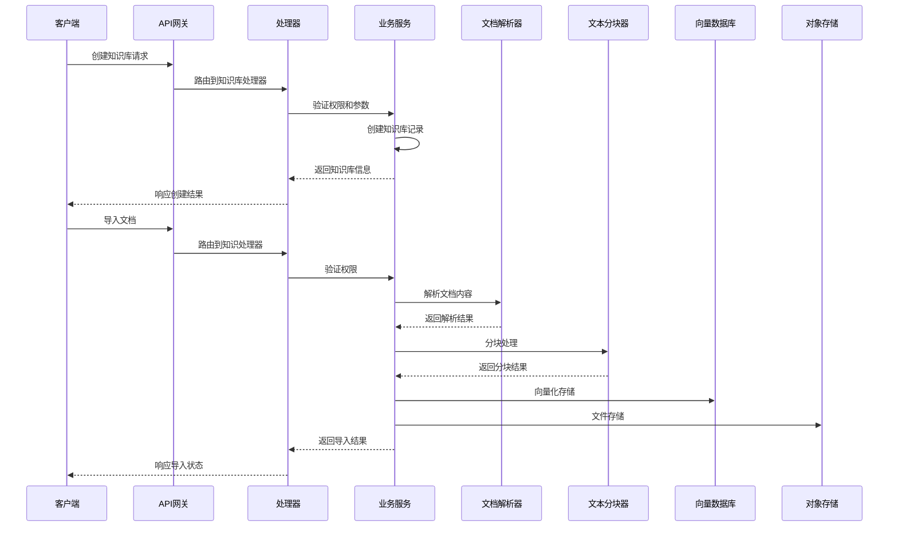
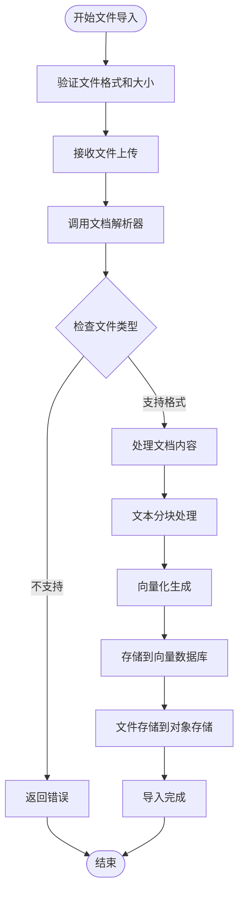
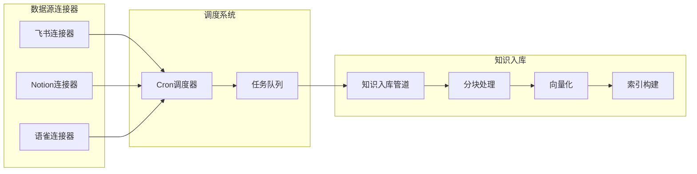
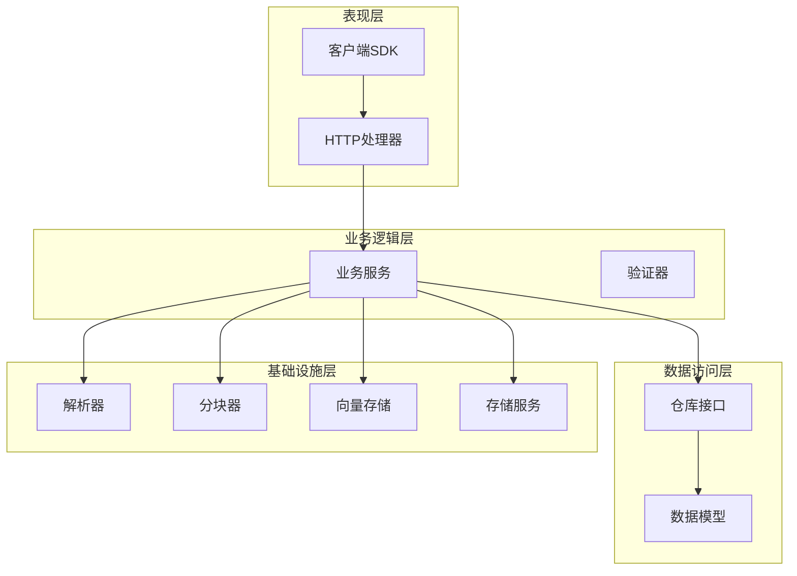

# 知识管理系统

<cite>
**本文引用的文件**
- [README.md](file://README.md)
- [知识库类型设计:45-49](file://README.md#L45-L49)
- [知识库类型常量:12-18](file://internal/types/knowledgebase.go#L12-L18)
- [FAQ索引模式:20-38](file://internal/types/knowledgebase.go#L20-L38)
- [知识库服务实现:74-99](file://internal/application/service/knowledgebase.go#L74-L99)
- [知识库处理器实现:104-149](file://internal/handler/knowledgebase.go#L104-L149)
- [知识库客户端封装:198-211](file://client/knowledgebase.go#L198-L211)
- [文档导入API:25-76](file://docs/api/knowledge.md#L25-L76)
- [URL导入API:78-125](file://docs/api/knowledge.md#L78-L125)
- [手动知识导入API:362-417](file://docs/api/knowledge.md#L362-L417)
- [知识库分块配置:131-154](file://internal/types/knowledgebase.go#L131-L154)
- [父-子分块策略:511-550](file://internal/infrastructure/chunker/splitter.go#L511-L550)
- [检索策略配置:14-27](file://internal/types/retrieval_config.go#L14-L27)
- [索引策略配置:8-20](file://internal/types/indexing_strategy.go#L8-L20)
- [向量存储服务:36-99](file://internal/application/service/vectorstore.go#L36-L99)
- [数据源连接器接口:9-29](file://internal/datasource/connector.go#L9-L29)
- [数据源连接器注册:1499-1513](file://internal/container/container.go#L1499-L1513)
- [数据源导入架构:124-184](file://docs/数据源导入开发文档.md#L124-L184)
- [知识库搜索FAQ迭代检索:66-105](file://internal/application/service/knowledgebase_search_faq.go#L66-L105)
- [知识图谱相关性检索:722-807](file://internal/application/service/graph.go#L722-L807)
- [Qdrant批量写入:225-266](file://internal/application/repository/retriever/qdrant/repository.go#L225-L266)
- [PostgreSQL批量更新:618-643](file://internal/application/repository/retriever/postgres/repository.go#L618-L643)
</cite>

## 目录
1. [简介](#简介)
2. [项目结构](#项目结构)
3. [核心组件](#核心组件)
4. [架构总览](#架构总览)
5. [详细组件分析](#详细组件分析)
6. [依赖关系分析](#依赖关系分析)
7. [性能考虑](#性能考虑)
8. [故障排除指南](#故障排除指南)
9. [结论](#结论)
10. [附录](#附录)

## 简介
WeKnora是一个基于大语言模型的文档理解与检索框架，提供企业级知识管理与问答能力。系统支持两种问答模式：快速问答（基于RAG）和智能推理（基于ReAct代理引擎）。WeKnora支持多种文档格式解析、多模态处理、知识图谱构建，并提供完整的知识库管理API。

## 项目结构
WeKnora采用模块化架构设计，主要包含以下核心模块：

**图表来源**
- [README.md:166-168](file://README.md#L166-L168)

**章节来源**
- [README.md:41-211](file://README.md#L41-L211)

## 核心组件

### 知识库类型设计
WeKnora支持三种知识库类型，每种类型都有不同的适用场景和配置选项：

#### 文档知识库（document）
- **适用场景**：存储和检索结构化文档内容
- **特点**：支持多种文档格式解析、分块向量化、关键词检索
- **配置选项**：分块大小、重叠、分隔符、多模态处理

#### FAQ知识库（faq）
- **适用场景**：存储问答对，支持相似问题匹配
- **特点**：专门的FAQ索引模式，支持问题和答案的联合索引
- **配置选项**：索引模式（仅问题/问题+答案）、问题索引模式（合并/分离）

#### Wiki知识库（wiki）
- **适用场景**：自动生成维基页面
- **特点**：支持从文档自动生成wiki页面
- **配置选项**：wiki生成配置

**章节来源**
- [README.md:186-189](file://README.md#L186-L189)
- [internal/types/knowledgebase.go:12-18](file://internal/types/knowledgebase.go#L12-L18)
- [internal/types/knowledgebase.go:20-38](file://internal/types/knowledgebase.go#L20-L38)

### 检索策略配置
系统提供灵活的检索策略配置，支持多种检索模式的组合：

#### 全局检索配置
- **向量TopK**：向量检索返回的最大片段数（默认50）
- **向量阈值**：向量相似度分数阈值（默认0.15）
- **关键词阈值**：关键词匹配分数阈值（默认0.3）
- **重排序TopK**：重排序后的结果数（默认10）
- **重排序阈值**：重排序分数阈值（默认0.2）
- **重排序模型**：重排序使用的模型ID

#### 索引策略
- **向量检索**：语义向量嵌入和搜索
- **关键词检索**：基于BM25的关键词搜索
- **Wiki生成**：从文档自动生成wiki页面
- **知识图谱**：实体关系抽取和图构建

**章节来源**
- [internal/types/retrieval_config.go:14-27](file://internal/types/retrieval_config.go#L14-L27)
- [internal/types/indexing_strategy.go:8-20](file://internal/types/indexing_strategy.go#L8-L20)

## 架构总览
WeKnora采用分层架构设计，实现了高度模块化的知识管理流程：

**图表来源**
- [internal/handler/knowledgebase.go:104-149](file://internal/handler/knowledgebase.go#L104-L149)
- [internal/application/service/knowledgebase.go:74-99](file://internal/application/service/knowledgebase.go#L74-L99)

## 详细组件分析

### 文档导入流程技术实现

#### 文件上传处理
系统支持多种文档格式的上传处理，包括PDF、Word、图片、Excel等10+种格式。文件上传采用流式处理，避免内存溢出。

**图表来源**
- [docs/api/knowledge.md:25-76](file://docs/api/knowledge.md#L25-L76)
- [internal/application/service/knowledgebase.go:74-99](file://internal/application/service/knowledgebase.go#L74-L99)

#### 解析服务调用
文档解析采用多引擎架构，支持内置解析器和外部解析服务：

- **内置解析器**：处理常见文档格式
- **外部解析服务**：支持复杂的文档格式和自定义解析需求
- **OCR识别**：支持图片中的文字识别
- **多模态处理**：支持图片、表格等内容的结构化提取

#### 分块向量化过程
系统采用智能分块策略，确保检索效果和性能的平衡：

- **智能分块**：根据文档结构和内容特征进行分块
- **重叠处理**：保证上下文连续性
- **向量化存储**：生成高维向量并存储到向量数据库
- **索引优化**：针对不同向量数据库进行索引优化

**章节来源**
- [docs/api/knowledge.md:25-125](file://docs/api/knowledge.md#L25-L125)
- [internal/infrastructure/chunker/splitter.go:142-167](file://internal/infrastructure/chunker/splitter.go#L142-L167)

### 数据源导入功能

#### 飞书数据源集成
WeKnora提供完整的飞书数据源同步机制：

- **Wiki同步**：支持飞书Wiki页面的增量和全量同步
- **文档同步**：支持飞书文档的自动同步
- **权限控制**：基于飞书组织架构的权限管理
- **增量更新**：支持基于时间戳的增量同步

#### Notion数据源集成
Notion数据源提供现代化的文档管理体验：

- **页面同步**：支持Notion页面的自动同步
- **数据库集成**：支持Notion数据库内容的结构化导入
- **模板支持**：支持Notion模板的继承和应用
- **媒体处理**：支持图片、文件等媒体内容的处理

**图表来源**
- [internal/container/container.go:1499-1513](file://internal/container/container.go#L1499-L1513)
- [docs/数据源导入开发文档.md:124-184](file://docs/数据源导入开发文档.md#L124-L184)

**章节来源**
- [internal/datasource/connector.go:9-29](file://internal/datasource/connector.go#L9-L29)
- [internal/container/container.go:1499-1513](file://internal/container/container.go#L1499-L1513)

### 知识库管理API接口

#### CRUD操作
WeKnora提供完整的知识库管理API，支持RESTful风格的操作：

- **创建知识库**：POST /knowledge-bases
- **获取知识库**：GET /knowledge-bases/{id}
- **更新知识库**：PUT /knowledge-bases/{id}
- **删除知识库**：DELETE /knowledge-bases/{id}

#### 混合搜索API
支持向量和关键词的混合搜索：

- **混合搜索**：GET /knowledge-bases/{id}/hybrid-search
- **参数配置**：向量阈值、关键词阈值、匹配数量
- **结果排序**：支持向量和关键词结果的融合排序

#### 批量处理API
支持批量知识管理和迁移：

- **批量导入**：支持多文件同时导入
- **批量迁移**：支持知识库间的数据迁移
- **批量删除**：支持批量清理知识内容

**章节来源**
- [client/knowledgebase.go:198-211](file://client/knowledgebase.go#L198-L211)
- [internal/handler/knowledgebase.go:51-102](file://internal/handler/knowledgebase.go#L51-L102)

### 检索策略配置详解

#### BM25稀疏检索
系统支持基于BM25算法的关键词检索：

- **关键词匹配**：基于TF-IDF的关键词匹配
- **权重计算**：支持自定义权重和阈值
- **结果排序**：基于BM25评分的结果排序

#### 密集检索
基于向量嵌入的语义检索：

- **向量生成**：支持多种嵌入模型
- **相似度计算**：基于余弦相似度的向量匹配
- **TopK选择**：支持TopK结果的选择和过滤

#### 图RAG检索
基于知识图谱的增强检索：

- **实体链接**：自动识别和链接文档中的实体
- **关系推理**：基于图关系进行推理和扩展
- **多跳检索**：支持多跳关系的深度检索

#### 父子分块策略
高级分块策略提升检索精度：

- **两级分块**：父块提供上下文，子块用于向量化
- **上下文保持**：父块保持大范围上下文信息
- **精确匹配**：子块提供精确的语义匹配

**章节来源**
- [internal/types/indexing_strategy.go:8-20](file://internal/types/indexing_strategy.go#L8-L20)
- [internal/infrastructure/chunker/splitter.go:511-550](file://internal/infrastructure/chunker/splitter.go#L511-L550)

## 依赖关系分析

### 组件耦合度
WeKnora采用松耦合的设计原则，各组件之间通过清晰的接口进行交互：

**图表来源**
- [internal/handler/knowledgebase.go:25-49](file://internal/handler/knowledgebase.go#L25-L49)
- [internal/application/service/knowledgebase.go:21-62](file://internal/application/service/knowledgebase.go#L21-L62)

### 外部依赖
系统对外部组件的依赖关系清晰明确：

- **向量数据库**：支持PostgreSQL、Elasticsearch、Milvus、Weaviate、Qdrant等多种向量数据库
- **对象存储**：支持本地存储、MinIO、AWS S3、阿里云OSS等存储方案
- **即时通讯**：支持企业微信、飞书、Slack、Telegram等IM平台
- **大语言模型**：支持OpenAI、Azure OpenAI、通义千问等多种LLM提供商

**章节来源**
- [README.md:196-201](file://README.md#L196-L201)

## 性能考虑

### 大规模数据处理能力
WeKnora针对大规模数据处理进行了专门优化：

#### 批量写入优化
- **向量数据库批量写入**：支持多维度向量的批量插入
- **PostgreSQL批量更新**：支持分批更新chunk启用状态
- **内存管理**：采用流式处理避免内存溢出

#### 索引优化策略
- **维度特定集合**：Qdrant按维度创建独立集合
- **批量操作**：减少数据库往返次数
- **缓存机制**：热点数据缓存提升访问速度

#### 并行处理
- **异步任务**：使用Asynq实现异步任务处理
- **并发控制**：支持多任务并发执行
- **资源限制**：防止资源耗尽的保护机制

**章节来源**
- [internal/application/repository/retriever/qdrant/repository.go:225-266](file://internal/application/repository/retriever/qdrant/repository.go#L225-L266)
- [internal/application/repository/retriever/postgres/repository.go:618-643](file://internal/application/repository/retriever/postgres/repository.go#L618-L643)

### 权限控制策略
系统提供多层次的权限控制机制：

- **租户隔离**：不同租户数据完全隔离
- **知识库权限**：支持知识库级别的读写权限控制
- **共享机制**：支持跨租户的知识库共享
- **审计日志**：完整操作记录便于审计

## 故障排除指南

### 常见问题诊断
系统提供了完善的错误处理和诊断机制：

#### 知识库创建失败
- **权限不足**：检查用户权限和租户绑定
- **配置错误**：验证知识库配置参数
- **存储问题**：检查向量数据库和对象存储连接

#### 文档导入异常
- **格式不支持**：确认文档格式是否在支持列表中
- **解析失败**：检查解析器配置和依赖服务
- **内存不足**：调整分块大小和重叠设置

#### 检索性能问题
- **向量维度**：检查嵌入模型维度设置
- **索引配置**：验证向量数据库索引配置
- **查询参数**：调整阈值和TopK参数

**章节来源**
- [internal/handler/knowledgebase.go:151-246](file://internal/handler/knowledgebase.go#L151-L246)

## 结论
WeKnora知识管理系统通过模块化架构设计和先进的检索技术，为企业提供了完整的知识管理解决方案。系统支持多种知识库类型、灵活的检索策略、强大的数据源集成能力和高性能的大规模数据处理能力。通过清晰的API设计和完善的权限控制机制，WeKnora能够满足企业级知识管理的各种需求。

## 附录

### API参考文档
系统提供完整的API参考文档，涵盖所有核心功能的接口定义和使用示例。

### 部署指南
详细的部署文档包括本地部署、Docker部署和Kubernetes部署等多种部署方式。

### 开发指南
为开发者提供的完整开发指南，包括环境搭建、代码贡献和扩展开发指导。