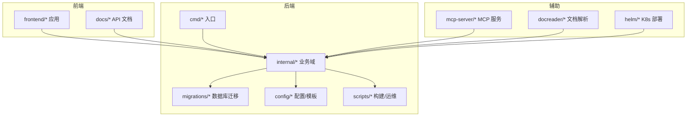
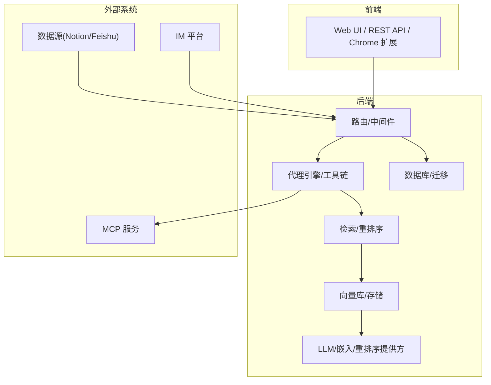

# 版本发展历史

<cite>
**本文引用的文件**
- [CHANGELOG.md](file://CHANGELOG.md)
- [README.md](file://README.md)
- [README_CN.md](file://README_CN.md)
- [ROADMAP.md](file://docs/ROADMAP.md)
- [go.mod](file://go.mod)
- [migration.go](file://internal/database/migration.go)
- [000000_init.up.sql](file://migrations/versioned/000000_init.up.sql)
- [000037_wiki_and_indexing.up.sql](file://migrations/versioned/000037_wiki_and_indexing.up.sql)
- [000034_add_attachments.up.sql](file://migrations/versioned/000034_add_attachments.up.sql)
- [embedder.go](file://internal/models/embedding/embedder.go)
- [azure_openai.go](file://internal/models/provider/azure_openai.go)
- [connector.go](file://internal/datasource/connector/notion/connector.go)
- [vector-store.ts](file://frontend/src/api/vector-store.ts)
- [vector-store.md](file://docs/api/vector-store.md)
- [longconn.go](file://internal/im/wecom/longconn.go)
- [ws_adapter.go](file://internal/im/wecom/ws_adapter.go)
- [longpoll.go](file://internal/im/wechat/longpoll.go)
- [adapter.go](file://internal/im/wechat/adapter.go)
- [qa.go](file://internal/handler/session/qa.go)
- [attachment_processor.go](file://internal/handler/session/attachment_processor.go)
- [message.go](file://internal/types/message.go)
</cite>

## 目录
1. [简介](#简介)
2. [项目结构](#项目结构)
3. [核心组件](#核心组件)
4. [架构总览](#架构总览)
5. [详细组件分析](#详细组件分析)
6. [依赖分析](#依赖分析)
7. [性能考量](#性能考量)
8. [故障排查指南](#故障排查指南)
9. [结论](#结论)
10. [附录](#附录)

## 简介
本文件系统梳理 WeKnora 从 v0.2.0 到 v0.4.0 的版本演进历程，聚焦以下维度：
- 关键特性与功能迭代：Agent 模式、知识库类型、向量数据库、IM 平台、Web 搜索、MCP 工具链、附件处理、WeKnora Cloud 等
- 架构演进与技术路线：模块化设计、可插拔 LLM/向量库/存储、异步任务与自动迁移、可观测性与安全加固
- 升级指南与兼容性：数据库迁移、配置项变化、前端/后端交互变更、第三方集成差异
- 未来规划：路线图与发展方向，帮助用户把握项目演进方向

## 项目结构
WeKnora 采用前后端分离与模块化后端的组织方式：
- 后端（Go）：cmd、internal（业务域）、migrations（数据库迁移）、config（提示词模板）、scripts（构建与运维）
- 前端（Vue）：frontend（应用）、docs（API 文档）
- 辅助组件：mcp-server（MCP 服务）、docreader（文档解析子应用）、helm（K8s 部署）

图表来源
- [go.mod:1-325](file://go.mod#L1-L325)

章节来源
- [go.mod:1-325](file://go.mod#L1-L325)

## 核心组件
- 代理引擎与工具链：ReAct Agent、MCP 工具、Web 搜索、数据分析师 Agent、Suggested Questions、并行工具调用
- 知识管理：FAQ/文档知识库、父-子分块、知识库固定、批量导入/导出、Wiki 与索引策略
- 检索与重排序：向量检索、关键词检索、混合检索、重排序、图谱检索
- 多模态与附件：图像/音频/文档附件上传与处理、ASR、图像描述生成
- 平台与集成：WeCom/Feishu/Slack/Telegram/DingTalk/Mattermost/WeChat、Notion 数据源、Azure OpenAI、阿里云 OSS、Qdrant/Weaviate/Elasticsearch/Milvus/ParadeDB 等向量库
- 可观测性与安全：日志、追踪（OpenTelemetry/Langfuse）、SSRF/SQL 注入防护、MCP stdio 安全加固、API Key 认证

章节来源
- [README.md:41-211](file://README.md#L41-L211)
- [CHANGELOG.md:5-100](file://CHANGELOG.md#L5-L100)

## 架构总览
WeKnora 采用“文档解析—向量化—检索—LLM 推理”的模块化管道，支持本地/私有云部署与零门槛 Web UI。

图表来源
- [README.md:164-211](file://README.md#L164-L211)
- [CHANGELOG.md:5-100](file://CHANGELOG.md#L5-L100)

## 详细组件分析

### v0.2.0：ReAct Agent 与多类型知识库
- Agent 模式：ReAct 多步推理，调用内置工具、MCP 工具与 Web 搜索，跨知识库检索
- 知识库类型：FAQ 与文档两类，支持文件夹/URL 导入、标签管理、在线条目
- 会话策略：可配置 Agent/普通模型、检索阈值、Prompt 在线编辑
- Web 搜索：可扩展搜索引擎（内置 DuckDuckGo）
- MCP 工具：支持多种传输方式（Stdio/HTTP Stream/SSE）
- UI 升级：Agent/普通模式切换、工具调用过程展示、知识库管理界面升级
- 基础设施：MQ 异步任务、自动数据库迁移、快速开发模式

章节来源
- [CHANGELOG.md:649-727](file://CHANGELOG.md#L649-L727)
- [README.md:151-161](file://README.md#L151-L161)

### v0.3.0：共享空间与 Agent Skills
- 共享空间：成员邀请、跨成员共享知识库与 Agent、租户隔离检索
- Agent Skills：预置技能、沙箱执行环境
- Web 搜索：新增 Bing、Google；Tavily 提供商
- 思考模式：Agent 思考内容过滤
- FAQ 增强：批量导入预演、相似问题、匹配问题字段、大导入落对象存储
- 安全加固：SSRF 安全 HTTP 客户端、SQL 校验集中化、MCP stdio 安全加固、沙箱执行
- 基础设施：Qdrant 向量库支持、Redis ACL、可配置日志级别、Ollama 嵌入优化

章节来源
- [CHANGELOG.md:312-346](file://CHANGELOG.md#L312-L346)
- [README.md:135-150](file://README.md#L135-L150)

### v0.3.2：知识搜索入口与向量库/存储扩展
- 新增“知识搜索”入口，支持将检索结果直接带入会话窗口
- 解析器/存储引擎配置：按数据源选择解析器与存储，知识库内按文件类型选择解析器
- 图像渲染：本地存储模式下对话中图像渲染与优化占位符
- 文档预览：嵌入式文档预览组件
- 向量库：Milvus 支持；对象存储：Volcengine TOS
- IM：WeCom/Feishu/Slack 机器人集成（WebSocket/Webhook、流式、知识库集成）
- Mermaid 渲染：聊天中支持流程图渲染与导出
- 批量会话管理：批量删除会话
- 远程 URL 知识：支持从远程文件 URL 创建知识条目
- 异步再解析：异步 API 重新处理现有知识文档
- 用户内存图预览：用户级记忆图可视化
- 数据库查询工具：内置数据库查询工具，自动租户隔离与软删过滤

章节来源
- [CHANGELOG.md:256-297](file://CHANGELOG.md#L256-L297)
- [README.md:120-134](file://README.md#L120-L134)

### v0.3.3：父-子分块与回退响应
- 父-子分块：层次化父子分块策略，提升上下文管理与检索准确性
- 知识库固定：常用知识库快速访问
- 回退响应：无相关结果时的回退处理与 UI 指示
- 重排序清洗：为重排序模型清洗片段，提高相关性评分精度
- 存储自动创建：存储引擎连通性检查与桶自动创建
- 向量库：Milvus 支持

章节来源
- [CHANGELOG.md:231-252](file://CHANGELOG.md#L231-L252)

### v0.3.4：多模态与向量库/存储扩展
- IM 机器人：WeCom/Feishu/Slack 集成（WebSocket/Webhook、流式、文件上传、知识库集成）
- 多模态图像：图像上传与多模态图像处理，增强会话管理
- 手动知识下载：支持以文件形式下载手动知识内容，含文件名清理与 Content-Disposition
- NVIDIA 模型 API：自定义端点与 VLM 模型支持
- Weaviate 向量库：新增 Weaviate 向量数据库后端
- AWS S3 存储：集成 AWS S3 存储适配器，含数据库迁移与配置 UI
- AES-256-GCM 加密：API Key 明文加密存储
- 内置 MCP 服务：扩展 Agent 能力
- 混合检索优化：分组目标与复用查询嵌入，提升检索性能
- 最终答案工具：final_answer 工具与 Agent 时长跟踪

章节来源
- [CHANGELOG.md:162-230](file://CHANGELOG.md#L162-L230)
- [README.md:98-119](file://README.md#L98-L119)

### v0.3.5：IM 平台与 MCP 增强
- Telegram/DingTalk/Mattermost 集成：机器人适配器、Webhook/长轮询、流式输出
- IM 速命令与队列：/help、/info、/search、/stop、/clear；基于 Redis 的多实例协调与速率限制
- 建议问题：基于知识库的上下文建议问题；图像知识自动入队生成
- VLM 自描述：MCP 工具返回图像时，自动通过配置的 VLM 生成文本描述
- Novita AI 提供商：OpenAI 兼容 API，支持 chat/embedding/VLLM
- MCP 工具命名稳定：基于服务名而非 UUID，避免重连后失败
- 渠道追踪：知识条目与消息记录来源渠道（web/api/im/browser_extension）

章节来源
- [CHANGELOG.md:110-161](file://CHANGELOG.md#L110-L161)
- [README.md:86-96](file://README.md#L86-L96)

### v0.3.6：ASR、OIDC、IM 引用与并行工具调用
- ASR：音频文件上传、文档内音频预览与转录
- 数据源自动同步（飞书）：CRUD、增量/全量同步、同步日志、租户隔离
- OIDC：OpenID Connect 登录、自动发现、自定义端点、用户信息映射
- IM 引用/回复上下文：提取 IM 中的引用消息并注入 LLM 上下文；非文本引用的反幻觉处理
- 线程会话：Slack/Mattermost/飞书/Telegram 的消息线程会话，支持多用户协作
- 文档摘要：AI 生成摘要，可配置最大输入字符数
- Tavily 搜索：新增 Tavily 作为搜索提供商；重构搜索架构以提升可扩展性
- MCP 自动重连：MCP 工具调用与工具列表在连接丢失时自动重连
- 并行工具调用：启用并行执行多个 Agent 工具调用（errgroup）
- Agent @提及作用域限制：防止越权访问知识库与条目

章节来源
- [CHANGELOG.md:55-109](file://CHANGELOG.md#L55-L109)
- [README.md:72-85](file://README.md#L72-L85)

### v0.4.0：WeKnora Cloud、微信 IM、向量库管理与修复
- WeKnora Cloud：托管 LLM 模型与文档解析服务，凭据管理与状态检查
- Chrome 扩展：浏览器插件支持网页知识采集
- 微信 IM：微信频道适配器（扫码登录、长轮询）
- ClawHub Skill：技能市场集成，一键安装 Agent 技能
- 附件处理：对话流水线支持文件附件，增强错误处理与内容格式化，注入图片/附件元数据
- Azure OpenAI：全面支持 Chat/VLM/Embedding，保留部署名称映射，支持 dimensions 参数
- 阿里云 OSS：S3 兼容模式支持，配置 UI、连通性测试、多语言国际化
- Notion 连接器：API 客户端、Markdown 渲染器、Connector 接口实现
- 百度/Ollama 搜索：新增百度与 Ollama 作为网页搜索引擎
- 向量库管理：完整的 VectorStore CRUD（实体/仓储/服务层/连通性测试/API 端点）
- 重要修复：Azure OpenAI 端点处理、Embedding 截断、IM 引用标签清理、neo4j Go 1.24 Windows 兼容性、OSS 签名问题

章节来源
- [README_CN.md:53-67](file://README_CN.md#L53-L67)
- [README.md:54-67](file://README.md#L54-L67)
- [CHANGELOG.md:5-54](file://CHANGELOG.md#L5-L54)

## 依赖分析
- LLM/嵌入/重排序提供方：OpenAI/Azure OpenAI/DeepSeek/Qwen/Zhipu/Hunyuan/Doubao/Gemini/MiniMax/NVIDIA/Novita AI/SiliconFlow/OpenRouter/Ollama 等
- 向量库：PostgreSQL(pgvector)/Elasticsearch/Milvus/Weaviate/Qdrant/ParadeDB
- 对象存储：本地/MinIO/AWS S3/Volcengine TOS/阿里云 OSS
- IM 平台：WeCom/飞书/Slack/Telegram/DingTalk/Mattermost/WeChat
- Web 搜索：DuckDuckGo/Bing/Google/Tavily/百度/Ollama

章节来源
- [README.md:196-201](file://README.md#L196-L201)

## 性能考量
- 检索性能：混合检索优化（分组目标与复用查询嵌入）、父-子分块提升上下文质量
- 并行处理：Agent 并行工具调用（errgroup），提升复杂任务处理速度
- 存储与解析：S3 兼容签名优化、OSS 签名与路径样式调整
- 日志与可观测性：Lumberjack 日志轮转、OpenTelemetry/Langfuse 追踪

章节来源
- [CHANGELOG.md:21-31](file://CHANGELOG.md#L21-L31)
- [CHANGELOG.md:69-82](file://CHANGELOG.md#L69-L82)
- [CHANGELOG.md:182-200](file://CHANGELOG.md#L182-L200)

## 故障排查指南
- 数据库迁移
  - 自动迁移：启动时自动执行未应用的迁移脚本
  - 脏状态恢复：当迁移处于脏状态时，可强制回滚至上一版本后重试
  - SQLite 路径：含空格的路径需使用直连方式打开
- Azure OpenAI
  - 端点与部署名映射：确保资源端点与部署名称正确配置
  - dimensions 参数：仅对支持的模型生效
- OSS/S3 兼容
  - 签名与路径样式：禁用自动校验和、调整路径样式设置
- IM 平台
  - WeCom：长连接心跳与断线重连机制
  - WeChat：长轮询令牌过期处理与指数退避重试
- 附件处理
  - 文件大小限制、类型校验、文本/音频/简单格式处理
  - ASR 模型启用条件与音频转录失败降级

章节来源
- [migration.go:39-208](file://internal/database/migration.go#L39-L208)
- [azure_openai.go:12-61](file://internal/models/provider/azure_openai.go#L12-L61)
- [longconn.go:179-210](file://internal/im/wecom/longconn.go#L179-L210)
- [longpoll.go:58-92](file://internal/im/wechat/longpoll.go#L58-L92)
- [attachment_processor.go:51-109](file://internal/handler/session/attachment_processor.go#L51-L109)
- [qa.go:147-188](file://internal/handler/session/qa.go#L147-L188)

## 结论
v0.2.0–v0.4.0 期间，WeKnora 逐步从“基础 RAG/Quick Q&A”走向“智能推理 Agent + 多模态 + 平台化集成”，在以下方面取得显著进展：
- Agent 能力：ReAct 推理、工具链与 Web 搜索深度融合，支持并行工具调用与思考模式
- 知识管理：多类型知识库、父-子分块、知识库固定、FAQ 增强与 Wiki 索引策略
- 平台集成：IM 平台覆盖更广，Notion 数据源、WeKnora Cloud、Chrome 扩展、ClawHub Skill
- 向量库与存储：向量库与对象存储支持大幅扩展，提供统一管理与连通性测试
- 基础设施：自动迁移、可观测性、安全加固与性能优化

## 附录

### 版本升级与兼容性说明
- 数据库迁移
  - v0.2.0–v0.3.0：引入自动迁移，首次启动即执行未应用脚本
  - v0.3.0–v0.3.7：新增知识库 Wiki 与索引策略字段，向后兼容默认启用向量/关键词
  - v0.3.6–v0.4.0：新增附件字段与向量库管理 API，保持历史数据兼容
- 配置项变化
  - Azure OpenAI：新增 api_version、dimensions 参数；部署名映射保留
  - 存储：S3 兼容签名与路径样式调整；新增阿里云 OSS 配置 UI
  - IM：WeCom 私有部署自定义端点支持；WeChat 长轮询令牌过期处理
- 前后端交互
  - 附件上传：消息结构新增 attachments 字段，前端注入元数据与内容
  - 向量库管理：新增 CRUD API 与连通性测试端点
- 第三方集成
  - Notion：新增 Connector 接口实现与连通性测试
  - Web 搜索：新增百度与 Ollama 提供商

章节来源
- [migration.go:39-208](file://internal/database/migration.go#L39-L208)
- [000037_wiki_and_indexing.up.sql:87-98](file://migrations/versioned/000037_wiki_and_indexing.up.sql#L87-L98)
- [000034_add_attachments.up.sql:1-1](file://migrations/versioned/000034_add_attachments.up.sql#L1-L1)
- [azure_openai.go:36-46](file://internal/models/provider/azure_openai.go#L36-L46)
- [README_CN.md:53-67](file://README_CN.md#L53-L67)
- [README.md:54-67](file://README.md#L54-L67)
- [vector-store.ts:50-64](file://frontend/src/api/vector-store.ts#L50-L64)
- [vector-store.md:247-312](file://docs/api/vector-store.md#L247-L312)

### 未来发展规划与路线图
- 轻量化部署：提供原子化调用接口与云端服务，推出 Lite 版本
- 知识理解：优化分块策略（语义/章节分块）、文档结构可视化、多模态理解
- 检索与总结：输入框中通过“@标签”指定检索范围、支持附件检索
- 知识库形态：扩展时序数据存储与索引、探索知识库与 Memory 结合
- IM 集成：继续完善企业级 IM 集成
- 组件与扩展：鼓励社区维护模型/搜索组件与 Skills
- 周边生态：Chrome 扩展、小程序插件、JS SDK、编辑器插件
- 文档建设：完善官方文档与社区化文档体系

章节来源
- [ROADMAP.md:1-47](file://docs/ROADMAP.md#L1-L47)