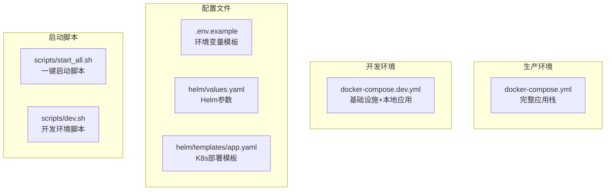
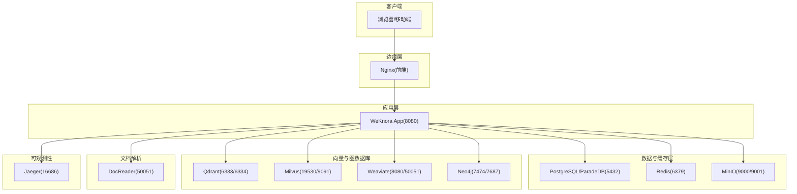
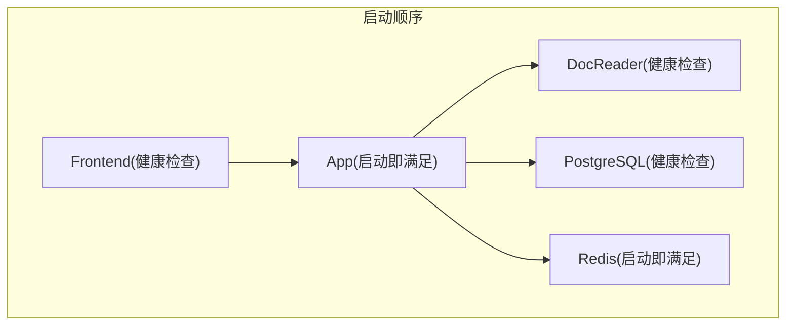

# Docker Compose配置详解

<cite>
**本文档引用的文件**
- [docker-compose.yml](file://docker-compose.yml)
- [docker-compose.dev.yml](file://docker-compose.dev.yml)
- [.env.example](file://.env.example)
- [helm/values.yaml](file://helm/values.yaml)
- [helm/templates/app.yaml](file://helm/templates/app.yaml)
- [scripts/start_all.sh](file://scripts/start_all.sh)
- [scripts/dev.sh](file://scripts/dev.sh)
</cite>

## 目录
1. [简介](#简介)
2. [项目结构](#项目结构)
3. [核心组件](#核心组件)
4. [架构总览](#架构总览)
5. [详细组件分析](#详细组件分析)
6. [依赖关系分析](#依赖关系分析)
7. [性能考虑](#性能考虑)
8. [故障排除指南](#故障排除指南)
9. [结论](#结论)
10. [附录](#附录)

## 简介
本文件深入解析WeKnora项目的Docker Compose配置，涵盖生产环境与开发环境的完整部署方案。文档重点说明各服务的配置参数、环境变量、数据卷挂载、网络与健康检查、重启策略、服务依赖与启动顺序控制，并提供针对不同部署需求的参数调整建议。

## 项目结构
WeKnora提供了两套Compose配置：
- 生产环境配置：docker-compose.yml，包含完整的应用栈（应用服务、前端、数据库、缓存、向量数据库、文档解析器、可观测性等）
- 开发环境配置：docker-compose.dev.yml，仅启动基础设施，应用与前端在本地运行，便于快速迭代

图表来源
- [docker-compose.yml:1-613](file://docker-compose.yml#L1-L613)
- [docker-compose.dev.yml:1-420](file://docker-compose.dev.yml#L1-L420)
- [.env.example:1-437](file://.env.example#L1-L437)
- [helm/values.yaml:1-493](file://helm/values.yaml#L1-L493)
- [helm/templates/app.yaml:1-200](file://helm/templates/app.yaml#L1-L200)
- [scripts/start_all.sh:1-773](file://scripts/start_all.sh#L1-L773)
- [scripts/dev.sh:1-362](file://scripts/dev.sh#L1-L362)

章节来源
- [docker-compose.yml:1-613](file://docker-compose.yml#L1-L613)
- [docker-compose.dev.yml:1-420](file://docker-compose.dev.yml#L1-L420)
- [.env.example:1-437](file://.env.example#L1-L437)

## 核心组件
WeKnora的Docker Compose配置包含以下核心服务：

### 应用服务（App）
- 镜像：wechatopenai/weknora-app
- 端口：8080
- 依赖：Redis、PostgreSQL、DocReader
- 健康检查：/health
- 关键环境变量：数据库连接、缓存、向量数据库、存储、安全密钥等

### 前端服务（Frontend）
- 镜像：wechatopenai/weknora-ui
- 端口：80
- 依赖：App（健康检查）
- 环境变量：App主机、端口、协议、文件大小限制

### 文档解析服务（DocReader）
- 镜像：wechatopenai/weknora-docreader
- 端口：50051（gRPC）
- 依赖：无
- 健康检查：gRPC健康检查
- 数据卷：/tmp/docreader

### 数据库服务（PostgreSQL/ParadeDB）
- 镜像：paradedb/paradedb
- 端口：5432
- 依赖：无
- 健康检查：pg_isready
- 数据卷：/var/lib/postgresql/data

### 缓存服务（Redis）
- 镜像：redis:7.0-alpine
- 端口：6379
- 依赖：无
- 健康检查：无（通过启动条件）

### 向量数据库服务（Qdrant/Milvus/Weaviate）
- Qdrant：REST 6333/gRPC 6334
- Milvus：gRPC 19530/HTTP 9091
- Weaviate：HTTP 8080/gRPC 50051
- 依赖：无
- 健康检查：各服务内置

### 文件存储（MinIO）
- 镜像：minio/minio
- 端口：9000/9001
- 依赖：无
- 健康检查：/minio/health/live
- 数据卷：/data

### 链路追踪（Jaeger）
- 镜像：jaegertracing/all-in-one
- 端口：16686（UI）、4317/4318（OTLP）
- 依赖：无
- 健康检查：无

### 图数据库（Neo4j）
- 镜像：neo4j:2025.10.1
- 端口：7474/7687
- 依赖：无
- 健康检查：无

### OIDC认证（Dex）
- 镜像：dexidp/dex
- 端口：5556
- 依赖：无
- 健康检查：无

### Langfuse自建可观测栈（可选）
- 包含：ClickHouse、MinIO、Web、Worker
- 复用：PostgreSQL、Redis
- 依赖：PostgreSQL、Redis、ClickHouse、MinIO

章节来源
- [docker-compose.yml:28-157](file://docker-compose.yml#L28-L157)
- [docker-compose.yml:173-198](file://docker-compose.yml#L173-L198)
- [docker-compose.yml:200-220](file://docker-compose.yml#L200-L220)
- [docker-compose.yml:222-249](file://docker-compose.yml#L222-L249)
- [docker-compose.yml:299-363](file://docker-compose.yml#L299-L363)
- [docker-compose.yml:365-375](file://docker-compose.yml#L365-L375)
- [docker-compose.yml:397-594](file://docker-compose.yml#L397-L594)

## 架构总览
WeKnora采用多容器微服务架构，前端通过Nginx代理到后端应用，应用服务连接多种基础设施组件。整体架构如下：

图表来源
- [docker-compose.yml:2-26](file://docker-compose.yml#L2-L26)
- [docker-compose.yml:28-157](file://docker-compose.yml#L28-L157)
- [docker-compose.yml:173-198](file://docker-compose.yml#L173-L198)
- [docker-compose.yml:200-220](file://docker-compose.yml#L200-L220)
- [docker-compose.yml:222-249](file://docker-compose.yml#L222-L249)
- [docker-compose.yml:299-363](file://docker-compose.yml#L299-L363)
- [docker-compose.yml:365-375](file://docker-compose.yml#L365-L375)
- [docker-compose.yml:397-594](file://docker-compose.yml#L397-L594)

## 详细组件分析

### 应用服务（App）配置详解
应用服务是整个系统的中枢，负责业务逻辑处理、API路由、数据持久化、缓存管理、向量检索、文件存储等。

#### 端口映射与网络
- 宿主机端口：8080
- 容器端口：8080
- 网络：WeKnora-network
- 重启策略：unless-stopped

#### 健康检查
- 命令：curl -f http://localhost:8080/health
- 间隔：30s
- 超时：10s
- 重试：3次
- 启动期：60s

#### 数据卷挂载
- /data/files：应用文件存储
- /tmp/docreader：只读，文档解析临时文件
- /app/config/config.yaml：应用配置文件
- /app/skills/preloaded：预加载技能目录

#### 环境变量分类
- 基础配置：GIN_MODE、DISABLE_REGISTRATION、TZ、WEKNORA_LANGUAGE
- 数据库连接：DB_DRIVER、DB_HOST、DB_PORT、DB_USER、DB_PASSWORD、DB_NAME
- 缓存配置：REDIS_ADDR、REDIS_USERNAME、REDIS_PASSWORD、REDIS_DB、REDIS_PREFIX
- 向量数据库：QDRANT_HOST、QDRANT_PORT、QDRANT_COLLECTION、QDRANT_API_KEY、QDRANT_USE_TLS
- 其他向量库：MILVUS_ADDRESS、MILVUS_COLLECTION、MILVUS_METRIC_TYPE
- Weaviate：WEAVIATE_HOST、WEAVIATE_GRPC_ADDRESS、WEAVIATE_SCHEME、WEAVIATE_AUTH_ENABLED、WEAVIATE_API_KEY
- 文件存储：STORAGE_TYPE、LOCAL_STORAGE_BASE_DIR、AUTO_RECOVER_DIRTY
- MinIO：MINIO_ENDPOINT、MINIO_ACCESS_KEY_ID、MINIO_SECRET_ACCESS_KEY、MINIO_BUCKET_NAME
- Ollama：OLLAMA_BASE_URL
- 流处理：STREAM_MANAGER_TYPE
- 安全密钥：JWT_SECRET、TENANT_AES_KEY、SYSTEM_AES_KEY、CRYPTO_MASTER_KEY、CRYPTO_SALT
- SSRF白名单：SSRF_WHITELIST
- 并发池：CONCURRENCY_POOL_SIZE
- Agent配置：WEKNORA_SANDBOX_MODE、WEKNORA_SANDBOX_TIMEOUT、WEKNORA_SANDBOX_DOCKER_IMAGE、WEKNORA_AGENT_LLM_TIMEOUT
- DocReader：DOCREADER_ADDR、DOCREADER_TRANSPORT
- Neo4j：NEO4J_ENABLE、NEO4J_URI、NEO4J_USERNAME、NEO4J_PASSWORD
- Langfuse可观测性：LANGFUSE_ENABLED、LANGFUSE_HOST、LANGFUSE_PUBLIC_KEY、LANGFUSE_SECRET_KEY、LANGFUSE_RELEASE、LANGFUSE_ENVIRONMENT、LANGFUSE_FLUSH_AT、LANGFUSE_FLUSH_INTERVAL、LANGFUSE_QUEUE_SIZE、LANGFUSE_REQUEST_TIMEOUT、LANGFUSE_SAMPLE_RATE、LANGFUSE_DEBUG

#### 服务依赖与启动顺序
- 依赖：redis（启动即满足）、postgres（健康检查）、docreader（健康检查）
- 前端依赖：app（健康检查）

章节来源
- [docker-compose.yml:28-157](file://docker-compose.yml#L28-L157)
- [docker-compose.yml:50-147](file://docker-compose.yml#L50-L147)

### 前端服务（Frontend）配置详解
前端服务提供Web界面，通过Nginx代理到后端应用。

#### 端口映射与网络
- 宿主机端口：80（可配置）
- 容器端口：80
- 网络：WeKnora-network
- 重启策略：unless-stopped

#### 环境变量
- MAX_FILE_SIZE_MB：文件大小限制
- APP_HOST：后端应用主机名（默认app）
- APP_PORT：后端应用端口（默认8080）
- APP_SCHEME：后端应用协议（默认http）

#### 服务依赖
- 依赖：app（健康检查）
- 说明：当使用远程后端时，需在.env中配置APP_HOST、APP_PORT、APP_SCHEME并注释掉depends_on块

章节来源
- [docker-compose.yml:2-26](file://docker-compose.yml#L2-L26)
- [docker-compose.yml:11-23](file://docker-compose.yml#L11-L23)

### 文档解析服务（DocReader）配置详解
DocReader提供文档解析能力，支持多种格式的文本提取、OCR、图像处理等。

#### 端口映射与网络
- 宿主机端口：50051（可配置）
- 容器端口：50051
- 网络：WeKnora-network
- 重启策略：unless-stopped

#### 健康检查
- 命令：grpc_health_probe -addr=localhost:50051
- 间隔：30s
- 超时：10s
- 重试：3次
- 启动期：60s

#### 数据卷挂载
- /tmp/docreader：解析临时文件存储

#### 环境变量
- DOCREADER_IMAGE_OUTPUT_DIR：图片输出目录
- MAX_FILE_SIZE_MB：最大文件大小
- MINERU_ENDPOINT：Mineru服务端点（可选）

章节来源
- [docker-compose.yml:173-198](file://docker-compose.yml#L173-L198)
- [docker-compose.yml:185-187](file://docker-compose.yml#L185-L187)

### 数据库服务（PostgreSQL/ParadeDB）配置详解
WeKnora使用ParadeDB作为PostgreSQL的增强版本，支持向量搜索和BM25全文检索。

#### 镜像与版本
- 镜像：paradedb/paradedb:v0.22.2-pg17
- 端口：5432

#### 环境变量
- POSTGRES_USER：数据库用户
- POSTGRES_PASSWORD：数据库密码
- POSTGRES_DB：数据库名称

#### 健康检查
- 命令：pg_isready -U ${DB_USER}
- 间隔：10s
- 超时：10s
- 重试：3次
- 启动期：30s

#### 数据卷挂载
- /var/lib/postgresql/data：数据库数据

#### 重启策略
- unless-stopped
- 停机宽限期：1分钟

章节来源
- [docker-compose.yml:200-220](file://docker-compose.yml#L200-L220)
- [docker-compose.yml:204-207](file://docker-compose.yml#L204-L207)

### 缓存服务（Redis）配置详解
Redis提供缓存、会话存储、流处理队列等功能。

#### 镜像与版本
- 镜像：redis:7.0-alpine
- 端口：6379

#### 命令与配置
- 命令：redis-server --appendonly yes --requirepass ${REDIS_PASSWORD}
- 启动即满足依赖条件

#### 数据卷挂载
- /data：持久化数据

章节来源
- [docker-compose.yml:222-229](file://docker-compose.yml#L222-L229)

### 文件存储（MinIO）配置详解
MinIO提供S3兼容的对象存储服务。

#### 镜像与版本
- 镜像：minio/minio:RELEASE.2025-09-07T16-13-09Z
- 端口：9000/9001

#### 环境变量
- MINIO_ROOT_USER：根用户
- MINIO_ROOT_PASSWORD：根密码

#### 健康检查
- 命令：curl -f http://localhost:9000/minio/health/live
- 间隔：30s
- 超时：20s
- 重试：3次

#### 数据卷挂载
- /data：对象存储数据

#### 重启策略
- unless-stopped
- Profile：minio、full

章节来源
- [docker-compose.yml:230-251](file://docker-compose.yml#L230-L251)
- [docker-compose.yml:236-238](file://docker-compose.yml#L236-L238)

### 链路追踪（Jaeger）配置详解
Jaeger提供分布式链路追踪能力。

#### 镜像与版本
- 镜像：jaegertracing/all-in-one:1.76.0
- 端口：6831/udp、6832/udp、5778、16686、4317、4318、14250、14268、9411

#### 环境变量
- COLLECTOR_OTLP_ENABLED：启用OTLP收集器
- COLLECTOR_ZIPKIN_HOST_PORT：Zipkin兼容端口

#### 数据卷挂载
- /var/lib/jaeger：持久化数据

#### 重启策略
- unless-stopped
- Profile：jaeger、full

章节来源
- [docker-compose.yml:253-276](file://docker-compose.yml#L253-L276)
- [docker-compose.yml:266-268](file://docker-compose.yml#L266-L268)

### 图数据库（Neo4j）配置详解
Neo4j提供知识图谱功能。

#### 镜像与版本
- 镜像：neo4j:2025.10.1
- 端口：7474/7687

#### 环境变量
- NEO4J_AUTH：用户名/密码
- NEO4J_apoc_export_file_enabled：启用文件导出
- NEO4J_apoc_import_file_enabled：启用文件导入
- NEO4J_apoc_import_file_use__neo4j__config：使用Neo4j配置
- NEO4JLABS_PLUGINS：启用APOC插件

#### 数据卷挂载
- /data：图数据库数据

#### 重启策略
- always
- Profile：neo4j、full

章节来源
- [docker-compose.yml:278-297](file://docker-compose.yml#L278-L297)
- [docker-compose.yml:283-288](file://docker-compose.yml#L283-L288)

### 向量数据库（Qdrant）配置详解
Qdrant提供向量相似度搜索能力。

#### 镜像与版本
- 镜像：qdrant/qdrant:v1.16.2
- 端口：6333/6334

#### 数据卷挂载
- /qdrant/storage：向量数据

#### 重启策略
- unless-stopped
- Profile：qdrant、full

章节来源
- [docker-compose.yml:299-312](file://docker-compose.yml#L299-L312)

### 向量数据库（Milvus）配置详解
Milvus提供高性能向量检索能力。

#### 镜像与版本
- 镜像：milvusdb/milvus:v2.6.11
- 端口：19530/9091

#### 健康检查
- 命令：curl -f http://localhost:9091/healthz
- 间隔：30s
- 启动期：90s
- 超时：20s
- 重试：3次

#### 数据卷挂载
- /var/lib/milvus：向量数据

#### 重启策略
- unless-stopped
- Profile：milvus、full

章节来源
- [docker-compose.yml:314-341](file://docker-compose.yml#L314-L341)

### 向量数据库（Weaviate）配置详解
Weaviate提供向量搜索和图数据能力。

#### 镜像与版本
- 镜像：semitechnologies/weaviate:1.28.4
- 端口：8080/50051

#### 环境变量
- PERSISTENCE_DATA_PATH：持久化路径
- CLUSTER_HOSTNAME：集群主机名
- DEFAULT_VECTORIZER_MODULE：默认向量化模块
- AUTHENTICATION_ANONYMOUS_ACCESS_ENABLED：启用匿名访问
- CLUSTER_GOSSIP_BIND_PORT：gossip绑定端口
- CLUSTER_DATA_BIND_PORT：数据绑定端口
- RAFT_BOOTSTRAP_EXPECT：Raft期望节点数

#### 数据卷挂载
- /var/lib/weaviate：向量数据

#### 重启策略
- unless-stopped
- Profile：weaviate、full

章节来源
- [docker-compose.yml:342-364](file://docker-compose.yml#L342-L364)
- [docker-compose.yml:345-353](file://docker-compose.yml#L345-L353)

### OIDC认证（Dex）配置详解
Dex提供OpenID Connect身份认证服务。

#### 镜像与版本
- 镜像：dexidp/dex:latest
- 端口：5556

#### 数据卷挂载
- /etc/dex/config.yaml：配置文件

#### 重启策略
- unless-stopped
- Profile：dex、full

章节来源
- [docker-compose.yml:365-375](file://docker-compose.yml#L365-L375)

### Langfuse自建可观测栈配置详解
Langfuse提供自建可观测性解决方案，复用WeKnora现有的PostgreSQL和Redis。

#### 结构说明
- 复用：PostgreSQL（独立langfuse数据库）、Redis（DB1）
- 新增：langfuse-web、langfuse-worker、langfuse-clickhouse、langfuse-minio
- 初始化：langfuse-db-init

#### 端口映射
- langfuse-web：3000
- langfuse-minio：9100/9101（S3/Console）

#### 数据卷挂载
- langfuse_clickhouse_data/logs：ClickHouse数据
- langfuse_minio_data：MinIO数据

#### 重启策略
- unless-stopped
- Profile：langfuse、full

章节来源
- [docker-compose.yml:377-594](file://docker-compose.yml#L377-L594)

## 依赖关系分析
服务间的依赖关系通过depends_on和健康检查实现，确保正确的启动顺序。

图表来源
- [docker-compose.yml:21-23](file://docker-compose.yml#L21-L23)
- [docker-compose.yml:148-154](file://docker-compose.yml#L148-L154)

### 服务间通信
- 应用服务通过服务名访问其他组件
- 前端通过Nginx代理到后端应用
- 各服务通过WeKnora-network进行通信

### 重启策略
- unless-stopped：容器异常退出时自动重启
- always：始终重启（Redis、Neo4j）
- no：一次性任务（langfuse-db-init）

章节来源
- [docker-compose.yml:26](file://docker-compose.yml#L26)
- [docker-compose.yml:157](file://docker-compose.yml#L157)
- [docker-compose.yml:168-171](file://docker-compose.yml#L168-L171)

## 性能考虑
基于配置文件分析，WeKnora在性能方面的主要考量包括：

### 资源限制与优化
- 应用服务：CPU 100m-1，内存 256Mi-1Gi
- 前端服务：CPU 50m-200m，内存 64Mi-256Mi
- DocReader：CPU 100m-500m，内存 256Mi-512Mi
- PostgreSQL：CPU 100m-500m，内存 256Mi-512Mi
- Redis：CPU 50m-200m，内存 64Mi-256Mi

### 端口映射与网络
- 默认端口映射遵循服务设计，可根据环境调整
- 网络使用bridge模式，确保服务间通信

### 存储配置
- 使用数据卷进行持久化，避免数据丢失
- 不同服务的数据卷路径明确，便于管理

### 启动顺序控制
- 通过depends_on和健康检查确保依赖服务就绪
- 合理的启动期配置减少启动失败

## 故障排除指南
基于配置文件中的健康检查和重启策略，提供以下故障排除建议：

### 常见问题与解决
1. **应用服务无法启动**
   - 检查数据库连接参数
   - 确认Redis服务可用
   - 查看应用健康检查日志

2. **前端页面空白**
   - 检查Nginx配置
   - 确认后端服务健康
   - 验证端口映射

3. **文档解析失败**
   - 检查DocReader健康状态
   - 验证gRPC连接
   - 确认文件大小限制

4. **向量数据库连接问题**
   - 检查对应向量库的健康状态
   - 验证网络连通性
   - 确认端口映射

### 日志查看
- 使用docker-compose logs命令查看各服务日志
- 关注健康检查失败的服务
- 检查数据卷挂载权限

章节来源
- [docker-compose.yml:44-49](file://docker-compose.yml#L44-L49)
- [docker-compose.yml:188-193](file://docker-compose.yml#L188-L193)
- [docker-compose.yml:212-217](file://docker-compose.yml#L212-L217)
- [docker-compose.yml:325-330](file://docker-compose.yml#L325-L330)

## 结论
WeKnora的Docker Compose配置展现了现代微服务架构的最佳实践：
- 清晰的服务边界和职责划分
- 完善的健康检查机制
- 灵活的配置管理和环境变量
- 可扩展的向量数据库选择
- 丰富的可观测性支持

通过合理的资源配置、端口映射和存储管理，WeKnora能够在不同规模的环境中稳定运行。开发环境与生产环境的分离设计，既保证了开发效率，又确保了生产环境的稳定性。

## 附录

### 环境变量配置指南
基于.env.example文件，提供关键环境变量的配置建议：

#### 基础配置
- WEKNORA_VERSION：镜像版本标签
- GIN_MODE：开发/生产模式
- LOG_LEVEL：日志级别
- TZ：时区设置
- WEKNORA_LANGUAGE：系统语言

#### 数据库配置
- DB_DRIVER：数据库驱动（postgres）
- DB_HOST/PORT/USER/PASSWORD/NAME：数据库连接信息

#### 缓存配置
- REDIS_ADDR/USERNAME/PASSWORD/DB/PREFIX：Redis连接参数

#### 向量数据库配置
- RETRIEVE_DRIVER：向量库类型（postgres/qdrant/milvus/weaviate）
- QDRANT_*：Qdrant配置
- MILVUS_*：Milvus配置
- WEAVIATE_*：Weaviate配置

#### 文件存储配置
- STORAGE_TYPE：存储类型（local/minio/cos/tos/s3）
- LOCAL_STORAGE_BASE_DIR：本地存储路径
- MINIO_*：MinIO配置
- COS_*：腾讯云COS配置
- TOS_*：火山引擎TOS配置
- S3_*：AWS S3配置

#### 安全配置
- JWT_SECRET：JWT签名密钥
- TENANT_AES_KEY/SYSTEM_AES_KEY：加密密钥
- CRYPTO_MASTER_KEY/CRYPTO_SALT：加密状态管理

#### 其他配置
- MAX_FILE_SIZE_MB：文件大小限制
- CONCURRENCY_POOL_SIZE：并发池大小
- OLLAMA_BASE_URL：Ollama服务地址
- ENABLE_GRAPH_RAG：知识图谱开关

### 部署需求调整建议
根据不同部署场景，可调整以下参数：

#### 开发环境
- 使用docker-compose.dev.yml
- 仅启动基础设施服务
- 应用与前端在本地运行
- 可选启用MinIO、Qdrant、Neo4j、Jaeger、Dex

#### 生产环境
- 使用docker-compose.yml
- 启动完整应用栈
- 配置生产级安全参数
- 设置合适的资源限制
- 启用健康检查和重启策略

#### 资源限制调整
- 根据硬件配置调整CPU和内存限制
- 合理设置并发池大小
- 优化向量数据库配置

#### 端口映射调整
- 根据防火墙规则调整端口映射
- 避免端口冲突
- 配置反向代理

#### 存储配置调整
- 根据数据量设置存储卷大小
- 配置备份策略
- 监控存储使用情况

章节来源
- [.env.example:1-437](file://.env.example#L1-L437)
- [docker-compose.yml:1-613](file://docker-compose.yml#L1-L613)
- [docker-compose.dev.yml:1-420](file://docker-compose.dev.yml#L1-L420)
- [helm/values.yaml:1-493](file://helm/values.yaml#L1-L493)
- [scripts/start_all.sh:1-773](file://scripts/start_all.sh#L1-L773)
- [scripts/dev.sh:1-362](file://scripts/dev.sh#L1-L362)