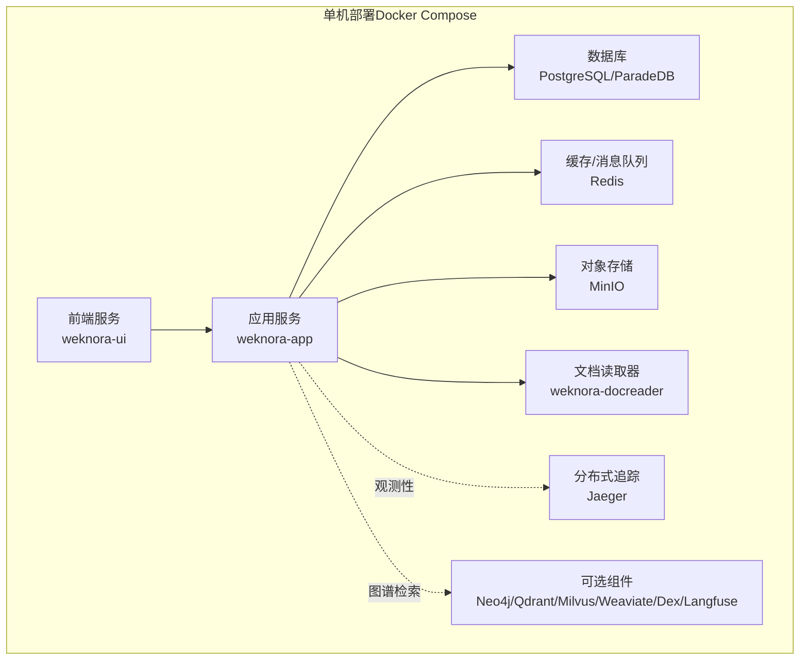
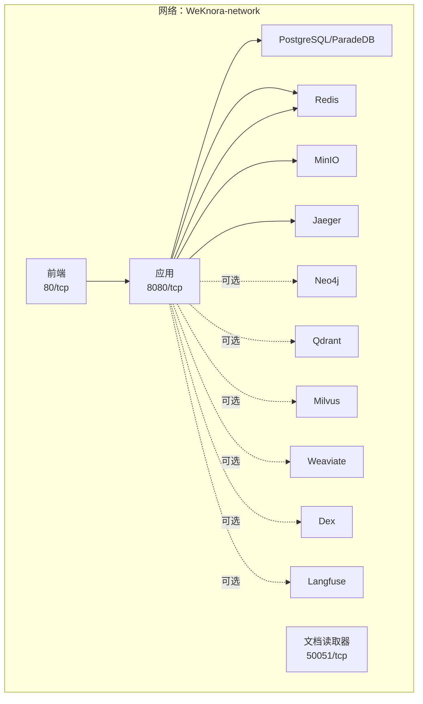
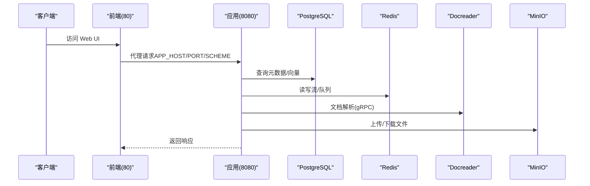
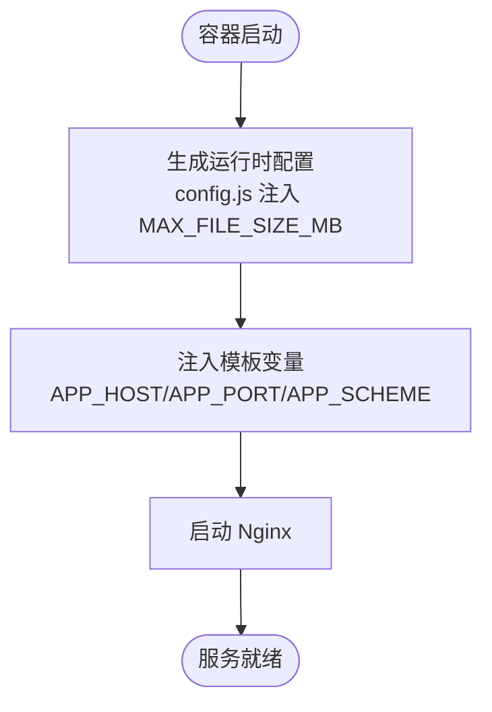
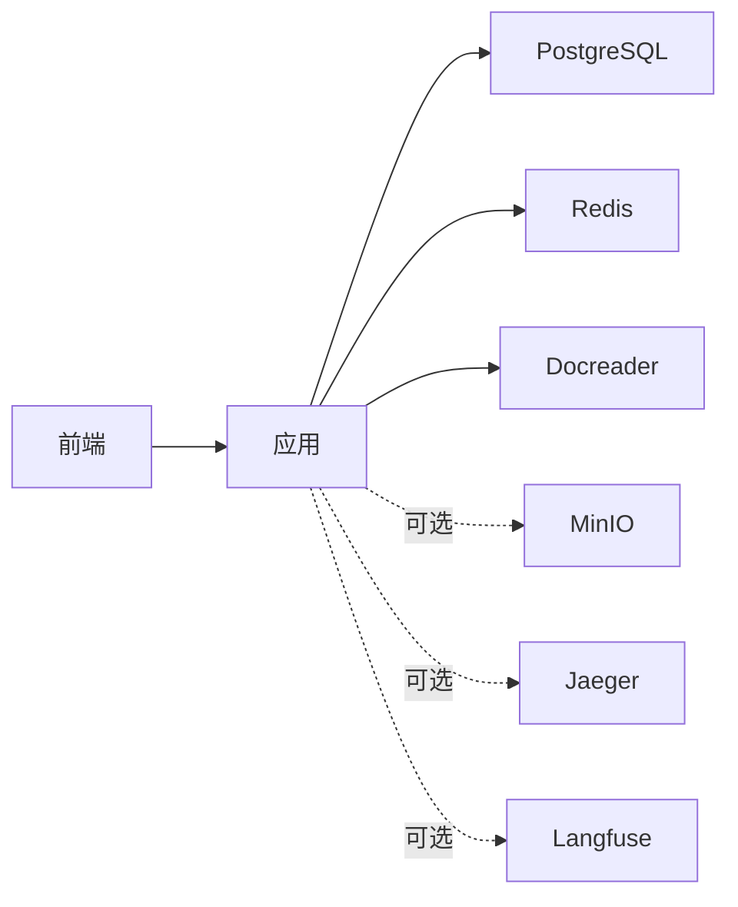

# Docker部署

<cite>
**本文引用的文件**
- [docker-compose.yml](file://docker-compose.yml)
- [docker-compose.dev.yml](file://docker-compose.dev.yml)
- [Dockerfile.app](file://docker/Dockerfile.app)
- [Dockerfile.docreader](file://docker/Dockerfile.docreader)
- [Dockerfile.sandbox](file://docker/Dockerfile.sandbox)
- [Dockerfile.frontend](file://frontend/Dockerfile)
- [scripts/build_images.sh](file://scripts/build_images.sh)
- [scripts/docker-entrypoint.sh](file://scripts/docker-entrypoint.sh)
- [frontend/docker-entrypoint.sh](file://frontend/docker-entrypoint.sh)
- [scripts/get_version.sh](file://scripts/get_version.sh)
- [helm/values.yaml](file://helm/values.yaml)
- [helm/Chart.yaml](file://helm/Chart.yaml)
- [README.md](file://README.md)
</cite>

## 目录
1. [简介](#简介)
2. [项目结构](#项目结构)
3. [核心组件](#核心组件)
4. [架构总览](#架构总览)
5. [详细组件分析](#详细组件分析)
6. [依赖关系分析](#依赖关系分析)
7. [性能与资源建议](#性能与资源建议)
8. [故障排除指南](#故障排除指南)
9. [结论](#结论)
10. [附录](#附录)

## 简介
本指南面向希望在单机环境中使用 Docker Compose 部署 WeKnora 的用户，覆盖从环境准备、镜像构建到容器编排的全流程。文档重点解析 docker-compose.yml 中各服务的配置项、环境变量、数据卷与网络策略，并给出镜像构建脚本、自定义镜像制作与版本管理方法，以及资源限制、日志与监控最佳实践。同时提供完整的部署架构图与常见问题排查步骤。

## 项目结构
WeKnora 的 Docker 相关内容主要分布在以下位置：
- docker-compose.yml：生产级单机编排，包含应用、前端、文档读取器、数据库、缓存、对象存储、可观测性与可选组件（Neo4j、Qdrant、Milvus、Weaviate、Dex、Langfuse 等）。
- docker-compose.dev.yml：开发环境编排，仅启动基础设施，便于本地运行应用与前端。
- docker/：镜像构建文件与辅助配置，包含应用、文档读取器、沙箱镜像的 Dockerfile。
- frontend/：前端镜像构建与入口脚本。
- scripts/：镜像构建脚本、入口脚本与版本信息脚本。
- helm/：Kubernetes Helm Chart（用于对比理解服务与配置项）。

**图表来源**
- [docker-compose.yml:1-613](file://docker-compose.yml#L1-L613)

**章节来源**
- [docker-compose.yml:1-613](file://docker-compose.yml#L1-L613)
- [docker-compose.dev.yml:1-420](file://docker-compose.dev.yml#L1-L420)

## 核心组件
- 应用服务（weknora-app）
  - 作用：后端 API 服务器，负责业务逻辑、知识库管理、会话处理、工具调用与向量检索。
  - 关键点：内置健康检查、挂载数据卷、依赖 Redis、PostgreSQL、Docreader、MinIO 等。
- 前端服务（weknora-ui）
  - 作用：静态页面与 Nginx 提供 Web UI，通过环境变量注入运行时配置。
  - 关键点：支持最大文件大小、后端代理地址与协议。
- 文档读取器（weknora-docreader）
  - 作用：gRPC 文档解析服务，支持多种格式解析与图片提取。
  - 关键点：健康检查使用 grpc_health_probe，支持多架构。
- 数据库（PostgreSQL/ParadeDB）
  - 作用：元数据与向量检索（ParadeDB）。
  - 关键点：健康检查使用 pg_isready，持久化数据卷。
- 缓存（Redis）
  - 作用：流式任务队列与会话状态管理。
  - 关键点：启用 AOF，支持密码。
- 对象存储（MinIO）
  - 作用：文件与媒体存储，兼容 S3。
  - 关键点：健康检查与控制台端口。
- 可选组件
  - 分布式追踪（Jaeger）、知识图谱（Neo4j）、向量库（Qdrant/Milvus/Weaviate）、身份（Dex）、Langfuse 自建可观测栈等。

**章节来源**
- [docker-compose.yml:28-170](file://docker-compose.yml#L28-L170)
- [docker-compose.yml:173-250](file://docker-compose.yml#L173-L250)
- [docker-compose.yml:200-221](file://docker-compose.yml#L200-L221)
- [docker-compose.yml:222-228](file://docker-compose.yml#L222-L228)
- [docker-compose.yml:230-251](file://docker-compose.yml#L230-L251)
- [docker-compose.yml:253-276](file://docker-compose.yml#L253-L276)
- [docker-compose.yml:278-364](file://docker-compose.yml#L278-L364)

## 架构总览
下图展示了 WeKnora 在单机环境下的典型部署拓扑，以及服务间的依赖与通信路径。

**图表来源**
- [docker-compose.yml:596-613](file://docker-compose.yml#L596-L613)

**章节来源**
- [docker-compose.yml:596-613](file://docker-compose.yml#L596-L613)

## 详细组件分析

### 应用服务（weknora-app）
- 镜像与构建
  - 使用 docker/Dockerfile.app 构建，支持多架构与代理参数传递。
  - 构建脚本 scripts/build_images.sh 提供统一构建入口。
- 健康检查
  - 通过 HTTP GET /health 进行健康检查，具备间隔、超时、重试与启动宽限期。
- 环境变量（节选）
  - 数据库：DB_DRIVER、DB_HOST、DB_PORT、DB_USER、DB_PASSWORD、DB_NAME
  - 缓存：REDIS_ADDR、REDIS_USERNAME、REDIS_PASSWORD、REDIS_DB、REDIS_PREFIX
  - 向量库：QDRANT_*、MILVUS_*、WEAVIATE_*、ELASTICSEARCH_*、RETRIEVE_DRIVER
  - 存储：MINIO_*、STORAGE_TYPE、LOCAL_STORAGE_BASE_DIR
  - 文件大小：MAX_FILE_SIZE_MB
  - 安全与加密：JWT_SECRET、CRYPTO_MASTER_KEY、CRYPTO_SALT、TENANT_AES_KEY、SYSTEM_AES_KEY
  - 可观测性：OTEL_*、LANGFUSE_*（可选）
  - 其他：GIN_MODE、DISABLE_REGISTRATION、AUTO_RECOVER_DIRTY、OLLAMA_BASE_URL、WEKNORA_*（沙箱、并发池等）
- 数据卷
  - /data/files：上传文件与知识库数据
  - /tmp/docreader：只读，文档解析临时目录
  - /app/config/config.yaml：应用配置挂载
  - /app/skills/preloaded：预加载技能目录（支持热更新）
- 依赖关系
  - 依赖 redis、postgres、docreader 健康；可选依赖 minio、jaeger、langfuse 等。
- 端口映射
  - 8080/tcp（容器内）映射至宿主机端口（默认 8080）

**图表来源**
- [docker-compose.yml:28-170](file://docker-compose.yml#L28-L170)

**章节来源**
- [docker-compose.yml:28-170](file://docker-compose.yml#L28-L170)
- [scripts/build_images.sh:127-156](file://scripts/build_images.sh#L127-L156)
- [scripts/docker-entrypoint.sh:1-44](file://scripts/docker-entrypoint.sh#L1-L44)

### 前端服务（weknora-ui）
- 镜像与构建
  - 使用 frontend/Dockerfile，基于 Node 构建、Nginx 运行。
- 启动流程
  - 生成运行时配置（config.js 注入 MAX_FILE_SIZE_MB），替换 Nginx 模板变量后启动。
- 环境变量
  - MAX_FILE_SIZE_MB：前端最大文件大小（MB）
  - APP_HOST/APP_PORT/APP_SCHEME：后端代理目标
- 端口映射
  - 80/tcp（容器内）映射至宿主机端口（默认 80）

**图表来源**
- [frontend/Dockerfile:1-43](file://frontend/Dockerfile#L1-L43)
- [frontend/docker-entrypoint.sh:1-19](file://frontend/docker-entrypoint.sh#L1-L19)

**章节来源**
- [frontend/Dockerfile:1-43](file://frontend/Dockerfile#L1-L43)
- [frontend/docker-entrypoint.sh:1-19](file://frontend/docker-entrypoint.sh#L1-L19)

### 文档读取器（weknora-docreader）
- 镜像与构建
  - 使用 docker/Dockerfile.docreader，分构建与运行两阶段，支持多架构与本地/在线 protoc 安装。
- 健康检查
  - 使用 grpc_health_probe 检测 50051 端口。
- 环境变量
  - DOCREADER_IMAGE_OUTPUT_DIR：图片输出目录
  - MAX_FILE_SIZE_MB：最大文件大小
- 端口映射
  - 50051/tcp（容器内）映射至宿主机端口（默认 50051）

**章节来源**
- [docker-compose.yml:173-198](file://docker-compose.yml#L173-L198)
- [docker/Dockerfile.docreader:1-158](file://docker/Dockerfile.docreader#L1-L158)

### 数据库（PostgreSQL/ParadeDB）
- 镜像与配置
  - 使用 paradedb/paradedb（含向量与全文搜索能力），设置用户名、密码、数据库名。
- 健康检查
  - 使用 pg_isready，具备间隔、超时、重试与启动宽限期。
- 数据卷
  - /var/lib/postgresql/data：持久化数据

**章节来源**
- [docker-compose.yml:200-221](file://docker-compose.yml#L200-L221)

### 缓存（Redis）
- 镜像与配置
  - 使用 redis:7-alpine，启用 AOF 与密码。
- 数据卷
  - /data：持久化

**章节来源**
- [docker-compose.yml:222-228](file://docker-compose.yml#L222-L228)

### 对象存储（MinIO）
- 镜像与配置
  - 使用 minio/minio，开启控制台端口，设置根账号与密码。
- 健康检查
  - 访问 /minio/health/live
- 端口映射
  - 9000/9001（容器内）映射至宿主机端口（默认 9000/9001）

**章节来源**
- [docker-compose.yml:230-251](file://docker-compose.yml#L230-L251)

### 可选组件
- Jaeger：分布式追踪（OTLP/HTTP/UDP 端口）
- Neo4j：知识图谱（bolt/HTTP 端口）
- Qdrant：向量库（REST/GRPC 端口）
- Milvus：向量库（gRPC/HTTP 端口）
- Weaviate：向量库（HTTP/gRPC 端口）
- Dex：OIDC 身份提供商
- Langfuse：自建可观测栈（ClickHouse、MinIO、Worker、Web）

**章节来源**
- [docker-compose.yml:253-364](file://docker-compose.yml#L253-L364)

## 依赖关系分析
- 服务启动顺序
  - 前端依赖应用健康；应用依赖 Redis、PostgreSQL、Docreader；可选依赖 MinIO、Jaeger、Langfuse 等。
- 网络
  - 所有服务位于同一自定义桥接网络，容器间通过服务名互访。
- 数据卷
  - 应用与 Docreader 的关键数据通过命名卷持久化，避免容器重建丢失。
- 健康检查
  - 应用与 Docreader 使用 HTTP/gRPC 健康探针；数据库使用 pg_isready；MinIO 使用 curl；Jaeger 使用端口映射；Langfuse ClickHouse 使用 wget。

**图表来源**
- [docker-compose.yml:21-26](file://docker-compose.yml#L21-L26)
- [docker-compose.yml:148-157](file://docker-compose.yml#L148-L157)

**章节来源**
- [docker-compose.yml:21-26](file://docker-compose.yml#L21-L26)
- [docker-compose.yml:148-157](file://docker-compose.yml#L148-L157)

## 性能与资源建议
- 资源限制
  - 建议为应用、前端、Docreader、数据库、缓存分别设置 CPU/内存请求与限制，避免资源争抢。
  - 参考 Helm values.yaml 中的资源示例，结合实际负载调整。
- 存储
  - 为数据文件、数据库、缓存、向量库与 MinIO 等配置合适的持久化卷大小与存储类。
- 并发与超时
  - 根据业务场景调整并发池大小与 LLM 调用超时，避免阻塞。
- 网络与安全
  - 使用自定义桥接网络隔离服务；为 Redis、数据库、MinIO 设置强密码；必要时启用 TLS。
- 观测性
  - 启用 Jaeger 或 Langfuse，配置采样率与队列大小，避免生产环境产生过多开销。

**章节来源**
- [helm/values.yaml:68-140](file://helm/values.yaml#L68-L140)
- [helm/values.yaml:141-187](file://helm/values.yaml#L141-L187)
- [helm/values.yaml:188-237](file://helm/values.yaml#L188-L237)
- [helm/values.yaml:238-283](file://helm/values.yaml#L238-L283)
- [helm/values.yaml:284-329](file://helm/values.yaml#L284-L329)
- [helm/values.yaml:330-341](file://helm/values.yaml#L330-L341)
- [helm/values.yaml:342-369](file://helm/values.yaml#L342-L369)
- [helm/values.yaml:370-403](file://helm/values.yaml#L370-L403)
- [helm/values.yaml:404-493](file://helm/values.yaml#L404-L493)

## 故障排除指南
- 健康检查失败
  - 应用：确认 /health 路由可用，检查数据库、缓存、Docreader 是否健康。
  - Docreader：确认 gRPC 端口可达，grpc_health_probe 可用。
  - PostgreSQL：确认 pg_isready 可用，数据库初始化完成。
  - MinIO：确认 /minio/health/live 可达。
  - Jaeger：确认端口映射正确。
- 端口冲突
  - 检查宿主机端口映射（前端、应用、Docreader、MinIO、Jaeger 等）是否被占用。
- 权限与挂载
  - 确认 /data/files 与 /app/skills/preloaded 的权限与所有权正确（入口脚本会修复）。
- 环境变量缺失
  - 确认 .env 或环境变量中 DB_USER/DB_PASSWORD/DB_NAME、REDIS_PASSWORD、MINIO_*、JWT_SECRET 等关键变量已设置。
- 架构与代理
  - 如需使用国内镜像或代理，可通过构建参数传递（如 APT_MIRROR、GOPROXY_ARG 等）。
- 开发模式
  - 使用 docker-compose.dev.yml 启动基础设施，本地运行应用与前端，便于调试。

**章节来源**
- [docker-compose.yml:44-49](file://docker-compose.yml#L44-L49)
- [docker-compose.yml:188-193](file://docker-compose.yml#L188-L193)
- [docker-compose.yml:212-217](file://docker-compose.yml#L212-L217)
- [docker-compose.yml:242-247](file://docker-compose.yml#L242-L247)
- [scripts/docker-entrypoint.sh:11-21](file://scripts/docker-entrypoint.sh#L11-L21)
- [docker-compose.dev.yml:1-420](file://docker-compose.dev.yml#L1-L420)

## 结论
通过 Docker Compose，WeKnora 可以在单机环境下快速完成端到端部署。本文提供了镜像构建、服务编排、环境变量、数据卷与网络配置的详细说明，并给出了性能与可观测性的最佳实践与故障排除清单。建议在生产环境中进一步完善资源配额、安全策略与备份方案。

## 附录

### Docker 镜像构建与版本管理
- 构建脚本
  - scripts/build_images.sh：统一构建 weknora-app、weknora-docreader、weknora-ui、weknora-sandbox 四个镜像，支持清理与多架构。
- 版本信息
  - scripts/get_version.sh：统一输出版本、提交号、构建时间、Go 版本等信息，支持多种输出格式。
- 镜像文件
  - docker/Dockerfile.app：应用镜像
  - docker/Dockerfile.docreader：文档读取器镜像
  - docker/Dockerfile.sandbox：沙箱镜像
  - frontend/Dockerfile：前端镜像

**章节来源**
- [scripts/build_images.sh:1-393](file://scripts/build_images.sh#L1-L393)
- [scripts/get_version.sh:1-91](file://scripts/get_version.sh#L1-L91)
- [Dockerfile.app](file://docker/Dockerfile.app)
- [Dockerfile.docreader](file://docker/Dockerfile.docreader)
- [Dockerfile.sandbox](file://docker/Dockerfile.sandbox)
- [Dockerfile.frontend](file://frontend/Dockerfile)

### 环境变量与配置要点
- 应用服务（节选）
  - 数据库连接：DB_USER/DB_PASSWORD/DB_NAME/DB_HOST/DB_PORT
  - 缓存连接：REDIS_ADDR/USERNAME/PASSWORD/DB/PREFIX
  - 向量库：QDRANT_*、MILVUS_*、WEAVIATE_*、ELASTICSEARCH_*、RETRIEVE_DRIVER
  - 存储：MINIO_ENDPOINT/ACCESS_KEY/SECRET_KEY/BUCKET_NAME、STORAGE_TYPE、LOCAL_STORAGE_BASE_DIR
  - 文件大小：MAX_FILE_SIZE_MB
  - 安全：JWT_SECRET、CRYPTO_MASTER_KEY/SALT、TENANT_AES_KEY、SYSTEM_AES_KEY
  - 可观测性：OTEL_*、LANGFUSE_*
- 前端服务
  - MAX_FILE_SIZE_MB、APP_HOST、APP_PORT、APP_SCHEME
- 文档读取器
  - DOCREADER_IMAGE_OUTPUT_DIR、MAX_FILE_SIZE_MB

**章节来源**
- [docker-compose.yml:50-170](file://docker-compose.yml#L50-L170)
- [docker-compose.yml:185-187](file://docker-compose.yml#L185-L187)

### 网络与数据卷
- 网络
  - WeKnora-network：自定义桥接网络，容器间通过服务名互访。
- 数据卷
  - postgres-data、data-files、docreader-tmp、jaeger_data、minio_data、neo4j-data、qdrant_data、milvus_data、weaviate_data、langfuse_* 等命名卷。

**章节来源**
- [docker-compose.yml:596-613](file://docker-compose.yml#L596-L613)

### 开发与生产差异
- docker-compose.dev.yml：仅启动基础设施（PostgreSQL、Redis、MinIO、Qdrant、Milvus、Neo4j、Docreader、Jaeger、Dex、Langfuse），应用与前端在本地运行，便于调试。
- docker-compose.yml：生产级编排，包含应用、前端、文档读取器与可选组件。

**章节来源**
- [docker-compose.dev.yml:1-420](file://docker-compose.dev.yml#L1-L420)

### Helm 对比参考
- Helm Chart 提供了与 docker-compose.yml 对应的服务与资源配置示例，便于理解各组件在 Kubernetes 中的部署形态与资源限制。

**章节来源**
- [helm/Chart.yaml:1-27](file://helm/Chart.yaml#L1-L27)
- [helm/values.yaml:1-493](file://helm/values.yaml#L1-L493)