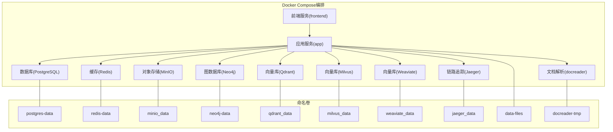
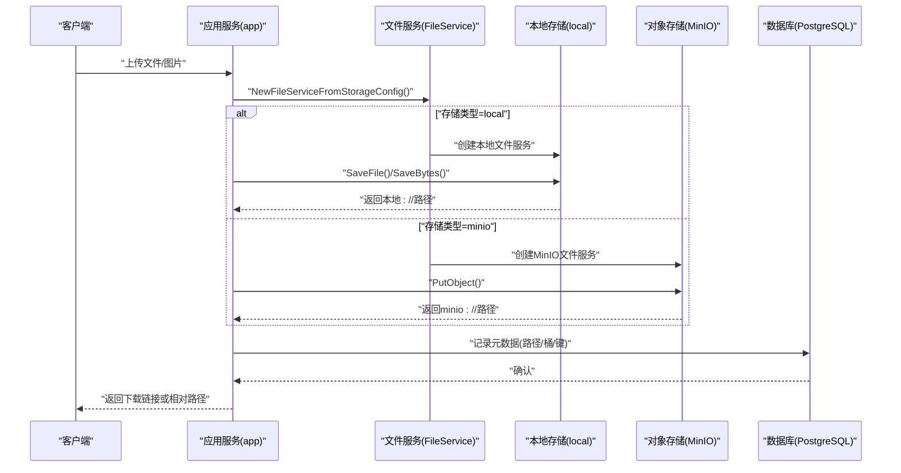
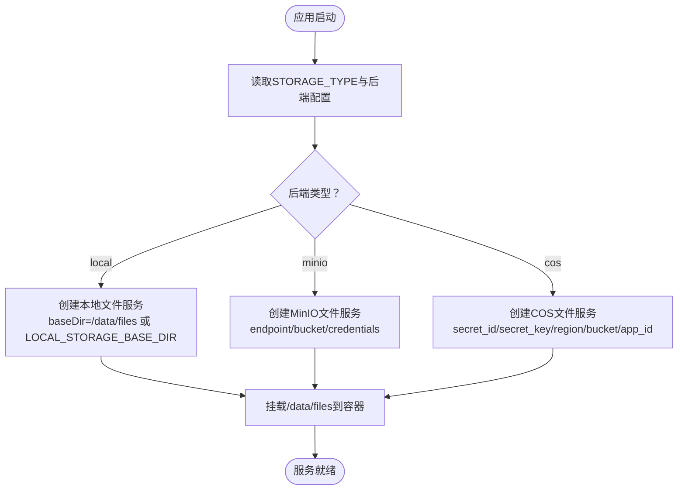
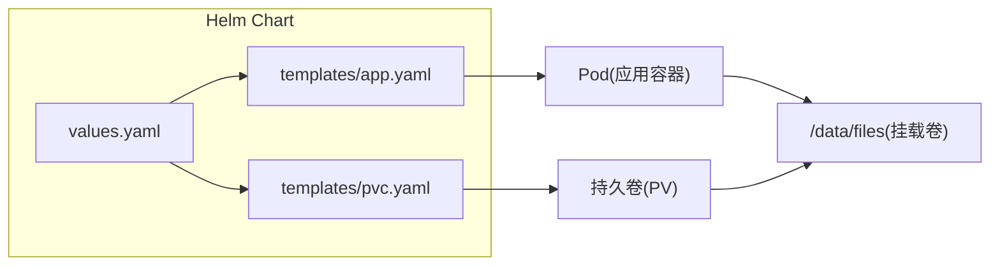
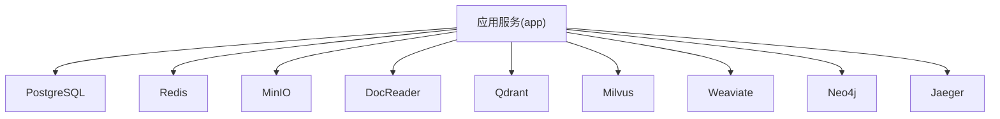

# 数据卷管理

<cite>
**本文引用的文件**
- [docker-compose.yml](file://docker-compose.yml)
- [docker-compose.dev.yml](file://docker-compose.dev.yml)
- [docker/Dockerfile.docreader](file://docker/Dockerfile.docreader)
- [docker/Dockerfile.sandbox](file://docker/Dockerfile.sandbox)
- [docker/config/supervisord.conf](file://docker/config/supervisord.conf)
- [config/config.yaml](file://config/config.yaml)
- [internal/application/service/file/factory.go](file://internal/application/service/file/factory.go)
- [internal/application/service/file/local.go](file://internal/application/service/file/local.go)
- [internal/application/service/file/minio.go](file://internal/application/service/file/minio.go)
- [docreader/parser/storage.py](file://docreader/parser/storage.py)
- [internal/handler/session/image_upload.go](file://internal/handler/session/image_upload.go)
- [helm/values.yaml](file://helm/values.yaml)
- [helm/templates/pvc.yaml](file://helm/templates/pvc.yaml)
- [helm/templates/app.yaml](file://helm/templates/app.yaml)
</cite>

## 目录
1. [简介](#简介)
2. [项目结构](#项目结构)
3. [核心组件](#核心组件)
4. [架构总览](#架构总览)
5. [详细组件分析](#详细组件分析)
6. [依赖关系分析](#依赖关系分析)
7. [性能考量](#性能考量)
8. [故障排查指南](#故障排查指南)
9. [结论](#结论)
10. [附录](#附录)

## 简介
本章节聚焦WeKnora项目中Docker数据卷的配置与管理，覆盖以下关键主题：
- 数据卷作用与生命周期：持久化存储、临时文件、配置挂载
- 数据备份与恢复策略：容器重建时保护重要数据
- 存储后端集成：本地存储、对象存储（MinIO/S3兼容）、云厂商对象存储（COS/TOS/OSS）
- 监控与清理策略：容量与健康检查
- 存储空间优化建议：分层存储、冷热分离、压缩与去重

## 项目结构
WeKnora通过Compose定义多服务架构，其中多个状态性组件使用命名卷进行持久化，应用侧通过环境变量选择存储后端，并在容器内挂载共享卷以实现文件持久化与跨组件共享。

**图表来源**
- [docker-compose.yml:1-613](file://docker-compose.yml#L1-L613)

**章节来源**
- [docker-compose.yml:1-613](file://docker-compose.yml#L1-L613)

## 核心组件
- 应用服务(app)：挂载共享文件卷与只读文档解析临时卷，通过环境变量选择存储后端类型与参数。
- 文档解析(docreader)：提供gRPC接口，使用独立临时卷存放中间图片等临时文件。
- 基础设施：PostgreSQL、Redis、MinIO、Neo4j、Qdrant、Milvus、Weaviate、Jaeger等均使用命名卷持久化数据。
- 前端服务(frontend)：反向代理至应用服务，不直接持久化数据。

**章节来源**
- [docker-compose.yml:28-171](file://docker-compose.yml#L28-L171)
- [docker-compose.yml:200-363](file://docker-compose.yml#L200-L363)

## 架构总览
下图展示应用侧文件存储在容器内的流向与后端选择逻辑，涵盖本地与对象存储两种主要路径。

**图表来源**
- [internal/application/service/file/factory.go:1-77](file://internal/application/service/file/factory.go#L1-L77)
- [internal/application/service/file/local.go:1-230](file://internal/application/service/file/local.go#L1-L230)
- [internal/application/service/file/minio.go:1-201](file://internal/application/service/file/minio.go#L1-L201)
- [docreader/parser/storage.py:391-419](file://docreader/parser/storage.py#L391-L419)

**章节来源**
- [internal/application/service/file/factory.go:1-77](file://internal/application/service/file/factory.go#L1-L77)
- [internal/application/service/file/local.go:1-230](file://internal/application/service/file/local.go#L1-L230)
- [internal/application/service/file/minio.go:1-201](file://internal/application/service/file/minio.go#L1-L201)
- [docreader/parser/storage.py:391-419](file://docreader/parser/storage.py#L391-L419)

## 详细组件分析

### 1) 应用服务的数据卷与环境变量
- 卷挂载
  - 文件共享卷：/data/files（应用侧持久化上传文件、导出文件）
  - 文档解析临时卷：/tmp/docreader（只读挂载，供docreader写入中间图片）
  - 配置挂载：/app/config/config.yaml
  - 可选技能目录挂载：/app/skills/preloaded
- 关键环境变量
  - STORAGE_TYPE：选择存储后端（local/minio/cos/tos/s3/oss/base64）
  - LOCAL_STORAGE_BASE_DIR：本地存储根目录（默认/data/files）
  - MINIO_*：MinIO连接参数（endpoint/access_key_id/secret_access_key/bucket_name/use_ssl）
  - COS_*：腾讯云COS连接参数（secret_id/secret_key/region/bucket_name/app_id/path_prefix）
  - 其他检索/向量库/图数据库/流管理等参数

**图表来源**
- [docker-compose.yml:38-43](file://docker-compose.yml#L38-L43)
- [docker-compose.yml:110-117](file://docker-compose.yml#L110-L117)
- [internal/application/service/file/factory.go:1-77](file://internal/application/service/file/factory.go#L1-L77)
- [internal/application/service/file/local.go:1-230](file://internal/application/service/file/local.go#L1-L230)
- [internal/application/service/file/minio.go:1-201](file://internal/application/service/file/minio.go#L1-L201)
- [docreader/parser/storage.py:391-419](file://docreader/parser/storage.py#L391-L419)

**章节来源**
- [docker-compose.yml:38-43](file://docker-compose.yml#L38-L43)
- [docker-compose.yml:110-117](file://docker-compose.yml#L110-L117)
- [internal/application/service/file/factory.go:1-77](file://internal/application/service/file/factory.go#L1-L77)

### 2) 文档解析服务的临时卷
- 临时目录：/tmp/docreader（docreader内部使用）
- Compose中以只读方式挂载该卷，确保解析过程产生的中间文件不会影响宿主机
- 该卷由docreader服务独占使用，重启不影响应用侧持久化数据

**章节来源**
- [docker-compose.yml:183-184](file://docker-compose.yml#L183-L184)
- [docker/Dockerfile.docreader:151-152](file://docker/Dockerfile.docreader#L151-L152)

### 3) 基础设施服务的持久化卷
- PostgreSQL：/var/lib/postgresql/data（postgres-data）
- Redis：/data（redis-data）
- MinIO：/data（minio_data）
- Neo4j：/data（neo4j-data）
- Qdrant：/qdrant/storage（qdrant_data）
- Milvus：/var/lib/milvus（milvus_data）
- Weaviate：/var/lib/weaviate（weaviate_data）
- Jaeger：/var/lib/jaeger（jaeger_data）

这些卷为各组件提供数据持久化能力，确保容器重建或滚动升级后数据不丢失。

**章节来源**
- [docker-compose.yml:208-210](file://docker-compose.yml#L208-L210)
- [docker-compose.yml:225-226](file://docker-compose.yml#L225-L226)
- [docker-compose.yml:240-241](file://docker-compose.yml#L240-L241)
- [docker-compose.yml:281-282](file://docker-compose.yml#L281-L282)
- [docker-compose.yml:305-306](file://docker-compose.yml#L305-L306)
- [docker-compose.yml:334-335](file://docker-compose.yml#L334-L335)
- [docker-compose.yml:357-358](file://docker-compose.yml#L357-L358)
- [docker-compose.yml:269-270](file://docker-compose.yml#L269-L270)

### 4) 开发环境与命名卷差异
- 开发环境使用带“-dev”后缀的命名卷，避免与生产卷冲突
- 示例：postgres-data-dev、redis_data_dev、minio_data_dev、qdrant_data_dev、milvus_data_dev、neo4j-data-dev、jaeger_data_dev、docreader-tmp-dev、langfuse_clickhouse_data_dev、langfuse_minio_data_dev

**章节来源**
- [docker-compose.dev.yml:13-14](file://docker-compose.dev.yml#L13-L14)
- [docker-compose.dev.yml:31-32](file://docker-compose.dev.yml#L31-L32)
- [docker-compose.dev.yml:48-49](file://docker-compose.dev.yml#L48-L49)
- [docker-compose.dev.yml:67-68](file://docker-compose.dev.yml#L67-L68)
- [docker-compose.dev.yml:96-97](file://docker-compose.dev.yml#L96-L97)
- [docker-compose.dev.yml:108-109](file://docker-compose.dev.yml#L108-L109)
- [docker-compose.dev.yml:180-181](file://docker-compose.dev.yml#L180-L181)
- [docker-compose.dev.yml:146-147](file://docker-compose.dev.yml#L146-L147)

### 5) Kubernetes(Helm)环境下的数据卷管理
- PVC模板：为PostgreSQL、Redis、Neo4j、数据文件卷(data-files)等生成PVC
- 应用Deployment挂载data-files卷，支持使用现有PVC或动态创建
- values.yaml中可配置storageClass、大小与是否使用现有PVC

**图表来源**
- [helm/values.yaml:266-341](file://helm/values.yaml#L266-L341)
- [helm/templates/pvc.yaml:65-81](file://helm/templates/pvc.yaml#L65-L81)
- [helm/templates/app.yaml:161-168](file://helm/templates/app.yaml#L161-L168)

**章节来源**
- [helm/values.yaml:266-341](file://helm/values.yaml#L266-L341)
- [helm/templates/pvc.yaml:65-81](file://helm/templates/pvc.yaml#L65-L81)
- [helm/templates/app.yaml:161-168](file://helm/templates/app.yaml#L161-L168)

### 6) 存储后端配置与实现要点
- 本地存储(local)
  - 基于容器内/data/files目录（或LOCAL_STORAGE_BASE_DIR）写入文件
  - 目录结构：/data/files/<tenant>/<knowledge>/...
  - 导出文件：/data/files/<tenant>/exports/...
- MinIO/S3兼容(minio)
  - 自动创建桶（若不存在），对象键按租户/知识库/UUID命名
  - 返回minio://<bucket>/<key>形式的统一路径
- 腾讯云COS(cos)、华为云OBS(TOS)、阿里云OSS
  - 通过环境变量或配置加载对应SDK，上传至指定桶与前缀
- 文档解析(docreader)Python侧
  - 支持local/minio/cos/oss/base64等后端，优先读取storage_config.provider，其次STORAGE_TYPE环境变量

**章节来源**
- [internal/application/service/file/local.go:44-101](file://internal/application/service/file/local.go#L44-L101)
- [internal/application/service/file/local.go:150-184](file://internal/application/service/file/local.go#L150-L184)
- [internal/application/service/file/minio.go:114-138](file://internal/application/service/file/minio.go#L114-L138)
- [internal/application/service/file/minio.go:167-187](file://internal/application/service/file/minio.go#L167-L187)
- [docreader/parser/storage.py:330-370](file://docreader/parser/storage.py#L330-L370)
- [docreader/parser/storage.py:391-419](file://docreader/parser/storage.py#L391-L419)

### 7) 图片上传与存储提供者解析
- 前端上传图片时，后端根据上下文解析目标存储提供者
- 若提供者为空，则回退到默认文件服务
- 解析失败时记录告警并回退到默认存储

**章节来源**
- [internal/handler/session/image_upload.go:143-160](file://internal/handler/session/image_upload.go#L143-L160)

## 依赖关系分析
- 应用服务依赖各基础设施服务（数据库、缓存、向量库、图数据库、对象存储等）
- 应用服务通过环境变量选择存储后端，决定文件服务实现
- 文档解析服务独立运行，使用只读临时卷，不依赖应用侧存储配置

**图表来源**
- [docker-compose.yml:28-171](file://docker-compose.yml#L28-L171)

**章节来源**
- [docker-compose.yml:28-171](file://docker-compose.yml#L28-L171)

## 性能考量
- 本地存储适合单机部署，I/O受限于宿主机磁盘性能
- 对象存储（MinIO/S3兼容）适合分布式与高可用场景，注意网络延迟与吞吐
- 向量库与图数据库的I/O压力较大，建议使用高性能存储与合适的PVC规格
- 临时卷（docreader-tmp）只读挂载，减少写放大

[本节为通用指导，无需列出具体文件来源]

## 故障排查指南
- 存储不可达
  - 检查STORAGE_TYPE与对应后端环境变量是否正确
  - 本地存储：确认/data/files目录权限与磁盘空间
  - MinIO：确认endpoint/bucket/credentials是否正确，桶是否存在
- 路径遍历与安全
  - 本地存储对文件名与路径进行安全校验，避免../等危险路径
- 上传失败
  - 查看应用日志与docreader日志，确认后端连接与桶权限
- 容器重建后数据丢失
  - 确认命名卷未被删除；开发环境使用“-dev”后缀卷避免冲突

**章节来源**
- [internal/application/service/file/local.go:54-59](file://internal/application/service/file/local.go#L54-L59)
- [internal/application/service/file/minio.go:63-81](file://internal/application/service/file/minio.go#L63-L81)
- [docker-compose.yml:38-43](file://docker-compose.yml#L38-L43)

## 结论
WeKnora通过Compose/Kubernetes清晰地分离了持久化与临时数据，应用侧通过环境变量灵活切换存储后端，既满足单机开发需求，也便于在生产环境中对接对象存储与云厂商服务。遵循本文的备份与清理策略，可在容器重建时有效保护重要数据。

[本节为总结性内容，无需列出具体文件来源]

## 附录

### A. 数据卷清单与用途
- data-files：应用侧上传与导出文件的持久化根目录
- docreader-tmp：文档解析中间文件的只读临时目录
- postgres-data：PostgreSQL数据目录
- redis-data：Redis持久化目录
- minio_data：MinIO对象存储数据目录
- neo4j-data：Neo4j图数据库数据目录
- qdrant_data：Qdrant向量库数据目录
- milvus_data：Milvus向量库数据目录
- weaviate_data：Weaviate向量库数据目录
- jaeger_data：Jaeger链路追踪数据目录

**章节来源**
- [docker-compose.yml:600-613](file://docker-compose.yml#L600-L613)

### B. 备份与恢复策略
- 定期快照/备份：针对postgres-data、redis-data、minio_data、neo4j-data、qdrant_data、milvus_data、weaviate_data、jaeger_data等卷执行快照或导出
- 应用配置备份：保存docker-compose.yml与Helm values.yaml，以便重建时还原环境变量与卷配置
- 文件数据备份：对data-files卷进行周期性归档，结合对象存储作为第二介质
- 恢复步骤
  - 重建容器：保留命名卷不变
  - 恢复数据库：使用备份快照恢复postgres-data
  - 恢复对象存储：恢复minio_data
  - 重启应用：验证文件访问与向量库/图数据库连通性

**章节来源**
- [docker-compose.yml:600-613](file://docker-compose.yml#L600-L613)
- [helm/values.yaml:266-341](file://helm/values.yaml#L266-L341)

### C. 监控与清理策略
- 监控
  - 宿主机磁盘使用率：关注各卷所在分区的容量与inode使用情况
  - 容器内空间：定期检查/data/files与/tmp/docreader的空间占用
  - 日志轮转：应用与docreader的日志文件大小限制已在配置中设定
- 清理
  - 临时文件：docreader-tmp为只读卷，重启后可清理中间产物
  - 导出文件：按租户/知识库维度定期清理过期导出文件
  - 大文件：对历史大文件进行冷归档或删除，释放空间

**章节来源**
- [docker/config/supervisord.conf:1-31](file://docker/config/supervisord.conf#L1-L31)
- [docker/Dockerfile.docreader:151-152](file://docker/Dockerfile.docreader#L151-L152)

### D. 存储空间优化建议
- 分层存储：热数据放SSD，冷数据迁移至HDD或对象存储
- 去重与压缩：对重复文件与静态资源启用去重与压缩
- 生命周期管理：为不同卷设置合理的保留策略与自动清理任务
- I/O调优：为向量库与图数据库分配独立PVC并优化存储后端参数

[本节为通用指导，无需列出具体文件来源]