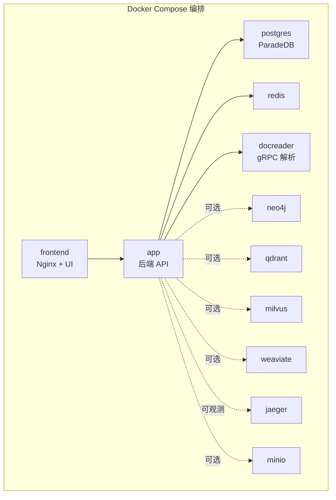
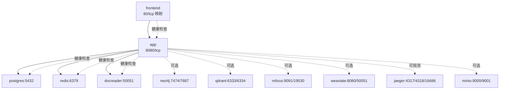
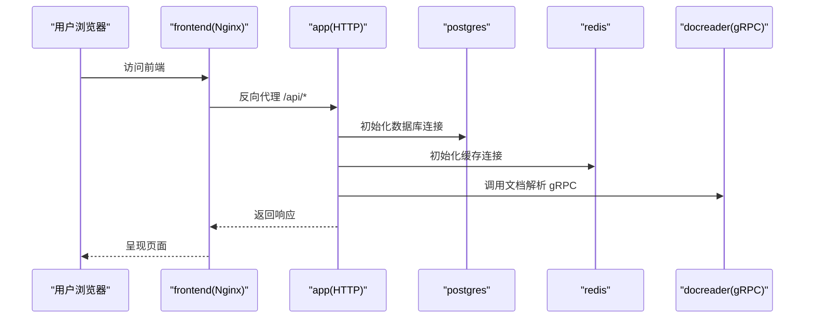
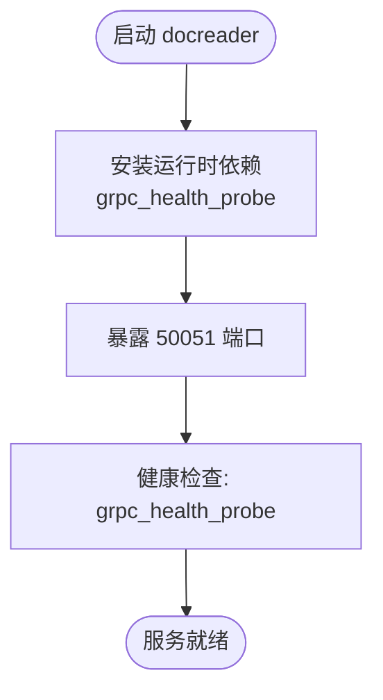
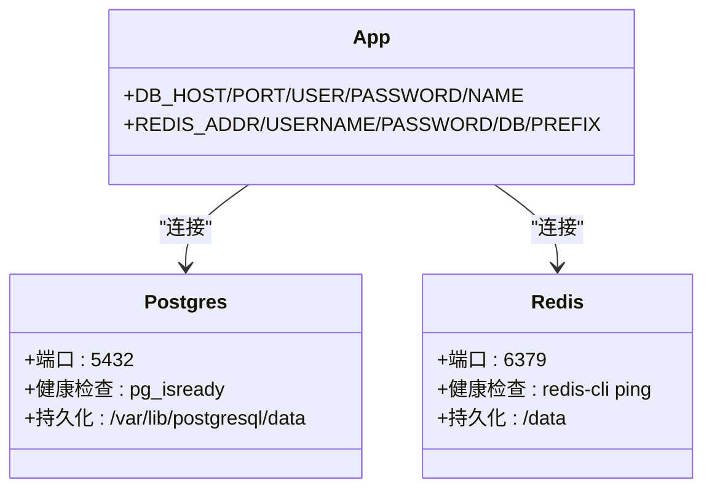
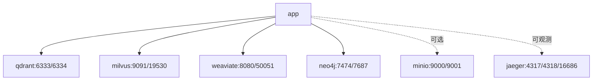
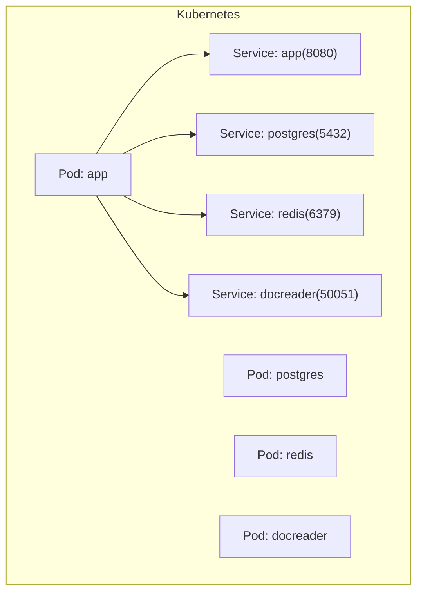
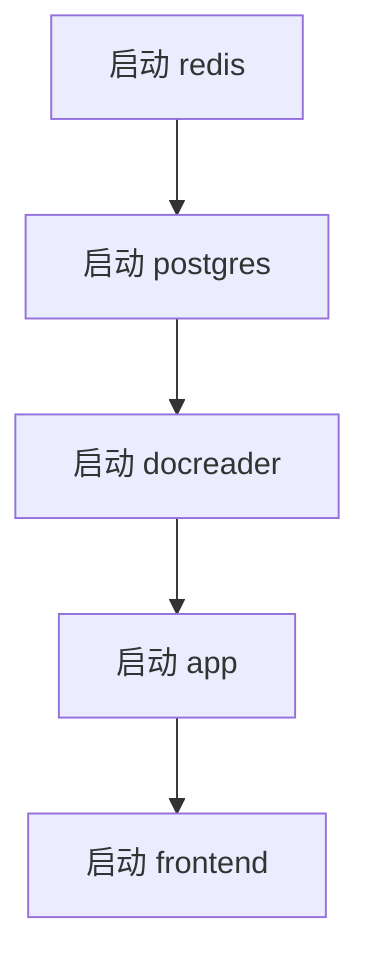

# 服务依赖关系

<cite>
**本文引用的文件**
- [docker-compose.yml](file://docker-compose.yml)
- [docker-compose.dev.yml](file://docker-compose.dev.yml)
- [values.yaml](file://helm/values.yaml)
- [app.yaml](file://helm/templates/app.yaml)
- [postgres.yaml](file://helm/templates/postgres.yaml)
- [redis.yaml](file://helm/templates/redis.yaml)
- [neo4j.yaml](file://helm/templates/neo4j.yaml)
- [docreader.yaml](file://helm/templates/docreader.yaml)
- [config.yaml](file://config/config.yaml)
- [config.go](file://internal/config/config.go)
- [main.go](file://cmd/server/main.go)
- [Dockerfile.docreader](file://docker/Dockerfile.docreader)
</cite>

## 目录
1. [简介](#简介)
2. [项目结构](#项目结构)
3. [核心组件](#核心组件)
4. [架构总览](#架构总览)
5. [详细组件分析](#详细组件分析)
6. [依赖关系分析](#依赖关系分析)
7. [性能考量](#性能考量)
8. [故障排除指南](#故障排除指南)
9. [结论](#结论)
10. [附录](#附录)

## 简介
本文件聚焦 WeKnora 项目中各 Docker 服务之间的依赖关系与交互机制，覆盖应用服务与其他服务的启动顺序与健康检查依赖、数据库与缓存连接、文档解析服务的依赖关系；同时说明服务间网络通信与端口映射规则，给出服务发现与负载均衡的配置思路，并解释故障转移与容错机制，最后提供可视化图表与故障排除指南。

## 项目结构
WeKnora 提供两套编排方案：
- Docker Compose：面向本地与单机部署，定义了完整的后端应用、前端、文档解析、数据库、缓存、向量库、图数据库、可观测性等服务及其网络与卷。
- Helm Chart：面向 Kubernetes 部署，将 Compose 中的核心服务拆分为独立的 Deployment/Service，并通过 Values 控制启停与资源配置。

**图表来源**
- [docker-compose.yml:1-613](file://docker-compose.yml#L1-L613)

**章节来源**
- [docker-compose.yml:1-613](file://docker-compose.yml#L1-L613)
- [docker-compose.dev.yml:1-420](file://docker-compose.dev.yml#L1-L420)

## 核心组件
- 前端服务（frontend）
  - 作用：提供 Nginx + Web UI，反向代理至后端 app 服务。
  - 关键点：通过环境变量 APP_HOST/APP_PORT/APP_SCHEME 指向后端；依赖 app 健康。
- 应用服务（app）
  - 作用：后端 API 服务，负责业务逻辑、检索、流式队列、安全与可观测。
  - 关键点：依赖 redis、postgres、docreader 健康；支持多种向量库与图数据库（可选）。
- 文档解析服务（docreader）
  - 作用：gRPC 文档解析与图片提取服务。
  - 关键点：健康检查使用 grpc_health_probe；被 app 通过 gRPC 调用。
- 基础设施
  - 数据库：postgres（ParadeDB，支持向量与 BM25 搜索）
  - 缓存：redis（流与任务队列）
  - 向量库：qdrant、milvus、weaviate（任选其一或多个）
  - 图数据库：neo4j（GraphRAG 可选）
  - 观测：jaeger（OTLP/Zipkin）
  - 存储：minio（S3 兼容，可选）

**章节来源**
- [docker-compose.yml:2-170](file://docker-compose.yml#L2-L170)
- [docker-compose.yml:173-364](file://docker-compose.yml#L173-L364)
- [docker-compose.yml:200-221](file://docker-compose.yml#L200-L221)
- [docker-compose.yml:222-228](file://docker-compose.yml#L222-L228)
- [docker-compose.yml:299-312](file://docker-compose.yml#L299-L312)
- [docker-compose.yml:314-341](file://docker-compose.yml#L314-L341)
- [docker-compose.yml:342-364](file://docker-compose.yml#L342-L364)
- [docker-compose.yml:278-297](file://docker-compose.yml#L278-L297)

## 架构总览
下图展示服务间的依赖与通信路径，以及健康检查与启动顺序约束。

**图表来源**
- [docker-compose.yml:1-613](file://docker-compose.yml#L1-L613)

**章节来源**
- [docker-compose.yml:1-613](file://docker-compose.yml#L1-L613)

## 详细组件分析

### 前端（frontend）与后端（app）
- 网络与端口
  - 前端：发布宿主端口（默认 80），内部 80 端口；通过环境变量 APP_HOST/APP_PORT/APP_SCHEME 指向后端。
  - 后端：发布 8080 端口，健康检查路径 /health。
- 启动顺序与依赖
  - frontend 依赖 app 健康（depends_on: app condition: service_healthy）。
  - app 依赖 redis 已启动、postgres 健康、docreader 健康。
- 配置要点
  - 前端环境变量包含 APP_HOST、APP_PORT、APP_SCHEME，确保反代正确。
  - 后端环境变量包含数据库、缓存、向量库、图数据库、文档解析器、MinIO、Jaeger 等连接参数。

**图表来源**
- [docker-compose.yml:2-170](file://docker-compose.yml#L2-L170)
- [docker-compose.yml:28-170](file://docker-compose.yml#L28-L170)

**章节来源**
- [docker-compose.yml:2-170](file://docker-compose.yml#L2-L170)
- [config.yaml:1-113](file://config/config.yaml#L1-L113)
- [config.go:69-75](file://internal/config/config.go#L69-L75)

### 文档解析服务（docreader）
- 网络与端口
  - gRPC 端口 50051，健康检查使用 grpc_health_probe。
- 启动顺序与依赖
  - app 依赖 docreader 健康（condition: service_healthy）。
- Dockerfile 特性
  - 运行阶段安装 grpc_health_probe，便于健康检查。
  - 预装 Playwright 以支持网页解析。

**图表来源**
- [Dockerfile.docreader:113-158](file://docker/Dockerfile.docreader#L113-L158)
- [docker-compose.yml:173-196](file://docker-compose.yml#L173-L196)

**章节来源**
- [docker-compose.yml:173-196](file://docker-compose.yml#L173-L196)
- [Dockerfile.docreader:113-158](file://docker/Dockerfile.docreader#L113-L158)

### 数据库与缓存（postgres、redis）
- postgres（ParadeDB）
  - 健康检查使用 pg_isready；端口 5432；持久化存储。
  - app 通过 DB_DRIVER=postgres、DB_HOST/PORT/USER/PASSWORD/NAME 连接。
- redis
  - 健康检查使用 redis-cli ping；端口 6379；持久化存储。
  - app 通过 REDIS_ADDR/USERNAME/PASSWORD/DB/PREFIX 连接。

**图表来源**
- [docker-compose.yml:200-221](file://docker-compose.yml#L200-L221)
- [docker-compose.yml:222-228](file://docker-compose.yml#L222-L228)
- [app.yaml:54-94](file://helm/templates/app.yaml#L54-L94)

**章节来源**
- [docker-compose.yml:200-221](file://docker-compose.yml#L200-L221)
- [docker-compose.yml:222-228](file://docker-compose.yml#L222-L228)
- [app.yaml:54-94](file://helm/templates/app.yaml#L54-L94)

### 可选组件（向量库、图数据库、MinIO、Jaeger）
- 向量库
  - qdrant：REST 6333、gRPC 6334；可选启用。
  - milvus：健康检查 9091、gRPC 19530；可选启用。
  - weaviate：HTTP 8080、gRPC 50051；可选启用。
- 图数据库（neo4j）
  - HTTP 7474、Bolt 7687；GraphRAG 功能依赖。
- MinIO
  - S3 API 9000、控制台 9001；可选启用。
- Jaeger
  - OTLP gRPC 4317/4318、UI 16686、Zipkin 9411 等；可选启用。

**图表来源**
- [docker-compose.yml:299-364](file://docker-compose.yml#L299-L364)

**章节来源**
- [docker-compose.yml:299-364](file://docker-compose.yml#L299-L364)

### Kubernetes（Helm）部署要点
- 组件拆分
  - app、postgres、redis、docreader、neo4j、qdrant、milvus、weaviate、jaeger、minio 等分别作为独立 Deployment/Service。
- 启停控制
  - 通过 values.yaml 中各组件的 enabled 字段控制是否部署。
- 健康检查
  - app：livenessProbe/readinessProbe 检查 /health。
  - postgres/redis/neo4j/docreader：内置健康检查命令。
- 网络与服务发现
  - 各 Service 名称与端口与 Compose 一致，app 通过 Service DNS（如 postgres、redis、docreader）进行服务发现。

**图表来源**
- [values.yaml:53-140](file://helm/values.yaml#L53-L140)
- [app.yaml:182-200](file://helm/templates/app.yaml#L182-L200)
- [postgres.yaml:111-129](file://helm/templates/postgres.yaml#L111-L129)
- [redis.yaml:107-125](file://helm/templates/redis.yaml#L107-L125)
- [docreader.yaml:85-103](file://helm/templates/docreader.yaml#L85-L103)

**章节来源**
- [values.yaml:53-140](file://helm/values.yaml#L53-L140)
- [app.yaml:182-200](file://helm/templates/app.yaml#L182-L200)
- [postgres.yaml:111-129](file://helm/templates/postgres.yaml#L111-L129)
- [redis.yaml:107-125](file://helm/templates/redis.yaml#L107-L125)
- [docreader.yaml:85-103](file://helm/templates/docreader.yaml#L85-L103)

## 依赖关系分析

### 启动顺序与健康检查依赖
- Compose 顺序
  - app 依赖 redis 已启动、postgres 健康、docreader 健康。
  - frontend 依赖 app 健康。
- 健康检查
  - app：/health（HTTP）。
  - postgres：pg_isready。
  - redis：redis-cli ping。
  - docreader：grpc_health_probe。
  - 其他组件：各自健康检查策略。

**图表来源**
- [docker-compose.yml:148-157](file://docker-compose.yml#L148-L157)
- [docker-compose.yml:44-49](file://docker-compose.yml#L44-L49)
- [docker-compose.yml:212-218](file://docker-compose.yml#L212-L218)
- [docker-compose.yml:188-194](file://docker-compose.yml#L188-L194)

**章节来源**
- [docker-compose.yml:148-157](file://docker-compose.yml#L148-L157)
- [docker-compose.yml:44-49](file://docker-compose.yml#L44-L49)
- [docker-compose.yml:212-218](file://docker-compose.yml#L212-L218)
- [docker-compose.yml:188-194](file://docker-compose.yml#L188-L194)

### 网络通信与端口映射
- 前端
  - 宿主端口映射：FRONTEND_PORT:80（默认 80）。
  - 内部 80，反代至 app。
- 后端
  - 宿主端口映射：APP_PORT:8080（默认 8080）。
  - 内部 8080，提供 /health。
- docreader
  - 宿主端口映射：DOCREADER_PORT:50051（默认 50051）。
  - 内部 50051，gRPC。
- 其他组件
  - postgres: 5432；redis: 6379；qdrant: 6333/6334；milvus: 9091/19530；weaviate: 8080/50051；neo4j: 7474/7687；minio: 9000/9001；jaeger: 4317/4318/16686/9411。

**章节来源**
- [docker-compose.yml:9-11](file://docker-compose.yml#L9-L11)
- [docker-compose.yml:36-38](file://docker-compose.yml#L36-L38)
- [docker-compose.yml:181-183](file://docker-compose.yml#L181-L183)
- [docker-compose.yml:290-291](file://docker-compose.yml#L290-L291)
- [docker-compose.yml:332-334](file://docker-compose.yml#L332-L334)
- [docker-compose.yml:355-357](file://docker-compose.yml#L355-L357)
- [docker-compose.yml:289-291](file://docker-compose.yml#L289-L291)
- [docker-compose.yml:233-236](file://docker-compose.yml#L233-L236)
- [docker-compose.yml:256-266](file://docker-compose.yml#L256-L266)

### 服务发现与负载均衡
- Docker Compose
  - 通过服务名（如 postgres、redis、docreader）进行容器内 DNS 解析。
  - 前端通过环境变量 APP_HOST/APP_PORT/APP_SCHEME 指向后端服务。
- Kubernetes（Helm）
  - 通过 Service 名称与 ClusterIP 进行服务发现（如 postgres、redis、docreader）。
  - Ingress 可选开启，用于外部访问（values.yaml 中 ingress.enabled/false）。
- 负载均衡
  - Compose：单实例服务，可通过多副本与外部反向代理实现。
  - Kubernetes：通过 Service ClusterIP/LoadBalancer 与 Ingress 实现。

**章节来源**
- [docker-compose.yml:13-18](file://docker-compose.yml#L13-L18)
- [docker-compose.yml:18-26](file://docker-compose.yml#L18-L26)
- [values.yaml:345-369](file://helm/values.yaml#L345-L369)
- [app.yaml:182-200](file://helm/templates/app.yaml#L182-L200)

### 故障转移与容错机制
- 健康检查失败
  - Compose：服务健康检查失败将导致容器重启；frontend 依赖 app 健康，app 依赖多个上游健康。
- 连接失败与降级
  - 应用层对上游服务（数据库、缓存、向量库、图数据库、MinIO、文档解析器）的连接失败应触发重试与降级策略（例如禁用相关功能或切换到备用驱动）。
- 可观测性
  - Jaeger 支持 OTLP/Zipkin；Langfuse 可选集成（复用 redis/postgres）。
- Graceful Shutdown
  - 后端支持信号捕获与优雅关闭，减少中断影响。

**章节来源**
- [docker-compose.yml:44-49](file://docker-compose.yml#L44-L49)
- [docker-compose.yml:212-218](file://docker-compose.yml#L212-L218)
- [docker-compose.yml:188-194](file://docker-compose.yml#L188-L194)
- [docker-compose.yml:256-266](file://docker-compose.yml#L256-L266)
- [main.go:72-110](file://cmd/server/main.go#L72-L110)

## 性能考量
- 连接池与并发
  - 后端通过环境变量 CONCURRENCY_POOL_SIZE 控制并发池大小。
- 资源限制
  - Helm Chart 中为各组件设置了 CPU/内存请求与限制，建议结合实际负载调整。
- 存储与持久化
  - 数据库与缓存均配置持久化卷，保障数据安全与性能稳定性。
- 向量库选择
  - 不同向量库（qdrant、milvus、weaviate）在性能与特性上不同，应根据场景选择并调优。

[本节为通用指导，无需特定文件引用]

## 故障排除指南
- 健康检查失败
  - 检查 postgres/redis/docreader 的健康检查命令是否可用；确认端口可达与凭据正确。
- 前端无法访问后端
  - 检查 frontend 环境变量 APP_HOST/APP_PORT/APP_SCHEME 是否指向正确的后端服务。
- 文档解析失败
  - 确认 docreader 服务健康；检查 gRPC 地址与传输方式（grpc/http）。
- 向量库/图数据库不可用
  - 检查对应服务的健康检查与端口映射；确认 app 中的连接参数（如 QDRANT_HOST/PORT、NEO4J_URI 等）。
- MinIO/S3 问题
  - 检查 MinIO 端口映射与桶权限；确认存储类型与访问密钥配置。
- 观测性
  - 检查 Jaeger 端口与 OTLP 配置；确认链路追踪导出正常。

**章节来源**
- [docker-compose.yml:11-26](file://docker-compose.yml#L11-L26)
- [docker-compose.yml:69-147](file://docker-compose.yml#L69-L147)
- [docker-compose.yml:188-194](file://docker-compose.yml#L188-L194)
- [docker-compose.yml:212-218](file://docker-compose.yml#L212-L218)
- [docker-compose.yml:256-266](file://docker-compose.yml#L256-L266)

## 结论
WeKnora 的 Docker 服务编排清晰地定义了应用服务与数据库、缓存、文档解析、向量库、图数据库、MinIO、Jaeger 等组件的依赖关系与启动顺序。通过健康检查与服务发现机制，实现了稳定的跨服务通信。在 Kubernetes 环境下，Helm Chart 将这些关系映射为标准的 Deployment/Service 模式，便于规模化部署与运维。建议在生产环境中结合资源配额、健康检查策略与可观测性配置，持续优化性能与可靠性。

[本节为总结，无需特定文件引用]

## 附录
- 开发环境 Compose
  - docker-compose.dev.yml 仅启动基础设施服务，app 与前端在本地运行，便于开发调试。
- 配置文件
  - config.yaml 与 internal/config/config.go 定义了应用配置结构与默认行为，影响服务连接与功能开关。

**章节来源**
- [docker-compose.dev.yml:1-420](file://docker-compose.dev.yml#L1-L420)
- [config.yaml:1-113](file://config/config.yaml#L1-L113)
- [config.go:1-758](file://internal/config/config.go#L1-L758)