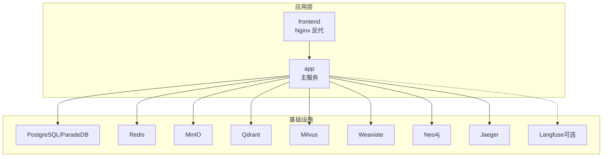
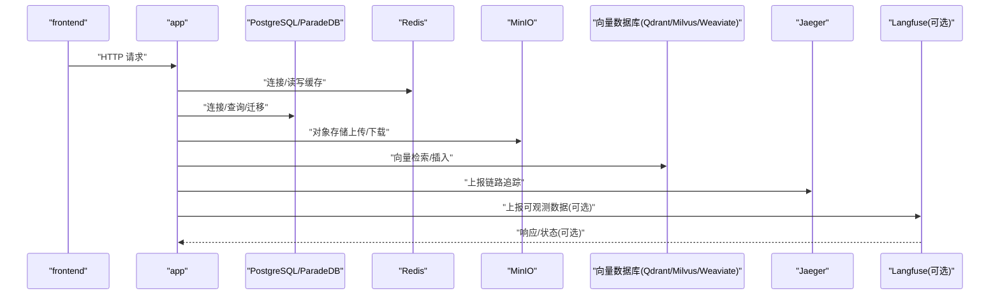
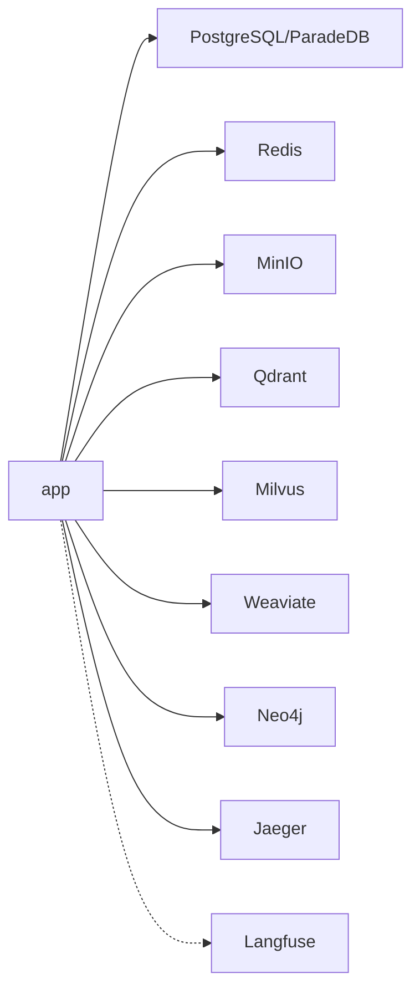

# 环境变量配置

<cite>
**本文引用的文件**
- [docker-compose.yml](file://docker-compose.yml)
- [docker-compose.dev.yml](file://docker-compose.dev.yml)
- [config.go](file://internal/config/config.go)
- [config.yaml](file://config/config.yaml)
- [check-env.sh](file://scripts/check-env.sh)
- [main.go](file://cmd/server/main.go)
- [Dockerfile.docreader](file://docker/Dockerfile.docreader)
- [Dockerfile.sandbox](file://docker/Dockerfile.sandbox)
- [.env.example](file://.env.example)
</cite>

## 目录
1. [简介](#简介)
2. [项目结构](#项目结构)
3. [核心组件](#核心组件)
4. [架构总览](#架构总览)
5. [详细组件分析](#详细组件分析)
6. [依赖关系分析](#依赖关系分析)
7. [性能考量](#性能考量)
8. [故障排查指南](#故障排查指南)
9. [结论](#结论)
10. [附录](#附录)

## 简介
本文件面向使用 Docker 部署 WeKnora 的运维与开发人员，系统梳理应用在容器化运行时所需的关键环境变量，覆盖数据库连接、对象存储、向量数据库、缓存、第三方服务集成、可观测性与安全配置，并给出生产与开发环境的差异化策略及安全最佳实践。

## 项目结构
WeKnora 的 Docker 部署主要由 docker-compose 编排多个服务组成，核心服务包括：
- 应用服务 app：承载业务逻辑与 API，读取大量环境变量进行运行时配置。
- 前端服务 frontend：通过 Nginx 反向代理 app，受 APP_HOST/PORT/SCHEME 等影响。
- 文档解析服务 docreader：提供 gRPC/HTTP 文档解析能力，受 MAX_FILE_SIZE_MB 等控制。
- 基础设施：PostgreSQL/ParadeDB、Redis、MinIO、Qdrant、Milvus、Weaviate、Neo4j、Jaeger、Langfuse（可选）等。

图表来源
- [docker-compose.yml:1-613](file://docker-compose.yml#L1-L613)

章节来源
- [docker-compose.yml:1-613](file://docker-compose.yml#L1-L613)

## 核心组件
本节按功能域拆解环境变量，说明作用、默认值与配置要点，并标注来自编排文件或应用代码的依据。

- 数据库连接参数（PostgreSQL/ParadeDB）
  - DB_DRIVER：驱动类型，固定为 postgres（编排中显式设置）。
  - DB_HOST/DB_PORT/DB_USER/DB_PASSWORD/DB_NAME：数据库主机、端口、用户、密码、库名。
  - 默认值与行为：由编排文件固定注入，应用通过容器间网络访问服务名（如 postgres）。
  - 关联文件
    - [docker-compose.yml:61-66](file://docker-compose.yml#L61-L66)
    - [config.go:394-403](file://internal/config/config.go#L394-L403)

- 存储配置
  - STORAGE_TYPE：存储类型，如 minio、s3、tos 或空（本地）。
  - MINIO_*：当 STORAGE_TYPE=minio 时必需，包含端点、访问密钥、密钥、桶名等。
  - S3_* / TOS_*：当 STORAGE_TYPE=s3/tos 时分别需要对应的端点、区域、AK/SK、桶名。
  - 本地存储：LOCAL_STORAGE_BASE_DIR 指定本地文件基目录。
  - 关联文件
    - [docker-compose.yml:110-116](file://docker-compose.yml#L110-L116)
    - [config.go:394-403](file://internal/config/config.go#L394-L403)

- 向量数据库设置
  - RETRIEVE_DRIVER：检索驱动（可选），用于选择外部检索实现。
  - Elasticsearch：ELASTICSEARCH_ADDR/USERNAME/PASSWORD/INDEX。
  - Qdrant：QDRANT_HOST/PORT/COLLECTION/API_KEY/USE_TLS。
  - Milvus：MILVUS_ADDRESS/COLLECTION/METRIC_TYPE。
  - Weaviate：WEAVIATE_HOST/GRPC_ADDRESS/SCHEME/AUTH_ENABLED/API_KEY。
  - 关联文件
    - [docker-compose.yml:90-109](file://docker-compose.yml#L90-L109)
    - [config.go:77-79](file://internal/config/config.go#L77-L79)

- 缓存配置（Redis）
  - REDIS_ADDR：地址，如 redis:6379。
  - REDIS_USERNAME/PASSWORD/DB/PREFIX：认证、DB索引、键前缀。
  - 关联文件
    - [docker-compose.yml:118-123](file://docker-compose.yml#L118-L123)
    - [config.go:319-327](file://internal/config/config.go#L319-L327)

- 第三方服务集成参数
  - Ollama：OLLAMA_BASE_URL 指向本地或远程 Ollama 服务。
  - DocReader：DOCREADER_ADDR/TRANSPORT（gRPC/HTTP）。
  - Web 搜索：WEBSearch 超时等（参见配置文件）。
  - 关联文件
    - [docker-compose.yml:103-104](file://docker-compose.yml#L103-L104)
    - [docker-compose.yml](file://docker-compose.yml#L117)
    - [config.yaml:754-757](file://config/config.yaml#L754-L757)

- 可观测性与链路追踪
  - OpenTelemetry：OTEL_EXPORTER_OTLP_ENDPOINT、SERVICE_NAME、TRACES/METRICS/LOGS 导出器、PROPAGATORS。
  - Langfuse：LANGFUSE_ENABLED/HOST/PUBLIC_KEY/SECRET_KEY、RELEASE、ENVIRONMENT、队列与采样参数等。
  - 关联文件
    - [docker-compose.yml:69-89](file://docker-compose.yml#L69-L89)
    - [docker-compose.yml:377-594](file://docker-compose.yml#L377-L594)

- 安全与加密
  - JWT_SECRET：用于签发与校验 JWT。
  - TENANT_AES_KEY/SYSTEM_AES_KEY：租户/系统级 AES 密钥，用于敏感字段加密。
  - CRYPTO_MASTER_KEY/CRYPTO_SALT：主密钥与盐值，用于 AppSecret 等字段的 AES-256 加密；未设置时自动生成并持久化。
  - SSRF 白名单：SSRF_WHITELIST 用于放宽 SSRF 校验。
  - 关联文件
    - [docker-compose.yml:129-131](file://docker-compose.yml#L129-L131)
    - [docker-compose.yml:137-138](file://docker-compose.yml#L137-L138)
    - [docker-compose.yml](file://docker-compose.yml#L131)
    - [config.go:505-557](file://internal/config/config.go#L505-L557)

- Agent 与流管理
  - WEKNORA_AGENT_LLM_TIMEOUT：Agent 单次大模型调用超时（秒或时长字符串）。
  - STREAM_MANAGER_TYPE：流管理器类型（memory/redis），配合 Redis 使用。
  - 关联文件
    - [docker-compose.yml](file://docker-compose.yml#L146)
    - [config.go:312-327](file://internal/config/config.go#L312-L327)

- 知识图谱与 Graph RAG
  - ENABLE_GRAPH_RAG：启用图增强检索。
  - NEO4J_*：URI、用户名、密码等。
  - 关联文件
    - [docker-compose.yml:124-128](file://docker-compose.yml#L124-L128)
    - [docker-compose.yml:278-297](file://docker-compose.yml#L278-L297)

- 日志与时区
  - LOG_LEVEL/GIN_MODE：日志级别与框架运行模式。
  - TZ：容器时区。
  - 关联文件
    - [docker-compose.yml:51-69](file://docker-compose.yml#L51-L69)
    - [docker-compose.yml:19-21](file://docker-compose.yml#L19-L21)

- 前端与反向代理
  - FRONTEND_PORT：前端容器对外端口映射。
  - APP_HOST/APP_BACKEND_PORT/APP_SCHEME：前端通过 Nginx 反代 app 的主机、端口与协议。
  - MAX_FILE_SIZE_MB：前端与 docreader 的最大文件大小限制（MB）。
  - 关联文件
    - [docker-compose.yml:8-18](file://docker-compose.yml#L8-L18)
    - [docker-compose.yml](file://docker-compose.yml#L187)
    - [Dockerfile.docreader:1-158](file://docker/Dockerfile.docreader#L1-L158)

- 开发环境差异
  - docker-compose.dev.yml 仅启动基础设施，app/frontend 由本地运行，便于调试。
  - 关联文件
    - [docker-compose.dev.yml:1-420](file://docker-compose.dev.yml#L1-L420)

章节来源
- [docker-compose.yml:50-147](file://docker-compose.yml#L50-L147)
- [docker-compose.dev.yml:4-124](file://docker-compose.dev.yml#L4-L124)
- [config.go:394-403](file://internal/config/config.go#L394-L403)
- [config.yaml:754-757](file://config/config.yaml#L754-L757)
- [Dockerfile.docreader:1-158](file://docker/Dockerfile.docreader#L1-L158)

## 架构总览
下图展示应用服务如何读取环境变量并连接各外部组件，以及可选的 Langfuse 观测栈复用现有 Redis/PostgreSQL 的方式。

图表来源
- [docker-compose.yml:1-613](file://docker-compose.yml#L1-L613)
- [docker-compose.yml:377-594](file://docker-compose.yml#L377-L594)

章节来源
- [docker-compose.yml:1-613](file://docker-compose.yml#L1-L613)

## 详细组件分析

### 数据库连接（PostgreSQL/ParadeDB）
- 作用：提供结构化数据存储与迁移。
- 默认值与行为：编排中固定驱动为 postgres，服务名作为主机名，端口 5432。
- 配置方法：在 .env 中设置 DB_USER/DB_PASSWORD/DB_NAME；若使用远程数据库，需调整 DB_HOST/DB_PORT。
- 安全建议：生产环境使用强口令与只读账户；限制网络访问；启用 TLS（如可用）。

章节来源
- [docker-compose.yml:61-66](file://docker-compose.yml#L61-L66)
- [docker-compose.yml:201-221](file://docker-compose.yml#L201-L221)

### 对象存储（MinIO/S3/TOS）
- 作用：统一的对象存储接口，支持多种后端。
- 默认值与行为：STORAGE_TYPE 为空时使用本地存储；minio 时需提供桶名与凭据。
- 配置方法：按 STORAGE_TYPE 设置对应变量；桶名必填。
- 安全建议：使用只读/受限策略；启用 HTTPS；定期轮换密钥。

章节来源
- [docker-compose.yml:110-116](file://docker-compose.yml#L110-L116)
- [check-env.sh:85-106](file://scripts/check-env.sh#L85-L106)

### 向量数据库（Qdrant/Milvus/Weaviate/Elasticsearch）
- 作用：支撑检索增强生成与知识检索。
- 默认值与行为：编排中预设服务名与端口；可通过环境变量覆盖。
- 配置方法：选择一种或多种，按需设置认证与集合/索引名。
- 安全建议：启用 API Key/TLS；限制访问 IP；定期清理无用集合。

章节来源
- [docker-compose.yml:90-109](file://docker-compose.yml#L90-L109)
- [docker-compose.yml:299-363](file://docker-compose.yml#L299-L363)

### 缓存（Redis）
- 作用：会话、流管理、限流与分布式锁。
- 默认值与行为：默认连接 redis:6379；可选用户名/密码/DB/前缀。
- 配置方法：设置 REDIS_ADDR/USERNAME/PASSWORD/DB/PREFIX。
- 安全建议：启用密码认证；隔离 DB；限制网络访问。

章节来源
- [docker-compose.yml:118-123](file://docker-compose.yml#L118-L123)
- [docker-compose.yml:222-229](file://docker-compose.yml#L222-L229)

### 第三方服务（Ollama、DocReader）
- 作用：本地/远程大模型推理与文档解析。
- 默认值与行为：Ollama 默认指向 host-gateway；DocReader 默认 gRPC 地址与端口。
- 配置方法：OLLAMA_BASE_URL 指向可用服务；DOCREADER_ADDR/TRANSPORT 指向 docreader 服务。
- 安全建议：限制网络访问；启用鉴权（如服务端支持）。

章节来源
- [docker-compose.yml](file://docker-compose.yml#L117)
- [docker-compose.yml:103-104](file://docker-compose.yml#L103-L104)
- [docker-compose.yml:173-198](file://docker-compose.yml#L173-L198)
- [Dockerfile.docreader:1-158](file://docker/Dockerfile.docreader#L1-L158)

### 可观测性（OpenTelemetry、Langfuse）
- 作用：链路追踪与日志采集；Langfuse 提供自建可观测栈。
- 默认值与行为：OTLP 导出器直连 jaeger:4317；Langfuse 可复用现有 Redis/PostgreSQL。
- 配置方法：设置 LANGFUSE_* 变量；或通过 .env.lite 预置。
- 安全建议：生产环境生成强随机密钥与 SALT；限制访问端点。

章节来源
- [docker-compose.yml:69-89](file://docker-compose.yml#L69-L89)
- [docker-compose.yml:377-594](file://docker-compose.yml#L377-L594)
- [docs/Langfuse集成.md:73-96](file://docs/Langfuse集成.md#L73-L96)

### 安全与加密（JWT、AES、SSRF）
- 作用：用户认证、敏感数据加密、请求安全。
- 默认值与行为：未设置时自动生成并持久化；SSRF 白名单为空。
- 配置方法：设置 JWT_SECRET、TENANT_AES_KEY、SYSTEM_AES_KEY、CRYPTO_MASTER_KEY/CRYPTO_SALT、SSRF_WHITELIST。
- 安全建议：生产环境必须重置默认密钥；密钥与 SALT 存储于安全位置；最小权限原则。

章节来源
- [docker-compose.yml:131-138](file://docker-compose.yml#L131-L138)
- [docker-compose.yml:129-131](file://docker-compose.yml#L129-L131)
- [docker-compose.yml](file://docker-compose.yml#L131)
- [config.go:505-557](file://internal/config/config.go#L505-L557)

### Agent 与流管理
- 作用：控制 Agent 调用超时与流式会话管理。
- 默认值与行为：WEKNORA_AGENT_LLM_TIMEOUT 支持秒或时长字符串；STREAM_MANAGER_TYPE 支持 memory/redis。
- 配置方法：设置 WEKNORA_AGENT_LLM_TIMEOUT；如使用 Redis，需配置 REDIS_*。
- 性能建议：根据模型规模与并发调优超时；Redis 模式提升跨实例一致性。

章节来源
- [docker-compose.yml](file://docker-compose.yml#L146)
- [docker-compose.yml:118-123](file://docker-compose.yml#L118-L123)
- [config.go:312-327](file://internal/config/config.go#L312-L327)

### 知识图谱（Neo4j）
- 作用：实体/关系抽取与图增强检索。
- 默认值与行为：默认 bolt://neo4j:7687；用户名/密码可配置。
- 配置方法：设置 NEO4J_ENABLE/URI/USERNAME/PASSWORD。
- 安全建议：启用认证；限制访问端口；备份图数据。

章节来源
- [docker-compose.yml:124-128](file://docker-compose.yml#L124-L128)
- [docker-compose.yml:278-297](file://docker-compose.yml#L278-L297)

### 日志与时区（GIN_MODE、LOG_LEVEL、TZ）
- 作用：控制运行模式、日志级别与时间显示。
- 默认值与行为：GIN_MODE 默认 release；LOG_LEVEL 可选；TZ 默认 Asia/Shanghai。
- 配置方法：设置 GIN_MODE/LOG_LEVEL/TZ。
- 建议：生产环境使用 release 模式与合适的日志级别。

章节来源
- [docker-compose.yml:59-69](file://docker-compose.yml#L59-L69)
- [main.go:44-49](file://cmd/server/main.go#L44-L49)

### 前端与反向代理（APP_HOST/PORT/SCHEME、MAX_FILE_SIZE_MB）
- 作用：前端通过 Nginx 反代后端；限制上传大小。
- 默认值与行为：APP_HOST/app、APP_BACKEND_PORT/SCHEME；前端默认 80 端口。
- 配置方法：设置 FRONTEND_PORT/APP_HOST/APP_BACKEND_PORT/APP_SCHEME/MAX_FILE_SIZE_MB。
- 建议：根据部署域名与协议调整；合理设置上传上限。

章节来源
- [docker-compose.yml:8-18](file://docker-compose.yml#L8-L18)
- [docker-compose.yml](file://docker-compose.yml#L187)

## 依赖关系分析
下图展示 app 服务对各外部组件的依赖关系与关键环境变量。

图表来源
- [docker-compose.yml:1-613](file://docker-compose.yml#L1-L613)
- [docker-compose.yml:377-594](file://docker-compose.yml#L377-L594)

章节来源
- [docker-compose.yml:1-613](file://docker-compose.yml#L1-L613)

## 性能考量
- 向量检索：合理设置 TopK 与阈值，避免过度召回；在高并发场景优先使用 Redis 流管理。
- 缓存命中：为热点数据设置 TTL 与键前缀；避免跨实例冲突。
- 数据库：使用只读副本与连接池；避免长事务；定期维护索引。
- 存储：分层存储与生命周期策略；压缩与去重。
- 网络：服务间使用内网域名与健康检查；限制出口流量。

## 故障排查指南
- 环境变量缺失检查
  - 使用脚本检查必要变量（数据库、存储、Redis、Ollama 等）是否设置。
  - 关联文件
    - [check-env.sh:60-128](file://scripts/check-env.sh#L60-L128)

- 健康检查失败
  - PostgreSQL/Redis/MinIO/Qdrant/Milvus/Weaviate/Neo4j/Jaeger 等均配置了健康检查，失败时查看对应日志与端口映射。
  - 关联文件
    - [docker-compose.yml:212-221](file://docker-compose.yml#L212-L221)
    - [docker-compose.yml:242-247](file://docker-compose.yml#L242-L247)
    - [docker-compose.yml:325-331](file://docker-compose.yml#L325-L331)
    - [docker-compose.yml:442-447](file://docker-compose.yml#L442-L447)
    - [docker-compose.yml:500-508](file://docker-compose.yml#L500-L508)

- DocReader 无法连接
  - 确认 DOCREADER_ADDR/TRANSPORT 与端口映射；检查 gRPC 健康探针。
  - 关联文件
    - [docker-compose.yml:103-104](file://docker-compose.yml#L103-L104)
    - [docker-compose.yml:188-193](file://docker-compose.yml#L188-L193)
    - [Dockerfile.docreader:113-135](file://docker/Dockerfile.docreader#L113-L135)

- Langfuse 初始化失败
  - 确认数据库存在且可连接；Langfuse 复用现有 Redis/PostgreSQL，注意 DB 名与密码编码。
  - 关联文件
    - [docker-compose.yml:397-427](file://docker-compose.yml#L397-L427)
    - [docker-compose.yml:500-511](file://docker-compose.yml#L500-L511)
    - [docker-compose.yml:562-577](file://docker-compose.yml#L562-L577)

章节来源
- [check-env.sh:60-128](file://scripts/check-env.sh#L60-L128)
- [docker-compose.yml:188-193](file://docker-compose.yml#L188-L193)
- [docker-compose.yml:397-427](file://docker-compose.yml#L397-L427)
- [docker-compose.yml:500-511](file://docker-compose.yml#L500-L511)
- [docker-compose.yml:562-577](file://docker-compose.yml#L562-L577)
- [Dockerfile.docreader:113-135](file://docker/Dockerfile.docreader#L113-L135)

## 结论
WeKnora 的 Docker 部署通过丰富的环境变量实现灵活配置，涵盖数据存储、向量检索、缓存、可观测性与安全等关键领域。生产环境应严格遵循最小权限、强口令与密钥轮换等安全实践，并结合实际负载对检索阈值、超时与缓存策略进行调优。

## 附录

### 生产环境与开发环境配置策略
- 生产环境
  - 固定 STORAGE_TYPE 与桶名；启用 TLS 与只读策略。
  - 设置强 JWT_SECRET、AES 密钥与 CRYPTO_MASTER_KEY/CRYPTO_SALT。
  - 启用 Langfuse 并复用现有 Redis/PostgreSQL。
  - 限制 SSRF 白名单范围。
- 开发环境
  - 使用 docker-compose.dev.yml 仅启动基础设施，本地运行 app/frontend。
  - 可使用默认密钥与弱密码进行快速验证，但不应用于生产。

章节来源
- [docker-compose.yml:1-613](file://docker-compose.yml#L1-L613)
- [docker-compose.dev.yml:1-420](file://docker-compose.dev.yml#L1-L420)

### 环境变量安全最佳实践
- 密钥管理
  - 使用专用密钥管理服务（如 KMS/HashiCorp Vault）或 Docker Secrets。
  - 定期轮换 JWT_SECRET、AES 密钥与 SALT。
- 最小权限
  - 对象存储使用只读/受限策略；数据库使用专用账户。
- 网络隔离
  - 仅开放必要端口；使用内网域名访问；限制出口流量。
- 日志与审计
  - 生产环境记录必要的审计日志；避免在日志中泄露敏感信息。

章节来源
- [docs/Langfuse集成.md:84-96](file://docs/Langfuse集成.md#L84-L96)
- [docker-compose.yml:131-138](file://docker-compose.yml#L131-L138)